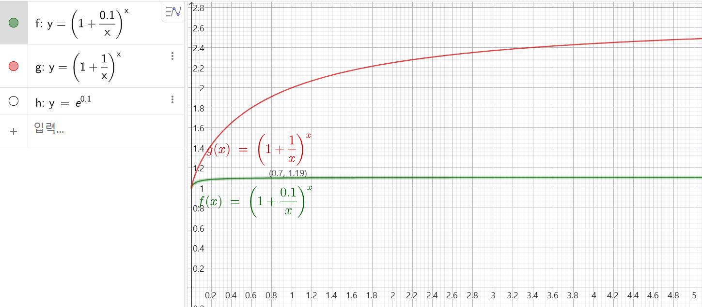

# 0.0 이산에서 연속으로

## 1. 옵션이란
### 1.1 만기 pay-off

옵션이 특별한 이유는?

권리만 있기 때문이다.

무슨 소리냐?

예를 들어 내가 1,000콜을 가지고 있다면

만기 때 주가가 1,200으로 올랐을 때 

1,000콜은 이 주식을 1,000원에 살 수 있는 권리이니까 

나는 200원이 이익이다.

즉, 옵션에서 200원의 pay-off가 발생했다고 한다.

반대로 800으로 내렸다면

나는 이 옵션을 행사하지 않으면 그만이다.

그러면 pay-off는 0이고 따라서 손해가 없다.

만기 T에 콜 옵션의 가치 C_T는

그 때의 pay-off 만큼일텐데 

이를 수식으로 적어보면 

만기 때 주가 S_T에서 행사가 K를 뺀 것과 0중 큰 값이 된다. 

$$C_T = max(S_T - K, 0)$$

주가를 x축,

옵션의 pay-off를 y축으로

1,000콜의 pay-off를 그려보면

이렇게 오른쪽 손을 든 모양이 된다.

<iframe src="contents/black_scholes_equation_01/sec_01/assets/diagrams/sub_01_16_visual1.html" width="100%" height="600px" frameborder="0" scrolling="yes"></iframe>

보유하고 있는 옵션은 복권처럼 

최악의 경우가 꽝이지 추가적인 손실은 없는데

이런 옵션을 얼마에 사고 팔아야 할까? 

저자의 이름을 딴 CRR(Cox-Ross-Rubinstein) 모형 논문을 따라 

이산에서 연속으로 나아가면서 

블랙-숄즈 방정식을 

차근차근 설명해 보겠다.

---
## 2. 복제포트폴리오

그런데 이런 손실이 없는 pay-off를 

주식과 채권으로 복제를 할 수 있다.

주식과 채권은 시장에서 거래가 되어

그 가격을 알 수 있으므로

옵션도 그 정도의 가격이어야 합리적일 것이다.

주식 S의 상승 비율을 u, 

하락 비율을 d라고 하면

1기간 후 주식 S는 u 곱하기 S와 

d 곱하기 S가 된다.

채권 B는 1기간 후에 이자만큼 늘어 

항상 B(1+r)이 된다.

주식 S를 기초자산으로 하는 옵션은

만기 때 uS - K 또는 dS - K가 된다.

편의상 주가가 올랐을 때의 

옵션의 가치를 C_u로,

내렸을 때로 C_d로 두겠다.

주식 S를 델타 주만큼 사고

채권발행으로 B만큼 빌리면

이 포트폴리오의 만기 현금흐름이 옵션과 같다고 하면 

주가가 올랐을 때 

$$ \Delta (uS) + B (1+r) = C_u $$

주가가 내렸을 때 

$$ \Delta (dS) + B (1+r) = C_d $$

이 된다.

식이 2개고 미지수가 델타, B로 2개 이므로

이 둘을 연립방정식으로 풀면 

델타와 B를 알 수 있다.

$$\Delta = \dfrac{C_u - C_d}{(u - d)S}$$

$$B = \dfrac{u C_d - d C_u}{(u - d)(1+r)}$$

방정식 풀이는 다음과 같습니다. 

<iframe src="contents/black_scholes_equation_01/sec_0/assets/diagrams/2delta_B.html" width="100%" height="750px" frameborder="0" scrolling="yes"></iframe>

지금까지의 결론은

상승,하락하는 주식을 

기초자산으로 하는 옵션은

주식을 델타주만큼 사고 

채권발행으로 B만큼 현금을 조달하면

옵션과 동일한 만기 현금흐름을 갖는 

포트폴리오를 만들 수 있는 것이다.

이렇게 주식과 채권으로 구성된 포트폴리오를 

"복제 포트폴리오"라고 부른다.

복제 포트폴리오는 만기 때 옵션의 가치를 복제했으므로 

현재의 가치도 같아야 한다.

따라서 옵션의 현재가격 C는

복제 포트폴리오의 현재가격 

즉, 구축 비용과 같아야 한다. 

그러니까 B만큼 빌려와 

현재, 제로 시점의 가격이 S_0인 주식을 델타주만큼 살 때

부족한 금액이 옵션의 현재가격 C가 된다.

$$ C =  \Delta * S_0 + B $$  

만약, 이 둘의 가격이 다르다면 

더 싼 걸 사고 

비싼 걸 파는

차익거래가 가능하기 때문에

결국 옵션과 복제 포트폴리오의 가격은 같아질 수밖에 없다.

앞에서 구한 델타와 B를 $C$에 대입하여 정리하면 다음과 같은 공식을 얻는다. 

$$ C = \left[ \frac{C_u - C_d}{(u - d)S_0} \right] S_0 + \frac{u C_d - d C_u}{(u - d)(1+r)} $$

이것을 $C_u, C_d$에 대해 정리하면 다음과 같다.

$$ C = \frac{1}{1+r} \left[ ( \frac{(1+r)  - d}{u - d} ) C_u + ( \frac{u - (1+r)}{u - d} ) C_d \right] $$

그 과정은 다음과 같습니다. 

<iframe src="contents/black_scholes_equation_01/sec_0/assets/diagrams/3Cu_Cd.html" width="100%" height="750px" frameborder="0" scrolling="yes"></iframe>

---
## 3. 위험중립확률 $p$
### 3.1 계수의 재해석

방금 얻은 식에서 C_u에 곱해진 계수를 p라고 하면

p의 요소 다시 상기해보면 

d와 u는 주식의 상승, 하락 비율이었으므로

원리금인 (1+r)은 둘 사이에 존재한다.

$d < (1+r) < u$

왜냐하면 우리가 주식에 투자할 때는

d만큼 원금이 줄어들 수도 있지만

u만큼 불어나는 것을 기대하고 투자하는 것이기 때문에

고정된 이자를 주는 예금같은 상품보다 

수익률이 낮은 주식은 고려 대상이 아니다.

이 관계 때문에

C_u에 곱해진 계수는 

0과 1 사이의 값을 갖는다.

왜냐하면 d에서 u만큼 떨어진 거리에서

(1+r)이 d에 얼마나 떨어져 있는지를 

비율로 나타낸 것이기 때문다.

(1+r)이 u에 가까울수록 이 비율은 1에 가까워 진다.

또 첫번째 항의 p를 나머지 항과 

합하면 그 값이 1이 된다.

따라서 p와 나머지 계수를 확률로 생각할 수 있다.

진짜 1이 되는지는 다음 계산을 참고하자

<iframe src="contents/black_scholes_equation_01/sec_0/assets/diagrams/4RiskNutralProbability.html" width="100%" height="750px" frameborder="0" scrolling="yes"></iframe>

그런데 p가 확률이라면 어떤 확률일까?

### 3.2 위험 중립 확률

확률 $p$를

이자 부분과 주식 부분으로 구분하고 

양변에 현재의 주가 S_0를 곱하면 

이런 등식이 성립한다.
$$
S_0(1+r) = p \cdot uS_0 + (1-p) \cdot dS_0
$$

식 전개는 다음을 참고하자.

<iframe src="contents/black_scholes_equation_01/sec_0/assets/diagrams/5meaning_of_p.html" width="100%" height="750px" frameborder="0" scrolling="yes"></iframe>

수식의 의미는 

주가 $S_0$를 이자율 r로 증식한 것과

주식은 올라서 이익을 볼 수도, 

내려서 손실을 볼 수도 있는데 

상승 확률$p$를 잘 선택하면 

이 둘을 같게 만들 수 있다는 의미입니다.

<iframe src="contents/black_scholes_equation_01/sec_01/assets/diagrams/sub_01_13_visual1.html" width="100%" height="520px" frameborder="0" scrolling="yes"></iframe>

실제라면 확정적인 이자를 주는 좌변을 더 선호하겠지만

위험중립 세상에서는 이 둘을 차별하지 않는다. 

따라서, 위험에 중립적이라는 것은 

위험에 대한 회피 심리가 없는 것을 말하고

이때의 확률$p$를 위험중립확률$p$라고 합니다.

지금까지 복제포트폴리오의 계수를

확률로 볼 수 있고

그 확률은 확정적인 이자와

등락이 있는 주식의 기대값을 같게 만드는 상승확률이었습니다.

사람들은 다 위험 회피 성향이 있기 때문에 

이런 확률이 익숙하지 않은데

다음의 공식을 통해 

위험중립의 의미를 한번 더 음미해 보세요~

$$\underbrace{S_0(1+r)}_{\text{이자율로 증식}} = \underbrace{p}_{\text{확률}}\underbrace{uS_0}_{값}+\underbrace{(1-p)}_{\text{확률}}\underbrace{dS_0}_{\text{값}}$$

---
## 4. 기대값꼴

다시 복제 포트폴리오로 돌아와보면

$$ C = \frac{1}{1+r} \left[ ( \frac{(1+r)  - d}{u - d} ) C_u + ( \frac{u - (1+r)}{u - d} ) C_d \right] $$

위험중립확률p를 사용해 
($\frac{(1+r)  - d}{u - d}$)

이렇게 확률에 값을 곱한 기대값꼴로 정리할 수 있었다.

$$ C = \frac{1}{1+r} [ p C_u + (1-p) C_d ]$$

즉, 복제 포트폴리오에서는

만기 때 pay-off가 같으면 

현재 둘의 가격이 같아야 한다는

'무차익 조건'을 썼는데

결과적으로 

위험을 전혀 신경 쓰지 않는 

가상 세계의 기대값'을 구하는 것으로 이어졌습니다.

옵션의 가격을 복제 포트폴리오로 구하는 것과

위험중립확률로 구한 기대값을 현재가치로 할인하는 것이

동일한 결과를 가져온다는 것을 알 수 있습니다. 

이것이 무슨 의미인가하면

옵션의 가격을 구하기 위해

매번 복제 포트폴리오를 구성할 필요없이

위험중립확률과 

값에 각 확률을 곱하는 기대값, 

현재가치로 할인을 이용해

바로 구할 수 있는 장점이 있다는 것이고

무엇보다 1기간이 아니라 

n기간까지 쉽게 일반화할 수 있다는 것입니다.

다음으로 2기간으로 확대하는 과정을 살펴보겠습니다.

## 5. 2회로 확대

상승, 하락의 이항 모형을

1기간에서 2기간으로 확대하면

도착할 수 있는 목적지가

총 3곳입니다.

상승하고 하락하나

하락하고 상승하나 

같은 곳에 도착하기 때문입니다.

결국 언제 상승하는가가 아니라

이항 모형에서는

상승아니면 하락이기 때문에

상승하는 횟수가 같으면 

같은 곳에 도착하게 됩니다.

옵션의 가격을 구하기 위해서는

각 도착점에서의 확률과 값을 알아야 합니다.

상승 확률 p, 

하락 확률은 자동으로 1-p

주식 S의 현재가격은 $S_0$

주식 S의 1기간 상승률은 u, 

하락률은 d로 

그리고, 콜 옵션C의 행사가격은 K로 

설정하자.

상승하는 횟수가 같으면 

같은 곳에 도착하기 때문에 

여기는 상승, 상승으로 

확률은 p 곱하기 p 따라서 p의 제곱

여기는 상승, 하락

또는 하락, 상승으로 도착하니까

확률은 p 곱하기 (1-p)

여기는 하락, 하락으로 도착하니까

(1-p) 곱하기 (1-p) 

따라서 (1-p)의 제곱이됩니다.

단순 확률은 이러한데

두 번 모두 상승을 뽑아야만 

도착할 수 있는 

맨 위나 맨 아래 지점과 달리 

중간 지점은 둘 중 한 번만 상승을 뽑아도 

도착할 수 있으니까

상승 후 하락, 

또는 하락 후 상승

이렇게 두 가지 경우가 가능하므로

확률을 한 번 더 더해야 하고 

이것을 곱하기 2로 적겠습니다.

맨 위 아래도 경우의 수 1을 적겠습니다.

이 확률에 곱해지는 1, 2, 1이라는 

숫자는 조합으로 구할 수 있습니다.

상승, 하락 2개의 화살표가 들어있는 주머니 2개에서

모두 상승을 뽑을 경우의 수인

2C2

아무 주머니에서나 한번만 상승을 뽑을 경우의 수인

2C1

한번도 상승을 뽑지 못할 경우의 수인

2C0과 같습니다.

조합에 대해 잠깐 설명하면

5명의 후보중 3명의 대표를 뽑는 경우의 수가

바로 5C3이고

계산은 
$$
\frac{5!}{2!3!} = 10
$$
인입니다.

식의 의미는 

5명 모두를 순서있게 나열하는 경우의 수인 5!을

뽑히지 않는 2명을 제거하기 위해 2!로 나누고

뽑은 3명의 뽑힌 순서를 고려하지 않기 위해 

다시 3!로 나눕니다.

뽑은 3명의 순서를 고려하면

ABC, ACB, BAC, BCA, CAB, CBA

총 6가지 경우가 생기는데 

3!로 나누면 6이 1이 되는 식입니다.

조합을 계산하는 방법까지 알아봤는데

수식으로는 2C1이 아니라 

2와 1을 세로로 적고
$\binom{2}{1}$

괄호로 묶어주는 기호를 사용하겠습니다.

이것은 "2 choose 1"이라고 읽습니다.

다시 본론으로 돌아와 보면

앞서, 옵션의 가격을 구하기 위해서는

각 도착점에서의 확률과 값을 알아야 한다고 했는데

1기간 콜옵션 가격식을 다시 보면
$$ C = \frac{1}{1+r} [ p C_u + (1-p) C_d ]$$

이제 각 지점에서의 값

즉, 옵션의 pay-off를 구해야 합니다.

그러면 기초자산인 주식 S_0의 2기간 후인 S_2 값을 알아야 합니다.

맨 위 지점은 두번 상승해야 하므로 u^2S_0가 됩니다.

100이 10%씩 두번 상승하면 121이 될텐데

이는 1.1 곱하기 1.1 

즉, 1.21에 100을 곱해서 구하는 것과 같습니다.

같은 방식으로 계속 구하면

udS_0, d^2S_0가 됩니다.

옵션의 pay-off는 

행사가격을 넘는 부분만이므로

주가 S_2에 행사가격 K를 빼줍니다.

이때 음수는 0으로 처리해야 하므로

max연산자를 사용합니다.

$C_{uu} = max(u^2S_0 - K, 0)$

1기간 콜옵션 가격식을 염두하고 
$$ C = \frac{1}{1+r} [ p C_u + (1-p) C_d ]$$

지금까지 구한 값들로 분모인 기대값꼴로 정리해 봅시다.

$1 \cdot p^2 max(u^2S_0 - K, 0) + 2 \cdot p(1-p) max(udS_0 - K, 0) + 1 \cdot (1-p)^2 max(d^2S_0 - K, 0)$

최종적으로 (1+r)^2을 나눠주면 
$(\frac{1}{1+r})^2$

2기간일 때 콜 옵션 가격을 구하는 식이 완성됩니다.

$$ C_0 = \frac{1}{(1+r)^2} \left[ 1 \cdot p^2 max(u^2S_0 - K, 0) + 2 \cdot p(1-p) max(udS_0 - K, 0) + 1 \cdot (1-p)^2 max(d^2S_0 - K, 0) \right]$$

## 6. n회로 일반화

이제 기간을 더 확대해 

n기간으로 일반화를 해 봅시다.

앞서 구한 식에 

포함되어 있는 숫자 2가 

2기간의 2인건지 2번 상승의 2인건지를 

잘 구분해서

기간은 n으로 상승횟수는 j로 바꾸는 것이

바로 일반화하는 것입니다.

먼저 분모의 할인 기간 2는 기간에 비례하므로 n입니다.

첫번째 1은 n choose j에서 j가 2일 때니까

n choose j=2로 적겠습니다.

상승확률 p에 곱해진 숫자들은

상승횟수 j이므로

j=2, j=1, j=0으로 바꿔줍니다.

하락확률 (1-p)에 곱해진 숫자들은 

하락횟수 n-j이므로

n-j=0, n-j=1, n-j=2로 바꿔줍니다.

j가 한번 더 상승하지 못한 0부터

2기간 모두 상승한 2까지 순차적으로 반영했더니

이런 식이 됐습니다.

$$ C_0 = \frac{1}{(1+r)^n} \left[ \binom{n}{j} p^{j} max(u^jS_0 - K, 0) + \binom{n}{j} p^{j}(1-p)^{n-j} max(u^jd^{n-j}S_0 - K, 0) + \binom{n}{j} (1-p)^{n-j} max(d^{n-j}S_0 - K, 0) \right]$$

결국, 상승횟수j를 

0부터 2기간의 2까지 바꿔가며 

합해주는 것을 n기간으로 

확대하는 것이 일반화하는 방법입니다.

수학 기호로는 

j=0부터 n까지의 합으로 

바꿔 적습니다.

$\sum_{j=0}^{n}$

그러면 복잡했던 식이 이렇게 간단해 집니다.

$$ C_0^{n} = \frac{1}{(1+r)^n} \left[ \sum_{j=0}^{n} \binom{n}{j} p^{j}(1-p)^{n-j} \cdot max(u^jd^{n-j}S_0 - K, 0) \right]$$

우리는 $n$기간 모델의 옵션 가격을 

단 한 줄의 수식으로 산출해 내는 

아름다운 CRR(Cox-Ross-Rubinstein) 공식을 유도했습니다.

대수 뒤에 담겨있는

각 항의 의미는 잊지 맙시다.

$$ C_0^{n} = \underbrace{\frac{1}{(1+r)^n}}_{\text{할인 계수}} \left[ \sum_{j=0}^{n} \underbrace{\binom{n}{j} p^{j}(1-p)^{n-j}}_{\text{각 지점의 확률}} \cdot \underbrace{max(u^jd^{n-j}S_0 - K, 0)}_{\text{각 지점에서의 옵션 pay-off}} \right]$$

유도한 과정을 한번 더 돌아보면

우리는 옵션의 pay-off와 같은

복제 포트폴리오를 만들어

무차익 거래는 없다는 

1물 1가의 법칙을 적용해

1기간 콜 옵션의 가격을 구했습니다.

여기에 위험 중립 확률p를 도입해

확률 곱하기 값이라는

기대값꼴로 간단하게 정리할 수 있었고

이항정리라는 수학적 아이디어를 적용해 

1기간, 2기간, 

나아가 n기간까지 일반화했습니다.

## 7. 이산버전 BSM
### 7-1. max 연산자 없애기

$$ C_0^{n} = \frac{1}{(1+r)^n} \left[ \sum_{j=0}^{n} \binom{n}{j} p^{j}(1-p)^{n-j} \cdot max(u^jd^{n-j}S_0 - K, 0) \right]$$

max 연산자 안을 보면

만기 때 주가에서 행사가격을 빼는 구조인데

max가 있으면 분배법칙을 쓸 수 없습니다.

왜냐하면 pay-off가 이렇게 꺾여있어 

선형성이 깨져버렸기 때문이죠.

그런데 pay-off가 0인 부분은 

확률과 곱해도 0이니까 

계산할 필요가 없습니다.

그렇다면 만기 때 주가가 

행사가격을 넘을 때 필요한

최소한의 상승횟수a를 알 수 있다면

즉, 다음 부등식을 만족시키는 a를 찾을 수 있다면
$u^ad^{n-a}S_0 - K > 0$

그래서 j=0부터가 아니라 j=a부터 더한다면 

만기 때 주가에서 행사가격을 뺀 값

즉, S_T -K가

음수가 되는 경우가 없으니까

max 연산자를 사용할 필요가 없습니다.

a는 다음과 같이 구할 수 있습니다.

$$S_0 u^a d^{n-a} \ge K \implies a = \left\lceil \frac{\ln(K / S_0 d^n)}{\ln(u/d)} \right\rceil$$

더 자세한 풀이는 다음을 참고하세요

<iframe src="contents/black_scholes_equation_01/sec_0/assets/diagrams/6solution_a.html" width="100%" height="750px" frameborder="0" scrolling="yes"></iframe>

### 7-2. max가 사라진 식 정리

그러면 앞에서 구한 a를 사용해 max연산자가 사라진 n기간 옵션 가격을 구하는 식은 다음과 같습니다.

$$C_0^{n} = \frac{1}{(1+r)^n} \left[ \sum_{j=\color{red}{a}}^{n} \binom{n}{j} p^{j}(1-p)^{n-j} \cdot (u^jd^{n-j}S_0 - K) \right]$$

이 식을 전개하고 $p'$를 도입하면

$$p' \equiv p \cdot \frac{u}{1+r}$$

다음과 같이 정리됩니다.

$$C = S_0 \sum_{j=a}^{n} \binom{n}{j} (p')^j (1-p')^{n-j} - K(1+r)^{-n} \sum_{j=a}^{n} \binom{n}{j} p^j (1-p)^{n-j}$$

시그마 기호를 매번 쓰는 번거로움을 덜기 위해, 

통계학에서 널리 쓰이는 

**누적 이항분포 함수(Cumulative Binomial Distribution Function) 기호인 $\Phi$**를 도입합니다.

$$\Phi(a; n, p) = \sum_{j=a}^{n} \binom{n}{j} p^j (1-p)^{n-j}$$

이 기호를 사용하여 최종적으로 도출해 낸 **'CRR n기간 옵션 가격 공식'**은 다음과 같습니다.

$$C = S_0 \cdot \Phi(a; n, p') - K(1+r)^{-n} \cdot \Phi(a; n, p)$$

더 자세한 풀이는 다음을 참고하세요

<iframe src="contents/black_scholes_equation_01/sec_0/assets/diagrams/7discBSM.html" width="100%" height="750px" frameborder="0" scrolling="yes"></iframe>

### 7-3. BSM과의 비교

이항 모델의 n을 무한대로 보내면

다음과 같이 연속 모델인 블랙-숄즈 모델과 같아집니다.

| 모델 | 공식 구조 |
| :---: | :---: |
| **이항 모델 (CRR)** | $C = S_0 \cdot \mathbf{\Phi(a; n, p')} - K(1+r)^{-n} \cdot \mathbf{\Phi(a; n, p)}$ |
| **연속 모델 (Black-Scholes)** | $C = S_0 \cdot \mathbf{N(d_1)} - K e^{-rt} \cdot \mathbf{N(d_2)}$ |

두 공식을 나란히 대조해 보면, 

$S_0$에 곱해지는 확률인 $\Phi(a; n, p')$는 

블랙-숄즈의 $N(d_1)$과 대응됩니다. 

이는 만기 시점에 주가가 

행사가격보다 높아 옵션이 행사될 때, 

"그 시점에 도달할 기대 주가의 현재가치"를 

가중하는 조정 확률입니다. 

$K$의 현재가치에 곱해지는 확률인 $\Phi(a; n, p)$는 

블랙-숄즈의 $N(d_2)$와 대응됩니다. 

이는 "만기에 실제로 권리를 행사하여 

행사가격 $K$를 지불하게 될 실제 확률"

즉, 내가격 마감 확률을 뜻합니다.

### 7-4. (부록) p'의 물리적 의미

그런데 앞에서 p는

위험중립확률이었는데

p'는 뭘까요?

콜옵션이 "현금($K$)을 주고 

주식($S$)을 받는 계약"이기 때문에, 

현금 파트를 계산할 때는 

현금을 기준(확률 $p$)으로 보고, 

주식 파트를 계산할 때는 

주식을 기준(확률 $p'$)으로 보는 분리가 자연스럽게 발생합니다.

현금 기준에서 주가의 기대성장률이 

$1+r = pu + (1-p)d$ 였다면, 

주식 기준에서 현금의 가치 변화율은 

역수가 취해진 

$$\frac{1}{1+r} = p'\left(\frac{1}{u}\right) + (1-p')\left(\frac{1}{d}\right)$$

 로 완벽하게 대칭을 이룹니다.

왜 그런고하니

앞서, 주식을 기준(확률 $p'$)으로 본다는 말은

"원화(현금)" 대신 "주식"이 화폐인 세상을 

가정한다는 것입니다.

이제는 주식이 화폐이고, 

현금(1원)이 가격이 변하는 투자 자산이 됩니다.

주식 1주의 관점에서 볼 때

주가가 $u$배로 오르면, 

상대적으로 현금의 가치는 

$\frac{1}{u}$로 하락한 것입니다.

주가가 $d$배로 떨어지면, 

상대적으로 현금의 가치는 

$\frac{1}{d}$로 상승한 것입니다.

현금이 투자 자산이 된다면

$t=1$ 시점에 채권에서 나온 현금 $(1+r)$원으로 

주식을 다시 산다면 몇 주나 살 수 있을까요?

주가가 u배 오른 경우

주식이 비싸지니까 

현금(1+r)로 살 수 있는 주식은

$\frac{1+r}{u}$주로 줄어듭니다.

반대로 주가가, d배 내린 경우

주식이 싸지니까 

현금(1+r)로 살 수 있는 주식은

$\frac{1+r}{d}$주로 늘어납니다.

여기에 주가 상승 확률 p'와 (1-p')를 곱해주면 

다음과 같이 적을 수 있습니다.

$$1 = p' \cdot \left( \frac{1+r}{u} \right) + (1-p') \cdot \left( \frac{1+r}{d} \right)$$

확률 곱하기 값이니까 

기대값으로 표현하면

$t=1$ 시점에 채권 원리금을 주식으로 환전했을 때

주식 기준 기대 수량 $\mathbb{E}^{Q^S} \left[ \frac{B_1}{S_1} \right]$

로 나타낼 수 있습니다.

대괄호 안 B_1은 

n=1 기간에 채권의 원리금이고

분모는 주식 1주가 줄어든 경우 u배, 

늘어난 경우 d배로 변한 주식의 가치입니다.

채권이 1+r로 늘었을 때를

주식 단위로 환산하고

거기에 각 발생확률을 곱한 기대값 식입니다.

기준 자산이 주식이라 p'를 사용했다는 의미로

메져를 뜻하는 Q위에 주식 S를 붙였습니다.

결국 이 식은 "오늘 주식 1주를 투자해서 채권을 샀다면, 

1년 뒤 돌려받는 현금을 주식으로 다시 바꾼 기대값도 

정확히 1주여야 한다"는 뜻입니다. 

즉, "무위험 차익거래 부재"라는 뜻입니다.

앞서 주식을 기준으로 보고

주식 한 단위 당 채권 가격에 확률을 곱한 식은 

더 깊은 수학적 의미가 있는데

주가 $S_t$를 기준 자산(누메레르, Numeraire)으로 사용하는 

주식 측도(Stock Measure) $\mathbb{Q}^S$ 하에서는, 

주가로 할인한 자산 가격이 마팅게일(Martingale) 성질을 만족합니다.

즉, 채권 가격 $B_t$의 주가 대비 상대 가치는 

다음과 같이 기대값 형태로 표현됩니다:

$$\frac{B_0}{S_0} = \mathbb{E}^{\mathbb{Q}^S} \left[ \frac{B_1}{S_1} \right]$$

이때 기존 무위험 측도 $\mathbb{Q}$에서 

새로운 측도 $\mathbb{Q}^S$로 

확률측도를 전환할 때 곱해주는 확률 변환 비율을 

라돈-니코딤 도함수(Radon-Nikodym derivative, 

$\frac{d\mathbb{Q}^S}{d\mathbb{Q}}$)라고 합니다.

## 8. 연속으로 확장

### 8-1. 로그 수익률

이산 모델을 연속 모델로 바꾸는 첫 단계로 

로그 수익률부터 알아보겠습니다.

왜냐하면 로그 수익률도 '연속 수익률'이기 때문입니다.

무슨 얘기인가 하면,

먼저 일반 수익률을 생각해보겠습니다.

현재 주가 $S_0$가 

일정 기간 후 $S_t$가 되었을 때의 

일반 수익률은 다음과 같습니다.

$$
R_{simple} = \frac{S_t - S_0}{S_0} = \frac{S_t}{S_0} - 1
$$

늘어난 부분인 분자를 원금인 분모로 나누는 것으로

원금 한 단위를 기준으로 

자산이 얼마나 늘어났는지를 나타냅니다.

한편, 로그수익률(Log Return) $R_{log}$이라는 것도 있습니다.
$$R_{log} = \ln\left(\frac{S_t}{S_0}\right)$$

이것은 연속복리와 자연상수e로부터 유도된 식입니다.

원금에 연 이자율을 곱하면 이자가 되고 

이것을 원금과 더하면 

1년 후의 원리금이 됩니다.

공통 인수인 S_0로 묶어 주겠습니다.

$$S_1 = S_0 + S_0 \cdot r = S_0 (1 + r)$$

그런데 같은 이자라도 이자 지급 주기를 단축하면

원리금이 늘어납니다.

이해를 돕기 위해 원금S_0을 1로 가정해 보겠습니다.

일단, 연 이자율 r=10% 로 한번 받을 때
$$S_1 = 1 + 1 \cdot 10\% = 1 (1 + 0.1) = 1.10$$

연 이자율 10%를 5%씩 6개월, 6개월로 두번 받을 때

첫번째 6개월 원리금은 이렇게 계산하고
$$S_{0.5} = 1 + 1 \cdot 5\% = 1 (1 + 0.05) = 1.05$$

두번째 6개월 이자액은 

이전 원금 1.05에 5%가 붙는 것으로 계산하면

$$S_1 = 1.05 + 1.05 \cdot 5\% = 1.05 (1 + 0.05) = 1.1025$$

$$ 1 (1 + 0.05)* (1 + 0.05) = 1 (1 + 0.05)^2 = 1.1025 $$

1년에 한 번 받을 때 보다

1년에 두 번 나누어 받을 때가 

0.0025만큼 늘어난 것을 알 수 있습니다.

이자를 미리받아 이자에도 이자가 붙으니까

이자를 빨리 받을수록 원리금이 커지는 것이 

당연해 보입니다.

그러면 6개월이 아니라

1개월마다, 하루마다, 1시간마다, 1분마다

심지어 1초마다..

이렇게 이자지급 주기를 계속 줄여

이자 지급 횟수만 늘려도 

원리금이 무한정 늘어날까요?

그런데 아래 그림을 보면

x축을 분할 횟수로, y축을 원리금으로 하는 그래프입니다.

오른쪽으로 갈수록 지급 주기가 짧아지는건데

원리금이 커지지 않고 

특정 숫자에 수렴하는 것을 알 수 있습니다.

연 이자율을 r, 이자 지급횟수를 n이라고 하고

이를 무한히 쪼갠 복리공식으로 나타내면 다음과 같습니다.

$$\lim_{n \to \infty} \left(1 + \frac{r}{n}\right)^n$$

여기서 수식을 보기 쉽게 

$$ \frac{r}{n} = \frac{1}{k} $$

라고 치환해 보면,

$$ = \lim_{k \to \infty} \left(1 + \frac{1}{k}\right)^{kr} = \left[ \lim_{k \to \infty} \left(1 + \frac{1}{k}\right)^k \right]^r $$

이 괄호 안의 극한값이 바로 

우리가 잘 아는 자연상수 $e \approx 2.71828$의 정의 입니다.
$$\lim_{k \to \infty} \left(1 + \frac{1}{k}\right)^k = e \approx 2.71828$$

따라서 이자를 쉼 없이 무한히 많이 지급하는 

연속복리 성장 공식은

다음과 같이 매우 간결한 지수 함수 형태로 정리됩니다.

$$\lim_{n \to \infty} \left(1 + \frac{r}{n}\right)^n = e^r$$

이를 일반화하여,

초기 자산$S_0$가

연이율 $r$로 $t$년 동안 

매 순간 연속 복리로 성장했을 때의

최종 자산 가격 $S_t$는 다음과 같습니다.

$$S_t = S_0 e^{rt}$$

자, 그럼 이제 처음에 언급했던 로그 수익률 공식으로 되돌아가 보겠습니다.
이 연속복리 식에서 양변을 초기 자산 $S_0$로 나누면,

$$\frac{S_t}{S_0} = e^{rt}$$

그리고 양변에 자연로그를 취하면
  
$$R_{log} = \ln\left(\frac{S_t}{S_0}\right) = rt$$

여기서 $t=1$년 기준이면 

$r = \ln\left(\frac{S_t}{S_0}\right) = R_{log}$ 이므로,  

로그수익률($R_{log}$)이 곧 연이율 r과 같아집니다.

보시다시피 로그 수익률($R_{log}$)은 

단순한 수학적 기교가 아니라, 

자산이 매 순간 끊임없이 자라날 때의 '연속 복리 성장률(r)' 

그 자체를 의미합니다.

먼저 소개한 $R_{simple}$의 10%는 

기초와 기말이라는 결과로 계산한 수익률이고

반면, $e^r = 1.10$라는 것은

$$S_1 = S_0 e^r = S_0 \cdot 1.10$$

양변에 로그를 씌워 $r = \ln (1.10) = 약 9.53\%$가 되는 것입니다.

즉, 결과적으로 10% 성장했다는 것은

내부적으로는 9.53%의 속력으로 연속 복리 성장을 했다는 것과 같습니다.

### 8-2. 곱셈을 덧셈으로 바꾸는 로그 수익률의 이점

$$
R_{simple} = \frac{S_t - S_0}{S_0} = \frac{S_t}{S_0} - 1
$$

$r = \ln\left(\frac{S_t}{S_0}\right) = R_{log}$

금융 전문가들이 굳이 로그수익률을 쓰는 이유는?

계산이 압도적으로 편해지기 때문이다.

무슨 소리냐?

우리가 흔히 쓰는 일반 수익률을 생각해보자.

첫째 날 주가가 10% 오르고,

둘째 날 20%가 올랐다면

이틀 동안의 총수익률은 얼마일까?

단순히 더해서 30%일까?

아니다.

복리 효과 때문에 둘을 곱해주어야 한다.

$$(1 + 0.10) \times (1 + 0.20) - 1 = 32\%$$

하루이틀이면 손으로 곱하겠지만,

이게 100일, 1,000일로 늘어나면 매번 곱셈을 해야 한다.

컴퓨터 연산에도 부하가 걸리고 계산도 한없이 복잡해진다.

하지만 로그수익률은?

그냥 더하면 그만이다.

첫째 날 로그수익률 $r_1$, 

둘째 날 로그수익률 $r_2$를 구해서

둘을 합산해보면

$$r_1 + r_2 = \ln\left(\frac{S_1}{S_0}\right) + \ln\left(\frac{S_2}{S_1}\right)$$

로그의 성질 덕분에 덧셈이 곱셈으로 묶이면서

$$= \ln\left(\frac{S_1}{S_0} \times \frac{S_2}{S_1}\right) = \ln\left(\frac{S_2}{S_0}\right)$$

중간 주가들이 다 지워지고 최종 누적 수익률이 된다.

일반 수익률은 매번 곱해야 하지만, 

로그수익률은 매일의 수익률을 그저 더하기만 하면 끝난다.

또 다른 강력한 이유는?

상승과 하락에 대칭성이 있기 때문이다.

무슨 소리냐?

만약 주가가 10,000원에서 5,000원으로 반토막이 났다면

일반 수익률은 -50%다.

그럼 여기서 원래 가격(10,000원)으로 회복하려면 몇 %가 올라야 할까?

+50%가 아니라 +100%가 올라야 본전이다.

떨어질 땐 -50%인데 회복할 땐 +100%라니,

상승과 하락의 숫자가 심하게 비대칭이다.

반면에 로그수익률은 어떨까?

반토막 났을 때의 수익률은

$$\ln\left(\frac{5,000}{10,000}\right) = \ln(0.5) \approx -0.693$$

다시 2배로 올라 원금을 찾았을 때의 수익률은

$$\ln\left(\frac{10,000}{5,000}\right) = \ln(2) \approx +0.693$$

숫자의 크기는 똑같고 부호만 반대다.

상승과 하락의 크기가 완벽하게 대칭을 이룬다.

복잡한 곱셈을 단순한 덧셈으로 바꿔주고,

오르내림의 크기까지 깔끔하게 대칭으로 맞춰주니

금융공학자들이 로그수익률을 고집할 수밖에 없다.

## 9. 단위수익률
## 10. 주가 로그수익률의 평균과 분산
## 11. p매저 위험중립확률로의 조정
## 12. 
## 13.

