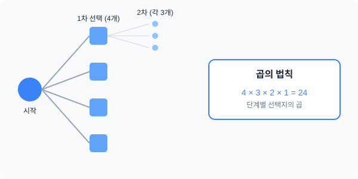

# 노벨상 수식의 향기: 경우의 수 나열 — '선택의 갈림길'에서 규칙 찾기

## 1. 도입: 왜 우리는 모든 경우를 직접 세지 않을까?
우리가 일상에서 "오늘 점심 메뉴를 무엇부터 먹을까?" 혹은 "4명의 친구를 어떤 순서로 줄 세울까?"를 고민할 때, 머릿속에서는 무수한 선택지가 펼쳐집니다. 4명을 줄 세우는 상황은 단순해 보이지만, 그 속에는 수학의 거대한 줄기인 '경우의 수'와 '순열'의 기초 원리가 숨어 있습니다.

단순히 결과를 암기하는 것이 아니라, **'선택의 단계'가 어떻게 누적되어 전체 경우의 수를 만드는지** 그 구조를 파헤쳐 보면, 복잡한 세상의 질서를 계산하는 강력한 도구를 얻게 될 것입니다. 본 학습에서는 직접 나열하는 과정에서 발견되는 '패턴의 반복'을 통해 곱셈의 필연성을 이해하는 것을 목표로 합니다.

---

## 2. 본론: 나열의 노가다에서 발견하는 '곱셈의 필연성'

### 2.1 직접 나열하며 발견하는 '묶음'의 패턴
4명의 친구(A, B, C, D)를 한 줄로 세운다고 가정해 봅시다. 무작정 적기 시작하면 금세 헷갈리기 마련입니다. 하지만 '첫 번째 자리에 누구를 세울 것인가'를 기준으로 차근차근 나열해 보면 놀라운 규칙이 발견됩니다.

*   **A가 맨 앞에 서는 경우:** ABCD, ABDC, ACBD, ACDB, ADBC, ADCB (**6가지**)
*   **B가 맨 앞에 서는 경우:** BACD, BADC, BCAD, BCDA, BDAC, BDCA (**6가지**)
*   **C가 맨 앞에 서는 경우:** CABD, CADB, CBAD, CBDA, CDAB, CDBA (**6가지**)
*   **D가 맨 앞에 서는 경우:** DABC, DACB, DBAC, DBCA, DCAB, DCBA (**6가지**)

여기서 주목할 점은 **"누가 맨 앞에 서든, 그 뒤에 따라오는 경우의 수는 6가지로 모두 동일하다"**는 사실입니다. 즉, 전체 경우의 수는 '6개씩 들어있는 동일한 크기의 묶음이 총 4개' 있는 셈입니다. 

<iframe src="contents/black_scholes_equation_01/sec_01/assets/diagrams/sub_01_01_visual1.html" width="100%" height="450px" frameborder="0" scrolling="no"></iframe>

이처럼 동일한 크기의 패턴이 반복된다는 것을 깨닫는 순간, 우리는 덧셈을 곱셈으로 압축할 수 있게 됩니다.
$$6 + 6 + 6 + 6 = 6 \times 4 = 24$$

### 2.2 선택의 갈림길: 트리 구조로 이해하기
왜 하필 6가지씩일까요? 이를 단계별 선택의 과정(Tree Structure)으로 들여다보면 이유가 명확해집니다.

1.  **첫 번째 자리:** 4명 중 누구라도 설 수 있습니다. (**4가지 갈래**)
2.  **두 번째 자리:** 첫 번째에 선 사람을 제외한 나머지 **3명** 중 선택합니다.
3.  **세 번째 자리:** 앞선 두 자리에 선 사람들을 제외한 **2명** 중 선택합니다.
4.  **네 번째 자리:** 마지막으로 남은 **1명**이 자동으로 서게 됩니다.

첫 번째 선택에서 4개의 가지가 뻗어 나오고, 그 각각의 가지 끝에서 다시 3개, 또 그 끝에서 2개... 이런 식으로 가지가 뻗어 나가는 형태가 됩니다. 

### 2.3 곱의 법칙의 탄생
위의 트리 구조를 수식으로 옮기면 우리가 익히 아는 곱셈이 됩니다. 
"모든 단계의 선택이 완료되어야 하나의 사건(줄 세우기)이 끝난다면, 각 단계의 경우의 수를 모두 곱한다." 이를 **곱의 법칙**이라고 합니다.

- 전체 경우의 수 = (1차 선택) × (2차 선택) × (3차 선택) × (4차 선택)
- **$24 = 4 \times 3 \times 2 \times 1$**

이처럼 곱셈은 단순한 연산이 아니라, **"동일한 크기의 하위 선택지들이 반복될 때"** 이를 한 번에 계산하는 논리적 압축 도구입니다.

---

## 3. 일반화: 팩토리얼(Factorial)의 도입
이제 숫자가 4명에서 10명, 혹은 $n$명으로 늘어나도 당황할 필요가 없습니다. 수학자들은 $n$부터 1까지의 모든 자연수를 차례대로 곱하는 이 과정을 기호로 간단히 표현하기로 했습니다.

> **정의: 팩토리얼(Factorial, 계승)**
> 1부터 $n$까지의 자연수를 모두 곱한 것을 $n!$이라 쓰고, '엔 팩토리얼'이라고 읽습니다.
> $$n! = n \times (n-1) \times (n-2) \times \dots \times 1$$

따라서 **$n$명을 일렬로 나열하는 경우의 수는 $n!$** 입니다. 4명을 나열한다면 $4! = 4 \times 3 \times 2 \times 1 = 24$가 되는 것이죠. 팩토리얼은 $n$이 커짐에 따라 그 값이 매우 가파르게 증가하는 특징이 있습니다.

<iframe src="contents/black_scholes_equation_01/sec_01/assets/diagrams/sub_01_01_visual2.html" width="100%" height="450px" frameborder="0" scrolling="no"></iframe>

---

## 4. 요약
*   **나열보다는 구조:** 무작정 세기보다는 첫 번째 선택에 따른 '묶음'의 크기가 동일함을 파악하는 것이 우선입니다.
*   **곱의 법칙:** 각 단계에서 선택 가능한 경우의 수를 곱하면, 트리 구조의 모든 말단 노드(결과)를 한 번에 계산할 수 있습니다.
*   **팩토리얼($n!$):** 순서대로 나열하는 모든 경우의 수를 상징하는 수학적 언어이며, 순열의 가장 기초적인 형태입니다.

이제 여러분은 단순히 나열하는 '노가다'를 넘어, 팩토리얼이라는 수식을 통해 수만 가지의 가능성을 순식간에 꿰뚫어 볼 수 있게 되었습니다.