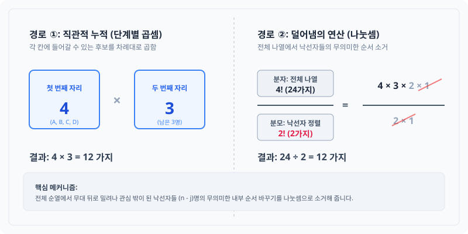

# 노벨상 수식의 향기: 순열(Permutation) — '덜어냄'으로 완성하는 일부의 선택

## 1. 도입: 모든 후보를 줄 세울 필요가 없을까?
이전 장에서 우리는 4명의 친구($A, B, C, D$) 모두를 빠짐없이 줄 세우는 전체 경우의 수, 즉 팩토리얼($4! = 24$)의 원리를 배웠습니다. 첫 번째 자리부터 마지막 자리까지 선택의 갈림길이 꼬리를 물며 경우의 수가 기하급수적으로 증폭되는 트리 구조를 확인했습니다.

하지만 현실 세계의 의사결정은 늘 '전체'를 대상으로만 움직이지 않습니다. 예컨대 4명의 주자 중 이어달리기에 나갈 '1선발(첫 번째 주자)'과 '2선발(두 번째 주자)' 단 두 명만을 골라 순서대로 세워야 할 수도 있고, 10명의 후보 중 회장과 부회장 두 명만을 선출해야 할 때도 있습니다. 

이처럼 **"전체 $n$개 중에서 일부인 $j$개만을 선택하여 순서를 고려해 나열하는 것"**, 이것이 바로 오늘 정복할 **순열(Permutation)**의 개념입니다. 이번 장에서는 무작정 공식을 암기하는 대신, 전체의 질서에서 불필요한 부분을 과감하게 쳐내는 '덜어냄의 미학'을 통해 순열의 수식을 직관적으로 이해해 보겠습니다.

---

## 2. 본론: 선택의 가지치기와 나눗셈의 미학

### 2.1 직접 나열하며 발견하는 두 가지 계산 경로
이전 장에서 다룬 친구들($A, B, C, D$)을 다시 소환해 봅시다. 이 4명 중 딱 2명만 골라 앞줄에 세우는 시나리오를 구체적으로 그려보겠습니다.

우선, 첫 번째 자리에 올 수 있는 사람을 기준으로 모든 경우를 직접 나열해 봅시다.

*   **A가 맨 앞에 서는 경우:** AB, AC, AD (**3가지**)
*   **B가 맨 앞에 서는 경우:** BA, BC, BD (**3가지**)
*   **C가 맨 앞에 서는 경우:** CA, CB, CD (**3가지**)
*   **D가 맨 앞에 서는 경우:** DA, DB, DC (**3가지**)

이 나열에서 우리는 총 **12가지**의 경우의 수가 존재함을 알 수 있습니다. 이 결과에 도달하는 데는 독자의 인지 구조에 따라 서로 다른 두 가지 유도 경로가 존재하며, 이 둘은 완벽한 동치 관계를 이룹니다.

#### 경로 ①: 단계별 선택의 곱셈 (직관적 누적)
첫 번째 자리에 앉을 사람을 고르는 경우의 수는 4가지($A, B, C, D$)입니다. 그 각각의 가지 끝에서, 두 번째 자리에 앉을 사람은 이미 선택된 1명을 제외한 나머지 3명 중 하나가 됩니다. 2명만 뽑으면 상황이 끝나므로 계산은 여기서 멈춥니다.
$$\text{전체 경우의 수} = 4 \times 3 = 12$$

#### 경로 ②: 전체에서 불필요한 부분 제거 (덜어냄의 연산)
이미 알고 있는 4명 전체를 줄 세우는 경우의 수($4! = 24$)에서 출발해 봅시다. 4명을 전부 세웠을 때의 목록 중 앞의 두 글자가 'AB'로 시작하는 경우를 모아보면 다음과 같습니다.
*   **ABCD, ABDC** (2가지)

우리는 오직 앞의 2명('AB')에게만 관심이 있고, 뒤에 남겨진 2명('C, D')의 순서 뒤바뀜은 전혀 고려 대상이 아닙니다. 즉, 뒤쪽의 무의미한 움직임인 $2! = 2\times1 = 2$가지가 전체 24가지 속에 곱하기 형태로 중복 반영되어 있는 것입니다. 

따라서 전체 수식에서 이 불필요한 '방해꾼들의 순서'를 나누어 주어 털어냅니다.
$$\frac{4 \times 3 \times 2 \times 1}{2 \times 1} = \frac{4!}{2!} = 12$$

이처럼 **나눗셈은 수학적으로 '무대 뒤로 물러난 낙선자들의 무의미한 움직임을 하나의 상태로 묶어 지우는 덜어냄의 연산'**입니다.



다음의 인터랙티브 시뮬레이터를 통해 슬라이더를 조절하며, 선택된 인원 뒤에 남겨진 낙선자들의 무의미한 순서 바꾸기가 수식에서 어떻게 실시간으로 약분(소거)되는지 시각적으로 직접 확인해 보시기 바랍니다.

<iframe src="contents/black_scholes_equation_01/sec_01/assets/diagrams/sub_01_02_visual1.html" width="100%" height="520px" frameborder="0" scrolling="yes"></iframe>

---

### 2.2 순열의 일반화: $_nP_j$ 수식의 탄생
이제 이 논리를 $n$명 중 $j$명을 선택하는 일반적인 상황으로 확장해 봅시다. 수학자들은 이를 순열(Permutation)이라 부르고 기호로 **$_nP_j$**라고 씁니다.

앞선 유도 경로 ②를 공식에 그대로 대입해 보면, 순열의 아름다운 정의식이 탄생합니다.

$$ _nP_j = \frac{n!}{(n-j)!} $$

이 공식은 단순한 문자의 나열이 아니라, 다음과 같은 경제적이고 필연적인 규칙을 품고 있습니다.
1.  **분자 $n!$:** 우선 아무런 제약 없이 $n$명 모두를 일렬로 세워 봅니다.
2.  **분모 $(n-j)!$:** 선택받지 못하고 탈락한 나머지 $(n-j)$명이 무대 뒤에서 자기들끼리 줄을 서며 만들어내는 무의미한 소음($(n-j)!$가지)을 나눗셈을 통해 완벽히 소거합니다.

이전 절에서 사용한 구체적인 수치 예시인 $n=4, j=2$를 공식에 대입해 교차 검증해 봅시다.
$$ _4P_2 = \frac{4!}{(4-2)!} = \frac{4!}{2!} = \frac{4 \times 3 \times 2 \times 1}{2 \times 1} = 4 \times 3 = 12 $$
계산 결과는 처음부터 2칸의 슬롯을 만들고 $4 \times 3$을 수행한 경로 ①의 값인 12와 완벽하게 일치합니다.

---

### 2.3 순열 공식의 물리적 범위와 확률계의 완결성
이 공식이 수학적 공간 안에서 모순 없이 완결성을 가지는지 확인하기 위해, 변수 $j$의 물리적 한계 범위($0 \le j \le n$)를 기준으로 양 끝의 경계 조건을 검증해 보겠습니다.

#### 조건 ①: $j = n$ (모두를 선택하는 경우)
$n$명 중 $n$명을 전부 선택해 줄 세우는 것은 상식적으로 $n!$과 같아야 합니다. 공식에 대입해 봅시다.
$$ _nP_n = \frac{n!}{(n-n)!} = \frac{n!}{0!} $$
여기서 우리는 수학적 약속인 **$0! = 1$**의 필연성을 만나게 됩니다. '아무도 선택하지 않고 남겨진 0명을 정렬하는 방법'은 '아무것도 하지 않고 가만히 두는 단 1가지 상태'로 정의되어야만 전체 수식 체계가 무너지지 않고 완벽한 조화를 이룹니다. 따라서 $_nP_n = n!$이 성립합니다.

#### 조건 ②: $j = 0$ (아무도 선택하지 않는 경우)
$$ _nP_0 = \frac{n!}{(n-0)!} = \frac{n!}{n!} = 1 $$
단 한 명도 선택하지 않는 경우의 수 역시 상식적으로 '아무것도 고르지 않는 단 1가지 상태'로 균형 있게 귀결됩니다. 이처럼 순열 공식 $_nP_j$는 경계 조건에서도 빈틈없는 일관성을 제공합니다.

---

## 3. 실습: 파이썬 코드로 검증하는 선택과 배제
우리가 유도한 '선택과 탈락의 필연성'을 파이썬 코드를 통해 가시적으로 확인해 보겠습니다. 대표적인 내장 라이브러리인 `itertools`의 `permutations` 모듈을 사용하면, 수식의 결과가 가상의 데이터 매트릭스로 어떻게 구축되는지 직접 관찰할 수 있습니다.

```python
import itertools

# 4명의 친구 목록 정의 (이전 장과 동일한 데이터 구조 소환)
friends = ['A', 'B', 'C', 'D']

# 4명 중 2명을 순서대로 뽑아 세우는 순열 목록 생성
perm_results = list(itertools.permutations(friends, 2))

# 결과 출력
print(f"[실습 결과] 4명 중 2명을 선택하는 순열")
print(f"1. 전체 경우의 수 (_4P_2): {len(perm_results)}가지")
print(f"2. 생성된 실제 순열 매트릭스:")
for i, path in enumerate(perm_results, 1):
    print(f"   경로 {i:02d}: {path}")
```

### 코드 실행 결과
```text
[실습 결과] 4명 중 2명을 선택하는 순열
1. 전체 경우의 수 (_4P_2): 12가지
2. 생성된 실제 순열 매트릭스:
   경로 01: ('A', 'B')
   경로 02: ('A', 'C')
   경로 03: ('A', 'D')
   경로 04: ('B', 'A')
   경로 05: ('B', 'C')
   경로 06: ('B', 'D')
   경로 07: ('C', 'A')
   경로 08: ('C', 'B')
   경로 09: ('C', 'D')
   경로 10: ('D', 'A')
   경로 11: ('D', 'B')
   경로 12: ('D', 'C')
```
코드가 출력한 12개의 경로는 우리가 앞선 2.1절에서 손으로 직접 써 내려갔던 경우의 수 목록과 정확히 일치합니다. 컴퓨터 언어로 구현하더라도 수학적 논리의 덜어냄 원리는 한 치의 오차도 없이 일관되게 작동함을 알 수 있습니다.

---

## 4. 요약
*   **일부의 선택:** 순열($_nP_j$)은 전체 $n$개 중에서 순서를 고려하여 일부인 $j$개만을 택해 나열하는 도구입니다.
*   **나눗셈을 통한 소거:** 전체 나열($n!$)에서 선택받지 못한 나머지 인원들의 무의미한 순서 바꾸기($(n-j)!$)를 나눔으로써 불필요한 경우의 수를 정교하게 탈락시킵니다.
*   **수식의 완결성:** $_nP_j = \frac{n!}{(n-j)!}$ 식은 $0! = 1$이라는 수학적 필연성을 기초로 $0 \le j \le n$ 모든 범위에서 완벽하게 작동하는 수리 체계를 이룹니다.

선택되지 못한 이들의 무의미한 순서를 '나누기' 연산으로 과감히 털어내는 순열의 논리를 이해했다면, 여러분은 단순한 곱셈 공식을 뛰어넘어 수학이 세상을 정돈하는 가장 우아한 방식 중 하나를 목격한 것입니다. 다음 장에서는 '순서'라는 마지막 제약 조건마저 완전히 덜어내는 가장 완벽한 자유의 개념, **'조합(Combination)'**의 세계를 탐험해 보겠습니다.
