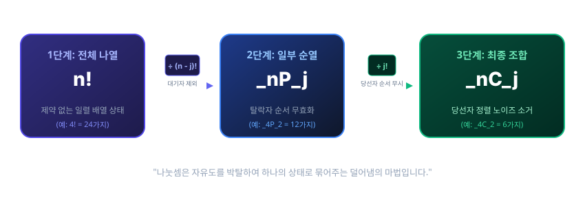

# 노벨상 수식의 향기: 조합(Combination) — 순서라는 마지막 허물을 벗겨낸 '진정한 선택'

## 1. 도입: 순서가 중요하지 않은 '팀 구성'의 순간
지난 시간 우리는 4명의 친구($A, B, C, D$) 중 2명을 선택하여 첫 번째 주자와 두 번째 주자로 줄을 세우는 **순열(Permutation)**의 원리를 배웠습니다. 전체 경우의 수($4! = 24$)에서 무대 뒤 대기석에 남겨진 낙선자들의 무의미한 순서 바꾸기($(n-j)! = 2! = 2$가지)를 나눗셈으로 과감히 털어냄으로써, 총 12가지의 정교한 경로($_4P_2 = 12$)를 도출해 냈습니다.

하지만 우리의 일상과 경제적 의사결정 속에는 '순서'나 '직책'의 구분 없이, 오직 **'누가 최종적으로 선택되었는가'**에만 관심이 있는 상황이 훨씬 더 많습니다. 예컨대 4명의 주자 중 이어달리기에 나갈 대표팀 2명을 선발하는 경우나, 10명의 주주 중 사외이사 3명을 동등한 자격으로 선출하는 상황이 그렇습니다. 대표팀으로 'A와 B'를 뽑는 것은 'B와 A'를 뽑는 것과 완벽히 동일한 결과입니다. 둘 사이에 순서나 지위의 차이가 존재하지 않기 때문입니다.

이처럼 **"전체 $n$개 중에서 일부인 $j$개만을 선택하되, 순서를 고려하지 않고 오직 구성원의 조합에만 집중하는 것"**, 이를 **조합(Combination)**이라고 합니다. 이번 장에서는 앞서 배운 순열의 개념에서 '순서'라는 마지막 허물을 한 꺼풀 더 벗겨내어, 경우의 수를 가장 완벽하게 압축하는 조합의 아름다운 수학적 구조를 정복해 보겠습니다.

---

## 2. 본론: 순서의 무효화와 이중 필터링

### 2.1 이전 시나리오의 재소환: 12가지 순열의 재배치
이전 장에서 다루었던 친구 목록 $A, B, C, D$($n=4$) 중 2명($j=2$)을 선택하는 상황을 다시 가져와 보겠습니다. 새로운 개념을 마주할 때는 완전히 새로운 예시를 들기보다, 익숙한 기초 시나리오를 다시 전개하는 것이 논리적 대조를 극대화하는 가장 좋은 방법입니다. 

순열($_4P_2$)을 통해 도출했던 12가지의 구체적인 경로들을 이번에는 '동일한 멤버 구성'을 기준으로 묶어서 새롭게 나열해 보겠습니다.

| 고유한 멤버 구성 (조합) | 대응되는 순열의 경로 목록 (순서 있음) | 중복 횟수 ($j!$) |
| :--- | :--- | :--- |
| **{A, B}** | AB, BA | 2가지 ($2!$) |
| **{A, C}** | AC, CA | 2가지 ($2!$) |
| **{A, D}** | AD, DA | 2가지 ($2!$) |
| **{B, C}** | BC, CB | 2가지 ($2!$) |
| **{B, D}** | BD, DB | 2가지 ($2!$) |
| **{C, D}** | CD, DC | 2가지 ($2!$) |

이 나열을 살펴보면 대단히 일관된 패턴이 눈에 들어옵니다. 순서가 중요했던 순열의 세계에서는 서로 다른 사건으로 대접받던 쌍들(예: $AB$와 $BA$)이, 오직 멤버 구성만 따지는 조합의 세계에서는 **단 하나의 사건**으로 합쳐져야 합니다. 

모든 고유한 조합 쌍이 정확히 **2가지($2!$)**씩 동일한 크기의 중복을 형성하며 나타나고 있으므로, 순열로 구한 전체 12가지 경우의 수를 2로 나누어 줌으로써 순서의 거품을 완벽히 걷어낼 수 있습니다.
$$\text{조합의 수} = \frac{\text{순열의 수}}{\text{선택된 이들의 순서 배열 수}} = \frac{12}{2!} = 6\text{가지}$$

아래의 인터랙티브 시뮬레이터를 통해, 순열로 나열되어 있던 12가지의 개별 경로들이 '순서 무시' 제어를 거치며 어떻게 동일한 멤버 포켓 속으로 빨려 들어가 압축되는지 그 역동적인 과정을 시각적으로 체험해 보시기 바랍니다.

<iframe src="contents/black_scholes_equation_01/sec_01/assets/diagrams/sub_01_03_visual1.html" width="100%" height="550px" frameborder="0" scrolling="no"></iframe>

---

### 2.2 이중 덜어냄의 연산: 조합 수식의 일반화
이 직관을 $n$개 중 $j$개를 순서 없이 뽑는 일반적인 조합 수식으로 정립해 봅시다. 수학자들은 조합(Combination)을 기호로 **$_nC_j$** 또는 **$\binom{n}{j}$**라고 쓰고 다음과 같이 정의합니다.

$$ _nC_j = \frac{_nP_j}{j!} = \frac{n!}{(n-j)! \times j!} $$

이 수식은 분모에 무려 두 개의 팩토리얼($!$)을 나란히 곱하고 있습니다. 대수학적으로 분모의 나눗셈은 **'불필요한 자유도를 제거하는 덜어냄의 연산'**입니다. 따라서 이 수식은 전체 나열($n!$)이라는 거대한 경우의 수 원석을 두 번의 정교한 필터로 깎아내는 **'이중 필터링(Double Filtering)'**의 메커니즘을 품고 있습니다.



1.  **첫 번째 필터 : $(n-j)!$ (탈락자 필터)**
    *   **대수적 역할:** 무대 위에 오르지 못하고 낙선한 나머지 $(n-j)$명의 인원들이 무대 뒤 대기석에서 자기들끼리 줄을 서며 일으키는 무의미한 소동($(n-j)!$가지)을 통째로 나누어 지워버립니다. 이 단계가 완료되면 순열($_nP_j$) 상태가 됩니다.
2.  **두 번째 필터 : $j!$ (당선자 필터)**
    *   **대수적 역할:** 무대 위로 최종 선택되어 올라온 $j$명의 정예 멤버들이 자기들끼리 앞뒤로 자리를 바꾸며 만들어내던 '순서의 허물($j!$가지)'마저 나눗셈을 통해 단 하나의 대표 상태(팀 구성)로 묶어 소거합니다. 이 단계에 이르러서야 비로소 순수한 조합($_nC_j$)이 완성됩니다.

앞서 우리가 다루었던 구체적인 수치 시나리오($n=4, j=2$)를 이 최종 일반화 공식에 대입하여 일관성을 검증해 보겠습니다.
$$ _4C_2 = \frac{4!}{(4-2)! \times 2!} = \frac{4!}{2! \times 2!} = \frac{24}{2 \times 2} = 6 $$
우리가 직접 손으로 나열하고 묶어내었던 6가지라는 실제 결괏값과 공식의 연산 결과가 단 하나의 오차도 없이 완벽하게 일치함을 확인할 수 있습니다.

---

### 2.3 조합 공식의 경계 조건과 상호보완적 대칭성 (확률계의 완결성)
이 조합 공식이 수학적으로 닫힌 계(Closed System) 안에서 모순 없이 완결성을 가지는지 확인하기 위해, 변수 $j$의 물리적 범위($0 \le j \le n$)를 기준으로 경계 조건과 독특한 대칭적 성질을 증명해 보겠습니다.

#### 경계 조건 검증: 극단적인 선택의 순간
*   **조건 ①: $j = n$ (모두를 선택하는 경우)**
    $$ _nC_n = \frac{n!}{(n-n)! \times n!} = \frac{n!}{0! \times n!} = \frac{1}{0!} $$
    우리는 순열 장에서 아무것도 하지 않고 가만히 두는 단 1가지 상태를 의미하는 **$0! = 1$**의 필연성을 공부했습니다. 이를 대입하면 $_nC_n = 1$이 됩니다. $n$명 중 대표로 세울 $n$명을 순서 없이 통째로 고르는 방법은 '모두 다 데려가는 단 1가지 방법'뿐이라는 우리의 직관과 완벽히 일치합니다.
*   **조건 ②: $j = 0$ (아무도 선택하지 않는 경우)**
    $$ _nC_0 = \frac{n!}{(n-0)! \times 0!} = \frac{n!}{n! \times 1} = 1 $$
    단 한 명의 대표도 뽑지 않는 경우의 수 역시 '아무도 고르지 않고 가만히 대기하는 단 1가지 상태'로 균형 있게 귀결됩니다.

#### 상호보완적 대칭성 (Symmetric Complementarity): 선택과 배제의 동치성
조합 공식은 다음과 같은 대단히 고혹적인 대칭 수식을 제공합니다.

$$ _nC_j = {_nC_{n-j}} $$

대수적으로 이를 증명하는 것은 매우 간단합니다. $_nC_{n-j}$의 정의식에 변수를 대입해 보면 분모의 두 항의 위치만 바뀔 뿐 본질이 같음을 알 수 있습니다.
$$ _nC_{n-j} = \frac{n!}{(n-(n-j))! \times (n-j)!} = \frac{n!}{j! \times (n-j)!} = {_nC_j} $$

이 대수적 동치 관계가 지닌 실제 경제학적·물리적 의미는 생각할수록 경이롭습니다. **"4명의 친구 중 대표팀에 태울 3명을 고르는 행위($_4C_3$)"**는, 뒤집어 생각하면 **"지상에 남겨두고 떠날 탈락자 1명을 낙점하는 행위($_4C_1$)"**와 논리적·실질적으로 완벽하게 동일한 의사결정이라는 뜻입니다.

*   $j = 3$을 데려가기 위해 3명을 고르는 경우의 수: $_4C_3 = \frac{4!}{1! \times 3!} = 4$
*   $j = 1$을 남겨두기 위해 1명을 고르는 경우의 수: $_4C_1 = \frac{4!}{3! \times 1!} = 4$

이처럼 조합 수식은 선택받은 자의 관점과 선택받지 못한 자의 관점이 완벽한 균형과 대칭을 이루는 정교한 '확률계(Probability System)'를 이루고 있습니다.

---

## 3. 실습: 파이썬 코드로 검증하는 조합의 미학
이제 컴퓨터의 정밀한 연산을 통해, 순열의 세계에서 생성된 가상의 데이터 매트릭스가 조합의 세계로 진입할 때 어떻게 압축되고 정제되는지 코드로 최종 검증해 보겠습니다.

```python
import itertools

# 4명의 친구 목록 정의 (이전 장과 일관된 데이터 구조 유지)
friends = ['A', 'B', 'C', 'D']

# 1. 순열 리스트 생성 (순서 고려 O)
perm_list = list(itertools.permutations(friends, 2))

# 2. 조합 리스트 생성 (순서 고려 X)
comb_list = list(itertools.combinations(friends, 2))

# 결과 출력 및 대조
print("[실습 결과] 순열과 조합의 데이터 매트릭스 비교")
print(f"1. 순열의 총 가짓수 (_4P_2): {len(perm_list)}가지")
print(f"2. 조합의 총 가짓수 (_4C_2): {len(comb_list)}가지")
print("-" * 55)
print("3. 조합에 의해 필터링된 실제 멤버 구성 목록:")
for i, team in enumerate(comb_list, 1):
    # 해당 조합에 매칭되어 소거된 순열 쌍들을 찾아내어 대조 출력
    matched_perms = [p for p in perm_list if set(p) == set(team)]
    print(f"   조합 {i}: {team} <--- [순열의 중복쌍 {matched_perms}이 단 하나로 압축됨]")
```

### 코드 실행 결과
```text
[실습 결과] 순열과 조합의 데이터 매트릭스 비교
1. 순열의 총 가짓수 (_4P_2): 12가지
2. 조합의 총 가짓수 (_4C_2): 6가지
-------------------------------------------------------
3. 조합에 의해 필터링된 실제 멤버 구성 목록:
   조합 1: ('A', 'B') <--- [순열의 중복쌍 [('A', 'B'), ('B', 'A')]이 단 하나로 압축됨]
   조합 2: ('A', 'C') <--- [순열의 중복쌍 [('A', 'C'), ('C', 'A')]이 단 하나로 압축됨]
   조합 3: ('A', 'D') <--- [순열의 중복쌍 [('A', 'D'), ('D', 'A')]이 단 하나로 압축됨]
   조합 4: ('B', 'C') <--- [순열의 중복쌍 [('B', 'C'), ('C', 'B')]이 단 하나로 압축됨]
   조합 5: ('B', 'D') <--- [순열의 중복쌍 [('B', 'D'), ('D', 'B')]이 단 하나로 압축됨]
   조합 6: ('C', 'D') <--- [순열의 중복쌍 [('C', 'D'), ('D', 'C')]이 단 하나로 압축됨]
```
코드를 실행해 보면 순열의 12가지 미시적 경로가 정확히 2개($2!$)씩 한 쌍으로 묶여 6개의 깨끗한 조합 상태로 병합되는 과정을 명확히 확인할 수 있습니다. 컴퓨터 언어 속에서도 우리가 정립한 '이중 덜어냄'의 규칙이 완벽하게 작동하고 있음이 증명됩니다.

---

## 4. 요약
*   **순서의 허물 제거:** 조합($_nC_j$)은 순열($_nP_j$)의 결과에서 뽑힌 당선자들끼리 순서를 바꾸는 무의미한 가짓수($j!$)를 한 번 더 나누어 제거한 '순수한 대표 뽑기'의 도구입니다.
*   **분모의 이중 필터:** $_nC_j = \frac{n!}{(n-j)! \times j!}$ 수식에서 분모의 $(n-j)!$은 낙선자의 순서 노이즈를 지우고, $j!$은 당선자의 순서 허물을 지워내는 명확한 물리적 역할을 수행합니다.
*   **상호보완적 대칭성:** $_nC_j = {_nC_{n-j}}$ 공식은 선택할 자를 고르는 것과 버릴 자를 고르는 의사결정이 완벽히 동일함을 증명하며, 확률계의 완전무결한 대칭성을 완성합니다.

우리는 이제 '모든 대상의 전열(팩토리얼)', '일부 대상의 순서 있는 나열(순열)', 그리고 '순서조차 벗어던진 순수한 선택(조합)'에 이르는 경우의 수의 3단계 기본 뼈대를 모두 구축했습니다. 이 단단한 수학적 토대 위에서, 다음 장부터는 이 선택의 도구들이 어떻게 현대 금융 공학과 결합하여 '옵션 가격 결정'이라는 위대한 노벨상급 수식으로 변모해 가는지 그 위대한 여정을 본격적으로 시작하겠습니다.
