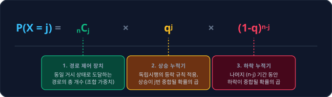

# 1.4 이항분포의 개념과 확률 트리 모델링: 우연의 갈림길을 지도로 그리는 '확률 트리'와 '이항분포'

## 1. 도입: 시간의 축 위에서 펼쳐지는 선택의 갈림길
지난 시간 우리는 4명의 친구 중 대표를 선발하는 가상의 시나리오를 통해, 순서라는 마지막 허물마저 완벽히 걷어낸 순수한 선택의 도구인 **조합(Combination, $_nC_j$)**의 수학적 아름다움을 정복했습니다. 조합은 단순히 무대 뒤의 시끄러운 소음을 제거하는 것에서 나아가, 선택하는 자와 배제되는 자의 완벽한 대칭적 균형을 보여주는 정교한 논리 체계였습니다. 우리는 분모의 $(n-j)!$을 통해 낙선자들의 무의미한 줄 세우기 소동을 잠재웠고, $j!$을 통해 당선자들이 일으키는 순서의 거품을 걷어내는 **'이중 필터링'**의 메커니즘을 경험했습니다.

이제 우리는 이 강력한 무기를 품고, 정적인 선택의 순간을 넘어 **시간의 축에 따라 동적으로 변화하는 확률의 세계**로 나아가고자 합니다. 현실의 금융 시장이나 우리의 일상은 단 한 번의 선택으로 끝나지 않습니다. 오늘 주가가 오르거나 내리는 일, 동전을 던져 앞면이 나오거나 뒷면이 나오는 일처럼, 동일한 무작위 시행이 시간에 걸쳐 연속적으로 반복되는 상황을 마주하게 됩니다.

이처럼 **"매 단계마다 오직 두 가지의 상반된 결과만이 존재하며, 각 시행이 서로에게 영향을 주지 않는 독립적인 상황이 반복될 때, 최종 결과들이 그리는 거대한 확률의 지도"**를 우리는 **이항분포(Binomial Distribution)**라고 부릅니다. 

이항분포를 단순한 공식 암기로 접근하면 수식 속 매개변수들이 지닌 역동적인 의미를 놓치기 쉽습니다. 이번 장에서는 이항분포의 뼈대를 이루는 '확률 트리(Probability Tree)'를 통해 미시적인 경로들을 투명하게 나열해 보고, 곱셈의 교환법칙과 조합이 어떻게 무수한 무작위 경로들을 정돈된 하나의 질서(거시적 분포)로 응집시키는지 그 마법 같은 유도 과정을 자세히 살펴보겠습니다.

---

## 2. 본론: 무작위성에서 질서를 길어 올리는 과정

### 2.1 미시적 경로의 투명한 나열: 2년 간의 주가 등락 시나리오
추상적인 수학 공식으로 직행하기 전, 우리에게 친숙한 구체적인 수치 시나리오를 설정해 보겠습니다. 어떤 주식이 매년 말 **상승($\uparrow$)**하거나 **하락($\downarrow$)**하는 두 가지 길만 걷는다고 가정합시다. 

*   **매년 주가가 상승($\uparrow$)할 확률 ($q$):** $0.6$ ($60\%$)
*   **매년 주가가 하락($\downarrow$)할 확률 ($1-q$):** $0.4$ ($40\%$)

여기서 상승 확률 $q$와 하락 확률 $1-q$는 서로를 보완하는 '상호보완적 짝'입니다. 시장에는 오직 상승과 하락 두 가지만 존재하므로, 두 확률의 합은 항상 $q + (1-q) = 1$이라는 완벽한 확률계를 구성합니다. 단리나 이산 복리에서 원금과 이자가 결합하여 전체를 이루듯, 이 두 상반된 확률은 전체 가능성의 영역을 틈새 없이 나누어 가집니다.

이제 이 주식을 2년($n=2$) 동안 관찰할 때 발생할 수 있는 모든 미시적 경로(Path)들을 가감 없이 테이블 위에 투명하게 펼쳐보겠습니다.

| 경로 ID | 1년 차 결과 | 2년 차 결과 | 최종 상태 (상승 횟수 $j$) | 개별 경로의 발생 확률 계산 | 경로 확률값 |
| :---: | :---: | :---: | :---: | :--- | :---: |
| **경로 1** | 상승 ($\uparrow$) | 상승 ($\uparrow$) | 2회 상승 ($j=2$) | $q \times q = 0.6 \times 0.6$ | $0.36$ |
| **경로 2** | 상승 ($\uparrow$) | 하락 ($\downarrow$) | 1회 상승 ($j=1$) | $q \times (1-q) = 0.6 \times 0.4$ | $0.24$ |
| **경로 3** | 하락 ($\downarrow$) | 상승 ($\uparrow$) | 1회 상승 ($j=1$) | $(1-q) \times q = 0.4 \times 0.6$ | $0.24$ |
| **경로 4** | 하락 ($\downarrow$) | 하락 ($\downarrow$) | 0회 상승 ($j=0$) | $(1-q) \times (1-q) = 0.4 \times 0.4$ | $0.16$ |

이 테이블은 시간에 따른 모든 가능성을 낱낱이 쪼개어 보여주는 가장 미시적인 뷰(View)입니다. 매 단계의 사건이 서로에게 아무런 영향을 미치지 않는 '독립시행'의 가정에 의해, 각 경로가 발생할 확률은 매 단계의 확률을 곱하는 산술 규칙을 적용하여 명쾌하게 유도됩니다.

아래의 인터랙티브 시뮬레이터를 통해, 매년 주가가 등락하는 2기간 확률 트리에서 상승 확률 $q$를 변경해 가며 미시적 경로 확률과 최종 거시적 상태 분포가 어떻게 정교하게 연동되는지 실시간으로 확인해 보시기 바랍니다.

<iframe src="contents/black_scholes_equation_01/sec_01/assets/diagrams/sub_01_04_visual1.html" width="100%" height="520px" frameborder="0" scrolling="yes"></iframe>

---

### 2.2 거시적 상태로의 병합: 곱셈의 교환법칙과 조합의 결합
위의 테이블과 트리를 가만히 들여다보면 대단히 일관된 반복 패턴을 발견할 수 있습니다. 

**경로 2**($\uparrow \downarrow$)와 **경로 3**($\downarrow \uparrow$)은 미시적인 순서는 다릅니다. 하나는 첫해에 벌고 둘째 해에 잃은 것이고, 다른 하나는 첫해에 일시적 조정을 겪고 둘째 해에 만회한 것입니다. 하지만 투자 원금 대비 최종적인 결과(Terminal State)의 관점에서 보면 두 경로 모두 **'상승 1회, 하락 1회'**라는 동일한 상태로 귀결됩니다.

여기서 초등 수학의 가장 위대한 기초 규칙인 **곱셈의 교환법칙**이 강력한 압축의 도구로 등장합니다.
$$\text{경로 2의 확률} = q \times (1-q) = 0.24$$
$$\text{경로 3의 확률} = (1-q) \times q = 0.24$$

두 경로의 발생 순서는 다르지만, 곱해지는 인자들이 동일하기 때문에 **개별 경로가 가지는 확률의 크기는 수학적 필연에 의해 완벽하게 동일**합니다. 따라서 우리가 순서에 무관하게 '최종적으로 주가가 몇 번 상승했는가'라는 거시적 상태에만 집중한다면, 이 두 개의 미시적 경로는 하나의 상태로 합쳐져야 마땅합니다.

*   **상승이 총 1회($j=1$) 발생할 거시적 확률:**
    $$P(X=1) = (\text{경로 2의 확률}) + (\text{경로 3의 확률}) = 0.24 + 0.24 = 0.48$$

이 $0.48$이라는 숫자는 단순히 우연히 얻어진 것이 아닙니다. **"동일한 확률($0.24$)을 가진 서로 다른 경로가 정확히 2개 존재한다"**는 사실을 덧셈(혹은 곱셈)으로 응집해낸 결과입니다. 

여기서 등장하는 '경로의 개수(2개)'가 바로 우리가 지난 시간에 정복했던 조합($_nC_j$)의 개념과 정확히 맞닿아 있습니다. 2년의 시간($n=2$) 중 주가가 상승할 위치 1곳($j=1$)을 순서 없이 고르는 가짓수가 바로 $_2C_1 = 2$이기 때문입니다. 즉, 순열의 관점에서 개별적으로 나열되어 있던 경로들이 '순서 무시'라는 조합의 필터를 거치며 하나의 대표 포켓(거시적 상태) 속으로 빨려 들어간 것입니다.

모든 거시적 상태의 확률을 정리해 대조해 보면 다음과 같습니다.
1.  **상승 2회 ($j=2$):** $_2C_2 \times (0.6)^2 \times (0.4)^0 = 1 \times 0.36 \times 1 = 0.36$
2.  **상승 1회 ($j=1$):** $_2C_1 \times (0.6)^1 \times (0.4)^1 = 2 \times 0.24 = 0.48$
3.  **상승 0회 ($j=0$):** $_2C_0 \times (0.6)^0 \times (0.4)^2 = 1 \times 1 \times 0.16 = 0.16$

이 세 거시적 확률의 총합을 구해보겠습니다.
$$\sum_{j=0}^{2} P(X=j) = 0.36 + 0.48 + 0.16 = 1.00$$
모든 경로의 확률을 빠짐없이 더했을 때 정확히 $1.0(100\%)$으로 수렴하는 이 완결성은, 우리가 설계한 확률 트리가 어떠한 논리적 누수도 없이 시장의 모든 시나리오를 완벽하게 방어하고 있음을 증명합니다. 무대 뒤 낙선자들을 지우고 대표만을 남기던 조합의 엄밀성이, 확률 공간 전체를 메우는 단단한 안전장치로 작동하고 있는 것입니다.

---

### 2.3 이항분포 공식의 일반화 유도: 3개의 물리적 장치
우리가 발견한 수치적 규칙성을 토대로, $n$번의 독립적인 갈림길에서 상승 확률이 $q$일 때 정확히 $j$번 상승할 일반화된 확률 공식인 **이항분포의 확률질량함수(Probability Mass Function)**를 엄밀하게 정립해 봅시다.

$$ P(X=j) = {}_nC_j \times q^j \times (1-q)^{n-j} $$

이 공식은 겉보기에는 복잡해 보이지만, 사실 서로 다른 물리적 임무를 수행하는 **3개의 핵심 부품이 결합된 하나의 완결된 기계**와 같습니다.



1.  **경로 제어 장치: $_nC_j$ (조합)**
    *   **물리적 의미:** 총 $n$번의 갈림길 중 상승($\uparrow$)이 일어날 $j$개의 시점을 선택하는 모든 가능한 경로의 수입니다. 앞서 보았듯 곱셈의 교환법칙 덕분에 이 $_nC_j$개의 경로들은 모두 동일한 확률 값을 가집니다. 따라서 이 조합식은 파편화된 미시적 경로들을 하나의 거시적 상태로 묶어주는 '조합 가중치' 역할을 수행합니다. 즉, 개별 경로의 대수적 무의미함을 하나의 상태로 묶어 지우는 조합 고유의 '덜어냄의 연산'이 여기서도 빛을 발합니다.
2.  **상승 누적기: $q^j$**
    *   **물리적 의미:** 독립시행의 법칙에 따라, $j$번의 상승이 동시에 발생할 때 누적되는 순수한 상승 확률의 곱입니다.
3.  **하락 누적기: $(1-q)^{n-j}$**
    *   **물리적 의미:** 전체 $n$번의 시행 중 상승을 제외한 나머지 $(n-j)$번의 단계에서 하락($\downarrow$)이 동시에 발생할 때 누적되는 순수한 하락 확률의 곱입니다.

우리가 앞서 계산했던 구체적인 수치 예시($n=2, j=1, q=0.6$)를 이 완성된 일반화 공식에 대입하여 일관성을 즉각적으로 교차 검증해 봅시다.
$$ P(X=1) = {_2C_1} \times 0.6^1 \times (1-0.6)^{2-1} = 2 \times 0.6 \times 0.4 = 0.48 $$
정확하게 우리가 손으로 직접 나열하고 묶어서 구했던 $0.48$이라는 값과 소수점 끝자리까지 완벽하게 일치합니다. 추상적인 대수 공식이 구체적인 현실의 시나리오를 한치의 오차도 없이 완벽하게 수용하고 통제하고 있음이 증명되는 순간입니다.

---

## 3. 실습: 파이썬 코드로 확인하는 확률의 응집
이제 파이썬을 활용하여 2년의 짧은 시간을 넘어, 한층 더 거대한 시나리오 속에서 이항분포가 어떻게 작동하는지 시뮬레이션해 보겠습니다. 10년($n=10$) 동안 매년 주가가 등락할 때, 각 상승 횟수별 확률 분포가 완벽한 확률계(합이 1)를 이루는지 정밀하게 검증해 봅니다.

```python
from math import comb

def calculate_binomial_distribution(n, q):
    """
    n: 총 시행 횟수 (기간)
    q: 1회 시행 시 상승할 확률
    """
    print(f"=== 이항분포 시뮬레이션 (n={n}, q={q}) ===")
    total_probability = 0.0
    
    # 0회 상승부터 n회 상승까지의 모든 거시적 상태 순회
    for j in range(n + 1):
        # 1. 경로 제어 장치 (조합 계산)
        paths = comb(n, j)
        
        # 2. 상승 및 하락 누적 확률 계산
        prob_up = q ** j
        prob_down = (1 - q) ** (n - j)
        
        # 3. 최종 이항 확률 도출
        binomial_prob = paths * prob_up * prob_down
        total_probability += binomial_prob
        
        # 결과 출력 (상승 횟수별 조합의 수와 확률 매핑)
        print(f"상승 {j:2d}회 | 가능한 경로 수: {paths:3d}개 | 상태 확률: {binomial_prob:.6f}")
        
    print("-" * 60)
    print(f"모든 상태 확률의 총합 (시스템 검증): {total_probability:.6f}")

# n=10년, 상승 확률 q=0.6 시나리오 실행
calculate_binomial_distribution(10, 0.6)
```

### 코드 실행 결과
```text
=== 이항분포 시뮬레이션 (n=10, q=0.6) ===
상승  0회 | 가능한 경로 수:   1개 | 상태 확률: 0.000105
상승  1회 | 가능한 경로 수:  10개 | 상태 확률: 0.001573
상승  2회 | 가능한 경로 수:  45개 | 상태 확률: 0.010617
상승  3회 | 가능한 경로 수: 120개 | 상태 확률: 0.042467
상승  4회 | 가능한 경로 수: 210개 | 상태 확률: 0.111477
상승  5회 | 가능한 경로 수: 252개 | 상태 확률: 0.200658
상승  6회 | 가능한 경로 수: 210개 | 상태 확률: 0.250823
상승  7회 | 가능한 경로 수: 120개 | 상태 확률: 0.214991
상승  8회 | 가능한 경로 수:  45개 | 상태 확률: 0.120932
상승  9회 | 가능한 경로 수:  10개 | 상태 확률: 0.040311
상승 10회 | 가능한 경로 수:   1개 | 상태 확률: 0.006047
------------------------------------------------------------
모든 상태 확률의 총합 (시스템 검증): 1.000000
```

컴퓨터의 정밀한 연산을 통해서도 모든 상태 확률의 합이 정확히 `1.000000`으로 수렴하는 것을 볼 수 있습니다. 상승 5회와 6회 부근에서 확률이 가장 높게 형성되는 비대칭적이고 아름다운 종 모양의 이항분포 곡선이 우리 눈앞에 정량적으로 시각화되었습니다. 10년이라는 긴 시간 동안 발생할 수 있는 총 $2^{10} = 1,024$가지의 미시적 경로가, 조합의 마법을 통해 단 11개의 깔끔한 거시적 상태로 응집된 것입니다.

---

## 4. 요약
*   **미시적 경로와 거시적 상태:** 확률 트리는 모든 가능한 시나리오(경로)를 투명하게 나열하며, 곱셈의 교환법칙에 의해 결과가 같은 경로들은 동일한 확률값을 가집니다.
*   **조합을 통한 질서 구축:** 이항분포 수식에서 조합($_nC_j$)은 순서가 달라 파편화되어 있던 미시적 경로들을 거시적 상태 하나로 완벽히 묶어주는 **'경로 제어 가중치'**로 기능합니다.
*   **완결된 확률계:** 이항분포 공식 $P(X=j) = {}_nC_j \cdot q^j(1-q)^{n-j}$는 경로 제어 장치, 상승 누적기, 하락 누적기의 논리적 결합이며, 모든 상태 확률의 합은 항상 $1$이 되는 철통같은 완결성을 자랑합니다.

우리는 이로써 무작위성 속에서 정교한 질서를 이끌어내는 이항분포의 뼈대를 완성했습니다. 이 단단한 이항분포와 확률 트리 모델은 현대 금융 공학의 정수이자 노벨 경제학상을 안겨준 **'이항 옵션 가격 결정 모형(Binomial Option Pricing Model)'**을 설계하는 가장 중요한 디딤돌이 될 것입니다. 다음 장에서는 이 확률 트리 위에 실제 '자산의 가치'를 얹어 금융 수학의 진정한 마법을 부려보도록 하겠습니다.
