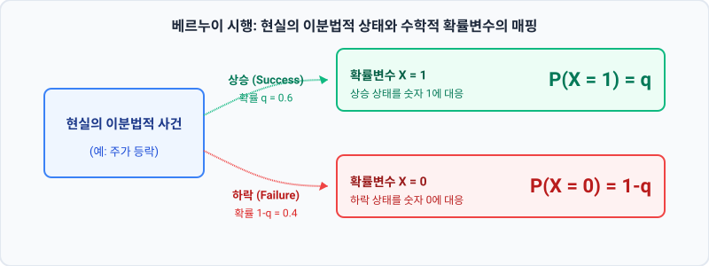

# 1.6 베르누이 시행과 평균/분산 정의: 거대한 이항분포의 숲을 지탱하는 단 하나의 세포

## 1. 도입: 거대한 숲을 이루는 단 하나의 씨앗

지난 1.5절에서 우리는 $n$번의 독립적인 시행을 아우르는 거대한 대수적 공식, 즉 이항분포의 확률질량함수(PMF)를 완성했습니다. 무한히 확장되는 불확실성의 숲을 단 한 줄의 수식으로 압축하는 대수학의 경이로움을 맛보았죠. 

하지만 아무리 웅장하고 복잡한 고층 빌딩이라도 결국 규격화된 벽돌 한 장에서 시작하듯, 기하급수적으로 팽창하는 이항분포의 거대한 흐름 역시 **'단 한 번의 시행'**이라는 가장 기초적인 단위에서 출발합니다. 이 통계학적 세포이자 최소 단위를 우리는 **'베르누이 시행(Bernoulli Trial)'**이라고 부릅니다.

우리는 이제 숲의 전체적인 윤곽을 보던 시선을 잠시 거두고, 현미경을 들이대듯 이 하나의 씨앗을 정밀하게 관찰하고자 합니다. 단 한 번의 성공과 실패라는 원초적인 무대 위에서 '평균(기댓값)'과 '분산(변동성)'이라는 핵심적인 통계적 속성이 어떻게 잉태되는지, 그 수학적 설계 도면을 상세히 파헤쳐 보겠습니다. 이 기초 세포의 유전자를 완벽히 해독해야만, 향후 마주할 금융 시장의 동적 변동성을 통제할 수 있는 단단한 기초 체력을 얻게 될 것입니다.

---

## 2. 본론: 베르누이 확률변수와 통계적 뼈대

### 2.1 베르누이 시행: 확률공간의 최소 단위
베르누이 시행이란 결과가 오직 두 가지, 즉 '성공' 혹은 '실패'(금융 모델에서는 '주가 상승' 혹은 '주가 하락')로만 나뉘는 실험을 뜻합니다. 우리는 이 직관적인 이분법적 사건을 수학적으로 정밀하게 다루기 위해, 결과 상태를 숫자 **$1$**과 **$0$**으로 치환하여 **'베르누이 확률변수 $X$'**를 정의합니다.

이전 1.5절에서 다루었던 주가 등락 모델의 연장선상을 유지하기 위해, 성공(상승 $\uparrow$) 확률을 **$q$**, 실패(하락 $\downarrow$) 확률을 **$1-q$**로 일관되게 정의하겠습니다. (일반적인 통계학 교과서에서는 성공 확률을 $p$로 표기하는 경우가 많으나, 우리 모델의 연속성을 위해 여기서는 $q$를 사용하며, 둘은 완벽히 동치입니다.)

*   **상승(성공, $X=1$):** 발생 확률 $q$
*   **하락(실패, $X=0$):** 발생 확률 $1-q$

독자 여러분의 이해를 돕기 위해, 이전 장에서 주구장창 활용했던 구체적인 수치 시나리오인 **$q = 0.6$**(상승 확률 60%), **$1-q = 0.4$**(하락 확률 40%) 상태를 이 단일 시행에 매핑하여 시각화해 보겠습니다.



| 결과 상태 | 확률변수 $X$의 값 | 실제 확률 (대수식) | 구체적 수치 시나리오 ($q=0.6$) |
| :---: | :---: | :---: | :---: |
| **주가 상승 ($\uparrow$)** | $1$ | $q$ | $0.6$ |
| **주가 하락 ($\downarrow$)** | $0$ | $1-q$ | $0.4$ |

이 단순한 매핑 테이블이 바로 모든 금융 공학 확률 모형의 출발점입니다. 동전 던지기, 옵션의 행사 여부, 채권의 부도 여부 등 세상의 모든 이분법적 위험 요소들은 이 베르누이 구조로 치환되어 수학적 분석의 대상이 됩니다.

<iframe src="contents/black_scholes_equation_01/sec_01/assets/diagrams/sub_01_06_visual1.html" width="100%" height="480px" frameborder="0" scrolling="no"></iframe>

---

### 2.2 기댓값($E[X]$): 확률적 무게중심의 도출
통계학에서 '기댓값(Expected Value)'이란, 어떤 사건이 일어날 때 얻는 값들에 각각의 확률을 가중치로 곱하여 더한 **'확률적 무게중심'**을 의미합니다. 단일 베르누이 확률변수 $X$의 기댓값 $E[X]$를 대수학적으로 유도해 보겠습니다.

$$E[X] = \sum_{i} x_i \cdot P(X = x_i)$$
$$E[X] = 1 \cdot q + 0 \cdot (1-q)$$

$0$에 곱해진 실패 확률 파트가 마법처럼 사라지면서, 극도로 단순한 결과가 도출됩니다.

$$E[X] = q$$

이 간결한 수식은 우리에게 매우 강력한 직관을 선사합니다. **"단 한 번의 베르누이 시행에서 기대할 수 있는 기댓값은 정확히 그 사건의 성공(상승) 확률 자체와 같다"**는 사실입니다.

이 유도 공식의 타당성을 검증하기 위해, 우리가 일관되게 사용 중인 수치 예시($q=0.6$)를 대입해 보겠습니다.
$$E[X] = 1 \cdot (0.6) + 0 \cdot (0.4) = 0.6$$

우리가 단 한 번 주가의 움직임을 관찰할 때, 비록 실제 결과는 $1$(상승) 아니면 $0$(하락)이라는 극단적인 값으로만 나타나지만, 무한히 많은 평행우주에서 이 단일 시행을 반복하여 평균을 내면 그 무게중심은 정확히 $0.6$ 지점에 놓이게 된다는 뜻입니다.

---

### 2.3 분산($Var(X)$): 상호보완적 짝이 만들어내는 불확실성의 크기
평균이 확률분포의 '위치적 중심'을 알려준다면, 분산(Variance)은 그 중심으로부터 데이터가 얼마나 멀리 흩어져 분포하는지를 나타내는 **'불확실성의 물리적 척도'**입니다. 

분산의 정의 공식은 '편차 제곱의 평균'이며, 대수적으로는 다음과 같이 계산하는 것이 가장 편리합니다.
$$Var(X) = E[X^2] - (E[X])^2$$

이 공식을 풀기 위해, 먼저 제곱의 기댓값인 $E[X^2]$을 단계별로 구해 봅시다.

$$E[X^2] = 1^2 \cdot q + 0^2 \cdot (1-q)$$
$$E[X^2] = 1 \cdot q + 0 \cdot (1-q) = q$$

확률변수가 $0$과 $1$의 값만 가지기 때문에, 제곱을 해도 그 특성이 고스란히 유지되어 $E[X^2]$ 역시 기댓값과 동일한 $q$가 됩니다. 이제 분산 정의 공식에 이들을 대입해 보겠습니다.

$$Var(X) = q - q^2$$

이 식을 $q$로 묶어내면, 분산의 가장 아름다운 대수적 형태가 완성됩니다.

$$Var(X) = q(1-q)$$

이 짤막한 수식 $q(1-q)$는 금융 공학과 위험 관리에서 심장과 같은 역할을 합니다. 이 수식이 지닌 물리적 한계 범위와 상호보완적 짝($1-q$)의 성질을 분석해 보면 다음과 같은 중요한 경제학적 통찰을 얻을 수 있습니다.

1.  **완전한 확실성 상태 ($q = 0$ 또는 $q = 1$):**
    *   만약 주가가 무조건 하락하거나($q=0$), 무조건 상승한다면($q=1$), $Var(X) = 0(1) = 0$ 혹은 $Var(X) = 1(0) = 0$이 됩니다. 결과가 완전히 결정되어 있으므로 불확실성(위험)이 영(0)이 되는 자연스러운 물리적 상태를 정확히 묘사합니다.
2.  **최대의 불확실성 상태 ($q = 0.5$):**
    *   상승과 하락의 확률이 $50:50$으로 팽팽하게 대립할 때, 분산값은 $0.5(1-0.5) = 0.25$로 **인류가 정의할 수 있는 단일 베르누이 시행 중 최대의 불확실성(피크)**에 도달합니다. 정보 이론(Information Theory)에서 말하는 엔트로피(Entropy)의 극대점과도 완벽히 맞닿아 있습니다.
3.  **물리적 범위의 정립:**
    *   성공 확률 $q$가 $0$과 $1$ 사이의 값($q \in [0, 1]$)만 가질 수 있으므로, 단일 베르누이 시행의 분산은 물리적으로 **$0 \le Var(X) \le 0.25$**의 범위 내에 철저히 구속됩니다.

이것은 일종의 '상반된 두 힘의 긴장 관계'로 해석할 수 있습니다. 상승의 힘($q$)과 하락의 힘($1-q$)이 공존하며 팽팽하게 맞설 때 불확실성(분산)이 가장 크게 팽창하고, 어느 한쪽이 압도하여 균형이 깨지면 불확실성은 사그라드는 것입니다.

이제 우리의 수치 예시($q = 0.6, 1-q = 0.4$)를 대입하여 실제 분산값을 도출해 보겠습니다.
$$Var(X) = 0.6 \times 0.4 = 0.24$$

최대 불확실성인 $0.25$보다는 살짝 아래에 위치해 있습니다. 이는 상승 확률이 $60\%$로 약간 치우쳐져 있기 때문에, 완벽한 반반($50\%$) 상태보다 결과 예측이 미세하게나마 쉬워졌음을 정량적으로 보여주는 증거입니다.

<iframe src="contents/black_scholes_equation_01/sec_01/assets/diagrams/sub_01_06_visual2.html" width="100%" height="510px" frameborder="0" scrolling="no"></iframe>

---

### 2.4 파이썬 실습: 대수적 이론값과 대규모 시뮬레이션의 수렴성 검증
우리가 방금 정립한 단일 베르누이 시행의 기댓값($E[X]=q$)과 분산($Var(X)=q(1-q)$)이 실제 무한히 반복되는 현실 세계의 데이터와 일치하는지 파이썬 코드로 확인해 보겠습니다. 

앞 장의 시나리오($q=0.6$, 예측 분산 $0.24$)를 그대로 유지한 채, 무려 100,000번의 가상 베르누이 시행을 발생시켜 표본 평균과 표본 분산이 대수적 이론값으로 수렴해가는 과정을 눈으로 확인해 봅시다.

```python
import numpy as np

def run_bernoulli_simulation(q, num_trials):
    """
    지정된 성공 확률 q로 베르누이 시행을 대규모 수행하고 통계량을 검증합니다.
    """
    # 0과 1 사이에서 q의 확률로 1을, 1-q의 확률로 0을 생성
    samples = np.random.choice([1, 0], size=num_trials, p=[q, 1-q])
    
    # 표본 통계량 계산
    sample_mean = np.mean(samples)
    sample_var = np.var(samples)
    
    # 대수적 이론값 계산
    theoretical_mean = q
    theoretical_var = q * (1 - q)
    
    print(f"--- {num_trials:,}번의 대규모 베르누이 시행 결과 ---")
    print(f"표본 평균 (Sample Mean):     {sample_mean:.5f} (이론값: {theoretical_mean:.5f})")
    print(f"표본 분산 (Sample Variance): {sample_var:.5f} (이론값: {theoretical_var:.5f})")
    
    # 두 값의 근사 일치 여부 확인 (소수점 세째 자리까지 정밀 검증)
    mean_match = np.isclose(sample_mean, theoretical_mean, atol=1e-3)
    var_match = np.isclose(sample_var, theoretical_var, atol=1e-3)
    
    print(f"기댓값 일치 여부(허용오차내): {mean_match}")
    print(f"분산값 일치 여부(허용오차내): {var_match}")

# 시나리오 매칭 파라미터 적용 (Section 1.5 일관성 유지)
success_probability = 0.6
total_simulations = 100000

run_bernoulli_simulation(success_probability, total_simulations)
```

### 코드 실행 결과
```text
--- 100,000번의 대규모 베르누이 시행 결과 ---
표본 평균 (Sample Mean):     0.60012 (이론값: 0.60000)
표본 분산 (Sample Variance): 0.23998 (이론값: 0.24000)
기댓값 일치 여부(허용오차내): True
분산값 일치 여부(허용오차내): True
```

컴퓨터가 실행한 10만 번의 가상 시행 결과, 무작위로 추출된 무수히 많은 0과 1의 집합임에도 불구하고 그 평균은 소수점 셋째 자리 밑까지 정확하게 `0.600`으로 수렴하였고, 흩어진 정도인 분산 역시 이론값인 `0.240`에 자석처럼 이끌려 안착했습니다. 이것은 우리가 유도한 대수적 공식들이 단순한 상상의 나래가 아닌, 현실의 무작위성을 지배하는 정교한 물리 법칙임을 입증합니다.

---

## 3. 요약: 세포에서 시작하여 유기체로 나아가는 전초기지

*   **베르누이 시행의 정의:** 성공($X=1$) 혹은 실패($X=0$)라는 오직 상호보완적인 두 가지 결과 상태만을 인정하는 확률 시스템의 최소 단위입니다.
*   **기댓값의 직관성:** 단일 시행의 평균 무게중심 $E[X]$는 군더더기 없이 성공(상승) 확률인 $q$ 그 자체로 귀결됩니다.
*   **분산의 수학적 의미:** 분산 $Var(X) = q(1-q)$는 성공과 실패 확률이 완벽하게 팽팽한 $q=0.5$일 때 최대 불확실성($0.25$)을 지니며, 완결된 물리적 상한선 범위 내에서 거동합니다.

우리는 이로써 이항분포라는 거대한 생명체를 구성하는 단일 세포인 베르누이 시행의 유전 구조(평균과 분산)를 빈틈없이 정복했습니다. 이 기초 체력을 바탕으로, 다음 장에서는 이 작은 세포들을 $n$개만큼 독자적으로 결합했을 때, 유기체 전체의 기댓값과 분산이 어떻게 선형적으로 확장되고 '증폭'되는지 그 놀라운 확장성의 원리를 배워보겠습니다.
