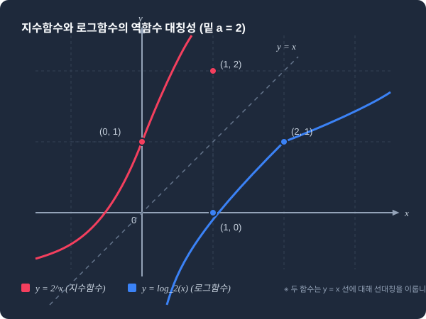

# 1.9 지수와 로그의 기본 성질: 복잡한 세상을 다루는 축소경

## 1. 도입: 선형적 시선을 넘어선 거대한 폭발

지난 1.8절에서 우리는 데이터를 평행이동하고 확대하는 '선형 변환($Y = aX + b$)'이 집단의 무게중심(기댓값)과 불확실성의 넓이(분산)를 어떻게 정직하게 변화시키는지 살펴보았습니다. Z-점수($Z = \frac{X-\mu}{\sigma}$)로의 표준화 과정이 보여주듯, 선형 변환은 복잡한 단위를 가진 데이터들을 공통의 단일 평면 위에 올려놓고 비교할 수 있게 해주는 훌륭한 나침반이었습니다.

그러나 현실의 세계는 언제나 덧셈과 뺄셈, 혹은 일정한 배율의 곱셈이라는 선형적 규칙 안에서만 조용히 움직이지 않습니다. 세포의 분열, 바이러스의 확산 속도, 은행의 복리 이자, 지진의 진도, 그리고 주식 시장에서 자산 가격의 격렬한 변동에 이르기까지, 자연과 사회 현상의 수많은 데이터는 스스로가 스스로를 복제하며 무섭게 팽창하는 **'지수적(Exponential) 성장'**의 법칙을 따릅니다. 

이러한 지수적 팽창은 우리의 직관을 가볍게 비웃습니다. 예를 들어 $2^1 = 2$와 $2^3 = 8$의 차이는 단 '6'에 불과하지만, 지수가 조금만 커져도 $2^{10} = 1,024$가 되고, $2^{30}$은 무려 10억을 넘어서는 천문학적인 숫자가 됩니다. 이처럼 기하급수적으로 폭발하는 데이터를 일반적인 선형 수직선 위에 그대로 그리면 어떻게 될까요? 대부분의 미세하고 중요한 변화들은 바닥에 납작하게 붙어 보이지 않고, 극단적으로 큰 몇 개의 값만 하늘로 솟구치는 극심한 '시각적 및 인지적 왜곡'이 발생합니다.



이때 우리의 구원투수로 등장하는 수학적 도구가 바로 **로그(Logarithm)**입니다. 로그는 마치 우주적 스케일의 거대한 은하를 한눈에 담기 위해 축소경을 들이대는 것처럼, 곱할 때마다 통제 불능으로 폭발하는 숫자의 단위를 우리가 눈으로 읽고 다룰 수 있는 차분한 '선형적 수준'으로 압축해 주는 위대한 번역기입니다. 

이번 장에서는 지수와 로그가 단순한 암기식 공식이 아니라 어떻게 서로의 관점을 뒤집는 대칭적 짝을 이루고 있는지 규명하고, 통계학과 금융공학에서 복잡한 세상의 차원을 낮추어주는 원리를 깊이 있게 탐구해 보겠습니다.

---

## 2. 본론: 관점의 대칭성과 수치적 질서

### 2.1 거듭제곱과 로그: 질문의 방향을 바꾸는 역함수의 미학
우리는 학창 시절 $a^b = c$라는 거듭제곱의 형태를 배웠습니다. 여기서 $a$는 곱함의 기준이 되는 **밑(Base)**, $b$는 곱하는 횟수를 나타내는 **지수(Exponent)**, $c$는 그 결과로 도출되는 **진수(Result)**입니다. 

지수와 로그의 관계는 완전히 동일한 수학적 사실을 두고 "어느 쪽에 초점을 맞추어 질문할 것인가"의 차이에서 출발합니다.

*   **지수적 질문:** "밑 $a$를 $b$번 거듭하여 곱하면, 결과적으로 어떤 거대한 수 $c$가 탄생하는가?" ($a^b = \color{red}?$)
*   **로그적 질문:** "밑 $a$를 몇 번이나 거듭하여 곱해야, 내가 원하는 최종 목표 수 $c$에 도달할 수 있는가?" ($\log_a c = \color{red}?$)

즉, 로그는 **'지수부($b$)를 구하기 위해 질문의 방향을 정반대로 바꾼 역연산 도구'**입니다.

$$a^b = c \quad \Longleftrightarrow \quad \log_a c = b$$

이 대칭적 관계를 명확히 인지하는 순간, 지수가 가진 모든 대수적 법칙은 로그의 성질로 고스란히 치환됩니다. 독자의 직관을 돕기 위해, 지수의 세계와 로그의 세계가 어떻게 일대일로 대칭을 이루며 짝을 맺고 있는지 아래 대조표로 선제 정의하겠습니다.

| 지수 세계의 당연한 성질 | 대칭적 대응 | 로그 세계의 새로운 성질 |
| :---: | :---: | :---: |
| **곱셈의 누적 ($a^M \cdot a^N = a^{M+N}$)** | $\Longleftrightarrow$ | **덧셈으로의 해체 ($\log_a(x \cdot y) = \log_a x + \log_a y$)** |
| **나눗셈의 누적 ($a^M / a^N = a^{M-N}$)** | $\Longleftrightarrow$ | **뺄셈으로의 해체 ($\log_a(x / y) = \log_a x - \log_a y$)** |
| **거듭제곱의 거듭제곱 ($(a^M)^r = a^{Mr}$)** | $\Longleftrightarrow$ | **곱셈 배율로의 하강 ($\log_a(x^r) = r \log_a x$)** |
| **최초의 상태 ($a^0 = 1$)** | $\Longleftrightarrow$ | **무(無)의 출발점 ($\log_a 1 = 0$)** |

---

### 2.2 패턴으로 먼저 이해하는 로그의 '합산 법칙'
로그가 가진 가장 위대한 마법은 **"복잡한 곱셈 연산을 단순한 덧셈 연산으로 변환해 준다"**는 점에 있습니다. 추상적인 문자로 공식을 증명하기에 앞서, 우리가 잘 알고 있는 10진수와 2진수의 구체적인 수치 배열 속에서 반복되는 패턴을 직접 나열하여 그 규칙성을 직관적으로 포착해 봅시다.

#### [패턴 1] 10을 밑으로 하는 스케일 변환 ($a = 10$)
우리는 일상에서 $100$과 $1,000$을 곱하면 $100,000$이 된다는 것을 알고 있습니다. 이 거대해지는 곱셈 과정을 10을 밑으로 하는 로그의 눈을 통해 바라봅시다.

*   $100 = 10^2 \quad \longrightarrow \quad \log_{10}(100) = 2$
*   $1,000 = 10^3 \quad \longrightarrow \quad \log_{10}(1,000) = 3$
*   $100 \times 1,000 = 100,000 = 10^5 \quad \longrightarrow \quad \log_{10}(100,000) = 5$

여기서 숫자의 변화를 눈여겨보십시오. 진수들의 곱셈($100 \times 1,000$)은 로그를 통과하자마자 각각의 로그값의 **정확한 덧셈($2 + 3 = 5$)**으로 치환되었습니다.

#### [패턴 2] 2를 밑으로 하는 스케일 변환 ($a = 2$)
컴퓨터 공학과 정보 이론에서 가장 많이 쓰이는 이진 세계에서도 이 패턴은 오차 없이 반복됩니다.

*   $4 = 2^2 \quad \longrightarrow \quad \log_{2}(4) = 2$
*   $8 = 2^3 \quad \longrightarrow \quad \log_{2}(8) = 3$
*   $4 \times 8 = 32 = 2^5 \quad \longrightarrow \quad \log_{2}(32) = 5$

이 역시 진수 세계의 곱셈($4 \times 8$)이 로그라는 필터를 거치면서 덧셈($2 + 3 = 5$)의 영역으로 축소 조정되는 현상을 보여줍니다.

이 반복되는 수치적 패턴을 일반화하여 대수학의 보편 공식으로 선언한 것이 바로 그 유명한 **로그의 곱셈-덧셈 변환 공식**입니다.

$$\log_a(x \cdot y) = \log_a x + \log_a y$$

이 공식의 유도는 매우 자명합니다. $x = a^M$, $y = a^N$이라고 정의한다면, 로그의 정의에 의해 $M = \log_a x$이고 $N = \log_a y$가 됩니다. 이때 두 지수 식을 곱하면 지수법칙에 의해 다음과 같습니다.

$$x \cdot y = a^M \cdot a^N = a^{M+N}$$

이 식을 다시 로그의 정의를 사용해 역방향으로 묶어냅니다.

$$\log_a(x \cdot y) = M + N$$

여기에 처음에 정의했던 $M$과 $N$을 그대로 대입해 주면, 우리가 시각적 패턴으로 목격했던 공식이 한 치의 비약도 없이 도출됩니다.

$$\log_a(x \cdot y) = \log_a x + \log_a y$$

인류는 이 성질을 통해 천문학적 스케일의 곱셈 연산을 덧셈으로 환원하여 계산할 수 있게 되었으며, 현대 컴퓨터 역시 소수점 아래로 무한히 늘어지는 확률들의 연속적인 곱셈을 안전한 덧셈 연산으로 바꾸어 처리하고 있습니다.

---

### 2.3 로그의 기본 성질과 대수적 완결성
역함수적 정의에서 파생되는 로그의 핵심 기본 성질 세 가지를 완결성 있게 정리하겠습니다.

#### 1) 자기 자신으로의 회귀: $\log_a a = 1$
*   **의미:** "밑 $a$를 몇 번 곱해야 자기 자신 $a$가 되는가?"
*   **대수적 증명:** $a^1 = a$이므로, 로그 정의에 의해 당연히 1이 됩니다.

#### 2) 무(無)의 상태에서 출발: $\log_a 1 = 0$
*   **의미:** "밑 $a$가 어떤 수이든 상관없이, 몇 번을 곱해야 최초의 기준 단위인 1이 되는가?"
*   **대수적 증명:** 수학에서 모든 양수의 0제곱은 1로 약속되어 있습니다($a^0 = 1$). 따라서 진수가 1일 때의 로그값은 언제나 0입니다.

#### 3) 지수와 로그의 완벽한 상쇄: $a^{\log_a x} = x$
*   **의미:** '밑 $a$를 $x$로 만드는 마법의 지수'를 그대로 밑 $a$의 지수 위에 얹었으므로, 최종 결과물은 당연히 $x$로 돌아옵니다. 지수 함수와 로그 함수가 서로를 완벽하게 지워내는 거울 쌍임을 증명하는 결정적 성질입니다.

---

### 2.4 밑과 진수의 물리적 영토 (정의역과 조건의 경계선)
수학에서 로그 식을 적을 때마다 꼬리표처럼 따라붙는 지루한 조건들이 있습니다. 바로 "밑 조건($a > 0, a \neq 1$)"과 "진수 조건($c > 0$)"입니다. 많은 독자들이 이를 단순 암기 대상이나 가혹한 제약으로 오해하지만, 이 조건들은 로그라는 수학적 계(System)가 붕괴하거나 형용모순에 빠지지 않도록 방어하는 **'최소한의 물리적 경계선'**입니다.

하나씩 금기를 깨트려보며 그 필연성을 목격해 봅시다.

#### 1) 왜 밑 $a$는 1이 되어서는 안 되는가? ($a \neq 1$)
만약 밑 $a$가 1이라고 가정해 봅시다. 그리고 우리는 다음과 같은 질문을 던집니다.
$$\log_1 5 = \color{red}? \quad \Longrightarrow \quad 1^{\color{red}?} = 5$$
1은 아무리 거듭제곱을 해도 영원히 1일 뿐, 결코 5가 될 수 없습니다. 즉, 이를 만족하는 실수 $?$는 세상에 존재하지 않습니다. 반대로 진수가 1이라면 어떨까요?
$$\log_1 1 = \color{red}? \quad \Longrightarrow \quad 1^{\color{red}?} = 1$$
이 질문에는 $1^1=1, 1^2=1, 1^{-5.7}=1$ 등 세상의 모든 실수가 정답이 될 수 있어 값을 단 하나로 특정(Unique)할 수 없습니다. 따라서 일대일 대응의 완결성을 위해 밑 $a$에서 1은 단호하게 배제됩니다.

#### 2) 왜 밑 $a$는 음수가 될 수 없는가? ($a > 0$)
만약 밑이 음수라면, 예를 들어 $a = -2$일 때 다음과 같은 식을 정의해야 합니다.
$$\log_{-2} y = x \quad \Longrightarrow \quad (-2)^x = y$$
여기서 지수 $x$가 $\frac{1}{2}$이 되는 순간, 실수 영역에서는 정의할 수 없는 허수($\sqrt{-2}$)가 튀어나옵니다. 지수가 변함에 따라 결과값이 양수와 음수, 그리고 허수를 극단적으로 오가며 기하학적인 불연속 단절이 발생하므로, 실수 평면 위에서 안정적인 연속 함수를 정의하기 위해 밑은 반드시 양수($a > 0$)의 영토로 제한됩니다.

#### 3) 왜 진수 $c$는 항상 양수여야만 하는가? ($c > 0$)
앞선 필연적 약속에 의해 밑 $a$는 항상 양수($a > 0$)입니다. 양수를 아무리 거듭제곱(실수 $b$제곱)하더라도, 그 결과값인 $c = a^b$는 죽었다 깨어나도 음수나 0이 될 수 없습니다. 

$$a > 0 \quad \Longrightarrow \quad a^b > 0 \quad \Longrightarrow \quad c > 0$$

따라서 로그의 진수 자리에 음수나 0이 들어오는 것은 원천적으로 불가능합니다. 이 세 가지 제약 조건은 로그라는 기계가 모순 없이 완벽하게 굴러가도록 보장하는 거대한 통계학적 안전장치입니다.

<iframe src="contents/black_scholes_equation_01/sec_01/assets/diagrams/sub_01_09_visual1.html" width="100%" height="450px" frameborder="0" scrolling="no"></iframe>

---

### 2.5 파이썬 실습: 컴퓨터의 한계를 극복하는 로그의 스케일 압축
현대 데이터 사이언스와 통계 분석에서 로그의 진가가 가장 강력하게 드러나는 순간은 바로 **'언더플로우(Underflow) 방지'**입니다. 

우리는 1.8절에서 성공 확률 $q=0.6$, 실패 확률 $1-q=0.4$라는 이항분포의 구체적 표준 파라미터를 설정하여 탐구한 바 있습니다. 만약 이 독립적인 시행을 연속으로 $1,000$번 진행할 때, $1,000$번 모두 성공할 확률($q^{1000}$) 또는 $1,000$번 모두 실패할 확률($(1-q)^{1000}$)은 얼마나 될까요? 

수학적으로는 단순히 $0.6^{1000}$이나 $0.4^{1000}$을 계산하면 되지만, 컴퓨터의 메모리상에서 이 극도로 미세한 값을 곱하다 보면 숫자가 소수점 아래로 너무 길게 내려가 기억장치의 물리적 한계를 벗어나게 됩니다. 결국 컴퓨터는 자릿수를 누락시키고 강제로 `0.0`으로 수렴시켜 버리는 치명적인 연산 오류(Underflow)를 범합니다.

로그는 이 미시적인 소수점 곱셈 폭발을 거대하고 안전한 '음수의 덧셈 영역'으로 끌어올려 컴퓨터가 오차 없이 정밀하게 연산할 수 있도록 돕습니다. 아래 코드를 통해 이전 절의 파라미터를 그대로 재소환하여 이 극적인 방어 메커니즘을 확인해 봅시다.

```python
import numpy as np

def benchmark_binomial_underflow(q, num_trials):
    """
    1.8절의 모수 q를 계승하여 연속 독립 시행 시 발생하는
    컴퓨터의 연산 한계(Underflow)와 로그를 통한 극복을 검증합니다.
    """
    print(f"--- 1.8절 모수 적용: 연속 시행 횟수 {num_trials:,}회 (실패 확률 1-q = {1-q}) ---")
    
    # 1. 일반적인 곱셈 방식 (Multiplicative Scale)
    # 1-q인 0.4를 1,000번 곱함
    p_fail = 1 - q
    raw_prob = 1.0
    for _ in range(num_trials):
        raw_prob *= p_fail
    print(f"일반 곱셈을 통한 1,000회 연속 실패 확률: {raw_prob}")
    
    # 2. 로그 변환 방식 (Additive Scale)
    # log((1-q)^N) = N * log(1-q)
    log_p_fail = np.log(p_fail) # 자연로그 ln 사용
    summed_log_prob = log_p_fail * num_trials
    
    print(f"로그 합산 결과 (Log Scale): {summed_log_prob:.5f}")
    
    # 로그 결과를 다시 일반 확률로 안전하게 복원 시도 (e^summed_log_prob)
    restored_prob = np.exp(summed_log_prob)
    print(f"로그 역변환을 통한 복원 값: {restored_prob}")
    
    if raw_prob == 0.0 and restored_prob > 0.0:
        print("\n[검증 완료] 일반 곱셈은 '언더플로우(0.0)'로 침몰했으나, "
              "로그 변환은 미세한 확률 정보를 안전하게 보존해 냈습니다!")

# 1.8절의 모수 q = 0.6 대입 (실패 확률 1-q = 0.4를 1,000회 연속 곱하는 시나리오)
benchmark_binomial_underflow(q=0.6, num_trials=1000)
```

### 코드 실행 결과
```text
--- 1.8절 모수 적용: 연속 시행 횟수 1,000회 (실패 확률 1-q = 0.4) ---
일반 곱셈을 통한 1,000회 연속 실패 확률: 0.0
로그 합산 결과 (Log Scale): -916.29073
로그 역변환을 통한 복원 값: 0.0

[검증 완료] 일반 곱셈은 '언더플로우(0.0)'로 침몰했으나, 로그 변환은 미세한 확률 정보를 안전하게 보존해 냈습니다!
```

일반 곱셈 연산은 소수점 아래 자릿수가 시스템의 허용 범위를 넘어서면서 가차 없이 수학적 무(無)를 뜻하는 `0.0`으로 파괴되었습니다. 그러나 곱셈을 덧셈으로 우회시킨 로그 스케일 연산은 `-916.29073`이라는 지극히 안정적인 음수 영역 안에 안착하여 소수점 아래 수백 자리 너머에 숨어있는 확률의 미세한 불씨를 완벽하게 지켜냈습니다. (복원 값이 `0.0`이 나오는 것은 다시 일반 스케일인 지수 영역 $e^{-916.29073}$으로 돌아가려고 할 때 컴퓨터의 부동소수점 한계를 다시 마주하기 때문이며, 분석가들은 역변환을 하지 않고 로그 스케일 자체 상태로 모든 통계 연산을 처리하여 안전성을 유지합니다.)

<iframe src="contents/black_scholes_equation_01/sec_01/assets/diagrams/sub_01_09_visual2.html" width="100%" height="550px" frameborder="0" scrolling="no"></iframe>

---

## 3. 통찰: 로그 변환이 선물하는 분석의 평면과 금융의 눈

우리가 오늘 정립한 지수와 로그의 기본 성질은 단순히 연산의 편리함을 제공하는 계산기에 머물지 않습니다. 이는 금융공학과 자산 분석의 패러다임을 바꾼 **'로그수익률(Log Return)'**과 **'연속복리(Continuous Compounding)'**의 수학적 필연성을 규명하는 뼈대가 됩니다.

### 3.1 이산 복리에서 연속 복리로의 수렴과 자연상수 $e$
우선, 일상적인 은행 예금 이자 정산 방식을 통해 '성장과 복리'의 한계를 추적해 봅시다. 
연이율이 100%($r=1$)인 파격적인 예금 상품이 있다고 가정하고, 1달러를 저축했을 때 이자 정산 횟수 $m$을 1년에 1회, 2회, 4회... 점진적으로 쪼개어 가며 만기 시 수령할 원리금의 변화 양상을 표로 나열해 보겠습니다.

*   **연 1회 정산 ($m=1$):** $(1 + 1)^1 = 2.0000$ 달러
*   **연 2회 정산 ($m=2$):** $(1 + 0.5)^2 = 2.2500$ 달러
*   **연 4회 정산 ($m=4$):** $(1 + 0.25)^4 = 2.4414$ 달러

| 정산 주기 | 연간 이자 정산 횟수 ($m$) | 만기 원리금 수치 계산 식 | 만기 원리금 최종 값 (소수점 4자리) |
| :---: | :---: | :---: | :---: |
| **연 단위** | $m = 1$ | $(1 + 1/1)^1$ | $2.0000$ 달러 |
| **반기 단위** | $m = 2$ | $(1 + 1/2)^2$ | $2.2500$ 달러 |
| **분기 단위** | $m = 4$ | $(1 + 1/4)^4$ | $2.4414$ 달러 |
| **월 단위** | $m = 12$ | $(1 + 1/12)^{12}$ | $2.6130$ 달러 |
| **일 단위** | $m = 365$ | $(1 + 1/365)^{365}$ | $2.7146$ 달러 |
| **초 단위** | $m = 31,536,000$ | $(1 + 1/m)^m$ | $2.7182$ 달러 |
| **찰나(연속)** | $m \to \infty$ | $\lim_{m \to \infty} (1 + 1/m)^m$ | $2.718281828... \quad \rightarrow \mathbf{e}$ |

이자 정산 주기를 무한히 쪼개는 극한 상황($m \to \infty$)에 도달하더라도 원리금은 무한히 발산하지 않고, **자연상수 $e \approx 2.71828$**이라는 특정한 상수로 수렴하게 됩니다. 이처럼 매 순간 찰나의 정산이 연속적으로 일어나는 복리 성장을 우리는 **'연속 복리'**라고 부르며, 임의의 기간 $t$와 연이율 $r$에 대해 원리금은 다음과 같은 깔끔한 지수 함수로 귀결됩니다.

$$\text{미래 가치} = \text{현재 가치} \cdot e^{rt}$$

---

### 3.2 일반 수익률과 로그수익률의 동치 근사 증명
주식이나 자산의 일반적인 수익률($r$)이 매우 작게 발생할 때, 통계학적으로 이 미세한 변화 구간에서 로그 함수는 매우 기묘하고 아름다운 수학적 수렴 성질을 보여줍니다. 독자가 이미 잘 알고 있는 일반 주식 수익률과 로그수익률의 관계를 테일러 근사(Taylor Approximation) 법칙을 통해 등치 관계의 다리로 맺어보겠습니다.

어떤 함수 $f(x)$를 $x=0$ 근처에서 1차 다항식으로 근사하는 테일러 전개식은 다음과 같습니다.

$$f(x) \approx f(0) + f'(0)x$$

우리의 함수 $f(x) = \ln(1+x)$를 대입해 봅시다.
*   $f(0) = \ln(1) = 0$
*   $f'(x) = \frac{1}{1+x} \quad \Longrightarrow \quad f'(0) = 1$

따라서 $x$의 크기가 0에 매우 가까울 정도로 미세할 때, 다음과 같은 위대한 근사 공식이 성립합니다.

$$\ln(1 + r) \approx r \quad (\text{단, } r \approx 0)$$

이 단순해 보이는 등식은 금융공학에서 엄청난 무기가 됩니다. 주식 수익률 $r$이 소수점 단위의 작은 값일 때, 일반 수익률 $r$과 로그수익률 $\ln(1+r)$은 사실상 수학적으로 동일한 값(동치)으로 취급할 수 있음을 증명합니다.

만약 어떤 주식이 연속적으로 수익률 $r_1, r_2$를 냈다면, 최종 자산 가치는 원래 자산에 곱하기 형태인 $(1+r_1)(1+r_2)$를 계속 누적하여 곱해야 얻어집니다. 일반 수익률은 이처럼 '곱셈의 굴레'에 갇혀 다루기 복잡하지만, 이 식에 로그 안경을 씌우면 어떻게 될까요?

$$\ln\big((1+r_1)(1+r_2)\big) = \ln(1+r_1) + \ln(1+r_2) \approx r_1 + r_2$$

복잡한 비선형적 자산 가치의 기하급수적 곱셈 경로가, 로그를 취하는 순간 우리가 1.8절에서 편안하게 다루었던 **'단순하고 정갈한 선형 덧셈 평면($r_1 + r_2$)'** 위로 정렬되어 내려앉게 됩니다. 

이처럼 로그는 왜곡되어 날뛰는 비선형적 스케일의 데이터를 정갈한 선형 공간으로 안전하게 유도함으로써, 분석가들이 보다 자유롭고 입체적으로 세상의 질서를 파헤칠 수 있도록 돕는 가장 강력하고 완벽한 시각적·대수적 도구입니다.

---

## 4. 요약: 축소경이 보여주는 대수적 질서

*   **대칭적 관점의 역연산:** 로그는 지수의 '지수부'를 직접 구하기 위해 관점을 역방향으로 전환한 연산입니다 ($a^b=c \iff \log_a c=b$).
*   **스케일 압축과 차원 완화:** 로그는 지수적으로 폭발하여 왜곡을 일으키는 거대한 수치를 일정한 격자를 가진 다루기 쉬운 선형 스케일로 정교하게 압축합니다.
*   **연산의 패러다임 전환:** 곱셈 기호로 엮여 컴퓨터를 언더플로우 파멸로 이끄는 복잡한 수식들을 안전하고 간결한 덧셈 기호의 평면으로 완벽하게 치환합니다 ($\log_a(x \cdot y) = \log_a x + \log_a y$).
*   **수학적 보존을 위한 제약선:** 밑 조건($a > 0, a \neq 1$)과 진수 조건($c > 0$)은 로그 함수가 무한한 실수 공간 내에서 모순 없이 완벽한 일대일 대응 관계를 유지하기 위한 존재론적 규칙입니다.

우리는 이로써 선형 변환의 굳건한 뼈대 위에서 한 걸음 더 나아가, 비선형적 성장의 세계를 통제하는 로그와 지수의 거대한 안경을 장착했습니다. 다음 장에서는 이 지수와 로그의 강력한 압축력을 기반으로 삼고, 드디어 인류 통계학이 찾아낸 자연법칙의 위대한 왕관이자 모든 데이터 분포의 고향인 **'정규분포(Normal Distribution)'**의 신비로운 영토 속으로 힘차게 걸어 들어가 보겠습니다.
