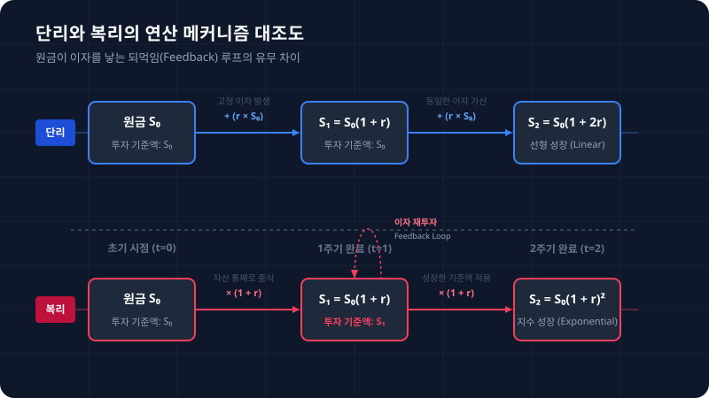

# 1.11 이산 수익률과 복리 계산 및 실효 이자율: 돈이 불어나는 마법의 공식과 시간의 격자

## 1. 도입: 기하급수적 성장을 지배하는 시간의 마디

지난 1.10절에서 우리는 로그의 곱 연산 법칙을 다각도로 정밀하게 유도하고 분석했습니다. 이를 통해 다기간 자산의 복잡한 누적 곱셈 경로를 아주 단순하고 직관적인 덧셈 평면으로 강하(선형화)하는 완벽한 기법을 획득했습니다. 우리가 로그 변형 필터를 사용해 연산의 격을 이토록 자연스럽게 낮출 수 있었던 궁극적인 배경은, 현실 세계에서 금융 자산이 증식해 나가는 근본적인 메커니즘이 애당초 덧셈의 정적인 연쇄가 아닌 **'곱셈의 역동적인 연쇄'**로 이루어져 있기 때문입니다.

그렇다면 자연계와 금융공학은 왜 이토록 곱셈의 구조에 지배를 당하고 있는 것일까요? 그 중심에는 시간의 점진적인 흐름 속에서 자본이 스스로를 복제하여 확장해 나가는 위대한 동력, 바로 **'복리(Compound Interest)'**가 존재합니다.

우리가 은행에 예금을 하거나 격동적인 주식 시장에 참여할 때, 자산의 수익은 단순히 최초 투입한 정적인 원금에 대해서만 일정하게 달라붙지 않습니다. 매 순간 혹은 특정 약정 기간에 한 번씩 발생한 수확(이자 혹은 투자 수익)이 자산 통장 밖으로 이탈하지 않고 고스란히 원금에 누적 재투입되어, 다음 정산 기간에 또 다른 이자를 증식시키는 씨앗이 됩니다. 이는 금융 시장에서 자생적으로 기하급수적 팽창을 일으키는 강력한 **'되먹임 루프(Feedback Loop)'**를 유발합니다.

이번 절에서는 이자가 지급되고 결산되는 시간의 마디(격자, Grid)를 반기, 분기, 일 단위 등으로 점진적으로 잘게 쪼개어 나갈 때, 자산이 불어나는 이산적(Discrete) 복리 엔진의 핵심 원리를 수학적으로 설계해 봅니다. 아울러 금융 업계가 마케팅용 겉표지로 제시하는 '명목 이자율' 이면에 숨겨진 투자의 진짜 정밀한 물리적 수익률 척도인 **'실효 이자율(Effective Annual Rate, EAR)'**의 완벽한 대수학적 정체를 밝혀내겠습니다.

---

## 2. 본론: 복리 엔진의 대수학적 설계도

### 2.1 [패턴 발견] 단리와 복리의 대칭과 균열

수학적 이론을 일반화하기 전, 가장 직관적인 대조군인 **단리(Simple Interest)**와 **복리(Compound Interest)**의 수치적 전개 양상을 직접 눈으로 관찰해 보겠습니다. 

*   **투자 조건 수립:**
    *   초기 투자 원금 $S_0 = 10,000$원
    *   명목 연 이자율 $r = 10\% \ (0.10)$
*   **단리(Simple Interest):** 매년 발생한 이자를 다른 계좌로 빼두거나 주머니에 챙겨둔 채, 오직 태초의 씨드머니 $10,000$원에 대해서만 매년 동일한 크기인 $1,000$원($10,000 \times 0.10$)의 절대 이자만 선형적으로 누적합니다.
*   **복리(Compound Interest):** 이자가 발생할 때마다 다시 투자 자산으로 병합하여 가산하고, 그렇게 가라앉은 총 원리금을 기준으로 다음 연도의 이자 산정을 전개합니다.

| 경과 시간 ($t$) | 단리 계산 과정 | 단리 원리금 ($S_t$) | 복리 계산 과정 | 복리 원리금 ($S_t$) | 누적 차액 (복리 - 단리) |
| :---: | :---: | :---: | :---: | :---: | :---: |
| **0년 (초기)** | $10,000$ | $10,000$원 | $10,000$ | $10,000$원 | $0$원 |
| **1년 차** | $10,000 + 1,000 \times 1$ | $11,000$원 | $10,000 \times (1 + 0.10)^1$ | $11,000$원 | $0$원 |
| **2년 차** | $10,000 + 1,000 \times 2$ | $12,000$원 | $11,000 \times (1 + 0.10)$ | $12,100$원 | **$+100$원** |
| **3년 차** | $10,000 + 1,000 \times 3$ | $13,000$원 | $12,100 \times (1 + 0.10)$ | $13,310$원 | **$+310$원** |
| **10년 차** | $10,000 + 1,000 \times 10$ | $20,000$원 | $10,000 \times (1 + 0.10)^{10}$ | $25,937$원 | **$+5,937$원** |

이 수치 표를 끈기 있게 추적해 보면 매우 중요한 임계 구조를 발견하게 됩니다. **정확히 $t=1$인 1년 차 시점까지는 단리와 복리의 통장 잔고가 정확히 1원 한 장 틀리지 않고 완벽하게 일치합니다.**

그러나 $t=2$가 되는 두 번째 마디를 지나는 순간, $t=1$에 축적되었던 이자 $1,000$원에 $10\%$의 곱셈 가산율이 다시 추가 가공되면서 $+100$원의 미세한 균열이 발생하기 시작합니다. 세 번째 해에는 그 불어난 $100$원에 대해서도 또다시 새 이자가 붙어 눈덩이처럼 기어오릅니다. 결국 10년이 흘렀을 때 복리 포트폴리오는 단리보다 **$59.37\%$**라는 압도적인 기하학적 격차를 벌리며 창공으로 치솟게 됩니다.

이 자본의 물리적 축적 방식을 누적 시간 $t$를 축으로 삼아 일반적인 대수식으로 규격화해 내면 다음과 같습니다.

*   **단리 시스템 (정적인 일차 선형 성장):**
    $$S_t = S_0 (1 + rt)$$
*   **복리 시스템 (역동적인 기하 지수 성장):**
    $$S_t = S_0 (1 + r)^t$$

---

### 2.2 이산 복리 공식의 정밀 유도

현실 금융 시장은 우리에게 1년에 단 한 번만 이자를 주며 느긋하게 정산하지 않습니다. 6개월 주기로 이자를 재투자해주는 반기(Semi-annual) 복리, 3개월에 한 번씩 마디를 매듭짓는 분기(Quarterly) 복리, 한 달 단위로 정밀하게 재예치해주는 월(Monthly) 복리, 나아가 매일 밤 자산 가치를 쪼개어 정산해주는 일(Daily) 복리 상품이 도처에 혼재해 존재합니다.

1년이라는 시간 영역을 동일하게 배분하여 이자를 몇 번 결산하여 재예치해줄 것인지를 정의하는 단위를 **'연간 정산 횟수 $n$'**이라고 상정해 봅시다. 만약 연 명목 이자율이 $r$로 굳건하게 주어졌을 때, 1년을 총 $n$개의 미시적인 격자로 균등 분할하게 된다면 이 정산 시스템은 다음과 같은 논리적인 흐름으로 구조화됩니다.

#### [단계별 수치 대입 시나리오]
추상성의 무게를 가볍게 하기 위해, 연 명목 이자율 $r = 12\% \ (0.12)$, 초기 자금 $S_0 = 10,000$원, 총 투자 기간 $t=1$년이라는 구체적 시나리오 하에서 시간의 마디 $n$을 쪼개는 기하학적 실험을 진행하겠습니다.

*   **시나리오 A: 연 복리 ($n = 1$)**
    1년에 정산 횟수가 1번뿐이므로 연 이자율 $12\%$가 통째로 1회 부과됩니다.
    $$S_1 = 10,000 \times (1 + 0.12)^1 = 11,200\text{원}$$

*   **시나리오 B: 반기 복리 ($n = 2$)**
    1년을 6개월 단위로 공평하게 반씩 쪼갭니다. 따라서 1회당 정밀 부과되는 실질 이자율은 연 이율의 정확히 절반인 $\frac{12\%}{2} = 6\%$가 되며, 이 가산 정산을 1년 동안 연속 2차례 적용하게 됩니다.
    *   **6개월 경과 (1회차 정산):** 
        $$10,000 \times (1 + 0.06) = 10,600\text{원}$$
    *   **1년 경과 (2회차 최종 결산):** 
        $$10,600 \times (1 + 0.06) = 11,236\text{원}$$
    *   **단일 결합 전개식:** 
        $$S_1 = 10,000 \times \left(1 + \frac{0.12}{2}\right)^2 = 11,236\text{원}$$

*   **시나리오 C: 분기 복리 ($n = 4$)**
    3개월 단위로 총 4차례를 정산합니다. 1회차에 적용되는 비례 실질 수익률은 정확히 연 이율의 4분의 1조각인 $\frac{12\%}{4} = 3\%$입니다.
    $$S_1 = 10,000 \times \left(1 + \frac{0.12}{4}\right)^4 = 11,255.09\text{원}$$

#### [대수적 일반화 유도]
위에서 도출해 낸 규칙적이고 동치적인 수치 흐름을 임의의 기간 $t$(년)와 임의의 분할 격자수 $n$으로 완전하게 일반화해 봅시다.
1.  연 명목 이율이 $r$이고 연간 지급 횟수가 $n$일 때, 각 분할 마디가 가질 수 있는 유일한 비례적 결산 수익률은 **$\frac{r}{n}$**으로 수렴합니다.
2.  이자가 최종 $t$년 동안 반복 정산되어 누적되는 총 횟수(지수부에 매달리는 멱수)는 연간 $n$회씩 총 $t$년 동안 흐르므로 **$nt$**번이 달성됩니다.
3.  따라서 최종 원리금 $S_t$는 초기 원금 $S_0$에 대하여 일정한 곱셈 가속 배율인 $(1 + \frac{r}{n})$ 이 총 $nt$회 곱해지는 대수적 결과물로 환원됩니다.

$$S_t = S_0 \left(1 + \frac{r}{n}\right)^{nt}$$

이 아름다운 유도 과정에서 탄생한 식이 바로 현대 모든 이산적 금융 이론과 화폐의 시간 가치를 정량하는 뼈대인 **'이산 복리 공식(Discrete Compounding Formula)'**입니다. 정산 격자수 $n$이 촘촘해지면 촘촘해질수록, 전체 계산의 분모는 작아지지만 지수부의 결산 횟수가 기하급수적으로 폭발하게 되며 최종 수령 원리금 $S_t$는 점진적으로 증대하는 패턴을 띄게 됩니다.

<iframe src="contents/black_scholes_equation_01/sec_01/assets/diagrams/sub_01_11_visual1.html" width="100%" height="600px" frameborder="0" scrolling="yes"></iframe>

---

### 2.3 실효 이자율(EAR): 겉표지와 실제 통장의 온도 차

수많은 시중 은행이나 투자 금융사들은 그들의 금융 서비스를 소개할 때 연 $10\%$나 연 $12\%$와 같은 정량적 수치를 시각적으로 도드라지게 보여줍니다. 이를 우리는 금융공학에서 **'명목 이자율(Nominal Interest Rate, $r$)'** 혹은 연간단순이자율이라고 통칭합니다. 

그러나 2.2절에서 우리가 한 치의 의심도 없이 정직하게 목격했듯, 단 $1$원도 조건의 변경 없이 오직 시간의 마디 $n$을 촘촘하게 쪼갰다는 사실 하나만으로도 연말에 도달하는 우리의 실질 원리금은 계속 상승합니다. 

그렇다면 투자자가 진실로 요구해야 할 진짜 알짜배기 질문은 다음과 같습니다.
> "연간 쪼개서 정산하는 복잡한 시스템 내부의 작동을 통틀어, 최종적으로 내 통장의 총원금이 '순수하게 1년 뒤'에 정확히 몇 퍼센트의 수치로 불어나는가?"

이를 정산 주기 $n$의 미시적 복리 효과를 완전히 병합하여, 오직 1년 뒤의 최종 단리형 이득 비중으로 온전하게 환산해 낸 표준적 척도를 **'실효 이자율(Effective Annual Rate, EAR, 기호 $R$)'**이라고 칭합니다.

#### [대수적 유도와 연산자의 물리적 해독]
실효 이자율 공식의 유도는 지극히 명쾌하며 논리적입니다. 이 세상에 존재하는 모든 수치의 근본 단위가 되는 '가치 1원($S_0 = 1$)'을 명목 이율 $r$, 연간 분할 횟수 $n$의 복리 터널에 넣고 단 1년($t=1$) 동안 가만히 숙성시킨 후, 그곳에서 최초의 자기 자신인 원래 씨앗 1원을 깨끗하게 걸러서 지우는 필터링을 단행하면 됩니다.

1년 후 결산되어 도달하는 총 자본액 $S_1$은 다음과 같습니다.
$$S_1 = 1 \cdot \left(1 + \frac{r}{n}\right)^n$$

이 최종 결산 식에서 실효 이자율 $R$을 도출하기 위해, 각 기호와 연산자가 지니는 물리적 의미를 완벽하게 해체 및 결합해 보겠습니다.

$$R = \left(1 + \frac{r}{n}\right)^n - 1$$

*   **$\frac{r}{n}$ (미시적 비례 수익률):** 거대한 명목 이자율 $r$을 복제 마디 $n$만큼 부드럽고 가늘게 조각내어 개별 마디에 부과하는 비중입니다.
*   **$(1 + \frac{r}{n})$ (마디별 자산 증폭 배율):** 기존에 보유하고 있던 직전 자산($1$)과 해당 마디에서 새로이 탄생한 미시적 비례 수익률($\frac{r}{n}$)을 병합한 곱셈 가치 필터입니다.
*   **$(\dots)^n$ (자산 복제 누적 가속도):** 그 미시적 증폭 배율을 1년 전체에 걸쳐 총 $n$회 누적하여 끊임없이 기하 곱셈을 수행하는 지수 복리 엔진입니다.
*   **$- 1$ (원금 소거 장치):** 금융 자산의 최종 가치($S_1$)에서, 태초에 투자했던 나 자신의 오리지널 원금 단위($1$)를 대수적으로 가차 없이 제거하여 **'오직 복리로 늘어난 순수 잉여 이득 비율'**만을 깨끗하게 추출해 내는 필터 역할을 감당합니다.

#### [정밀 대조군 검증 및 잘못된 근사의 맹점]
만약 어떤 투자자가 이 복잡한 정산 격자 구조를 철저하게 무시한 채, "월 복리 상품($n=12$)이나 일 복리 상품($n=365$)도 어차피 쪼개서 지급하는 비율의 단순 합이 명목 이자율 $r$과 같으므로 결과적으로 동일한 이자일 것"이라고 직관적으로 어설프게 판단했다면(잘못 구축된 선형적 직관 포트폴리오), 실제 통장 정산 테이블에서 발생하는 정교한 복리의 되먹임 압력으로 인해 다음과 같은 엄청난 온도 차이와 마주하게 됩니다.

명목 연 이자율 $r = 10\% \ (0.10)$ 조건 하에서, 정산 마디 $n$의 미세 조율에 따른 실효 이자율 $R$의 변화를 소수점 다섯 자리까지 엄밀히 정밀 검증하겠습니다.

| 정산 주기 구분 | 연간 정산 횟수 ($n$) | 실효 이자율 계산 공식 ($R$) | 최종 실효 이자율 ($R$) | 잘못된 직관 대비 실질 초과 수익 |
| :---: | :---: | :---: | :---: | :---: |
| **연 복리** | $n = 1$ | $\left(1 + \frac{0.10}{1}\right)^1 - 1$ | **$10.00000\%$** | $+0.00000\%$ (기준선) |
| **반기 복리** | $n = 2$ | $\left(1 + \frac{0.10}{2}\right)^2 - 1$ | **$10.25000\%$** | $+0.25000\%$ |
| **분기 복리** | $n = 4$ | $\left(1 + \frac{0.10}{4}\right)^4 - 1$ | **$10.38129\%$** | $+0.38129\%$ |
| **월 복리** | $n = 12$ | $\left(1 + \frac{0.10}{12}\right)^{12} - 1$ | **$10.47131\%$** | $+0.47131\%$ |
| **일 복리** | $n = 365$ | $\left(1 + \frac{0.10}{365}\right)^{365} - 1$ | **$10.51558\%$** | $+0.51558\%$ |
| **초 복리** | $n = 31,536,000$ | $\left(1 + \frac{0.10}{31,536,000}\right)^{31,536,000} - 1$ | **$10.51709\%$** | $+0.51709\%$ |

이 표가 우리에게 던져주는 경제학적 교훈은 매우 묵직합니다. 동일하게 이자율 $10\%$라는 문구가 적힌 금융 증서라 할지라도, 이자가 정산되는 시간의 톱니바퀴 마디를 어떻게 조율하느냐에 따라 우리가 실제로 보장받는 실효 이자율은 연 복리 기준 $10\%$에서 일 복리 기준 $10.51558\%$로 상당한 크기로 우상향합니다. 

따라서 투자자가 시장의 왜곡을 방어하고 정확하게 자산의 궤적을 측정하기 위해서는, 금융 기관이 기재한 명목적 숫자 배율 이면에서 실제로 가동 중인 **'시간 결산 격자의 촘촘함($n$)'**을 EAR 방정식을 통해 정교하게 복원하고 교차 평가해 보아야 합니다.

---

## 3. 생각의 전환: 무한히 쪼개면 무한히 부자가 될까?

위의 실효 이자율 대조표의 정교한 숫자 흐름을 눈으로 가만히 가늠하다 보면, 대수학 역사 전체를 통틀어 가장 지적이고 기묘한 호기심의 불꽃이 튀어 오르게 됩니다.

> "이자 정산 주기 $n$을 일 복리($n=365$)에서 초 복리($n=31,536,000$)로 가열차게 늘렸더니 실익이 늘어났다. 그렇다면 이 정산의 톱니바퀴 $n$을 끝없이 미적분학의 한계로 밀어붙여서 마이크로초, 나노초, 혹은 매 찰나의 순간마다 이자가 즉각 가산되도록 **무한대($n \to \infty$)**로 수렴시킨다면, 우리의 실효 이자율 $R$도 상한을 뚫고 끝없이 비상하여 무한한 부(Infinity Wealth)를 창조해 주지 않을까?"

우리의 나이브한 일반적 직관은 끊임없이 이자를 곱하는 결산 횟수가 무한대로 급팽창하므로 자산도 기하급수적으로 폭발할 것이라는 착각의 유혹에 매끄럽게 포섭되고 맙니다. 그러나 자연과학과 대수학의 심오한 설계는 인간의 욕망이 무제한으로 폭주하는 것을 허용하지 않는 엄격하고 매끄러운 **'유한한 한계선(Upper Bound Limit)'**을 장착해 두었습니다.

다시 한번 대조표의 가장 오른쪽 우측 칼럼의 증가 폭을 관찰해 보십시오.
정산 주기를 연간 1회에서 일간 365회로 단계를 수직 상승시켰을 때, 실효 이자율은 $10\%$에서 $10.51558\%$로 약 **$+0.51558\%$p**라는 의미 있는 성장을 보여주었습니다. 

하지만 그 일간 단위의 정밀도를 1년의 초 단위 횟수인 무려 $31,536,000$번이라는 아득한 기하급수적 영역으로 극단화하여 잡아당겼음에도 불구하고, 증가한 실효 이자율은 $10.51709\%$로 멈추어 서며 일 복리 정산 대비 겨우 **$+0.00151\%$p**만큼만 아주 초라하게 전진했을 뿐입니다.

즉, 시간의 격자를 아무리 미립자처럼 잘게 부수고 쪼개어 영원으로 보낼지라도, 복리 마법의 힘은 임계 장벽을 뚫지 못하고 완만한 고원을 그리며 특정한 극값(Ceiling)을 향해 조용히 소리 없이 수렴하여 안착한다는 대수적 한계를 보여주고 있습니다.

이 미시적 격자의 극한 수렴점에서, 인류 대수학 및 물리학 역사 전체에서 가장 위대한 등대 역할을 해온 상징적 정수이자 초월상수인 **'자연상수 $e$ (Euler's Number, 약 $2.71828\dots$)'**가 필연적으로 그 찬란한 모습을 드러내게 됩니다.

---

## 4. 요약: 복리 마법의 대수학적 뼈대

*   **단리와 복리의 분기:** 단리는 최초 원금에만 정적인 비례 이자가 쌓이는 선형적 구조($S_t = S_0(1+rt)$)를 띄는 반면, 복리는 기확보한 이자가 새로운 이자를 자가 증식시키는 지수적 되먹임 루프($S_t = S_0(1+r)^t$)를 기반으로 작동합니다.
*   **이산 복리 공식의 필연성:** 연간 이자 지급 횟수를 $n$번으로 미세 분할할 경우, 자산 통화 잔액은 시간의 격자 크기와 누적 빈도를 오차 없이 반영하여 $S_t = S_0 \left(1 + \frac{r}{n}\right)^{nt}$라는 이산 복리 공식으로 완벽히 정립됩니다.
*   **실효 이자율(EAR)의 경제학:** 겉표지에 각인된 명목 이율 $r$이 완벽하게 일치하더라도, 이자가 정산되는 시간 마디 $n$이 밀접해질수록 실제 1년간의 실효 연간 수익률인 $R = \left(1 + \frac{r}{n}\right)^n - 1$은 점진적으로 지속 증가합니다.
*   **연속성으로의 이행 통로:** 그러나 정산 주기 $n$을 극한인 무한대로 확장하더라도 수익의 최종 값은 끝없이 발산하지 않으며, 자연상수 $e$의 구조적 상한선으로 급격히 수렴하여 귀결됩니다.

이로써 우리는 이산적인 시간의 마디 위에서 돈이 정밀하게 복제되고 팽창하는 복리 시스템의 대수학적 체력을 아주 탄탄하게 정비해 냈습니다. 이제 이 이산적인 마디 $n$을 수학적 극한으로 잡아끌어 시간의 이산적 간격 자체를 완벽하게 지워버리는 찰나의 영역, 즉 **'연속 복리(Continuous Compounding)'**의 세상으로 나아가 그 영원의 흐름 속에서 자연상수 $e$가 어떻게 필연적으로 우리 앞에 도출될 수밖에 없는지 다음 1.12절에서 매우 철저하고 눈부시게 밝혀내 보도록 하겠습니다.
