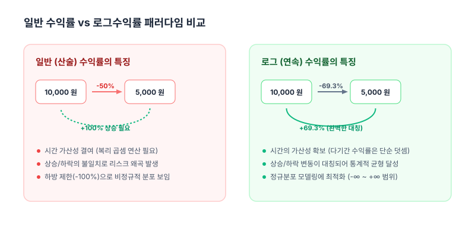

# 1.12 로그수익률(연속복리수익률)의 도출과 개념: 수익률의 덧셈 마법

## 1. 도입
지난 절에서 우리는 이자를 나누어 지급하는 횟수 $n$이 늘어날수록, 실효 이자율이 점진적으로 상승하되 그 증가세는 완만해지는 현상을 확인했습니다. 그렇다면 한 걸음 더 나아가 질문을 던져보겠습니다. 이자 지급 주기를 1년, 한 달, 하루, 1초... 그보다 더 짧은 **'찰나의 순간(Continuously)'**마다 이자가 붙는다면 우리의 자산은 어떻게 될까요? 무한히 많은 복리 계산이 누적되면 자산은 무한대로 발산할까요, 아니면 특정 한계치에 도달할까요?

수학은 '무한'이라는 도구를 빌려와 이 질문에 대해 놀랍도록 정갈하고 아름다운 답을 제시합니다. 시간의 간격을 0으로 수렴시키는 극한의 세계에서 금융은 복잡한 다항식의 굴레를 벗어나 자연의 성장 법칙과 하나가 됩니다. 이번 절에서는 무한 복리의 종착지인 **'연속 복리(Continuous Compounding)'**의 개념을 엄밀하게 유도하고, 현대 금융공학의 표준 언어인 **'로그수익률(Log Return)'**의 탄생 비화를 수학적·직관적으로 파헤쳐 보겠습니다.

---

## 2. 본론

### 2.1 패턴의 발견: 이산 복리에서 식의 규칙 찾기
무한 복리를 수학적 극한으로 다루기 전에, 이자가 붙는 횟수 $n$이 늘어남에 따라 자산이 늘어나는 구체적인 규칙(패턴)을 나열해 봅시다. 이를 통해 추상적인 수식의 구조를 훨씬 직관적으로 이해할 수 있습니다.

연이율이 $r$이고 원금이 $S_0$일 때, 기간을 쪼개어 복리를 계산하는 과정을 직접 전개해 보겠습니다.

#### ① 연 복리 ($n=1$)
이자를 1년에 단 한 번 지급합니다. 1년 후 자산 $S_1$은 단순히 원금에 연이율을 곱해 더한 값입니다.
$$S_1 = S_0 + S_0 \cdot r = S_0 (1 + r)$$

#### ② 반기 복리 ($n=2$)
이자를 6개월(0.5년)마다 한 번씩, 총 2번 나누어 지급합니다. 이때 적용되는 반기 이율은 $r/2$가 됩니다.
* **6개월 후 자산 ($S_{0.5}$):**
  $$S_{0.5} = S_0 \left(1 + \frac{r}{2}\right)$$
* **1년 후 자산 ($S_1$):** 6개월 시점의 자산 전체가 다시 복리로 성장합니다.
  $$S_1 = S_{0.5} \left(1 + \frac{r}{2}\right) = \left[ S_0 \left(1 + \frac{r}{2}\right) \right] \left(1 + \frac{r}{2}\right) = S_0 \left(1 + \frac{r}{2}\right)^2$$

#### ③ 분기 복리 ($n=4$)
이자를 3개월(0.25년)마다 한 번씩, 총 4번 나누어 지급합니다. 분기별 이율은 $r/4$입니다.
* **3개월 후 ($S_{0.25}$):** $S_0 (1 + \frac{r}{4})$
* **6개월 후 ($S_{0.5}$):** $S_{0.25} (1 + \frac{r}{4}) = S_0 (1 + \frac{r}{4})^2$
* **9개월 후 ($S_{0.75}$):** $S_{0.5} (1 + \frac{r}{4}) = S_0 (1 + \frac{r}{4})^3$
* **1년 후 ($S_1$):** $S_{0.75} (1 + \frac{r}{4}) = S_0 (1 + \frac{r}{4})^4$

---

### 2.2 극한의 복리: 자연상수 $e$와의 만남
위에서 발견한 규칙을 일반화하면, 1년 동안 $n$번 나누어 복리를 계산할 때의 최종 자산 공식은 다음과 같이 유도됩니다.
$$S_1 = S_0 \left(1 + \frac{r}{n}\right)^n$$

이제 이자 지급 횟수 $n$을 무한대로 보내는 극한($n \to \infty$)을 취해봅시다. 초기 원금 $S_0 = 1$이라 가정하고 극한 식을 전개해 보겠습니다.
$$\lim_{n \to \infty} S_1 = \lim_{n \to \infty} \left(1 + \frac{r}{n}\right)^n$$

이 극한을 계산하기 위해 $\frac{r}{n} = \frac{1}{k}$로 치환합니다. 연이율 $r$은 고정된 상수이므로, 나누는 횟수 $n \to \infty$가 되면 $k = \frac{n}{r} \to \infty$가 됩니다. 또한 $n = kr$이 성립하므로, 이를 식에 대입합니다.

$$\lim_{n \to \infty} \left(1 + \frac{r}{n}\right)^n = \lim_{k \to \infty} \left(1 + \frac{1}{k}\right)^{kr}$$

지수법칙($a^{xy} = (a^x)^y$)에 의해 식을 묶어줍니다.
$$\lim_{k \to \infty} \left[ \left(1 + \frac{1}{k}\right)^k \right]^r$$

이때 미적분학에서 다루는 **자연상수(Euler's Number) $e$**의 정의가 등장합니다.
$$\lim_{k \to \infty} \left(1 + \frac{1}{k}\right)^k = e \approx 2.71828$$

따라서 극한식 내부의 괄호는 $e$로 수렴하며, 1년 후 연속 복리로 성장한 자산의 가치는 다음과 같이 매우 간결한 지수 함수 형태로 정리됩니다.
$$\lim_{n \to \infty} \left(1 + \frac{r}{n}\right)^n = e^r$$

이를 일반화하여 초기 자산이 $S_0$일 때, 연이율 $r$로 $t$년 동안 매 순간 연속 복리로 성장한 최종 자산 가격 $S_t$의 공식은 다음과 같습니다.
$$S_t = S_0 e^{rt}$$

이 식은 매 순간 끊임없이 이자가 자라나는 '연속적 성장'을 묘사하며, 금융 수학과 연속 시간 모델(Continuous-time Model)의 기초 뼈대를 이룹니다.

<iframe src="contents/black_scholes_equation_01/sec_01/assets/diagrams/sub_01_12_visual1.html" width="100%" height="520px" frameborder="0" scrolling="no"></iframe>

---

### 2.3 로그수익률의 도출: 두 가지 경로
우리는 금융 시장에서 자산의 변화를 측정할 때 왜 일반(산술) 수익률 대신 자연로그가 포함된 '로그수익률'을 선호할까요? 로그수익률이 유도되는 두 가지 결정적인 수학적 경로를 살펴보겠습니다.

#### 경로 1: 연속 복리 공식의 역연산
앞서 유도한 연속 복리 공식 $S_t = S_0 e^{rt}$에서 투자 기간을 1기간($t=1$)이라 두고, 자산 가치의 변화 속에서 내포된 연속복리이율 $r$을 역산해 봅시다.
$$S_t = S_0 e^r$$

양변을 초기 자산 $S_0$로 나누어 자산의 성장 배율(Price Ratio)을 구합니다.
$$\frac{S_t}{S_0} = e^r$$

양변에 밑이 $e$인 자연로그($\ln$)를 취하여 지수 위에 있는 $r$을 아래로 내립니다. $\ln(e^r) = r$이므로 다음 식이 도출됩니다.
$$\ln\left(\frac{S_t}{S_0}\right) = r$$

이때 도출된 연속복리이율 $r$이 바로 **로그수익률(Log Return)**입니다.
$$R_{log} = \ln\left(\frac{S_t}{S_0}\right)$$

#### 경로 2: 일반 수익률과의 실효적 등치 관계
이번에는 주식 시장에서 흔히 쓰이는 일반(산술) 수익률 $R_{simple}$과의 관계를 통해 유도해 보겠습니다. 현재 주가 $S_0$가 일정 기간 후 $S_t$가 되었을 때의 일반 수익률은 다음과 같습니다.
$$R_{simple} = \frac{S_t - S_0}{S_0} = \frac{S_t}{S_0} - 1$$

이로부터 자산의 성장 배율은 다음과 같이 나타낼 수 있습니다.
$$\frac{S_t}{S_0} = 1 + R_{simple}$$

이 자산이 이산적으로 한 번에 $R_{simple}$만큼 성장한 것과, 매 순간 연속 복리 $r$의 속도로 성장하여 도달한 최종 결과가 동일하다고 가정해 봅시다. 즉, 두 성장 배율이 일치해야 합니다.
$$1 + R_{simple} = e^r$$

이 식의 양변에 자연로그를 취해 연속 복리 속도 $r$을 구하면 다음과 같습니다.
$$\ln(1 + R_{simple}) = \ln(e^r)$$
$$r = \ln(1 + R_{simple})$$

여기에 $1 + R_{simple} = \frac{S_t}{S_0}$를 대입하면 경로 1과 완전히 동일한 로그수익률 공식이 유도됩니다.
$$r = \ln\left(\frac{S_t}{S_0}\right)$$

---

### 2.4 왜 금융 전문가는 로그수익률을 고집하는가?
일반 산술수익률은 직관적이지만, 자산 가격의 움직임을 정교하게 모형화해야 하는 퀀트나 금융공학자들에게는 치명적인 한계들을 가지고 있습니다. 로그수익률은 이를 완벽하게 보완합니다.

#### ① 시간의 가산성 (Time Additivity): "곱셈을 덧셈으로"
일반 수익률은 여러 기간에 걸쳐 누적될 때 곱해주어야 합니다. 예를 들어 1기에 10% 상승하고, 2기에 20% 상승했다면 누적 수익률은 단순히 더한 $30\%$가 아니라, 복리 효과가 반영된 값입니다.
$$(1 + 0.10) \times (1 + 0.20) - 1 = 1.1 \times 1.2 - 1 = 32\%$$

기간이 수백, 수천 일로 늘어나면 이 기하급수적인 곱셈 계산은 컴퓨터 연산에 부하를 주며 수학적 추론을 복잡하게 만듭니다. 반면 로그수익률은 자연로그의 성질($\ln(AB) = \ln A + \ln B$) 덕분에 **곱셈을 아주 명쾌하게 덧셈으로 변환**합니다.
* **1기 로그수익률**: $r_1 = \ln(S_1 / S_0)$
* **2기 로그수익률**: $r_2 = \ln(S_2 / S_1)$

두 기간을 합산한 누적 로그수익률을 구해봅시다.
$$r_1 + r_2 = \ln\left(\frac{S_1}{S_0}\right) + \ln\left(\frac{S_2}{S_1}\right) = \ln\left(\frac{S_1}{S_0} \times \frac{S_2}{S_1}\right) = \ln\left(\frac{S_2}{S_0}\right)$$

수많은 거래일의 수익률을 그저 단순히 더하기만 하면 전체 기간의 누적 수익률이 되는 놀라운 편리함(Time Additivity)을 제공합니다.

#### ② 가격 변동의 대칭성 (Symmetry): "상승과 하락의 완벽한 균형"
일반 수익률은 상승과 하락의 기준점 차이로 인해 비대칭성을 보입니다. 주가가 10,000원에서 $50\%$ 하락하여 5,000원이 된 후, 다시 원래 가격인 10,000원으로 돌아가려면 몇 %가 올라야 할까요? 똑같이 $50\%$가 오르면 7,500원에 불과하므로, 무려 **$100\%$가 상승**해야 원금이 회복됩니다. 즉, 일반 수익률의 세계에서는 $-50\%$와 $+50\%$가 서로를 상쇄시키지 못합니다.

반면, 로그수익률은 완벽한 대칭성을 지닙니다.
* **반토막 날 때 로그수익률:** $\ln(5,000 / 10,000) = \ln(0.5) \approx -0.693$ (즉, $-69.3\%$)
* **다시 2배가 될 때 로그수익률:** $\ln(10,000 / 5,000) = \ln(2) \approx +0.693$ (즉, $+69.3\%$)

두 로그수익률을 합하면 정확히 $0$이 됩니다. 이는 금융 시장의 평균 회귀 현상이나 리스크 관리 모델을 구축할 때 대단히 강력한 수학적 일관성을 부여합니다.

#### ③ 통계적 편리함과 정규성
실제 자산 가격은 $0$ 미만으로 떨어질 수 없습니다(유한책임 원칙). 따라서 일반 수익률은 하방이 $-100\%$로 막혀 있어 대칭적인 정규분포(Normal Distribution)를 따르기 어렵고 오른쪽으로 꼬리가 긴 왜곡된 분포를 보입니다. 

하지만 자산 가격의 비율에 로그를 취한 로그수익률은 그 범위가 음의 무한대($-\infty$)부터 양의 무한대($+\infty$)까지 확장되므로, 통계학의 근간인 **정규분포 모델을 적용하기에 매우 적합**해집니다.

---

### 2.5 깊이 있는 통찰: 성장의 속도로서의 수익률
우리는 흔히 수익률을 단순히 '과거 대비 자산의 증가 비율'로 생각하지만, 로그수익률을 통해 이를 **'성장의 속도(Velocity of Growth)'**라는 물리학적 패러다임으로 바라볼 수 있습니다.

* **일반(산술) 수익률**: "내 돈이 지난달에 비해 10% 불어났다." (특정 시점과 시점 사이를 끊어서 관찰하는 이산적 변화율)
* **로그수익률**: "내 돈이 지금 이 순간에도 연 $r$의 복리 속도로 끊임없이 팽창하고 있다." (연속적인 시간 흐름 속에서 자산이 팽창하는 순간 속도)

우리가 고속도로를 달리는 자동차의 속력을 매 시간 단위의 평균 속력이 아닌 '순간 속도'로 실시간 측정하는 것처럼, 금융공학에서는 자산 가격의 미세한 움직임을 순간 속도인 로그수익률로 포착합니다. 블랙-숄즈 옵션 가격 결정 모형을 비롯한 현대 금융공학의 연속 시간 모형들이 탄생할 수 있었던 비결이 바로 수익률을 '비율'이 아닌 **'속도'**로 전환한 이 관점의 도약에 있습니다.

---

## 3. 요약

* **연속 복리**: 이자 지급 주기 $n$을 무한히 쪼개는 극한($n \to \infty$)에서 자산은 $S_t = S_0 e^{rt}$의 부드러운 지수 곡선을 그리며 성장합니다.
* **자연상수 $e$**: 무한히 쪼개진 복리 계산에서 자산 성장의 한계와 단위를 나타내는 상수로, $\lim_{k\to\infty}(1+1/k)^k$로 정의됩니다.
* **로그수익률**: 자산 가격 비율에 자연로그를 취한 값($\ln(S_t/S_0)$)으로, 연속 복리 공식의 역함수이자 일반 수익률에 로그 변환을 취한 형태와 같습니다.
* **로그수익률의 3대 장점**:
  1. **가산성**: 기간별 로그수익률을 단순히 더하는 것만으로 누적 수익률을 계산할 수 있습니다.
  2. **대칭성**: 자산 가격의 상승과 하락 크기가 동일한 절대값(부호만 반대)을 가집니다.
  3. **통계적 편리함**: 극단적 왜곡이 적어 정규분포 가정을 활용한 금융 수학적 분석에 최적화되어 있습니다.

---
*다음 절에서는 이 강력한 로그수익률을 무기 삼아, 무작위적으로 요동치는 시장의 변동성을 확률 분포로 변환하고 예측하는 '기하 브라운 운동(GBM)'과 금융 확률 모델링의 본질을 알아보겠습니다.*