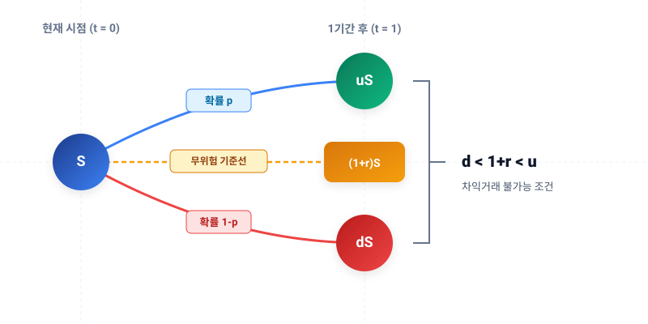

# 1.13 위험중립확률의 개념과 기초 수식 유도: 불확실성을 상수로 바꾸는 마법

## 1. 도입: 시장이 당신의 취향을 묻지 않는 이유

지난 절에서 우리는 연속 복리를 통해 자산이 시간에 따라 어떻게 자라나는지, 그리고 그 자산의 팽창 속도를 '로그수익률'이라는 세련된 도구로 측정하는 방법을 배웠습니다. 로그수익률은 시간의 가산성을 부여하며 우리에게 무한한 계산적 편리함을 제공했습니다. 하지만 금융 시장의 현실은 단순히 '시간의 흐름'이라는 일방통행 도로가 아닙니다. 그 위에는 **'내일 주가가 오를지 내릴지 모르는 불확실성(Uncertainty)'**이라는 거대한 안개가 자욱하게 깔려 있습니다.

자산의 미래 가치를 평가하고, 이를 바탕으로 옵션과 같은 파생상품의 공정한 가격을 결정하기 위해서는 이 '불확실성'을 수학적으로 다룰 수 있어야 합니다. 그러나 큰 난관이 있습니다. 현실 세계의 투자자들은 각자 위험을 받아들이는 태도, 즉 **'위험 선호도(Risk Preference)'**가 제각기 다릅니다. 누군가는 극단적인 위험 회피 성향을 가져 확실한 이자만을 원하고, 누군가는 위험을 즐기며 높은 프리미엄을 요구합니다. 이처럼 주관적인 인간의 심리가 가격 결정 공식에 개입하기 시작하면 수학적 모델은 통제 불능 상태에 빠집니다.

금융공학은 이 난제를 해결하기 위해 인식의 대전환을 시도합니다. 바로 **"만약 모든 투자자가 위험에 대해 무감각한 가상의 세계가 존재한다면?"**이라는 질문을 던지는 것입니다. 이것이 바로 현대 자산가격 결정 이론의 초석인 **'위험중립 세계(Risk-Neutral World)'**와 **'위험중립확률(Risk-Neutral Probability)'**의 시작입니다. 이번 절에서는 이 가상의 확률이 어떻게 수학적으로 엄밀하게 유도되는지, 그리고 어떻게 주관적인 시장의 위험을 지워내고 불확실성을 상수로 제어하는지 그 원리를 명쾌하게 파헤쳐 보겠습니다.

---

## 2. 본론

### 2.1 이항 모형(Binomial Model)과 차익거래 불가능 조건

가장 단순하면서도 직관적인 시장 모델인 **'이항 모형(Binomial Model)'**을 상상해 봅시다. 현재 시점($t=0$)의 주가를 $S$라고 할 때, 다음 한 기간 후($t=1$)에 주가가 움직일 수 있는 경로는 오직 두 갈래 길뿐이라고 가정합니다.

* **상승할 경우**: 주가는 $u \times S$ 가 됩니다. (여기서 $u > 1$ 은 상승 배수)
* **하락할 경우**: 주가는 $d \times S$ 가 됩니다. (여기서 $d < 1$ 은 하락 배수)

이때 시장에 동일한 기간 동안 확실한 이자를 주는 무위험 자산(예: 국채 혹은 예금)이 존재하고, 그 이자율이 $r$이라고 해봅시다. 즉, 현재 $1$원을 무위험 자산에 투자하면 다음 기간에 확실하게 $(1+r)$원이 됩니다. 

이 단순한 세계에서 시장이 비정상적인 왜곡 없이 균형을 이루려면, 즉 공짜 점심을 노리는 **'차익거래(Arbitrage)의 기회'**가 없으려면 반드시 다음과 같은 부등식이 성립해야 합니다.

$$d < 1+r < u$$

만약 이 균형이 깨진다면 어떤 일이 일어날까요?
* 만약 $1+r \ge u$라면, 주식이 아무리 잘 되어도 은행 이자보다 못하므로 합리적인 투자자는 주식을 전부 팔아치우고 무위험 예금에만 돈을 넣을 것입니다. 주식 시장은 붕괴합니다.
* 반대로 $1+r \le d$라면, 주식이 아무리 폭락해도 은행 이자율보다 높은 수익을 주므로, 투자자는 은행에서 무제한으로 돈을 빌려(무위험 차입) 주식을 사들이는 무위험 차익거래를 실행할 것입니다. 

따라서 시장이 정상적으로 존재하기 위해서는 무위험 수익률 $(1+r)$이 반드시 주가의 상승 폭($u$)과 하락 폭($d$) 사이에 단단히 갇혀 있어야 합니다.

---

### 2.2 위험중립확률($p$)의 기초 수식 유도

이제 우리는 투자자들이 위험을 회피하지도, 선호하지도 않고 오직 '기대 수익률'만으로 자산의 가치를 평가하는 가상의 **위험중립 세계**를 가정합니다. 이 세계에서는 주식과 같은 위험 자산을 보유했을 때 기대할 수 있는 미래의 가치가, 그 돈을 은행에 안전하게 넣어두었을 때 얻는 미래 가치와 완벽히 일치해야 합니다. 즉, **위험 자산의 기대 수익률이 무위험 수익률로 수렴**하는 평온한 상태입니다.

주가가 상승할 가상의 확률을 $p$, 하락할 확률을 $1-p$라고 설정해 봅시다. 그렇다면 $t=1$ 시점 주가의 수학적 기댓값 $E[S_1]$은 다음과 같이 표현할 수 있습니다.

$$E[S_1] = p(uS) + (1-p)(dS)$$

위험중립 세계의 정의에 따라, 이 기대값은 현재 주가 $S$가 무위험 이자율 $r$로 한 기간 동안 성장한 가치와 같아야 하므로 다음과 같은 등식이 성립합니다.

$$S(1+r) = p(uS) + (1-p)(dS)$$

이 식을 정리하여 가상의 확률 $p$를 구해보겠습니다. 먼저 양변에 공통으로 존재하는 현재 주가 $S$를 소거합니다. 주가의 절대적인 크기는 이 확률을 구하는 데 아무런 영향을 주지 못함을 알 수 있습니다.

$$1+r = pu + (1-p)d$$

우변의 괄호를 풀고 $p$에 대해 식을 전개합니다.

$$1+r = pu + d - pd$$

$$1+r - d = p(u - d)$$

최종적으로 양변을 $(u-d)$로 나누면, 우리가 찾고자 하던 가상의 오를 확률 $p$가 유도됩니다.

$$p = \frac{(1+r) - d}{u - d}$$

이 $p$값이 바로 금융공학에서 가장 중요하게 다루는 **위험중립확률(Risk-Neutral Probability)**입니다.

---

### 2.3 식의 직관적 해석과 확률적 성질

이 수식은 단순한 대수적 결과가 아니라, 매우 강력한 금융적 직관을 품고 있습니다. 

#### ① 완벽한 직관적 대칭성
우리가 앞서 시장의 기본 조건으로 합의했던 부등식 $d < 1+r < u$를 다시 떠올려 봅시다. 이 조건 덕분에 분모인 $(u-d)$는 언제나 양수이며, 분자인 $(1+r)-d$ 또한 언제나 양수가 됩니다. 동시에 분자는 항상 분모보다 작으므로, 유도된 값 $p$는 자연스럽게 $0 < p < 1$ 사이의 값으로 존재하게 되어 **확률의 수학적 정의**를 완벽하게 충족합니다.

여기서 분모 $(u-d)$는 주가가 위아래로 움직일 수 있는 **'총 변동 폭(Total Range)'**을 의미합니다. 그리고 분자 $(1+r)-d$는 무위험 이자율이 하락 한계선으로부터 얼마나 높이 솟아 있는지를 나타내는 **'상대적 성장 폭'**입니다. 즉, 위험중립확률 $p$는 주가가 움직일 수 있는 전체 운동장 안에서 무위험 수익률의 위치적 비율을 의미하는 기하학적 수치에 가깝습니다.

#### ② 보완적 짝($1-p$)의 유도와 완결성
그렇다면 주가가 하락할 위험중립확률인 $1-p$는 어떻게 표현될까요? 부등식 $d < 1+r < u$의 오른쪽 두 항의 관계, 즉 주가 상승 폭 $u$와 무위험 이자율 $1+r$의 차이를 이용해 대수적으로 계산해 볼 수 있습니다.

$$1-p = 1 - \frac{(1+r) - d}{u - d}$$

분모를 $(u-d)$로 통분하여 분자를 정리합니다.

$$1-p = \frac{(u-d) - \{(1+r) - d\}}{u-d}$$

괄호를 벗겨내면 분자의 $-d$와 $+d$가 서로 상쇄됩니다.

$$1-p = \frac{u - (1+r)}{u - d}$$

이 식 역시 매우 아름다운 대칭을 이룹니다. 상승할 확률 $p$의 분자가 '무위험 수익률과 하락폭의 거리'였다면, 하락할 확률 $1-p$의 분자는 '상승폭과 무위험 수익률의 거리'가 됩니다.

두 확률을 다시 합산해 보면 다음과 같이 정밀하게 1로 수렴하여 수학적 확률계(Probability System)의 완결성을 입증합니다.

$$p + (1-p) = \frac{(1+r)-d}{u-d} + \frac{u-(1+r)}{u-d} = \frac{(1+r) - d + u - (1+r)}{u-d} = \frac{u-d}{u-d} = 1$$

이로써 위험중립확률 $p$와 $1-p$는 실제 시장 참여자의 주관을 배제하고도, 시장에 주어지는 이자율($r$)과 자산의 변동성($u, d$)이라는 객관적인 뼈대만으로 설계할 수 있는 완벽한 가상의 확률 분포가 됩니다.

<iframe src="contents/black_scholes_equation_01/sec_01/assets/diagrams/sub_01_13_visual1.html" width="100%" height="520px" frameborder="0" scrolling="no"></iframe>

---

### 2.4 통찰: '물리적 확률'과 '위험중립확률'의 결정적 차이

이 개념을 처음 접하는 많은 이들이 가장 헷갈려하는 질문이 있습니다. *"내일 주가가 실제로 오를 확률이 호재 기사 때문에 70%에 달하는데, 왜 이 공식은 엉뚱한 값을 내놓는 건가요?"*

여기에 금융공학의 가장 깊은 비밀이 숨겨져 있습니다. **위험중립확률 $p$는 현실 세계에서 주가가 실제로 움직이는 '물리적 확률(Physical Probability)'이 결코 아닙니다.** 

두 개념의 차이를 극명하게 대조해 보겠습니다.

| 구분 | 실제(물리적) 확률 | 위험중립확률 |
| :--- | :--- | :--- |
| **개념** | 주가가 내일 실제로 상승할 현실의 확률 | 시장 가격의 균형을 유지하기 위해 역산된 가상의 확률 |
| **결정 요인** | 기업 실적, 거시 경제, 시장 참여자의 심리(탐욕과 공포) | 무위험 이자율($r$), 주가의 위아래 변동성($u, d$) |
| **성격** | 관측하기 어렵고 지극히 **주관적**임 | 시장 데이터를 통해 관측 및 계산이 가능한 **객관적** 지표 |
| **주요 용도** | 투자 방향성 판단 및 시나리오 분석 | 옵션 및 파생상품의 공정 가격(Fair Value) 계산 |

실제 현실에서 주가를 예측하려면 수만 가지의 경제 지표와 사람들의 심리를 계량화해야 하지만, 이는 사실상 불가능에 가깝습니다. 

그러나 우리는 위험중립 세계라는 렌즈를 통해, 복잡한 '위험 프리미엄에 대한 인간의 심리'를 전부 무위험 이자율 뒤로 숨겨버릴 수 있습니다. 현실 세계에서 주식의 실제 기댓값은 무위험 수익률보다 높아야만 사람들이 위험을 감수하고 투자하겠지만, 우리는 **이미 시장에 형성되어 거래되고 있는 주가($S$) 안에 그러한 위험 회피 심리가 고스란히 반영되어 녹아들어 가 있음**을 알고 있습니다. 

따라서 현재 주가를 기준점으로 삼고 차익거래 불가능 조건($d < 1+r < u$)을 대입하여 역산해 낸 위험중립확률 $p$는, 비록 가상의 수치일지언정 **파생상품의 가치를 단 하나의 정답으로 결정짓게 만드는 완벽한 나침반** 역할을 수행하는 것입니다.

---

## 3. 요약

* **위험중립 세계**: 투자자들의 위험 기피 성향을 배제하고, 모든 자산의 기대 수익률이 무위험 자산의 수익률과 같아진다고 가정하는 가상의 우주입니다.
* **차익거래 불가능 원칙**: 시장이 정상 작동하려면 무위험 수익률은 반드시 주가 변동 범위 사이에 존재해야 합니다($d < 1+r < u$).
* **위험중립확률 공식**: 주가 상승의 가상 확률은 $p = \frac{(1+r) - d}{u - d}$로 유도되며, 하락 확률은 $1-p = \frac{u - (1+r)}{u - d}$로 유도됩니다. 이 두 확률의 합은 항상 정밀하게 1이 됩니다.
* **핵심 가치**: 위험중립확률은 실제 주가가 상승할 물리적 확률이 아닙니다. 이 확률은 시장 가격의 공정성을 평가하기 위해 위험라는 무형의 주관적 변수를 지워버리고 산출해 낸 강력한 '가격 계산용 수학적 도구'입니다.

---
*다음 절에서는 우리가 손에 쥔 이 강력한 무기, '위험중립확률 $p$'를 직접 사용하여 실제 옵션 계약서가 미래에 가질 공정한 가치를 단돈 1원 단위까지 쪼개어 계산해 내는 '이항 옵션 가격결정 모형(Binomial Option Pricing Model)'의 실전 단계로 넘어가 보겠습니다.*