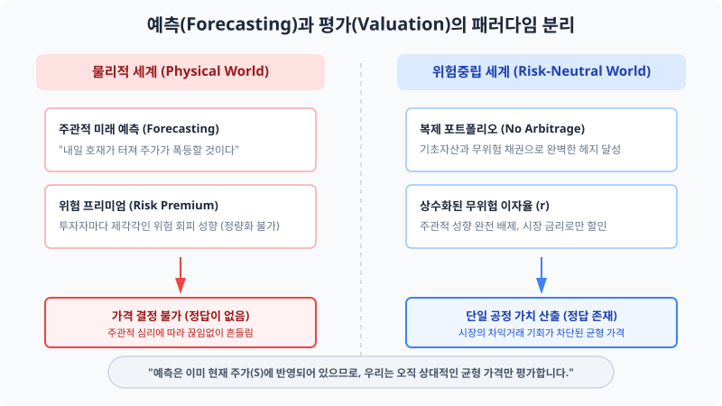

# 1.14 위험중립평가법(Risk-Neutral Valuation)의 유용성: 복잡함을 지우는 마법의 렌즈

## 1. 도입: 시장의 미로에서 탈출하는 법

지난 절에서 우리는 현실의 복잡한 인간 심리를 걷어내고 수학적으로 세련되게 정돈된 '위험중립 세계'를 구축했습니다. 그리고 그 가상의 세계 속에서 주가가 상승할 확률 $p$를 실제 투자자의 주관적 성향이나 미래 전망을 묻지 않고, 오직 시장에 주어지는 무위험 이자율 $r$과 주가의 상승·하락 변동성 배수 $u, d$만으로 산출해 냈습니다.

하지만 여전히 마음 한편에 지우기 힘든 의구심이 남는 것은 지극히 자연스럽습니다.
**"왜 굳이 있지도 않은 가상의 세계를 복잡하게 설정하여 우회하는가?"**
현실 세계의 투자자들은 위험을 극도로 꺼리거나(위험 회피형), 때로는 높은 이익을 바라고 기꺼이 불확실성에 뛰어듭니다(위험 선호형). 이렇게 저마다 위험을 바라보는 주관적인 기대치가 천차만별인데, 과연 이를 깡그리 무시하고 설계한 '가상의 확률 분포'와 계산 공식이 우리 주머니 속의 '진짜 돈'을 올바르게 평가해 줄 수 있을까요? 현실 세계의 거대한 자본 시장에서 이 가상의 도구가 절대적인 신뢰를 얻으며 작동하는 비밀은 무엇일까요?

이 질문에 대한 금융공학의 해답은 매우 역설적입니다. **현실 세계가 형언할 수 없을 정도로 지저분하고 복잡하기 때문에, 역설적으로 '위험이 배제된 세계'를 통과할 때만 복잡성에 가려져 있던 금융의 본질적이고 객관적인 정답이 드러납니다.** 이번 절에서 배울 **'위험중립평가법(Risk-Neutral Valuation)'**은 시장의 탐욕과 공포라는 짙은 안개를 거두어내고 유일한 균형 가격으로 우리를 이끄는 정밀한 렌즈입니다. 이 방법론이 주관적 불확실성을 객관적이고 수학적인 사실로 어떻게 뒤바꾸었는지 그 놀라운 메커니즘을 상세히 파헤쳐 보겠습니다.

---

## 2. 본론

### 2.1 위험 프리미엄이라는 정량화할 수 없는 무거운 짐

실제 현실 시장, 즉 물리적 세계(Physical World)에서 자산의 미래 가치를 계산해 내기 위해서는 무엇보다 먼저 인간의 내면에 드리워진 주관적 심리를 측정해야만 합니다. 사람들은 본능적으로 불확실한 자산을 기피하므로, 위험 자산에 내 돈을 묶어두는 대가로 은행 이자 이상의 추가적인 보상을 갈구하게 됩니다. 이를 금융 연구에서는 **'위험 프리미엄(Risk Premium)'**이라고 부릅니다. 이에 따라 물리적 세계에서 위험 자산인 주식에 요구되는 기대 수익률 $\mu$는 다음과 같이 정의됩니다.

$$\mu = r + \text{위험 프리미엄}$$

여기서 $r$은 무위험 이자율(예: 국고채 금리)입니다. 자산 가격 결정을 어렵게 만드는 주범은 바로 이 수식 뒤에 자리한 위험 프리미엄입니다. 

주가 지수의 변동성에 온 신경이 곤두서 밤잠을 설치는 극단적 위험 회피 성향의 투자자는 15%의 거대한 프리미엄을 요구할 것이고, 변동성을 하나의 놀이처럼 즐기는 대담한 투자자는 단 3%의 프리미엄만 주어져도 기꺼이 투자를 결정할 수 있습니다. 자산가격 결정 공식의 내부에 이처럼 주관적으로 날뛰는 매개변수인 '위험 프리미엄'이 포함되는 순간, 수식은 객관성을 잃어버리고 단순한 주관적 추정이나 설문조사 결과물 수준으로 격하되고 맙니다. 모든 시장 참여자가 상호 합의하고 기꺼이 거래를 결성할 수 있는 단 하나의 **'공정한 정가(Fair Price)'**를 산출하는 것은 사실상 수학적으로 완전한 난제에 봉착하게 되는 셈입니다.

그러나 위험중립평가법은 이 복잡하게 얽혀 있던 실타래를 한 칼에 끊어버립니다. 
> *"모든 시장 참여자가 위험에 전혀 개의치 않는 특수한 가상의 우주를 건설하자. 그렇다면 그 누구도 위험에 대한 보상인 '위험 프리미엄'을 요구하지 않을 것이다. 즉, 위험 프리미엄은 정확히 $0$이 될 것이고, 시장에 존재하는 주식이나 옵션 등 모든 위험 자산의 평균적인 기대 성장률은 은행 예금 이자율인 무위험 이자율 $r$로 완벽하게 수렴한다."*

이 우아하고 과감한 사고의 대전환을 통해, 우리는 금융 수학 공식 속에서 측정 불가능하고 지저분한 '개인의 주관적 성향'을 완벽하게 축출하는 데 성공하게 됩니다.

---

### 2.2 복제 포트폴리오(Replicating Portfolio)의 논리: 가상이 현실로 도약하는 징검다리

"가상이 계산하기 편리하다는 것은 알겠지만, 가짜 세계의 논리로 구한 가격이 어떻게 진짜 돈이 흐르는 현실 시장에서도 동일하게 적용된다는 말인가?"라는 매서운 질문에 대해 금융공학은 **'복제 포트폴리오(Replicating Portfolio)'**와 **'일물일가의 법칙(Law of One Price)'**이라는 정교한 이중 잠금장치로 답변합니다.

우리가 가정한 위험중립 세계에서 유도한 옵션의 가격은, 계산을 위해 상상해 낸 신기루 같은 가상 가격에만 머무르는 것이 아닙니다. 그것은 실제 시장에서도 '절대적으로 수렴할 수밖에 없는 균형 가격'입니다. 원리는 다음과 같습니다.

현재 시점($t=0$)에서 주식(기초 자산)을 일정 비율 $\Delta$주 매수하고, 나머지 금액은 무위험 자산(채권)에 $B$만큼 예금(혹은 차입)을 해두는 인위적인 바구니, 즉 포트폴리오를 구성한다고 가정합시다. 이 포트폴리오의 미래 만기 가치가 주가가 오르는 시나리오($uS$)에서든 내리는 시나리오($dS$)에서든 상관없이 우리가 가치 평가하고자 하는 '옵션의 만기 페이오프'와 단 1원의 오차도 없이 일치하도록 정밀 설계할 수 있다면 어떻게 될까요?

1. **위험의 완전한 상쇄 (Hedging)**: 주식과 채권의 수량을 교묘하게 맞추어, 만기에 상승 상황이 닥치든 하락 상황이 닥치든 내 지갑의 최종 금액이 일정하도록 포트폴리오를 조직합니다. 이 순간, 이 포트폴리오 내부에서는 주가 움직임이라는 불확실성(위험)이 상호 상쇄되어 사라집니다.
2. **차익거래 불가능 원칙의 구속력**: 시장에 위험이 완벽히 헤지되어 '무위험 상태'가 된 포트폴리오가 놓여 있다면, 이 포트폴리오의 수익률은 반드시 시중 은행의 무위험 금리 $r$과 한 치의 차이도 없어야 합니다. 만약 이 무위험 포트폴리오가 예금 금리보다 단 0.1%라도 높은 수익을 제공한다면, 영리한 차익거래자들은 무제한으로 은행에서 예금을 대출받아 이 포트폴리오를 대량 매수하는 무위험 차익거래(Arbitrage)를 수행할 것입니다. 반대로 이 포트폴리오의 수익률이 금리보다 낮다면, 포트폴리오를 공매도하여 얻은 돈을 전부 안전한 예금 계좌에 집어넣어 공짜 수익을 취할 것입니다. 이러한 자금의 급격한 흐름은 결국 포트폴리오의 가치를 무위험 수익률 방향으로 수렴시킵니다.
3. **가치의 강제적 일치**: 따라서 위험이 철저하게 정화된 '복제 포트폴리오'의 현재 가격과 우리가 평가하려는 '옵션의 현재 가격'은 반드시 정확히 일치해야만 합니다. 만약 다르게 거래된다면, 그 틈을 노린 거대한 무차입 차익거래 세력에 의해 두 가치의 괴리는 즉각적으로 좁혀져 균형을 되찾을 것입니다.

이 차익거래와 복제의 긴밀한 톱니바퀴 메커니즘 속에서 가장 중요한 사실을 기억하십시오. **실제 시장 참여자들이 마음속으로 위험을 얼마나 두려워하든 간에, 그것은 이 복제 포트폴리오를 조율하고 일물일가의 가격을 묶어두는 수학적 뼈대에 아무런 간섭을 할 수 없다**는 사실입니다. 이미 포트폴리오 내부에서 변동성 위험이 기하학적으로 완벽하게 헤지(Hedge)되었기 때문에, 주관적인 위험 프리미엄은 설 자리를 잃고 소멸하며, 가치의 계산은 오직 객관적으로 주어지는 시장 변수들로만 가득 차게 됩니다.

아래의 인터랙티브 시뮬레이터를 조작해 보면서 주식 수량($\Delta$)과 채권 금액($B$)의 조합이 어떻게 미래의 불확실한 리스크를 완벽하게 제거하여 하나의 공정 가치를 도출하는지 그 균형 과정을 몸소 경험해 보시길 바랍니다.

<iframe src="contents/black_scholes_equation_01/sec_01/assets/diagrams/sub_01_14_visual1.html" width="100%" height="550px" frameborder="0" scrolling="no"></iframe>

---

### 2.3 위험중립평가 공식의 두 가지 수학적 얼굴

위험중립평가법은 위험이 거세된 균형 상태에서 가치를 재는 가장 정확하고 경제적인 잣대입니다. 이를 수학적으로 표현하는 데에는 직관적인 **'이항 대수 공식'**과 학계와 실무에서 폭넓게 애용하는 고도의 **'확률 측도론(Probability Measure) 방식'**의 두 가지 표현 방식이 존재하며, 두 공식은 다른 모습의 탈을 썼을 뿐 수학적으로 완벽하게 상통합니다.

#### ① 이항 모형에서의 직관적인 기대치 할인식
현재 시점에서 한 기간이 흐른 만기 주가 상승 시의 옵션 페이오프를 $V_u$, 주가 하락 시의 페이오프를 $V_d$라 칭하고, 우리가 앞서 유도해 둔 위험중립확률을 $p$라고 합시다. 이때, 현재 시점($t=0$)의 공정 옵션 가격 $V_0$는 다음과 같이 매우 명쾌하게 계산됩니다.

$$V_0 = \frac{1}{1+r} \Big[ p \cdot V_u + (1-p) \cdot V_d \Big]$$

수식의 안쪽 괄호 $\big[ p \cdot V_u + (1-p) \cdot V_d \big]$는 미래 시나리오별로 받게 될 두 갈래의 옵션 가치를 가상의 위험중립확률로 가중평균하여 구한 가상의 '기대 가치'입니다. 그리고 외부에 곱해진 할인 인자 $\frac{1}{1+r}$은 그 미래 기대치 값을 무위험 자산의 단일 할인율로 깎아서 시간의 가치만큼 되돌려 놓는 과정입니다. 이 한 줄의 수식이 이항 모형의 기저를 흐르는 알파이자 오메가입니다.

#### ② 확률 측도를 활용한 일반화된 기댓값 표현식
금융공학은 이 논리를 단지 두 갈래 길에 가두어두지 않고, 무수히 쪼개지는 연속적인 시간과 훨씬 복잡한 비선형 파생상품으로 가치를 실어 확장하기 위해 세련된 수학 언어인 확률 측도론을 채택합니다. 이때 위험중립적 환경을 지배하는 확률 체계를 특별히 **'위험중립 측도'** 혹은 **'$Q$-측도(Q-measure)'**라고 칭하며, 이 $Q$-측도 하에서 계산되는 기댓값 연산자 $\mathbb{E}^Q$를 차용하여 식을 일반화합니다.

$$C = \frac{1}{1+r} \mathbb{E}^Q [ V_1 ]$$

여기서 $C$는 옵션의 공정 현재가이며, $V_1$은 미래 만기 시점에 얻게 되는 최종 페이오프의 확률변수입니다. $\mathbb{E}^Q$는 주관적 탐욕이 제거된 위험중립 세상의 확률적 기댓값(평균)을 의미합니다. 

이 단순한 한 줄의 일반화된 관계식은 금융공학도들에게 실로 해방에 가까운 편의성을 선물합니다.
* **불가지론적 자유**: 투자자들이 속한 시장이 거품인지 폭락 장세인지, 개개인의 도덕적 해이나 위험 기피도가 어느 정도인지 등 주관적 속성에 대한 정보를 수집하기 위해 힘쓸 이유가 하등 없습니다.
* **매개변수의 단일성**: 알 수 없는 다채로운 주식의 실제 기댓값들을 지우고, 일간 금융 지표에서 명확히 공시되어 누구나 검증할 수 있는 객관적인 수치인 **'무위험 이자율 $r$'** 하나로 복잡한 가치 평가 체계를 통일시킵니다.
* **구조적 확장성**: 만기 시 조건부 보상 체계(Payoff Structure)만 수식으로 깨끗이 선언할 수 있다면, 연속적인 블랙-숄즈 모형이든 다기간 이항 트리 모형이든 관계없이 동일한 기댓값 산출과 무위험 할인 메커니즘의 결합으로 균형 가격을 손쉽게 사정할 수 있습니다.

---

### 2.4 통찰: '예측'과 '평가'의 위대한 분리

금융공학 역사상 위험중립평가법이 혁명적인 이정표로 기록되는 진정한 이유는 단순히 수학적 계산을 줄여주었기 때문이 아닙니다. 이 방법론은 인류가 수 세기 동안 자산을 거래하며 고착화해 온 **'예측(Forecasting)'의 영역과 '평가(Valuation)'의 영역을 최초로 완전무결하게 격리**해 냈기 때문입니다.

전통적인 투자 세계관에 사로잡힌 이들은 금융 상품의 가격을 매기기 위해 끝없이 미래를 예견하려 애썼습니다. "앞으로 미국의 기준금리가 내릴까? 주가가 내년엔 3000포인트를 돌파할 것인가?"와 같은 예측이 맞아떨어져야만 정확한 가치를 산정할 수 있다고 맹신했습니다. 그러나 위험중립평가법은 금융을 설계하는 이들에게 완전히 새로운 패러다임의 지평을 활짝 열어주었습니다.

> "우리는 내일 아침의 시장이 어느 방향으로 치달을지 오만하게 예언하려 들 필요가 전혀 없습니다. 시장에 우글거리는 수백만 명의 투자자들의 탐욕, 주관적인 전망, 공포는 **이미 그들이 치열하게 치받으며 거래를 체결해 낸 현재 기초 자산의 주가($S$) 안에 한 방울의 오차도 없이 선반영되어 수렴해 있기 때문**입니다. 
> 
> 금융공학자로서 우리가 할 일은, 그 주관적 가치들이 정밀하게 녹아들어 있는 객관적인 결과물인 현재 시장 가격($S$), 무위험 금리($r$), 그리고 변동성($u, d$)을 설계의 지지대로 세워두고, 파생상품의 구조가 이 지지대들과 차익거래 기회 없이 단단히 얽혀 있도록 구조적 관계를 자로 재듯이 올곧게 평가해 내는 것뿐입니다."

이것이 금융공학이 세상을 향해 건네는 위대하고도 아름다운 규칙입니다. "방향을 알아내려는 맹목적인 주관적 고집을 내려놓으십시오. 시장의 굳건한 구조적 논리만을 철저히 따라간다면, 우리가 안전하게 발을 디뎌야 할 종착지는 오직 단 하나의 정교한 균형 가격으로 여러분을 맞이할 것입니다."

---

## 3. 요약

* **위험 프리미엄으로부터의 완벽한 해방**: 투자자들마다 제각각인 변덕스러운 위험 성향을 제거하여, 모든 자산의 기대 수익률이 깨끗한 무위험 수익률 $r$로 일정하게 자라난다는 대전제를 수립해 계산의 객관성을 영구히 수호합니다.
* **복제 포트폴리오의 실천성**: 기초 자산과 무위험 채권을 적절한 정밀 비율($\Delta, B$)로 배합하여 만기 페이오프를 빈틈없이 재현함으로써, 시장의 차익거래 메커니즘을 동력 삼아 공정 가치를 현실의 실물 자산과 강력히 결속시킵니다.
* **위험중립평가 공식의 유도**: 이항 모형의 $V_0 = \frac{1}{1+r} [p \cdot V_u + (1-p) \cdot V_d]$와 측도론적 일반화 식 $C = \frac{1}{1+r} \mathbb{E}^Q [ V_1 ]$은 무위험 할인 메커니즘과 객관화된 가상 확률 측도($Q$-measure)의 우아한 수학적 융합을 증명해 줍니다.
* **예측과 평가의 혁신적 분리**: 미래에 대한 맹목적이고 주관적인 '예측'의 집착에서 벗어나, 시장의 가격 정합성을 올바르게 조율하고 측정하는 '객관적 평가'의 시대를 공고히 개막하여 모든 파생금융상품 가치 평가의 단일 정답을 안겨줍니다.

---
*우리는 이제 위험중립 세계의 확률($p$)을 산출하는 공식과, 이를 기반으로 파생계약이 가져야 할 가치를 무위험 이자율로 엄정하게 되돌려 평가해 내는 이론적 토대를 완전하게 다졌습니다. 다음 장에서는 이 든든한 초석을 시간의 흐름에 따라 여러 마디로 촘촘하게 펼쳐두고, 현실의 복합적인 장기 계약과 만기 구조를 통제하는 '다기간 이항 옵션 가치평가 모형(Multi-period Binomial Option Pricing Model)'의 거대한 탑을 본격적으로 차곡차곡 쌓아 올려 보겠습니다.*