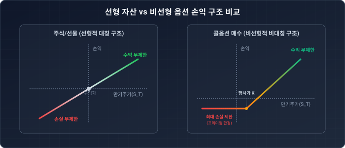

# 1.15 콜/풋옵션의 정의 및 만기 페이오프 구조: 권리가 만드는 비대칭적 마법

## 1. 도입: 수학적 엔진에 올릴 '가치의 설계도'

지난 절에서 우리는 **위험중립평가법(Risk-Neutral Valuation)**이라는 금융공학의 위대한 이정표를 세웠습니다. 실제 투자자들의 주관적인 탐욕과 위험 회피 성향을 수학적 논리로 걷어내고, 오직 무위험 이자율 $r$과 위험중립 확률 측도 $Q$만을 사용하여 모든 파생상품의 공정 가치를 일관되게 평가하는 수학적 엔진을 조립한 것입니다. 우리는 그 엔진의 우아한 구조를 다음과 같은 공식으로 확인했습니다.

$$C = \frac{1}{1+r} \mathbb{E}^Q [ \text{미래의 옵션 페이오프} ]$$

이 공식은 우리에게 아주 명확하고 강력한 다음 단계의 질문을 던집니다. 
**"그렇다면 우리가 저 기댓값 기호($\mathbb{E}^Q$) 안에 집어넣을 '미래의 옵션 페이오프(Payoff)'의 구체적인 정체는 과연 무엇인가?"**

아무리 완벽하게 조율된 연산 엔진을 보유하고 있더라도, 만기 시점에 평가 대상인 금융 계약이 우리에게 정확히 어떤 규칙과 조건으로 돈을 돌려주는지(페이오프 구조) 정의하지 못한다면 아무것도 시작할 수 없습니다. 일반 주식이나 선물 계약이 기초자산 가격의 오르내림에 운명을 고스란히 맡기는 단순한 '탑승권'에 가깝다면, 오늘 우리가 탐구할 **옵션(Option)**은 특정 상황에서 나에게 절대적으로 유리한 선택을 내릴 수 있도록 보장하는 배타적 **'선택권'**입니다. 

이 선택권이 만들어내는 독특한 가치의 설계도, 즉 콜옵션(Call Option)과 풋옵션(Put Option)의 만기 페이오프 구조를 패턴의 발견부터 수학적 정식화까지 상세히 파헤쳐 보겠습니다.

---

## 2. 본론

### 2.1 패턴으로 이해하는 만기 페이오프의 규칙

난해해 보이는 금융 수학 공식을 먼저 외우기 전에, 우리 일상에서 흔히 발생할 수 있는 구체적인 계약 예시를 통해 만기 시점에 실질적으로 오고 가는 이익의 패턴을 귀납적으로 나열해 보겠습니다. 이 나열 과정을 통해 수학자들이 왜 특정 함수를 채택하여 옵션을 수학적으로 정의했는지 그 정교한 이유를 자연스럽게 이해할 수 있습니다.

#### [시나리오 1] "A사 주식을 만기일에 무조건 1,000원에 살 수 있는 권리" (행사가격 $K = 1,000$원)

만기일 당일, 시장에서 무작위로 거래되는 A사 주식의 실제 최종 가격($S_T$)에 따라 이 권리를 쥐고 있는 투자자가 손에 넣게 되는 만기 가치(페이오프)를 하나씩 추적해 봅시다.

* **시장 가격($S_T$)이 800원일 때**: 시장에서 단돈 800원에 널려 있는 주식을 굳이 계약을 사용하여 1,000원에 비싸게 살 하등의 이유가 없습니다. 투자자는 권리 행사를 깨끗이 포기하고 계약서를 쓰레기통에 던집니다. 이때 이 계약의 가치는 **0원**입니다.
* **시장 가격($S_T$)이 900원일 때**: 역시 권리를 행사하지 않고 버립니다. 계약의 가치는 **0원**입니다.
* **시장 가격($S_T$)이 1,000원일 때**: 권리를 써서 사든 시장에서 직접 사든 차이가 없습니다. 가치는 **0원**입니다.
* **시장 가격($S_T$)이 1,100원일 때**: 드디어 권리가 빛을 발합니다. 계약을 행사해 주식을 1,000원에 저렴하게 넘겨받은 뒤, 이를 시장에 즉시 1,100원에 매도하여 차액을 챙깁니다. 가치는 **100원**입니다.
* **시장 가격($S_T$)이 1,200원일 때**: 1,000원에 사서 1,200원에 팔 수 있으므로 가치는 **200원**입니다.
* **시장 가격($S_T$)이 1,500원일 때**: 주가가 폭등할수록 이익도 선형적으로 커집니다. 가치는 **500원**입니다.

이 흥미로운 결과를 직관적으로 이해하기 위해 표로 정리하면 다음과 같은 굳건한 반복적 규칙(패턴)이 눈에 들어옵니다.

| 만기 주가 ($S_T$) | 800원 | 900원 | 1,000원 | 1,100원 | 1,200원 | 1,500원 |
| :--- | :---: | :---: | :---: | :---: | :---: | :---: |
| **만기 가치 (Payoff)** | **0원** | **0원** | **0원** | **100원** | **200원** | **500원** |
| **행사 여부** | 포기 | 포기 | 포기 | 행사 | 행사 | 행사 |
| **수학적 계산식** | $0$ | $0$ | $0$ | $1,100 - 1,000$ | $1,200 - 1,000$ | $1,500 - 1,000$ |

이 패턴이 보여주는 핵심 논리는 단순명료합니다. 만기 주가($S_T$)가 기준선인 1,000원 이하에 머물 때는 가치가 정확히 `0`으로 일괄 통일되어 묶이고, 1,000원을 돌파하여 우상향하는 순간부터는 `만기 주가 - 1,000원`만큼 가치가 정비례하여 늘어납니다. 

수학자들은 이처럼 **"두 개의 값 중에서 언제나 더 크거나 같은 값을 최종 선택하는 연산 규칙"**을 **$\max$ 함수**를 활용하여 다음과 같이 간결하고 완벽하게 압축합니다.

$$\text{만기 가치} = \max(S_T - 1,000, 0)$$

이 단순하면서도 강력한 수식이 바로 자산 가격의 상승 국면에서 가치가 폭발하는 **콜옵션(Call Option)**의 수학적 근간입니다.

---

### 2.2 콜옵션(Call Option): 상승에 베팅하는 비대칭적 권리

위에서 정밀하게 도출해 낸 패턴을 학술적 표준 공식으로 공식화하겠습니다. **콜옵션(Call Option)**이란 계약에서 미리 정한 미래의 특정 시점(만기일 $T$)에 기초자산(만기 주가 $S_T$)을 약속된 가격인 **행사가격(Strike Price, $K$)으로 매수할(살) 수 있는 권리**입니다.

만기 시점 $T$에서 콜옵션의 가치 $C_T$는 다음과 같은 공식으로 깨끗하게 정의됩니다.

$$C_T = \max(S_T - K, 0)$$

이 공식은 만기 시점 주가의 위치에 따라 시장 참여자들에게 다음과 같은 경제적 의사결정을 강제합니다.

1. **내가격 상태 ($S_T > K$, In-the-Money / ITM)**:
   현재 시장 가격이 행사가격보다 높은 상태입니다. 권리를 즉각 행사하여 자산을 $K$에 싸게 산 후 시장에 되팔아 $S_T - K$만큼의 현금 흐름을 남깁니다. 즉, 내재적 가치(Intrinsic Value)가 실질적으로 존재하는 영역입니다.
2. **외가격 상태 ($S_T < K$, Out-of-the-Money / OTM)**:
   시장에서 더 싼 가격에 매입할 수 있는 자산을 굳이 계약서상의 더 비싼 행사가격 $K$를 지불하고 살 바보 같은 투자자는 존재하지 않습니다. 권리를 깨끗이 포기하며, 이때 옵션의 가치는 마이너스 손실로 떨어지지 않고 정확히 **$0$**으로 회귀합니다.
3. **등가격 상태 ($S_T = K$, At-the-Money / ATM)**:
   시장 가격과 행사가격이 정확히 맞물린 경계선입니다. 실질적인 권리 행사 이득이 없으므로 가치는 $0$입니다.

아래의 인터랙티브 시뮬레이터를 통해 행사가격($K$) 슬라이더를 마우스로 조작해 보십시오. 행사가격의 변화에 따라 꺾임점이 어떻게 좌우로 기민하게 움직이는지, 그리고 $S_T$가 $K$를 돌파할 때 가치가 어떻게 $0$에서 꺾여 올라가는지 직관적으로 파악해 보시길 바랍니다.

<iframe src="contents/black_scholes_equation_01/sec_01/assets/diagrams/sub_01_15_visual1.html" width="100%" height="520px" frameborder="0" scrolling="no"></iframe>

여기서 놓치지 말아야 할 금융공학적 본질은 바로 **'손실의 하방 경직성'**입니다. 기초자산 주가가 상상치 못한 악재로 폭락하여 $0$원에 수렴하더라도, 옵션을 매수한 주체의 만기 페이오프는 단 1원도 마이너스로 빠지지 않고 $0$원이라는 든든한 바닥에서 완벽하게 방어됩니다.

---

### 2.3 풋옵션(Put Option): 하락장이라는 공포에 대비하는 보험

반대로, 자산 가격이 속절없이 하락하는 폭락장에서 오히려 가치가 눈덩이처럼 불어나는 대칭적인 성격의 계약 패턴을 살펴보겠습니다.

#### [시나리오 2] "A사 주식을 만기일에 무조건 1,000원에 팔 수 있는 권리" (행사가격 $K = 1,000$원)

이번에는 가격이 하락할 때 계약 소유자가 취할 수 있는 기하학적 이득의 패턴을 역으로 추적해 나열합니다.

* **시장 가격($S_T$)이 1,200원일 때**: 시장에 내다 팔면 1,200원을 톡톡히 받을 수 있는데, 계약을 발동시켜 굳이 1,000원에 싸게 팔 이유가 전혀 없습니다. 권리를 포기하며 계약의 가치는 **0원**입니다.
* **시장 가격($S_T$)이 1,000원일 때**: 권리를 행사하나 포기하나 결과가 같으므로 가치는 **0원**입니다.
* **시장 가격($S_T$)이 900원일 때**: 비로소 강력한 방어막 역할을 수행합니다. 주가가 하락하자 투자자는 시장에서 주식을 900원에 매입한 직후, 계약상의 권리를 행사해 상대방에게 1,000원에 넘겨버립니다. 가치는 **100원**입니다.
* **시장 가격($S_T$)이 800원일 때**: 주가가 하락할수록 이득은 비례하여 커집니다. 가치는 **200원**입니다.
* **시장 가격($S_T$)이 500원일 때**: 시장에서 폭락한 500원짜리 주식을 헐값에 주워 담아 계약 상대방에게 1,000원에 팔아넘기며 무려 **500원**의 가치를 창출합니다.

이 가치 흐름의 규칙을 표로 도식화해 보면 다음과 같습니다.

| 만기 주가 ($S_T$) | 1,200원 | 1,000원 | 900원 | 800원 | 500원 |
| :--- | :---: | :---: | :---: | :---: | :---: |
| **만기 가치 (Payoff)** | **0원** | **0원** | **100원** | **200원** | **500원** |
| **행사 여부** | 포기 | 포기 | 행사 | 행사 | 행사 |
| **수학적 계산식** | $0$ | $0$ | $1,000 - 900$ | $1,000 - 800$ | $1,000 - 500$ |

주가가 1,000원선보다 저점 구역으로 떨어질수록 가치가 점점 선형적으로 치솟는 독특한 패턴이 도출됩니다. 이를 일반화하여 공식으로 정의한 상품이 바로 **풋옵션(Put Option)**입니다. 풋옵션은 만기일($T$)에 기초자산($S_T$)을 사전에 합의된 행사가격($K$)에 **매도할(팔) 수 있는 법적 권리**입니다.

만기 시점 $T$에서 풋옵션의 가치 $P_T$는 다음과 같이 명쾌하게 귀결됩니다.

$$P_T = \max(K - S_T, 0)$$

* **$S_T < K$ (내가격 상태 / ITM)**: 주가가 아무리 나락으로 내려앉아도 나는 계약을 무기로 삼아 $K$라는 고정된 비싼 가격으로 자산을 강제 매도할 수 있으므로, 그 갭인 $K - S_T$만큼의 절대적인 현금 이익을 수취합니다.
* **$S_T \ge K$ (외가격 및 등가격 상태 / OTM & ATM)**: 시장에 그냥 파는 편이 훨씬 이득이므로 권리 행사를 기각하고 계약을 파기하며, 페이오프는 정확히 $0$이 됩니다.

아래의 실시간 시뮬레이션을 통해 풋옵션이 그려내는 거꾸로 된 하키 스틱(Hockey Stick) 형상의 비대칭적 페이오프 구조를 직접 시각적으로 확인해 보시길 바랍니다.

<iframe src="contents/black_scholes_equation_01/sec_01/assets/diagrams/sub_01_15_visual2.html" width="100%" height="520px" frameborder="0" scrolling="no"></iframe>

이처럼 풋옵션은 주가 폭락 리스크에 노출되어 있을 때 가치가 급증하여 손실을 완전히 만회해 주는 강력한 현대 금융 시장의 **'포트폴리오 보험(Portfolio Insurance)'** 역할을 완벽히 대행합니다.

---

### 2.4 통찰: 선형성을 깨뜨리는 '비선형성(Non-linearity)'의 마법

주식 현물 거래나 단순 선물(Futures) 계약, 그리고 채권 등 전통적인 고전 금융 상품의 손익 구조는 본질적으로 **선형적(Linear)**입니다. 즉, 내가 산 주식이 100원 상승하면 내 자산 가치도 정확히 대칭적으로 100원 불어나고, 반대로 100원 하락하면 내 자산 가치 역시 단 1원의 오차도 없이 대칭적으로 100원이 하락하는 일대일 대응의 정직한 구조입니다.

그러나 옵션이라는 도구는 `max`라는 비선형적 특수 필터를 통과하게 되면서 금융 시장에서 전무후무한 **비선형적(Non-linear) 손익 메커니즘**을 탄생시켰습니다. 이 꺾임의 마법이 금융공학에서 갖는 학술적·실무적 의의는 대단히 심오합니다.

#### ① 위험과 성과의 비대칭적 비틀기 (Asymmetric Risk-Reward)
선형 자산은 상방의 이익이 열려 있는 만큼 하방의 파산 위험 또한 동일한 크기로 노출됩니다. 하지만 옵션 매수자는 계약 체결 초기에 '옵션 프리미엄(Premium)'이라는 소액의 가격을 선지불하는 것만으로, 하방의 파멸적 위험은 정확히 고정된 소액 수준으로 제한하고 상방의 기대 수익은 기초자산 상승폭에 맞춰 무제한으로 열어젖히는 **비대칭적 손익 설계**를 현실화합니다.

#### ② 방향성의 예측을 넘어선 '변동성(Volatility)'의 상품화
전통적인 투자 패러다임 아래에서는 "주식의 가격이 내일 오를 것인가, 아니면 내릴 것인가?"라는 **방향(Direction)**을 정교하게 예측해야만 수익을 거머쥘 수 있었습니다. 

그러나 비선형성을 내포한 옵션은 방향성을 초월하여 **"주가가 어느 쪽이든 간에 얼마나 미친 듯이 요동치고 움직일 것인가"**라는 순수한 **변동성(Volatility)** 자체를 직접 매매할 수 있는 유일무이한 수단을 선사합니다. 주가가 한 자리에 고사한 듯 멈춰 있다면 콜옵션과 풋옵션의 권리는 시간의 마모 속에서 소멸하여 휴지조각이 되지만, 주가가 예상을 깨고 위아래 어느 쪽으로든 폭발적으로 이탈하기 시작하면 옵션 매수 포트폴리오의 가치는 순식간에 기하급수적으로 증폭되기 때문입니다.

---

## 3. 요약

* **권리와 의무의 분리**: 옵션은 만기일($T$)에 계약을 실행할지 여부를 온전히 스스로 결정할 수 있는 '살 권리(Call)'와 '팔 권리(Put)'를 거래하는 상품입니다. 나에게 손실이 된다면 언제든 권리 주장을 거절할 수 있으므로 강제적 의무는 수반되지 않습니다.
* **수학적 설계도의 확립**:
  * **콜옵션 만기 페이오프**: $C_T = \max(S_T - K, 0)$
  * **풋옵션 만기 페이오프**: $P_T = \max(K - S_T, 0)$
* **비선형성의 축복**: $\max$ 연산자의 작용에 기인하여 하방의 위험은 철저하게 $0$으로 감쇄 고정되고, 상방의 잠재 수익력은 온전하게 개방해 두는 대칭 붕괴적 가치 그래프를 창조합니다.
* **금융공학적 징검다리**: 본 절에서 구축한 이 비선형 만기 페이오프 공식들이야말로 우리가 앞선 1.14절에서 다져둔 위험중립 기댓값 공식 내부의 알맹이($\text{미래의 옵션 페이오프}$)로 직결되어 마침내 현대 파생계약의 공정가를 연산하는 유일무이한 열쇠 역할을 수행하게 됩니다.

---
*우리는 이제 가치 평가 수학 엔진에 주입할 가장 기본적이면서도 파괴적인 무기인 콜옵션과 풋옵션의 비선형 만기 가치 구조를 이론적으로 완벽하게 정의해 냈습니다. 다음 절에서는 이 비선형 페이오프 곡선을 무한히 확장되는 시간 축 위로 길게 길게 늘어뜨려, 실제 주가가 위아래 정교한 격자망(Lattice)을 타고 흘러가며 복잡다단한 현재 시점의 옵션 가격으로 역방향 수렴해 들어오는 '다기간 이항 옵션 가격결정 모형(Multi-period Binomial Model)'의 거대한 실제 연산 과정을 추적해 보겠습니다.*