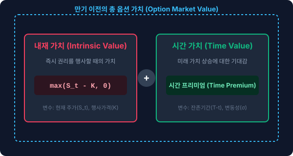

# 1.16 옵션 가격 책정(Pricing)의 본질과 문제 제기: 미래를 오늘로 가져오는 수학

## 1. 도입: 만기일이라는 '확신'에서 오늘이라는 '안개'로

지난 1.15절에서 우리는 옵션이라는 파생상품이 만기일($T$)에 도달했을 때 보여주는 '비대칭적 가치의 마법'을 수학적으로 확인했습니다. 기초자산의 가격이 아무리 하락하더라도 손실은 오직 매수할 때 지불한 프리미엄으로 한정하여 $0$원 밑으로 떨어지지 않게 묶고, 반대로 주가가 오르는 만큼 이익을 무제한으로 열어두는 우아한 수식인 콜옵션 만기 페이오프 $C_T = \max(S_T - K, 0)$를 설계했습니다. 그리고 이 설계도가 위험중립평가 엔진의 심장부에 주입될 핵심 연료라는 사실도 배웠습니다.

하지만 여기에서 금융공학 역사상 가장 정교하고 뜨거운 질문이 싹틉니다. **"만약 오늘이 만기일이 아니라면 어떨까요?"**

만기일 당일에는 주가 $S_T$가 우리 눈앞에 완전히 확정되어 있으므로, 옵션의 실질적 가치를 계산하는 것은 초등학생도 할 수 있을 만큼 직관적이고 간단합니다. 그러나 만기까지 3달, 혹은 1년이라는 긴 시간이 남아있고, 당장 내일 주가가 오를지 내릴지조차 알 수 없는 **'오늘($t$)'** 시점에서 우리는 이 비대칭적인 권리 증서에 정확히 얼마의 가격표를 붙여야 할까요?

단순히 "앞으로 오를 것 같으니 대충 비싸게 판다"는 식의 주관적인 감정이나 직관은 시장에서 통용될 수 없습니다. 시장 참여자 모두가 이성적이고 합리적으로 납득할 수 있는 '공정 가치(Fair Value)'를 정의하고, 보이지 않는 미래의 가치 흐름을 오늘날의 단 하나의 숫자로 정밀하게 당겨오는 과정—이것이 바로 **옵션 가격 책정(Option Pricing)**의 본질적인 원리이자 금융공학이 해결해야 할 궁극적인 과제입니다.

이 장에서는 시간과 변동성이 어떻게 만기 이전 옵션의 몸값을 구성하는지 패턴을 통해 살펴보고, 불확실성이라는 안개 속에서 오늘날의 가치를 도출해 내는 수학적 이정표를 하나씩 정밀하게 짚어보겠습니다.

---

## 2. 본론

### 2.1 만기 이전의 가치: 시간과 변동성이 만드는 패턴

만기 시점의 페이오프 공식인 $\max(S_T - K, 0)$는 만기 당일의 주가($S_T$)와 사전에 약정된 행사가격($K$) 두 가지만으로 결정되는 2차원적인 수식입니다. 그러나 만기 이전인 오늘($t$) 옵션의 가치는 단순히 오늘 주가($S_t$)와 행사가격($K$)의 차이만으로 설명되지 않습니다. 아직 만기까지 시간이 남아있다는 사실 그 자체가 옵션에 독특한 추가 가치를 부여하기 때문입니다.

이해를 돕기 위해, 행사가격 $K = 1,000$원인 콜옵션의 '만기 이전 실제 거래 가격'이 현재 주가 수준에 따라 어떻게 형성되는지 구체적인 수치 패턴을 귀납적으로 나열해 보겠습니다.

#### [표 1] 만기를 3개월 앞둔 콜옵션($K=1,000$)의 시장 가격 패턴 (예시)

| 현재 주가 ($S_t$) | 800원 | 900원 | 1,000원 | 1,100원 | 1,200원 |
| :--- | :---: | :---: | :---: | :---: | :---: |
| **(A) 즉시 행사 가치 (내재 가치)** $\max(S_t - K, 0)$ | 0원 | 0원 | 0원 | 100원 | 200원 |
| **(B) 실제 옵션 가격 (시장 가치)** | **15원** | **45원** | **95원** | **165원** | **250원** |
| **(B - A) 시간 가치 (시간 프리미엄)** | **15원** | **45원** | **95원** | **65원** | **50원** |

이 표를 세밀하게 뜯어보면 대단히 흥미롭고 일관된 세 가지 패턴이 발견됩니다.

1. **외가격(OTM) 영역에서의 시간 가치**: 현재 주가가 행사가격보다 훨씬 낮은 $800$원일 때, 당장 권리를 행사하면 가치는 당연히 $0$원입니다. 하지만 시장에서 이 옵션은 **15원**이라는 가치를 인정받아 거래됩니다. 만기까지 남은 3개월 동안 주가가 1,000원을 돌파하여 가치가 살아날 '일말의 가능성(확률적 기대감)'이 존재하기 때문입니다.
2. **등가격(ATM) 영역에서 극대화되는 시간 가치**: 현재 주가가 정확히 행사가격인 $1,000$원일 때, 즉시 행사 가치는 여전히 $0$원입니다. 그러나 실제 옵션 가격은 무려 **95원**에 달하며, 이 시점에서 시간 가치는 최대치를 기록합니다. 향후 주가가 위로 튈지 아래로 튈지 모르는 방향성의 불확실성이 극대화되는 경계점이기 때문에, 상승 시의 무제한 이익 가능성을 품은 이 권리의 몸값이 가장 매력적으로 평가받는 것입니다.
3. **내가격(ITM) 영역에서의 시간 가치**: 주가가 $1,200$원으로 크게 오르면 당장 권리를 행사해 수취할 수 있는 내재 가치만 해도 $200$원입니다. 하지만 실제 옵션 가격은 그보다 50원 더 비싼 **250원**입니다. 이미 이익 구간에 깊이 들어와 있어 안전마진을 확보한 상태이지만, 남은 기간 주가가 한층 더 상승할 여지가 열려 있기 때문입니다.

결국 만기 이전의 옵션 가치는 아래 그림과 같이 철저하게 두 가지 차원의 결합으로 구성됩니다.

* **내재 가치(Intrinsic Value)**: 현재 시점에서 옵션을 즉시 행사한다고 가정했을 때 얻을 수 있는 물리적인 가치로, 오직 기초자산 가격($S_t$)과 행사가격($K$)의 차이로만 결정됩니다.
* **시간 가치(Time Value)**: 만기일 전까지 자산 가격이 옵션 매수자에게 보다 유리한 방향으로 변동하여 발생할 수 있는 추가적인 기대수익의 가치입니다. 이 시간 가치를 결정짓는 양대 핵심 변수가 바로 **만기까지의 잔존 기간($T-t$)**과 자산 가격의 춤폭을 결정하는 **변동성($\sigma$)**입니다.

---

### 2.2 가격 결정의 대원칙: 할인된 위험중립 기댓값

우리가 앞서 확립한 위험중립평가법(Risk-Neutral Valuation)의 패러다임은 이 복잡한 불확실성을 단 하나의 일관된 수학적 질서 속으로 융합해 줍니다. 미래 만기 시점($T$)에 얻게 될 비선형적 페이오프의 수학적 기댓값을 구하되, 주관적인 기대수익률이 아닌 객관적인 '위험중립 확률 $Q$'를 사용하여 산출한 뒤, 이를 무위험 이자율 $r$을 적용해 현재 가치로 귀환(할인)시키는 것입니다.

이를 콜옵션의 현재 가격($C_t$)을 구하는 수식으로 선언하면 다음과 같습니다.

$$C_t = \text{할인계수} \times \mathbb{E}^Q [ \text{만기 시점 콜옵션 페이오프} ]$$

$$C_t = e^{-r(T-t)} \mathbb{E}^Q [ \max(S_T - K, 0) ]$$

* **$\mathbb{E}^Q [ \cdot ]$**: 위험중립 세계(Risk-neutral World) 하에서 계산한 만기 페이오프의 기댓값입니다.
* **$e^{-r(T-t)}$**: 만기 시점($T$)의 통화 가치를 오늘 시점($t$)의 현재 가치로 변환해 주는 **연속복리 할인계수(Continuous Discount Factor)**입니다.

아래의 실시간 인터랙티브 시뮬레이터를 통해 시간의 흐름이 옵션 가격에 미치는 가혹한 영향력을 직접 체험해 보십시오. 만기 잔존 기간($T-t$) 슬라이더를 왼쪽으로 당겨 만기가 임박해올수록, 곡선 형태를 그리던 부드러운 오늘날의 옵션 가치 그래프가 시간 가치를 모두 소실하고 결국 V자 형태의 뾰족한 '만기 페이오프 꺾인 선'으로 완전히 밀착하는 **시간 가치 잠식(Time Decay)** 현상을 직관적으로 관찰할 수 있습니다.

<iframe src="contents/black_scholes_equation_01/sec_01/assets/diagrams/sub_01_16_visual1.html" width="100%" height="600px" frameborder="0" scrolling="yes"></iframe>

#### 옵션 행사와 보유 비교
 r>1일 때 C>S-K라는 건 옵션에 시간가치가 있음로 옵션을 그냥 시장에 내다 파는 가격($C$)이 지금 당장 행사해서 얻는 이득($S-K$)보다 무조건 크다는 뜻입니다.
 왜냐하면 만약 주가가 폭락하더라도 옵션 매수자는 행사를 포기하면 그만이라 손실이 0원으로 제한됩니다(하방 경직성). 반면 주가가 오르면 이익은 열려 있습니다(상방 잠재력).
즉시 행사를 해버리는 순간, 이 '하방을 막아주는 안전벨트(보험 효과)'를 스스로 던져버리는 셈이 됩니다. 이 보험 효과의 남은 가치가 바로 시간 가치이며, 이 값이 늘 양수($>0$)이기 때문에 당장 깨부수는 것($S-K$)보다 보유하는 것($C$)이 항상 유리합니다.

---

### 2.3 [수학적 깊이 더하기] 왜 $e^{-r(T-t)}$가 할인계수가 되는가?

우리는 일상적인 은행 거래나 고전적인 경제학 문제를 풀 때 이산적인(Discrete) 단리 혹은 복리 할인 계산법을 자주 사용합니다. 예를 들어 1년 뒤에 받게 될 $1$원을 연 이자율 $r$로 매년 한 번씩 복리 할인하면 현재 가치는 $\frac{1}{1+r}$이 됩니다. 

만약 1년 동안 이자를 단순히 한 번에 지급하지 않고, 이자 지급 주기를 1년에 $m$번으로 더 쪼개어 지급하는 복리(Compounding) 계약을 맺었다면, $t$년 뒤의 $1$원을 오늘 시점으로 끌어당긴 현재 가치는 다음과 같이 정의됩니다.

$$\text{현재 가치} = \frac{1}{\left(1 + \frac{r}{m}\right)^{m \cdot t}} = \left(1 + \frac{r}{m}\right)^{-m \cdot t}$$

여기서 금융공학자들은 수학적인 완결성과 현실 모사를 위해 극단적인 질문을 던졌습니다. **"만약 이자를 나누어 지급하는 횟수인 $m$을 무한대($\infty$)로 극한 청구한다면 어떻게 될까? 즉 매 분, 매 초, 눈 깜짝할 찰나의 순간에도 이자가 연속적으로 미세하게 굴러가는 '연속복리(Continuous Compounding)'를 적용한다면 이 할인식은 어떻게 수렴할 것인가?"**

이 질문을 정식화하기 위해 식의 이자 지급 횟수 $m$을 무한대로 보내는 극한 연산을 수행해 보겠습니다. 계산의 편의를 위해 $n = \frac{m}{r}$이라고 치환하면, $m = n \cdot r$이 성립하며 $m \to \infty$ 일 때 $n \to \infty$가 됩니다. 이를 대입해 식을 재정리해 봅니다.

$$\lim_{m \to \infty} \left(1 + \frac{r}{m}\right)^{-m \cdot t} = \lim_{n \to \infty} \left(1 + \frac{1}{n}\right)^{-n \cdot r \cdot t} = \left[ \lim_{n \to \infty} \left(1 + \frac{1}{n}\right)^n \right]^{-rt}$$

이때 대괄호 안을 가만히 살펴보면, 고등학교 미적분학에서 배우는 자연상수(Euler's Number) $e$의 엄밀한 정의식과 완벽하게 일치함을 발견할 수 있습니다.

$$e = \lim_{n \to \infty} \left(1 + \frac{1}{n}\right)^n \approx 2.71828$$

따라서 이 복리 할인식의 극한값은 다음과 같이 극도로 단순하고 아름다운 지수함수 형태로 수렴하게 됩니다.

$$\lim_{m \to \infty} \left(1 + \frac{r}{m}\right)^{-m \cdot t} = e^{-rt}$$

우리가 다루는 금융 옵션 계약에서 오늘 시점을 $t$, 만기 시점을 $T$라고 정의하면, 만기까지 남아있는 실질적 잔존 기간은 $(T-t)$가 됩니다. 따라서 미래의 만기 가치를 오늘날의 가치 저울 위로 복원시키는 연속복리 할인계수는 필연적으로 **$e^{-r(T-t)}$**가 되는 것입니다.

#### 왜 금융공학에서는 일반 복리를 버리고 '연속복리'를 지향할까?

일반 시중은행의 상품들이 직관적인 연 복리나 월 복리를 사용함에도 불구하고, 현대 금융공학의 복잡한 방정식들이 하나같이 연속복리 구조를 기본 뼈대로 채택한 데에는 타당한 수학적 및 실무적 이유가 뒷받침되어 있습니다.

1. **수학적 미분의 독보적 우아함**: 일반적인 이산 복리 할인식인 $(1+r)^{-t}$을 시간에 대해 미분하면 지저분한 로그 항($\ln$)들이 번잡하게 튀어나와 수식을 극도로 왜곡시킵니다. 반면 자연지수함수인 $e^{-rt}$는 시간 $t$에 대해 미분을 가하더라도 자기 자신의 형태를 고스란히 보존하며 오직 상수 $-r$만을 앞으로 뱉어냅니다($\frac{d}{dt} e^{-rt} = -r e^{-rt}$). 이 간결한 성질 덕분에 향후 우리가 풀어내야 할 편미분방정식의 해법이 상상을 초월할 정도로 단순해집니다.
2. **현대 금융시장의 시간적 연속성**: 실제 현대 금융시장의 가격 변동과 차익 거래 기회는 하루 혹은 한 달 단위로 불연속하게 끊겨서 작동하지 않습니다. 컴퓨터 알고리즘과 초단타 매매(HFT)를 통해 자금은 매 밀리초(ms) 단위로 끊임없이 이동하고 가치가 평가됩니다. 이 연속적인 흐름을 빈틈없이 묘사하고 차익 거래가 원천적으로 불가능한 '무차익 정합성'을 확보하기 위해서는 연속복리 구조가 논리적으로 완벽한 완결성을 갖춘 확률계(Probability System)를 제공하게 됩니다.

---

### 2.4 문제 제기: 무한한 미래 경로라는 장벽

우리가 앞서 연속복리 할인계수 $e^{-r(T-t)}$를 아주 깔끔하게 유도해 냈고 가격 책정의 기본 뼈대를 수립했음에도 불구하고, 여전히 거대하고 거친 수학적 장벽이 우리 앞을 가로막고 있습니다. 바로 기댓값 기호 내부에 도사리고 있는 **$S_T$(만기 주가)의 제어하기 힘든 확률적 무작위성**입니다.

오늘 시점 $t$로부터 먼 미래인 만기일 $T$까지 기초자산의 가격이 움직여갈 수 있는 궤적(Trajectory)은 이론상 무한히 존재합니다.

* 매일 눈에 보이지 않을 만큼 미세하게 연속 우상향하여 만기에 부드럽게 도달하는 경로
* 숨이 막힐 듯한 극심한 롤러코스터 장세를 반복하다가 결국 오늘 가격 부근으로 회귀하는 경로
* 감당할 수 없는 파멸적 악재를 만나 일직선으로 대폭락을 겪으며 최종적으로 $0$원에 달라붙는 경로

이처럼 사방으로 뻗어 나가는 무수히 많은 미래 주가 경로들의 끝에는, 각기 다른 만기 주가 $S_T$가 기다리고 있으며, 그에 대응하는 옵션의 페이오프 또한 천차만별로 벌어집니다. 아래의 몬테카를로 시뮬레이션 위젯을 실행하여, 현재 주가에서 뻗어 나가는 수많은 주가 경로와 만기 시점에 형성되는 페이오프 분포의 복잡성을 직접 눈으로 확인해 보십시오.

<iframe src="contents/black_scholes_equation_01/sec_01/assets/diagrams/sub_01_16_visual2.html" width="100%" height="520px" frameborder="0" scrolling="yes"></iframe>

우리가 오늘 콜옵션의 공정 가치 $C_t = e^{-r(T-t)} \mathbb{E}^Q [ \max(S_T - K, 0) ]$를 단 하나의 완벽한 정답으로 계산해 내기 위해서는, 위 시뮬레이션에서 펼쳐진 무수히 많은 만기 주가들의 확률적 분포 지도를 수학적으로 단 한 치의 오차도 없이 그려내고 완벽히 제어할 수 있어야 합니다.

* 주가는 과연 어떤 확률분포의 통제 하에 움직이는가? (주가는 마이너스가 될 수 없다는 물리적 한계가 존재하므로, 단순 좌우대칭의 정규분포를 그대로 적용할 수는 없습니다.)
* 자산의 춤폭을 뜻하는 변동성($\sigma$)은 시간이 흘러 만기에 도달하는 내내 일정한 상수로 유지되는가?
* 시장의 대원칙인 무차익 거래(No-Arbitrage) 논리를 깨뜨리지 않으면서, 이 복잡한 미래 경로 전체를 깔끔한 하나의 격자망(Lattice)이나 미분방정식의 틀 안에 가두어 단 하나의 현재 가격으로 벼려낼 수 있는가?

이것이 바로 피셔 블랙(Fischer Black), 마이런 숄즈(Myron Scholes), 로버트 머턴(Robert Merton)을 비롯하여 현대 금융공학의 기틀을 닦은 위대한 천재들이 평생을 바쳐 매달렸던 궁극적인 숙제였습니다.

---

## 3. 요약

* **시간 가치의 본질**: 만기 이전의 옵션 가격은 당장 권리를 행사했을 때 챙길 수 있는 '내재 가치'에, 미래에 주가가 더 유리하게 변해줄 가능성의 몸값인 '시간 가치'가 유기적으로 덧붙여져 결정됩니다.
* **연속복리 할인의 필연성**: 금융공학에서 미래의 기댓값을 오늘날의 가치로 되돌려놓는 할인계수 $e^{-r(T-t)}$는 이산 복리 할인의 주기를 무한대($m \to \infty$)로 극한 청구하는 과정에서 자연스럽게 유도되는 수학적 결정체입니다. 이는 미분 연산의 편의성과 초 단위로 움직이는 현대 시장의 연속성을 대변합니다.
* **풀어야 할 숙제**: 옵션의 공정한 가격을 완성하기 위해서는 할인계수 뒤에 곱해진 무작위 기댓값 $\mathbb{E}^Q [\max(S_T - K, 0)]$을 명확하게 풀어내야 하며, 이를 위해서는 한 치 앞을 내다볼 수 없는 주가의 무한한 미래 변동 경로를 완벽하게 정형화할 구체적인 모델링 프레임워크가 절실히 요구됩니다.

---
*우리는 이제 미래의 불확실성을 오늘날의 단일 가치로 환산해 줄 완벽한 '마법의 저울(할인계수)'과 계산해야 할 '기댓값의 수학적 골격'을 모두 갖추었습니다. 다음 장부터는 주가의 갈가리 찢어지는 미래 경로를 통제 가능한 단순한 영역으로 끌어내리기 위해, 주가가 단 두 방향(상승과 하락)으로만 계단식으로 움직인다고 가정하는 직관적이면서도 대단히 강력한 도구인 **'이항 트리 가격결정 모형(Binomial Tree Model)'**의 수학적 모험을 함께 시작해 보겠습니다.*
