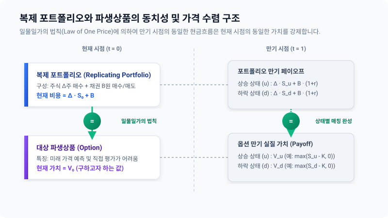

# 2.1 복제 포트폴리오(Replicating Portfolio)의 정의

## 1. 도입: 왜 파생상품은 가치를 구하기가 어려운가?

금융 시장에서 주식의 현재 가격은 시장 참여자들의 끝없는 매수, 매도 호가가 교차하며 만들어내는 타협점으로서 실시간으로 누구나 쉽게 알 수 있습니다. 하지만 미래의 특정 시점에 주식을 특정 가격으로 살 수 있는 권리인 **'옵션(Option)'**과 같은 파생상품은 어떨까요? 옵션은 미래의 불확실한 주가 변동 경로에 따라 만기일의 실질 가치가 드라마틱하게 변동합니다. 시장에서 쉽게 조달할 수 없으며, 미래 시나리오에 종속된 이러한 파생상품은 단순히 사람들의 막연한 기대 심리나 감정적인 호가만으로는 '합당한 적정 가격(Fair Value)'을 명쾌하게 증명하기 어렵습니다.

우리는 이 장에서 금융공학의 뿌리를 형성하는 가장 아름답고 논리적인 도구인 **'복제 포트폴리오(Replicating Portfolio)'**를 배웁니다. 이 개념을 명확히 이해하면 가격표가 아직 존재하지 않던 복잡한 옵션에 대해, 우리가 일상적으로 관찰할 수 있는 **주식(기초자산)**과 **채권(무위험 자산)**이라는 지극히 기본적이고 흔한 재료를 똑같이 정교하게 가공함으로써 한 치의 오차도 없는 가격표를 붙여낼 수 있게 됩니다.

---

## 2. 복제 포트폴리오의 본질

### 2.1 개념적 정의
복제 포트폴리오란 **"특정 파생상품이 만기 시점에 도달해 마주하게 될 모든 미래 상태(States)에서 창출할 현금 흐름(Payoff)과 100% 동일한 손익 결과를 내도록 정밀 설계된 주식(기초자산)과 채권(무위험 자산)의 조합"**을 의미합니다.

즉, 내일 당장 시장 주가가 폭등하든, 대공황처럼 하락하든 상관없이 옵션이 우리에게 안겨줄 미래의 가치 구조를, 우리가 일상적으로 거래할 수 있는 주식 $\Delta$주와 무위험 예치금(혹은 차입금) $B$원의 결합만으로 완벽하게 똑같이 흉내 내어 대체하는 가상의 바스켓입니다.

### 2.2 직관적 비유: '레고 블록'과 '특제 소스'
추상적인 원리를 이해하기 위해 일상적인 두 가지 비유를 들어보겠습니다.

* **비유 1 (레고 블록):** 시장 어디에서도 별도로 판매하지 않고 오직 특별 한정 사은품으로만 주는 희귀한 '우주선 완성품(옵션)'이 있습니다. 이 완성품의 객관적인 가치를 측정하기 위해, 우리는 문방구에서 낱개로 항시 판매하는 '기본 사각 블록(주식)'과 '기본 원형 블록(채권)'을 박스 채로 구매합니다. 설명서를 참조하여 이 두 종류의 흔한 기본 블록들을 완벽히 조립하여 희귀한 우주선 완성품과 겉과 속이 100% 똑같은 대체 조립품을 만들어냅니다. 이때 이 대체품을 완벽하게 완성하기 위해 사용된 **기본 사각 블록과 원형 블록의 총 구매 비용**이 바로 우주선 완성품의 정당한 균형 가격이 됩니다.
* **비유 2 (특제 소스):** 전설적인 맛을 자랑하지만 비법이 숨겨진 맛집의 '특제 양념 소스(옵션)'가 있습니다. 한 명석한 요리사는 이 양념의 정당한 가치를 계산하기 위해, 부엌에 흔하게 널려 있는 기초 조미료인 '설탕(주식)'과 '소금(채권)'을 정확한 비율로 정밀 배합하여 특제 양념 소스와 성분 및 맛이 100% 일치하는 '동일 성분 복제 소스'를 만드는 배합 비율을 알아냅니다. 이때 복제 소스를 배합하는 데 소비된 설탕과 소금의 총 원가가 바로 그 신비로운 특제 양념 소스의 타당한 공장 출고가와 동치가 됩니다.

---

## 3. 수학적 설계: 상태별 재현 (State-by-State Matching)

개념을 추상적인 기호로 정의하기 전에, 독자가 스스로 발견하는 '반복되는 묶음(패턴)'을 통해 수식을 자연스럽게 유도해 보겠습니다.

### 3.1 구체적인 숫자 패턴으로 수식 유도하기
현재 시장의 기초자산 주가 $S_0$가 **100원**이고, 내일 주가가 오르면 **120원**($S_u$), 내리면 **80원**($S_d$)으로 단 두 가지만 변하는 이항 세계(One-period Binomial Market)가 있다고 가정합시다. 이때 만기일 행사가격 $K$가 **100원**인 콜옵션(만기에 주식을 100원에 살 수 있는 권리)의 가격은 얼마가 적합할까요? (편의상 이자율 $r = 0$으로 둡니다.)

만기 시점에 직면하게 될 두 가지 상태를 세부적으로 나열해 봅시다.

1. **주가가 120원으로 오르는 상태 ($u$)**
   * 주식 가격: 120원
   * 콜옵션 가치: **20원** (120원짜리 주식을 100원에 살 수 있으므로 $120 - 100 = 20$원의 이득)
2. **주가가 80원으로 내리는 상태 ($d$)**
   * 주식 가격: 80원
   * 콜옵션 가치: **0원** (80원짜리 주식을 100원에 살 권리를 행사할 바보가 없으므로 권리 포기)

우리는 주식 $\Delta$주와 무위험 채권(예금/차입) $B$원을 조합하여 상승할 때도 20원이 되고, 하락할 때도 0원이 되도록 완벽하게 일치시키는 세트를 구해야 합니다. 이를 한눈에 볼 수 있도록 나열해 보면 다음과 같습니다.

* **상승 시 등식:** $\Delta \cdot (120) + B = 20$
* **하락 시 등식:** $\Delta \cdot (80) + B = 0$

이 연립방정식을 풀기 위해 두 식을 서로 빼보겠습니다.
$$(\Delta \cdot 120 + B) - (\Delta \cdot 80 + B) = 20 - 0$$
$$(120 - 80) \cdot \Delta = 20$$
$$40 \cdot \Delta = 20 \implies \Delta = 0.5 \text{ (주)}$$

주식 수 $\Delta = 0.5$주를 하락 시 등식에 다시 대입하면,
$$0.5 \cdot 80 + B = 0 \implies 40 + B = 0 \implies B = -40 \text{ (원)}$$

이 계산을 통해 도출된 완벽한 복제 포트폴리오의 구조는 **"주식 0.5주를 현재 매수하고, 동시에 40원의 빚을 지는(채권 매도, $B = -40$) 것"**입니다. 이 패키지 포트폴리오를 오늘 당장 매수하여 세팅하는 데 들어가는 실질 현재 비용은 다음과 같습니다.

$$\text{복제 비용} = \Delta \cdot S_0 + B = 0.5 \cdot 100 - 40 = 10 \text{ (원)}$$

만기 시 어떤 상태가 와도 이 포트폴리오는 콜옵션과 정확히 동일한 가치를 뱉어냅니다. 따라서 이 콜옵션의 현재 정당한 가격은 한 치의 오차도 없이 **10원**이 되어야 합니다.

---

### 3.2 실시간 파라미터 변동 관찰

아래의 인터랙티브 시뮬레이터를 조작하면서 주가와 행사가격, 이자율의 변화에 따라 복제 포트폴리오의 주식 비중($\Delta$)과 채권 차입액($B$)이 어떻게 실시간으로 재산출되어 정확히 수렴하는지 관찰해 보시기 바랍니다.

<iframe src="contents/black_scholes_equation_01/sec_02/assets/diagrams/sub_02_01_visual1.html" width="100%" height="780px" frameborder="0" scrolling="yes"></iframe>

---

### 3.3 일반식 도출
이제 위의 구체적인 숫자 패턴을 기호로 일반화하여 이론적 완결성을 갖춰봅시다.
미래의 상태가 오직 $u$(상승)와 $d$(하락)로만 분기되고 무위험 이자율이 $r$인 이항 세계에서, 옵션의 미래 가치를 각각 $V_u, V_d$라 칭한다면 복제 포트폴리오를 구성하기 위한 연립방정식 체계는 다음과 같이 일반화됩니다.

$$ \Delta \cdot S_u + B \cdot (1+r) = V_u $$
$$ \Delta \cdot S_d + B \cdot (1+r) = V_d $$

두 식을 빼서 $\Delta$를 소거법으로 구하면, 주식 투자 비중의 일반식을 도출할 수 있습니다.
$$ \Delta \cdot (S_u - S_d) = V_u - V_d \implies \Delta = \frac{V_u - V_d}{S_u - S_d} $$

이때 구해진 주식 비중 $\Delta$를 다시 대입하여 채권 투자액 $B$를 풀면 다음과 같습니다.
$$ B = \frac{1}{1+r} \cdot \left( \frac{S_u V_d - S_d V_u}{S_u - S_d} \right) $$

이렇게 유도된 주식 수 $\Delta$와 채권 규모 $B$는 주식과 채권만을 사용하여 만기 시점에 콜옵션을 오차 없이 복제해 냅니다. 따라서 이 복제 포트폴리오를 구성하는 현재 비용($V_0$)은 옵션의 현재 정가와 반드시 같아야만 합니다.

$$ V_0 = \Delta \cdot S_0 + B $$

---

## 4. 이론적 배경: 일물일가의 법칙과 무위험 차익거래

왜 복제 포트폴리오를 만드는 비용이 반드시 옵션의 시장 가격과 일치해야 할까요? 그 기저에는 금융경제학을 관통하는 가장 단단한 철칙인 **'일물일가의 법칙(Law of One Price)'**이 작용하고 있습니다.

### 4.1 차익거래(Arbitrage) 메커니즘: 가격 왜곡 시 일어나는 자기 수정 현상
시장이 만약 비합리적으로 오작동하여 복제 비용(10원)과 실제 장에서 거래되는 콜옵션의 가격이 서로 불일치하는 순간, 탐욕적이고 똑똑한 시장 참여자들에 의해 가격이 어떻게 강제로 10원으로 회귀하는지 그 상세 메커니즘을 상호보완적 표로 대조하여 살펴보겠습니다.

#### 시나리오 A: 시장 옵션 가격이 '12원'으로 고평가된 경우 (복제 비용 10원보다 높은 상태)
| 거래 시점 (현재, $t=0$) | 만기 시점 (미래, $t=1$) [주가 $120$원 상승 시] | 만기 시점 (미래, $t=1$) [주가 $80$원 하락 시] |
| :--- | :--- | :--- |
| **비싼 진짜 옵션 1개 매도**: $+12$원 수취 | 콜옵션 매수자에게 **$20$원 지급 의무** 발생 ($-20$원) | 콜옵션 매수자가 권리 포기하여 **의무 없음** ($0$원) |
| **복제 포트폴리오 매수**: $-10$원 지출 (주식 0.5주 매수, 40원 대출 실행) | 보유한 주식 0.5주 처분 ($+60$원) 및 대출금 상환 ($-40$원) = **$+20$원 가치 확보** | 보유한 주식 0.5주 처분 ($+40$원) 및 대출금 상환 ($-40$원) = **$0$원 가치 확보** |
| **즉시 확정 무위험 순수익**: **$+2$원** | **최종 정산 결과**: $-20 + 20 = \mathbf{0}$원 (청산) | **최종 정산 결과**: $0 + 0 = \mathbf{0}$원 (청산) |

**[시장 정화 작용]:** 시장 참가자들은 위험이 전혀 없이 즉시 2원의 불로소득을 복사해 낼 수 있는 이 기회를 놓치지 않고 고평가된 콜옵션을 무한히 **매도(Sell)**하기 시작합니다. 강력한 매도 폭탄이 집중되면서 옵션 가격은 수직 하락하게 되며, 정확히 10원에 도달할 때까지 이 차익거래 유인은 사라지지 않습니다.

#### 시나리오 B: 시장 옵션 가격이 '8원'으로 저평가된 경우 (복제 비용 10원보다 낮은 상태)
| 거래 시점 (현재, $t=0$) | 만기 시점 (미래, $t=1$) [주가 $120$원 상승 시] | 만기 시점 (미래, $t=1$) [주가 $80$원 하락 시] |
| :--- | :--- | :--- |
| **저렴한 진짜 옵션 1개 매수**: $-8$원 지출 | 옵션 행사로 **$+20$원 수취** | 옵션 권리 포기하여 가치 **$0$원** |
| **복제 포트폴리오 매도(공매도)**: $+10$원 수취 (주식 0.5주 공매도 및 40원 채권 매입) | 주식 쇼트 포지션 상환 ($-60$원) 및 채권 원금 회수 ($+40$원) = **$-20$원 가치 정산** | 주식 쇼트 포지션 상환 ($-40$원) 및 채권 원금 회수 ($+40$원) = **$0$원 가치 정산** |
| **즉시 확정 무위험 순수익**: **$+2$원** | **최종 정산 결과**: $+20 - 20 = \mathbf{0}$원 (청산) | **최종 정산 결과**: $0 + 0 = \mathbf{0}$원 (청산) |

**[시장 정화 작용]:** 저평가된 기형적 균형 상태에서는 시장 전체에 콜옵션에 대한 강력한 매수세가 발생하여 가격이 위로 강하게 밀어 올려 집니다. 결국 옵션 가격이 10원이 되어 차익거래 기회가 완벽하게 소거되는 시점에 도달해서야 시장은 비로소 평온한 균형(Equilibrium)을 이룩합니다.

---

## 5. 위험중립으로의 도약: 주관성의 완벽한 배제

복제 포트폴리오 이론이 금융공학 역사상 가장 위대하고 혁신적인 이정표로 평가받는 실질적인 이유는, 파생상품의 공정 가치 평가 방정식 내부에서 **'개별 투자자의 주관성'을 완전히 소거(Zero-out)**해 버렸다는 점에 있습니다.

현실 세계에서 일반 자산의 합당한 현재 가치를 책정하려면 매우 까다롭고 주관적인 예측이 필수적입니다.
* *"내일 주가가 120원으로 치솟을 진짜 확률은 과연 몇 %인가? (확률적 주관성)"*
* *"사람들이 극도로 위험을 회피해서 추가 보상을 강하게 바라는가? (위험 프리미엄의 주관성)"*

이와 같은 변수들은 사람의 심리와 주관에 종속되므로 수학적으로 단 하나의 보편타당한 답을 약속할 수 없습니다.

하지만 복제 포트폴리오는 오직 현재 시장에 실시간으로 깜빡이며 존재하는 **현재 주가($S_0$)**와 **무위험 이자율($r$)**이라는 완벽하게 객관적이고 관찰 가능한 상수만을 도구로 삼아 결과값을 유도해 냅니다.

주가가 오를 확률이 99.9%라고 단언하는 초낙관주의자가 오든, 99.9% 확률로 폭락할 것이라 울부짖는 초비관주의자가 오든, 그들이 시장 내에서 합의하고 있는 기초자산(주식)의 거래 가격 $S_0$와 국채 금리 $r$을 수용하는 한, 그들이 조립해내는 대체용 복제 포트폴리오의 영수증 금액(현재 비용 $V_0$)은 **항상 단 하나의 객관적인 숫자**로 귀결됩니다. 이 주관성 소거의 완벽함이 바로 차가우면서도 강력한 금융공학의 수학적 뼈대가 됩니다.

---

## 6. 요약: 이것만은 꼭 기억하세요!

1. **완벽한 복제(Replication)**: 가치 평가가 모호한 파생상품을 시장에서 항시 거래되는 주식(기초자산)과 채권(무위험 자산)의 포트폴리오 비율($\Delta, B$)로 완벽히 재조립하는 과정입니다.
2. **연립방정식 매칭**: 미래 만기 시 발생 가능한 상태별 파약물(Payoff)과 일대일로 일치시키는 방정식을 구성하여 주식 비중 $\Delta$와 채권 양 $B$를 추출합니다.
3. **일물일가의 법칙**: 미래에 동일한 현금 흐름을 창출하는 두 자산의 현재 가치는 같아야 하므로, 복제 포트폴리오 구축 비용($\Delta \cdot S_0 + B$)은 옵션의 유일하고 합당한 균형 가치와 같습니다.
4. **차익거래의 자정능력**: 시장가와 이론 복제 원가가 다르면 무위험 이윤을 갈구하는 차익거래 세력에 의해 가격은 오직 이론가로 강제 수렴합니다.
5. **객관화의 가치**: 이 가치 평가 모델에는 상승할 물리적 확률이나 위험 회피 심리와 같은 인간의 주관적 추정이 완벽히 배제된 객관적인 상수계만이 작동합니다.
