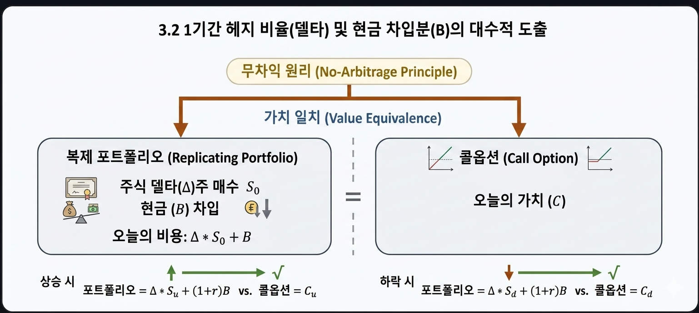

# 3.2 1기간 헤지 비율(델타) 및 현금 차입분(B)의 대수적 도출

## 1. 도입: '복제(Replication)'라는 마법, 포트폴리오의 탄생

앞선 섹션(3.1)에서 우리는 미래의 주가가 상승하거나 하락할 때, 콜옵션 보유자가 만기에 손에 쥐게 될 페이오프($C_u$와 $C_d$)의 패턴을 살펴보았습니다. 미래의 주가와 옵션 가치가 단 두 갈래 길로만 움직이는 단순화된 세계를 구축한 것입니다.

그렇다면 이제 가장 중요한 질문을 던질 때가 되었습니다. 
**"미래의 결과(만기 페이오프)를 알고 있다면, 오늘 당장 이 옵션의 가치(가격)는 얼마로 책정해야 하는가?"**

금융공학은 이 질문에 답하기 위해 아주 강력하고 마법 같은 개념을 제시합니다. 바로 **'복제(Replication)'**와 **'무차익 원리(No-Arbitrage Principle)'**입니다. 

만약 우리가 시장에 존재하는 주식과 채권(현금)을 적절히 섞어서 **"미래에 주가가 오르든 내리든 옵션과 완전히 똑같은 금액을 지급하는 복제 포트폴리오"**를 만들 수 있다면 어떻게 될까요? 일물일가의 법칙(같은 가치를 가진 두 자산의 가격은 같아야 한다)에 의해, 오늘 자로 구성한 '복제 포트폴리오의 비용'이 곧 '옵션의 합리적 가격'이 되어야만 합니다. 

이 마법 같은 복제 포트폴리오의 구성 비율인 헤지 비율(델타, $\Delta$)과 현금 차입분($B$)을 대수적으로 직접 유도해 보겠습니다.

---

## 2. 본론: 복제 포트폴리오의 구성과 대수적 유도

### 2.1 복제 방정식의 설계

우리가 현재 시점($t=0$)에서 인위적으로 조립할 포트폴리오는 다음과 같이 단 두 가지 재료로만 구성됩니다.

*   **주식 매수량 ($\Delta$):** 기초자산인 주식을 $\Delta$주 만큼 매수합니다.
*   **현금 보유/차입분 ($B$):** 무위험 이자율 $r$을 적용받는 예금에 $B$만큼 가입하거나, 반대로 $B$만큼 돈을 빌립니다. (돈을 빌릴 경우 $B$는 음수가 됩니다.)

현재 시점에서 이 포트폴리오를 구축하는 데 드는 총비용은 주가 $S$에 매수량 $\Delta$를 곱하고 현금 $B$를 더한 $\Delta S + B$입니다. 

이제 시간이 흘러 만기($t=1$)가 되었을 때, 이 포트폴리오가 옵션의 운명과 완벽하게 일치하도록 조건을 세워봅시다. 주가가 오르든 내리든 포트폴리오의 만기 가치는 옵션의 만기 페이오프($C_u, C_d$)와 한 치의 오차도 없이 똑같아야 합니다.

| 미래의 주가 상태 | 복제 포트폴리오의 만기 가치 | 옵션의 만기 페이오프 |
| :--- | :--- | :--- |
| **상승 상태 ($uS$)** | $\Delta(uS) + B(1+r)$ | $C_u$ |
| **하락 상태 ($dS$)** | $\Delta(dS) + B(1+r)$ | $C_d$ |

이 두 상태에서 두 자산의 가치가 완벽히 일치해야 하므로, 우리는 다음과 같은 연립 방정식을 얻게 됩니다.

$$\Delta(uS) + B(1+r) = C_u \quad \text{--- (식 1)}$$
$$\Delta(dS) + B(1+r) = C_d \quad \text{--- (식 2)}$$

아래의 대화형 천칭 시뮬레이터에서 주가, 이자율, 변동 요소를 조절해 보세요. 시장 상태가 어떻게 변하든, 우리가 설계할 복제 포트폴리오는 상승과 하락 두 가지 모든 경우에 옵션의 만기 페이오프와 완벽하게 수평(균형)을 이루게 됩니다.

<iframe src="contents/black_scholes_equation_01/sec_03/assets/diagrams/sub_03_02_visual1.html" width="100%" height="450px" frameborder="0" scrolling="no"></iframe>

---

### 2.2 대수적 도출 과정

이 연립 방정식에서 우리가 찾아야 하는 미지수는 **'얼마만큼의 주식을 사고($\Delta$)', '얼마만큼의 현금을 융통해야 하는가($B$)'**입니다. 단계별로 연립 방정식을 풀어보겠습니다.

#### [단계 1: 주식 매수량 $\Delta$(델타) 유도]
무위험 채권항 $B(1+r)$을 소거하기 위해, (식 1)에서 (식 2)를 통째로 빼줍니다.

$$[\Delta(uS) + B(1+r)] - [\Delta(dS) + B(1+r)] = C_u - C_d$$

좌변의 $B(1+r)$이 서로 상쇄되면서 주식에 관한 식만 남습니다.

$$\Delta(uS) - \Delta(dS) = C_u - C_d$$

공통인수 $\Delta S$로 묶어 정리합니다.

$$\Delta S(u - d) = C_u - C_d$$

양변을 $S(u - d)$로 나누면, 마침내 복제에 필요한 주식의 수량 $\Delta$가 도출됩니다.

$$\Delta = \frac{C_u - C_d}{(u - d)S}$$

---

#### [단계 2: 현금 보유액 $B$ 유도]
이제 구한 $\Delta$를 (식 1)에 다시 대입하여 현금 $B$를 구해보겠습니다. 먼저 (식 1)을 $B$에 대해 정리합니다.

$$B(1+r) = C_u - \Delta(uS)$$

위에서 구한 $\Delta$ 자리에 대수식을 대입합니다.

$$B(1+r) = C_u - \left( \frac{C_u - C_d}{(u - d)S} \right) \cdot uS$$

우변 분자의 $S$와 분모의 $S$가 약분되어 사라집니다.

$$B(1+r) = C_u - \frac{u(C_u - C_d)}{u - d}$$

우변의 통분을 위해 $C_u$의 분모를 $u - d$로 맞춰 합쳐줍니다.

$$B(1+r) = \frac{C_u(u - d) - u(C_u - C_d)}{u - d}$$

분자를 전개하여 묶어줍니다.

$$B(1+r) = \frac{uC_u - dC_u - uC_u + uC_d}{u - d}$$

$uC_u$와 $-uC_u$가 소거되면서 분자가 매우 간결해집니다.

$$B(1+r) = \frac{uC_d - dC_u}{u - d}$$

마지막으로 양변을 $(1+r)$로 나누어 정리하면, 복제에 필요한 무위험 현금 규모 $B$가 도출됩니다.

$$B = \frac{uC_d - dC_u}{(u-d)(1+r)}$$

---

## 3. 깊이 읽기: 수식이 지닌 물리적 한계와 경제적 의미

우리가 수학적 연산으로 도출해 낸 이 공식들은 단순한 기호의 나열이 아닙니다. 금융 시장의 작동 원리와 완결성 있는 '확률계(Probability System)'를 대변하는 정교한 의미를 담고 있습니다.

### 3.1 델타($\Delta$)의 물리적 범위와 의미: $0 \le \Delta \le 1$

$\Delta$ 식을 다시 한번 가만히 들여다봅시다.

$$\Delta = \frac{C_u - C_d}{(u - d)S} = \frac{\text{옵션 가격의 변화폭}}{\text{주식 가격의 변화폭}}$$

이것은 **"주가가 움직일 때 옵션 가격이 얼마나 민감하게 반응하는가"**를 나타내는 일종의 '기울기(민감도)'입니다. 콜옵션의 경우, 이 $\Delta$는 항상 $0$과 $1$ 사이의 값만을 가질 수밖에 없는 물리적 성질을 지닙니다.

1.  **하한선 ($0 \le \Delta$):** 기초자산 주가가 오르면 콜옵션 가치도 오르므로($C_u \ge C_d$), 분자는 항상 $0$ 이상입니다. 따라서 $\Delta$는 결코 음수가 될 수 없습니다.
2.  **상한선 ($\Delta \le 1$):** 콜옵션의 페이오프 구조상, 주가가 $1$원 오를 때 콜옵션 가치는 아무리 많이 올라도 $1$원보다 더 크게 오를 수 없습니다. 즉, $C_u - C_d \le (u - d)S$ 이므로 분자는 항상 분모보다 작거나 같습니다. 

따라서 콜옵션의 델타는 항상 다음 범위를 가집니다.

$$0 \le \Delta \le 1$$

우리가 만약 콜옵션 1계약을 매도(발행)하여 위험에 노출되어 있다면, 시장에서 정확히 $\Delta$만큼의 주식을 사서 보유함으로써 주가 변동 리스크를 완벽하게 상쇄(Hedge)할 수 있습니다. 이를 금융공학에서는 **'델타 헤징(Delta Hedging)'**이라고 부릅니다.

아래 시뮬레이터에서 주가와 행사가격을 조절하며 주가 변동에 따른 옵션 가치 곡선과, 그 위에서 실시간으로 변하는 접선의 기울기($\Delta$)를 기하학적으로 확인해 보세요.

<iframe src="contents/black_scholes_equation_01/sec_03/assets/diagrams/sub_03_02_visual2.html" width="100%" height="450px" frameborder="0" scrolling="no"></iframe>

---

### 3.2 현금 차입분($B$)의 부호가 지닌 경제적 의미: 레버리지($B < 0$)

엇갈려 곱해 차감하는 물리적 의미는 "상승 상황과 하락 상황의 주식 가치를 강제로 똑같이 만들어 주식의 영향을 완전히 소거(0으로 중화)시키는 작업"입니다.

이 과정이 일어나는 직관적 원리는 다음과 같습니다.

---

**1. 왜 엇갈려 곱하면 주식 가치가 똑같아질까?**

* **상승했을 때 주가**: $u \times S$
* **하락했을 때 주가**: $d \times S$

상승 시 주가($u S$)에 하락 배수($d$)를 곱하면 $u \cdot d \cdot S$가 됩니다.

반대로 하락 시 주가($d S$)에 상승 배수($u$)를 곱하면 $d \cdot u \cdot S$가 됩니다.

곱셈은 순서를 바꿔도 결과가 같으므로($u \cdot d = d \cdot u$), 두 상황에서의 주식 가치가 완전히 동일한 크기($u d S$)로 맞춰집니다.

**2. 숫자로 보는 직관적 예시**

현재 주가 $S = 100$원이고, 상승 시 20% 상승($u = 1.2$), 하락 시 10% 하락($d = 0.9$)한다고 가정하겠습니다.

* **상승 상황의 주가**: $100 \times 1.2 = 120$원
* **하락 상황의 주가**: $100 \times 0.9 = 90$원

여기서 상승 상황 전체에 하락 비율(0.9)을 곱하고, 하락 상황 전체에 상승 비율(1.2)을 곱해봅니다.

* 상승 상황 주가 $\times$ 0.9 = $120 \times 0.9 = \mathbf{108}$원
* 하락 상황 주가 $\times$ 1.2 = $90 \times 1.2 = \mathbf{108}$원

두 상황의 주식 평가액이 **108원으로 정확히 똑같아졌습니다.**

**3. 차감($u C_d - d C_u$)의 진짜 의미**

주식 가치가 108원으로 똑같아진 상태에서 두 상황을 빼버리면, **주식의 움직임(위험)은 완전히 0이 되어 사라집니다.**

주식의 영향이 지워진 자리에 남아있는 것은 오직 두 상황 간의 **순수한 현금 차이**뿐입니다. 즉, $u C_d - d C_u$라는 물리적 행위는 **주식이라는 불확실성을 양쪽에서 가상으로 똑같이 맞춰 찌꺼기처럼 걸러내고, 그 안에 숨어있던 순수 채권(대출/예금) 성분만 발라내는 스위핑(Sweeping) 과정**입니다.

---

이번에는 현금 규모 $B$의 수식을 살펴봅시다. 일반적인 콜옵션의 경우 만기 주가가 행사가격보다 높게 형성될 가능성이 존재하기 때문에, 대수적으로 $B$를 계산해 보면 대부분 **음수($B < 0$)**로 도출됩니다. 

현금 투자액이 음수라는 것은 무슨 의미일까요? 바로 은행이나 시장으로부터 **'무위험 이자율로 돈을 빌렸다(차입)'**는 뜻입니다.

*   **재무학적 통찰:** 
    이 결과는 콜옵션을 매수하는 행위가 재무적으로 **"돈을 빌려서($B < 0$) 주식을 소량 매수($\Delta S$)하는 레버리지 투자"**와 완벽하게 동일한 효과를 낸다는 것을 증명합니다. 옵션이라는 파생상품이 본질적으로 강력한 레버리지 효과를 갖는 이유가 바로 이 복제 공식의 $B$ 항에 숨겨져 있었던 것입니다.

---

## 4. 요약: 핵심 포인트

1.  **복제 원리(Replication):** 옵션과 완전히 동일한 만기 페이오프를 갖는 '주식($\Delta$) + 채권($B$)' 포트폴리오를 구성할 수 있으며, 이 포트폴리오의 현재 가치가 곧 옵션의 공정 가격이 됩니다.
2.  **헤지 비율 $\Delta$:** 주가 변동에 따른 옵션 가격의 민감도로, 콜옵션의 경우 항상 $0 \le \Delta \le 1$ 범위를 가지며 리스크 제거를 위해 보유해야 할 주식의 비율을 뜻합니다.
3.  **현금 차입분 $B$:** 포트폴리오를 완벽하게 복제하기 위해 필요한 현금 조정 장치로, 콜옵션의 경우 대개 음수($B < 0$) 값을 가집니다. 이는 옵션 매수가 '차입을 동반한 주식 투자(레버리지)'와 동치임을 시사합니다.

이제 우리는 복제 포트폴리오를 구성하는 구체적인 공식인 $\Delta$와 $B$를 직접 유도했습니다. 다음 섹션에서는 이 두 가지 핵심 도구를 결합하여, 오늘 자 적정 옵션 가격($C = \Delta S + B$)을 구하는 실제 계산 과정을 살펴보고, 금융공학의 꽃이라 불리는 **'위험중립 확률'**의 놀라운 비밀로 한 걸음 더 나아가 보겠습니다.
