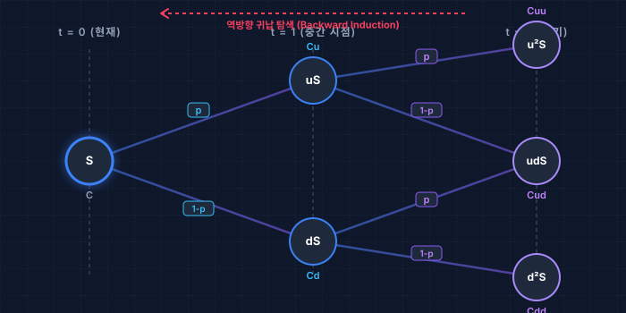

# 3.3 역방향 귀납법(Backward Induction)에 의한 2기간 옵션 가치 결정

## 1. 도입: 시간의 화살을 거스르는 금융 공학의 지혜

앞선 섹션(3.2)에서 우리는 주식과 채권을 적절히 섞어 1기간 동안 옵션의 만기 페이오프를 완벽하게 모방하는 '복제 포트폴리오($\Delta S + B$)'를 구축했습니다. 그리고 이를 통해 시장에 유일하게 존재해야 하는 합리적인 옵션의 복제 가격을 대수적으로 계산해 냈습니다.

하지만 현실의 옵션 만기는 하루나 한 달 뒤로 제한되지 않습니다. 만약 만기까지 여러 번의 주가 변동 기회가 남아 있다면, 우리는 이 복잡하게 얽힌 미래의 실타래를 어떻게 풀어야 할까요? 

여기서 금융공학은 시간의 인과 관계를 뒤집는 독창적인 철학적 패러다임을 제시합니다. 일상에서 우리는 과거를 디딤돌 삼아 미래를 예측하며 살아가지만, **옵션의 가치 평가 세계에서는 만기 시점(미래)의 확정된 페이오프가 오늘(현재)의 가치를 결정하는 출발점이 됩니다.** 

이처럼 가장 마지막 단계(만기)의 결과에서부터 한 단계씩 현재를 향해 거꾸로 의사결정을 짚어 나가는 방법을 **'역방향 귀납법(Backward Induction)'**이라고 합니다. 마치 미로의 출구에서부터 입구를 향해 역으로 선을 그려나가면 절대로 길을 잃지 않는 것과 같은 이치입니다. 

1기간의 복제 원리가 어떻게 다기간의 역방향 귀납법으로 확장되어 거대한 가격 결정 트리(Tree)를 완성하는지 그 수학적, 경제적 비법을 단계별로 파헤쳐 보겠습니다.

---

## 2. 징검다리: 복제 공식에서 '위험중립 가치평가' 공식의 도출

2기간 모델로 나아가기 전, 우리는 3.2절에서 배운 포트폴리오 복제 비용($C = \Delta S + B$)을 훨씬 다루기 쉬운 형태의 '확률적 기댓값' 공식으로 변환하는 중요한 디딤돌을 놓아야 합니다. 

우리가 앞서 유도한 복제 포트폴리오의 두 구성요소는 다음과 같았습니다.

$$\Delta = \frac{C_u - C_d}{(u - d)S}$$

$$B = \frac{uC_d - dC_u}{(u-d)(1+r)}$$

현재 시점의 옵션 가격 $C$는 복제 비용인 $\Delta S + B$와 같아야 하므로, 두 식을 대입해 봅니다.

$$C = \Delta S + B = \left[ \frac{C_u - C_d}{(u - d)S} \right] S + \frac{uC_d - dC_u}{(u-d)(1+r)}$$

우변 첫 항의 분모와 분자에 있는 주가 $S$가 서로 약분됩니다.

$$C = \frac{C_u - C_d}{u - d} + \frac{uC_d - dC_u}{(u-d)(1+r)}$$

분모를 $(u-d)(1+r)$로 통일하기 위해 첫 번째 분수식의 분모와 분자에 $(1+r)$을 곱해줍니다.

$$C = \frac{(1+r)(C_u - C_d) + (uC_d - dC_u)}{(u-d)(1+r)}$$

이제 분자를 콜옵션의 만기 가치인 $C_u$와 $C_d$를 기준으로 각각 묶어서 정리해 보겠습니다.

$$C = \frac{C_u(1+r-d) + C_d(u-(1+r))}{(u-d)(1+r)}$$

이 복잡해 보이는 식을 분리하여 다음과 같이 표현해 봅니다.

$$C = \frac{1}{1+r} \left[ \left( \frac{(1+r) - d}{u - d} \right) C_u + \left( \frac{u - (1+r)}{u - d} \right) C_d \right]$$

여기서 우리는 아주 기묘하고 아름다운 구조를 발견할 수 있습니다. 좌측 괄호 안의 복잡한 항을 기호 **$p$**로 치환해 보겠습니다.

$$p = \frac{(1+r) - d}{u - d}$$

이때 우측 괄호 안의 항은 $1-p$와 완벽히 일치하게 됩니다. 실제로 계산해 볼까요?

$$1 - p = 1 - \frac{(1+r) - d}{u - d} = \frac{(u - d) - (1+r) + d}{u - d} = \frac{u - (1+r)}{u - d}$$

따라서, 주식 복제 포트폴리오 공식($C = \Delta S + B$)은 다음과 같이 놀랍도록 단순한 형태로 압축됩니다.

$$C = \frac{p C_u + (1-p) C_d}{1+r}$$

이 공식은 우리에게 엄청난 직관을 선사합니다. 오늘 자 옵션 가격($C$)은 **"미래의 상승 페이오프($C_u$)와 하락 페이오프($C_d$)를 각각 $p$와 $1-p$라는 가중치로 곱해 평균을 낸 뒤, 무위험 이자율($1+r$)로 할인한 현재 가치"**에 불과하다는 점입니다. 이때 가중치 $p$를 우리는 **'위험중립 확률(Risk-neutral Probability)'**이라고 부릅니다.

---

## 3. 본론: 2기간 모델의 설계와 역방향 탐색

### 3.1 2기간 주가 트리(Tree) 구조의 전개

시간의 흐름이 $t=0$(현재), $t=1$(중간 시점), $t=2$(만기)의 2단계로 진행된다고 확장해 봅시다. 기초자산인 주가는 매 단계마다 위로 $u$배 상승하거나 아래로 $d$배 하락합니다.

시간의 흐름에 따른 노드별 주가 상태를 표로 나열해 보면 일정한 규칙성을 확인할 수 있습니다.

| 시점 ($t$) | 상태 구분 | 상태 표기 | 주가 수식 | 주가 수치 예시 ($S=100, u=1.2, d=0.8$) |
| :--- | :--- | :--- | :--- | :--- |
| **$t=0$** | 현재 상태 | $S_0$ | $S$ | $100.0$ |
| **$t=1$** | 1단계 상승 | $S_u$ | $uS$ | $120.0$ |
| | 1단계 하락 | $S_d$ | $dS$ | $80.0$ |
| **$t=2$** | 2단계 연속 상승 | $S_{uu}$ | $u^2 S$ | $144.0$ |
| (만기) | 상승 후 하락 | $S_{ud}$ | $udS$ | $96.0$ |
| | 하락 후 상승 | $S_{du}$ | $duS$ ($=udS$) | $96.0$ |
| | 2단계 연속 하락 | $S_{dd}$ | $d^2 S$ | $64.0$ |

여기서 $udS$와 $duS$는 곱셈의 교환법칙에 의해 동일한 주가인 $96.0$이 됩니다. 즉, 중간 경로가 하나로 겹쳐지면서 $t=2$ 시점의 최종 주가 상태는 총 3가지 노드($u^2 S, udS, d^2 S$)로 압축됩니다.

아래의 인터랙티브 트리 계산기에서 각 변수($S_0, K, u, d, r$)를 직접 조절하여 노드별 주가와 옵션 가격이 역방향으로 어떻게 계산되는지 실시간으로 확인해 보세요.

<iframe src="contents/black_scholes_equation_01/sec_03/assets/diagrams/sub_03_03_visual1.html" width="100%" height="450px" frameborder="0" scrolling="no"></iframe>

---

### 3.2 역방향 귀납법의 3단계 실행 프로세스

이제 이 트리 위에서 역방향 귀납법을 통해 오늘의 옵션 가격 $C$를 구하는 구체적인 단계를 밟아가겠습니다. 행사가격이 $K$인 콜옵션을 예로 들어 설명하겠습니다.

#### [단계 1: 만기($t=2$)에서의 최종 페이오프 확정]
역방향 귀납법의 첫 출발점은 '가장 마지막 미래'인 만기 시점입니다. 만기 시점($t=2$)에 도달하면 콜옵션 보유자는 합리적인 선택을 내리므로, 옵션 가치는 주가와 행사가격($K$)의 차이 중 양수의 값만을 취하는 $\max$ 함수로 완벽하게 결정됩니다.

*   **상승-상승 노드 가치:** 
    $$C_{uu} = \max(u^2 S - K, 0)$$
*   **상승-하락 노드 가치:** 
    $$C_{ud} = \max(ud S - K, 0)$$
*   **하락-하락 노드 가치:** 
    $$C_{dd} = \max(d^2 S - K, 0)$$

#### [단계 2: 중간 시점($t=1$)의 가치 역산 ($t=2 \rightarrow t=1$)]
만기 페이오프가 확정되었으므로, 이제 시간의 화살을 거꾸로 돌려 한 단계 앞선 중간 시점($t=1$)의 가치를 구합니다. 

*   **$uS$ 상태일 때의 옵션 가치 ($C_u$):**
    $t=1$ 시점에 주가가 이미 $uS$로 상승해 있다면, $t=2$에 옵션 가치는 $C_{uu}$가 되거나 $C_{ud}$가 될 것입니다. 따라서 $C_u$는 이 두 값의 위험중립 기대가치를 무위험 이자율로 할인하여 구합니다.
    $$C_u = \frac{p C_{uu} + (1-p) C_{ud}}{1+r}$$

*   **$dS$ 상태일 때의 옵션 가치 ($C_d$):**
    반대로 $t=1$ 시점에 주가가 $dS$로 하락해 있다면, 다음 단계의 옵션 가치는 $C_{ud}$ 혹은 $C_{dd}$가 됩니다. 동일한 원리로 할인해 줍니다.
    $$C_d = \frac{p C_{ud} + (1-p) C_{dd}}{1+r}$$

#### [단계 3: 현재 시점($t=0$)의 최종 가치 결정 ($t=1 \rightarrow t=0$)]
마지막 단계입니다. 방금 구한 $t=1$ 시점의 중간 옵션 가치 $C_u$와 $C_d$를 다시 한 번 미래의 페이오프처럼 취급하여 최종 목적지인 오늘($t=0$)의 옵션 가격 $C$를 도출합니다.

$$C = \frac{p C_u + (1-p) C_d}{1+r}$$

---

### 3.3 대수적 대입을 통한 최종 확장 공식 유도

우리의 이해를 깊게 하고 수식의 완결성을 증명하기 위해, [단계 3]의 최종 가치 결정식에 [단계 2]에서 구한 중간 노드의 공식($C_u, C_d$)을 통째로 대입해 보겠습니다.

$$C = \frac{1}{1+r} \left[ p \left( \frac{p C_{uu} + (1-p) C_{ud}}{1+r} \right) + (1-p) \left( \frac{p C_{ud} + (1-p) C_{dd}}{1+r} \right) \right]$$

식 전체를 공통 분모인 $(1+r)^2$으로 묶어 내어 정리합니다.

$$C = \frac{p[p C_{uu} + (1-p) C_{ud}] + (1-p)[p C_{ud} + (1-p) C_{dd}]}{(1+r)^2}$$

분자의 대괄호를 전개하여 항을 펼쳐 봅니다.

$$C = \frac{p^2 C_{uu} + p(1-p) C_{ud} + p(1-p) C_{ud} + (1-p)^2 C_{dd}}{(1+r)^2}$$

중간의 동일한 동류항 두 개[$p(1-p)C_{ud}$]를 하나로 합쳐서 최종 식을 완성합니다.

$$C = \frac{p^2 C_{uu} + 2p(1-p) C_{ud} + (1-p)^2 C_{dd}}{(1+r)^2}$$

---

## 4. 깊이 읽기: 완결성 있는 확률계(Probability System)와 차익거래 제한 조건

우리가 대수적 치환과 전개를 거쳐 최종적으로 도출해 낸 2기간 가격 결정 공식은 고등학교 수학에서 배운 아주 익숙한 전개식을 떠올리게 합니다. 바로 이항정리(Binomial Theorem)의 완전제곱식 형태입니다.

$$(a+b)^2 = a^2 + 2ab + b^2$$

실제로 최종 공식 분자의 계수들을 살펴보면 다음과 같습니다.

$$p^2 \quad , \quad 2p(1-p) \quad , \quad (1-p)^2$$

이 계수들의 합을 계산해 보면 놀라운 수학적 완결성을 목격하게 됩니다.

$$p^2 + 2p(1-p) + (1-p)^2 = [p + (1-p)]^2 = 1^2 = 1$$

모든 가중치의 합이 정확히 **$1(100\%)$**이 됩니다. 이는 우리가 인위적으로 만들어 낸 '위험중립 확률 $p$'가 단순한 대수적 편리함을 위한 도구가 아니라, 수학적으로 완전무결한 **'확률계(Probability System)'**를 형성하고 있음을 보여줍니다.

*   **$p^2$**: 주가가 2회 연속 상승할 확률 ($uu$)
*   **$2p(1-p)$**: 주가가 한 번은 오르고 한 번은 내릴 확률 ($ud$ 또는 $du$, 두 가지 경로가 존재하므로 계수 $2$가 붙음)
*   **$(1-p)^2$**: 주가가 2회 연속 하락할 확률 ($dd$)

즉, 2기간 모델의 최종 가격 $C$는 **"2기간 동안 주가가 움직일 수 있는 모든 최종 상태의 만기 페이오프들을 이항확률로 가중평균한 뒤, 전체 기간의 무위험 이자율인 $(1+r)^2$으로 일시에 할인한 값"**과 경제학적으로 완벽히 동일하다는 사실을 증명해 줍니다.

### 4.1 경제학적 제약 조건: $d < 1+r < u$ 와 무차익 원리

수학적으로 $p$가 확률로서 기능하려면 반드시 **$0 < p < 1$**의 범위를 가져야 합니다. 이를 $p$의 정의식에 대입하여 경제학적 조건을 유도해 보겠습니다.

$$0 < \frac{(1+r) - d}{u - d} < 1$$

주가 상승률이 하락률보다 크므로 분모 $u - d$는 항상 양수($u > d$)입니다. 양변에 $u - d$를 곱해줍니다.

$$0 < (1+r) - d < u - d$$

1.  **좌측 부등식 ($0 < (1+r) - d$):** 무위험 수익률은 주가 하락률보다 커야 합니다.
    $$d < 1+r$$
2.  **우측 부등식 ($(1+r) - d < u - d$):** 양변에서 $-d$를 더해 정리하면, 무위험 수익률은 주가 상승률보다 작아야 합니다.
    $$1+r < u$$

이 두 조건을 결합하면 다음과 같은 강력한 경제적 제약 조건이 도출됩니다.

$$d < 1+r < u$$

만약 이 조건이 깨지면 어떻게 될까요?
*   **$1+r \le d$ 인 경우:** 돈을 무위험으로 빌리거나 예금하는 것보다, 주식을 사서 아무리 주가가 떨어져도 얻는 수익이 더 크게 됩니다. 이 경우 사람들은 무한대로 무위험 자금을 차입하여 주식을 매수하는 차익거래를 유발하여 시장 균형이 붕괴됩니다.
*   **$1+r \ge u$ 인 경우:** 주식이 아무리 최대로 상승해도 무위험 이자율보다 낮으므로, 아무도 주식을 사지 않고 전액 예금에만 투자할 것입니다.

즉, $d < 1+r < u$ 조건은 시장에 **'차익거래 기회(Arbitrage Opportunity)가 존재하지 않는 균형 상태'**임을 보장하는 최소한의 안전장치이며, 이 조건이 성립할 때만 우리의 위험중립 확률계가 정의될 수 있습니다.

아래 시뮬레이터에서 $u, d, r$ 값을 변경하며 이항 확률분포의 변화와 $d < 1+r < u$ 조건이 깨졌을 때의 경고 메시지를 확인해 보세요.

<iframe src="contents/black_scholes_equation_01/sec_03/assets/diagrams/sub_03_03_visual2.html" width="100%" height="450px" frameborder="0" scrolling="no"></iframe>

---

## 5. 요약: 핵심 포인트

1.  **위험중립 가치평가(Risk-Neutral Valuation):** 복제 포트폴리오의 개념은 무위험 기대값을 구하고 이를 이자율로 할인하는 형태인 $C = \frac{p C_u + (1-p) C_d}{1+r}$로 완벽히 치환됩니다.
2.  **역방향 귀납법(Backward Induction):** 가치 결정의 흐름은 시간의 흐름과 반대로 작동합니다. 가장 확실한 미래인 $t=2$의 만기 페이오프에서 시작하여 $t=1$의 중간 가치로, 다시 $t=0$의 현재 가치로 거슬러 올라오며 값을 결정합니다.
3.  **이항 분포로의 확장:** 2기간 최종 공식 $C = \frac{p^2 C_{uu} + 2p(1-p)C_{ud} + (1-p)^2 C_{dd}}{(1+r)^2}$의 분자는 완벽한 확률 결합계(합이 1)를 이루고 있으며, 이는 다기간 모델이 결국 '이항분포(Binomial Distribution)'의 통계적 법칙으로 수렴해 갈 것임을 예고합니다.

이제 우리는 시간의 흐름이 여러 단계로 쪼개져도 이를 무력화하고 오늘 자의 공정 가격을 정확히 계산할 수 있는 최강의 귀납적 엔진을 가졌습니다. 다음 장에서는 이 기간을 $3, 4, \dots$ 단계를 넘어 무한대($N \rightarrow \infty$)로 잘게 쪼갰을 때, 이산적인 트리 구조가 어떻게 연속적인 '블랙-숄즈(Black-Scholes)' 공식이라는 금융공학 최고의 보물로 진화하게 되는지 그 기적의 순간을 목격하겠습니다.