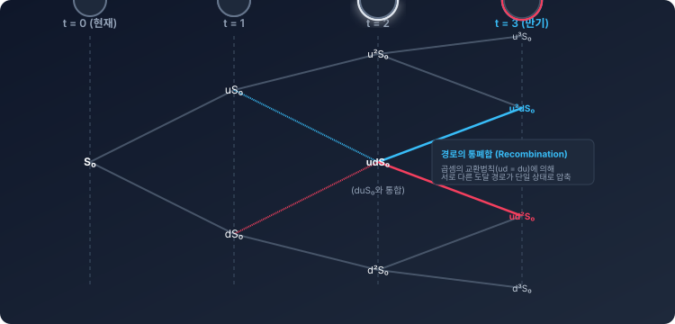

# 3.4 n기간 일반화 이항 모델의 수학적 설계

## 1. 도입: 기하급수적 혼돈 속에서 발견하는 수학적 질서

앞서 3.3절에서 우리는 2기간 이항 트리 모델을 구축하고, 역방향 귀납법을 통해 현재 시점의 옵션 가격을 구했습니다. 그 과정에서 우리는 매우 흥미로운 수학적 규칙성을 목격했습니다. 최종 옵션 가격을 구하는 공식의 분자가 완전제곱식 형태인 $p^2 + 2p(1-p) + (1-p)^2 = 1$이라는 완결성 있는 확률계(Probability System)를 이룬다는 사실이었습니다.

하지만 실제 금융 시장의 옵션 만기는 2단계처럼 짧지 않습니다. 만약 만기까지의 기간을 10단계, 100단계, 혹은 그 이상으로 정교하게 쪼갠다면 어떻게 될까요? 

매 단계마다 주가가 위아래 두 갈래로 갈라지므로, $n$단계가 지나면 총 $2^n$개라는 어마어마한 수의 경로(Path)가 만들어집니다. 예를 들어 $n=10$만 되어도 경로는 $1,024$개가 되며, $n=100$이 되면 우주의 전체 원자 수보다 많은 가치 사슬이 형성됩니다. 이 복잡한 트리를 일일이 손으로 그리고 역방향 귀납법을 적용하는 것은 물리적으로 불가능해 보입니다.

그러나 금융공학은 이 기하급수적인 혼돈 속에서 눈부신 **'질서와 패턴'**을 찾아냈습니다. 이항 정리(Binomial Theorem)의 아름다움을 활용하여, 수만 개의 경로를 단 한 줄의 우아한 수학 공식으로 압축해 낸 것입니다. 이것이 바로 로스(Ross), 콕스(Cox), 루빈스타인(Rubinstein)이 1979년에 정립한 현대 금융공학의 이정표, **CRR(Cox-Ross-Rubinstein) 모델**입니다. 

우리는 이번 절에서 개별 경로를 일일이 추적하는 고된 노동을 멈추고, 전체 트리 구조를 관통하는 수학적 일반화 공식을 스스로 유도해 볼 것입니다.

---

## 2. 본론: 이항 분포의 옷을 입은 옵션 가치

### 2.1 주가 경로의 재해석: 순서가 아닌 '횟수'로 접근하기

우리가 $2^n$개의 모든 경로를 일일이 추적하지 않아도 되는 열쇠는 **'곱셈의 교환법칙'**에 있습니다. 

예를 들어, 주가가 총 3단계($n=3$) 동안 움직인다고 가정해 보겠습니다. 이 트리에서 나타날 수 있는 경로는 총 $2^3 = 8$가지입니다. 이 경로들을 최종 주가와 함께 표로 직접 나열해 패턴을 발견해 봅시다.

| 경로 구분 | 단계별 움직임 (1 $\rightarrow$ 2 $\rightarrow$ 3) | 상승 횟수 ($j$) | 하락 횟수 ($3-j$) | 최종 주가 ($S_3$) |
| :--- | :--- | :---: | :---: | :--- |
| **경로 1** | 상승 $\rightarrow$ 상승 $\rightarrow$ 상승 | 3 | 0 | $u \cdot u \cdot u \cdot S_0 = u^3 S_0$ |
| **경로 2** | 상승 $\rightarrow$ 상승 $\rightarrow$ 하락 | 2 | 1 | $u \cdot u \cdot d \cdot S_0 = u^2 d S_0$ |
| **경로 3** | 상승 $\rightarrow$ 하락 $\rightarrow$ 상승 | 2 | 1 | $u \cdot d \cdot u \cdot S_0 = u^2 d S_0$ |
| **경로 4** | 하락 $\rightarrow$ 상승 $\rightarrow$ 상승 | 2 | 1 | $d \cdot u \cdot u \cdot S_0 = u^2 d S_0$ |
| **경로 5** | 상승 $\rightarrow$ 하락 $\rightarrow$ 하락 | 1 | 2 | $u \cdot d \cdot d \cdot S_0 = u d^2 S_0$ |
| **경로 6** | 하락 $\rightarrow$ 상승 $\rightarrow$ 하락 | 1 | 2 | $d \cdot u \cdot d \cdot S_0 = u d^2 S_0$ |
| **경로 7** | 하락 $\rightarrow$ 하락 $\rightarrow$ 상승 | 1 | 2 | $d \cdot d \cdot u \cdot S_0 = u d^2 S_0$ |
| **경로 8** | 하락 $\rightarrow$ 하락 $\rightarrow$ 하락 | 0 | 3 | $d \cdot d \cdot d \cdot S_0 = d^3 S_0$ |

이 표에서 우리는 눈부신 규칙성을 발견할 수 있습니다. 경로 2, 3, 4는 서로 다른 순서로 주가가 움직였지만, 최종 주가는 모두 $u^2 d S_0$로 완벽하게 동일합니다. 경로 5, 6, 7 역시 마찬가지로 최종 주가가 $u d^2 S_0$로 일치합니다.

즉, $n$기간 모델에서 최종 주가는 주가가 오르고 내린 '순서'와는 아무런 상관이 없으며, 오직 **"총 $n$번의 움직임 중 상승($u$)이 몇 번 발생했는가?"**라는 단 하나의 변수 $j$에 의해서만 결정됩니다.

만약 $n$번의 단계 중 상승이 $j$번 일어났다면, 하락은 자동적으로 $n-j$번 일어나게 됩니다. 따라서 만기 시점($T$)의 주가 상태 $S_T$는 다음과 같이 단 한 줄의 수식으로 일반화됩니다.

$$S_T = S_0 \cdot u^j \cdot d^{n-j}$$

이로써 우리는 수많은 경로의 미로에서 빠져나와, 오직 $j$라는 **'상승 횟수'**의 축을 기준으로 만기의 주가 상태를 총 $n+1$개로 깔끔하게 압축 정리할 수 있게 되었습니다.

아래의 대화형 패스 시뮬레이터를 통해 $n$의 변화에 따라 기하급수적으로 증가하는 경로들이 어떻게 단 몇 개의 최종 주가 노드로 아름답게 수렴(Recombination)하는지 시각적으로 확인해 보세요.

<iframe src="contents/black_scholes_equation_01/sec_03/assets/diagrams/sub_03_04_visual1.html" width="100%" height="520px" frameborder="0" scrolling="no"></iframe>

---

### 2.2 이항 정리와 위험중립 확률의 결합

최종 주가 상태를 정리에 성공했으니, 이제 각 상태에 도달할 확률을 부여할 차례입니다. 

우리는 앞선 장에서 단일 기간 상승 확률을 위험중립 확률 $p$, 하락 확률을 $1-p$로 정의했습니다. 매 단계의 주가 움직임이 독립적으로 일어난다고 가정하면, 특정 노드(상승 $j$번, 하락 $n-j$번)에 도달할 확률은 고등학교 수학에서 배운 **'독립시행의 확률'** 및 **'이항분포(Binomial Distribution)'** 법칙을 그대로 따르게 됩니다.

$$P(\text{상승 } j\text{번}) = \binom{n}{j} p^j (1-p)^{n-j}$$

여기서 조합 기호인 $\binom{n}{j}$ (또는 $_nC_j$)는 $n$번의 기회 중 상승이 발생하는 $j$번의 순서를 선택하는 조합의 수(이항계수)를 의미하며, 다음과 같이 정의됩니다.

$$\binom{n}{j} = \frac{n!}{j!(n-j)!}$$

실제로 앞선 $n=3$ 예시에서 상승이 $j=2$번 일어날 확률을 이 공식에 대입해 보면,
$$\binom{3}{2} p^2 (1-p)^{3-2} = 3 \cdot p^2 (1-p)^1$$
이 되며, 이는 표에서 확인한 3가지 경로(경로 2, 3, 4)의 발생 확률 합과 정확히 일치합니다.

이 가중치들을 모두 합하면 어떻게 될까요? 이항정리의 전개 공식에 의해 전체 합은 항상 $1$이 됩니다.

$$\sum_{j=0}^{n} \binom{n}{j} p^j (1-p)^{n-j} = [p + (1-p)]^n = 1^n = 1$$

이것은 우리가 3.3절에서 확인했던 완전제곱식의 확률계가 $n$차원으로 확장되더라도 여전히 깨지지 않는 거대한 **'확률적 보존 법칙'**을 이루고 있음을 수학적으로 입증합니다.

---

### 2.3 n기간 옵션 가치 결정 공식 (CRR 공식)의 도출

이제 모든 준비물이 갖춰졌습니다.
1. 만기 시점의 가능한 주가 상태: $S_T = u^j d^{n-j} S_0$
2. 콜옵션의 만기 페이오프 구조: $\max(S_T - K, 0)$
3. 각 상태가 발생할 위험중립 확률: $\binom{n}{j} p^j (1-p)^{n-j}$

역방향 귀납법의 본질은 "미래의 기대 가치를 현재 가치로 할인하는 것"이었습니다. 이를 $n$기간 전체에 걸쳐 한 번에 적용해 봅시다. 매 단계마다 무위험 이자율 $r$로 할인하므로, $n$기간 동안의 총 할인계수(Discount Factor)는 $\frac{1}{(1+r)^n}$이 됩니다.

따라서, 만기 시점에 존재할 수 있는 모든 주가 상태의 페이오프에 각각의 발생 확률(가중치)을 곱해 기댓값을 구한 뒤, 이를 현재 시점으로 한 번에 할인하면 오늘 자 콜옵션의 가격 $C$가 도출됩니다.

$$C = \frac{1}{(1+r)^n} \sum_{j=0}^{n} \left[ \binom{n}{j} p^j (1-p)^{n-j} \cdot \max(u^j d^{n-j} S_0 - K, 0) \right]$$

이 수식이 바로 금융공학 역사상 가장 아름다운 공식 중 하나로 꼽히는 **CRR(Cox-Ross-Rubinstein) n기간 옵션 가격 결정 공식**입니다. 이 식은 복잡해 보이지만, 의미 단위로 쪼개어 보면 지극히 직관적이고 논리적인 3가지 요소의 결합체에 불과합니다.

아래의 인터랙티브 공식 탐색기를 통해 수식의 세부 요소가 의미하는 경제학적 본질을 자세히 파헤쳐 보고, 변수 슬라이더를 변경하며 실시간으로 적용되는 수치를 확인해 보세요.

<iframe src="contents/black_scholes_equation_01/sec_03/assets/diagrams/sub_03_04_visual2.html" width="100%" height="520px" frameborder="0" scrolling="no"></iframe>

---

## 3. 깊이 읽기: 구체적 수치 시나리오를 통한 공식의 검증

추상적인 수식을 우리 몸에 와닿는 직관으로 바꾸기 위해, 실제 시장의 구체적인 수치를 대입하여 계산의 규칙성을 체감해 보겠습니다.

### [가정 시나리오]
* 현재 주가 ($S_0$) = $100
* 행사가격 ($K$) = $100 (등가격 옵션)
* 총 기간 ($n$) = 3단계
* 단계별 상승 배수 ($u$) = 1.10 (10% 상승)
* 단계별 하락 배수 ($d$) = 0.90 (10% 하락)
* 단계별 무위험 이자율 ($r$) = 2% (0.02)

먼저 1단계 위험중립 확률 $p$를 계산합니다.
$$p = \frac{(1+r) - d}{u - d} = \frac{1.02 - 0.90}{1.10 - 0.90} = \frac{0.12}{0.20} = 0.60 \ (60\%)$$
자연스럽게 하락 확률 $1-p$는 $0.40 \ (40\%)$이 됩니다.

이제 이 수치들을 바탕으로 $j$값(0부터 3까지)에 따른 최종 주가, 페이오프, 그리고 발생 확률을 표로 연산해 보겠습니다.

| 상승 횟수 ($j$) | 최종 주가 $S_3 = 100 \cdot (1.1)^j (0.9)^{3-j}$ | 만기 페이오프 $\max(S_3 - 100, 0)$ | 이항 확률 $\binom{3}{j} (0.6)^j (0.4)^{3-j}$ | 페이오프 $\times$ 확률 (기대값 성분) |
| :---: | :--- | :--- | :--- | :--- |
| **$j = 3$** | $100 \cdot 1.331 = 133.10$ | $33.10$ | $1 \cdot 0.216 \cdot 1 = 0.2160$ | $33.10 \times 0.2160 = 7.1496$ |
| **$j = 2$** | $100 \cdot 1.089 = 108.90$ | $8.90$ | $3 \cdot 0.36 \cdot 0.4 = 0.4320$ | $8.90 \times 0.4320 = 3.8448$ |
| **$j = 1$** | $100 \cdot 0.891 = 89.10$ | $0.00$ | $3 \cdot 0.6 \cdot 0.16 = 0.2880$ | $0.00 \times 0.2880 = 0.0000$ |
| **$j = 0$** | $100 \cdot 0.729 = 72.90$ | $0.00$ | $1 \cdot 1 \cdot 0.064 = 0.0640$ | $0.00 \times 0.0640 = 0.0000$ |
| **합계** | - | - | **$1.0000 \ (100\%)$** | **$10.9944$** |

이 표를 통해 우리는 두 가지 핵심 사실을 손으로 직접 증명할 수 있습니다.
1. 모든 주가 상태의 발생 확률 합은 정확히 $1.0000(100\%)$가 되어 빈틈없는 확률계를 만듭니다.
2. 주가가 행사가격(\$100)보다 아래로 떨어지는 $j=1$과 $j=0$의 상태에서는 콜옵션 권리를 포기하므로 페이오프가 $0$이 되어, 해당 상태의 확률이 아무리 높아도 최종 가치 평가에는 기여하지 않습니다.

마지막으로, 확률이 가중된 만기 페이오프의 합산(미래 기대값)인 $10.9944$를 3기간 동안의 무위험 이자율로 일시 할인합니다.

$$C = \frac{10.9944}{(1.02)^3} = \frac{10.9944}{1.061208} \approx 10.36$$

따라서 이 옵션의 오늘 자 공정 가격은 **$10.36**가 됩니다. $2^3 = 8$개의 경로를 따라 역방향 귀납법을 3번 반복하는 복잡한 과정 없이, 단 하나의 대수적 테이블과 공식으로 깔끔하게 가치 평가를 완료한 것입니다.

---

## 4. 요약: 핵심 포인트

1. **상승 횟수($j$)로의 차원 압축:** 다기간 모델에서 최종 주가는 움직임의 순서와 무관하게 오직 '상승 횟수 $j$'에 의해서만 결정됩니다. 이로 인해 기하급수적으로 늘어나던 $2^n$개의 경로가 $n+1$개의 최종 상태로 기적처럼 단순화됩니다.
2. **이항 정리의 수학적 완결성:** 각 노드에 도달할 위험중립 확률은 조합 기호($\binom{n}{j}$)를 포함한 이항 분포 공식을 따르며, 전체 확률의 합은 항상 완전무결하게 $1$이 됩니다.
3. **CRR 공식의 구조:** $n$기간 이항 옵션 가격 결정 모형(CRR 공식)은 **[시간 할인] $\times$ [위험중립 확률] $\times$ [만기 페이오프]**의 가중합으로 구성된, 대단히 정밀하고 완결성 있는 하나의 확률계 시스템입니다.

이제 우리는 기간이 $n$개로 아무리 무수하게 쪼개지더라도 흔들림 없이 옵션 가치를 계산해 낼 수 있는 완성된 이산형(Discrete) 수학 도구를 갖추었습니다. 

다음 장에서는 이 분할 횟수 $n$을 극한으로 보낼 때($n \rightarrow \infty$), 이산적으로 뚝뚝 끊어져 움직이던 주가 트리와 이항 분포가 어떻게 연속적이고 부드러운 확률 분포의 세계로 진화하며, 그 끝에서 기다리고 있는 금융공학 최대의 걸작 **'블랙-숄즈(Black-Scholes) 방정식'**과 어떻게 조우하게 되는지 그 수학적 기적을 탐험해 보겠습니다.
