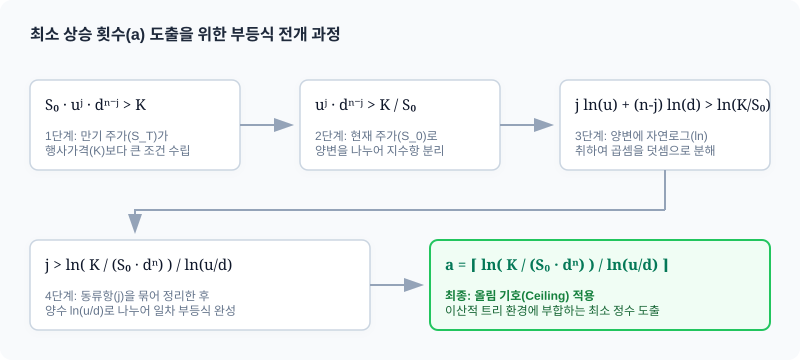

# 3.5 최소 상승 횟수(a) 판별을 통한 내가격(ITM) 조건 정의

## 1. 도입: 쓰레기 값을 거르는 수학적 필터

앞서 3.4절에서 우리는 $n$기간 모델의 옵션 가격을 단 한 줄의 대수학식으로 산출해 내는 아름다운 **CRR(Cox-Ross-Rubinstein) 공식**을 유도했습니다.

$$C = \frac{1}{(1+r)^n} \sum_{j=0}^{n} \left[ \binom{n}{j} p^j (1-p)^{n-j} \cdot \max(u^j d^{n-j} S_0 - K, 0) \right]$$

이 공식은 수학적으로 흠잡을 데 없이 완벽하지만, 이를 연산하는 컴퓨터 알고리즘이나 수동 계산을 수행하는 평가자의 관점에서 보면 다소 비효율적인 구석이 숨어 있습니다. 바로 만기 시점의 페이오프를 조건부로 분기하는 $\max(S_T - K, 0)$ 연산자 때문입니다.

만기 시점에 주가가 계속 하락하여 행사가격($K$)보다 낮아지는 외가격(OTM, Out-of-the-Money) 상태가 될 경우, 콜옵션 보유자는 권리를 당연히 포기하므로 옵션 가치는 단순한 $0$이 됩니다. 즉, 시그마($\sum$) 루프가 $0$부터 $n$까지 순차적으로 돌며 모든 경우의 수를 성실하게 계산할 때, 하락 횟수가 많아 궁극적으로 가치가 $0$으로 소멸해 버리는 다수의 구간 역시 불필요한 사칙연산을 매번 동일하게 통과하게 됩니다.

예컨대 $n=100$인 100기간 이항 트리를 다룬다면, 총 101개의 도출 항목 중 절대다수의 하위 노드가 결국 $0$을 곱해 사라질 '죽은 연산'에 해당합니다. 컴퓨터 자원의 낭비를 막고 수식의 정밀함을 더하기 위해, 다음과 같은 질문을 던져볼 필요가 있습니다.

**"도대체 만기 시점까지 최소 몇 번을 상승해야 옵션이 휴지조각이 되지 않고 단 1원이라도 돈이 되는가?"**

우리는 이번 절에서 간단한 대수 변형을 통해 옵션이 '내가격(ITM, In-the-Money)' 상태로 진입하는 최소한의 자격 요건, 즉 **최소 상승 횟수 $a$**를 수치화하는 정밀한 '수학적 필터'를 장착할 것입니다. 이 필터를 설계하면 공식 내에서 사전에 가치가 소멸할 OTM 구간을 완전히 도려내고 연산 효율을 기하급수적으로 증폭시킬 수 있습니다.

---

## 2. 본론: 내가격의 경계선을 찾는 수학적 여정

### 2.1 조건식의 재구성: 로그(Log)를 통한 지수 항의 해체

수학적 유도의 출발점은 콜옵션의 가치가 $0$보다 커지는 명확한 조건, 즉 만기 시점의 주가 $S_T$가 행사가격 $K$를 초과하는 시점($S_T > K$)을 정의하는 것입니다. 3.4절에서 규정한 $n$기간 후의 최종 주가 일반화 공식을 이 부등식에 대입하여 전개를 시작해 보겠습니다.

$$S_0 \cdot u^j \cdot d^{n-j} > K$$

우리의 목표는 이 부등식을 참으로 만족하는 **상승 횟수 $j$의 범위**를 도출해 내는 것입니다. 그러나 변수 $j$가 미지수로서 지수(Exponent) 자리에 구속되어 있기 때문에, 이 상태 그대로는 범위를 직접 분리해 내기가 곤란합니다.

이때 지수에 묶여 있는 고차원 변수를 수평 평면으로 안전하게 착륙시키기 위해 금융공학이 활용하는 핵심 도구가 바로 **자연로그($\ln$)**입니다. 로그 연산을 양변에 적용하면 로그의 성질에 의해 지수들은 곱셈 상수로 내려오고, 곱셈은 덧셈으로 온순하게 분해됩니다.

양변을 오늘 자 주가 $S_0$로 나눈 후 양변에 자연로그를 씌워보겠습니다.

$$\ln\left(u^j \cdot d^{n-j}\right) > \ln\left(\frac{K}{S_0}\right)$$

자연로그의 성질($\ln(AB) = \ln A + \ln B$ 및 $\ln(A^B) = B \ln A$)을 좌변에 적용하여 정교하게 해체합니다.

$$j \ln u + (n-j) \ln d > \ln\left(\frac{K}{S_0}\right)$$

괄호를 풀어 헤쳐 $j$를 공유하는 동류항들을 식의 좌변으로, 상수 성격을 지닌 항들을 우변으로 일목요연하게 이항해 봅니다.

$$j \ln u + n \ln d - j \ln d > \ln\left(\frac{K}{S_0}\right)$$

$$j(\ln u - \ln d) > \ln\left(\frac{K}{S_0}\right) - n \ln d$$

여기서 다시 로그의 나눗셈 공식($\ln u - \ln d = \ln(u/d)$)을 대입해 좌변을 줄이고, 우변의 뺄셈 연산 역시 로그의 결합 법칙을 통해 분수식 내부로 압축합니다.

$$j \ln\left(\frac{u}{d}\right) > \ln\left(\frac{K}{S_0 \cdot d^n}\right)$$

일반적인 이항 트리 모델의 기하학적 설계 규칙에 따르면, 상승 배수 $u$는 하락 배수 $d$보다 항상 큽니다($u > d$). 따라서 분수값 $\frac{u}{d}$는 당연히 $1$보다 큰 양수이며, 이에 대응하는 자연로그 값인 $\ln(u/d)$ 역시 완벽한 양수($> 0$)를 이룹니다.

양수가 분명하므로, 부등식의 양변을 $\ln(u/d)$로 나누어도 부등호의 방향은 흔들림 없이 동일하게 유지됩니다.

$$j > \frac{\ln\left(\frac{K}{S_0 \cdot d^n}\right)}{\ln\left(\frac{u}{d}\right)}$$

마침내 우리는 주가가 행사가격을 돌파해 유의미한 이득으로 안착하는 데 필요한 이론적 상승 횟수 $j$의 경계 장벽을 명쾌한 수학 공식으로 도출해 냈습니다.

---

### 2.2 올림 기호(Ceiling)의 도입과 최소 정수 $a$의 판별

하지만 위의 우변 계산값은 로그 연산의 특성상 $1.57$이나 $4.12$와 같이 지저분한 실수(Float) 단위로 도출될 확률이 매우 높습니다.

이에 반해, 주가 트리 모델 내부에서 정의하는 실제 '상승 횟수 $j$'는 $0$회, $1$회, $2$회처럼 뚝뚝 이산적으로 구분되는 **정수(Integer)**로만 계산되어야 하는 물리적 제약이 따릅니다. 

예컨대 우변을 계산한 값이 $1.57$회라면, 주가가 $1$번만 상승했을 때($j=1$)는 임계 장벽을 넘지 못해 콜옵션이 가치를 잃지만, $2$번 상승하게 되는 최소 정수의 문턱($j=2$)에 도달하면 드디어 행사가격을 돌파하며 가치가 살아난다는 물리적 의미를 담게 됩니다.

따라서 우리는 실수로 도출된 결과를 **"해당 값보다 크거나 같은 가장 작은 정수"**로 매핑해 주는 특수 기호인 **올림(Ceiling, $\lceil \cdot \rceil$) 연산자**를 식에 정밀하게 장착해야 합니다. 이 정수 필터링을 거쳐 마침내 판별해 낸 임계 상승 횟수를 소문자 **$a$**로 정의합니다.

$$a = \left\lceil \frac{\ln\left(\frac{K}{S_0 \cdot d^n}\right)}{\ln\left(\frac{u}{d}\right)} \right\rceil$$

이 $a$는 수학적으로는 단순해 보이는 정수화 과정의 결과물이지만, 경제학 및 금융공학 측면에서는 **"옵션 보유자의 권리가 무가치하게 소멸(OTM)하지 않고, 실제 돈이 되는 영역(ITM)으로 안전하게 진입하기 위한 유일무이한 최소 상승 허들"**이라는 대단히 핵심적인 경제학적 의미를 함축하고 있습니다.

아래의 대화형 인포그래픽을 활용하여 다양한 시장 변수가 변할 때 이 최소 상승 허들인 $a$가 어떻게 동적으로 이동하고, 전체 이항 사건을 가치 영역별로 분리해 내는지 조작해 보십시오.

<iframe src="contents/black_scholes_equation_01/sec_03/assets/diagrams/sub_03_05_visual1.html" width="100%" height="450px" frameborder="0" scrolling="no"></iframe>

---

### 2.3 구체적 수치 시나리오를 통한 검증: 3.4절 예제와의 연계

공식의 정교함과 실존성을 스스로 자각하기 위해, 우리가 앞서 3.4절의 시뮬레이션에서 손으로 일일이 전개했던 시장의 구체적인 수치를 대입하여 필터의 신뢰성을 직접 실증해 보겠습니다.

#### [검증 시나리오]
* 현재 주가 ($S_0$) = $100
* 행사가격 ($K$) = $100
* 총 분할 단계 ($n$) = 3단계
* 단계별 상승 배수 ($u$) = 1.10 (10% 상승)
* 단계별 하락 배수 ($d$) = 0.90 (10% 하락)

이 매개변수 값들을 우리가 도출한 $a$ 결정 공식에 순차적으로 적용해 봅니다.

$$a = \left\lceil \frac{\ln\left(\frac{100}{100 \cdot (0.90)^3}\right)}{\ln\left(\frac{1.10}{0.90}\right)} \right\rceil$$

로그 내부에 중첩된 수치들의 사칙연산을 부분적으로 진행합니다.
* 분자 내부의 분모 항: $100 \cdot 0.729 = 72.9$
* 분자의 최종 계산: $\ln\left(\frac{100}{72.9}\right) \approx \ln(1.37174) \approx 0.31608$
* 분모의 최종 계산: $\ln(1.22222) \approx 0.20067$

비율을 구한 후 정수 올림 연산을 취합니다.

$$a = \left\lceil \frac{0.31608}{0.20067} \right\rceil \approx \lceil 1.575 \rceil$$

$1.575$ 이상의 정수 중 가장 작은 수는 정확히 **$2$**가 됩니다. 즉, 고차 로그 대수 분석 결과에 따르면 본 옵션은 3단계의 무작위 변동 여정 중 **적어도 2번 이상 상승 노드에 안착해야만** 가치를 지닌다는 수학적 결과를 선제적으로 보고해 줍니다.

이를 3.4절에서 직접 계산했던 기댓값 테이블과 정밀 대조해 보겠습니다.

| 상승 횟수 ($j$) | 최종 주가 ($S_3$) | 만기 페이오프 | 가치 평가 여부 (ITM) |
| :---: | :---: | :---: | :---: |
| **$j = 3$** | $133.10$ | $33.10$ | **유효 (ITM)** |
| **$j = 2$** | $108.90$ | $8.90$ | **유효 (ITM)** |
| **$j = 1$** | $89.10$ | $0.00$ | 무효 (OTM, 소멸) |
| **$j = 0$** | $72.90$ | $0.00$ | 무효 (OTM, 소멸) |

손으로 무수히 쪼개 계산했던 표 결과와 한 치의 오차도 없이 일치합니다. 우리는 단 한 줄의 로그 연산만으로 만기 페이오프가 $0$으로 죽어버리는 연산 버퍼를 지워내고, 오직 $j \ge 2$인 유효 영역만을 탐색 필터로 콕 집어 분류해 낸 것입니다.

---

### 2.4 불필요한 연산을 완전히 제거한 최적화 CRR 공식

이 장벽 허들 $a$의 명확한 실재는 계산 효율화를 가로막던 시그마 수식을 급진적으로 경량화해 주는 혁신적인 이정표가 됩니다.

어차피 상승 횟수가 $a$에 미치지 못하는 모든 범위($0 \le j < a$)에서는 콜옵션의 페이오프가 수학적으로 기필코 $0$이 될 것이 보증되므로, 우리는 식의 연산 하한선을 $j=0$이 아닌 **$j=a$**로 훌쩍 상향 조정할 수 있습니다. 

동시에 $a$ 이상인 활성 영역($j \ge a$)에서는 페이오프를 씌우고 있던 거추장스럽고 무거운 연산자인 $\max(S_T - K, 0)$가 무조건 양수 방향으로만 분출할 것이기 때문에, 수학적으로 골칫거리인 $\max$ 함수 부호 자체를 완전히 제거해 버릴 수 있습니다.

이 모든 수학적 최적화가 완비되어 정수론적으로 새롭게 조립된 **'최적화된 CRR 다기간 평가 모형'**을 아래와 같이 선언합니다.

$${C} {=} \frac{{1}}{{(}{1}{+}{r}{)}^{n}} \sum_{{j}{=}{\textcolor{#e53935}{a}}}^{{n}} \left[ \binom{{n}}{{j}} {p}^{j} {(}{1}{-}{p}{)}^{{n}{-}{j}} \left({S}_{0} {u}^{j} {d}^{{n}{-}{j}} {-} {K}\right) \right]$$

#### [변수의 물리적 한계 범위와 경제학적 의미]
우리가 도출한 임계 변수 $a$는 단순히 수식 효율성에 그치지 않고, 현실 시장의 이상 징후나 극단적 분포 경계를 검증하는 '확률계 자정 도구'로 작동합니다. 변수 $a$가 처할 수 있는 양극단의 한계 범위를 정의해 봅시다.

1. **$a \le 0$ 인 경우:** 
   * 계산상으로 올림 결과가 $0$ 이하로 산출되는 경우입니다. 이는 주가가 단 한 번도 상승하지 않고 지속적으로 하락 궤도만 그리더라도($j=0$), 만기 최종 주가가 여전히 행사가격 $K$를 여유 있게 돌파하는 극단적인 깊은 내가격(Deep In-the-Money) 상태를 지칭합니다. 
   * 이때 평가 모형은 시스템 에러 방지를 위해 하한을 강제로 $a = 0$으로 보정(Clamping)하여, 발생 가능한 전방위 상승 횟수의 확률 구조를 모두 유효하게 흡수하여 가치를 정확히 평가합니다.

2. **$a > n$ 인 경우:**
   * 기하학적으로 허용된 총 기간 $n$보다도 최소 자격 요건 $a$가 더 큰 비현실적인 숫자로 판독되는 시나리오입니다. 이는 만기까지 주가가 단 한 번의 예외 없이 매 단계 최고조로 폭등하더라도 행사가격 $K$의 문턱에 도달하지 못하는 비참한 깊은 외가격(Deep Out-of-the-Money) 상태를 투영합니다.
   * 이 경우 수학적으로 루프는 작동할 수 없으며, 평가 모형은 무익한 계산 경로를 타지 않고 옵션의 최종 공정 가치를 가차 없이 즉각 **$0$**으로 단번에 매핑 소멸시킵니다.

따라서 전산 프로그램 코드를 구현하거나 대형 파이낸셜 데이터 모델을 코딩할 때는, $a$의 논리적 탐색 바운더리를 $[0, n+1]$ 구간으로 클램핑해 두는 예외 처리를 결합함으로써 무한 루프의 위험성을 없애고 알고리즘의 무결성(Stability)을 빈틈없이 가져갈 수 있습니다.

---

## 3. 요약: 효율적 계산을 위한 이정표

1. **로그 연산을 통한 차원 강하:** 주가의 지수항 자리에 고정되어 직접 처리가 고통스럽던 상승 변수 $j$를 자연로그($\ln$) 연산자를 통해 일차식의 평지로 끌어내렸습니다.
2. **자격 장벽 $a$의 발견:** 이산적 트리 노드 환경에 부합하도록 올림 연산($\lceil \cdot \rceil$)을 매핑하여, 콜옵션이 가치를 점유하기 시작하는 최소 상승 허들인 정수 $a$를 정밀하게 정의했습니다.
3. **CRR 수식 최적화:** 시그마의 탐색 루프 자체를 $j=a$로 슬림하게 압축하고 거친 $\max$ 함수 기호를 걷어냄으로써 무의미한 연산 손실을 발본색원하고 알고리즘 효율성을 극대화했습니다.

이 $a$의 유도 과정은 계산상 유용한 편의성을 주는 테크닉에 머무는 것이 아닙니다. 이는 "옵션 계약이란 특정 물리적 임계장벽(Threshold)을 관통할 때 비로소 우주의 가치가 개화하는 조건부 청구권(Contingent Claim)"이라는 파생상품 고유의 핵심 철학을 수학의 언어로 선명하게 투영하는 정밀한 거울입니다.

우리는 이로써 이산 시간형 트리 모델을 가장 날카롭고 견고하게 통제할 수 있는 정밀 타격 무기까지 획득했습니다. 다음 장에서는 이 미분 분할 단계인 $n$을 무한의 우주로 확대해 갈 때($n \rightarrow \infty$), 이 이산 분포가 어떤 기적 같은 수렴 경로를 겪으며 금융공학 최고 존엄의 위치인 **'블랙-숄즈(Black-Scholes) 방정식'**으로 승화하여 조우하는지, 가슴 벅찬 연속 시간 세계의 지평을 열어젖히겠습니다.
