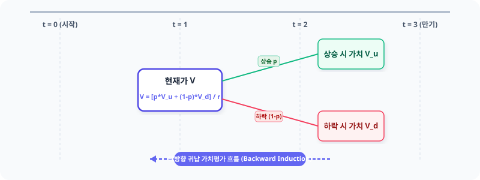

# 4.1 다기간 이항 트리 가치 평가 수치 모델 설정

금융 시장에서 옵션과 같은 파생상품의 가치를 구한다는 것은 결국 **'미래에 발생할 수 있는 모든 주가 시나리오를 그려내고, 그 결과를 현재 가치로 되돌리는 과정'**입니다. 단일 기간(1-Period)의 평가가 단순한 앞뒤 동전 던지기라면, 다기간(Multi-period) 평가는 수많은 갈림길이 유기적으로 얽힌 거대한 의사결정 나무(Tree)를 설계하는 작업입니다.

본 절에서는 3기간($n=3$) 동안 기초자산의 가격이 매 순간 오르거나 내리는 두 가지 선택지만 존재한다고 가정하여, 옵션의 공정 가치를 추적할 수 있는 구체적인 수치 모델의 물리적 골격을 구축합니다.

---

## 1. 주가 변화의 지도: 3단계 이항 트리 모델

우선 분석의 기준이 될 시장의 기본 규칙과 매개변수(Parameter)를 아래와 같이 정의합니다.

*   **기초자산 현재가 ($S_0$):** $80$
*   **행사가격 ($K$):** $80$
*   **기간 분할 수 ($n$):** $3$
*   **주가 상승률 ($u$):** $1.5$ (상승 시 $150\%$)
*   **주가 하락률 ($d$):** $0.5$ (하락 시 $50\%$)
*   **무위험 할인 요인 ($r$):** $1.1$ (기간 이자율 $10\%$)

### 1.1 모든 이동 경로의 직접 나열과 패턴 발견
시간이 흐름에 따라 주가는 매 단계마다 상승인자 $u$ 또는 하락인자 $d$가 곱해지며 사방으로 뻗어 나갑니다. $t=3$ 시점에 도달할 때까지 발생하는 총 $2^3 = 8$가지의 모든 주가 이동 순열 경로를 직접 계산해 보면 매우 흥미로운 수학적 규칙성이 나타납니다.

| 단계별 주가 경로 | 곱셈의 순서 | 최종 연산 식 | 최종 주가 |
| :--- | :--- | :--- | :--- |
| **상승 $\rightarrow$ 상승 $\rightarrow$ 상승 ($uuu$)** | $80 \times 1.5 \times 1.5 \times 1.5$ | $80 \times 1.5^3 \times 0.5^0$ | **270** |
| **상승 $\rightarrow$ 상승 $\rightarrow$ 하락 ($uud$)** | $80 \times 1.5 \times 1.5 \times 0.5$ | $80 \times 1.5^2 \times 0.5^1$ | **90** |
| **상승 $\rightarrow$ 하락 $\rightarrow$ 상승 ($udu$)** | $80 \times 1.5 \times 0.5 \times 1.5$ | $80 \times 1.5^2 \times 0.5^1$ | **90** |
| **하락 $\rightarrow$ 상승 $\rightarrow$ 상승 ($duu$)** | $80 \times 0.5 \times 1.5 \times 1.5$ | $80 \times 1.5^2 \times 0.5^1$ | **90** |
| **상승 $\rightarrow$ 하락 $\rightarrow$ 하락 ($udd$)** | $80 \times 1.5 \times 0.5 \times 0.5$ | $80 \times 1.5^1 \times 0.5^2$ | **30** |
| **하락 $\rightarrow$ 상승 $\rightarrow$ 하락 ($dud$)** | $80 \times 0.5 \times 1.5 \times 0.5$ | $80 \times 1.5^1 \times 0.5^2$ | **30** |
| **하락 $\rightarrow$ 하락 $\rightarrow$ 상승 ($ddu$)** | $80 \times 0.5 \times 0.5 \times 1.5$ | $80 \times 1.5^1 \times 0.5^2$ | **30** |
| **하락 $\rightarrow$ 하락 $\rightarrow$ 하락 ($ddd$)** | $80 \times 0.5 \times 0.5 \times 0.5$ | $80 \times 1.5^0 \times 0.5^3$ | **10** |

### 1.2 곱셈의 교환법칙과 일반화 공식
위 표에서 볼 수 있듯이, 상승과 하락이 일어나는 **'순서'가 다르더라도 그 '횟수'가 같다면 최종 주가는 완전히 일치**합니다. 이는 곱셈의 교환법칙($u \times d = d \times u$) 덕분입니다. 

덕분에 기하급수적으로 늘어날 것 같던 만기 주가 시나리오는 서로 중첩되며 단 $n+1 = 4$개의 고유한 최종 노드(Node)로 축소됩니다. 이를 수학적으로 일반화하면, $n$기간 모델에서 상승이 총 $k$번 발생했을 때의 주가 $S_n(k)$는 다음과 같이 정의됩니다.

$$S_n(k) = S_0 \cdot u^k \cdot d^{n-k} \quad (0 \le k \le n)$$

*   **최고가 ($k=3$):** $80 \times 1.5^3 \times 0.5^0 = 270$
*   **중간고가 ($k=2$):** $80 \times 1.5^2 \times 0.5^1 = 90$
*   **중간저가 ($k=1$):** $80 \times 1.5^1 \times 0.5^2 = 30$
*   **최저가 ($k=0$):** $80 \times 1.5^0 \times 0.5^3 = 10$

이렇듯 중첩 이항 트리(Recombining Binomial Tree) 구조를 채택함으로써, 계산 복잡도는 $2^n$에서 $n+1$로 극적으로 감소하여 다기간 평가를 수치적으로 다룰 수 있는 현실적인 기반이 마련됩니다.

<iframe src="contents/black_scholes_equation_01/sec_04/assets/diagrams/sub_04_01_visual1.html" width="100%" height="520px" frameborder="0" scrolling="no"></iframe>

---

## 2. 시장의 공정한 선택: 위험중립확률($p$)

이 트리의 모든 갈림길에서 상승할 확률과 하락할 확률은 각각 얼마일까요? 실제 시장 참여자들이 마음속으로 품고 있는 주관적인 전망이나 위험 선호도는 사람마다 천차만별입니다. 어떤 이는 주가가 폭등할 것이라 믿으며 위험을 기꺼이 감수하고, 어떤 이는 폭락을 대비해 안전자산으로 대피하려 합니다.

금융공학에서는 이러한 시장 참여자들의 주관적 편향을 완벽히 소거하기 위해, **'복제 포트폴리오의 헷징(Replicating Portfolio Hedging)'** 메커니즘을 사용합니다. 기초자산과 무위험 채권을 적절히 조합하여 옵션의 손익을 완벽하게 복제해낼 수 있다면, 시장의 주관적 위험 프리미엄은 수학적으로 완전히 무력화됩니다. 이 정교한 변환 과정을 거치면, 모든 투자자가 위험에 대해 무감각하다고 가정한 가상의 세계, 즉 **'위험중립 세상(Risk-Neutral World)'**의 수학적 가중치인 **위험중립확률(Risk-Neutral Probability)** $p$를 도출해낼 수 있습니다.

위험중립 세상에서 기초자산의 기대 수익률은 시장의 가장 객관적인 상수인 **무위험 이자율($r$)**과 정확히 일치해야 합니다. 즉, 다음 조건식이 성립하도록 상승 확률 $p$를 결정합니다.

$$S_0 \cdot r = p \cdot (S_0 \cdot u) + (1-p) \cdot (S_0 \cdot d)$$

### 2.1 위험중립확률($p$)의 도출과 물리적 한계 범위
위 식의 양변을 $S_0$로 나누고 $p$에 대해 정리하면 다음과 같은 공식을 얻을 수 있습니다.

$$p = \frac{r - d}{u - d}$$

여기에 사전에 정의한 수치($r=1.1, u=1.5, d=0.5$)를 대입합니다.

$$p = \frac{1.1 - 0.5}{1.5 - 0.5} = \frac{0.6}{1.0} = 0.6$$

이 식의 물리적 범위와 완결성을 따져보는 것은 모델의 타당성을 확보하는 데 매우 중요합니다.
*   **상승 확률 ($p$):** $0.6$
*   **하락 확률 ($1-p$):** $0.4$
*   **확률계의 완결성:** $p + (1-p) = 0.6 + 0.4 = 1.0$ (확률의 총합은 항상 1을 유지하며 완결성을 가짐)
*   **차무차별 조건 (No-Arbitrage):** 이 확률이 수학적으로 유효한 확률의 조건($0 < p < 1$)을 만족하려면, 반드시 시장의 무위험 이율인 $r$이 주가의 상승률 및 하락률 사이에 존재해야 합니다 ($d < r < u$). 

만약 이 조건이 깨지면 시장에는 다음과 같은 강력한 가격 복원 압력, 즉 **차익거래(Arbitrage)** 기회가 발생하게 됩니다.
1.  **$r \le d$인 경우:** 은행에 돈을 맡기는 것보다 주식의 하락 시 수익률이 더 높거나 같습니다. 모든 투자자는 무위험 차입(대출)을 일으켜 주식을 살 것이며, 시장에는 강력한 매수 압력이 발생해 주가를 즉각 위로 끌어올립니다.
2.  **$r \ge u$인 경우:** 주식이 아무리 올라도 은행 이자율보다 낮거나 같습니다. 모든 투자자는 주식을 공매도하고 그 대금을 은행에 예치할 것입니다. 이로 인한 강력한 매도 압력은 주가를 즉각 아래로 밀어내립니다.

현재 우리의 모델은 $0.5 < 1.1 < 1.5$를 정확히 만족하므로 차익거래 기회가 존재하지 않는 건전하고 안정적인 균형 시장 상태로 설정되었습니다.

### 2.2 파이썬 코드를 통한 파라미터 검증
아래 코드를 실행하면 이항 트리의 기본 파라미터가 유효하게 설정되었는지 계산하고 즉각적으로 검증할 수 있습니다.

```python
# 파이썬을 이용한 기본 파라미터 설정 및 검증
S0 = 80
u = 1.5
d = 0.5
r = 1.1
n = 3

# 위험중립확률 계산
p = (r - d) / (u - d)

# 조건 검증
is_valid_probability = 0 < p < 1
is_arbitrage_free = d < r < u

print(f"[계산 결과] 상승 확률 p: {p:.2f} | 하락 확률 1-p: {1-p:.2f}")
print(f"[검증 1] 확률 조건 만족 여부 (0 < p < 1): {is_valid_probability}")
print(f"[검증 2] 차익거래 없음 조건 만족 여부 (d < r < u): {is_arbitrage_free}")
```

<iframe src="contents/black_scholes_equation_01/sec_04/assets/diagrams/sub_04_01_visual2.html" width="100%" height="450px" frameborder="0" scrolling="no"></iframe>

---

## 3. 요약: 다기간 모델의 4대 핵심 뼈대

우리는 3단계 다기간 옵션 가치 평가를 위한 기초 환경 설정을 모두 끝마쳤습니다. 이 모델을 지탱하는 핵심 개념 네 가지는 다음과 같습니다.

1.  **경로의 다각화와 축소:** 시간의 흐름에 따라 가능한 주가 시나리오는 기하급수적으로 늘어나지만, 곱셈의 교환법칙에 의해 최종 노드는 $n+1$개로 깔끔하게 묶입니다.
2.  **경로의 독립성 (Markov Property):** 주가가 이전 경로에서 어떤 역사를 거쳐왔든, 현재 노드의 주가에 $u$와 $d$를 곱하는 규칙은 매 순간 독립적으로 동일하게 적용됩니다.
3.  **확률 체계의 고정:** 도출된 위험중립확률 $p=0.6$과 $1-p=0.4$는 트리 내의 어떤 위치, 어떤 노드에서든 일관되게 적용됩니다.
4.  **할인 계수의 적용:** 미래 가치를 현재 가치로 조정하기 위한 기간 할인 요인($1/r = 1/1.1 \approx 0.909$) 또한 모든 노드 간 가치 환산에 동일한 규칙으로 작동합니다.

---

### 다음 단계 예고

주가 경로 지도가 선명하게 그려졌으므로, 이제 우리는 만기 시점($t=3$)에 도달한 각 노드의 주가($270, 90, 30, 10$)를 기준으로 옵션 권리를 행사했을 때 벌어들이는 '만기 페이오프(Payoff)'를 계산할 수 있습니다. 

다음 절에서는 이 최종 가치로부터 출발하여 거꾸로 현재 시점($t=0$)까지 되돌아오며 옵션의 현재 가격을 계산해 나가는 **'역방향 귀납법(Backward Induction)'**의 흥미진진한 계산 과정을 자세히 살펴보겠습니다.

