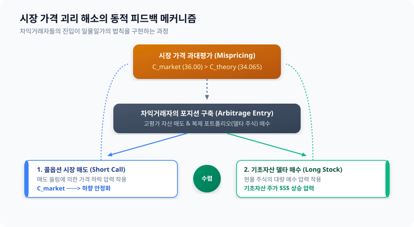

# 4.2 시장 가격 괴리에 기인한 무위험 차익거래 메커니즘 개요

앞선 4.1절에서 우리는 3단계 이항 트리 모델을 구축하고, 기초자산의 이동 경로와 위험중립확률($p=0.6$, $1-p=0.4$)을 기반으로 옵션의 공정한 가치를 산출하는 기초 뼈대를 설계했습니다. 이 엄밀한 수학적 계산을 통해 도출된 현재 시점($t=0$) 콜옵션의 **이론적 적정 가격($C_{theory}$)**이 **$34.065$**라고 가정해 봅시다.

그러나 실제 금융 시장은 항상 수학 공식처럼 정갈하게 움직이지 않습니다. 시장 참여자들의 과도한 낙관론, 특정 세력의 수급 불균형, 혹은 심리적 쏠림 현상으로 인해 **실제 시장 가격($C_{market}$)**은 이론가 위아래로 크게 출렁이곤 합니다.

만약 현실의 시장에서 이 콜옵션이 이론 가격보다 비싼 **$36.000$**에 거래되고 있다면, 우리는 이를 어떻게 바라보아야 할까요? 금융공학에서는 이러한 가격의 불일치를 단순한 혼란이 아닌, **'위험 없이 확정적인 이익을 얻을 수 있는 기회'**로 포착합니다. 본 절에서는 이론 가격과 시장 가격의 괴리를 활용해 완벽하게 리스크를 제거하고 확정 수익을 올리는 **무위험 차익거래(Arbitrage)**의 기계적 작동 원리를 규명합니다.

---

## 1. 차익거래의 출발점: 이론 가격($C_{theory}$)과 시장 가격($C_{market}$)의 괴리

수학적으로 증명된 적정가보다 시장 가격이 높게 형성되어 있다면, 이 옵션은 시장에서 **'고평가(Overvalued)'**된 상태입니다.

*   **적정 이론 가격 ($C_{theory}$):** $34.065$
*   **실제 시장 가격 ($C_{market}$):** $36.000$
*   **가격 괴리 발생:** $+1.935$ 만큼 시장가가 고평가됨

직관적인 투자자라면 "비싼 것을 팔고, 싼 것을 산다"는 시장의 기본 진리에 따라 고평가된 콜옵션을 즉시 매도(Short)하려 할 것입니다. 하지만 옵션을 단독으로 매도하는 행위(Naked Short)는 극심한 위험을 내포합니다. 만약 만기에 주가가 기하급수적으로 폭등할 경우, 매도자가 감당해야 할 손실은 무한대로 늘어나기 때문입니다.

따라서 진정한 의미의 '무위험' 차익거래를 성립시키려면, **옵션 매도 포지션에서 발생하는 모든 주가 변동 리스크를 완벽하게 상쇄(Hedge)해 줄 보완재**가 필요합니다. 이 역할을 수행하는 것이 바로 기초자산(주식)과 무위험 채권(현금 차입)으로 구성된 **'복제 포트폴리오(Replicating Portfolio)'**입니다.

---

## 2. 실패하는 포트폴리오 vs 성공하는 포트폴리오

차익거래가 정교하게 작동하기 위해 왜 '복제 포트폴리오'를 통한 정밀한 헷징이 필수적인지, 직관에 의존한 실패 사례와 금융공학적 성공 사례를 대조하여 살펴보겠습니다.

이해를 돕기 위해, $t=0$에서 출발하여 $t=1$이 되는 첫 번째 단계를 기준으로 설명합니다. 4.1절의 설정에 따라 $t=1$ 시점의 주가는 상승 시 $S_u = 120$, 하락 시 $S_d = 40$이 됩니다. 또한, $t=1$ 시점의 콜옵션 이론 가치는 각각 $C_u = 58.44$, $C_d = 6.00$으로 계산되어 있습니다.

### 2.1 [실패한 포트폴리오] 직관에 의존한 단순 매도와 방치
어떤 투자자가 고평가된 옵션을 매도하여 얻은 현금 $36.000$을 주식 매수 없이 단순히 금고에 넣어두거나, 헷징 비율을 고려하지 않고 임의의 주식 수량(예: $0.5$주)만 매수했다고 가정해 봅시다.

| 시장 시나리오 ($t=1$) | 주가 상승 시 ($S_u = 120$) | 주가 하락 시 ($S_d = 40$) |
| :--- | :--- | :--- |
| **옵션 매도 포지션의 가치 (의무)** | $-58.44$ | $-6.00$ |
| **임의의 주식 매수 포지션 ($0.5$주)** | $0.5 \times 120 = +60.00$ | $0.5 \times 40 = +20.00$ |
| **포트폴리오 합계 손익** | **$+1.56$ (수익)** | **$+14.00$ (수익)** |

*   **문제점 발견:** 주가가 오를 때와 내릴 때의 최종 포트폴리오 가치가 각각 $+1.56$과 $+14.00$으로 서로 불일치합니다. 주가가 어느 방향으로 움직이느냐에 따라 나의 수익이 흔들린다는 것은, 이 포트폴리오가 여전히 **'시장 방향성 리스크(Directional Risk)'에 노출되어 있음**을 뜻합니다. 이는 '무위험' 차익거래의 정의에 위배됩니다.

### 2.2 [정밀한 성공 포트폴리오] 복제 포트폴리오(Delta Hedge)의 구성
리스크를 완전히 '0'으로 만들기 위해서는 주가가 오르든 내리든 항상 동일한 가치를 유지하도록 주식 보유량 $\Delta$(델타)와 차입금 $B$를 정밀하게 연립방정식으로 풀어내야 합니다.

$$\begin{cases} 120 \cdot \Delta + 1.1 \cdot B = 58.44 & (\text{주가 상승 시}) \\ 40 \cdot \Delta + 1.1 \cdot B = 6.00 & (\text{주가 하락 시}) \end{cases}$$

이 연립방정식을 풀면 다음과 같은 최적의 포트폴리오 구성 비중을 얻을 수 있습니다.

*   **주식 매수 수량 ($\Delta$):** $0.6555$ 주
*   **채권 포지션 ($B$):** $-18.38$ (즉, 연 이율 $10\%$로 $18.38$만큼 현금을 빌려옴)

이 정밀한 포트폴리오가 실제로 어떻게 리스크를 무력화하는지 확인해 보겠습니다.

| 시장 시나리오 ($t=1$) | 주가 상승 시 ($S_u = 120$) | 주가 하락 시 ($S_d = 40$) |
| :--- | :--- | :--- |
| **옵션 매도 포지션의 가치** | $-58.44$ | $-6.00$ |
| **정밀 복제 주식 포지션 ($0.6555$주)** | $0.6555 \times 120 = +78.66$ | $0.6555 \times 40 = +26.22$ |
| **차입금 상환 의무 ($B \times r$)** | $-18.38 \times 1.1 = -20.22$ | $-18.38 \times 1.1 = -20.22$ |
| **포트폴리오 최종 가치 합계** | **$0.00$** | **$0.00$** |

*   **결과의 경이로움:** 주가가 $120$으로 폭등하든, $40$으로 폭락하든 상관없이 복제 포트폴리오와 옵션 매도 포지션의 손익을 합산한 결과는 **정확히 $0.00$으로 일치**합니다. 주가 변동성이라는 거친 파도 속에서도 완벽한 정적 균형(Static Equilibrium)을 이루어 낸 것입니다.

그렇다면 투자자의 실제 차익거래 수익은 어디서 발생할까요? 바로 거래를 시작한 **현재 시점($t=0$)**에 발생합니다.

*   **$t=0$ 시점 유입 현금 (옵션 시장 매도):** $+36.000$
*   **$t=0$ 시점 복제 포트폴리오 구축 비용:** 
    $$\text{주식 매수 비용} - \text{현금 차입금} = (0.6555 \times 80) - 18.38 = 52.44 - 18.38 = 34.060$$
*   **개시 시점 즉시 확정 수익:** 
    $$36.000 - 34.060 = \mathbf{+1.940}$$

투자자는 거래를 시작하자마자 아무런 리스크 없이 $1.940$의 순수 현금 수익을 주머니에 넣고, 만기($t=1$)에는 완벽히 상쇄되는 포지션을 청산하기만 하면 됩니다.

<iframe src="contents/black_scholes_equation_01/sec_04/assets/diagrams/sub_04_02_visual1.html" width="100%" height="450px" frameborder="0" scrolling="no"></iframe>

---

## 3. 복제 변수($\Delta$, $B$)의 물리적 한계 범위와 경제학적 의미

위 유도 과정에서 도출된 핵심 변수인 주식 보유량 $\Delta$와 채권 포지션 $B$는 단순한 수학적 계산 결과물이 아닙니다. 이 변수들은 실제 금융 시장의 메커니즘과 맞닿아 있는 뚜렷한 물리적 한계와 경제학적 의미를 지닙니다.

### 3.1 주식 보유 비율 $\Delta$의 물리적 범위 ($0 \le \Delta \le 1$)
일반적인 콜옵션의 델타($\Delta$)는 반드시 $0$과 $1$ 사이의 범위에 존재해야 합니다.
$$0 \le \Delta \le 1$$
*   **물리적 의미:** 콜옵션은 기초자산이 상승할 때 가치가 함께 상승하는 순방향 상품이므로 델타는 항상 양수($\ge 0$)입니다. 또한, 주가가 1원 오를 때 콜옵션 가치가 1원보다 더 빠르게 오를 수는 없으므로 델타의 상한선은 $1$이 됩니다. 만약 계산된 델타가 이 범위를 벗어난다면, 그것은 이항 모델의 무차익 조건($d < r < u$)이 붕괴되었음을 암시하는 강력한 경고 신호입니다.

### 3.2 채권 포지션 $B$의 부호와 경제학적 의미 ($B < 0$)
복제 포트폴리오에서 채권 포지션 $B$가 음수($B < 0$) 값을 가진다는 것은 **'자금을 외부에서 빌려왔음(Borrowing)'**을 의미합니다.
*   **경제학적 의미 (레버리지 효과):** 델타만큼의 주식을 매수하기 위해 필요한 총자금($52.44$)은 옵션의 적정 가치($34.06$)보다 큽니다. 따라서 부족한 자금을 무위험 이자율($r=10\%$)로 차입하여 충당하는 것입니다. 즉, 복제 포트폴리오는 본질적으로 **'차입 레버리지를 활용한 주식 매수 포지션'**과 수학적으로 동일한 물리적 실체임을 증명합니다.

---

## 4. 시장 가격을 강제하는 보이지 않는 손: 동적 피드백 루프

이러한 차익거래 기회는 시장에 영원히 존재할 수 없습니다. 금융 시장의 수많은 차익거래자(Arbitrageurs)들이 이 괴리를 발견하는 순간, 그들의 기계적인 거래 행동은 시장 가격을 순식간에 이론적 균형 가격으로 끌어내리는 **'역동적인 피드백 루프'**를 유발합니다.

이 피드백 루프는 시장의 가격이 왜 궁극적으로 우리가 계산한 이항 트리 모델의 이론 가격을 추종할 수밖에 없는지를 보여주는 가장 강력한 증거입니다. 시장 참여자들의 이기적이고 합리적인 이윤 추구 행위가 역설적으로 시장을 가장 효율적인 상태로 되돌려놓는 '자정 작용'을 수행하는 것입니다.

<iframe src="contents/black_scholes_equation_01/sec_04/assets/diagrams/sub_04_02_visual2.html" width="100%" height="480px" frameborder="0" scrolling="no"></iframe>

---

## 5. 요약: 무위험 차익거래 메커니즘의 3대 핵심 기둥

우리는 오늘 시장의 비효율성을 포착하여 수익으로 치환하는 파생상품 금융공학의 정수를 살펴보았습니다. 이를 관통하는 핵심 기둥은 다음과 같습니다.

1.  **리스크의 기계적 소거:** 단순한 방향성 투기가 아닌, 기초자산과 무위험 채권을 조합한 '복제 포트폴리오'를 통해 주가 변동 리스크를 완벽한 '0'으로 만듭니다.
2.  **변수의 물리적 타당성:** 복제 비율 델타($0 \le \Delta \le 1$)와 차입금 $B < 0$은 시장의 거래 제약 조건 및 레버리지 메커니즘을 정밀하게 반영합니다.
3.  **시장 자정 능력으로서의 차익거래:** 차익거래자들의 매수·매도 행위가 유발하는 가격 압력 피드백 루프는, 시장 가격을 이론적 균형 가격으로 강제 수렴시키는 '보이지 않는 손' 역할을 수행합니다.

---

### 다음 단계 예고
이제 우리는 시장 가격 괴리가 발생했을 때 이를 방어하고 이론 가격으로 수렴시키는 '무위험 차익거래'와 '복제 포트폴리오'의 기하학적 뼈대를 이해했습니다. 

그렇다면 이 복제 포트폴리오의 구성 비율인 **델타($\Delta$)**를 매 기간 주가 변동에 맞추어 구체적으로 어떻게 업데이트해 나가는지, 그리고 시간의 흐름을 거슬러 올라가는 **'역방향 귀납법(Backward Induction)'**을 다기간($n=3$) 전체 트리에 어떻게 일관되게 적용하는지 다음 장에서 본격적으로 계산해 보겠습니다.