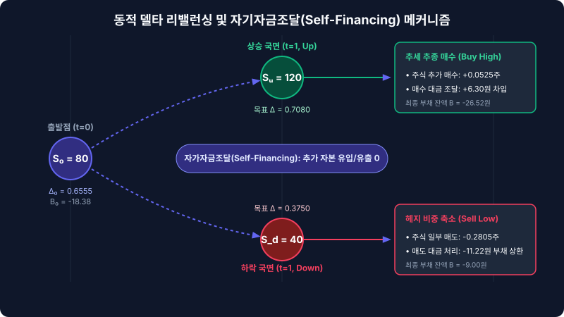

# 4.3 각 기간별 포트폴리오 동적 조정 경로 실행

앞선 4.2절에서 우리는 시장의 일시적인 가격 왜곡을 포착하여 리스크가 전혀 없는 '무위험 차익거래 포트폴리오'를 설계하는 법을 배웠습니다. 최초 시점($t=0$)에 고평가된 콜옵션을 매도하고, 이를 복제하기 위해 주식 $\Delta_0 = 0.6555$주를 매수하는 한편, 채권 시장에서 $B_0 = -18.38$만큼 자금을 차입하여 완벽한 균형을 정적으로 설계해 둔 상태입니다.

하지만 금융 시장은 멈춰 서 있는 사진이 아니라, 매 순간 흘러가는 영화와 같습니다. 시간이 흐르고 주가가 움직임에 따라 우리가 보유한 옵션의 기초자산 민감도인 **델타($\Delta$)** 역시 실시간으로 요동칩니다. 즉, 최초에 맞춰둔 헷징 비율을 그대로 방치한다면 주가 변동에 따라 포트폴리오의 균형이 깨져 리스크가 다시 고개를 들게 됩니다. 

본 절에서는 이항 트리의 다음 노드로 이동하며 **시간($t$)과 주가($S$)의 변화에 맞추어 내 주머니 속 현금(채권)과 주식의 비율을 구체적으로 어떻게 업데이트(Rebalancing)해 나가는지**, 그 동적 조정의 전체 경로를 완벽히 추적하고 숫자로 증명해 보겠습니다.

---

## 1. 정적 헷징의 한계와 동적 조정(Dynamic Rebalancing)의 필요성

많은 투자자가 "한 번 헷징을 해두면 만기까지 안전할 것"이라는 오해를 하곤 합니다. 이를 금융공학에서는 **'정적 헷징(Static Hedging)의 함정'**이라고 부릅니다. 

왜 정적 헷징이 실패할 수밖에 없는지 직관적인 대조군을 통해 살펴보겠습니다.

### 1.1 [실패하는 경로] 헷징 비율을 방치한 경우
우리가 $t=0$에서 설정한 헷징 비율 $\Delta_0 = 0.6555$를 $t=1$ 이후에도 조정하지 않고 만기까지 그대로 유지했다고 가정해 봅시다.

*   **현재 상태 ($t=0$):** 주식 $0.6555$주 보유, 차입금 $-18.38$
*   **사건 발생 ($t=1$):** 주가가 $120$으로 급등함.
*   **시장 상황의 변화:** 주가가 상승함에 따라 콜옵션이 만기에 행사될 확률이 극도로 높아졌습니다. 이제 옵션의 가치는 기초자산의 가격 움직임에 훨씬 더 민감하게 반응하게 되며, 이에 상응하는 새로운 적정 델타는 $\Delta_1 = 0.708$로 증가합니다.
*   **방치의 결과:** 여전히 $0.6555$주만 보유하고 있다면, 주가가 $1$원 더 오를 때 옵션 매도 포지션에서 발생하는 손실을 주식 매수 포지션의 평가익이 온전히 메워주지 못합니다. 포트폴리오는 다시 시장 방향성 리스크에 무방비로 노출되며, '무위험'의 지위를 잃게 됩니다.

### 1.2 [성공하는 경로] 델타 변동에 맞춘 정밀 리밸런싱
리스크를 상시 '0'으로 통제하기 위해서는 주가 변동 경로에 따라 매 기간 델타 값을 새로 계산하고, 부족하거나 남는 주식을 즉각적으로 사고팔아야 합니다. 이를 **동적 델타 헷징(Dynamic Delta Hedging)**이라고 합니다.

<iframe src="contents/black_scholes_equation_01/sec_04/assets/diagrams/sub_04_03_visual1.html" width="100%" height="520px" frameborder="0" scrolling="no"></iframe>

---

## 2. 시나리오별 동적 자금 흐름과 포트폴리오 조정 경로

이제 4.2절에서 다룬 구체적인 수치 예시를 그대로 이어받아, $t=0$에서 $t=1$로 이동할 때 발생하는 실제 포트폴리오 조정 과정을 시나리오별로 정밀하게 분해해 보겠습니다. 

앞서 계산했듯, $t=1$ 시점에 요구되는 노드별 이론 델타와 채권 포지션은 다음과 같이 이동합니다.

### [표 4-3] 시점 및 주가 변화에 따른 헷징 매개변수 변동표
| 시점 ($t$) | 주가 ($S$) | 콜옵션 가치 ($C$) | 목표 델타 ($\Delta$) | 주식 포지션 가치 ($\Delta \cdot S$) | 채권 포지션 잔액 ($B$) |
| :--- | :--- | :--- | :--- | :--- | :--- |
| **$t=0$ (출발점)** | $80$ | $34.065$ | $0.6555$ | $52.440$ | $-18.38$ (차입) |
| **$t=1$ (상승 노드 $u$)** | $120$ | $58.440$ | $0.7080$ | $84.960$ | $-26.52$ (추가 차입) |
| **$t=1$ (하락 노드 $d$)** | $40$ | $6.000$ | $0.3750$ | $15.000$ | $-9.00$ (일부 상환) |

---

### 경로 A: 주가가 $80$에서 $120$으로 급등한 경우 (강세 전환)

주가가 $120$으로 상승하는 순간, $t=0$에 구축해 둔 복제 포트폴리오의 가치는 주식 가치 상승으로 인해 총 $58.44$가 됩니다. 

$$\text{포트폴리오 가치} = (0.6555 \times 120) - (18.38 \times 1.1) = 78.66 - 20.22 = 58.44$$

이는 고평가되었던 옵션의 $t=1$ 시점 이론 가치($C_u = 58.44$)와 소수점 끝자리까지 정확히 일치하여 완벽한 방어에 성공했음을 보여줍니다.

하지만 다음 단계인 $t=2$를 대비하기 위해 우리는 포트폴리오를 재조정해야 합니다. $t=1$의 주가 $120$ 국면에서 요구되는 정밀 복제 델타는 $\Delta_1 = 0.7080$입니다.

1.  **주식 추가 매수량 계산:**
    $$\text{필요 추가 주식 수} = \Delta_{\text{new}} - \Delta_{\text{old}} = 0.7080 - 0.6555 = \mathbf{0.0525\,\text{주}}$$
2.  **추가 매수 대금 산출:**
    $$\text{필요 현금} = 0.0525\,\text{주} \times 120\,\text{원} = \mathbf{6.30\,\text{원}}$$
3.  **자금 조달 (추가 차입):**
    수중에 여유 현금이 없으므로, 추가 주식 매수 대금 $6.30$은 채권 시장에서 이자율 $10\%$로 추가 차입($B$의 음수폭 증가)하여 조달합니다.
    *   **조정 후 총 차입금 잔액:** $-(18.38 \times 1.1) - 6.30 = \mathbf{-26.52}$

---

### 경로 B: 주가가 $80$에서 $40$으로 급락한 경우 (약세 전환)

반대로 주가가 $40$으로 떨어졌을 때를 보겠습니다. 이때도 복제 포트폴리오의 가치는 $6.00$이 되어 옵션 매도 부채($-6.00$)를 완벽하게 상쇄해 줍니다. 

$$\text{포트폴리오 가치} = (0.6555 \times 40) - (18.38 \times 1.1) = 26.22 - 20.22 = 6.00$$

그러나 이 하락 국면에서는 옵션이 최종 소멸할 가능성이 매우 커졌기 때문에 주식 민감도(델타)가 $\Delta_1 = 0.3750$으로 급격히 줄어듭니다. 즉, 리스크 방어를 위해 주식을 많이 쥐고 있을 필요가 없어졌습니다.

1.  **주식 매도량 계산:**
    $$\text{매도할 주식 수} = \Delta_{\text{old}} - \Delta_{\text{new}} = 0.6555 - 0.3750 = \mathbf{0.2805\,\text{주}}$$
2.  **회수 현금 산출:**
    $$\text{주식 매도 회수 현금} = 0.2805\,\text{주} \times 40\,\text{원} = \mathbf{11.22\,\text{원}}$$
3.  **부채 상환:**
    주식을 팔아 확보한 현금 $11.22$는 그대로 채권 차입금을 상환하는 데 사용되어 부채 이자 부담을 즉시 경감시킵니다.
    *   **조정 후 총 차입금 잔액:** $-(18.38 \times 1.1) + 11.22 = \mathbf{-9.00}$

---

## 3. 동적 헷징의 자금 조정 파이썬 시뮬레이션

이 정교한 리밸런싱 메커니즘을 실제 투자 엔진이나 백테스팅 시스템에서 구현할 수 있도록 파이썬 코드로 구조화해 보겠습니다. 주가 경로에 따른 실시간 자금 변동을 추적하는 핵심 로직입니다.

```python
def calculate_rebalancing(step, current_price, prev_delta, prev_debt, target_delta, risk_free_rate=0.10):
    """
    이항 트리 상에서 단일 시점 이동 시 발생하는 델타 리밸런싱 자금 흐름을 계산합니다.
    """
    # 1. 기존 부채의 이자 누적 반영 (단기 채권 가치 변동)
    accrued_debt = prev_debt * (1 + risk_free_rate)
    
    # 2. 델타 변동에 따른 주식 수량 조정 및 자금 소요량 계산
    delta_gap = target_delta - prev_delta
    cash_flow_for_stock = delta_gap * current_price
    
    # 3. 새로운 채권(부채) 잔액 계산
    # 주식을 추가 매수(cash_flow > 0)하면 부채가 늘어나고, 매도(cash_flow < 0)하면 부채를 상환함
    new_debt = accrued_debt - cash_flow_for_stock
    
    print(f"[{step}단계 정산 보고서] 현재 주가: {current_price}")
    print(f" - 기존 보유 델타: {prev_delta:.4f} -> 신규 목표 델타: {target_delta:.4f} (변동: {delta_gap:+.4f})")
    print(f" - 주식 매매에 따른 현금 흐름: {-cash_flow_for_stock:+.2f} 원")
    print(f" - 조정 전 누적 채권 잔액: {accrued_debt:.2f} 원")
    print(f" - 최종 조정 후 채권 잔액(B): {new_debt:.2f} 원\n")
    
    return target_delta, new_debt

# Case A: 주가 상승 시나리오 시뮬레이션
print("=== 시나리오 A: 주가 상승 (80 -> 120) ===")
calculate_rebalancing(
    step="t=1 (Up)", 
    current_price=120, 
    prev_delta=0.6555, 
    prev_debt=-18.38, 
    target_delta=0.7080
)

# Case B: 주가 하락 시나리오 시뮬레이션
print("=== 시나리오 B: 주가 하락 (80 -> 40) ===")
calculate_rebalancing(
    step="t=1 (Down)", 
    current_price=40, 
    prev_delta=0.6555, 
    prev_debt=-18.38, 
    target_delta=0.3750
)
```

---

## 4. 동적 조정 경로의 변수 특징 및 경제학적 의미

동적 리밸런싱 경로에서 관찰되는 독특한 패턴들은 자산 가격 결정 이론의 핵심적인 직관을 담고 있습니다.



### 4.1 '추세 추종(Trend-following)'의 기계적 실행과 수학적 보험
델타 헤징은 경제학적으로 매우 독특한 행동 양식을 강제합니다. 
*   **주가 상승 시 ($\Delta \uparrow$):** 델타가 커지므로 **주식을 더 비싸게 추가 매수**합니다.
*   **주가 하락 시 ($\Delta \downarrow$):** 델타가 작아지므로 **주식을 더 싸게 시장에 매도**합니다.

이는 투자론에서 전형적인 역발상 매매와 정반대인 **"비쌀 때 더 사고, 쌀 때 파는(Buy High, Sell Low)" 추세 추종 전략**입니다. 일반적인 단방향 투자 포트폴리오에서 이처럼 매매하면 손실이 가중되겠지만, 파생상품 매도자 입장에서는 이 기계적인 리밸런싱이 만기에 발생할 수 있는 옵션 매도 포지션의 무한대 손실을 완벽하게 방어해 주는 유일한 **'수학적 보험(Mathematical Insurance)'**이 됩니다.

### 4.2 자기자금조달(Self-Financing)의 완벽성과 가치 보존
이 조정 과정에서 투자자는 $t=0$ 시점에 차익거래로 획득한 확정 마진($+1.94$) 외에는 **외부에서 추가로 자금을 투입하거나 중간에 현금을 빼내지 않습니다.** 주식을 더 살 때는 채권을 추가 발행(차입)해서 현금을 만들고, 주식을 팔 때는 회수한 현금으로 채권을 즉시 갚기 때문입니다. 

중간 자금의 외부 유입이나 유출 없이 오직 내부 포트폴리오의 비중 조정만으로 만기까지 굴러가는 이 구조적 완결성을 금융공학에서는 **'자기자금조달 포트폴리오(Self-Financing Portfolio)'**라고 부릅니다. 이 성질은 복제 이론의 정당성을 보장하고 최종 가치에 군더더기 없는 균형을 부여하는 가장 중요한 기둥입니다.

---

## 5. 요약: 조정을 통해 완성되는 무위험의 세계

우리는 이번 장을 통해 정적인 이론 수식이 역동적으로 변화하는 시장 노드에서 어떻게 살아서 숨 쉬는지 그 정교한 과정을 추적했습니다.

1.  **델타는 동적 매개변수다:** 주가와 시간이 흐르면 옵션의 기초자산 민감도(델타)가 실시간으로 변하므로, 헷징 비율은 최초 설계 시점에 고정되어 머물러 있을 수 없습니다.
2.  **기계적 추세 추종의 필연성:** 주가가 상승하면 주식을 비싸게 추가 매수하고(채권 차입 증가), 주가가 하락하면 주식을 매도하여 부채를 즉각 상환해 나감으로써 완벽한 실시간 방어 체계를 가동합니다.
3.  **자기자금조달의 자정 능력:** 최초 개시 시점을 지나며 발생하는 모든 자산 재조정은 추가적인 외부 자본 투입 없이 내부 계정 내의 차입과 상환 메커니즘을 통해 완벽하게 자가 정산됩니다.

---

### 다음 단계 예고
우리는 이제 $t=1$ 단계에서의 완벽한 포트폴리오 조정을 달성했습니다. 그렇다면 이 동적 조정을 만기인 $t=3$ 시점까지 수많은 경로 속에서 반복해 나갈 때, 최종 단계의 가치들은 어떻게 결정될까요? 

다음 장에서는 시간의 끝(만기)에서부터 거꾸로 계산을 수행하여 현재 시점의 공정 가격을 완벽하게 귀결시키는 금융공학의 꽃, **'역방향 귀납법(Backward Induction)'의 완전한 연산 알고리즘**을 정밀하게 해부해 보겠습니다.