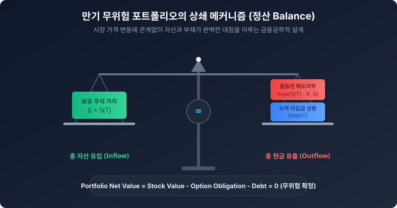

# 4.4 만기 시나리오별(상승 및 하락) 현금 흐름 및 무위험 수익 확정

## 1. 도입: 수학적 마침표를 찍는 시간

앞서 우리는 주가가 변할 때마다 보유 주식의 수량인 델타($\Delta$)를 정밀하게 조정하는 '동적 헤징(Dynamic Hedging)' 과정을 살펴보았습니다. 매 기간 주가의 등락에 맞춰 포트폴리오를 리밸런싱하며 쉼 없이 달려온 여정의 끝, 드디어 대망의 종착역인 $t=3$ 만기 시점에 도착했습니다.

이번 절은 우리가 설계한 무위험 포트폴리오의 마지막 관문이자 최종 검증 단계입니다. 이 검증의 핵심은 **"만기 시점에 주가가 어디로 가든, 우리가 보유한 주식 가치와 갚아야 할 차입금, 그리고 이행해야 할 옵션 매도 의무가 서로를 완벽하게 상쇄하여, $t=0$ 시점에 이미 확보한 무위험 차익을 안전하게 보존하는 것"**입니다. 

주가가 하늘을 찌르듯 솟구치든, 혹은 바닥으로 곤두박질치든 상관없이 수학적 계산을 통해 어떻게 마법 같은 최종 정산이 이루어지는지 실제 수치와 구조도를 통해 증명해 보겠습니다.



---

## 2. 본론: 만기 시나리오별 최종 정산 ($t=3$)

우리가 이전 절까지 유지해 온 헤징 포트폴리오의 기본 방정식은 다음과 같습니다.

$$\text{포트폴리오 순가치} = (\text{보유 주식 가치}) - (\text{차입금 잔액}) - (\text{옵션 의무 이행액})$$

만기 시점($t=3$)에 도달하면, 옵션은 더 이상 미래 가치가 아닌 '만기 페이오프(내재 가치)'라는 확정적 의무로 변하며, 주식 또한 시장에서 전량 매도하여 현금화하게 됩니다. 

독자 여러분의 직관적인 이해를 돕기 위해, **구체적인 수치 대입 시나리오**를 통해 실제 만기 정산이 어떻게 한 치의 오차도 없이 맞물리는지 살펴보겠습니다. (행사가격 $K = 100$ 가정)

### 2.1 시나리오 A: 주가가 극단적으로 상승했을 때 ($S_{u^3} = 270$)
주가가 연속 상승하여 만기에 $270$에 도달한 경우입니다. 이때 콜옵션은 깊은 ITM(내가격) 상태가 되어, 옵션 매도자인 우리는 막대한 의무 이행액을 지급해야 합니다. 하지만 동시에 우리가 들고 있던 주식의 가치 역시 크게 상승해 있습니다.

*   **최종 보유 주식 수 ($\Delta_{final}$)**: $0.719 \text{주}$ (이전 절에서 주가 상승에 대응하여 조정한 최종 헤지 비율)
*   **주식 자산 가치**: $0.719 \times 270 = 194.13 \text{원}$
*   **옵션 매도자의 의무**: $-\max(S_{final} - K, 0) = -(270 - 100) = -170.00 \text{원}$
*   **차입금 상환액**: $-24.13 \text{원}$ (이전 기간까지의 리밸런싱 과정에서 누적된 차입 원금과 이자의 총합)

| 항목 | 계산 수식 | 최종 금액 |
| :--- | :--- | :--- |
| **① 주식 매도 대금** | $\Delta_{final} \times S_{final}$ | $+194.13 \text{원}$ |
| **② 옵션 의무 이행** | $-\max(S_{final} - K, 0)$ | $-170.00 \text{원}$ |
| **③ 차입금 상환** | $-(\text{누적 차입금})$ | $-24.13 \text{원}$ |
| **최종 정산 (① + ② + ③)** | $194.13 - 170.00 - 24.13$ | $\mathbf{0.00 \text{원}}$ |

---

### 2.2 시나리오 B: 주가가 극단적으로 하락했을 때 ($S_{d^3} = 10$)
반대로 주가가 지속적으로 하락하여 만기에 $10$에 도달한 경우입니다. 콜옵션은 OTM(외가격) 상태가 되어 휴지조각이 되고, 우리는 옵션 이행 의무에서 자유로워집니다. 다만 우리가 보유했던 주식 가치 역시 급감해 있습니다.

*   **최종 보유 주식 수 ($\Delta_{final}$)**: $0.080 \text{주}$ (주가 하락에 대응하여 주식을 계속 매도하고 남겨둔 잔여분)
*   **주식 자산 가치**: $0.080 \times 10 = 0.80 \text{원}$
*   **옵션 매도자의 의무**: $-\max(S_{final} - K, 0) = 0 \text{원}$ (행사 가치 없음)
*   **차입금 상환액**: $-0.80 \text{원}$ (하락 헤징 과정에서 주식을 매도하여 차입금을 대부분 상환하고 남은 금액)

| 항목 | 계산 수식 | 최종 금액 |
| :--- | :--- | :--- |
| **① 주식 매도 대금** | $\Delta_{final} \times S_{final}$ | $+0.80 \text{원}$ |
| **② 옵션 의무 이행** | $-\max(S_{final} - K, 0)$ | $0.00 \text{원}$ |
| **③ 차입금 상환** | $-(\text{누적 차입금})$ | $-0.80 \text{원}$ |
| **최종 정산 (① + ② + ③)** | $0.80 - 0.00 - 0.80$ | $\mathbf{0.00 \text{원}}$ |

---

### 2.3 한눈에 보는 상쇄 반응형 시뮬레이션

아래의 대화형 인터랙티브 웹 위젯을 통해 만기 시점의 주가를 슬라이더로 다양하게 변경해 보십시오. 주가가 어떻게 요동치더라도, 포트폴리오를 철저히 리밸런싱하는 **'동적 헤징'** 모드에서는 자산과 부채가 항상 자석처럼 이끌리며 정산액을 **'0원'**으로 수렴시킴을 눈으로 직접 검증할 수 있습니다. 

반면, 귀찮다는 이유로 초기의 델타 포지션을 끝까지 방치한 **'고정 헤징(리밸런싱 생략)'** 모드에서는 주가 변동에 따라 포트폴리오가 파괴적 수준의 손실을 보는 대조 상황을 직관적으로 보실 수 있습니다.

<iframe src="contents/black_scholes_equation_01/sec_04/assets/diagrams/sub_04_04_visual1.html" width="100%" height="520px" frameborder="0" scrolling="yes"></iframe>

---

### 2.4 파이썬 코드로 검증하는 만기 정산

이 두 극단적인 경로 외에 어떠한 임의의 만기 주가가 도달하더라도 정산 금액이 완벽하게 상쇄되는지 파이썬 시뮬레이션을 통해 검증해 봅시다.

```python
def settle_at_maturity(final_price, strike, final_delta, accumulated_debt):
    """
    만기 시점의 포트폴리오 정산 함수
    """
    # 1. 주식 매도 대금
    stock_value = final_delta * final_price
    
    # 2. 콜옵션 매도자로서의 의무 이행액 (페이오프)
    option_obligation = max(final_price - strike, 0)
    
    # 3. 최종 순가치 = 주식 가치 - 옵션 의무 - 갚아야 할 차입금
    net_value = stock_value - option_obligation - accumulated_debt
    
    return round(net_value, 4)

# 이전 절 시나리오 데이터 정의
K = 100

# 시나리오 A (급등)
delta_up = 0.719
debt_up = 24.13
net_up = settle_at_maturity(270, K, delta_up, debt_up)

# 시나리오 B (폭락)
delta_down = 0.080
debt_down = 0.80
net_down = settle_at_maturity(10, K, delta_down, debt_down)

print(f"상승 시나리오 (S=270) 만기 최종 정산액: {net_up} 원")
print(f"하락 시나리오 (S=10) 만기 최종 정산액: {net_down} 원")
```

---

## 3. 깊이 읽기: 실패와 성공의 대조, 그리고 0의 미학

### 3.1 실패한 포트폴리오 vs 성공한 포트폴리오
수학적 최적화의 필연성을 직관적으로 설득하기 위해, **동적 리밸런싱을 완벽하게 완수한 성공 포트폴리오**와 **리밸런싱 없이 초기 델타($\Delta_0 = 0.500$)를 단순 방치한 실패 포트폴리오**의 기말 정산 대차대조표를 비교해 보겠습니다.

> **가정**: 
> - **성공 포트폴리오**: 매 기간 주가에 맞추어 $\Delta$를 동적으로 재조정함. (만기 시 주가 맞춤형 차입금 상환)
> - **실패 포트폴리오**: $t=0$의 헤지 비율인 주식 $0.5\text{주}$와 초기 차입금 $40\text{원}$을 리밸런싱 없이 만기까지 방치함. (만기 이자가 가산된 최종 차입금은 약 $42.40\text{원}$으로 동일하다고 가정)

#### [표: 리밸런싱 여부에 따른 최종 포트폴리오 순수익 대조]

| 만기 주가 ($S_{final}$) | 포트폴리오 유형 | 주식 자산 가치 (①) | 옵션 의무액 (②) | 차입금 상환액 (③) | 만기 최종 정산액 (① - ② - ③) |
| :---: | :--- | :---: | :---: | :---: | :---: |
| **$S = 270$ (급등)** | **실패(고정 헤징)** | $+135.00\text{원}$ | $-170.00\text{원}$ | $-42.40\text{원}$ | <span class="text-red-500">$-77.40\text{원}$ (대규모 손실)</span> |
| | **성공(동적 헤징)** | $+194.13\text{원}$ | $-170.00\text{원}$ | $-24.13\text{원}$ | **$0.00\text{원}$ (완벽 상쇄)** |
| **$S = 10$ (폭락)** | **실패(고정 헤징)** | $+5.00\text{원}$ | $0.00\text{원}$ | $-42.40\text{원}$ | <span class="text-red-500">$-37.40\text{원}$ (원금 잠식)</span> |
| | **성공(동적 헤징)** | $+0.80\text{원}$ | $0.00\text{원}$ | $-0.80\text{원}$ | **$0.00\text{원}$ (완벽 상쇄)** |

위 대조표를 통해 우리는 리밸런싱의 가치를 뼈저리게 느끼게 됩니다. 동적 리밸런싱을 망각한 고정 헤징은 주가가 오르든 내리든 심각한 재앙적 손실을 불러오지만, 매 시점 델타를 정밀 튜닝한 동적 포트폴리오는 어떠한 시나리오에서도 만기 순가치를 정확히 $0.00\text{원}$으로 묶어버리는 철벽의 수비를 수행합니다.

### 3.2 왜 최종 정산 결과는 항상 0으로 귀결되어야 하는가?
수식을 꼼꼼히 따라오신 독자라면 한 가지 의구심이 생길 수 있습니다. 
**"결국 만기 정산 금액이 0원이라면, 우리는 이 머리 아픈 복잡한 짓을 거쳐서 한 푼도 못 벌고 헛수고를 한 것 아닌가요?"**

아닙니다. 여기서 말하는 '최종 정산액 0'은 금융공학이 도달할 수 있는 가장 우아하고 아름다운 무위험 성취를 의미합니다.

### 3.3 초기 프리미엄과 만기 정산의 이원성
우리가 이 거래를 시작한 시점($t=0$)으로 돌아가 봅시다. 만약 시장에서 콜옵션이 지나치게 과평가되어 실제 공정가치인 $10\text{원}$보다 비싼 $15\text{원}$에 거래되고 있었다고 가정합시다. 

우리는 이 옵션을 시장에 $15\text{원}$에 냉큼 매도(옵션 복제 포트폴리오를 만들기 위해 필요한 돈은 $10\text{원}$)함과 동시에, 헤징 포트폴리오를 $10\text{원}$의 비용을 들여 정밀하게 구축했습니다. 이 거래가 체결되는 순간 우리는 이미 아무런 내 돈을 한 푼도 들이지 않고 **$5\text{원}$($15 - 10$)의 무위험 차익을 즉시 확보하여 주머니에 넣었습니다.**

그렇다면 만기까지 우리가 수행한 눈물겨운 델타 헤징은 무엇이었을까요? 바로 **처음에 주머니에 넣은 이 $5\text{원}$의 순수익을 만기 때까지 단 $1\text{원}$의 침해도 받지 않고 철저하게 '지켜내기 위한 완벽한 방어선'**이었습니다. 

만약 헤징을 하지 않았다면 주가가 급등했을 때 우리는 $170\text{원}$의 옵션 계약 이행 의무를 감당하지 못하고 파산했을 것입니다. 우리는 매일의 정밀한 헤징을 통해 만기 시점의 주가 경로에 따른 잔여 리스크를 $0$으로 격리 및 소거시킴으로써, 최초에 수취한 프리미엄 차익을 완벽하게 내 것으로 영구 소화시킨 것입니다.

---

### [이해를 돕는 비유: 보험사의 완벽한 헷징 운영]
보험사가 고객에게 암보험을 판매하고 보험료를 먼저 받습니다(초기 프리미엄). 이후 실제로 암 환자가 발생하여 보험금을 지급해야 하는 상황(만기 정산)이 오더라도, 보험사는 미리 재보험에 가입하거나 통계적으로 정밀하게 설계된 헷징 자산 포트폴리오를 운용함으로써 최종 자산 유출입을 통제합니다. 

사고가 터지든 터지지 않든 보험사의 기말 자산 포트폴리오는 약속된 의무를 정확히 상쇄하도록 설계되어 있으며, 이를 통해 보험사는 최초에 수취한 사업비와 마진(초기 차익)을 안전하게 확정 짓습니다. 델타 헤징은 이 보험 메커니즘을 개별 파생상품 하나에 대해 수학적으로 완벽하게 구현해 낸 것입니다.

---

## 4. 요약 및 학습 체크포인트

우리는 3기간 이항 트리 모델을 관통하며, 주가의 임의적인 움직임 속에서도 무위험 수익을 완벽하게 격리해 내는 금융공학의 정수를 목격했습니다.

1.  **리스크 상쇄의 대칭성**: 주가가 폭등할 때 발생하는 옵션의 계약적 부채는 보유 주식의 평가이익으로 정밀하게 상쇄되고, 주가가 폭락할 때는 주식의 손실을 옵션 의무 소멸과 공매도 포지션 회수를 통해 방어합니다.
2.  **무위험 수익의 실체**: 만기 시점 포트폴리오의 순가치가 $0$이 된다는 것은, $t=0$ 시점에 시장의 가격 왜곡을 이용하여 획득한 차익(초기 프리미엄과 복제 비용의 차이)이 만기까지 아무런 손실 없이 완벽하게 보존되었음을 의미합니다.
3.  **수학적 필연성**: 이항 트리 모델 상에서 공식에 맞춰 수행된 델타 헤징은 주가 경로가 어떻게 펼쳐지든 상관없이 최종 자산과 부채를 일치시키는 수학적 강제성을 지닙니다.

이제 우리는 이산 시간(Discrete-time) 모델에서의 차익거래와 헤징의 원리를 완벽하게 정복했습니다. 그러나 실제 금융 시장은 하루에 세 번만 움직이는 이항 트리처럼 작동하지 않으며, 끊임없이 가격이 변합니다. 

다음 장부터는 이 이항 트리의 노드를 무한히 쪼개어 현실의 연속적인 시장으로 나아가는 금융공학의 위대한 이정표, 그 유명한 **블랙-숄즈 모델(Black-Scholes Model)**의 문을 열어젖히겠습니다.

---

**[학습 체크포인트]**
*   만기에 주가가 $270$이 되든 $10$이 되든, 최종 정산 순가치가 $0$으로 수렴하는 수학적 동적 상쇄 메커니즘을 이해했는가?
*   '최종 가치가 0원'이라는 결과가 투자 실패가 아닌, '초기 확정 수익의 성공적인 아웃복싱(방어)'을 의미하는 이유를 명확히 설명할 수 있는가?
*   리밸런싱을 아예 거치지 않은 포트폴리오(고정 헤징)가 겪는 만기 위험 시나리오를 수치적으로 비교할 수 있는가?
