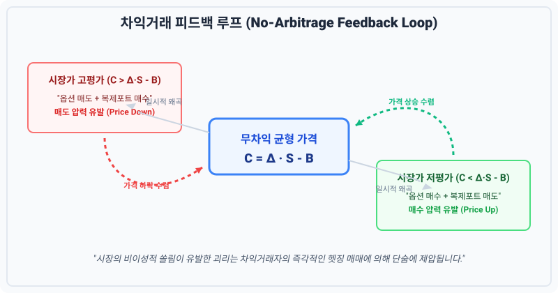

# 4.5 무위험 동적 복제 거래가 지니는 재무적 가치 규명

## 1. 도입: 기계적 연산에서 시장의 평형으로

앞선 4.4절에서 우리는 만기 시점($t=3$)의 두 가지 극단적인 시나리오를 목격했습니다. 주가가 $270$원까지 폭등하든, $10$원까지 폭락하든 상관없이 우리가 리밸런싱을 통해 정교하게 설계해 온 포트폴리오의 최종 정산 순가치는 정확히 $0$원으로 귀결되었습니다. 

이는 우리가 이 거래를 시작했던 첫날($t=0$)에 확보했던 무위험 수익(예컨대 이론가 $10$원인 옵션을 시장에서 $15$원에 매도하여 즉시 주머니에 넣은 $5$원의 차익)을 만기까지 단 $1$원의 손실도 없이 완벽하게 수호해 냈음을 의미합니다.

여기서 우리는 금융공학의 가장 본질적인 질문을 던져야 합니다. 

**"이 복잡하고 기계적인 '동적 복제 거래'와 '델타 헤징'이 지니는 진짜 재무적 가치는 무엇인가?"**

단순히 개인 투자자나 트레이더가 무위험으로 돈을 벌 수 있는 정교한 기법을 배웠다는 점에만 머무른다면, 우리는 이 거대한 이론의 절반밖에 이해하지 못한 것입니다. 이번 절에서는 우리가 수행한 기계적 헷징 거래가 어떻게 개별 트레이더의 계좌를 넘어 **금융 시장 전체의 비효율성을 바로잡고, 혼란스러운 파생상품 시장에 '단 하나의 합리적 가격'이라는 질서를 부여하는지** 그 거대한 재무적 함의와 메커니즘을 규명해 보겠습니다.

---

## 2. 본론: 일물일가의 법칙과 차익거래자의 피드백 루프

우리가 배운 동적 복제의 핵심 가치는 바로 **'가격의 강제 수렴'**에 있습니다. 금융 시장에서 동일한 현금 흐름을 만들어내는 두 자산의 가격은 같아야 한다는 **일물일가의 법칙(Law of One Price)**이 작동하는 실제 원동력은, 다름 아닌 완벽한 복제 포트폴리오를 쥐고 흔드는 '차익거래자(Arbitrageur)'들의 존재입니다.

### 2.1 패턴으로 이해하는 가격 불균형과 차익거래

수학적 정의나 수식을 먼저 제시하기 전에, 시장에서 실제로 발견되는 구체적인 가격 왜곡과 그에 따른 차익거래자들의 대응 패턴을 나열해 보겠습니다. 이를 통해 공식이 왜 필연적으로 유도되는지 직관적으로 납득할 수 있습니다.

**기본 가정:**
*   **복제 포트폴리오의 비용 ($V_{\text{replicating}}$):** $10$원 (주식 매입 대금에서 차입금을 뺀 순투자 비용)
*   **시장 거래 옵션 가격 ($C_{\text{market}}$):** 시장의 수급과 심리에 의해 무작위로 변동하는 가격

이때 시장에서 발생하는 불균형 패턴과 차익거래자의 포지션 구축은 다음과 같이 정형화된 흐름을 보입니다.

#### 패턴 A: 시장 가격이 복제 비용보다 높은 경우 (고평가, $C_{\text{market}} = 12$원)
1.  **현상:** 시장에서 콜옵션이 실제 가치($10$원)보다 $2$원 비싸게 거래됨.
2.  **행동:** 비싼 콜옵션을 시장에 **매도**하여 $+12$원을 확보하고, 동시에 똑같은 효용을 내는 복제 포트폴리오를 $-10$원에 **매수**함.
3.  **결과:** 거래 즉시 $2$원의 순현금 유입(무위험 차익)을 확정하고, 만기 시 자산과 의무가 완벽히 상쇄되어 추가 지출이 없음.
4.  **수렴 압력:** 수많은 차익거래자가 옵션을 매도하므로, 시장 옵션 가격은 **하락** 압력을 받음.

#### 패턴 B: 시장 가격이 복제 비용보다 낮은 경우 (저평가, $C_{\text{market}} = 8$원)
1.  **현상:** 시장에서 콜옵션이 실제 가치($10$원)보다 $2$원 저렴하게 거래됨.
2.  **행동:** 저렴한 콜옵션을 시장에서 $-8$원에 **매수**하고, 동시에 복제 포트폴리오를 반대로 운용하여(주식 공매도 및 자금 예치) $+10$원을 **매도(방출)**함.
3.  **결과:** 거래 즉시 $2$원의 순현금 유입을 확정하고, 만기 시 완벽히 상쇄됨.
4.  **수렴 압력:** 수많은 차익거래자가 옵션을 매수하므로, 시장 옵션 가격은 **상승** 압력을 받음.

이 두 가지 상반된 패턴을 하나의 표로 일목요연하게 대조해 보겠습니다.

| 구분 | 패턴 A: 옵션 고평가 ($C_{\text{market}} > V_{\text{replicating}}$) | 패턴 B: 옵션 저평가 ($C_{\text{market}} < V_{\text{replicating}}$) |
| :--- | :--- | :--- |
| **시장 상태 예시** | 시장 가격($12$원) $>$ 복제 비용($10$원) | 시장 가격($8$원) $<$ 복제 비용($10$원) |
| **차익거래자의 행동** | • 고평가된 옵션 **매도** ($+12$원 수취)<br>• 복제 포트폴리오 **매수** ($-10$원 지출)<br>※ 주식 $\Delta$주 매수 + 자금 차입 | • 저평가된 옵션 **매수** ($-8$원 지출)<br>• 복제 포트폴리오 **매도** ($+10$원 수취)<br>※ 주식 $\Delta$주 공매도 + 자금 예치 |
| **즉시 확정되는 차익** | $+12 - 10 = \mathbf{+2\text{원}}$ (무위험 즉시 확보) | $+10 - 8 = \mathbf{+2\text{원}}$ (무위험 즉시 확보) |
| **시장 피드백 루프** | 고평가된 옵션에 대한 **매도 주문 폭주** | 저평가된 옵션에 대한 **매수 주문 폭주** |
| **가격의 수렴 방향** | 시장 옵션 가격($C_{\text{market}}$)이 $10$원을 향해 **하락** | 시장 옵션 가격($C_{\text{market}}$)이 $10$원을 향해 **상승** |

이처럼 일시적인 왜곡이 발생하더라도 차익거래자들의 즉각적이고 이기적인 거래 세포들이 활성화되면서 시장은 역동적인 역학 관계를 통해 제자리를 찾아갑니다.



---

### 2.2 무차익 원리(No-Arbitrage Principle)의 수학적 필연성

이 피드백 루프의 종착역은 단 하나의 방정식으로 귀결될 수밖에 없습니다.

$$C = \Delta \cdot S - B$$

여기서 각 변수의 **물리적 한계 범위**와 **경제학적 의미**를 짚고 넘어가는 것이 중요합니다. 이 수식의 타당성을 입체적으로 확신하는 지름길이기 때문입니다.

1.  **델타 ($\Delta$)의 범위 ($0 \le \Delta \le 1$):**
    *   기초자산이 상승할 때 콜옵션 가치도 상승하므로 양(+)의 상관관계를 가집니다.
    *   $\Delta$가 $1$을 초과할 수 없다는 것은, 기초자산 가격이 $1$원 움직일 때 옵션 가격이 단독으로 그 이상(예: $2$원) 요동치는 복제 구조는 불가능함을 뜻합니다. 즉, 옵션의 물리적 한계는 기초자산 1주의 가치 변동 범위 내로 구속됩니다.
2.  **차입금 잔액 ($B > 0$):**
    *   $B$가 양수($>0$)라는 것은 우리가 돈을 빌려(차입 레버리지) 주식을 매입했다는 것을 뜻합니다.
    *   이는 초기 투자 자금을 대폭 줄여주어 적은 비용으로도 옵션과 동일한 페이오프를 복제해 낼 수 있게 만드는 금융의 '지렛대 효과'를 상징합니다.

따라서 위 등식은 단순한 수학적 선언이 아닙니다. **"만약 이 등식이 성립하지 않는다면 시장에는 무한히 돈을 복사할 수 있는 무위험 기계가 존재하게 되므로, 시장 참여자들의 차익거래 행위가 등식을 강제로 성립하도록 밀어붙인다"**는 금융 시장의 물리학적 인과법칙입니다.

---

### 2.3 무차익 평형 상태를 직접 조작하는 시뮬레이션

아래의 인터랙티브 시뮬레이션을 통해 시장 가격이 왜곡되었을 때 차익거래자들이 어떻게 시장을 평형 상태로 되돌려 놓는지 눈으로 직접 확인해 보십시오. 슬라이더를 움직여 시장가격을 변동시키면 저울이 기울어지고, '시장 안정화' 버튼을 누르면 피드백 루프에 의해 가격이 이론가로 강제 수렴해 가는 역동적인 과정을 관찰할 수 있습니다.

<iframe src="contents/black_scholes_equation_01/sec_04/assets/diagrams/sub_04_05_visual1.html" width="100%" height="520px" frameborder="0" scrolling="no"></iframe>

---

### 2.4 파이썬 코드로 검증하는 피드백 루프

시장의 왜곡이 발생했을 때 역동적으로 자동 수렴하는 과정을 파이썬 코드로 구현해 보겠습니다. 괴리율에 비례하여 시장 참여자들의 거래 대금이 쏠리는 현상을 수학적으로 모델링한 것입니다.

```python
def simulate_market_feedback_loop(market_price, theoretical_value, iterations=10):
    """
    시장 가격이 이론적 복제 가치로 수렴하는 피드백 루프 시뮬레이션
    """
    current_market_price = market_price
    print(f"[초기 상태] 시장가: {current_market_price:.2f}원 | 이론가: {theoretical_value:.2f}원")
    print("-" * 60)
    
    for i in range(1, iterations + 1):
        gap = current_market_price - theoretical_value
        
        # 임계값 이내로 들어오면 균형에 도달한 것으로 판단
        if abs(gap) < 0.01:
            print(f"[단계 {i:02d}] 시장 균형 완벽 도달! (괴리율: {gap:.4f}원) - 차익거래 기회 소멸")
            break
            
        if gap > 0:
            # 고평가 상태 -> 차익거래자의 매도 압력 발생
            # 괴리가 클수록 매도 압력이 강해짐 (여기서는 괴리의 50%만큼 가격이 하락한다고 가정)
            sell_pressure = gap * 0.5  
            current_market_price -= sell_pressure
            print(f"[단계 {i:02d}] 옵션 고평가 (+{gap:.2f}원) -> 차익거래자 매도 폭주 -> 시장가 {current_market_price:.2f}원으로 하락")
        else:
            # 저평가 상태 -> 차익거래자의 매수 압력 발생
            buy_pressure = abs(gap) * 0.5
            current_market_price += buy_pressure
            print(f"[단계 {i:02d}] 옵션 저평가 ({gap:.2f}원) -> 차익거래자 매수 폭주 -> 시장가 {current_market_price:.2f}원으로 상승")
            
    return round(current_market_price, 4)

# 이론가 10원짜리 옵션이 시장에서 15원에 거래되는 극단적 왜곡 상황 가정
simulate_market_feedback_loop(market_price=15.0, theoretical_value=10.0)
```

---

## 3. 깊이 읽기: 동적 복제 거래가 지니는 세 가지 재무적 가치

이처럼 동적 복제 거래가 정밀하게 작동함으로써 금융 시스템은 단순한 투기판을 넘어 '체계적이고 신뢰 가능한 위험 관리의 장'으로 진화합니다. 그 구체적인 재무적 가치를 세 가지 관점으로 나누어 자세히 풀어보겠습니다.

### 3.1 가격 발견 기능(Price Discovery)의 고도화
동적 복제가 가능해지기 전까지 옵션은 '내일 주가가 오를 것인가 내릴 것인가'에 대한 주관적인 베팅 상품에 불과했습니다. 마치 경마장의 마권처럼 대중의 심리와 투기 수요에 의해 가격이 통제 불능으로 날뛰었습니다. 

그러나 동적 복제 거래는 옵션의 가치를 **"기초자산 주식의 현재 가치($S$)와 무위험 차입금 잔액($B$)의 조합"**이라는 철저히 객관적이고 복제 가능한 물리적 실체로 치환했습니다. 옵션 가격이 더 이상 '누군가의 감정'이 아니라 기초자산의 변동성과 현물 가격에 완벽히 동기화된 합리적인 지표로 확립된 순간입니다.

### 3.2 위험의 효율적 전이와 분산(Risk Transfer)
옵션을 발행하여 매도하는 기관(예: 증권사)은 주가가 폭등할 경우 무한대의 계약적 손실을 입을 위험에 직면합니다. 과거에는 이러한 파멸적 리스크 때문에 옵션 공급 자체가 원활하지 못해 파생상품 시장이 활성화되기 어려웠습니다.

하지만 이제 금융기관은 옵션을 매도하는 동시에 **동적 델타 헤징 포트폴리오**를 구축하여 이 리스크를 완벽하게 통제할 수 있습니다. 옵션 매도자의 위험은 허공으로 사라지는 것이 아닙니다. 주식 시장에서 매일 주식을 사고파는 기계적인 리밸런싱 과정을 통해 시장 전체의 거대한 유동성 속으로 잘게 쪼개져 흡수됩니다. 

즉, 위험을 원하고 감수하려는 사람(옵션 매수자)과 위험을 기계적으로 방어하려는 사람(헤징 금융기관) 간의 **정교한 리스크 전이 통로**가 비로소 완성되는 것입니다.

### 3.3 시장 간의 유기적 통합과 효율성 극대화
동적 복제 포트폴리오는 파생상품 시장과 현물(주식) 시장, 그리고 화폐 채권(금리) 시장을 단 하나의 보이지 않는 수학적 끈으로 단단히 묶어버립니다. 

만약 주식 가격이 변하면 복제 비율($\Delta$)이 변하므로 즉각 현물 시장에서 주식 매매가 발생하고, 이는 다시 이자율 시장의 차입금($B$) 조달 규모에 영향을 미치며, 최종적으로 옵션 가격($C$)을 실시간으로 재조정합니다. 이 세 가지 시장이 하나의 유기체처럼 맞물려 돌아가는 덕분에 금융 시장의 자금은 단 한 군데도 정체되지 않고 가장 효율적인 균형 가격을 향해 끊임없이 순환하게 됩니다.

---

## 4. 요약 및 학습 체크포인트

우리는 4.5절을 통해 기계적인 포트폴리오 조정 작업이 어떻게 금융 시장의 뼈대를 이루는 거대한 질서로 변모하는지 확인했습니다.

1.  **일물일가의 강제력**: 복제 포트폴리오의 존재는 시장의 일시적 왜곡을 즉시 무위험 차익거래 기회로 전환시키며, 차익거래자들의 매매 피드백은 시장 가격을 이론적 복제 가치($C = \Delta \cdot S - B$)로 강제 수렴시킵니다.
2.  **리스크의 객관화**: 동적 복제는 주관적 예측의 영역에 표류하던 파생상품의 위험을 '기초자산 포트폴리오'라는 통제 가능한 객관적 물리량으로 치환하여 안전하게 거래할 수 있도록 돕습니다.
3.  **시장 효율성**: 파생 시장, 현물 시장, 자금 시장은 동적 복제라는 정밀한 톱니바퀴를 통해 유기적으로 결합되어 시장 전체의 정보 효율성과 자금 순환을 극대화합니다.

---

**[학습 체크포인트]**
*   시장 옵션 가격이 이론적 복제 가치보다 낮을 때, 차익거래자들이 어떤 경로를 통해 가격을 다시 끌어올리는지 그 피드백 루프를 수치적으로 설명할 수 있는가?
*   "옵션 가격은 기초자산의 복제 비용과 무조건 같아질 수밖에 없다"는 주장의 재무적 바탕인 '무차익 원리'를 이해했는가?
*   변수 $\Delta$가 $0$과 $1$ 사이의 물리적 범위를 가진다는 것이 왜 옵션 복제의 완결성을 지탱하는지 설명할 수 있는가?

이제 우리는 이산적인 시간 단계(Discrete-time)에서 완벽한 무위험 복제가 작동하는 원리와 그 재무적 철학을 완벽하게 마스터했습니다. 하지만 실제 금융 시장은 하루에 세 번만 가격이 튀는 이항 트리처럼 자비롭지 않습니다. 주가는 매 찰나 변하며, 시간은 끊임없이 흐릅니다.

다음 장부터는 이 이항 트리의 격자(Node) 간격을 무한히 좁혀 연속적인 시간(Continuous-time)의 세계로 나아갑니다. 마침내 현대 금융공학의 왕관이자 찰나의 헤징을 완성하는 **블랙-숄즈 모델(Black-Scholes Model)**의 장엄한 서막이 열립니다.