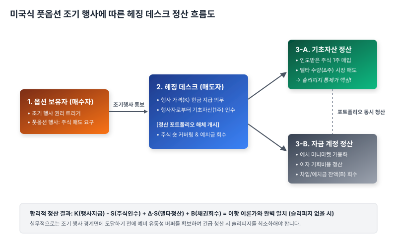

# 4.6 조기 행사 여부와 헤징 포트폴리오 정산의 실무적 쟁점

## 1. 도입: 완벽한 궤적을 가로막는 현실의 ‘중도 종료’ 버튼

앞선 4.5절에서 우리는 일물일가의 법칙이 작동하는 시장의 역동적인 피드백 루프를 목격했습니다. 이론적 균형 가격에서 벗어난 옵션은 차익거래자들의 강력한 매수·매도 압력에 의해 결국 $C = \Delta \cdot S - B$라는 완벽한 균형식으로 수렴할 수밖에 없음을 배웠습니다. 이 동적 복제 메커니즘은 만기 시점($t=T$)까지 포트폴리오를 자로 잰 듯 리밸런싱하며 무위험 수익을 온전히 지켜낼 수 있다는 확신을 줍니다.

하지만 이 우아한 방정식 뒤에는 실무자들을 밤잠 설치게 만드는 거대한 변수가 숨어 있습니다. 바로 만기일 이전이라도 보유자가 언제든 권리를 행사할 수 있는 **'미국식 옵션(American Option)'**의 존재입니다. 

유럽식 옵션을 헤징할 때는 만기라는 정해진 종착역을 향해 기계적으로 델타를 조정하면 그만입니다. 그러나 미국식 옵션의 매수자가 어느 날 갑자기 "지금 당장 권리를 행사하겠다"라며 **조기 행사(Early Exercise)** 버튼을 누르는 순간, 헤징을 위해 공들여 쌓아 올린 주식과 차입금의 복제 포트폴리오는 그 즉시 강제로 해체되어 시장에서 청산되어야 합니다. 

이번 절에서는 수학적 이상향이었던 동적 복제 모델이 조기 행사라는 현실의 돌발 변수를 만났을 때 발생하는 실무적 쟁점을 파헤쳐 보겠습니다. 투자자가 조기 행사를 선택하는 수학적·경제학적 임계점을 규명하고, 이 갑작스러운 정산 요구가 헤징 포트폴리오의 안정성을 어떻게 위협하며, 실무에서는 이를 어떻게 극복하는지 상세히 살펴보겠습니다.

---

## 2. 본론: 조기 행사의 역학 관계와 수학적 경계

### 2.1 숫자로 보는 조기 행사의 필연성: 시간 가치의 잠식 패턴

투자자가 만기까지의 대기 시간을 포기하고 '지금 당장 행사하겠다'고 결정하는 것은 감정적인 선택이 아닙니다. 철저한 재무적 계산의 결과입니다. 

옵션의 전체 가치는 **내재 가치(Intrinsic Value, 즉시 행사 시 얻는 가치)**와 **시간 가치(Time Value, 미래 변동성에 기대하는 가치)**의 합으로 구성됩니다. 만약 시장 상황이 극단적으로 흘러 **시간 가치가 0 이하(음수)로 떨어지는 임계점**이 발생하면, 투자자는 옵션을 들고 대기하는 것보다 즉시 행사하는 것이 이득이 됩니다. 

이해를 돕기 위해, 무위험 이자율 $r = 5\%$, 행사 가격 $K = 100$원인 배당이 없는 주식의 **풋옵션(Put Option)** 상황을 가정해 보겠습니다. 주가가 극단적으로 하락했을 때, 옵션 보유자가 겪게 되는 시간 가치의 변화 패턴을 아래 표로 나열해 보았습니다.

| 시나리오 | 현재 주가 ($S_t$) | 즉시 행사 가치 (내재 가치: $K - S_t$) | 만기 대기 가치 (할인 반영: $e^{-r(T-t)} \cdot K - S_t$) | 실제 옵션 가치 ($P$) | 시간 가치 ($P - (K - S_t)$) | 투자자의 합리적 선택 |
| :--- | :---: | :---: | :---: | :---: | :---: | :--- |
| **A (약한 하락)** | $90$원 | $10$원 | $100 \cdot 0.95 - 90 = 5$원 | $12$원 | $+2$원 | **보유 및 헤징 유지** (시간 가치 양수) |
| **B (중간 하락)** | $50$원 | $50$원 | $100 \cdot 0.95 - 50 = 45$원 | $50$원 | $0$원 | **균형 상태** (조기 행사 경계 도달) |
| **C (극단적 폭락)**| $10$원 | $90$원 | $100 \cdot 0.95 - 10 = 85$원 | $85$원 | $\mathbf{-5}$원 | **즉시 조기 행사** (시간 가치 음수 전환) |

이 패턴을 분석해 보면 매우 흥미로운 사실을 발견할 수 있습니다. 
주가가 $10$원까지 폭락한 시나리오 C를 보겠습니다. 만약 옵션을 만기까지 보유한다면, 아무리 주가가 더 내려가도 얻을 수 있는 추가 수익은 최대 $10$원에 불과한 반면, 만기 시점에 행사 가격 $100$원을 받기 위해 대기해야 하는 시간 동안 발생하는 **화폐의 시간 가치 손실(이자 기회비용)**이 더 커집니다. 

지금 당장 행사하여 $90$원의 현금을 손에 쥐고 이를 무위험 이자율로 굴리는 것이, 만기까지 옵션을 멍하니 들고 있는 것보다 무려 $5$원이나 이득인 상황입니다. 즉, **대기로 인한 시간 가치가 음수($-5$원)로 추락하는 순간, 조기 행사는 필연적으로 발생**합니다.

---

### 2.2 조기 행사 경계 조건의 수학적 필연성

이러한 물리적 한계는 수학적으로 다음과 같은 엄격한 부등식(Boundary Condition)으로 표현됩니다. 미국식 옵션의 가치 $V_{\text{American}}$은 어떠한 시점 $t$에서도 즉시 행사 가치(Payoff)보다 절대 작아질 수 없습니다.

$$V_{\text{American}}(S_t, t) \ge \max(K - S_t, 0) \quad \text{(풋옵션의 경우)}$$

$$V_{\text{American}}(S_t, t) \ge \max(S_t - K, 0) \quad \text{(콜옵션의 경우)}$$

만약 시장에서 이 부등식이 깨지는 순간이 온다면 어떻게 될까요? 예컨대 시장의 일시적인 혼란으로 미국식 풋옵션 가격이 즉시 행사 가치인 $90$원보다 낮은 $88$원에 거래된다고 가정해 봅시다. 

차익거래자들은 즉시 다음과 같은 무위험 차익거래(Arbitrage) 시스템을 구축할 것입니다.
1. 시장에서 저평가된 풋옵션을 $88$원에 매수한다.
2. 동시에 주식 시장에서 주식을 $10$원에 매수한다 (총 지출 $98$원).
3. 매수한 풋옵션을 **즉시 조기 행사**하여 주식을 행사 가격 $100$원에 넘긴다 (총 수입 $100$원).
4. 단 1초 만에 무위험 즉시 수익 $+2$원을 확정한다.

이 거대한 차익거래 주문 폭주는 풋옵션 가격을 즉시 $90$원 위로 밀어 올리게 됩니다. 따라서 미국식 옵션 가격은 위 부등식이 제시하는 하한선을 절대 뚫고 내려갈 수 없으며, 이 하한선에 닿는 순간 즉각적인 조기 행사가 실행되어 옵션 계약은 소멸합니다.

아래 시뮬레이션을 통해 잔존 만기($T-t$)와 이자율($r$)이 변할 때 미국식 옵션 가치 곡선과 조기 행사 영역이 어떻게 역동적으로 상호작용하는지 관찰해 보십시오.

<iframe src="contents/black_scholes_equation_01/sec_04/assets/diagrams/sub_04_06_visual1.html" width="100%" height="520px" frameborder="0" scrolling="yes"></iframe>

---

## 3. 깊이 읽기: 조기 행사 발생 시 헤징 포트폴리오 청산 메커니즘

그렇다면 실제로 옵션 매도인(증권사 파생상품 데스크 등)이 동적 헤징을 수행하던 도중, 매수인으로부터 조기 행사 통보를 받으면 포트폴리오 내부에서는 어떤 정산이 일어날까요? 

인터랙티브 분석으로 나아가기 전에, 아래의 청산 흐름도를 통해 매도자 데스크가 인수한 자산과 기존 헤징 포지션을 결합하여 최종적인 가치를 청산해내는 구조적 정산 프로세스를 파악해 보겠습니다.



직관적인 이해를 위해, 시장의 예측에 실패하여 무방비로 당하는 **'실패한 포트폴리오'**와 조기 행사 경계를 정밀하게 계산해 대응하는 **'정밀한 성공 포트폴리오'**를 대조하여 설명해 드리겠습니다.

### 3.1 실패한 포트폴리오 vs 정밀한 성공 포트폴리오의 대조

동일하게 행사 가격 $K=100$원인 미국식 풋옵션 1계약을 매도하고 복제 포트폴리오($\Delta \cdot S - B$)를 구축한 상황입니다. 현재 주가가 $50$원으로 폭락하여 상대방이 기습적으로 조기 행사를 통보했습니다. 당시 델타 헤징 비율은 $\Delta = -0.8$이었고, 차입금 잔액은 $B = -42$원이었습니다(자금 예치 상태).

#### ① 대비하지 못한 실패한 포트폴리오 (유동성 부족 및 마찰 손실 발생)
*   **상황**: 평소 만기까지만 포트폴리오를 유지하면 된다고 믿고, 시장의 유동성이나 조기 행사 가능성을 전혀 고려하지 않은 채 델타 비율만 기계적으로 맞춤.
*   **조기 행사 통보 시점의 조치**: 
    1. 상대방이 주식을 $100$원에 팔겠다고 권리를 행사하므로, 헤징 당사자는 즉시 현금 $100$원을 마련해 주식을 받아주어야 함.
    2. 당장 가용한 현금이 부족하여, 보유 중이던 헤징 주식 $0.8$주를 급하게 시장에 던져 매도함.
    3. 일시적인 시장 유동성 고갈(Order Book Thinning)로 인해 제값($50$원)을 받지 못하고 급매 가격인 $45$원에 시장가 청산이 체결됨 (**슬리피지 손실 발생**).

| 정산 항목 | 계산 내역 | 최종 금액 |
| :--- | :--- | :---: |
| **의무 이행 지출** | 행사 가격 $100$원 지급 | $-100$원 |
| **인수한 주식 가치** | 현재 주가 $50$원의 주식 1주 인수 | $+50$원 |
| **헤징 주식 청산 수입** | 보유하던 주식 $0.8$주를 슬리피지가 발생한 $45$원에 매도 | $+36$원 (원래 기대치 $40$원 대비 $4$원 손실) |
| **예치금 회수** | 자금 예치 잔액 $42$원 인출 | $+42$원 |
| **최종 정산 순가치** | $-100 + 50 + 36 + 42$ | $\mathbf{+28\text{원}}$ |

> **실패의 결과**: 당초 이론적으로 기대했던 완벽한 무위험 포트폴리오 정산 가치($+32$원)에 미치지 못하고, 급격한 시장가 청산 과정에서 발생한 거래 마찰(슬리피지)로 인해 **$4$원의 실무적 재무 손실**을 입게 되었습니다.

#### ② 정밀한 성공 포트폴리오 (조기 행사 경계 모델링 및 버퍼 운용)
*   **상황**: 주가가 $50$원에 근접함에 따라 조기 행사 확률이 급격히 치솟는 '조기 행사 경계(Early Exercise Boundary)' 영역에 진입했음을 실시간으로 감지함.
*   **대응 조치**:
    1. 주식 시장의 일시적 충격을 예방하기 위해 지정가 분할 매도 주문을 배치하여 슬리피지 발생을 사전에 방지함.
    2. 갑작스러운 현금 인도 요구($-100$원)에 대응하기 위해, 예치금 중 일부를 즉시 현금화할 수 있는 초단기 머니마켓펀드(MMF) 등 유동성 버퍼로 미리 전환해 둠.

| 정산 항목 | 계산 내역 | 최종 금액 |
| :--- | :--- | :---: |
| **의무 이행 지출** | 행사 가격 $100$원 지급 | $-100$원 |
| **인수한 주식 가치** | 현재 주가 $50$원의 주식 1주 인수 | $+50$원 |
| **헤징 주식 청산 수입** | 슬리피지 없이 정확히 시장 기준가 $50$원에 $0.8$주 매도 체결 | $+40$원 |
| **예치금 회수** | 버퍼로 관리되던 유동성 자산 $42$원 즉시 회수 | $+42$원 |
| **최종 정산 순가치** | $-100 + 50 + 40 + 42$ | $\mathbf{+32\text{원}}$ |

> **성공의 결과**: 조기 행사가 발생할 수밖에 없는 수학적 임계점을 미리 인지하고 완충 장치(Liquidity Buffer)와 청산 시나리오를 가동한 결과, 단 $1$원의 오차도 없이 이론적 복제 가치를 시장에서 그대로 구현해 냈습니다.

---

### 3.2 조기 행사 시 헤징 포트폴리오 정산 시뮬레이션

실무에서 조기 행사가 발생했을 때, 포트폴리오를 구성하는 자산들이 어떻게 연쇄적으로 청산되며 슬리피지가 전체 수익성에 어떠한 영향을 미치는지 직관적으로 이해할 수 있는 파생상품 데스크의 청산 시뮬레이션 코드를 작성해 보겠습니다.

```python
class AmericanPutHedgeDesk:
    def __init__(self, strike, initial_delta, initial_bond):
        self.strike = strike          # 행사 가격 (K)
        self.delta = initial_delta    # 복제 포트폴리오 내 주식 보유 수량 (풋옵션 매도 헤징이므로 대개 0 ~ -1 사이)
        self.bond = initial_bond      # 예치금 혹은 차입금 잔액 (B)
        
    def process_early_exercise(self, current_stock_price, market_slippage_pct=0.0):
        """
        상대방의 기습 조기 행사 통보에 따른 포트폴리오 강제 청산 프로세스
        market_slippage_pct: 급격한 자산 매각 시 발생하는 시장 마찰 손실 비율 (0.01 = 1% 가격 할인 매각)
        """
        print("====== [ALERT] 미국식 풋옵션 조기 행사 통보 수신 ======")
        print(f"현재 주가: {current_stock_price}원 | 행사 가격: {self.strike}원")
        print(f"청산 전 포트폴리오: 주식 {self.delta:.4f}주 | 채권(예치금): {self.bond:.2f}원")
        print("-" * 65)
        
        # 1. 의무 이행: 행사 가격대로 매수인의 주식 1주를 매입 (현금 지출)
        cash_outflow_exercise = -self.strike
        acquired_asset_value = current_stock_price
        
        # 2. 헤징 포트폴리오 해체: 보유 주식 시장 청산 (슬리피지 반영)
        liquidation_price = current_stock_price * (1 - market_slippage_pct)
        # 풋옵션 매도의 헤징이므로 주식 숏(매도) 포지션을 청산하기 위해 주식을 '매수'해야 함
        # 보유 주식 수량(self.delta)이 음수이므로, 이를 0으로 만들기 위해 매수하는 금액 계산
        cash_flow_stock_liquidation = -self.delta * liquidation_price
        
        # 3. 예치금 회수
        cash_inflow_bond = self.bond
        
        # 4. 최종 정산 가치 합산 (Net Cash Flow)
        # 이행 의무로 지급한 현금(-K) + 인수한 주식 가치(S) + 헤징 포지션 청산으로 인한 현금 흐름 + 예치금 회수
        final_net_value = cash_outflow_exercise + acquired_asset_value + cash_flow_stock_liquidation + cash_inflow_bond
        
        print(f"[단계 1] 권리 인수 완료: 현금 {cash_outflow_exercise}원 지급 및 {acquired_asset_value}원 가치 주식 인수")
        print(f"[단계 2] 헤징 주식 청산: 청산 단가 {liquidation_price:.2f}원 (슬리피지 {market_slippage_pct*100:.1f}%) -> 현금 흐름 {cash_flow_stock_liquidation:.2f}원")
        print(f"[단계 3] 자금 계정 정산: 예치금 {cash_inflow_bond:.2f}원 전액 회수")
        print(f"[결과] 포트폴리오 최종 정산 순가치: {final_net_value:.2f}원")
        print("========================================================\n")
        return final_net_value

# 1. 슬리피지가 발생한 실패 시나리오 (준비되지 않은 데스크)
naive_desk = AmericanPutHedgeDesk(strike=100, initial_delta=-0.8, initial_bond=42.0)
naive_desk.process_early_exercise(current_stock_price=50.0, market_slippage_pct=0.10) # 10% 슬리피지 발생

# 2. 완벽한 헤징 통제를 이뤄낸 성공 시나리오 (정밀한 데스크)
smart_desk = AmericanPutHedgeDesk(strike=100, initial_delta=-0.8, initial_bond=42.0)
smart_desk.process_early_exercise(current_stock_price=50.0, market_slippage_pct=0.00) # 슬리피지 방어 성공
```

---

## 4. 요약 및 학습 체크포인트

우리는 4.6절을 통해 완벽한 무위험 복제 전략의 시계가 현실의 '미국식 조기 행사'라는 긴급 제동 장치와 충돌할 때 발생하는 역학 관계를 배웠습니다.

1.  **조기 행사의 발동 조건**: 미국식 옵션의 시간 가치가 음수($<0$)로 전락하여 대기 비용(이자 기회비용 등)이 미래 변동성 기댓값보다 커지는 순간, 합리적인 투자자는 조기 행사를 선택합니다.
2.  **수학적 하한선(Boundary Condition)**: 시장의 무차익 원리에 의해 미국식 옵션의 가치는 항상 즉시 행사 가치보다 크거나 같아야 합니다($V \ge \max(\text{Payoff}, 0)$).
3.  **정산의 실무적 복잡성**: 조기 행사가 선언되면 헤징 당사자는 즉시 대규모 현금을 투입해 실물 자산을 청산해야 하므로, 시장의 유동성 마찰(슬리피지)을 방어하기 위한 선제적인 자금 계획 및 유동성 관리가 필수적입니다.

---

**[학습 체크포인트]**
*   무배당 주식의 미국식 콜옵션과 달리, 미국식 풋옵션은 왜 주가가 극단적으로 하락했을 때 만기 전에 조기 행사될 확률이 비약적으로 증가하는가?
*   "미국식 옵션 가치는 즉시 행사 가치보다 무조건 크거나 같아야 한다"는 부등식이 성립하는 무차익 차익거래 경로를 설명할 수 있는가?
*   갑작스러운 조기 행사에 대응하여 헤징 포트폴리오의 실무자가 유동성 버퍼(Liquidity Buffer)를 마련해야 하는 재무적 이유는 무엇인가?

우리는 이로써 이산 시간(Discrete-time) 이항 모형에서 구현할 수 있는 가장 심도 있는 주제인 동적 복제의 가치와 현실적 변수(조기 행사)의 처리 방식까지 완벽하게 마스터했습니다. 

그러나 눈을 돌려 현실을 보면, 주가는 하루에 몇 단계로만 끊겨서 움직이지 않습니다. 주가는 일 초, 아니 찰나의 순간에도 끊임없이 흔들리며 흐르는 연속적인 존재입니다. 

이제 우리는 이산적인 격자의 한계를 넘어, 시간의 간격을 무한히 좁힌 연속 시간(Continuous-time)의 세계로 모험을 떠날 준비를 마쳤습니다. 다음 장부터는 현대 금융공학의 영원한 금자탑이자, 매 찰나의 연속적 델타 헤징을 가능하게 만드는 **블랙-숄즈 모델(Black-Scholes Model)**의 위대한 서막이 펼쳐집니다.
