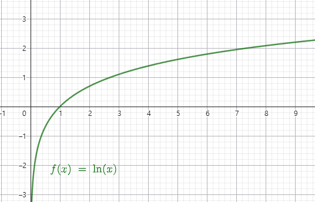
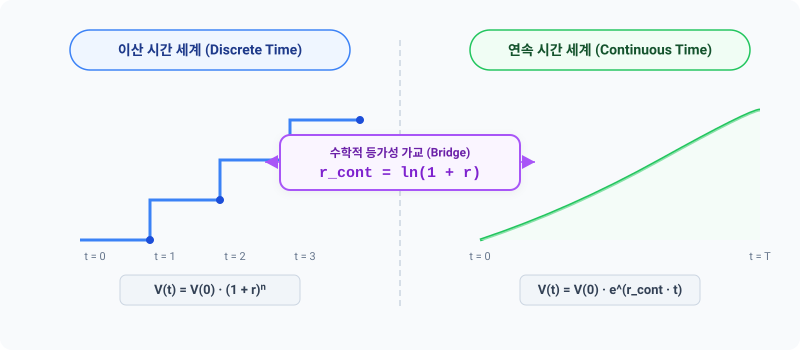

# 5.1 이산 시간 무위험이자율과 연속 시간 실효이자율 변환

## 1. 도입: 변수 조정의 첫 단추, 이자율의 연속화

우리가 앞서 깊이 있게 탐구했던 **이항 옵션 가격 결정 모형(Binomial Option Pricing Model)**은 시간이 일정한 간격을 두고 정해진 징검다리를 밟듯 흘러가는 **이산 시간(Discrete Time)**의 세계입니다. 하루, 한 달, 혹은 일 년과 같이 미리 약속된 노드 단위로 격자망을 짜고, 그 마디 위에서 기초자산의 가격 변화와 무위험 이자의 누적액을 계산합니다. 

하지만 실제 금융 시장과 금융공학의 정수로 불리는 **블랙-숄즈 모형(Black-Scholes Model)**이 상정하는 세계는 완전히 다릅니다. 주가와 시장 금리는 매초, 매밀리초, 심지어 인간의 인지를 뛰어넘는 극히 짧은 미소 시간(Infinitesimal Time Step, $dt$) 동안에도 쉬지 않고 요동치며 변하는 **연속 시간(Continuous Time)**의 흐름 속에 존재합니다. 

이항 모형이라는 '격자 무늬 벽돌'을 무한히 쪼개어 쌓음으로써 블랙-숄즈 모형이라는 '매끄러운 지수 곡선'에 정합적으로 도달(Limiting Cases Convergence)시키려면, 모형 내의 핵심 변수들을 연속 시간 환경에 맞추어 보정해야 합니다. 그리고 그 첫 번째 도약점이 바로 **이자율의 연속화(Interest Rate Continuous Compounding)**입니다. 

본 단원에서는 이산적인 시간 단계에서 축적된 무위험 수익 가치가 연속 시간 세계에서의 가치 축적 속도와 실질적으로 완벽하게 등가를 이루도록 보정하는 수학적 변환 기법과 그 밑바탕에 깔린 경제학적 필연성을 상세히 유도해 내겠습니다.

---

## 2. 본론: 이산 복리에서 연속 복리로의 물리적 도약

### 2.1 수치 시나리오로 체감하는 '분할 복리'의 한계와 패턴 발견
추상적인 수식을 먼저 전개하기 전에, 금융 시장의 주관적 계약 형태에 따라 이자 분할 정산 주기($n$)가 좁혀질 때, 자산 가치가 어떻게 변동하는지 구체적인 수치로 확인해 보겠습니다.

원금 $PV = 10,000$원을 연 이자율 $r = 10\%$($0.10$)로 투자한다고 가정하고, 1년 동안 이자를 몇 차례에 걸쳐 쪼개어 정산(분할 복리)받는지에 따라 1년 후 만기에 쥐게 될 원리금($FV$)을 단계별로 계산한 표입니다.

| 분할 횟수 ($n$) | 정산 주기 | 1년 뒤 만기 원리금 계산 공식 | 원리금 계산 결과 (원) | 이전 단계 대비 상승 폭 (원) |
| :--- | :--- | :--- | :--- | :--- |
| **$n = 1$** | 연 1회 (단리 성격) | $10,000 \times (1 + \frac{0.1}{1})^1$ | **$11,000.00$** | - |
| **$n = 2$** | 반기 1회 | $10,000 \times (1 + \frac{0.1}{2})^2$ | **$11,025.00$** | $+25.00$ |
| **$n = 4$** | 분기 1회 | $10,000 \times (1 + \frac{0.1}{4})^4$ | **$11,038.13$** | $+13.13$ |
| **$n = 12$** | 월 1회 | $10,000 \times (1 + \frac{0.1}{12})^{12}$ | **$11,047.13$** | $+9.00$ |
| **$n = 365$** | 일 1회 | $10,000 \times (1 + \frac{0.1}{365})^{365}$ | **$11,051.56$** | $+4.43$ |
| **$n = 8,760$** | 시간당 1회 | $10,000 \times (1 + \frac{0.1}{8,760})^{8,760}$ | **$11,051.70$** | $+0.14$ |
| **$n \to \infty$** | 매 순간 (연속 복리) | $10,000 \times e^{0.1}$ | **$11,051.71$** | $+0.01$ |

위 표에 제시된 수치 패턴을 직관적으로 추적해 보면 매우 중요한 규칙성을 파악할 수 있습니다. 동일한 연 명목 금리 $10\%$가 주어졌더라도 이자를 쪼개서 다시 투자하는 횟수 $n$이 증가함에 따라 만기 원리금 총액은 지속적으로 불어납니다. 그러나 가치 상승의 폭은 $n$이 올라갈수록 눈에 띄게 수축하며, $n$을 하루(365), 한 시간(8,760) 단위로 극한까지 잘게 쪼개더라도 원리금은 무한히 증가하지 않고 **약 $11,051.71$원**이라는 절대적인 천장(Limit)에 도달한다는 것을 알 수 있습니다.

---

### 2.2 연속 복리(Continuous Compounding)의 수학적 극한 유도
위 표에서 도출해 낸 이산 분할 횟수의 수렴 패턴을 대수학적 공식을 사용하여 일반화해 보겠습니다. 

연 이자율 $r$로 1년 동안 $n$번 나누어 정산 및 재투자하는 복리를 적용할 때, 현재 시점의 기초자산 $V(0)$가 1년 뒤 가지는 만기 가치 $V(1)$은 다음과 같습니다.

$$V(1) = V(0) \cdot \left(1 + \frac{r}{n}\right)^n$$

여기서 시간 단위를 연속적인 무한소 영역으로 변환하기 위해 정산 횟수 $n$을 무한대($n \to \infty$)로 발산시키는 극한 연산을 수행하겠습니다. 극한 과정의 완전성을 검증하기 위해 자연상수(Euler's Number) $e$의 정의를 소환합니다.

$$e \equiv \lim_{x \to \infty} \left(1 + \frac{1}{x}\right)^x \approx 2.718281828$$

우리가 계산하려 하는 이산 원리금 수식을 이 자연상수 정의식 형태로 조화롭게 변형하기 위하여, 다음과 같은 치환 장치를 도입합니다.

$$\frac{r}{n} = \frac{1}{x} \quad \implies \quad x = \frac{n}{r}$$

여기서 분할 횟수 $n \to \infty$로 발산할 때, 연 이자율 $r$이 양의 상수라면 치환된 변수 $x$ 역시 당연히 $\infty$로 수렴하게 됩니다. 이 치환 관계식을 원 가치 평가 수식의 극한 형태에 대입하여 전개합니다.

$$\lim_{n \to \infty} V(0)\left(1 + \frac{r}{n}\right)^n = V(0) \cdot \lim_{x \to \infty} \left(1 + \frac{1}{x}\right)^{x \cdot r} = V(0) \cdot \left[ \lim_{x \to \infty} \left(1 + \frac{1}{x}\right)^x \right]^r = V(0) \cdot e^r$$

기간이 1년이 아니라 임의의 연속적인 유예 기간 $t$년으로 확장되어 복리 증식이 누적 적용되는 조건이라면, 만기 시점의 자산 가치 $V(t)$는 아래와 같이 수치적 왜곡 없이 연속적인 지수 함수 형태로 결정됩니다.

$$\lim_{n \to \infty} V(0)\left(1 + \frac{r}{n}\right)^{n \cdot t} = V(0) \cdot e^{r \cdot t}$$

이에 따라, 매 순간 끊임없이 이자가 자라나는 연속 시간의 세계에서 미래 시점 $t$의 현금 흐름을 오늘 시점의 현재 가치로 복원할 때 사용하는 곱셈형 역수 인자인 **연속 할인요인(Continuous Discount Factor, $DF_{cont}$)**은 다음과 같이 아주 우아하고 깔끔한 음의 지수함수로 도출됩니다.

$$DF_{cont} = e^{-r_{cont} \cdot t}$$

---

### 2.3 이산과 연속의 수학적 등가성 증명: 두 번째 유도 경로
이산 격자형 이항 모형의 무위험 할인과 연속 시간 기반 블랙-숄즈 모형의 가치 이전 메커니즘이 하나의 완전한 경제계(Financial System) 안에서 논리적 파열음 없이 공존하려면, 두 모형이 평가해 낸 임의 자산의 현재 가치($PV$)가 완벽히 균일해야 합니다.

즉, 동일한 무위험 조건하에서 이산적 이자 축적률 $r$과 연속적 이자율 $r_{cont}$를 사용하여 각각 다른 할인 경로를 선택하더라도, 임의의 미래 만기 $t$ 시점에 대해 평가한 아래의 할인요인이 일대일로 일치해야 한다는 강력한 **등가 관계(Equivalence)**가 선제 성립해야만 합니다.

$$DF_{discrete} = DF_{cont}$$

$$(1+r)^{-t} = e^{-r_{cont} \cdot t}$$

이 등식은 특정한 $t$ 지점뿐만 아니라 모든 $t \ge 0$의 시간 선상에서 동일하게 항등적으로 성립해야 하므로, 양변에 누적된 시간 지수 승수인 $-t$를 소거하여 단일 연 단위 기준으로 압축할 수 있습니다.

$$1 + r = e^{r_{cont}}$$

이 최종 대수 등식의 양변에 자연로그($\ln$)를 취해 주면, 우리가 도출하고자 했던 **이산 시간 명목 무위험이자율 $r$을 연속 시간 실효 무위험이자율 $r_{cont}$로 보정하는 핵심 공식**이 유도됩니다.

$$r_{cont} = \ln(1+r)$$

#### 💡 인지적 공백을 채우는 제2의 유도 경로: 로그수익률의 동치성
이 수식의 구조를 아직 낯설어할 수 있는 독자들을 위해, 금융에서 가장 광범위하게 쓰이는 개념인 **로그수익률(Log Return)**을 대조하는 또 다른 증명 경로를 제공해 보겠습니다.

현재 1원의 현금을 가지고 있는 투자자가 1년 동안 투자를 단행하여 단순 수익률(Simple Return) $r$을 거두어 가치가 $1+r$원으로 불어났다고 해 봅시다.
이때 이산적으로 관찰된 수익 가치는 최종적으로 $1+r$배가 된 상태입니다. 

자산이 복리 성격으로 쉼 없이 굴러갔다고 상상했을 때, 매 순간 끊김 없이 연속 축적된 성장의 원천 속도를 연속 복리 수익률 $R_{log}$라고 정의하면 다음의 복리 성장 공식이 성립합니다.

$$1 \cdot e^{R_{log}} = 1+r$$

이 공식에 자연로그를 취하면 즉시 아래의 결과를 얻습니다.

$$R_{log} = \ln(1+r)$$

이로써 이산 이자율의 변환 공식 $r_{cont} = \ln(1+r)$은 단순한 극한 이론의 산물일 뿐 아니라, 금융공학 내에서 주식과 옵션을 평가할 때 필수적으로 상정하는 로그수익률의 정의와 완벽하게 일치하는 동치 관계를 지님을 알 수 있습니다.

---

### 2.4 도출된 변수 부호의 경제학적 한계 범위와 마찰적 붕괴 해석
위 공식 $r_{cont} = \ln(1+r)$이 수학적 정합성을 넘어 실물 경제의 생리적 경계와 부합하는지 증명하기 위해 변수가 운신할 수 있는 물리적 수치 한계를 규명하겠습니다.

1. **로그 함수의 경제적 진수 정의 구역 ($1 + r > 0$)**: 
   자연로그 $\ln(x)$가 실수 영역에서 유효한 정의 값을 얻기 위해서는 내부 진수 조건($x > 0$)이 철저히 준수되어야 합니다. 우리의 공식 내부 진수가 $1+r$이므로, 물리적인 현실 이산 금리 $r$은 무조건 $-100\%$를 상회하는 아래의 범위를 강제받게 됩니다.
   $$r > -1$$
   * **물리적·경제적 해설**: 이산 이자율 $r = -1$은 투자한 기초 자본금 전체가 만기에 완전히 전소되어 $0$원이 되어 버리는 극적인 붕괴 시나리오(손실률 $-100\%$)를 반영합니다. 자산 보유자에게 유한책임(Limited Liability) 권리가 부여되고 음수 가격이 허용되지 않는 한, 무위험 이자율이나 투자 수익률 $r$은 현실적으로 $-100\%$ 이하로 추락할 수 없습니다. 따라서 이 수학적 제한선은 경제학의 거래 메커니즘과 정확하게 정합합니다.

2. **최악의 파산 시나리오에서의 연속 극값 수렴 검증**:
   만일 자산의 청산 위기로 인해 이산 이자율 $r$이 파멸적인 상태인 $-1$($-100\%$)을 향해 점진적으로 내려앉는 경우를 고려해 보겠습니다.
   $$\lim_{r \to -1^+} r_{cont} = \lim_{r \to -1^+} \ln(1+r) = -\infty$$
   
   
   이 경우 연속 시간 실효이자율 $r_{cont}$는 음의 무한대($-\infty$)로 추락합니다. 이를 임의의 미래 자산 성장 공식인 $V(t) = V(0) \cdot e^{r_{cont} \cdot t}$에 연동시키면 다음과 같은 가혹한 결과가 도출됩니다.
   $$\lim_{r_{cont} \to -\infty} V(0) \cdot e^{r_{cont} \cdot t} = V(0) \cdot 0 = 0$$
   즉, 매 순간의 순간 가치 붕괴 속도가 무한대로 빨라짐으로써, 조금의 시간 지체도 용납하지 않고 미래 자산의 잔존 가치를 무자비하게 $0$으로 즉각 소멸시켜 버리는 완벽한 수치적 일치성을 보여줍니다.

---

### 2.5 오류 시나리오: 무보정 이자율 직대입이 부르는 차익거래 불균형
만일 실무자가 이러한 변환 과정을 무시한 채, 시장 고시 이산 무위험 금리 $r = 10\%$를 연속 시간 무위험 채권 평가 모형에 그대로 사용하게 되면 어떤 거래 참사가 발생하는지 표를 통해 대조해 보겠습니다.

* **기초 시나리오**: 무위험 단기 만기 1년짜리 제로쿠폰 본드(Zero-Coupon Bond), 만기 상환액 $F = 11,000$원, 시장의 실제 이산 할인 금리 $r = 10\%$.

| 평가 차원 | A. 올바른 보정 포트폴리오 ($r_{cont} = 9.531\%$) | B. 금리 직대입 오류 포트폴리오 ($r_{cont} = 10.00\%$) | 시장과의 괴리 및 왜곡 결과 |
| :--- | :--- | :--- | :--- |
| **적용 금리** | $\ln(1 + 0.1) \approx 9.5310\%$ | $10.0000\%$ (오류값 직대입) | **$0.469\%$**의 금리 오차 발생 |
| **현재 가치 평가 ($PV$)** | $11,000 \times e^{-0.09531 \times 1} = \mathbf{10,000.00}$원 | $11,000 \times e^{-0.10 \times 1} = \mathbf{9,953.21}$원 | 실제 시장 균형가 대비 **$-46.79$원** 저평가 |
| **거래 행태 피드백** | 시장 균형 가격과 정확히 일치하여 매매 압력이 중립적임. | 내재 가치가 저평가되어 있으므로, 헐값으로 채권을 강박적 매수하는 주문 쇄도. | 균형가 붕괴로 시장 참여자 간의 **무위험 차익거래(Arbitrage)** 표적 제공 |

위 대조표가 말해 주듯, 지극히 단순한 할인 하나에서도 올바른 이자율 연속 보정($r_{cont}$)을 누락하는 것은 금융 공학적 시스템 내에 치명적인 가치 평가 오류(Mispricing)를 야기하며, 이는 곧 대규모 손실이나 차익거래 세력의 공격 표적이 됨을 명확히 경고합니다.

---

## 3. 시각적 비유: '계단'에서 '부드러운 경사면'으로

이산 분할 복리에서 무한 연속 복리로 이어지는 물리적 수렴 현상은 우리가 자연이나 일상에서 마주하는 지형에 빗대어 설명하면 이해가 매우 직관적입니다.

- **이산 복리 (투박한 돌계단)**: 
  이 방식은 위로 놓인 돌계단을 터벅터벅 밟고 올라가는 여정입니다. 한 발 한 발 옮기며 계단참(정산 시점)을 단단히 디디는 그 구체적 찰나에만 우리의 높이(가치)가 수직으로 점프하며, 계단참과 계단참 사이의 가상의 공간(평지)을 기어갈 때는 고도 변화가 전혀 일어나지 않습니다.
  
- **연속 복리 (매끄러운 에스컬레이터 경사면)**: 
  이 방식은 경사도가 한결같이 부드럽고 매끄러운 오르막 통로 혹은 정교하게 깎인 산길을 따라 미끄러지듯 나아가는 과정입니다. 이 경로 상에서는 가치의 정산 시점이 따로 분리되어 존재하지 않으며, 단 한순간 발걸음을 멈추더라도 우리가 서 있는 위치만큼의 고도 변화가 부드럽고 세밀하게 누적되어 있습니다.

- **변화의 한계**: 
  우리가 계단의 디딤판 너비를 먼지 한 톨 크기만큼 좁히고, 그 단차를 현미경 수준으로 무수히 잘게 쪼개 설치한다면(분할 복리 횟수 $n \to \infty$), 계단의 거친 모양새는 결국 부드럽고 고운 곡선 경사면과 육안으로든 계측기로든 전혀 분간할 수 없을 정도로 완벽하게 수렴하여 일체화하게 될 것입니다.

  

---

## 4. 시각화 시뮬레이션

아래의 반응형 시뮬레이션을 통해, 복리 정산 횟수 $n$이 증가함에 따라 거칠게 도약하던 이산 가치 궤적(파란색)이 어떻게 매끄러운 연속 가치 지수 곡선(녹색)으로 아름답게 수렴하는지 직접 확인해 보세요. 슬라이더를 통해 이자율을 바꿀 때 실시간으로 등가 변환되는 이산율과 연속율의 상호 일관성 역시 검증할 수 있습니다.

<iframe src="contents/black_scholes_equation_01/sec_05/assets/diagrams/sub_05_01_visual1.html" width="100%" height="520px" frameborder="0" scrolling="yes"></iframe>

---

## 5. 요약 및 실무 팁

- **핵심 변환 공식**: 
  이산 시장 금리 $r$과 연속 모형 내 실효 이자율 $r_{cont}$는 서로 배타적인 개념이 아니며, 아래의 대칭적 관계식을 통하여 수학적으로 완전하게 상호 교환됩니다.
  $$r_{cont} = \ln(1+r) \quad \iff \quad r = e^{r_{cont}} - 1$$

- **학습적 의미**: 
  이 연속화 공식은 단절된 가치 성장을 나타내는 이산 이항 격자 모형(Tree)에서 부드러운 유체의 흐름으로 자산 경로를 묘사하는 연속 시간 블랙-숄즈 모형으로 넘어가는 핵심적인 **수학적 가교**이자 변수 정합 수단입니다.

- **실무 팁 (오류 예방)**: 
  실무 금융 시장(Bloomberg, 연합인포맥스 등)에서 고시하고 고정해 주는 모든 국채 금리, CP 금리, CD 금리 등은 본질적으로 연 단위 혹은 복수 회 정산 단위의 **이산형 연 이자율($r$)**입니다. 
  따라서 파이썬이나 C++ 기반의 옵션 시뮬레이터, 혹은 `SciPy` 및 `QuantLib`과 같은 전문 연속 시간 가치 평가 프라이싱 모델에 금리 변수를 탑재할 때는 절대로 화면에 뜬 명목 금리 $r$을 있는 그대로 전달해선 안 됩니다. 반드시 내부 전처리 단에서 `math.log(1 + r)` 처리를 수행하여 보정한 **연속 복리 이자율**을 전달해야만 수조 원 단위의 오차 리스크를 사전에 예방할 수 있습니다.
