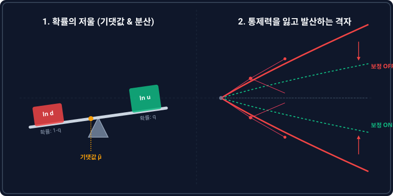

소제목: 5.2 실제 확률 측도(q-측도) 하 로그수익률의 기댓값과 분산식 유도
# 5.2 실제 확률 측도(q-측도) 하 로그수익률의 기댓값과 분산식 유도

## 1. 도입: 곱셈의 세계에서 덧셈의 세계로

우리는 앞서 5.1절에서 이산적인 무위험이자율을 연속 시간 세계의 매끄러운 언어인 '연속 복리 실효이자율($r_{cont} = \ln(1+r)$)'로 변환하는 방법을 탐구했습니다. 이자율이라는 결정론적 변수를 성공적으로 연속화했다면, 이제 금융공학의 진정한 주인공이자 확률론적 변동성을 지닌 **'주가(Asset Price)의 경로'**를 연속 시간의 언어로 번역할 차례입니다.

이항 옵션 가격 결정 모형(Binomial Option Pricing Model)에서 주가는 매 단계마다 위($u$) 또는 아래($d$)로 일정 비율만큼 **'곱해지며'** 나아갑니다. 예를 들어, 주가가 3단계 연속 상승했다면 최종 주가는 $S_0 \times u \times u \times u = S_0 \cdot u^3$이 됩니다. 하지만 격자망을 무한히 잘게 쪼개는 연속 시간 세계(Black-Scholes 세계관)로 진입할 때, 이러한 곱셈 방식의 경로 추적은 극도로 무겁고 복잡한 대수적 수렁에 빠지게 됩니다. 수만 번의 곱셈 연산과 이항계수들의 조합을 미적분학의 영역에서 직접 다루는 것은 불가능에 가깝기 때문입니다.

이 장벽을 무너뜨리기 위해 금융공학은 주가의 변화율을 **로그(Log) 공간**으로 인도합니다. 곱셈을 덧셈으로 결합하는 로그의 성질을 통해, 복잡하게 요동치는 주가 경로를 '독립적인 확률변수들의 단순 합산(Summation)'이라는 우아한 세계로 재정의할 수 있습니다. 

본 단원에서는 실제 시장 참여자들의 주관적 전망과 위험 선호가 온전히 반영된 **실제 확률 측도(Physical Probability Measure, 여기서는 $q$-측도)** 하에서 로그수익률의 기댓값과 분산을 수학적으로 엄밀하게 유도하겠습니다. 또한, 이 단순한 이산 통계량을 아무런 안전장치 없이 연속 세계로 끌고 갈 때 마주하게 되는 치명적인 '수학적 발산(Divergence)의 모순'을 파헤쳐 봄으로써, 다음 장에서 다룰 연속화 매개변수 설계의 강력한 경제학적·수학적 필연성을 확인해 보겠습니다.

---

## 2. 본론: 로그수익률의 정의와 통계적 성질 유도

### 2.1 익숙한 개념과의 연결: 일반 수익률과 로그수익률의 동치성
새로운 수학적 도구를 도입할 때 발생할 수 있는 인지적 공백을 메우기 위해, 우리가 이미 잘 알고 있는 기존 개념인 **일반 주식 수익률(Simple Return)**과 **로그수익률(Log Return)** 사이의 긴밀한 등가 관계를 먼저 입증해 보이겠습니다.

주가가 $S_{t-1}$에서 $S_t$로 한 단계 이동했을 때, 일상적으로 사용하는 일반 주식 수익률 $R_{simple}$은 다음과 같이 정의됩니다.

$$R_{simple} = \frac{S_t - S_{t-1}}{S_{t-1}} = \frac{S_t}{S_{t-1}} - 1 \quad \implies \quad 1 + R_{simple} = \frac{S_t}{S_{t-1}}$$

반면, 우리가 수학적 편의성을 위해 정의하고자 하는 **1기간 로그수익률 $R$**은 다음과 같이 정의됩니다.

$$R = \ln\left(\frac{S_t}{S_{t-1}}\right)$$

이 두 개념이 수학적으로 동치임을 보여주기 위해, 매끄러운 다항식 근사 도구인 **테일러 전개(Taylor Expansion)**를 소환합니다. 어떤 미소 변수 $x$가 $0$에 매우 가까울 때, 자연로그 함수 $\ln(1+x)$는 다음과 같이 전개됩니다.

$$\ln(1+x) = x - \frac{x^2}{2} + \frac{x^3}{3} - \cdots \approx x \quad (\text{단, } x \approx 0)$$

이 전개식을 로그수익률 정의에 대입하여 일반 주식 수익률과의 동치성을 유도해 내겠습니다.

$$R = \ln\left(\frac{S_t}{S_{t-1}}\right) = \ln\left(1 + R_{simple}\right)$$

여기서 이산 정산 주기($\Delta t$)가 극도로 짧아져서 주가의 단기 변동 폭이 미미해지면, 일반 주식 수익률 $R_{simple}$은 거의 $0$에 가깝게 수축하게 됩니다($R_{simple} \to 0$). 따라서 테일러 1차 근사에 의해 다음의 놀라운 등식 경로가 완성됩니다.

$$R = \ln\left(1 + R_{simple}\right) \approx R_{simple}$$

이로써 로그수익률은 전혀 새로운 가상의 개념이 아니라, **시간의 흐름을 무한소로 쪼갤 때 우리가 인지하는 실제 주식 수익률과 완벽하게 동일해지는 동치 관계의 수학적 표현**임을 알 수 있습니다.

---

### 2.2 구체적 수치 시나리오로 발견하는 '로그의 가산성(Additivity)'
이제 주가 공간의 복잡한 곱셈 흐름이 로그 공간의 단순 덧셈으로 수축하는 규칙성을 확인해 보겠습니다. 

초기 주가 $S_0 = 100$달러인 자산이 5단계($n=5$) 동안 **상승($u=1.10$) $\to$ 하락($d=0.90$) $\to$ 상승($u=1.10$) $\to$ 상승($u=1.10$) $\to$ 하락($d=0.90$)**의 경로를 밟았다고 가정합니다. 곱셈의 교환법칙에 의해 이 경로의 최종 주가 $S_5$는 다음과 같이 단순하게 계산됩니다.

$$S_5 = 100 \times 1.10 \times 0.90 \times 1.10 \times 1.10 \times 0.90 = 100 \times (1.10)^3 \times (0.90)^2 = 107.811\text{ 달러}$$

매 단계별 주가 흐름과 이에 대응하는 일반 수익률 배수, 그리고 로그수익률을 나열해 보겠습니다.

| 시점 ($t$) | 주가 이동 상태 ($S_t$) | 이산 수익률 배수 ($\frac{S_t}{S_{t-1}}$) | 1기간 로그수익률 ($R_t = \ln \frac{S_t}{S_{t-1}}$) | 로그 계산값 |
| :--- | :--- | :--- | :--- | :--- |
| **$t = 0$** | $S_0 = 100.000$ | - | - | - |
| **$t = 1$** | $S_1 = 100 \times 1.10 = 110.000$ | $u = 1.10$ | $R_1 = \ln(1.10)$ | $+0.09531$ |
| **$t = 2$** | $S_2 = 110 \times 0.90 = 99.000$ | $d = 0.90$ | $R_2 = \ln(0.90)$ | $-0.10536$ |
| **$t = 3$** | $S_3 = 99 \times 1.10 = 108.900$ | $u = 1.10$ | $R_3 = \ln(1.10)$ | $+0.09531$ |
| **$t = 4$** | $S_4 = 108.9 \times 1.10 = 119.790$ | $u = 1.10$ | $R_4 = \ln(1.10)$ | $+0.09531$ |
| **$t = 5$** | $S_5 = 119.79 \times 0.90 = 107.811$ | $d = 0.90$ | $R_5 = \ln(0.90)$ | $-0.10536$ |

이제 최초 시점 $S_0$ 대비 5단계가 지난 최종 시점 $S_5$의 **총 누적 로그수익률($R_{total}$)**을 직접 계산하여 두 방식의 패턴을 대조해 봅니다.

$$R_{total} = \ln\left(\frac{S_5}{S_0}\right) = \ln\left(\frac{107.811}{100.000}\right) = \ln(1.07811) \approx 0.07521$$

이번에는 표의 우측 열에 나열된 매 단계별 1기간 로그수익률 $R_1, R_2, R_3, R_4, R_5$를 모두 단순 합산해 보겠습니다.

$$\sum_{t=1}^{5} R_t = 0.09531 + (-0.10536) + 0.09531 + 0.09531 + (-0.10536) = 0.07521$$

놀랍게도 두 계산 결과는 소수점 끝자리까지 정확하게 일치합니다. 로그의 수학적 가산 성질($\ln(A \cdot B) = \ln A + \ln B$) 덕분에, 주가 공간에서의 기하학적 곱셈 경로가 로그 공간에서는 산술적인 **'단순 덧셈'**으로 완벽히 치환된 것입니다. 이 **로그 가산성(Log Additivity)**은 독립적인 확률변수들의 합을 다루는 통계적 중심극한정리와 확률미적분학을 자산 가격 결정 이론에 매끄럽게 접목할 수 있도록 돕는 핵심 열쇠가 됩니다.

---

### 2.3 q-측도 하 1기간 로그수익률의 기댓값($\hat{\mu}$) 유도
이제 확률적 체계를 정립하겠습니다. 실제 시장의 현실적인 상승 확률을 반영하는 실제 확률 측도($q$-측도) 하에서, 주가가 1기간 동안 상승할 확률을 $q$, 하락할 확률을 $1-q$라고 선언합니다. 

이에 따라 1기간 로그수익률 $R$이 가질 수 있는 상호 배타적인 두 가지 상태와 확률 구조(확률계)는 다음과 같이 완벽하게 닫힌 계(System)를 구성합니다.

| 시나리오 (상태) | 주가 변화 배수 | 1기간 로그수익률 ($R$) | 실제 발생 확률 ($q$-측도) |
| :--- | :--- | :--- | :--- |
| **주가 상승 ($Up$)** | $u$ | $\ln u$ | $q$ |
| **주가 하락 ($Down$)** | $d$ | $\ln d$ | $1-q$ |

확률의 총합은 당연히 $q + (1-q) = 1$로 보존됩니다. 기댓값의 정의(각 상태의 실현 가치와 확률의 곱에 대한 합산)에 따라, 1기간 로그수익률의 기댓값 $\hat{\mu}$를 다음과 같이 명쾌하게 유도할 수 있습니다.

$$
\begin{aligned}
\hat{\mu} = E[R] &= q \cdot \ln u + (1-q) \cdot \ln d \\
&= q \ln(u) + \ln(d) - q \ln(d)$$ \\
&= q(\ln u - \ln d) + \ln d \\
&= q \ln\left(\frac{u}{d}\right) + \ln d
\end{aligned}
$$

---

### 2.4 q-측도 하 1기간 로그수익률의 분산($\hat{\sigma}^2$) 유도
확률분포의 중심축인 기댓값을 도출했으므로, 이번에는 분포의 흩어짐과 불확실성의 강도를 대변하는 **분산 $\hat{\sigma}^2$**을 대수학적으로 정밀하게 유도해 보겠습니다. 확률이론의 표준 정리인 $\text{Var}(R) = E[R^2] - (E[R])^2$ 공식을 사용합니다.

첫 번째 항인 **제곱의 기댓값 $E[R^2]$**은 다음과 같습니다.

$$E[R^2] = q \cdot (\ln u)^2 + (1-q) \cdot (\ln d)^2$$

두 번째 항인 **기댓값의 제곱 $(E[R])^2$**을 대수 전개하여 정리합니다.

$$(E[R])^2 = \left[ q \ln u + (1-q) \ln d \right]^2 = q^2 (\ln u)^2 + 2q(1-q) \ln u \ln d + (1-q)^2 (\ln d)^2$$

이제 분산 정의식($E[R^2] - (E[R])^2$)에 두 전개식을 대입하여 공통의 수학적 패턴을 끄집어냅니다.

$$\hat{\sigma}^2 = \left[ q(\ln u)^2 + (1-q)(\ln d)^2 \right] - \left[ q^2 (\ln u)^2 + 2q(1-q) \ln u \ln d + (1-q)^2 (\ln d)^2 \right]$$

이 식을 $(\ln u)^2$, $(\ln d)^2$, $\ln u \ln d$ 각각의 동류항 계수별로 묶어서 분해해 보겠습니다.

- **$(\ln u)^2$의 계수**: 
  $$q - q^2 = q(1-q)$$
- **$(\ln d)^2$의 계수**: 
  $$(1-q) - (1-q)^2 = (1-q)\{1 - (1-q)\} = (1-q) \cdot q = q(1-q)$$
- **$\ln u \ln d$의 계수**: 
  $$-2q(1-q)$$

모든 대수항의 전면에 **$q(1-q)$**라는 대칭적이고 상호보완적인 확률 곱 계수가 균일하게 자리 잡고 있는 패턴이 정밀하게 증명됩니다. 이 공통인수를 식 바깥으로 묶어내어 압축합니다.

$$\hat{\sigma}^2 = q(1-q) \left[ (\ln u)^2 - 2 \ln u \ln d + (\ln d)^2 \right]$$

괄호 내부의 식은 고등학교 수학에서 익숙하게 다루었던 완전제곱식 형상($A^2 - 2AB + B^2 = (A-B)^2$)을 정확히 취하고 있습니다. 따라서 이 식은 다음과 같이 극도로 간결하고 아름다운 최종 유도식으로 정합됩니다.

$$\hat{\sigma}^2 = q(1-q) (\ln u - \ln d)^2 = q(1-q) \left[ \ln\left(\frac{u}{d}\right) \right]^2$$

#### 💡 분산 공식이 품고 있는 물리적 한계 범위와 확률계의 완결성
우리가 도출한 분산 공식 $\hat{\sigma}^2 = q(1-q) [\ln(u/d)]^2$은 단순한 계산 결과가 아니라, 확률계가 지닌 완결성과 물리적 임계 범위를 거울처럼 투영하고 있습니다.

$$\hat{\sigma}^2 = \underbrace{q(1-q)}_{\text{오르고 내리는 사건의 '불확실성'}} \times \underbrace{\left[\ln\left(\frac{u}{d}\right)\right]^2}_{\text{사건이 터졌을 때 '상하 변동 폭의 제곱'}}$$

0. **두번째 항의 의미**:
   로그의 분수는 빼기이니까 상승, 하락의 차이가 클수록 분산이 커집니다. 아울러 분산은 제곱의 세상(음수,양수 상쇄를 막고, 극단치에 더 큰 가중치를 주는 효과)이니까 제곱이 붙습니다.
1. **상보적 확률곱 $q(1-q)$의 수학적 한계**:
   실제 상승 확률 $q$는 확률의 공리에 의해 무조건 $[0, 1]$ 범위에 존재해야 합니다. 이때 $q(1-q)$라는 대칭 함수는 $q = 0.5$(반반의 확률)일 때 최대 극값인 $0.25$를 가집니다. 즉, 시장이 위로 갈지 아래로 갈지 전혀 예측할 수 없는 완벽한 혼돈 상태일 때 불확실성(분산)이 이론적으로 극대화된다는 사실을 명징하게 증명합니다.
2. **경계 조건에서의 변동성 소멸 증명**:
   만약 확실성의 세계가 도래하여 주가가 무조건 상승하거나($q = 1 \implies q(1-q) = 0$) 무조건 하락하는($q = 0 \implies q(1-q) = 0$) 극단적 물리 경계에 도달하면, 분산은 정확히 $0$으로 소멸합니다. 이는 우리가 설계한 이산 확률 공식이 물리학적으로 한 치의 빈틈도 없는 완결성을 유지하고 있음을 입증하는 강력한 지표입니다.

---

### 2.5 다기간($n$ 단계) 누적 로그수익률 통계량으로의 확장
매 단계의 주가 변화가 과거의 흐름에 영향을 받지 않고 서로 독립적이며 동일한 이산 확률분포(i.i.d.)를 따른다고 선언하면, $n$단계 동안 누적된 총 로그수익률 $R_{total} = \sum_{i=1}^n R_i$의 기댓값과 분산은 로그의 가산 성질에 힘입어 1기간 통계량을 단계 수 $n$만큼 단순 곱해 준 형태로 완벽히 확장됩니다.

$$\hat{\mu}_n = E[R_{total}] = n \cdot \hat{\mu} = n \cdot \left[ q \ln u + (1-q) \ln d \right]$$

$$\hat{\sigma}_n^2 = \text{Var}(R_{total}) = n \cdot \hat{\sigma}^2 = n \cdot \left\{ q(1-q) \left[ \ln\left(\frac{u}{d}\right) \right]^2 \right\}$$

---

## 3. 치명적인 문제 제기: 무한대 발산(Divergence)의 모순

이산 시간의 이항 격자망을 매끄러운 연속 시간의 세계(Black-Scholes)로 가져가기 위해, 우리는 필연적으로 총 만기 시간 $T$(예: 1년)를 무수히 쪼개어 단계 수 $n$을 무한대로 발산($n \to \infty$, 즉 미소 시간 간격 $\Delta t = T/n \to 0$)시켜야 합니다.

하지만 여기서 엄청난 모순과 직면하게 됩니다. 만약 우리가 이항 트리의 매개변수인 상승폭 $u$, 하락폭 $d$, 상승확률 $q$를 **시간 변화와 무관한 고정된 상수**로 내버려 둔 채, 단계 수 $n$만 우직하게 무한대로 늘리면 누적 분산은 어떻게 될까요?

총 분산 공식의 전면에 곱해진 시행 횟수 $n$이 지배적인 영향력을 행사하기 시작합니다.

$$\lim_{n \to \infty} \hat{\sigma}_n^2 = \lim_{n \to \infty} n \cdot \left\{ q(1-q) \left[ \ln\left(\frac{u}{d}\right) \right]^2 \right\} = \infty$$

상승폭과 하락폭, 확률이 고정된 상태에서 시간 단계만 촘촘하게 쪼개버리면, 1년 뒤 주가가 도달할 수 있는 범위의 불확실성(누적 분산)이 제어되지 못하고 우주 끝까지 무한대($\infty$)로 대폭발해 버리는 수학적 파국이 일어납니다. 

분산이 무한대라는 것은 눈 깜짝할 미세한 찰나의 순간에 주가가 $0$으로 파산하거나 무한대로 치솟을 수 있음을 의미하므로, 실물 경제의 합리적 주가 흐름을 묘사하는 모형으로서의 가치를 완전히 상실하게 됩니다.

우리는 이 모순으로부터 다음과 같은 엄중한 **금융공학적 필연성**을 선포해야 합니다.

> **"이산 이항 모형을 매끄러운 연속 시간 세계로 정합적으로 귀착시키기 위해서는, 쪼개지는 단계 수 $n$이 늘어남에 따라(즉, $\Delta t$가 작아짐에 따라) 격자의 미세 변수들인 $u, d, q$ 역시 미소 시간 $\Delta t$의 함수로서 함께 조화롭게 수축되도록 통제 장치를 설계해야만 한다."**

---

## 4. 시각적 비유: '확률의 저울'과 발산하는 격자

이 통계적 개념과 연속화의 장벽은 일상 속의 직관적인 도구들을 통해 완벽하게 이해할 수 있습니다.

- **기댓값 ($\hat{\mu}$ - 확률의 저울)**: 
  기댓값은 시소 모양의 저울 양 끝에 $\ln u$(상승 가치)와 $\ln d$(하락 가치)라는 무게추를 얹고, $q$와 $1-q$라는 실제 확률을 조절하여 저울의 무게 중심을 찾아가는 정적인 평형 상태와 같습니다.
- **분산 ($\hat{\sigma}^2$ - 저울의 흔들림 폭)**: 
  분산은 저울의 두 무게추 사이의 물리적 거리 $\ln(u/d)$가 멀어질수록, 그리고 한쪽으로 치우치지 않는 팽팽한 $50:50$($q=0.5$) 구도일 때 가장 격렬하게 요동치는 역동적인 움직임입니다.
- **발산의 모순 (사방으로 찢어지는 격자 그물)**: 
  그물의 가로 매듭 크기($u, d$)를 그대로 둔 채, 그물망의 촘촘함(단계 수 $n$)만 억지로 덧대어 확장하는 것은 그물 전체를 사방으로 잡아당겨 무자비하게 찢어버리는 것과 같습니다. 시간의 조절 나사($\Delta t$)에 연동하여 매듭의 크기 자체를 세밀하게 축소하지 않는 한, 우리의 격자는 현실의 경계를 이탈해 파멸적으로 발산하게 됩니다.

---

## 5. 시각화 시뮬레이션

아래의 반응형 시뮬레이션을 통해, 단계 수 $n$이 무한히 증가함에 따라 매개변수의 시간 보정 여부가 전체 주가 확률 분포에 어떤 극적인 차이를 만들어내는지 직접 통제하고 관찰해 보십시오.

'매개변수 시간 보정' 장치를 꺼둔 상태에서 단계를 늘릴 때 분포가 사방으로 찢어지듯 폭발하는 모순과, 보정 장치를 켰을 때 비로소 총 변동성이 우아하게 통제되며 부드러운 로그정규분포 곡선으로 안착하는 수학적 정합성을 실시간으로 대조할 수 있습니다.

<iframe src="contents/black_scholes_equation_01/sec_05/assets/diagrams/sub_05_02_visual1.html" width="100%" height="520px" frameborder="0" scrolling="yes"></iframe>

---

## 6. 요약 및 다음 단계로의 연결

- **핵심 유도 공식 정리**: 
  실제 확률 $q$-측도 하에서 1기간 및 $n$기간 누적 로그수익률의 기댓값과 분산식은 다음과 같은 체계적인 완결성을 가집니다.
  $$\hat{\mu}_n = n \cdot \left[ q \ln u + (1-q) \ln d \right]$$
  $$\hat{\sigma}_n^2 = n \cdot q(1-q) \left[ \ln\left(\frac{u}{d}\right) \right]^2$$

- **개념적 도약**: 
  자산 가격의 흐름에 자연로그를 취해 줌으로써 곱셈의 확률적 지옥을 단순 산술 합산이 가능한 덧셈 공간으로 변환하는 데 성공했고, 이를 바탕으로 다기간 통계적 구조를 완벽하게 정립해 냈습니다.

- **연속 시간으로의 관문**: 
  이산 매개변수를 상수로 고정하는 단순 대입은 무한대 분산 발산이라는 모순을 낳습니다. 이 모순을 극복하고, 무한히 쪼개지는 단계 속에서도 총 변동성을 우리가 관측할 수 있는 실제 시장의 변동성($\sigma$)으로 완벽하게 수렴시키기 위해, 다음 5.3절에서는 격자의 상승/하락 폭을 미소 시간 $\Delta t$의 정교한 함수로 정의하는 **Cox-Ross-Rubinstein(CRR) 매개변수 설정법**을 본격적으로 해부해 가겠습니다.
