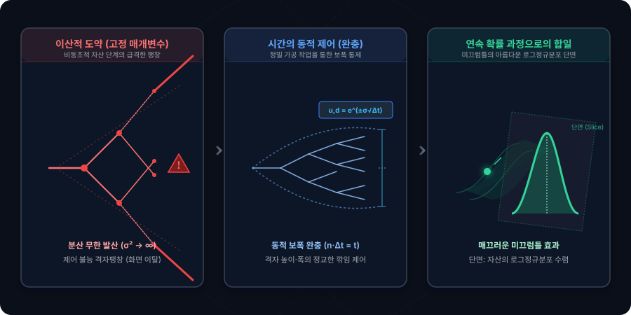

# 5.3 시간 매개변수 도입을 통한 q-측도 발산 제어 및 기간 세분화

## 1. 도입: 발산을 진압하는 구원투수, 시간 축($\Delta t$)의 등장

우리는 지난 5.2절에서 다기간 누적 로그수익률의 통계량을 유도하며 금융공학 역사상 가장 거대한 장벽 중 하나를 마주했습니다. 자산의 움직임을 연속적인 흐름으로 묘사하기 위해 이항 트리의 단계 수 $n$을 무한히 쪼갤 때, 기존의 고정된 이산 매개변수($u, d, q$) 체계 하에서는 총 분산($\hat{\sigma}_n^2$)이 무한대($\infty$)로 사방으로 발산해 버리는 치명적인 모순이 발생했습니다. 변동성이 무한대로 뻗어 나간다는 것은 자산의 가격 분포가 물리적 통제를 완전히 상실하여 현실의 금융 시장을 모사하는 데 아무런 쓸모가 없는 무용지물이 됨을 의미합니다.

이 파괴적인 발산 문제를 통제하고 통계량을 현실의 안정적인 상수로 길들이기 위해, 금융공학은 전체 만기 시간 $t$를 $n$개로 등분한 **미소 시간 간격(Infinitesimal Time Interval) $\Delta t = t/n$**을 구원투수로 등판시킵니다. 

이번 절에서는 촘촘해지는 격자의 폭에 맞추어 주가의 상승·하락 보폭($u, d$)과 실제 확률($q$)을 미소 시간 $\Delta t$의 함수로 유기적으로 연동하는 원리를 알아봅니다. 나아가 수학적 스케일링을 통해 $n \to \infty$라는 극한의 세분화 속에서도 자산의 총 분산이 어떻게 붕괴하지 않고 현실의 연율화 변동성($\sigma^2 t$)으로 완벽하게 안착하는지, 그 수학적 상쇄의 마법을 꼼꼼하게 추적해 보겠습니다.

---

## 2. 본론: 시간 스케일링을 통한 매개변수 재정의와 안정화

### 2.1 시간 변수($\Delta t$)와 연동된 매개변수 설정
발산의 모순을 진압하기 위해서는, 시간의 그물이 조밀해질수록($n$이 커질수록) 1기간 동안 주가가 움직일 수 있는 보폭인 $u$(상승 배수)와 $d$(하락 배수) 역시 서서히 $1$을 향해 좁혀져야 합니다. 금융공학자들은 이를 실현하기 위해 시간 $\Delta t$에 연동된 다음과 같은 동적 매개변수를 설계했습니다.

$$u = e^{\sigma \sqrt{\Delta t}}, \quad d = e^{-\sigma \sqrt{\Delta t}}$$

여기서 $\sigma$는 우리가 익히 알고 있는 자산의 실제 연율화 변동성(Standard Deviation of Log Returns)이며, $e$는 연속 복리의 기초가 되는 자연상수입니다.

#### 💡 수학적 깊이 더하기: 왜 하필 $\sqrt{\Delta t}$의 지수 형태인가?
수학에 익숙하지 않은 독자라면 "왜 그냥 $\Delta t$가 아니라 제곱근인 $\sqrt{\Delta t}$를 지수에 얹었는가?"라는 의문이 생길 수 있습니다. 이는 확률론에서 말하는 **'무작위 걸음(Random Walk)'**의 본질적인 성질 때문입니다. 

자산의 변화(수익률)는 시간에 비례하여 축적되지만, 그 변화의 불확실성(표준편차)은 시간의 제곱근에 비례하여 늘어납니다. 만약 보폭을 선형 시간인 $\Delta t$에 맞추어 $u = e^{\sigma \Delta t}$로 설정한다면, 단기를 쪼갤 때 보폭이 너무 빠르게 작아져서 연속 세계로 진입했을 때 자산의 움직임이 완전히 굳어버리는(변동성이 0이 되어 버리는) 반대 방향의 참사가 일어납니다. 따라서 분산이 시간 $t$에 선형적으로 정렬되도록 만들기 위해, 보폭의 지수부에 제곱근 시간 스케일인 $\sqrt{\Delta t}$를 주입하는 정교한 완충 장치를 둔 것입니다.

---

### 2.2 구체적 수치 시나리오: $n$의 변화에 따른 보폭의 자동 조절 패턴
이 수학적 설계가 실제로 발산을 어떻게 방어하는지 눈으로 직접 확인해 보겠습니다. 5.2절의 파라미터를 그대로 계승하여, 연율화 변동성 $\sigma = 0.20$(20%), 전체 기간 $t = 1$(1년)로 고정된 동일한 시나리오에서 단계를 $n=4$에서 $n=100$으로 잘게 쪼갤 때 매개변수들이 취하는 구체적인 수치 패턴을 대조해 보겠습니다.

| 설정 단계 수 ($n$) | 미소 시간 폭 ($\Delta t = \frac{1}{n}$) | 시간 제곱근 ($\sqrt{\Delta t}$) | 상승 보폭 ($u = e^{0.2\sqrt{\Delta t}}$) | 하락 보폭 ($d = e^{-0.2\sqrt{\Delta t}}$) | 1기간 보폭 간격 ($\ln(u/d) = 2\sigma\sqrt{\Delta t}$) |
| :--- | :--- | :--- | :--- | :--- | :--- |
| **$n = 4$** | $0.25$ | $0.50$ | $u = e^{0.10} \approx 1.1052$ | $d = e^{-0.10} \approx 0.9048$ | $0.2000$ |
| **$n = 100$** | $0.01$ | $0.10$ | $u = e^{0.02} \approx 1.0202$ | $d = e^{-0.02} \approx 0.9798$ | $0.0400$ |

위 표에서 극적인 패턴의 변화를 관찰할 수 있습니다. 
- $n=4$일 때는 분기별로 주가가 위로 약 $10.5\%$ 튀거나 아래로 약 $9.5\%$ 급락하는 거친 격자 구조를 보여줍니다.
- 반면 단계를 $n=100$으로 세분화하자, 1기간의 보폭 간격 $\ln(u/d)$이 기존 $0.20$에서 $0.04$로 자동적으로 축소됩니다. 

이 축소 패턴을 5.2절의 1기간 분산 공식에 대입하면, 개별 격자가 품고 있는 미소 변동성은 지수적으로 작아져서 총합을 계산할 때 무한대로 발산하지 못하도록 사전에 완벽히 진압됩니다.

---

### 2.3 발산 제어의 수학적 증명 (상쇄의 마법)
이제 직관을 넘어, 5.2절에서 우리가 직접 유도했던 실제 $q$-측도 하에서의 총 분산 공식을 다시 소환하여 수학적으로 엄밀하게 증명해 보겠습니다.

지난 5.2절에서 유도한 $n$단계 누적 로그수익률의 총 분산 공식은 다음과 같았습니다.

$$\hat{\sigma}_n^2 = n \cdot q(1-q) \left[ \ln\left(\frac{u}{d}\right) \right]^2$$

여기에 우리가 시간 매개변수로 새롭게 정의한 $u = e^{\sigma \sqrt{\Delta t}}$와 $d = e^{-\sigma \sqrt{\Delta t}}$를 대입합니다. 먼저 로그 안의 비율을 단순화해 봅니다.

$$\ln\left(\frac{u}{d}\right) = \ln\left(\frac{e^{\sigma \sqrt{\Delta t}}}{e^{-\sigma \sqrt{\Delta t}}}\right) = \ln\left(e^{2\sigma \sqrt{\Delta t}}\right) = 2\sigma \sqrt{\Delta t}$$

이를 총 분산 공식에 고스란히 대입하여 식을 전개합니다.

$$\hat{\sigma}_n^2 = n \cdot q(1-q) \cdot \left(2\sigma \sqrt{\Delta t}\right)^2$$

$$\hat{\sigma}_n^2 = n \cdot q(1-q) \cdot 4\sigma^2 \Delta t$$

이 식의 계수들을 보기 좋게 재배치하면 다음과 같습니다.

$$\hat{\sigma}_n^2 = 4\sigma^2 q(1-q) \cdot \left( n \cdot \Delta t \right)$$

여기서 전율이 돋는 수학적 상쇄의 순간이 찾아옵니다. 우리는 미소 시간 간격을 $\Delta t = t/n$으로 정의했습니다. 이 정의식을 분모와 분자로 치환하여 곱해보면 다음과 같은 항등식이 성립합니다.

$$n \cdot \Delta t = n \cdot \left(\frac{t}{n}\right) = t$$

수식 전면에 버티고 서서 전체 변동성을 무한대로 폭발시키려 하던 시행 횟수 $n$이, 쪼개진 시간의 조각 $\Delta t$와 만나 곱해지며 **전체 만기 시간 $t$**라는 깔끔한 상수로 상쇄되어 녹아내립니다! 이 상쇄 메커니즘을 적용한 총 분산식은 다음과 같이 고도로 정돈됩니다.

$$\hat{\sigma}_n^2 = 4\sigma^2 q(1-q) t$$

---

### 2.4 연속 시간 수렴성 확보 ($\Delta t \to 0$의 극한)
이제 마지막 단계로 단계를 무한히 쪼개는 극한 상황($n \to \infty$, 즉 $\Delta t \to 0$)으로 나아갑니다.

시간이 무한소의 세계로 진입할 때, 자산이 위로 갈지 아래로 갈지에 대한 실제 확률 $q$는 극단적인 쏠림 없이 반반의 균형 상태로 수렴하게 됩니다. 현실적인 표동(Drift) 기댓값 $\mu$를 반영하여 실제 1기간 로그수익률의 기댓값을 다음과 같이 시간 스케일과 매칭해 보겠습니다.

$$E[R] = q \ln u + (1-q) \ln d = \mu \Delta t$$

위 식에 $\ln u = \sigma\sqrt{\Delta t}$와 $\ln d = -\sigma\sqrt{\Delta t}$를 직접 대입해 봅니다.

$$q \left( \sigma\sqrt{\Delta t} \right) + (1-q) \left( -\sigma\sqrt{\Delta t} \right) = \mu \Delta t$$

이를 $q$에 대해 대수적으로 정리하면 다음과 같은 엄밀한 관계식이 도출됩니다.

$$(2q - 1)\sigma\sqrt{\Delta t} = \mu \Delta t$$

$$2q - 1 = \frac{\mu}{\sigma}\sqrt{\Delta t} \quad \implies \quad q = \frac{1}{2} + \frac{\mu}{2\sigma}\sqrt{\Delta t}$$

이 유도식은 대단히 중요한 시사점을 가집니다. 실제 확률 $q$가 완벽한 확률계 $[0, 1]$ 범위 안에 존속하기 위해서는 충분히 작은 $\Delta t$에 대해 다음 물리적 한계 범위를 완벽히 충족함을 보여줍니다. (q가 0이 되려면 우측 두번째 항이 $-\frac{1}{2}$일 때임, 여기에 2를 곱해 정리하면 아래 부등식의 왼쪽 부분이 나온다)

$$-1 \le \frac{\mu}{\sigma}\sqrt{\Delta t} \le 1$$

이제 단계를 무한히 쪼개는 극한($\Delta t \to 0$)을 적용해 봅니다. 두 번째 항의 $\sqrt{\Delta t}$가 정확히 $0$으로 수축하므로, 상승 확률 $q$는 완벽한 동전 던지기의 평형점으로 수렴하게 됩니다. (

$$\lim_{\Delta t \to 0} q = \lim_{\Delta t \to 0} \frac{1}{2} + \frac{\mu}{2\sigma}\sqrt{\Delta t} = \frac{1}{2}$$
(의미) 시간이 무한소의 세계로 진입할 때, 자산이 위로 갈지 아래로 갈지에 대한 실제 확률 $q$는 극단적인 쏠림 없이 반반의 균형 상태로 수렴

이를 위에서 유도한 총 분산식 $\hat{\sigma}_n^2 = 4\sigma^2 q(1-q) t$에 최종 대입합니다.

$$\lim_{n \to \infty} \hat{\sigma}_n^2 = 4\sigma^2 \left(\frac{1}{2}\right)\left(1 - \frac{1}{2}\right) t = 4\sigma^2 \left(\frac{1}{4}\right) t = \sigma^2 t$$

그 어떤 무한대 기호도 남기지 않고, 누적 로그수익률의 총 분산은 우리가 현실 세계에서 관측하는 **연율화 변동성 분산인 $\sigma^2 t$로 우아하게 수렴**합니다.

---

### 2.5 기하급수적 기간 세분화와 정규분포로의 수렴 (중심극한정리)
매 단계의 자산 움직임이 유한하고 안정적인 분산($\sigma^2 \Delta t$)을 가지며 시간 축을 따라 켜켜이 누적될 때, 통계학의 가장 위대한 법칙인 **'중심극한정리(Central Limit Theorem)'**가 깨어납니다.

중심극한정리에 따르면, 임의의 독립적인 확률변수들의 합은 시행 횟수가 무한히 커질수록 개별 변수의 원래 분포 형태와 상관없이 무조건 **정규분포(Normal Distribution)**로 수렴합니다.

$$\sum_{i=1}^{n} R_i \xrightarrow{d} \mathcal{N}\left( E[R_{total}], \text{Var}(R_{total}) \right) \quad (\text{단, } n \to \infty)$$

우리가 주가 공간에서 곱해지던 거친 도약을 로그 공간의 덧셈 구조($R_{total} = \sum R_i$)로 미리 치환해 놓았기 때문에, 이 중심극한정리를 자산 수익률에 아무런 제약 없이 매끄럽게 적용할 수 있게 됩니다. 

처음에는 상승($u$)과 하락($d$)이라는 거칠고 이산적인 '동전 던지기' 형태로만 움직이던 주가의 도약이, 시간의 그물을 무한히 촘촘하게 쪼개어 내려가자 비로소 물 흐르듯 유려하게 움직이는 **정규분포의 곡선과 연속 확률 과정(Continuous Stochastic Process)**이라는 자연의 완전한 대칭적 질서 속으로 안착하는 것입니다.

<iframe src="contents/black_scholes_equation_01/sec_05/assets/diagrams/sub_05_03_visual1.html" width="100%" height="480px" frameborder="0" scrolling="no"></iframe>

---

## 3. 시각적 비유: 거친 격자 계단에서 흐르는 미끄럼틀로

- **이산적 도약 (고정된 매개변수 단계)**:
  시간 조절 없이 단계만 늘리는 것은 자산의 다리를 기하급수적으로 늘려 사방으로 찢어버리는 거친 채찍질과 같습니다. 격자의 폭이 제어되지 않으면 화면 바깥으로 주가가 튀어나갑니다.
- **시간 매개변수의 동적 제어 ($\Delta t$의 완충 작용)**:
  $\Delta t = t/n$을 도입하여 보폭을 $e^{\sigma\sqrt{\Delta t}}$로 묶어두는 것은, 단계를 쪼갤 때마다 격자의 높이와 폭을 정교하게 깎아내는 정밀 가공 작업과 같습니다. 
- **연속 확률 과정으로의 합일 (미끄럼틀)**:
  격자의 단층이 원자 수준으로 작아지면, 뾰족하고 거칠던 계단은 더 이상 발에 걸리지 않는 매끄러운 '미끄럼틀'이 됩니다. 이 미끄럼틀의 단면을 잘라 보았을 때 나타나는 아름다운 종 모양의 단면이 바로 자산의 '로그정규분포'입니다.

---

## 4. 요약 및 다음 단계로의 연결

- **시간의 파편화와 상쇄**: 
  시간 $t$를 $n$단계로 잘게 썬 $\Delta t = t/n$를 도입함으로써, $n \cdot \Delta t = t$라는 강력한 대수적 상쇄가 일어나 무한 분산으로의 폭발을 완벽하게 차단했습니다.
- **동적 보폭 설계**: 
  자산의 변동성이 시간의 제곱근에 비례해 축적되는 자연의 법칙을 반영하여, $u = e^{\sigma \sqrt{\Delta t}}$와 $d = e^{-\sigma \sqrt{\Delta t}}$라는 완벽한 스케일링 변수를 장착해 안정성을 확보했습니다.
- **연속 세계로의 다리**: 
  이산적인 이항 모델의 무한 세분화 극한은 중심극한정리에 의해 정규분포 구조($\sigma^2 t$)로 부드럽게 수렴하며, 이는 훗날 금융공학의 왕관이라 불리는 블랙-숄즈(Black-Scholes) 모형을 유도하는 가장 완벽하고 탄탄한 징검다리가 됩니다.

우리는 이로써 실제 확률 측도($q$-측도) 하에서 시간이 세분화될 때 나타나는 주가의 기하급수적 변화와 통제 원리를 모두 정복했습니다. 다음 장에서는 이 완벽한 시간 세분화 설계도를 바탕으로, 실제 시장의 무위험 자산과 기초 자산의 균형 가격을 역동적으로 조율하여 파생상품의 가치를 완벽하게 복제해 내는 **Cox-Ross-Rubinstein (CRR) 매개변수 설정법의 완전한 증명** 단계로 한 걸음 더 깊이 들어가 보겠습니다.

---
