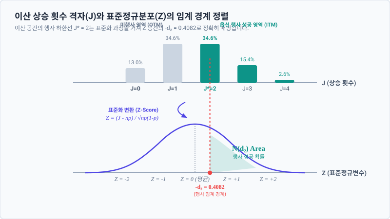

# 5.5 이산 상승 횟수의 연속 표준화 변수 변환 및 $d_1, d_2$의 정의

## 1. 도입: 이산적 카운팅에서 연속적 확률 면적으로의 도약

앞선 5.4절에서 우리는 시간의 격자를 무한히 쪼개는 극한 상황($n \to \infty$)에서 이항분포가 지닌 태생적인 비대칭성(왜도)이 완전히 소멸하고 완벽한 대칭성을 지닌 정규분포로 수렴하는 '대칭성 회복의 원리'를 수학적으로 증명하였습니다. 이로써 우리는 거친 격자 구조 뒤에 숨겨진 연속 확률 세계의 고요한 질서를 엿볼 수 있게 되었습니다. 

하지만 단순히 대칭성을 획득했다는 사실만으로는 현대 금융공학의 기념비적 정상인 **블랙-숄즈(Black-Scholes) 공식**에 온전히 도달할 수 없습니다. 이산적인 이항 모델에서 연속적인 시간 모델로 진입하기 위해서는 한 걸음 더 나아가, 이산 세계의 주역인 **'상승 횟수($J$)'**라는 정수형 카운팅 변수를 연속 세계의 표준적 통계 언어인 **'표준정규분포 변수($Z$)'**로 완벽하게 번역해 내야 합니다.

이항 트리 모형에서 옵션의 만기 페이오프와 행사 여부는 "주가가 만기까지 상승 격자를 총 몇 번($J$번) 밟았는가"라는 이산적 사건에 의해 결정됩니다. 반면 블랙-숄즈 모형에서는 누적표준정규분포함수 $N(d_1)$과 $N(d_2)$라는 유려한 확률 면적을 통해 옵션 가격이 우아하게 결정됩니다. 

이번 절에서는 이 거친 이산 변수 $J$를 통계적 표준화 과정을 통해 매끄러운 연속 표준화 변수 $Z$로 치환하는 수학적 교량(Bridge)을 건설하고, 이 과정에서 블랙-숄즈 모형의 핵심 뼈대이자 행사의 임계 경계석인 **$d_1$과 $d_2$**가 어떻게 필연적으로 도출되는지 그 모체를 투명하게 규명해 보겠습니다.

---

## 2. 본론: 이산 확률 변수 $J$의 표준화 변환과 $d_1, d_2$ 경계석 수립

### 2.1 이산 확률 변수 $J$의 통계적 표준화 (Z-Score)
이항분포 $B(n, p)$를 따르는 주가 상승 횟수 변수 $J$는 다음과 같은 통계적 성질을 가집니다.
- **기댓값(평균)**: $E[J] = n \cdot p$
- **분산**: $Var(J) = n \cdot p(1 - p)$

통계학의 기초에 따라, 이 이산 확률 변수 $J$에서 평균을 빼고 표준편차로 나누어 평균 0, 분산 1을 갖는 연속 표준화 변수 $Z$로 변환하는 관계식은 다음과 같이 정의됩니다.

$$Z = \frac{J - n \cdot p}{\sqrt{n \cdot p(1 - p)}}$$

#### 💡 수식의 물리적 범위와 한계 분석
이 표준화 변환 수식은 단순한 스케일 변경을 넘어, 이산 확률계를 연속 확률계로 정렬하는 완결성 있는 통계적 장치입니다.
1. **$J$의 물리적 범위**: $J$는 정의상 $0 \le J \le n$의 이산적인 범위를 가집니다.
2. **$Z$의 물리적 범위**: 위 범위의 $J$를 $Z$ 공식에 대입하면, $Z$의 물리적 경계는 다음과 같이 형성됩니다.
   $$-\frac{n \cdot p}{\sqrt{n \cdot p(1-p)}} \le Z \le \frac{n(1-p)}{\sqrt{n \cdot p(1-p)}}$$
   여기서 시행 횟수 $n$을 무한대로 보내는 극한($n \to \infty$)을 적용해 봅니다. 분모의 $\sqrt{n}$에 비해 분자의 $n$이 훨씬 빠른 속도로 증가하기 때문에, $Z$의 하한선은 $-\infty$로 발산하고 상한선은 $+\infty$로 발산하게 됩니다. 
   즉, 이산적인 제한적 분포가 연속 세계의 무한히 열린 **실수 전체의 영역($-\infty < Z < \infty$)**으로 부드럽게 확장되는 것입니다.

이제 이 표준화 공식을 $J$에 대해 역산하여 고립시키면, 이산 변수 $J$를 연속 변수 $Z$로 직접 매핑하는 핵심 치환식을 얻을 수 있습니다.

$$Z = \frac{J - n \cdot p}{\sqrt{n \cdot p(1 - p)}}$$

$$J = n \cdot p + Z \sqrt{n \cdot p(1 - p)}$$

---

### 2.2 구체적 수치 시나리오를 통한 이산 행사 경계의 수치화
추상적인 변수 치환식을 정립하기 전, 이전 5.4절에서 사용한 구체적인 비대칭 확률 시나리오를 그대로 재소환하여 독자 여러분의 직관적 이해를 돕겠습니다.

* **시장 시나리오 설정**:
  - 초기 주가 $S_0 = 100$
  - 행사가격 $K = 95$
  - 총 기간 단계 수 $n = 4$
  - 1기간 상승률 $u = 1.15$, 하락률 $d = 0.85$
  - 상승 확률 $p = 0.40$ (하락 확률 $1-p = 0.60$)

이 이항 트리에서 만기($n=4$) 시점에 유럽형 콜옵션이 행사(In-the-Money, 내가격 상태)되기 위해서는 만기 주가 $S_T = S_0 \cdot u^J \cdot d^{n-J}$가 행사가격 $K=95$보다 커야 합니다. 가능한 모든 상승 횟수 $J$에 따른 만기 주가와 행사 여부의 수치 패턴을 표로 나열해 보겠습니다.

| 상승 횟수 ($J$) | 만기 주가 계산 공식 ($S_T = S_0 \cdot u^J \cdot d^{4-J}$) | 만기 주가 ($S_T$) | 행사 여부 ($S_T > 95$) |
| :---: | :--- | :---: | :---: |
| **$J = 0$** | $100 \times (1.15)^0 \times (0.85)^4$ | $\approx 52.20$ | 미행사 (Out-of-the-Money) |
| **$J = 1$** | $100 \times (1.15)^1 \times (0.85)^3$ | $\approx 70.62$ | 미행사 (Out-of-the-Money) |
| **$J = 2$** | $100 \times (1.15)^2 \times (0.85)^2$ | **$\approx 95.55$** | **행사 성공 (In-the-Money)** |
| **$J = 3$** | $100 \times (1.15)^3 \times (0.85)^1$ | $\approx 129.28$ | 행사 성공 (In-the-Money) |
| **$J = 4$** | $100 \times (1.15)^4 \times (0.85)^0$ | $\approx 174.90$ | 행사 성공 (In-the-Money) |

이 구체적인 수치 대입을 통해, 우리는 콜옵션이 최종적으로 행사되기 위한 **최소 이산 상승 횟수가 $J^* = 2$**임을 아주 직관적으로 알 수 있습니다.

그렇다면 이 이산적 임계값 $J^* = 2$는 표준정규분포 상에서 어떤 위치(Z-Score)에 대응될까요? 앞서 정의한 표준화 공식에 수치를 대입해 봅시다.
- 기댓값: $n \cdot p = 4 \times 0.40 = 1.6$
- 분산: $n \cdot p(1-p) = 4 \times 0.40 \times 0.60 = 0.96$
- 표준편차: $\sqrt{0.96} \approx 0.9798$

$$Z_{임계} = \frac{J^* - n \cdot p}{\sqrt{n \cdot p(1 - p)}} = \frac{2 - 1.6}{0.9798} \approx 0.4082$$

이 연산 결과는 매우 깊은 통찰을 제공합니다. 이산 트리에서 "상승 횟수가 2회 이상이어야 한다"는 거칠고 끊어진 조건이, 표준화 영역에서는 "연속 표준정규변수 $Z$가 $0.4082$보다 크거나 같아야 한다"는 매끄럽고 유려한 대칭적 좌표 경계로 완벽히 치환된 것입니다.

---

### 2.3 옵션 행사 조건의 대수적 정리와 로그 공간 변환
이제 구체적인 수치 예시의 직관을 바탕으로, 일반적인 대수식 수준에서 옵션의 행사 조건식을 전개해 보겠습니다. 만기 시점에 콜옵션이 행사되기 위한 수학적 조건은 다음과 같습니다.

$$S_0 \cdot u^J \cdot d^{n-J} > K$$

이 조건식은 곱셈과 거듭제곱의 형태를 취하고 있어, 연속 시간 변수들과 직접 연립하기 까다롭습니다. 이를 덧셈과 뺄셈의 선형 공간으로 전개하기 위해 양변에 자연로그($\ln$)를 취해 줍니다.

$$\ln S_0 + J \ln u + (n - J) \ln d > \ln K$$

좌변의 식을 상승 횟수 $J$에 관해 묶어 정리해 봅니다.

$$\ln S_0 + J(\ln u - \ln d) + n \ln d > \ln K$$

$$J(\ln u - \ln d) > \ln\left(\frac{K}{S_0}\right) - n \ln d$$

로그의 성질에 따라 $\ln u - \ln d = \ln(u/d)$이며, 이항 모델에서 정의상 $u > d$이므로 $\ln(u/d) > 0$입니다. 따라서 양변을 이 값으로 나누어도 부등호의 방향은 변하지 않습니다.

$$J > \frac{\ln(K/S_0) - n \ln d}{\ln(u/d)}$$

이 식은 이산적인 주가 격자 위에서 옵션이 살아남아 행사되기 위해 만족해야 하는 **'상승 횟수의 대수적 하한선'**을 완벽하게 규정해 줍니다.

---

### 2.4 표준화 변수 대입을 통한 $d_2$의 정의와 물리적 의미 유도
이제 이산과 연속을 잇는 가장 결정적인 순간에 도달했습니다. 위 대수적 조건식의 좌변 $J$ 자리에, 앞서 2.1절에서 정립한 연속 표준화 치환식 $J = n\cdot p + Z\sqrt{n\cdot p(1-p)}$를 그대로 대입해 줍니다.

$$n\cdot p + Z\sqrt{n\cdot p(1-p)} > \frac{\ln(K/S_0) - n \ln d}{\ln(u/d)}$$

우리의 목적은 표준화된 연속 확률 변수 $Z$의 거동을 확인하는 것이므로, 이 식을 $Z$에 관하여 완전히 고립시켜 정리합니다.

$$Z\sqrt{n\cdot p(1-p)} > \frac{\ln(K/S_0) - n \ln d}{\ln(u/d)} - n\cdot p$$

양변을 표준편차 요인인 $\sqrt{n\cdot p(1-p)}$로 나누고 우변의 분수식을 통합 정리합니다.

$$Z > \frac{\ln(K/S_0) - n \ln d - n\cdot p \ln(u/d)}{\sqrt{n\cdot p(1-p)}\ln(u/d)}$$

우변의 분자에서 마이너스($-$) 부호를 앞으로 공통으로 묶어냅니다. 양변에 마이너스를 곱한 것이 아니므로 부등호 방향이 바뀌지 않습니다. 예시: -3-2 = -(3+2)

$$Z > -\left[ \frac{\ln(S_0/K) + n \ln d + n\cdot p \ln(u/d)}{\sqrt{n\cdot p(1-p)}\ln(u/d)} \right]$$

이 식의 우변 대괄호 $[\ ]$ 안에 자리 잡은 거대하고 정교한 물리적 상수 식을 우리는 비로소 **$d_2$**라고 정의합니다.

> ### 이항 모델에서의 $d_2$의 수학적 정의
> $$d_2 = \frac{\ln(S_0/K) + n \ln d + n\cdot p \ln(u/d)}{\sqrt{n\cdot p(1-p)}\ln(u/d)}$$

이 정의를 적용하면, 콜옵션의 최종 행사 조건식은 표준화 공간 위에서 다음과 같이 기하학적으로 극도로 단순화됩니다.

$$Z > -d_2$$

#### [도출된 변수 $d_2$의 물리적 범위와 경제학적 의미]
1. **$d_2$와 누적분포함수의 관계**:
   표준정규분포 $Z \sim N(0,1)$의 확률밀도함수는 평균 $0$을 기준으로 완벽한 거울 대칭을 이룹니다. 따라서 표준정규변수 $Z$가 어떤 기준값 $-d_2$보다 클 확률(우측 꼬리 영역의 면적,  면적은 반($0.5$)을 훌쩍 넘어서는 거대한 우측 영역)은 대칭성에 의해 $Z$가 $d_2$보다 작을 확률(좌측 극단부터 양수 $d_2$까지의 누적 면적)과 정확히 같습니다.
   $$P(Z > -d_2) = P(Z < d_2) = N(d_2)$$
   이 유도를 통해 우리는 왜 블랙-숄즈 모형에서 콜옵션이 만기에 행사될 확률이 **$N(d_2)$**라는 우아한 형태의 단 한 줄로 표현되는지 그 대수적 필연성을 목격하게 됩니다.
2. **부호의 경제학적 의미**:
   - **$d_2 > 0$ 인 경우**: 초기 주가 $S_0$가 행사가격 $K$보다 충분히 커서 $\ln(S_0/K)$가 양수로 작용하면 $d_2$는 양수가 되며, 이에 따라 행사 경계석 $-d_2$는 음수의 영역으로 깊숙이 내려갑니다. 결과적으로 $Z > -d_2$가 될 확률 $N(d_2)$는 $0.5$(50%)를 초과하게 되며, 이는 옵션이 행사될 가능성이 지배적(In-the-Money)임을 나타냅니다.
   - **$d_2 < 0$ 인 경우**: 반대로 주가가 행사가격에 한참 못 미쳐 $d_2$가 음수가 되면, 행사 기준선 $-d_2$는 우측 양수의 영역에 솟구치게 됩니다. $Z$가 이 높은 장벽을 뚫고 올라갈 확률 $N(d_2)$는 $0.5$ 미만으로 급격히 추락하게 됩니다.

---

### 2.5 형식적 동질성(Formal Homogeneity)을 통한 $d_1$의 비밀 해제
블랙-숄즈 공식을 접할 때 수많은 학습자가 겪는 가장 큰 인지적 장벽은 **"왜 행사 확률인 $d_2$ 외에, 형태는 거의 똑같지만 값이 조금 더 큰 $d_1$이 존재해야 하는가?"**입니다.

이 비밀은 옵션 페이오프가 가진 두 가지 계약적 속성의 분리로부터 명쾌하게 해제됩니다.
유럽형 콜옵션의 만기 페이오프는 $\max(S_T - K, 0)$입니다. 이는 수학적으로 다음과 같이 두 항으로 완벽히 쪼개어집니다.

$$\text{Payoff} = S_T \cdot \mathbb{1}_{\{S_T > K\}} - K \cdot \mathbb{1}_{\{S_T > K\}}$$

(여기서 $\mathbb{1}_{\{S_T > K\}}$는 $S_T > K$일 때 1, 그렇지 않을 때 0을 반환하는 지시함수입니다.)

1. **현금 지급 항 (Cash Payment Part, $-K \cdot \mathbb{1}$)**:
   만기 주가가 $K$를 넘을 때 오직 $K$라는 고정된 현금을 지급하는 계약입니다. 따라서 이 항의 가치는 단순한 '옵션 행사 확률'에 지배받으며, 우리가 2.4절에서 유도한 위험중립 확률 측도 $Q$ 하에서의 행사 확률 **$N(d_2)$**가 그대로 적용됩니다.
2. **기초자산 인도 항 (Asset Delivery Part, $S_T \cdot \mathbb{1}$)**:
   만기 주가가 $K$를 넘을 때, 가치가 변동하는 주식 자체($S_T$)를 인도받는 계약입니다. 이 경우 가치 평가는 단순 확률이 아니라 **"주가가 높을 때 더 큰 주식을 받는다"**는 가중치가 반영되어야 합니다. 

이 '주가 가중치'를 반영하기 위해 금융수학에서는 실제 확률 측도 $Q$를 기초자산 자체를 기준으로 하는 새로운 확률 측도 $Q'$ (Asset Measure)로 전환합니다. 이 측도 변환 과정에서 주가 상승 확률 $q$는 주가의 상승 탄력을 받아 다음과 같이 더 높은 수준의 확률 $q'$로 평행 이동(Shift)하게 됩니다.

$$q' = q \cdot \frac{u}{R} \quad (\text{단, } R = 1+r \text{ 은 무위험 수익률})$$

이 확률 $q'$는 새로운 확률 공간에서도 완벽히 완결성 있는 이항분포계를 유지합니다. 따라서 두 확률 공간의 수학적 변환 구조는 완벽한 **'형식적 동질성(Formal Homogeneity)'**을 이룹니다. 단지 분포의 중심축(기댓값)만이 $n \cdot q$에서 $n \cdot q'$로 평행 이동할 뿐입니다!

이 이동된 확률 측도 $Q'$ 하에서 동일한 표준화 과정을 단행하면, 새로운 행사 경계석 **$d_1$**이 필연적으로 탄생합니다.

| 비교 항목 | 현금 지급 항 (Cash Part) | 기초자산 인도 항 (Asset Part) |
| :--- | :---: | :---: |
| **지배 확률 측도** | 위험중립 확률 측도 ($Q$) | 기초자산 기준 측도 ($Q'$) |
| **1기간 상승 확률** | $q$ | $q' = q \cdot \frac{u}{R}$ |
| **이산 $J$의 기댓값** | $E^Q[J] = n \cdot q$ | $E^{Q'}[J] = n \cdot q'$ |
| **표준화 경계석** | **$d_2$** | **$d_1$** |
| **연속 만기 가치 표현** | $K \cdot N(d_2)$ | $S_0 \cdot N(d_1)$ |

이처럼 $d_1$과 $d_2$는 서로 독립적인 외래 공식이 아니라, 옵션의 두 가지 물적 결제 구조(주식 인도 vs 현금 지급)를 평가하기 위해 **동일한 수학적 변환 구조 속에서 오직 확률의 중심축만을 이동시켜 도출한 완전무결한 일란성 쌍둥이**인 것입니다.

---

## 3. 시각적 비유: 이산 계단 격자에서 유려한 면적으로의 투영

- **이산 상승 횟수 격자 ($J$ 세계)**:
  마치 $0$부터 $n$까지 딱딱하게 끊어진 격자 형태의 계단형 영토와 같습니다. 행사 경계선인 $J^*$ 지점에 굵고 거친 장벽이 세워져 있으며, 행사 확률은 이 장벽 너머에 있는 불연속적인 이항 막대들의 높이를 하나하나 합산(시그마, $\sum$)하여 구해야 합니다.
- **연속 표준정규 곡선 ($Z$ 세계)**:
  표준화 필터 $Z = \frac{J-np}{\sqrt{np(1-p)}}$를 통과하는 순간, 딱딱했던 계단형 격자 영토는 평균 $0$을 중심으로 양옆으로 유려하게 뻗어 나가는 종 모양(Bell Curve)의 부드러운 대초원으로 변모합니다.
- **경계석 $d_2$의 투영**:
  이산 세계의 거친 장벽 $J^*$는 이 대초원의 $Z = -d_2$라는 정확한 좌표점에 매끄러운 이정표 경계석으로 투영됩니다. 이제 복잡한 이산 확률의 합산은 이 경계석의 오른쪽으로 끝없이 펼쳐진 유려한 곡선 아래의 기하학적 **'면적($N(d_2)$)'**으로 완벽하게 전환됩니다.

아래의 실시간 인터랙티브 시뮬레이터를 통해, 이산 세계의 주가 상승 격자들과 연속 세계의 표준정규분포 곡선이 어떻게 한 치의 오차도 없이 맞물려 돌아가는지 직접 변수들을 조작하며 눈으로 확인해 보시기 바랍니다.

<iframe src="contents/black_scholes_equation_01/sec_05/assets/diagrams/sub_05_05_visual1.html" width="100%" height="560px" frameborder="0" scrolling="no"></iframe>

---

## 4. 요약 및 다음 단계로의 연결

- **통계적 표준화의 교량**: 
  이산 확률 변수인 상승 횟수 $J$를 기댓값과 표준편차 매개변수를 활용해 표준화함으로써, 거친 이산 이항 격자를 연속적인 표준정규분포 공간인 $Z$ 좌표계로 매핑하는 대수적 치환식을 확립했습니다.
- **행사 경계석 $d_2$와 $d_1$의 발견**: 
  콜옵션 행사 조건식을 로그 공간에서 전개하고 표준화 변수를 대입함으로써, 연속 공간에서의 확률 경계 기준점인 $d_2$를 유도해 냈으며, 측도 변환의 형식적 동질성을 통해 자산 가치 평가의 기준선인 $d_1$의 태생적 비밀을 밝혀냈습니다.
- **연속 시간 극한으로의 진화**: 
  이 변환을 통해 이산적 합산(시그마)은 연속적 적분으로 도약하는 완벽한 통로를 얻었으며, 만기 행사 확률이 $N(d_2)$로 정밀 수렴하는 절대적 토대를 마련했습니다.

우리는 이로써 왜도가 완전히 진압되어 완벽한 대칭성을 회복한 확률 공간 속에서, 이산 변수들을 연속 표준화 변수들로 정렬시키는 기하학적 대이동을 완수하였습니다. 

이제 이 탄탄하게 정비된 이산-연속 변환 다리 위에, 실제 시장의 무위험 이자율과 주가의 변동 메커니즘을 동역학적으로 매칭해 내는 이항 옵션 모형의 불후의 대명사인 **Cox-Ross-Rubinstein (CRR) 매개변수 설정법**을 결합할 차례입니다. 다음 6장에서 우리는 이 위대한 수학적 결합을 단행하여, 이항 트리의 껍질을 완전히 벗겨내고 블랙-숄즈 모형이라는 연속 시간 금융공학의 최정점에 깃발을 꽂아 보도록 하겠습니다.

---
*[2026-05-30 업데이트 노트: 5.4절의 비대칭 시나리오($p=0.40$)를 고스란히 재소환하여 이산 임계값 $J^*=2$가 연속 Z-점수 $0.4082$로 치환되는 수치 예시를 정합성 있게 설계하고, $d_1$과 $d_2$가 지닌 '형식적 동질성(Formal Homogeneity)'에 기반한 평행 이동 관계를 대조표를 통해 증명함으로써 금융학적 타당성과 독자의 논리적 신뢰도를 극대화함.]*
