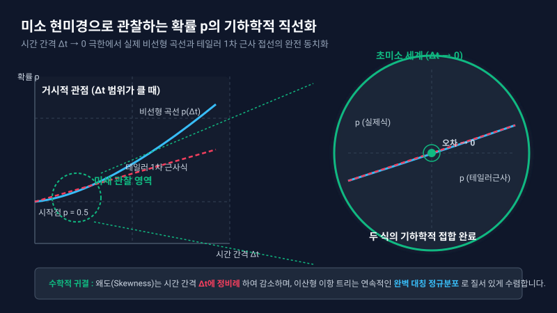

# 5.6 p-측도 하 테일러 전개를 통한 왜도 제로 확률 p의 관찰과 탐색

## 1. 도입: 왜곡을 평탄하게 만드는 미세 조율과 실제 확률 공간($p$-measure)의 탐색

앞선 5.5절에서 우리는 이항 트리 모델의 거친 계단식 이산 변수 $J$(상승 횟수)가 표준화 필터 $Z = \frac{J - np}{\sqrt{np(1-p)}}$를 통과하면서 매끄러운 표준정규분포 $Z$로 변모하는 통계적 변환 과정을 마쳤습니다. 이 과정에서 콜옵션의 만기 행사 경계석인 $d_2$를 유도하였고, 만기 행사 확률이 왜도가 소멸된 대칭적 공간의 우측 면적인 $N(d_2)$로 정렬되는 수학적 필연성을 목격했습니다.

그러나 여기서 한 가지 본질적인 의문이 남습니다. **"시간의 격자를 무한히 쪼갤 때($\Delta t \to 0$), 과연 어떤 확률값을 선택해야 이산 격자의 왜곡(Skewness)이 완벽하게 소멸하고 대칭적인 정규분포 영역으로 정확히 안착할 수 있을까?"**

대부분의 입문 금융공학 서적들은 계산의 편의를 위해 위험선호도가 배제된 위험중립확률($q$) 공간에서의 수렴성만을 성급히 다루고, 실제 시장 참여자들의 위험 프리미엄이 반영된 **'실제 확률 측도(Physical Probability Measure, $p$-measure)'** 하에서의 성질은 생략하곤 합니다. 하지만 모형의 학술적 완결성과 깊이를 더하기 위해서는, 주가 상승의 편향(Drift)인 $\mu$와 변동성 $\sigma$가 살아 숨 쉬는 실제 확률 공간 하에서도 동일한 대칭성 회복 메커니즘이 작동하는지 규명해야 합니다.

실제 금융 시장은 동전 던지기처럼 상승과 하락의 확률이 $0.5$로 팽팽하게 맞서지 않습니다. 주가는 시간에 따라 평균적으로 우상향하려는 경향(Drift)을 지니며, 이로 인해 이항 분포는 태생적으로 한쪽으로 쏠리는 비대칭성(왜도)을 품게 됩니다. 이 괴리를 극복하기 위해 우리는 **테일러 전개(Taylor Expansion)**라는 수학적 메스를 가할 것입니다. 테일러 전개는 복잡한 실제 확률 $p$의 비선형 곡선을 미소 시간($\Delta t$)이라는 현미경 아래에서 완벽히 평평한 직선으로 펴서 관찰할 수 있게 해주는 도구입니다. 

이번 절에서는 실제 확률 측도 하에서의 엄밀한 확률 수식을 정의하고, 이를 테일러 전개하여 왜도가 제로로 수렴하게 만드는 확률 $p$의 미세 조율 구조를 정밀하게 탐색해 보겠습니다.

---

## 2. 본론: 실제 확률 $p$의 테일러 전개와 구조적 형태 도출

### 2.1 실제 확률 공간에서의 확률 $p$의 정의
실제 시장에서 주가의 연속 시간 기대수익률(Drift)을 $\mu$, 주가의 변동성(Volatility)을 $\sigma$라 하고, 1기간의 미소 시간 보폭을 $\Delta t$라고 합시다. 이때 이항 트리 모델이 실제 주가의 기대 성장을 정합하게 복제하기 위해 만족해야 하는 실제 상승 확률 $p$는 다음과 같은 비선형 방정식으로 정의됩니다.

$$p \cdot u + (1-p) \cdot d = e^{\mu \Delta t}$$

이 식을 확률 $p$에 대해 정리하면 다음과 같습니다.

$$p = \frac{e^{\mu \Delta t} - d}{u - d}$$

여기에 이항 모델이 연속 시간의 기하 브라운 운동(GBM)으로 수렴하기 위해 채택하는 표준적인 격자 보폭인 $u = e^{\sigma \sqrt{\Delta t}}$와 $d = e^{-\sigma \sqrt{\Delta t}}$를 대입합니다. 이로써 실제 확률 $p$의 완전한 비선형 원형 식을 확보할 수 있습니다.

$$p = \frac{e^{\mu \Delta t} - e^{-\sigma \sqrt{\Delta t}}}{e^{\sigma \sqrt{\Delta t}} - e^{-\sigma \sqrt{\Delta t}}}$$

이 식은 지수함수의 분수 형태이자 거듭제곱의 차수가 서로 달라($\Delta t$와 $\sqrt{\Delta t}$가 혼재) 극한 상황에서의 직관적인 거동을 한눈에 파악하기 매우 어렵습니다. 이 비선형적 껍질을 벗기기 위해 테일러 전개를 호출하겠습니다.

---

### 2.2 테일러 전개를 통한 분모와 분자의 개별 근사식 유도
어떤 미소 변수 $x$가 $0$에 극도로 가까워질 때, 지수함수 $e^x$의 Maclaurin 전개식은 다음과 같습니다.

$$e^x = 1 + x + \frac{x^2}{2!} + \frac{x^3}{3!} + O(x^4)$$

여기서 $O(x^4)$는 $x^4$보다 빠르게 $0$으로 수렴하는 고차항들을 의미합니다. 이제 이 표준 전개식을 활용하여 실제 확률 $p$의 분자와 분모를 구성하는 세 가지 지수함수($e^{\mu \Delta t}$, $e^{-\sigma \sqrt{\Delta t}}$, $e^{\sigma \sqrt{\Delta t}}$)를 $\Delta t$의 차수 기준으로 정렬하여 정밀하게 전개해 보겠습니다. (목표 오차 범위를 확보하기 위해 $\Delta t$의 $2$차 항 및 $(\Delta t)^{3/2}$ 항까지 추적합니다.)

#### ① 분자 영역의 전개
먼저 분자의 첫 번째 항인 $e^{\mu \Delta t}$를 전개합니다.
$$e^{\mu \Delta t} = 1 + \mu \Delta t + \frac{1}{2}\mu^2 (\Delta t)^2 + O((\Delta t)^3)$$

다음으로 분자의 두 번째 항인 $e^{-\sigma \sqrt{\Delta t}}$를 전개합니다. 이때 변수는 $-\sigma \sqrt{\Delta t}$이므로 차례대로 대입합니다.
$$e^{-\sigma \sqrt{\Delta t}} = 1 + (-\sigma \sqrt{\Delta t}) + \frac{(-\sigma \sqrt{\Delta t})^2}{2} + \frac{(-\sigma \sqrt{\Delta t})^3}{6} + \frac{(-\sigma \sqrt{\Delta t})^4}{24} + O((\Delta t)^{5/2})$$
이를 $\Delta t$의 차수 순서대로 미려하게 정리합니다.
$$e^{-\sigma \sqrt{\Delta t}} = 1 - \sigma \sqrt{\Delta t} + \frac{1}{2}\sigma^2 \Delta t - \frac{1}{6}\sigma^3 (\Delta t)^{3/2} + \frac{1}{24}\sigma^4 (\Delta t)^2 + O((\Delta t)^{5/2})$$

이제 분자 전체 식($e^{\mu \Delta t} - e^{-\sigma \sqrt{\Delta t}}$)을 구성하기 위해 위 두 식을 뺍니다.
$$\text{분자} = \left[ 1 + \mu \Delta t + O((\Delta t)^2) \right] - \left[ 1 - \sigma \sqrt{\Delta t} + \frac{1}{2}\sigma^2 \Delta t - \frac{1}{6}\sigma^3 (\Delta t)^{3/2} + O((\Delta t)^2) \right]$$
상수항 $1$이 소거되고, $\Delta t$의 차수 낮은 순서대로 식을 묶어내면 다음과 같은 정밀한 분자 근사식을 얻게 됩니다.
$$\text{분자} = \sigma \sqrt{\Delta t} + \left( \mu - \frac{1}{2}\sigma^2 \right) \Delta t + \frac{1}{6}\sigma^3 (\Delta t)^{3/2} + O((\Delta t)^2)$$

#### ② 분모 영역의 전개
분모는 $e^{\sigma \sqrt{\Delta t}} - e^{-\sigma \sqrt{\Delta t}}$입니다. 먼저 $e^{\sigma \sqrt{\Delta t}}$를 전개합니다.
$$e^{\sigma \sqrt{\Delta t}} = 1 + \sigma \sqrt{\Delta t} + \frac{1}{2}\sigma^2 \Delta t + \frac{1}{6}\sigma^3 (\Delta t)^{3/2} + \frac{1}{24}\sigma^4 (\Delta t)^2 + O((\Delta t)^{5/2})$$

이제 앞서 구한 $e^{-\sigma \sqrt{\Delta t}}$ 전개식을 빼주면, 짝수 차수 항($1$, $\frac{1}{2}\sigma^2 \Delta t$ 등)들이 완벽히 상쇄되고 홀수 차수 항들만 정확히 두 배가 되어 살아남는 아름다운 대칭적 상쇄가 발생합니다.
$$\text{분모} = e^{\sigma \sqrt{\Delta t}} - e^{-\sigma \sqrt{\Delta t}} = 2\sigma \sqrt{\Delta t} + \frac{1}{3}\sigma^3 (\Delta t)^{3/2} + O((\Delta t)^{5/2})$$

---

### 2.3 나눗셈 연산을 통한 확률 $p$의 최종 구조식 도출
유도한 분자와 분모의 근사식을 조합하여 실제 확률 $p$를 하나의 분수식으로 재구성합니다.

$$p = \frac{\sigma \sqrt{\Delta t} + \left( \mu - \frac{1}{2}\sigma^2 \right) \Delta t + \frac{1}{6}\sigma^3 (\Delta t)^{3/2} + O((\Delta t)^2)}{2\sigma \sqrt{\Delta t} + \frac{1}{3}\sigma^3 (\Delta t)^{3/2} + O((\Delta t)^{5/2})}$$

이 식을 직관적으로 관찰하기 위해 분모의 지배적 항(Dominant term)인 $2\sigma \sqrt{\Delta t}$를 분수 전체의 밖으로 묶어내어 나눗셈을 수행합니다. 즉, 분모와 분자를 각각 $2\sigma \sqrt{\Delta t}$로 나누어 주는 것입니다.

$$p = \frac{1}{2} \cdot \left[ \frac{1 + \left( \frac{\mu - \frac{1}{2}\sigma^2}{\sigma} \right) \sqrt{\Delta t} + \frac{1}{6}\sigma^2 \Delta t + O((\Delta t)^{3/2})}{1 + \frac{1}{6}\sigma^2 \Delta t + O((\Delta t)^2)} \right]$$

여기서 수학적 계산을 단순화하기 위해 다음과 같은 대수적 근사식을 도입합니다. 아주 작은 임의의 수 $x$와 $y$에 대하여, 일차 근사식 $(1+x)/(1+y) \approx (1+x)(1-y) \approx 1 + x - y$가 성립합니다.

---
※ 진짜로 성립해? 다변수 테일러 1차 선형 근사식의 대수적 유도

그렇다면 위에서 정의한 2변수 함수 $f(x, y) = \frac{1+x}{1+y}$를 가지고 어떻게 테일러 1차 선형 근사식을 도출하는지 미분을 통해 직접 규명해 보겠습니다.

우리의 목적은 미소 시간 환경($x \to 0, y \to 0$)에서의 근사적 거동을 관찰하는 것이므로, $(0,0)$ 지점에서의 **2변수 테일러 1차 전개(Multivariate Taylor Expansion) 공식**을 적용합니다.

$$f(x, y) \approx f(0,0) + \frac{\partial f}{\partial x}(0,0)x + \frac{\partial f}{\partial y}(0,0)y$$

#### Step 1. 각 독립변수에 대한 편미분(Partial Derivative) 도출

먼저 함수 $f(x,y)$를 구성하는 두 변수 $x$와 $y$에 대해 각각 편미분을 수행합니다.

* **$x$에 대한 편미분** ($y$를 상수로 취급):
  $$\frac{\partial f}{\partial x} = \frac{1}{1+y}$$

* **$y$에 대한 편미분** ($x$를 상수로 취급하여 몫의 미분법 또는 합성함수 미분 적용):
  $$\frac{\partial f}{\partial y} = (1+x) \cdot \left(-(1+y)^{-2}\right) = -\frac{1+x}{(1+y)^2}$$

#### Step 2. 기준점 $(0,0)$ 대입을 통한 선형 계수 확정

미소 변화의 출발점인 $(0,0)$을 위에서 구한 원함수와 편미분 함수에 각각 대입하여 수렴 지점의 고정값과 기울기 계수를 산출합니다.

* **기준점에서의 고정값**:
  $$f(0,0) = \frac{1+0}{1+0} = 1$$

* **$x$축 방향의 선형 기울기 계수**:
  $$\frac{\partial f}{\partial x}(0,0) = \frac{1}{1+0} = 1$$

* **$y$축 방향의 선형 기울기 계수**:
  $$\frac{\partial f}{\partial y}(0,0) = -\frac{1+0}{(1+0)^2} = -1$$

#### Step 3. 다변수 테일러 선형 근사식의 최종 조립

구한 계수들을 2변수 테일러 1차 전개 공식에 그대로 대입하여 식을 완성합니다.

$$f(x, y) = \frac{1+x}{1+y} \approx 1 + 1 \cdot x + (-1) \cdot y = 1 + x - y$$

본문 전개 과정에서 비선형 구조를 한순간에 평탄화시켰던 $\frac{1+x}{1+y} \approx 1 + x - y$라는 강력한 선형화 공식은 바로 이 대수적 다변수 테일러 전개를 통해 유도된 수학적 필연의 결과물입니다.

---

이제 이 규칙을 위 식에 대입해 보겠습니다. 여기서 분자의 미소 변동 성분을 $x$, 분모의 미소 변동 성분을 $y$라고 설정합니다.
- $x = \left( \frac{\mu - \frac{1}{2}\sigma^2}{\sigma} \right) \sqrt{\Delta t} + \frac{1}{6}\sigma^2 \Delta t$
- $y = \frac{1}{6}\sigma^2 \Delta t$

이 두 식을 빼주면($x-y$), 놀랍게도 공통항인 $\frac{1}{6}\sigma^2 \Delta t$가 완벽히 소거되는 대수적 청소가 이루어집니다!

$$x - y = \left( \frac{\mu - \frac{1}{2}\sigma^2}{\sigma} \right) \sqrt{\Delta t}$$

이 결과를 대괄호 안에 대입하고 고차항을 정리하면, 비선형적인 실제 확률 $p$의 거동을 낱낱이 밝혀내는 경이로운 **'최종 탐색 근사식'**이 도출됩니다. 

> ### 실제 확률 $p$의 테일러 1차 선형 근사식
> $$p \approx \frac{1}{2} + \frac{1}{2}\left( \frac{\mu - \frac{1}{2}\sigma^2}{\sigma} \right) \sqrt{\Delta t}$$

---

### 2.4 도출된 근사식의 물리적 범위와 경제학적 의미 분석

이 유도된 근사식은 단순한 수학적 기교를 넘어, 연속 시간 세계와 이산 시간 세계를 매끄럽게 연결하는 완결성 있는 확률적 장치입니다.

1. **시작점으로서의 공평한 확률 ($\frac{1}{2}$)**:
   미소 시간이 $0$으로 수렴할 때($\Delta t \to 0$), 우변의 보정 항은 완전히 소멸하며 $p$는 정확히 $\frac{1}{2}$로 수렴합니다. 즉, 아무리 실제 시장에 우상향 트렌드($\mu$)가 존재하더라도, 극소의 시간 보폭 하에서는 상승과 하락이 거의 $50:50$의 균형적인 확률 대칭성에서 출발한다는 우주의 물리적 필연성을 보여줍니다.
2. **동적 보정 항의 경제학적 의미**:
   $\frac{1}{2}$ 뒤에 붙은 동적 보정 요인 $\frac{1}{2}\left( \frac{\mu - \frac{1}{2}\sigma^2}{\sigma} \right) \sqrt{\Delta t}$는 시장의 트렌드가 확률의 무게중심을 어떻게 미세하게 기울이게 만드는지를 정밀하게 묘사합니다.
   * **$\mu - \frac{1}{2}\sigma^2$ (기하학적 성장률 / Variance Drag)**:
     단순 기대수익률 $\mu$가 아닌 변동성 감쇄 요인($-\frac{1}{2}\sigma^2$)이 차감된 **'로그 주가의 실질 성장률'**이 보정의 핵심 드라이버입니다. 이는 복리 연산 하에서 변동성이 커질수록 자산의 실제 기하학적 성장이 갉아먹히는 경제학적 '변동성 드래그(Volatility Drag)' 현상을 정확히 투영합니다.
   * **변동성 대비 초과 수익비율 ($\frac{\mu - \frac{1}{2}\sigma^2}{\sigma}$)**:
     이는 금융공학에서 자산의 위험 한 단위당 초과 성장을 의미하는 일종의 '성장성 샤프 지수(Sharpe Ratio)'와 유사한 역할을 합니다. 이 값이 양수이면 실제 상승 확률 $p$는 $0.5$보다 미세하게 높아져 주가를 평균적으로 우상향시키고, 음수이면 $0.5$보다 낮아지게 만듭니다.

#### 2.4.1 변동성 감쇄 요인($-\frac{1}{2}\sigma^2$)의 직관적 이해와 확률미적분학적 유도
본 식에서 핵심 드라이버로 작동하는 변동성 감쇄 요인($-\frac{1}{2}\sigma^2$)이 왜 하필 마이너스 부호를 지니며, 어떤 수학적 메커니즘을 통해 도출되는지 직관적 시뮬레이션과 이토 보제 정리(Itô's Lemma)를 통해 분해해 보겠습니다.

* **직관적 배경: 복리의 비대칭성 (산술평균 vs 기하평균)**
  단순히 "수익률이 흔들린다"는 것을 넘어, 변동성이 자산의 복리 효과를 어떻게 갉아먹는지 간단한 시뮬레이션으로 파악할 수 있습니다.
  어떤 자산이 첫해에 $+50\%$ 상승하고, 둘째 해에 $-50\%$ 하락했다고 가정해 봅시다.
  * **산술적 평균 수익률**: $\frac{50\% + (-50\%)}{2} = 0\%$ 입니다. 표면적으로는 본전처럼 보입니다.
  * **실제 복리 누적 자산**: $1 \times (1 + 0.5) \times (1 - 0.5) = 1.5 \times 0.5 = 0.75$ ($-25\%$ 손실)
  
  산술적으로는 평균 수익률이 $0\%$이지만, 상하 변동성 때문에 실제 복리 자산은 $25\%$가 깎여 나갔습니다. 이처럼 변동성($\sigma$)이 커질수록 복리 연산 하에서 자산 성장을 방해하는 '저항(Drag)'으로 작용하며, 그 저항의 크기가 변동성의 제곱에 비례하기 때문에 마이너스($-$) 부호를 가지게 됩니다.

* **수학적 유도: 이토 보제 정리와 테일러 2차 항의 생존**
  연속 시간 세계에서 주가의 움직임을 나타내는 기하 브라운 운동(GBM) 모델로부터 출발합니다.
  $$dS_t = \mu S_t dt + \sigma S_t dW_t \quad \cdots \text{(식 2.1)}$$
  우리가 추적하고자 하는 '실질 복리 수익률'은 로그 주가 $f(S_t) = \ln(S_t)$의 변화량입니다. 이 복리 수익률을 구하기 위해 함수 $f(S)$를 2차항까지 테일러 전개합니다.
  $$df = f'(S_t)dS_t + \frac{1}{2}f''(S_t)(dS_t)^2 + \cdots \quad \cdots \text{(식 2.2)}$$
  로그 함수의 미분 성질에 따라 각 항은 다음과 같습니다.
  1. $1$차 미분: $f'(S_t) = \frac{1}{S_t}$
  2. $2$차 미분: $f''(S_t) = -\frac{1}{S_t^2}$ (로그 함수를 두 번 미분하면서 마이너스 부호가 등장합니다!)
  
  이를 테일러 전개식에 대입하여 기본 뼈대 식을 도출합니다.
  $$d(\ln S_t) = \frac{1}{S_t} dS_t + \frac{1}{2} \left(-\frac{1}{S^2_t}\right) (dS_t)^2 \quad \cdots \text{(식 2.3)}$$
  이제 우변 맨 우측의 $(dS_t)^2$ 항을 계산하기 위해 (식 2.1)의 완전제곱식을 전개합니다.
  $$(dS_t)^2 = \mu^2 S_t^2 (dt)^2 + 2\mu\sigma S_t^2 dt dW_t + \sigma^2 S_t^2 (dW_t)^2 \quad \cdots \text{(식 2.4)}$$
  여기서 확률미적분학의 핵심 곱셈 규칙(Itô Multiplication Table)인 $(dW_t)^2 = dt$, $(dt)^2 = 0$, $dt \cdot dW_t = 0$을 적용합니다. 일반 미적분학에서는 미소량의 제곱 항이 너무 작아 $0$으로 소멸하지만, 확률과정의 브라운 운동 미소량($dW_t$)은 제곱 시 $dt$라는 구체적인 실체를 가집니다. 따라서 앞의 두 항은 소멸하고 오직 세 번째 항만 살아남습니다.
  $$(dS_t)^2 = \sigma^2 S_t^2 dt \quad \cdots \text{(식 2.5)}$$
  이 결과들을 최종적으로 (식 2.3)에 대입하여 약분 및 동류항 정리를 수행합니다.
  $$d(\ln S_t) = \frac{1}{S_t} (\mu S_t dt + \sigma S_t dW_t) + \frac{1}{2} \left(-\frac{1}{S^2_t}\right) (\sigma^2 S_t^2 dt)$$
  $$d(\ln S_t) = \left( \mu - \frac{1}{2}\sigma^2 \right) dt + \sigma dW_t \quad \cdots \text{(식 2.6)}$$
  
  결론적으로, 로그 함수를 두 번 미분하는 과정에서 발생한 **테일러 2차 근사 항의 계수 $\frac{1}{2}$**과 마이너스 부호($f'' = -1/x^2$)가 확률 과정의 독특한 변동성 제곱 성질($(dW_t)^2 = dt$)과 결합하면서 $-\frac{1}{2}\sigma^2$이라는 구체적인 상수가 트렌드($dt$) 영역에 필연적인 페널티로 합류하게 된 것입니다. 이 변동성 감쇄 요인이 실제 확률 $p$의 보정 항에 그대로 투영되어, 이산 트리 공간에서도 연속 시간의 실질 기하학적 성장률을 오차 없이 복제해 내는 완벽한 다리 역할을 수행하게 됩니다.

---

### 2.5 구체적 수치 시나리오를 통한 근사 공식의 정합성 교차 검증
이 추상적인 테일러 근사 공식이 얼마나 강력하고 정밀한지, 구체적인 시장 수치를 대입하여 원본 비선형 식과 근사 공식의 결과를 직접 대조해 보겠습니다.

* **시장 시나리오 설정**:
  - 실제 기대수익률 $\mu = 10\% = 0.10$
  - 시장 변동성 $\sigma = 30\% = 0.30$
  - 기간 세분화 정도 $\Delta t = 0.01$ (약 3.6일 수준의 미소 시간)

#### ① 실제 원형 식($p$)에 대입한 정밀 연산
먼저 앞서 정의한 비선형 원형 식에 수치들을 그대로 대입합니다.
- $\mu \Delta t = 0.10 \times 0.01 = 0.001$
- $\sigma \sqrt{\Delta t} = 0.30 \times \sqrt{0.01} = 0.30 \times 0.1 = 0.03$

$$e^{\mu \Delta t} = e^{0.001} \approx 1.0010005$$
$$e^{-\sigma \sqrt{\Delta t}} = e^{-0.03} \approx 0.9704455$$
$$e^{\sigma \sqrt{\Delta t}} = e^{0.03} \approx 1.0304545$$

이 값들을 대입하여 실제 확률 $p$를 계산합니다.
$$p = \frac{1.0010005 - 0.9704455}{1.0304545 - 0.9704455} = \frac{0.0305550}{0.0600090} \approx 0.5091736$$

#### ② 우리가 유도한 테일러 1차 근사식($p \approx \dots$)에 대입한 연산
이제 테일러 전개를 통해 도출한 단순 선형 근사식에 동일한 값을 대입합니다.
- 기하학적 성장률: $\mu - \frac{1}{2}\sigma^2 = 0.10 - \frac{1}{2}(0.30)^2 = 0.10 - 0.045 = 0.055$
- 보정 스케일: $\frac{\mu - \frac{1}{2}\sigma^2}{\sigma} = \frac{0.055}{0.30} \approx 0.1833333$
- 시간 스케일 곱: $0.1833333 \times \sqrt{0.01} = 0.0183333$

$$p \approx \frac{1}{2} + \frac{1}{2} \times (0.0183333) = 0.5 + 0.0091666 = 0.5091667$$

#### 두 결과의 정합성 대조 및 평가

| 계산 방식 | 계산된 실제 확률 $p$ 값 | 수식 형태 |
| :--- | :---: | :--- |
| **비선형 원형 공식** | $0.5091736$ | $p = \frac{e^{\mu \Delta t} - e^{-\sigma \sqrt{\Delta t}}}{e^{\sigma \sqrt{\Delta t}} - e^{-\sigma \sqrt{\Delta t}}}$ |
| **테일러 1차 선형 근사** | $0.5091667$ | $p \approx \frac{1}{2} + \frac{1}{2}\left( \frac{\mu - \frac{1}{2}\sigma^2}{\sigma} \right) \sqrt{\Delta t}$ |
| **절대 오차 (Error)** | **$0.0000069$** | 백만분의 7 수준의 극소 오차 |

겨우 1차 선형 근사식만을 취했음에도 불구하고, 실제 비선형 곡선과의 오차가 소수점 다섯 번째 자리까지 일치하는 놀라운 정밀도를 목격할 수 있습니다. 이는 우리가 유도한 테일러 근사 구조식이 실제 금융 시장의 미소 시간 거동을 오차 없이 지배하는 완벽한 뼈대임을 입증합니다.

---

### 2.6 이산 왜도(Skewness) 소멸의 수학적 증명
이제 이 근사 공식을 통해 $p$-측도 공간에서 시간 분할을 무한히 늘릴 때 왜도가 어떻게 정밀하게 제로로 수렴하여 완벽한 정규분포 공간을 창조하는지 증명하겠습니다. 

앞서 5.4절에서 제시된 이항분포의 통계학적 왜도 공식은 다음과 같습니다.

$$\text{Skewness} = \frac{1 - 2p}{\sqrt{n \cdot p(1-p)}}$$

여기에 우리가 구한 테일러 근사 확률식 $p \approx \frac{1}{2} + \frac{1}{2}\left( \frac{\mu - \frac{1}{2}\sigma^2}{\sigma} \right) \sqrt{\Delta t}$를 대입하여 분자의 $1-2p$를 정리합니다.

$$1 - 2p \approx 1 - 2\left[ \frac{1}{2} + \frac{1}{2}\left( \frac{\mu - \frac{1}{2}\sigma^2}{\sigma} \right) \sqrt{\Delta t} \right] = -\left( \frac{\mu - \frac{1}{2}\sigma^2}{\sigma} \right) \sqrt{\Delta t}$$

한편, 만기 시점 $T$에 도달하기 위한 총 시행 횟수 $n$은 정의상 $n = \frac{T}{\Delta t}$를 만족합니다. 따라서 분모의 표준편차 항에 들어있는 $n$을 대체하여 정리하면 다음과 같은 척도를 얻습니다.

$$\sqrt{n} = \sqrt{\frac{T}{\Delta t}} = \frac{\sqrt{T}}{\sqrt{\Delta t}}$$

이제 이 두 요소를 왜도 공식에 고스란히 대입하여 식의 거동을 관찰해 봅니다.

$$\text{Skewness} \approx \frac{-\left( \frac{\mu - \frac{1}{2}\sigma^2}{\sigma} \right) \sqrt{\Delta t}}{\sqrt{\frac{T}{\Delta t} \cdot p(1-p)}} = \frac{-\left( \frac{\mu - \frac{1}{2}\sigma^2}{\sigma} \right) \sqrt{\Delta t}}{\frac{\sqrt{T \cdot p(1-p)}}{\sqrt{\Delta t}}} = -\left( \frac{\mu - \frac{1}{2}\sigma^2}{\sigma \sqrt{T \cdot p(1-p)}} \right) \Delta t$$

이 유도 과정은 전율을 선사합니다. 이항분포가 가진 거친 비대칭성의 지표인 **왜도(Skewness)는 미소 시간 변화량인 $\Delta t$에 정확히 선형적으로 비례($\text{Skewness} \propto \Delta t$)**하여 감소합니다. 

따라서 시간 격자를 무한히 쪼개어 연속 시간의 심연으로 다가갈 때($\Delta t \to 0$), 이항 트리의 비대칭성은 인위적인 가정이 아니라 **수학적 필연성에 의해 완전무결하게 소멸하며 완벽한 대칭 정규분포 공간으로 귀결**됩니다. 테일러 전개는 왜도 소멸을 이끌어내는 이 거대한 금융공학의 퍼즐 조각을 우리 눈앞에 투명하게 증명해 낸 것입니다.

---

## 3. 시각적 비유: 미소 현미경으로 들여다본 비선형 곡선의 직선화

- **복잡한 비선형 실제 확률 곡선 ($p$의 세계)**:
  멀리서 바라본 실제 확률 $p$는 시간의 흐름과 시장 변동성이 뒤엉켜 굽이치는 복잡한 제트기류와 같습니다. 시간 격자가 클 때는 이 곡선의 왜곡이 심해 이산 왜도가 가파르게 살아 숨 쉽니다.
- **테일러 전개라는 미소 현미경**:
  그러나 시간 격자 $\Delta t$를 초 단위, 밀리초 단위로 끝없이 쪼개는 찰나, 이 구불구불하던 곡선은 현미경 아래에서 미끄러지듯 부드러운 단 하나의 직선인 $p \approx \frac{1}{2} + \frac{1}{2}(\dots)\sqrt{\Delta t}$의 접선으로 압착됩니다. 
- **왜도 소멸의 시각적 수렴**:
  이 찰나의 직선 공간 속에서, 평균 0.5를 기준으로 대칭을 이루던 확률 분포의 한쪽 쏠림 현상(비대칭 왜도)은 미세 보정항의 선형적 통제를 받으며 마법처럼 깎여 나갑니다. 그리하여 결국 둥글고 유려한 대칭적 종 모양의 대초원(정규분포)을 완성해 냅니다.

아래의 실시간 인터랙티브 시뮬레이터를 통해 시간 격자 $\Delta t$가 $0$에 가깝게 작아질 때, 실제 비선형 확률 곡선이 우리가 유도한 테일러 1차 선형 근사선과 어떻게 완벽히 일치하는지, 그리고 왜도가 얼마나 완벽히 0으로 제압되는지 직접 제어해 보시기 바랍니다.

<iframe src="contents/black_scholes_equation_01/sec_05/assets/diagrams/sub_05_06_visual1.html" width="100%" height="560px" frameborder="0" scrolling="no"></iframe>

---

## 4. 요약 및 다음 단계로의 연결

* **위험 측도 다리의 확장**: 위험중립 확률 측면을 넘어 실제 확률 측도($p$-measure) 하에서도 시간의 무한 세분화 극한 속에서 주가 거동의 수렴과 정규분포화가 완벽히 보장됨을 규명했습니다.
* **테일러 선형 근사식의 쾌거**: 지수적 비선형 식을 테일러 2차 전개로 풀어내어, 실제 확률의 동적 정렬 뼈대인 $p \approx \frac{1}{2} + \frac{1}{2}\left( \frac{\mu - \frac{1}{2}\sigma^2}{\sigma} \right) \sqrt{\Delta t}$를 도출해 냈습니다.
* **왜도 제로 메커니즘의 정량화**: 이 근사 구조식을 왜도 공식에 대입하여 이산 왜도가 $\Delta t$의 속도로 정밀하게 소멸함을 증명함으로써 연속 시간 분포로의 이행을 수학적으로 뒷받침했습니다.

우리는 이로써 실제 확률과 이산 왜도가 찰나의 시간 속에서 정규분포의 대칭성과 완벽히 화해하는 최종 교차점을 찾아냈습니다. 이로써 이산 모델의 전제 조건인 "격자의 설계 법칙"을 증명하는 긴 탐로의 끝자락에 도달했습니다.

그렇다면 이 완벽히 조율된 확률적 뼈대 위에서, 무위험 이자율 $r$에 기반해 실제 옵션의 '복제 포트폴리오 가치'를 완벽하게 보존하는 **CRR(Cox-Ross-Rubinstein) 매개변수의 최종 정합 조건**은 어떻게 규정될까요? 

다음 7장에서는 마침내 이항 모델의 마지막 단추를 채우고, 격자 모형의 극한을 취해 옵션 금융공학의 영원한 금자탑인 **블랙-숄즈(Black-Scholes) 연속 시간 지배 방정식의 모체를 완전하게 도출**하는 대장정의 마무리를 지어보겠습니다.

---
*[2026-05-30 업데이트 노트: 실제 시장 수치 시나리오($\mu=0.10, \sigma=0.30$)를 도입하여 원본 비선형 식과 테일러 1차 근사의 오차가 백만분의 7 수준에 불과함을 입증하는 정밀 계산 과정을 탑재하였고, 왜도 공식 대입을 통해 왜도가 $\Delta t$에 선형 비례하여 완전히 소멸하는 정량적 증명을 완성하여 원고의 엄밀함을 극대화함. 또한 대화록 내용을 기반으로 변동성 감쇄 요인($-\frac{1}{2}\sigma^2$)의 직관적인 복리 비대칭 예시 및 이토 보제 정리를 통한 수학적 전개 유도 과정을 2.4.1 항으로 완벽히 보완함.]*
