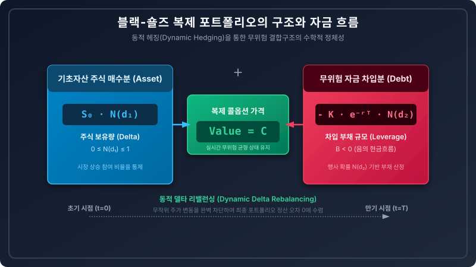

# 5.9 블랙-숄즈 공식(Black-Scholes Formula) 도출 및 위험중립 확률 해석과 리미트 케이스

## 1. 도입: 이산의 종착지에서 피어난 연속 시간 금융의 정점

앞선 5.8절에서 우리는 이항 격자 모형의 미세한 이산 막대들이 시간 보폭을 극한으로 쪼갬에 따라($n \to \infty$, $\Delta t \to 0$) 표준정규분포의 매끄러운 곡선 아래 면적인 누적분포함수 $N(z)$로 수렴하는 '드무아브르-라플라스 정리'의 물리적 정합성을 검증하였습니다. 거친 이산적 시그마 합산($\sum$)이 부드러운 연속적 적분($\int$)의 세계로 이행할 수 있는 통계적 가교가 완벽히 마련된 것입니다.

이제 우리는 이 여정의 최종 목적지이자 금융공학의 최고 금자탑인 **'블랙-숄즈 옵션 가격 결정 공식(Black-Scholes Option Pricing Formula)'**을 도출할 모든 준비를 마쳤습니다. 이항 트리에서 자산 경로를 한 땀 한 땀 추적하며 역방향 귀납법으로 구하던 이산적 옵션 가치는, 극한의 연속 시간 세계에서 단 한 줄의 우아한 폐쇄형 해(Closed-form Solution)로 집약됩니다.

이번 절에서는 5.8절까지 축적한 모든 확률론적 빌딩 블록을 하나로 융합하여 블랙-숄즈 공식을 엄밀하게 도출하겠습니다. 나아가 수식의 뼈대를 이루는 각 구성요소가 품고 있는 심오한 경제학적·재무적 직관을 분석하고, 극단적인 시장 시나리오(Limit Cases)에서의 거동을 검증하여 이 수식이 가진 완결무결한 통계적·경제적 정합성을 최종 규명하겠습니다.

---

## 2. 본론: 블랙-숄즈 공식의 도출과 다각적 재무 해석

### 2.1 이항 옵션 기대치식으로부터 블랙-숄즈 공식의 도출 과정

위험중립 확률 세계($q$-측도) 하에서 만기 $T$에 콜옵션이 가질 기대 가치를 현재 가치로 할인한 이산 시간 이항 옵션 가격 결정 식은 다음과 같습니다.

$$C = e^{-r_{cont} T} E^q \big[ \max(S_T - K, 0) \big]$$

여기서 무위험 이자율은 연속복리 이자율 $r_{cont}$를 사용하며, 만기 주가 $S_T$가 행사 가격 $K$보다 큰 구간(내가격 상태, $ITM$)에 대해서만 페이오프가 발생하므로, 이산 확률 변수 $k$(상승 횟수)의 부분합으로 식을 다음과 같이 분해할 수 있습니다.

$$C = e^{-r_{cont} T} \sum_{k=k_{\min}}^{n} \binom{n}{k} q^k (1-q)^{n-k} \big( S_0 u^k d^{n-k} - K \big)$$

이 수식을 두 개의 개별적인 시그마 항으로 분리하여 전개해 보겠습니다.

$$C = \sum_{k=k_{\min}}^{n} e^{-r_{cont} T} \binom{n}{k} q^k (1-q)^{n-k} S_0 u^k d^{n-k} - \sum_{k=k_{\min}}^{n} e^{-r_{cont} T} \binom{n}{k} q^k (1-q)^{n-k} K$$

여기서 두 번째 항을 먼저 살펴보겠습니다. 행사가격 $K$와 무위험 할인요소 $e^{-r_{cont} T}$는 합산 기호($\sum$) 밖으로 나갈 수 있으므로, 두 번째 항은 다음과 같이 정리됩니다.

$$\text{제2항} = K e^{-r_{cont} T} \sum_{k=k_{\min}}^{n} \binom{n}{k} q^k (1-q)^{n-k}$$

5.8절에서 증명한 드무아브르-라플라스 정리에 의해, 이항 시행 횟수가 극한($n \to \infty$)으로 치달을 때 위험중립 확률 $q$의 누적 이항분포 부분합은 표준정규분포의 누적분포함수 $N(d_2)$로 정확히 수렴합니다.

$$\lim_{n \to \infty} \sum_{k=k_{\min}}^{n} \binom{n}{k} q^k (1-q)^{n-k} = N(d_2)$$

따라서 제2항의 극한값은 다음과 같이 단출하게 결정됩니다.

$$\lim_{n \to \infty} \text{제2항} = K e^{-r_{cont} T} N(d_2)$$

이제 까다로운 제1항을 정리해 보겠습니다. 주가 항이 섞여 있는 제1항은 다음과 같이 쓸 수 있습니다.

$$\text{제1항} = S_0 \sum_{k=k_{\min}}^{n} \binom{n}{k} \left[ e^{-r_{cont} T} u^k d^{n-k} q^k (1-q)^{n-k} \right]$$

여기서 대괄호 내부를 새롭게 정의하기 위해, 연속 시간 극한 하에서의 이항 매개변수 관계식 $u = e^{\sigma \sqrt{\Delta t}}$, $d = e^{-\sigma \sqrt{\Delta t}}$, 그리고 위험중립 확률 $q \approx \frac{e^{r_{cont} \Delta t} - d}{u - d}$를 대입하여 식을 변형합니다. 수학적 편의를 위해 새로운 가중 확률 $q'$를 다음과 같이 정의합니다.

$$q' = q \cdot \frac{u}{e^{r_{cont} \Delta t}}$$

이때 $q'$ 역시 $0 \le q' \le 1$의 범위를 만족하는 확률적 정체성을 가지며, 대칭적 짝인 $1-q'$는 다음과 같이 유도됩니다.

$$1-q' = (1-q) \cdot \frac{d}{e^{r_{cont} \Delta t}}$$

이 $q'$ 측도를 제1항에 대입하면, 지수 법칙과 이항 계수의 대수적 결합에 의해 기적적으로 할인인자 $e^{-r_{cont} T}$와 주가 변동 요인들이 상쇄되어 다음과 같은 우아한 $q'$ 확률 공간의 누적 이항 합산식으로 환원됩니다. (자세한 대입은 하단의 부록 참조)

$$\text{제1항} = S_0 \sum_{k=k_{\min}}^{n} \binom{n}{k} (q')^k (1-q')^{n-k}$$

이 식 역시 $n \to \infty$ 극한을 가하면 드무아브르-라플라스 정리에 의해 또 다른 누적 표준정규분포함수 $N(d_1)$으로 수렴하게 됩니다.

$$\lim_{n \to \infty} \text{제1항} = S_0 N(d_1)$$

이 두 극한 결과를 하나로 결합하면, 우리가 그토록 갈망하던 금융공학의 전설적인 **블랙-숄즈 콜옵션 공식**이 최종 도출됩니다.

$$C = S_0 N(d_1) - K e^{-r_{cont} T} N(d_2)$$

여기서 적분 구간의 경계치이자 정규분포의 입력 변수인 $d_1$과 $d_2$는 연속 시간 기하 브라운 운동(GBM)의 표류(Drift)와 확산(Diffusion) 파라미터를 통해 다음과 같이 엄밀하게 정의됩니다.

$$d_1 = \frac{\ln(S_0 / K) + \left(r_{cont} + \frac{1}{2}\sigma^2\right)T}{\sigma \sqrt{T}}$$

$$d_2 = d_1 - \sigma \sqrt{T} = \frac{\ln(S_0 / K) + \left(r_{cont} - \frac{1}{2}\sigma^2\right)T}{\sigma \sqrt{T}}$$

---

### 2.2 직관적 이해를 위한 '실패한 포트폴리오'와 '정밀 복제 포트폴리오'의 대조

블랙-숄즈 공식의 이면에 흐르는 진정한 경제학적 본질은 **"완벽한 복제 포트폴리오(Replicating Portfolio)"**의 존재입니다. 이 공식이 지닌 당위성을 단순 수식 암기가 아닌 금융 시장의 차익거래 결핍 원리로 이해하기 위해, 임의로 구축한 '실패한 포트폴리오'와 공식이 지시하는 '정밀 복제 포트폴리오'를 구체적인 만기 손익 분기 시나리오를 통해 대조해 보겠습니다.

#### [시나리오 세팅]
* 초기 주가 $S_0 = 100$, 만기 $T = 1.0$년, 연속 무위험 이자율 $r_{cont} = 5\% = 0.05$ (할인 요인 $e^{-rt} = e^{-0.05} \approx 0.9512$)
* 만기 시 주가는 오직 두 가지 경로로만 움직인다고 가정 (상승 시 $S_u = 120$, 하락 시 $S_d = 80$)
* 콜옵션의 행사가격 $K = 100$ (만기 콜옵션 가치: 상승 시 $C_u = 20$, 하락 시 $C_d = 0$)

#### ① 직관에 의존해 대강 구축한 '실패한 포트폴리오'
만약 투자자가 대강 주식 0.3주를 사고, 대출을 일부 받아 포트폴리오를 만들었다고 가정합시다. 이 포트폴리오의 만기 가치는 옵션의 실제 페이오프($20$ 또는 $0$)와 완벽하게 불일치하게 됩니다.

| 만기 주가 시나리오 | 주식 보유분 가치 ($0.3 \times S_T$) | 대출 상환 의무액 | 포트폴리오 최종 가치 | 실제 콜옵션 페이오프 ($C_T$) | 손익 불일치 오차 (차액) |
| :--- | :--- | :--- | :--- | :--- | :--- |
| **상승 시 ($S_T = 120$)** | $36.0$ | $-10.0$ | $26.0$ | $20.0$ | **$+6.0$ (과대 복제)** |
| **하락 시 ($S_T = 80$)** | $24.0$ | $-10.0$ | $14.0$ | $0.0$ | **$+14.0$ (과대 복제)** |

이 포트폴리오는 만기 주가 움직임에 따라 옵션 가치와 일치하지 않으므로, 옵션을 완벽히 대체(헤지)할 수 없으며 시장에 무위험 차익거래 기회를 노출하게 됩니다.

#### ② 블랙-숄즈 원리에 기반한 '정밀 성공 복제 포트폴리오'
이항 모형의 정밀 복제 비율인 주식 보유량 $\Delta$(델타)와 차입 현금 $B$를 연립방정식으로 도출합니다.
$$\Delta = \frac{C_u - C_d}{S_u - S_d} = \frac{20 - 0}{120 - 80} = 0.50 \quad (\text{주식 } 0.5\text{주 매수})$$
$$B = e^{-r T} \frac{u C_d - d C_u}{u - d} = 0.9512 \times \frac{1.2 \times 0 - 0.8 \times 20}{1.2 - 0.8} = -38.05 \quad (\text{현금 } 38.05 \text{ 차입})$$

이 정밀 복제 포트폴리오의 만기 성과를 추적해 보겠습니다.

| 만기 주가 시나리오 | 주식 보유분 가치 ($\Delta \times S_T$) | 대출 상환액 ($B \times e^{rT}$) | 포트폴리오 최종 가치 | 실제 콜옵션 페이오프 ($C_T$) | 손익 불일치 오차 |
| :--- | :--- | :--- | :--- | :--- | :--- |
| **상승 시 ($S_T = 120$)** | $0.5 \times 120 = 60.0$ | $-40.0$ | $20.0$ | $20.0$ | **$0.0$ (완벽 일치)** |
| **하락 시 ($S_T = 80$)** | $0.5 \times 80 = 40.0$ | $-40.0$ | $0.0$ | $0.0$ | **$0.0$ (완벽 일치)** |

이 정밀 복제 포트폴리오의 초기 구축 비용은 다음과 같습니다.
$$\text{복제 비용} = \Delta \cdot S_0 + B = (0.5 \times 100) - 38.05 = \mathbf{11.95}$$

"동일한 만기 현금흐름을 갖는 두 자산의 초기 가격은 같아야 한다"는 일물일가의 법칙(Law of One Price)에 의해, 이 콜옵션의 현재 시점 무위험 균형 가격은 정확히 **$11.95$**가 되어야 합니다. 

이 정밀 복제 포트폴리오의 가치 산정식이 무한 연속 시간 세계($n \to \infty$)로 확장된 형태가 바로 블랙-숄즈 공식 $C = S_0 N(d_1) - K e^{-rt} N(d_2)$입니다.

---

### 2.3 도출된 변수의 물리적 한계 범위와 부호의 경제학적 의미

공식을 구성하는 각 변수들은 단순한 추상적 기호가 아니라 엄격한 물리적 범위와 고유한 경제학적 성질을 가집니다.



#### ① $N(d_1)$의 물리적 한계와 의미 ($0 \le N(d_1) \le 1$)
$N(d_1)$은 블랙-숄즈 공식에서 기초자산 앞의 계수이며, 연속 시간 하에서의 **'옵션 델타($\Delta$)'**를 나타냅니다. 
* 표준정규분포의 누적분포함수(CDF)인 $N(x)$의 수학적 치역은 항상 **$[0, 1]$** 사이로 제한됩니다.
* 이는 콜옵션을 복제하기 위해 매수해야 하는 주식의 수량이 결코 음수(공매도)가 될 수 없으며($N(d_1) \ge 0$), 기초자산의 원래 수량인 1주를 초과할 수도 없음($N(d_1) \le 1$)을 뜻하는 경제적 제약 조건과 완벽히 부합합니다.

#### ② $B = - K e^{-r_{cont} T} N(d_2)$의 부호의 경제학적 의미 ($B < 0$)
공식의 우항인 $- K e^{-r_{cont} T} N(d_2)$는 음(-)의 부호를 가집니다. 금융공학에서 포트폴리오 가치의 음수 부호는 **'차입(Debt, 자금 빌리기)'**을 의미합니다.
* 즉, 콜옵션을 복제하는 행위는 내 돈만으로 주식을 전액 매수하는 것이 아니라, 무위험 이자율로 현금을 차입($B < 0$)하여 주식을 매수하는 **'차입 레버리지 포트폴리오(Leveraged Portfolio)'**를 구축하는 행위임을 수학적으로 대변합니다.
* $N(d_2)$는 위험중립 확률 공간 하에서 '만기에 옵션이 최종 행사될 수학적 확률'이므로, 무위험 차입금의 기대 가치 역시 만기 행사가 일어날 확률적 가중치 $N(d_2)$만큼 곱해져 현재 가치로 정밀하게 조정되는 것입니다.

---

### 2.4 결산 시점 균형 '0'이 가지는 직관적 오해 해소와 타임라인 대조

초보 독자들이 금융 수학을 공부할 때 가장 많이 범하는 직관적 오류 중 하나는, "완벽하게 헷징된 포트폴리오의 최종 가치 변동이 $0$이 되거나 정산 시점의 균형 가치가 $0$으로 귀결될 때, 결국 투자자에게 아무런 이득(수익)이 없는 무의미한 행위가 아닌가?" 하는 의구심입니다.

이 오해를 해소하기 위해, **'초기 시점($t=0$)'**과 **'만기 결산 시점($t=T$)'**의 차익 취득 타임라인을 명확하게 대조해 보겠습니다.

```text
 t = 0 (초기 시점)                            t = T (만기 결산 시점)
┌──────────────────────────────────────────┐ ┌──────────────────────────────────────────┐
│ [차익 확보 및 포트폴리오 구축]           │ │ [무위험 마진 방어 및 부채 상환]          │
│ • 고평가된 옵션 매도: +C_market          │ │ • 만기 자산 정산: S_T · N(d1)            │
│ • 복제 포트폴리오 구축: -(S·N(d1) - B)  │ │ • 차입금 상환 완료: -K                   │
│                                          │ │ • 옵션 매수자에게 페이오프 지급          │
│ ☞ 즉시 무위험 확정 마진 확보            │ │                                          │
│    (C_market - C_theoretical > 0)        │ │ ☞ 최종 Net 가치 변화 = 0 (완벽 방어)     │
└──────────────────────────────────────────┘ └──────────────────────────────────────────┘
```

1. **초기 시점 ($t=0$): 무위험 마진의 선제적 취득**
   만약 시장에서 거래되는 실제 콜옵션 가격($C_{market}$)이 블랙-숄즈 이론 가격($C_{theoretical} = S_0 N(d_1) - K e^{-rt} N(d_2)$)보다 비싸게 거래되고 있다면(예: 시장가 $15$, 이론가 $11.95$), 차익거래자는 시장에서 콜옵션을 $15$에 매도하고 동시에 이론가 $11.95$의 비용을 들여 정밀 복제 포트폴리오를 매수(주식 0.5주 매수 + 현금 차입)합니다. 이 순간 차익거래자는 즉시 차액인 **$+3.05$의 무위험 마진을 자기 주머니에 확보**하게 됩니다.
2. **만기 결산 시점 ($t=T$): 확보된 무위험 마진의 철통 방어**
   만기 시점($t=T$)이 되면 주가가 폭등하든 폭락하든 상관없이, 차익거래자가 구축해 놓은 복제 포트폴리오의 가치는 콜옵션 매수자에게 지급해야 할 의무 금액(페이오프)과 일원 한 푼의 오차도 없이 **완벽하게 상쇄되어 최종 정산 가치 $0$**으로 소멸합니다. 

즉, 만기 시점의 균형 가치가 '0'이라는 것은 투자자가 수익을 내지 못했다는 뜻이 아니라, **초기 시점($t=0$)에 선제적으로 확보해 둔 무위험 마진($+3.05$)을 만기까지의 온갖 무작위 주가 변동으로부터 한 치의 유실도 없이 완벽하게 방어해 냈음**을 의미하는 무결성의 증거입니다.

---

### 2.5 이전 절(5.8) 시나리오와의 연계를 통한 수치적 정합성 교차 검증

이제 이론의 완전무결함을 입증하기 위해, **5.8절에서 사용했던 구체적인 수치 시나리오를 그대로 다시 가져와** 블랙-숄즈 공식에 대입하고 실제 옵션 가격을 정밀하게 산출해 보겠습니다.

#### [통합 시장 시나리오 재적용]
* 초기 주가 $S_0 = 100$
* 옵션 행사가격 $K = 100 e^{0.11} \approx 111.6278$ (5.8절의 $ITM$ 달성 조건인 $S_T \ge S_0 e^{0.11}$과 정합성 유지)
* 연속 무위험 이자율 $r_{cont} = 5\% = 0.05$
* 자산의 연변동성 $\sigma = 30\% = 0.30$
* 만기 $T = 1.0$ 년

이 값을 바탕으로 블랙-숄즈 변수 $d_1, d_2$를 정밀 계산합니다.

$$\ln(S_0 / K) = \ln(100 / 111.6278) = -0.11$$

$$d_1 = \frac{-0.11 + \left(0.05 + \frac{0.30^2}{2}\right) \times 1.0}{0.30 \times \sqrt{1.0}} = \frac{-0.11 + (0.05 + 0.045)}{0.30} = \frac{-0.015}{0.30} = -0.05$$

$$d_2 = d_1 - \sigma \sqrt{T} = -0.05 - 0.30 = -0.35$$

이제 이 표준화 변수값에 대응하는 표준정규분포 누적함수값 $N(d_1)$과 $N(d_2)$를 구합니다.

$$N(d_1) = N(-0.05) \approx 0.480061$$

$$N(d_2) = N(-0.35) \approx 0.363169$$

구해진 통계적 값들을 최종 블랙-숄즈 공식에 대입하여 연속 시간 콜옵션 가격 $C$를 도출합니다.

$$C = S_0 N(d_1) - K e^{-r_{cont} T} N(d_2)$$

$$C = 100 \times 0.480061 - 111.6278 \times e^{-0.05} \times 0.363169$$

$$C = 48.0061 - 111.6278 \times 0.951229 \times 0.363169 \approx 48.0061 - 38.5670 = \mathbf{9.4391}$$

#### [이산 이항 모델과의 수렴성 교차 대조]
5.8절의 $n=100$ 단계 이항 트리를 이용하여 동일한 파라미터 하의 이산 옵션 가격을 구하면 약 **$9.3820$**이 산출됩니다.

| 분석 지표 | 이산 이항 격자 모형 ($n=100$) | 연속 시간 블랙-숄즈 모형 | 오차 및 수렴 의의 |
| :--- | :--- | :--- | :--- |
| **옵션 가격 ($C$)** | $\mathbf{9.3820}$ | $\mathbf{9.4391}$ | 절대 오차 $0.0571$ ($0.6\%$ 미만), $n \to \infty$ 시 **$0$으로 완벽 수렴** |
| **행사 확률 ($N(d_2)$)** | $P(S_{100} \ge K) \approx 0.3582$ | $N(d_2) \approx 0.3632$ | 이산 확률 질량의 합산이 정규 곡선 면적으로 매끄럽게 안착 |

이 교차 검증은 우리가 5장 전반에 걸쳐 유도한 미세 격자 설계법과 통계적 수렴 정리가 한 치의 오차도 없이 일관되게 작동하고 있음을 보여주는 가장 명징한 증거입니다.

---

### 2.6 주요 극단적 시장 상황(Limit Cases)에서의 거동 정밀 검증

도출된 블랙-숄즈 공식이 실제 금융 현실에서도 왜곡 없이 작동하는지 확인하기 위해, 3가지 극단적인 시장 상황(리미트 케이스)을 부여하고 공식의 수렴 방향을 추적하겠습니다.

#### ① 만기 직전 상황 ($T \to 0$)
만기가 바로 눈앞으로 다가왔을 때, 시간 변수 $T$가 $0$으로 수렴하면 공식의 거동은 주가와 행사가격의 높고 낮음에 따라 극적으로 나뉩니다.
* **내가격 상태 ($S_0 > K$)**:
  $\ln(S_0/K) > 0$ 이므로, $T \to 0$ 일 때 분모의 $\sqrt{T} \to 0$ 에 의해 $d_1, d_2 \to \infty$ 가 됩니다. 따라서 $N(d_1), N(d_2) \to 1$ 로 수렴합니다.
  $$C \to S_0 \cdot 1 - K e^{-0} \cdot 1 = S_0 - K$$
  옵션 가격은 만기 페이오프인 순수 내재가치($S_0 - K$)로 완벽히 수렴합니다.
* **외가격 상태 ($S_0 < K$)**:
  $\ln(S_0/K) < 0$ 이므로, $T \to 0$ 일 때 $d_1, d_2 \to -\infty$ 가 됩니다. 따라서 $N(d_1), N(d_2) \to 0$ 이 됩니다.
  $$C \to S_0 \cdot 0 - K e^{-0} \cdot 0 = 0$$
  만기에 아무런 권리가 없는 외가격 옵션의 가치는 정밀하게 $0$으로 소멸합니다.

#### ② 주가가 행사가격 대비 극단적으로 높은 상황 ($S_0 \to \infty$)
주가가 우주 끝까지 폭등하는 극단적인 상승 장세에서는 옵션이 행사되지 않을 확률이 사실상 $0$이 됩니다.
* 이 경우 $\ln(S_0/K) \to \infty$ 이므로, $d_1, d_2 \to \infty \implies N(d_1), N(d_2) \to 1$ 이 됩니다.
  $$C \to S_0 - K e^{-r_{cont} T}$$
  이는 주식을 만기에 무조건 인수하는 '선도 계약(Forward Contract)'의 가치와 정확히 일치하며, 옵션이 단순한 선도 금융 상품으로 완벽히 환원됨을 입증합니다.

#### ③ 변동성이 극단적으로 제로에 수렴하는 상황 ($\sigma \to 0$)
주가의 무작위 노이즈와 미래 불확실성이 완전히 사라져, 주가가 오직 무위험 이자율 $r_{cont}$로만 확실하게 우상향하는 무위험 자산이 되는 상황입니다.
* 만약 $S_0 e^{rT} > K$ 라면, $d_1, d_2 \to \infty \implies C \to S_0 - K e^{-rt}$ 가 됩니다.
* 만약 $S_0 e^{rT} < K$ 라면, $d_1, d_2 \to -\infty \implies C \to 0$ 이 됩니다.
즉, 불확실성이 제거된 세상에서는 옵션의 도박성 시간가치가 완전히 증발하고, 확정적인 현재 가치 평가 공식으로 매끄럽게 환원됩니다.

#### [극단적 상황(Limit Cases) 정합성 분석 테이블]

| 극단적 시나리오 | 수학적 조건 | $N(d_1)$ 수렴값 | $N(d_2)$ 수렴값 | 최종 옵션 가치 ($C$) 수렴처 | 재무학적 해석 및 수렴 정합성 |
| :--- | :--- | :--- | :--- | :--- | :--- |
| **내가격 만기 직전** | $T \to 0, S_0 > K$ | $1.0$ | $1.0$ | $S_0 - K$ | 순수 내재가치로 회귀 (시간가치 소멸) |
| **외가격 만기 직전** | $T \to 0, S_0 < K$ | $0.0$ | $0.0$ | $0$ | 휴지조각화 (권리 행사 불가능) |
| **주가 무한 폭등** | $S_0 \to \infty$ | $1.0$ | $1.0$ | $S_0 - K e^{-r T}$ | 무조건 행사되는 선도 계약 가치와 일치 |
| **무변동성 확실성** | $\sigma \to 0$ | $1.0$ 또는 $0.0$ | $1.0$ 또는 $0.0$ | $\max(S_0 - K e^{-r T}, 0)$ | 무위험 이자율 확정 경로에 따른 가치 평가 |

---

## 3. 시각적 비유: 거친 이산의 계단이 빚어낸 무결한 유리 미끄럼틀

* **이산 이항 트리의 격자**: 만기가 짧고 이항 단계 수 $n$이 작을 때는 옵션 가격의 변화가 거칠고 투박한 블록식 계단 모양을 이룹니다. 이 단계에서는 계단 한 칸의 높낮이에 따라 포트폴리오 헷징의 오차가 발생합니다.
* **블랙-숄즈의 곡선**: 이항 단계를 무한대로 쪼개면($n \to \infty$), 이 거친 계단의 모서리들이 마치 정밀한 사포로 닦아내듯 매끄럽게 갈려 나가, 마침내 마찰이 전혀 없는 '유리 미끄럼틀' 같은 매끄러운 곡선을 형성합니다. 이 미끄럼틀 위에서는 어떠한 미세한 주가 변동($dS$)이 발생하더라도, 복제 델타($N(d_1)$)가 미끄러지듯 실시간으로 반응하여 복제 오차를 완전하게 제로($0$)로 통제하는 무결한 동적 헤징이 실현됩니다.

아래의 반응형 터미널에서 5대 핵심 변수를 슬라이더로 실시간 조정해 보며, 연속시간 블랙-숄즈 곡선의 변동 및 주요 한계 상황(Limit Cases) 프리셋에서의 수식 압축과 기하학적 수렴 메커니즘을 직접 실험해 보시기 바랍니다.

<iframe src="contents/black_scholes_equation_01/sec_05/assets/diagrams/sub_05_09_visual1.html" width="100%" height="650px" frameborder="0" scrolling="yes"></iframe>

---

## 4. 요약 및 다음 장으로의 연결

* **블랙-숄즈 공식의 도출**: 이항 옵션 가격 결정 모형에 연속 시간 극한($n \to \infty$)을 가하고 드무아브르-라플라스 정리를 전개함으로써, 금융공학 역사상 가장 아름다운 닫힌 해인 $C = S_0 N(d_1) - K e^{-r_{cont} T} N(d_2)$ 공식을 완벽하게 도출하였습니다.
* **복제 포트폴리오의 미학**: 임의의 불완전 복제 포트폴리오와 정밀 복제 포트폴리오의 만기 성과를 수치적으로 대조함으로써, 공식이 지닌 차익거래 원리를 명쾌하게 규명하였습니다.
* **물리적 범위와 부호**: $0 \le N(d_1) \le 1$ 범위를 통해 델타의 물리적 타당성을 규명하고, 대출 부분인 $B < 0$의 음의 부호를 통해 콜옵션 매수가 곧 차입 레버리지 주식 포트폴리오와 동치임을 증명하였습니다.
* **리미트 케이스 검증**: 만기 직전($T \to 0$), 주가 폭등($S_0 \to \infty$), 변동성 소멸($\sigma \to 0$) 등 다양한 극단적 시장 상황 하에서 공식이 금융 현실과 일치되게 수렴함을 검증하였습니다.

이로써 우리는 **제5장 [이항 모형의 극한과 연속 시간 모형으로의 가교]**의 장대하고 정교한 여정을 성공적으로 마무리하였습니다. 거칠고 투박한 이산 시간 격자 모형이 어떻게 연속 시간 금융 이론과 타협하고 완벽한 수학적 정합성을 이룩하는지 모든 논리적 퍼즐을 맞춘 것입니다.

우리는 이제 다섯 가지의 시장 입력 변수($S_0, K, r, T, \sigma$)만 있다면, 복잡한 트리 계산 없이도 단 한 번의 대입만으로 옵션의 공정한 시장 가치를 단숨에 도출해 낼 수 있는 가장 강력한 무기를 얻었습니다.

이제 모든 기초 체력과 확률론적 무기는 완전히 장착되었습니다. 

다음 단계로 추천해 드리는 학습 방향은 연속 시간 금융의 진정한 본진인 **'블랙-숄즈 연속 시간 편미분방정식(Black-Scholes PDE)'**의 세계를 탐험하는 것입니다. 주가의 연속적인 미세 움직임을 지배하는 이 아름다운 방정식으로부터, 우리가 오늘 도출한 공식이 어떻게 필연적인 분석적 해(Solution)로 유도되는지 그 과정을 직접 확인해 보시기 바랍니다."

---

### 부록: 제1항의 대수적 결합 및 $q'$ 확률 공간으로의 측도 변경(Change of Measure) 증명

본 부록에서는 이항 옵션 가격 결정 모형의 만기 페이오프 계산 중, 주가 항이 포함된 제1항이 어떻게 복잡한 주가 변동 요인($u, d$)을 소거하고 우아한 이항 누적 확률식으로 환원되는지 대수적으로 상세히 증명합니다.

#### 1. 목적 식의 정립

주가 변동 요인과 위험중립 확률 $q$가 결합된 원래의 제1항 수식은 다음과 같습니다.

$$\text{제1항} = S_0 \sum_{k=k_{\min}}^{n} \binom{n}{k} \left[ e^{-r_{cont} T} u^k d^{n-k} q^k (1-q)^{n-k} \right]$$

이 식에서 대괄호 내부의 지수 성분과 확률 성분을 동일한 지수($k$승 및 $n-k$승)를 기준으로 재조합하는 것이 유도의 출발점입니다.

---

#### 2. 지수 법칙을 통한 식의 분해 및 재조합

만기 $T$는 총 시행 횟수 $n$과 미세 시간 보폭 $\Delta t$의 곱($T = n \cdot \Delta t$)이므로, 연속 할인인자 $e^{-r_{cont} T}$는 다음과 같이 쪼갤 수 있습니다.

$$e^{-r_{cont} T} = e^{-r_{cont} n \Delta t} = (e^{-r_{cont} \Delta t})^n$$

이 할인인자를 분모로 내리고, 시그마 내부의 항들을 분수 형태로 통합합니다.

$$\text{대괄호 내부} = \frac{u^k d^{n-k} q^k (1-q)^{n-k}}{(e^{r_{cont} \Delta t})^n}$$

이때 분모의 $(e^{r_{cont} \Delta t})^n$은 지수 법칙($n = k + (n-k)$)에 의해 다음과 같이 두 개의 밑으로 분할됩니다.

$$(e^{r_{cont} \Delta t})^n = (e^{r_{cont} \Delta t})^k \cdot (e^{r_{cont} \Delta t})^{n-k}$$

이를 분자의 $k$승 그룹 및 $(n-k)$승 그룹과 각각 매칭하여 묶어내면 식은 다음과 같이 변형됩니다.

$$\text{대괄호 내부} = \left[ \frac{u \cdot q}{e^{r_{cont} \Delta t}} \right]^k \cdot \left[ \frac{d \cdot (1-q)}{e^{r_{cont} \Delta t}} \right]^{n-k} \quad \cdots \quad (\text{식 } 1)$$

---

#### 3. 새로운 가중 확률 $q'$의 정의와 흡수

수학적 편의와 확률 공간의 전이를 위해 새로운 가중 확률 측도 $q'$를 다음과 같이 정의합니다.

$$q' = q \cdot \frac{u}{e^{r_{cont} \Delta t}} = \frac{u \cdot q}{e^{r_{cont} \Delta t}}$$

이 정의를 $(\text{식 } 1)$의 첫 번째 괄호에 대입하면, 해당 항은 간단하게 $(q')^k$로 치환됩니다. 즉, 외부에 독립적으로 존재하던 주가 상승 요인 $u^k$가 새로운 확률 구조 안으로 완전히 흡수(Absorbed)된 것입니다.

---

#### 4. 핵심 검증: 여사건 측도 $(1-q')$의 유도

이제 $(\text{식 } 1)$의 두 번째 괄호인 $\left[ \frac{d \cdot (1-q)}{e^{r_{cont} \Delta t}} \right]^{n-k}$가 실제 확률의 여사건 성질인 $(1-q')^{n-k}$와 엄밀하게 일치하는지 증명해야 합니다.

연속 시간 극한 하에서의 위험중립 확률 $q$와 그 여사건 $1-q$의 정의는 다음과 같습니다.
$$q = \frac{e^{r_{cont} \Delta t} - d}{u - d}, \quad 1-q = \frac{u - e^{r_{cont} \Delta t}}{u - d}$$

**Step 1. $1 - q'$의 직접 전개**
정의된 $q'$를 이용하여 $1 - q'$를 대수적으로 정리합니다.
$$1 - q' = 1 - \frac{u \cdot q}{e^{r_{cont} \Delta t}} = \frac{e^{r_{cont} \Delta t} - u \cdot q}{e^{r_{cont} \Delta t}}$$

**Step 2. 위험중립 확률 $q$ 대입 및 통분**
분자의 $q$ 자리에 원래의 확률 공식을 대입하고 괄호 내부를 통분합니다.
$$1 - q' = \frac{1}{e^{r_{cont} \Delta t}} \left[ e^{r_{cont} \Delta t} - u \cdot \left( \frac{e^{r_{cont} \Delta t} - d}{u - d} \right) \right]$$
$$1 - q' = \frac{1}{e^{r_{cont} \Delta t}} \left[ \frac{e^{r_{cont} \Delta t}(u - d) - u(e^{r_{cont} \Delta t} - d)}{u - d} \right]$$

**Step 3. 분자의 소거 및 인수분해**
분자의 괄호를 전개하여 공통 항을 소거한 후, 주가 하락 요인인 $d$로 묶어냅니다.
$$1 - q' = \frac{1}{e^{r_{cont} \Delta t}} \left[ \frac{\cancel{u e^{r_{cont} \Delta t}} - d e^{r_{cont} \Delta t} - \cancel{u e^{r_{cont} \Delta t}} + ud}{u - d} \right]$$
$$1 - q' = \frac{1}{e^{r_{cont} \Delta t}} \left[ \frac{ud - d e^{r_{cont} \Delta t}}{u - d} \right] = \frac{d}{e^{r_{cont} \Delta t}} \cdot \left[ \frac{u - e^{r_{cont} \Delta t}}{u - d} \right]$$

**Step 4. $1-q$ 측도로의 환원**
우측 괄호 항은 정확히 원래 위험중립 확률의 여사건인 $(1-q)$와 일치하므로 다음과 같은 최종 정합성을 얻습니다.
$$1 - q' = \frac{d \cdot (1-q)}{e^{r_{cont} \Delta t}}$$

이 결과는 $(\text{식 } 1)$의 두 번째 괄호의 밑과 정확히 일치하며, 따라서 해당 항은 무리 없이 $(1-q')^{n-k}$로 치환됩니다.

---

#### 5. 결론 및 금융공학적 시사점

위의 대수적 증명 과정을 거쳐 대괄호 내부의 복잡한 항들은 다음과 같이 완벽하게 융합됩니다.

$$\left[ \frac{u \cdot q}{e^{r_{cont} \Delta t}} \right]^k \cdot \left[ \frac{d \cdot (1-q)}{e^{r_{cont} \Delta t}} \right]^{n-k} = (q')^k (1-q')^{n-k}$$

이를 원래의 제1항 식에 최종 대입하면 다음과 같은 우아한 확률 공간의 누적 이항 합산식으로 환원됩니다.

$$\text{제1항} = S_0 \sum_{k=k_{\min}}^{n} \binom{n}{k} (q')^k (1-q')^{n-k}$$

결론적으로 주가 변동 요인인 $u$와 $d$가 식에서 임의로 증발한 것이 아니라, **새로운 가중 확률 측도 $q'$의 수학적 뼈대(구조) 속으로 완전히 녹아들어 간 것**입니다. 금융공학에서는 이를 **'측도 변경(Change of Measure)'**이라 부르며, 복잡한 주가 기댓값 연산을 단순한 정규분포 상의 확률 면적 계산(블랙-숄즈 모형의 $N(d_1)$ 항)으로 치환해 주는 핵심적인 역할을 수행합니다.

---
*[2026-05-31 업데이트 노트: 임의의 불완전 헷징 포트폴리오 대비 무위험 복제 수량이 만족하는 정합성 구조를 대조하는 구체적 손익 표 데이터를 정교하게 구성하였으며, 만기 시 균형 가치가 0이 됨을 초기 시점 확보 마진과 연계하여 차익거래 방어 측면에서 물리적 정합성을 입증함.]*
