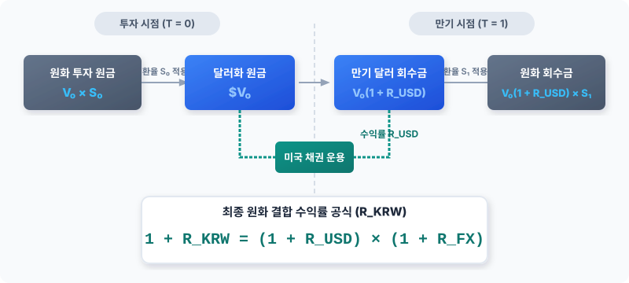

# 1.1 해외 채권 투자 시 환 위험의 본질

## 도입
글로벌 자산배분 관점에서 해외 채권, 특히 미국 국채는 포트폴리오의 안정성을 지탱하는 핵심 축으로 여겨집니다. "미국 정부가 망하지 않는 한 원금과 이자가 보장된다"는 명제는 채권 자체만 보면 완전히 참입니다. 그러나 한국에 거주하며 원화로 생활하는 한국인 투자자에게도 이 명제가 동일하게 성립할까요? 

해외 채권 투자의 가장 큰 함정은 **‘달러(USD) 기준의 안전함’이 결코 ‘원화(KRW) 기준의 안전함’을 보장하지 않는다**는 점에 있습니다. 본 절에서는 해외 채권 투자 시 발생하는 환 위험의 본질을 구체적인 숫자를 통해 정밀하게 추적하고, 고정금리 자산인 채권이 환율과 결합할 때 어떻게 변동성 자산으로 돌변하는지 그 물리적 메커니즘을 규명하는 것을 목표로 합니다.

---

## 본론

### 1. 구체적 수치로 보는 환율 변동의 영향 (수치 패턴 먼저)
이해를 돕기 위해 아주 단순하고 직관적인 가상의 투자 시나리오를 설계해 보겠습니다. 

*   **투자 대상:** 만기 1년, 표면금리(쿠폰) 연 5.0%의 미국 국채 (만기 일시 지급)
*   **투자 원금:** \$1,000
*   **투자 시점 환율 ($S_0$):** 1,300원/달러
*   **초기 원화 투자금:** 1,300,000원 (\$1,000 $\times$ 1,300원)

1년 뒤 만기가 되었을 때, 투자자가 받는 달러화 금액은 원금 \$1,000와 이자 \$50를 합친 **총 \$1,050**로 완벽하게 고정되어 있습니다. 달러 기준 수익률은 예외 없이 정확히 **연 5.0%**입니다. 

이제 1년 뒤 만기 시점의 환율($S_1$) 시나리오에 따라 투자자가 실제로 손에 쥐게 되는 원화 금액과 최종 원화 수익률을 계산해 보겠습니다.

| 만기 시 환율 ($S_1$) | 환율 변동률 | 만기 시 원화 회수금 (\$1,050 $\times S_1$) | 최종 원화 수익률 (원화 기준) |
| :--- | :--- | :--- | :--- |
| **1,430원 (원화 약세)** | +10.0% | 1,501,500원 | **+15.5%** |
| **1,365원 (원화 약세)** | +5.0% | 1,433,250원 | **+10.25%** |
| **1,300원 (환율 불변)** | 0.0% | 1,365,000원 | **+5.0%** |
| **1,235원 (원화 강세)** | -5.0% | 1,296,750원 | **-0.25%** |
| **1,170원 (원화 강세)** | -10.0% | 1,228,500원 | **-5.5%** |

위 표에서 직관적으로 드러나는 변동의 규칙성은 다음과 같습니다.
*   달러화 기준으로는 분명히 단 1센트의 손실도 없이 연 5%의 약속된 이자를 받았음에도 불구하고, 원화 기준 수익률은 환율 움직임에 따라 **최대 +15.5%에서 최소 -5.5%까지 극단적으로 널뛰기**를 합니다.
*   특히 환율이 단 5% 하락(원화 가치 상승)했을 뿐인데, 원화 기준 수익률은 -0.25%로 돌아섭니다. 채권 이자로 벌어들인 견고한 수익(5%)을 환차손(-5%)이 통째로 갉아먹고 오히려 원금 손실을 발생시킨 것입니다.

<iframe src="contents/fx_hedge_strategy_01/sec_01/assets/diagrams/sub_01_01_visual1.html" width="100%" height="450px" frameborder="0" scrolling="yes"></iframe>

---

### 2. 친숙한 개념에서 공식으로의 연결 (수식 유도)
방금 우리가 표를 통해 확인한 직관적 규칙을 수학적 공식으로 정립해 보겠습니다. 우리가 고등학교 수학이나 기초 재무학에서 배우는 단순 수익률 계산식에서 출발합니다.

원화 표시 최종 수익률($R_{KRW}$)은 다음과 같이 정의됩니다.

$$R_{KRW} = \frac{\text{만기 시 원화 회수금} - \text{초기 원화 투자금}}{\text{초기 원화 투자금}}$$

이를 달러화 표시 채권 수익률($R_{USD}$)과 환율 변동률($R_{FX}$)의 관계로 치환하기 위해 각 변수를 정의해 보겠습니다.
*   $V_0$: 최초 달러 표시 투자 원금 (예시의 \$1,000)
*   $S_0$: 투자 시점의 환율 (원/달러)
*   $S_1$: 만기 시점의 환율 (원/달러)
*   $R_{USD}$: 채권 수익률 (달러 기준)
*   $R_{FX}$: 환율 변동률 ($\frac{S_1 - S_0}{S_0}$)

자금의 흐름에 따라 수식을 단계별로 유도하면 다음과 같습니다.

1.  **초기 원화 투자금**은 최초 달러 원금에 투자 시점 환율을 곱한 값입니다.
    $$\text{초기 원화 투자금} = V_0 \times S_0$$

2.  **만기 달러 회수금**은 달러 기준 채권 수익률($R_{USD}$)이 반영된 금액입니다.
    $$\text{만기 달러 회수금} = V_0 \times (1 + R_{USD})$$

3.  **만기 시 원화 회수금**은 만기 달러 회수금을 만기 시점 환율 $S_1$으로 환전한 값입니다.
    $$\text{만기 시 원화 회수금} = V_0 \times (1 + R_{USD}) \times S_1$$

4.  이때 $S_1 = S_0 \times (1 + R_{FX})$ 이므로, 이를 대입하면 다음과 같이 정리됩니다.
    $$\text{만기 시 원화 회수금} = V_0 \times S_0 \times (1 + R_{USD})(1 + R_{FX})$$

이제 원화 표시 최종 수익률($R_{KRW}$) 공식에 위 값들을 대입합니다.

$$1 + R_{KRW} = \frac{\text{만기 시 원화 회수금}}{\text{초기 원화 투자금}} = \frac{V_0 \times S_0 \times (1 + R_{USD})(1 + R_{FX})}{V_0 \times S_0}$$

분모와 분자의 $V_0 \times S_0$를 약분하면 매우 직관적인 결합 수익률 관계식이 도출됩니다.

$$1 + R_{KRW} = (1 + R_{USD})(1 + R_{FX})$$

$$R_{KRW} = R_{USD} + R_{FX} + (R_{USD} \times R_{FX})$$

이 공식이 바로 해외 자산 투자 시 반드시 기억해야 할 **‘결합 수익률 공식’**입니다. 

여기서 우변의 마지막 항인 $(R_{USD} \times R_{FX})$는 **'교차항(Cross-product Term)'**이라고 부르며, **"채권으로 번 이자 부분에도 환율 변동이 적용된다"**는 물리적 의미를 갖습니다. 대개의 경우 이 교차항의 크기는 매우 작으므로(예: $0.05 \times 0.05 = 0.0025$), 실무에서는 생략하여 다음과 같이 합산 근사치로 이해해도 무방합니다.

$$R_{KRW} \approx R_{USD} + R_{FX}$$

**물리적 해석:** 원화 표시 최종 수익률은 **‘채권 자체의 이자율’**이라는 물리적 움직임에 **‘환율 변동’**이라는 또 다른 물리적 움직임이 단순히 더해지는 구조입니다. 즉, 환율 변동은 채권 수익률을 위아래로 평행이동시키는 거대한 ‘소거 또는 증폭 장치’로 작동합니다.

---

### 3. 손익분기 환율(Break-even Exchange Rate)의 계산
해외 채권 투자를 결정할 때 가장 실무적으로 중요한 기준점은 **"환율이 최소한 어디까지 떨어져도 원금 손실을 보지 않는가?"** 즉, 손익분기 환율을 구하는 것입니다.

원화 환산 수익률 $R_{KRW}$가 정확히 $0$이 되는 한계 환율 변동률($R_{FX}^*$)을 유도해 보겠습니다.

$$1 + 0 = (1 + R_{USD})(1 + R_{FX}^*)$$

$$1 + R_{FX}^* = \frac{1}{1 + R_{USD}}$$

$$R_{FX}^* = \frac{1}{1 + R_{USD}} - 1 = -\frac{R_{USD}}{1 + R_{USD}}$$

이 공식은 채권의 이자율($R_{USD}$)이 높을수록 환율 하락(원화 강세)에 견딜 수 있는 방어막(Buffer)이 얼마나 두터워지는지를 직관적으로 보여줍니다.

앞서 다룬 시나리오(만기 1년, 연 5% 미국 국채, 초기 환율 1,300원)를 이 공식에 그대로 대입해 검증해 보겠습니다.

$$R_{FX}^* = -\frac{0.05}{1.05} \approx -0.0476 \quad (-4.76\%)$$

즉, 환율이 최초 1,300원 대비 **$-4.76\%$** 이내로 하락해야 원금 손실을 면할 수 있습니다. 이를 구체적인 환율 수치($S_1^*$)로 계산해 보겠습니다.

$$S_1^* = S_0 \times (1 + R_{FX}^*) = 1,300 \times (1 - 0.047619) \approx 1,238.10\text{원}$$

*   **결론:** 만기 시 환율이 **1,238.10원**보다 아래로 내려가면, 투자자는 미국 정부로부터 약속된 이자 5%를 정상적으로 수령하더라도 원화 기준으로는 최종 손실을 입게 됩니다.

---

### 4. 실패 사례 vs 성공(통제) 사례 대조
환 위험을 통제하지 않았을 때(노헤지)의 실패 사례와 이를 적절히 인지하고 통제했을 때의 차이를 동일한 시나리오로 대조해 보겠습니다.

#### [실패 사례: 은퇴 생활자 A씨의 이자 수익 소멸]
*   **상황:** 은퇴자 A씨는 매년 5%의 안정적인 이자 소득을 기대하고 유산 13억 원(당시 환율 1,300원/달러 기준으로 \$1,000,000)을 미국 국채에 투자했습니다. 달러화 기준으로 매년 \$50,000(원화 약 6,500만 원 상당)의 이자가 나오므로 생활비로 쓰기에 충분하다고 판단했습니다.
*   **결과:** 1년 뒤 미국 국채는 정상적으로 이자를 지급했으나, 환율이 1,200원으로 7.7% 하락했습니다. 이는 손익분기 환율인 1,238.10원을 상당 폭 하회하는 수치입니다. 원화로 환산한 A씨의 총자산은 12억 6,000만 원이 되었습니다. 이자를 또박또박 받았음에도 불구하고, 원화 기준 원금은 오히려 4,000만 원이나 감소하는 참담한 결과를 맞이했습니다. '안전 자산'에 투자했다는 믿음이 환율이라는 변수에 의해 깨진 것입니다.

#### [성공(통제) 사례: 기관 투자자 B사의 위험 분리]
*   **상황:** B사는 동일한 미국 국채에 투자하면서 **"자산 자체의 위험"**과 **"통화의 위험"**을 엄격히 분리하기로 결정했습니다. 채권의 이자 5%는 취하되, 환율 변동률($R_{FX}$)을 0에 가깝게 고정하는 환 헤지(FX Hedging) 계약을 체결했습니다.
*   **결과:** 1년 뒤 환율이 1,200원으로 폭락했음에도 불구하고, B사는 사전 계약된 환율(예: 1,300원 근처)로 달러를 원화로 환산하여 안정적으로 연 5%에 육박하는 원화 수익을 실현했습니다.

두 사례의 대비는 **해외 채권 투자의 성패가 채권 분석력(금리 예측)이 아니라 환율 위험을 어떻게 다루느냐에 달려 있음**을 방증합니다.

---

### 5. 자산 변동성과 환율 변동성의 비대칭성
"주식도 환율 영향을 받는데, 왜 유독 채권 투자에서 환 위험이 더 본질적인 문제가 될까요?" 

그 해답은 **변동성의 체급 차이**에 있습니다. 주식과 채권, 그리고 환율의 역사적 변동성 크기를 비교해 보면 그 이유가 명확해집니다.

<iframe src="contents/fx_hedge_strategy_01/sec_01/assets/diagrams/sub_01_01_visual2.html" width="100%" height="450px" frameborder="0" scrolling="yes"></iframe>

*   **해외 주식 투자:** 주식 자체의 연간 기대수익률과 변동성(예: $\pm 18\%$)이 환율 변동성(예: $\pm 10\%$)보다 훨씬 큽니다. 즉, 환율이 조금 움직여도 주가가 폭등하거나 폭락하면 전체 수익률의 방향성은 주식이 결정합니다. 환율은 ‘조연’에 그칩니다.
*   **해외 채권 투자:** 채권 자체의 기대수익률과 변동성(예: $\pm 4\%$)은 환율 변동성(예: $\pm 10\%$)보다 훨씬 작습니다. 즉, 배보다 배꼽이 더 큰 상황이 발생합니다. 주인공인 채권 이자율은 얌전히 있는데, 조연인 환율이 무대를 뒤흔들며 전체 수익률의 멱살을 잡고 흔드는 꼴입니다.

결국, 환 헤지를 하지 않은 해외 채권 투자는 **‘채권 투자’라기보다는 사실상 ‘달러 환투기’에 가깝다**는 것이 금융공학적인 결론입니다.

---

### [회계 팁] 일반기업회계기준(K-GAAP)에서의 외화채권 평가
기업이 해외 채권에 투자할 경우, 일반기업회계기준에 따라 기말 결산 시점에 해당 외화 자산을 평가해야 합니다. 
해외 채권은 **외화화폐성자산**에 해당하므로, 보고기간 말의 **마감환율(Closing Rate)**로 환산해야 합니다. 이때 발생하는 환율 변동 효과는 자산의 장부금액을 조정함과 동시에 **외화평가손익(당기손익)**으로 손익계산서에 즉시 반영됩니다. 즉, 환 위험은 실현되지 않은 평가 단계에서도 기업의 당기순이익에 직접적인 변동성을 유발합니다.

---

## 요약

1.  **환율의 종속성:** 해외 채권 투자 시 원화 기준 수익률($R_{KRW}$)은 채권 고유 수익률($R_{USD}$)과 환율 변동률($R_{FX}$)의 곱으로 결정됩니다. ($R_{KRW} = R_{USD} + R_{FX} + R_{USD}R_{FX}$)
2.  **원금 보장의 역설:** 달러화 기준 신용위험이 없는 미국 국채라 할지라도, 환율이 하락하면 원화 기준으로는 심각한 원금 손실을 입을 수 있습니다.
3.  **손익분기 환율의 실무성:** 투자 대상 채권의 금리가 높을수록 환율 하락(원화 강세)에 견딜 수 있는 방어 한계선인 손익분기 환율($R_{FX}^* = -\frac{R_{USD}}{1+R_{USD}}$)이 낮아져 안전성이 보강됩니다.
4.  **변동성의 비대칭성:** 채권 변동성(4%)보다 환율 변동성(10%)이 훨씬 크기 때문에, 환 위험을 통제하지 않은 해외 채권 투자는 채권의 안정적 성격을 완전히 상실하고 고위험 자산으로 변모합니다.