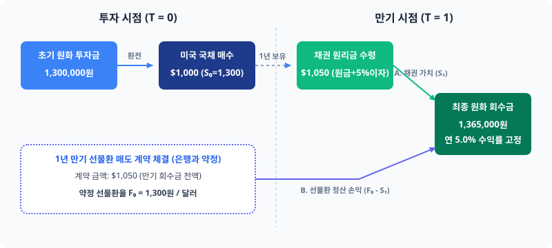

# 1.2 선물환 매도를 통한 헤지 메커니즘

## 도입
앞서 [1.1 해외 채권 투자 시 환 위험의 본질]에서 우리는 미국 국채라는 안전 자산에 투자하더라도, 환율 변동성($8\% \sim 12\%$)이 채권 자체의 변동성($3\% \sim 5\%$)을 압도하여 포트폴리오를 흔들어버리는 '배보다 배꼽이 더 큰' 현상을 확인했습니다. 환율이라는 조연이 무대를 장악하고 해외 채권 투자를 사실상 '달러 환투기'로 변질시키는 것을 막으려면, 환율의 움직임을 완전히 제어할 수 있는 정교한 장치가 필요합니다.

이때 기관 투자자들이 자산의 성격을 외화 표시 자산에서 원화 표시 자산으로 바꾸기 위해 가장 보편적으로 사용하는 금융 도구가 바로 **선물환(Forward) 계약**입니다. 본 절에서는 선물환 매도 계약이 어떻게 환율 변동에 따른 손실을 철저하게 방어하는지, 그리고 왜 이 계약이 '대칭적 속성'을 가져 환차익까지도 동시에 소거하는지 그 구체적인 작동 메커니즘을 상세히 파헤쳐 봅니다.

---

## 본론

### 1. 구체적 수치로 보는 선물환 헤지의 메커니즘 (수치 패턴 먼저)
이해를 돕기 위해, 1.1절에서 다루었던 미국 국채 투자 시나리오의 수치를 그대로 재소환하여 환 헤지를 결합해 보겠습니다.

*   **투자 대상:** 만기 1년, 표면금리(쿠폰) 연 5.0%의 미국 국채
*   **투자 원금:** \$1,000
*   **투자 시점 환율 ($S_0$):** 1,300원/달러
*   **초기 원화 투자금:** 1,300,000원 (\$1,000 $\times$ 1,300원)
*   **만기 시점 달러 회수금:** \$1,050 (원금 \$1,000 + 이자 \$50)

여기서 투자자는 1년 뒤 달러화 가치가 하락할 위험(원화 강세)을 방어하기 위해, 투자 시점에 은행과 다음과 같은 **선물환 매도 계약**을 체결합니다.
*   **선물환율 ($F_0$):** 1,300원/달러 (원활한 메커니즘 이해를 위해 초기 시장 환율과 동일하다고 가정)
*   **계약 금액:** \$1,050
*   **만기:** 1년 뒤 (채권 만기와 일치)

이 계약의 의미는 단순합니다. **"1년 뒤 시장 환율이 얼마가 되든 상관없이, 나는 은행에 \$1,050를 주고 그 대가로 달러당 1,300원(총 1,365,000원)을 받겠다"**고 미리 약속하는 것입니다. 계약 시점에는 단 1원의 현금도 오가지 않으며, 오직 '미래 거래에 대한 약속'만 성립됩니다.

이제 1년 뒤 만기 시점의 환율($S_1$) 시나리오별로 채권 투자에서 발생하는 원화 가치와 선물환 계약에서 발생하는 정산 손익을 매칭해 보겠습니다.

| 만기 시 환율 ($S_1$) | 환율 변동률 | (A) 채권 회수금의 원화 가치 (\$1,050 $\times S_1$) | (B) 선물환 계약 정산 손익 (\$1,050 $\times [F_0 - S_1]$) | 최종 원화 회수금 (A + B) | 최종 원화 수익률 (원화 기준) |
| :--- | :--- | :--- | :--- | :--- | :--- |
| **1,430원 (원화 약세)** | +10.0% | 1,501,500원 | **-136,500원** | 1,365,000원 | **+5.0%** |
| **1,365원 (원화 약세)** | +5.0% | 1,433,250원 | **-68,250원** | 1,365,000원 | **+5.0%** |
| **1,300원 (환율 불변)** | 0.0% | 1,365,000원 | **0원** | 1,365,000원 | **+5.0%** |
| **1,235원 (원화 강세)** | -5.0% | 1,296,750원 | **+68,250원** | 1,365,000원 | **+5.0%** |
| **1,170원 (원화 강세)** | -10.0% | 1,228,500원 | **+136,500원** | 1,365,000원 | **+5.0%** |

위 표에서 도출되는 수치적 패턴은 대단히 직관적이며 강력합니다.
*   환율이 1,170원까지 폭락하여 채권 자체의 원화 평가액(A)이 1,228,500원으로 떨어지더라도, 선물환 계약에서 정확히 +136,500원의 평가 이익(B)이 발생해 손실을 메워줍니다.
*   반대로 환율이 1,430원까지 폭등하여 채권의 원화 평가액(A)이 1,501,500원으로 늘어나면, 선물환 계약에서 정확히 -136,500원의 평가 손실(B)이 발생해 이익을 깎아냅니다.
*   그 결과, 어떤 환율 시나리오에서도 최종 원화 회수금은 **1,365,000원으로 완벽히 고정**되며, 최종 원화 수익률 역시 시장 환율 변동과 무관하게 최초 약속된 연 **5.0%**로 고정됩니다.

<iframe src="contents/fx_hedge_strategy_01/sec_01/assets/diagrams/sub_01_02_visual1.html" width="100%" height="550px" frameborder="0" scrolling="no"></iframe>

---

### 2. 친숙한 개념에서 공식으로의 연결 (수식 유도와 물리적 소거)
위 표에서 나타난 완벽한 상쇄 효과의 수학적 필연성을 공식으로 증명해 보겠습니다.

우선, 선물환 매도 계약이란 미래의 특정 시점에 약정된 환율($F_0$)로 외화를 매도(Short)하는 계약입니다. 따라서 만기 시점($T=1$)에 계약 상대방으로부터 받게 되는 선물환 정산 손익($\Pi_{forward}$)은 다음과 같이 정의됩니다.

$$\Pi_{forward} = \text{계약 외화 금액} \times (F_0 - S_1)$$

이때 우리가 헤지하고자 하는 대상은 해외 채권 만기 시의 원화 회수금($CF_{bond}$)입니다.

$$CF_{bond} = \text{계약 외화 금액} \times S_1$$

선물환 계약을 결합한 전체 포트폴리오의 최종 원화 현금흐름($CF_{total}$)은 이 두 현금흐름의 단순 합산입니다.

$$CF_{total} = CF_{bond} + \Pi_{forward}$$

$$CF_{total} = (\text{계약 외화 금액} \times S_1) + \left[ \text{계약 외화 금액} \times (F_0 - S_1) \right]$$

이 식에서 공통인수인 '계약 외화 금액'을 묶어내면 다음과 같이 깔끔하게 정리됩니다.

$$CF_{total} = \text{계약 외화 금액} \times \left[ S_1 + (F_0 - S_1) \right]$$

괄호 안의 변수들을 정리하면 불확실성의 영역이었던 미래의 만기 시점 환율 $S_1$과 $-S_1$이 서로를 밀어내며 완벽히 소거됩니다.

$$CF_{total} = \text{계약 외화 금액} \times F_0$$

**물리적 해석:** 
여기서 덧셈과 뺄셈을 통한 변수의 소거는 단순한 수학적 기교가 아닙니다. 만기 시점에 무작위로 움직일 수 있는 미래 환율 $S_1$이라는 **"통제 불가능한 외생 변수(불확실성)"를 포트폴리오의 물리적 계(System)에서 완전히 지워버리는 소거 장치**로 작동하는 것입니다. 최종 공식에 $S_1$이 존재하지 않는다는 것은, 이 포트폴리오의 가치가 미래 환율의 향방에 눈곱만큼도 영향을 받지 않는 완전한 무위험(Risk-free) 상태가 되었음을 뜻합니다.

---

### 3. 현실의 세밀한 균열: 왜 실제 원화 수익률은 채권 금리와 다를까? (환헤지 비용의 도입)
위의 이상적인 모델에서는 선물환율($F_0$)과 초기 현물환율($S_0$)을 1,300원으로 동일하다고 가정했기 때문에 최종 원화 수익률이 채권의 표면 금리와 정확히 일치하는 연 5.0%가 되었습니다. 하지만 현실 세계에서 두 환율이 일치하는 경우는 극히 드룹니다.

만약 투자 시점에 1년 만기 선물환율($F_0$)이 **1,290원/달러**로 고시되었다고 가정해 보겠습니다. 이 수치를 대입하면 최종 원화 회수금은 다음과 같이 변경됩니다.

$$\text{최종 원화 회수금} = \$1,050 \times 1,290\text{원} = 1,354,500\text{원}$$

초기 투자금이 1,300,000원이었으므로, 실제 최종 원화 수익률($R_{KRW}$)을 계산해 보면 다음과 같습니다.

$$R_{KRW} = \frac{1,354,500 - 1,300,000}{1,300,000} \approx +4.19\%$$

미국 국채의 금리는 분명 연 5.0%인데, 환헤지를 거치자 최종 수익률은 **연 4.19%**로 낮아졌습니다. 이 사라진 **0.81%p**의 차이는 어디로 간 것일까요?

이 현상을 이해하기 위해 현물환율과 선물환율의 격차인 **스왑포인트(Swap Point)**의 개념을 도입해야 합니다.

$$\text{스왑포인트} = F_0 - S_0 = 1,290\text{원} - 1,300\text{원} = -10\text{원}$$

초기 환율 대비 선물환율이 달러당 10원 낮게 책정됨에 따라 발생하는 이 손실을 **'환헤지 비용(Hedge Cost)'**이라고 부릅니다. 두 나라 간의 금리 차이에 의해 선물환율이 현물환율보다 낮게 설정되면서 발생하는 이 비용은 환 위험을 원천 차단하기 위해 투자자가 시장에 지불해야 하는 일종의 보험료인 셈입니다. (이 구체적인 결정 공식은 다음 장인 '금리평가설(IRP)'에서 자세히 다룹니다.)

---

### 4. 실패 사례 vs 성공 사례 대조: 헤지의 대칭성과 기회비용
환 헤지는 단순히 '위험을 없애는 마법의 방패'가 아닙니다. 선물환 매도 헤지는 철저히 **대칭적 구조**를 가지고 있습니다. 즉, 환손실을 막아주는 만큼 **환차익의 가능성도 완벽하게 박탈**합니다. 많은 초보 투자자나 기업 경영진이 이 대칭성을 망각하여 헤지 실행 후 후회하는 실패 사례를 남기곤 합니다.

#### [실패 사례: 환율 상승기, 경영진의 '선물환 평가손실' 불만]
*   **상황:** 중소기업 C사는 미국 국채에 \$1,000,000를 투자하면서 환율 하락을 우려해 1,300원에 선물환 매도 계약을 체결했습니다.
*   **결과:** 1년 뒤, 예상과 달리 환율이 1,450원으로 급등했습니다. 채권 자체에서는 큰 환차익이 발생했지만, 선물환 계약에서는 대규모 평가손실(달러당 -150원, 총 -1억 5천만 원 상당)이 계상되었습니다. 
*   **회계적 충격:** 일반기업회계기준(K-GAAP)에 따라 선물환 계약은 만기 전이라도 매 분기말 공정가치로 평가되어 재무제표에 **'파생상품평가손실(당기손익)'**로 즉각 반영됩니다. 비록 채권의 환가치 상승(외화환산이익)으로 상쇄되더라도, 손익계산서 상에 거대한 파생상품 손실이 단독으로 부각되자 경영진은 "쓸데없이 헤지를 해서 돈을 날렸다"며 담당자를 질책하는 우를 범하게 됩니다. 이는 헤지의 대칭성을 망각하고 '환차익 기회비용'을 실제 손실로 오인한 대표적 실패 사례입니다.

#### [성공(통제) 사례: 명확한 기준 하의 리스크 통제]
*   **상황:** 기관 투자자 D사는 해외 채권 투자 목적을 '연 5%의 고정 금리 획득'으로 확고히 정의했습니다. 
*   **결과:** 만기 시 환율이 1,450원으로 올랐음에도 불구하고, D사는 선물환 계약의 평가손실을 "채권 환차익을 실현하기 위해 지불한 정상적인 헤지 비용"으로 당연하게 수용했습니다. 반대로 환율이 1,150원으로 폭락했을 때도 의연하게 약속된 목표 수익을 달성했습니다. 
*   **철학적 결론:** 선물환 매도 헤지는 수익을 극대화하는 도구가 아닙니다. **"예측할 수 없는 시장의 도박판에서 내 자산을 격리시켜, 원래 목표로 했던 비즈니스나 채권 본연의 이자 수익에만 집중하겠다"**는 의사결정의 결과물입니다.

---

### 5. [회계 팁] 일반기업회계기준(K-GAAP)에서의 선물환 헤지 회계 처리
국내 기업이나 기관 투자자가 선물환 매도를 실행할 때, 회계 처리는 **일반기업회계기준(제17장 파생상품)**을 따릅니다. 선물환 계약의 완전한 시스템적 이해를 위해 이들의 평가와 정산 방식을 짚고 넘어갈 필요가 있습니다.

1.  **공정가치 평가:** 선물환 계약은 거래 시점에는 증거금 외에 별도의 현금 유출입이 없는 계약(공정가치 = 0)이지만, 이후 환율 변동에 따라 매 보고기간 말에 평가를 수행합니다.
    *   만기 환율($S_1$)이 계약 선물환율($F_0$)보다 낮아지면: **파생상품자산** 증가 / **파생상품평가이익(당기손익)** 인식
    *   만기 환율($S_1$)이 계약 선물환율($F_0$)보다 높아지면: **파생상품부채** 증가 / **파생상품평가손실(당기손익)** 인식
2.  **위험회피회계(Hedge Accounting) 적용:** 만약 이 선물환 계약이 해외 채권의 환율 변동 위험을 회피하기 위한 것임을 입증하고 '위험회피 지정 요건'을 충족한다면, **공정가치 위험회피** 회계를 적용할 수 있습니다. 이 경우 채권에서 발생하는 외화환산손익과 선물환 계약에서 발생하는 파생상품평가손익이 당기손익에서 정확히 대칭적으로 상쇄되어, 기업의 손익계산서 변동성을 최소화하는 완벽한 완결성을 보여줍니다.

<iframe src="contents/fx_hedge_strategy_01/sec_01/assets/diagrams/sub_01_02_visual2.html" width="100%" height="450px" frameborder="0" scrolling="no"></iframe>

---

## 요약

1.  **선물환 매도 헤지의 본질:** 미래에 회수할 외화 자산(\$1,050)의 환율을 현재 시점에 선물환율($F_0$)로 미리 고정하여, 미래 환율 변동성($S_1$)을 수학적으로 완전히 소거하는 기법입니다.
2.  **대칭적 상쇄:** 환율 하락 시 발생하는 환차손을 선물환 이익이 정확히 메워주지만, 반대로 환율 상승 시 발생하는 환차익 역시 선물환 손실로 인해 완전히 상쇄됩니다. ($CF_{total} = \text{외화 가치} \times F_0$)
3.  **환헤지 비용의 인지:** 현물환율과 선물환율의 차이(스왑포인트)로 인해 발생하는 환헤지 비용을 고려해야 하며, 이는 양국 간의 금리 차이에 의해 사전에 결정됩니다.
4.  **위험회피회계의 완결성:** 일반기업회계기준(K-GAAP)에 따라 공정가치 위험회피회계를 적용하면 채권의 외화환산손익과 파생상품평가손익이 손익계산서 상에서 대칭적으로 상쇄되어 장부상 변동성이 완벽하게 통제됩니다.