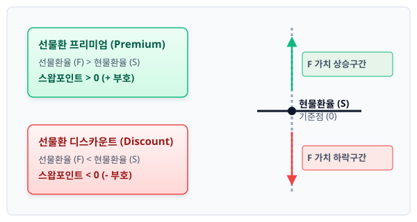

# 2장. 헤지 비용의 구조: 스왑포인트

## 2.1 스왑포인트의 정의

---

### 도입

기업이 해외 시장과 거래하거나 외화 자산을 보유할 때 가장 먼저 맞닥뜨리는 위험은 '환율 변동성'입니다. 오늘 1달러에 1,300원인 환율이 3개월 뒤 대금을 결제할 때 1,200원으로 떨어지거나 1,400원으로 치솟을지 아무도 장담할 수 없습니다. 

이러한 불확실성을 제거하기 위해 기업은 미래 특정 시점의 환율을 미리 고정하는 **선물환(Forward) 계약**을 체결합니다. 이때 기준이 되는 오늘 현재의 환율을 **현물환율(Spot Rate)**이라 하고, 미래의 약정 환율을 **선물환율(Forward Rate)**이라고 합니다. 

이 두 환율은 대개 일치하지 않으며, 그 차이를 결정하는 핵심 요소가 바로 **스왑포인트(Swap Point)**입니다. 이번 절에서는 스왑포인트의 수학적·시장적 정의를 살펴보고, 이것이 왜 발생하는지 직관적인 비유와 구체적인 수치 예시를 통해 학습해 보겠습니다.

---

### 1. 구체적 수치로 보는 현물환과 선물환의 격차

개념을 공식으로 정의하기 전에, 실제 외환시장에서 거래되는 구체적인 수치를 통해 규칙성을 먼저 발견해 보겠습니다. 

한국의 수입기업 A사가 3개월 뒤 미국 수출기업에 1,000,000달러(USD)를 지급해야 하는 상황을 가정합니다. 오늘 외환시장에 고시된 환율과 은행이 제시한 3개월 만기 선물환율은 다음과 같습니다.

*   **오늘 현재 현물환율 ($S$):** $1,300.00$원/달러
*   **시나리오 A (3개월물 선물환율 $F_A$):** $1,305.20$원/달러
*   **시나리오 B (3개월물 선물환율 $F_B$):** $1,293.50$원/달러

이 두 시나리오에서 현물환율과 선물환율의 관계를 표로 대조해 보겠습니다.

| 구분 | 현물환율 ($S$) | 선물환율 ($F$) | 단순 차이 ($F - S$) | 필요한 원화 금액의 차이 (100만 달러 기준) |
| :--- | :--- | :--- | :--- | :--- |
| **시나리오 A** | $1,300.00$원 | $1,305.20$원 | $+5.20$원 | $+5,200,000$원 (추가 부담) |
| **시나리오 B** | $1,300.00$원 | $1,293.50$원 | $-6.50$원 | $-6,500,000$원 (비용 절감) |

위 표에서 알 수 있듯이, 미래의 환율을 고정할 때 오늘 환율보다 더 비싼 가격을 치러야 할 수도 있고(시나리오 A), 오히려 더 저렴한 가격으로 고정할 수도 있습니다(시나리오 B). 

이처럼 **선물환율과 현물환율 사이에 존재하는 가격의 괴리($F - S$)**를 외환시장에서는 **스왑포인트(Swap Point)**라고 부릅니다. 

---

### 2. 스왑포인트의 수학적 정의와 호가 단위

스왑포인트를 수식으로 정의하면 다음과 같습니다.

$$\text{스왑포인트} = \text{선물환율}(F) - \text{현물환율}(S)$$

이 식을 선물환율 기준으로 정리하면 아래와 같습니다.

$$F = S + \text{스왑포인트}$$

즉, 미래의 환율($F$)은 오늘 환율($S$)에 시간의 흐름에 따른 가치 조정분인 '스왑포인트'를 더해서 결정됩니다.

#### 스왑포인트의 표기법: 만분의 일(Point) 단위
실제 외환 딜러들이 사용하는 호가 화면에서 스왑포인트는 원화 단위(원)가 아닌 **'포인트(Point)'** 단위로 표시됩니다. 원/달러 환율에서 1포인트는 소수점 둘째 자리($0.01$원)를 의미합니다. 원화 환율의 최소 호가 단위이자 소수점 둘째 자리를 뜻하는 1포인트를 수식화하면 다음과 같습니다.

$$\text{스왑포인트(Point)} = (F - S) \times 100$$

이 규칙을 앞선 두 시나리오에 적용해 보겠습니다.

*   **시나리오 A의 차이 ($+5.20$원):** $(1,305.20 - 1,300.00) \times 100 =$ **$+520$포인트** (또는 $+520$ pip)
*   **시나리오 B의 차이 ($-6.50$원):** $(1,293.50 - 1,300.00) \times 100 =$ **$-650$포인트** (또는 $-650$ pip)

따라서 은행에서 "3개월물 스왑포인트가 520포인트입니다"라고 고시했다면, 3개월 만기 선물환율은 현물환율보다 $5.20$원이 높다는 뜻이 됩니다.

<iframe src="contents/fx_hedge_strategy_01/sec_02/assets/diagrams/sub_02_01_visual1.html" width="100%" height="520px" frameborder="0" scrolling="yes"></iframe>

---

### 3. 친숙한 개념으로의 연결: 보관료와 이자의 경제학

"왜 3개월 뒤에 달러를 바꾸는데 오늘 환율과 똑같이 적용해 주지 않고, 굳이 더 비싸게 하거나 싸게 하는 걸까?"라는 의문이 생길 수 있습니다. 이를 일상적인 거래의 원리로 치환해 이해해 보겠습니다.

> **[일상 비유: 쌀 1가마니 예약 거래]**
> * **오늘 즉시 구매 가격:** 10만 원
> * **3개월 뒤 배달받는 예약 가격:** 10만 2천 원
> * **왜 2천 원이 더 비쌀까?** 
>   상인은 3개월 동안 쌀을 창고에 보관해야 하므로 **창고 보관료(비용)**를 판매 가격에 얹어야 합니다. 반대로 구매자는 오늘 돈을 다 치르지 않고 3개월 동안 그 돈을 은행에 넣어 **이자(수익)**를 얻을 수 있으므로, 미래에 조금 더 높은 가격을 지불하는 것이 공평합니다.

외환시장에서도 똑같은 논리가 작용합니다. 다만 이때 '보관료'와 '이자'의 역할을 하는 것이 바로 **한국과 미국의 '금리 차이(Interest Rate Differential)'**입니다.

만약 은행이 고객과 3개월 뒤에 달러를 인도하기로 계약했다면, 은행은 지금 당장 달러를 구해서 3개월 동안 예금에 넣어두거나 반대로 원화를 굴려야 합니다. 이때 한국 은행에 돈을 맡겼을 때 받는 이자와 미국 은행에 돈을 맡겼을 때 받는 이자가 서로 다르기 때문에, 그 이자 차이만큼을 선물환 가격에 정밀하게 반영해야만 어느 누구도 부당한 이익(무위험 차익)을 얻지 못하게 됩니다.

*   **원화 금리가 달러 금리보다 높다면?** 원화를 가지고 있는 것이 이득이므로, 상대적으로 매력이 떨어지는 달러의 미래 가치(선물환율)를 낮춰주어야 균형이 맞습니다. (선물환 디스카운트 발생)
*   **원화 금리가 달러 금리보다 낮다면?** 달러를 가지고 있는 것이 이득이므로, 원화의 가치를 보전하기 위해 달러의 미래 가치(선물환율)를 올려서 받아야 합니다. (선물환 프리미엄 발생)

---

### 4. 프리미엄(Premium)과 디스카운트(Discount)의 대칭적 이해

스왑포인트의 부호($+$ 또는 $-$)에 따라 외환시장에서는 선물환율의 상태를 두 가지 용어로 대칭적으로 구분합니다.

#### ① 선물환 프리미엄 (Forward Premium)
*   **정의:** 선물환율이 현물환율보다 높은 상태 ($F > S$)
*   **스왑포인트 부호:** 플러스($+$)
*   **의미:** 미래에 외화를 살 때 오늘보다 더 많은 자국 통화를 지불해야 함을 뜻합니다. 앞서 살펴본 **시나리오 A**가 이에 해당하며, 대개 자국 금리가 외화 금리보다 낮을 때 발생합니다.

#### ② 선물환 디스카운트 (Forward Discount)
*   **정의:** 선물환율이 현물환율보다 낮은 상태 ($F < S$)
*   **스왑포인트 부호:** 마이너스($-$)
*   **의미:** 미래에 외화를 살 때 오늘보다 자국 통화를 더 적게 지불해도 됨을 뜻합니다. 앞서 살펴본 **시나리오 B**가 이에 해당하며, 대개 자국 금리가 외화 금리보다 높을 때 발생합니다.

두 상태의 차이를 한눈에 볼 수 있도록 표로 비교해 보겠습니다.

| 구분 | 프리미엄 (Premium) | 디스카운트 (Discount) |
| :--- | :--- | :--- |
| **가격 관계** | 선물환율($F$) $>$ 현물환율($S$) | 선물환율($F$) $<$ 현물환율($S$) |
| **스왑포인트 부호** | **$+$ (양수)** | **$-$ (음수)** |
| **기준 수치 사례** | **시나리오 A** ($+520$ 포인트) | **시나리오 B** ($-650$ 포인트) |
| **금리 환경 역학** | 자국 금리 $<$ 상대국 금리 | 자국 금리 $>$ 상대국 금리 |
| **수입기업 결제 시** | 미래 결제 시 원화 추가 부담 필요 | 미래 결제 시 원화 비용 절감 가능 |

---

### 5. 실패 사례 vs 성공 사례 대조: 왜 스왑 거래가 필요한가?

스왑포인트를 반영한 선물환 계약이 실제 기업 경영에서 얼마나 중요한지 증명하기 위해, 앞서 제시한 수입기업 A사의 실제 비즈니스 시나리오를 대조해 보겠습니다.

*   **상황:** 3개월 뒤 미국 수출기업에 $1,000,000$달러를 송금해야 함.
*   **현재 수치:** 현물환율 $S = 1,300.00$원, 3개월물 선물환율 $F_A = 1,305.20$원 (스왑포인트 $+520$포인트 적용)

#### ❌ 실패 사례: 환리스크를 방치한 경우 (대책 없는 대기)
A사는 "스왑포인트 $5.20$원이 아깝다"라거나 "환율이 떨어질 수도 있다"는 막연한 기대감으로 아무런 조치를 취하지 않았습니다. 

3개월 뒤, 예상치 못한 미국 기준금리 인상 등의 여파로 현물환율이 $1,380.00$원으로 치솟았습니다.
*   **실제 집행된 원화 금액:** $\$1,000,000 \times 1,380.00\text{원} = 1,380,000,000\text{원}$ (13억 8,000만 원)
*   **결과:** 당초 기준 환율($1,300.00$원) 대비 **$8,000$만 원의 외환 차손**이 발생하여 기업의 영업이익이 크게 훼손되었습니다.

####  성공 사례: 스왑포인트를 수용하고 선물환 계약을 체결한 경우 (위험 통제)
A사는 오늘 시점에 스왑포인트 $+520$포인트를 반영한 3개월 선물환율 $1,305.20$원으로 달러 매수 계약을 체결했습니다.

3개월 뒤 시장 환율이 $1,380.00$원으로 폭등하든, 반대로 $1,200.00$원으로 폭락하든 상관없이 A사는 은행으로부터 약속된 가격에 달러를 인도받습니다.
*   **실제 집행된 원화 금액:** $\$1,000,000 \times 1,305.20\text{원} = 1,305,200,000\text{원}$ (13억 520만 원)
*   **결과:** 비록 오늘 현물환율보다 $520$만 원의 스왑포인트 비용(프리미엄)을 더 지불했지만, 시장 환율 폭등($1,380$원) 상황 속에서도 안정적으로 환율을 방어하여 **$7,480$만 원의 잠재적 손실을 방지**했습니다. 

이처럼 스왑포인트는 단순한 비용이 아니라, 미래의 거대한 불확실성을 통제 가능한 기회비용으로 전환해 주는 '안전장치' 역할을 합니다.

---

### 6. 일반기업회계기준(K-GAAP)에서의 스왑포인트 처리

회계 관점에서 이러한 선물환거래를 처리할 때 스왑포인트의 성격을 어떻게 규정하는지 아는 것은 매우 중요합니다.

**일반기업회계기준 제21장(파생상품회계)**에 따르면, 외화선도거래(선물환거래) 등을 평가할 때 발생하는 선물환율과 현물환율의 차이(즉, 스왑포인트 분)는 거래의 목적에 따라 다음과 같이 처리합니다.

1.  **기간 경과에 따른 구분 처리 (이자 거래 성격):**
    선물환계약 체결 시점에 발생한 선물환율과 현물환율의 차액(스왑포인트)은 계약기간 동안 **기간의 경과에 따라 예치이자 또는 차입이자 성격으로 구분하여 당기손익으로 인식**할 수 있습니다.
2.  **위험회피회계 적용 시:**
    *   **공정가치 위험회피:** 지정된 파생상품의 평가손익을 즉시 당기손익으로 인식하며, 위험회피대상자산·부채에서 발생하는 손익과 상쇄시킵니다.
    *   **현금흐름 위험회피:** 계약 기간 동안 스왑포인트 변동분 중 위험회피에 효과적인 부분은 **기타포괄손익누계액(OCI)**으로 계상한 후, 예상거래가 실제 재무제표에 영향을 미치는 시점에 당기손익으로 실현시킵니다.

---

### 요약 및 핵심 포인트

1.  **스왑포인트의 기본 공식:**
    $$\text{스왑포인트} = \text{선물환율}(F) - \text{현물환율}(S)$$
2.  **단위 환산:** 원/달러 외환시장에서 스왑포인트의 1포인트는 소수점 둘째 자리($0.01$원)를 의미합니다. 예컨대 $+520$포인트는 $+5.20$원입니다.
3.  **시장 상태의 구분:**
    *   **프리미엄 ($F > S$):** 스왑포인트가 양수($+$)인 상태로, 자국 금리가 외화 금리보다 낮을 때 주로 발생합니다.
    *   **디스카운트 ($F < S$):** 스왑포인트가 음수($-$)인 상태로, 자국 금리가 외화 금리보다 높을 때 주로 발생합니다.
4.  **발생 원인:** 스왑포인트는 양국 통화 간의 **금리 차이(Interest Rate Differential)**를 반영하여 시장 균형을 맞추기 위한 자연스러운 조정 가격입니다.
5.  **회계 처리:** 일반기업회계기준에 따라 스왑포인트는 계약 기간 동안 이자 성격으로 기간 배분하여 당기손익으로 처리하거나, 위험회피 유형에 따라 기타포괄손익(OCI) 등으로 처리합니다.