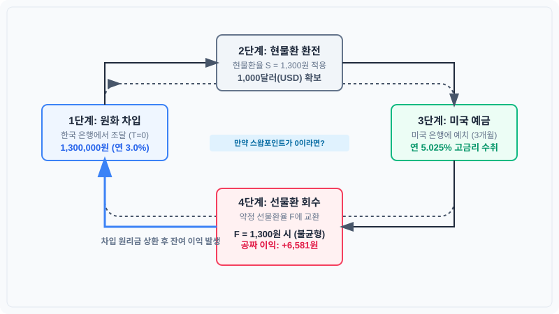

# 2장. 헤지 비용의 구조: 스왑포인트

## 2.2 금리평가이론(IRP)으로 설명하는 스왑포인트

---

### 도입

앞선 절에서 우리는 현물환율과 선물환율의 격차인 **스왑포인트**의 정의를 배웠고, 그 대표적인 예시로 선물환율이 현물환율보다 낮아진 **시나리오 B(스왑포인트 -650포인트, 즉 -6.50원)**를 살펴보았습니다. 아울러 이러한 격차가 발생하는 근본적인 배경에 양국 간의 **'금리 차이'**가 존재한다는 점을 가볍게 짚어보았습니다.

그렇다면 두 나라의 금리 차이는 정확히 어떤 수학적 비율과 경제적 논리를 거쳐 선물환율에 반영되는 것일까요? 왜 미국 금리가 한국 금리보다 높을 때, 3개월 뒤 달러를 팔기로 약속하는 선물환 계약의 가격은 오늘 당장 파는 가격보다 낮아져야만 할까요? 

이번 절에서는 금융공학의 가장 기초적이면서도 강력한 기둥인 **금리평가이론(Interest Rate Parity, IRP)**을 통해, 스왑포인트가 결정되는 시장의 '자연법칙'을 구체적인 숫자로 파헤쳐 보겠습니다. 이 과정에서 스왑포인트가 결코 인위적인 페널티나 수수료가 아니라, 시장 참여자 간의 유불리를 완벽히 상쇄하여 공평한 균형을 만드는 **'정밀한 저울'**임을 이해하게 될 것입니다.

---

### 1. 구체적 수치로 보는 무위험 재정거래(Arbitrage)와 균형의 복원

"왜 선물환율은 양국의 금리 차이를 마음대로 정하지 못하고, 수학적으로 정확히 일치시켜야만 할까?"

이 질문에 대한 답은 **'무위험 차익거래(Arbitrage)'**라는 시장의 자기정화 능력에 있습니다. 만약 선물환율이 금리 차이를 완벽히 반영하지 못하고 어긋나 있다면, 시장 참여자들은 아무런 위험 없이 공짜로 돈을 벌 수 있는 기회를 포착하게 되고, 이 자금의 대이동이 환율을 순식간에 균형점으로 되돌려 놓습니다.

이해를 돕기 위해 앞선 2.1절에서 다룬 **시나리오 B의 실제 시장 수치**를 그대로 소환해 보겠습니다.

*   **오늘 현재 현물환율 ($S$):** 1,300.00원/달러
*   **거래 기간 ($t$):** 3개월 (90일물, 연 단위 환산 시 $0.25$년)
*   **한국 연 금리 ($i_{KRW}$):** $3.00\%$
*   **미국 연 금리 ($i_{USD}$):** $5.025\%$ (미국 금리가 더 높은 '금리 역전' 상태)

#### ❌ 실패 사례: 금리 차이를 무시하고 선물환율을 현물환율과 똑같이 설정했을 때 ($F = 1,300.00$원)

만약 은행이 양국의 금리 차이를 고려하지 않고 3개월 뒤 선물환율($F$)을 오늘 환율인 1,300.00원과 똑같이 적용해 주는 실수를 범했다고 가정합시다. 기회를 포착한 투자자는 자기 돈을 한 푼도 쓰지 않고 다음과 같은 '무위험 재정거래'를 실행합니다.



1.  **원화 차입:** 한국 은행에서 1,300,000원을 연 $3.00\%$ 이율로 3개월간 빌립니다.
2.  **즉시 환전:** 빌린 1,300,000원을 오늘자 현물환율 1,300.00원에 달러로 바꾸어 1,000달러(USD)를 확보합니다.
3.  **미국 예금:** 이 1,000달러를 미국 은행에 연 $5.025\%$ 이율로 3개월간 예금합니다.
4.  **선물환 계약:** 동시에 3개월 뒤 달러 예금이 만기될 때 찾을 원리금을 원화로 안전하게 회수하기 위해, 은행과 **선물환 매도 계약($F = 1,300.00$원)**을 맺어 둡니다.

3개월 뒤 만기 시점에 이 투자자의 장부에는 어떤 결과가 남을까요?

| 구분 | 미국 달러(USD) 자산의 흐름 | 한국 원화(KRW) 부채의 흐름 |
| :--- | :--- | :--- |
| **초기 ($T=0$)** | $+1,000.00$달러 (원화 차입금 환전) | $-1,300,000$원 (원화 차입) |
| **3개월 후 ($T=3$)** | **미국 예금 만기 수령액:**<br>$1,000 \times [1 + (0.05025 \times 0.25)]$<br>$= 1,012.5625$달러 | **원화 차입금 상환액:**<br>$1,300,000 \text{원} \times [1 + (0.03 \times 0.25)]$<br>$= 1,309,750$원 |
| **선물환 실행** | $1,012.5625$달러를 약정 환율 **1,300.00원**에 전액 환전<br>$\rightarrow 1,316,331.25$원 수령 | - |
| **최종 정산** | **원화 차입금 상환 후 잔여 이익:**<br>$1,316,331.25\text{원} - 1,309,750\text{원} = \mathbf{+6,581.25\text{원}}$ |

투자자는 환율 변동 위험을 선물환으로 완벽히 통제했음에도 불구하고, 단 3개월 만에 **$+6,581.25$원**의 무위험 이익을 공짜로 취했습니다. 

이러한 거래가 가능하다면 전 세계의 투기 자금은 한국에서 원화를 빌려 미국에 예금하는 거래로 몰려들 것입니다. 이 과정에서 3개월 뒤 달러를 원화로 바꾸하려는 '선물환 매도' 주문이 시장에 폭발적으로 쌓이게 되며, 이 매도 압력은 선물환율($F$)을 무위험 이익이 완전히 사라지는 지점까지 끌어내리게 됩니다.

####  성공 사례: 무위험 차익거래가 불가능한 균형 선물환율의 형성 ($F = 1,293.50$원)

시장이 완벽한 균형을 이루어 누구도 무위험 차익을 얻지 못하려면, 미국 예금의 만기 원리금을 선물환율로 바꾼 금액이 한국 원화 차입금을 갚아야 하는 금액과 단 1원의 오차도 없이 정확히 일치해야 합니다.

$$\text{미국 달러 만기액} \times F = \text{원화 차입금 상환액}$$

$$\text{USD } 1,012.5625 \times F = 1,309,750\text{ 원}$$

이 방정식을 선물환율 $F$에 대해 풀어보겠습니다.

$$F = \frac{1,309,750\text{ 원}}{1,012.5625} \approx 1,293.50\text{ 원}$$

선물환율이 정확히 **1,293.50원**이 될 때, 두 경로의 기대수익은 한 치의 오차도 없이 동일해집니다. 이 환율이 바로 금리평가이론(IRP)이 가리키는 **'이론선물환율'**이며, 현물환율(1,300.00원)과의 격차인 **$-6.50$원(-650포인트)**이 시장의 균형 스왑포인트가 됩니다.

---

### 2. 금리평가이론(IRP)의 수학적 공식화

위에서 살펴본 구체적인 숫자의 흐름을 문자로 일반화하여 금리평가이론 공식을 유도해 보겠습니다.

$$F = S \times \frac{1 + i_{KRW} \times t}{1 + i_{USD} \times t}$$

이 공식은 단순한 나눗셈이 아닙니다. 분모와 분자는 양국 통화의 시간가치를 맞추어 주며, **"환율 변동과 이자율이라는 변수를 서로 상쇄하여 자금의 유불리를 소거하는 장치"**로 작동합니다.

*   **분모 $(1 + i_{USD} \times t)$:** 투자한 달러화 자산이 미국 시장 내에서 스스로 증식(이자 수취)하는 비율입니다. 달러의 이자율이 높을수록 분모가 커져서 선물환율($F$)을 아래로 끌어내리는 **소거 장치** 역할을 합니다.
*   **분자 $(1 + i_{KRW} \times t)$:** 원화 부채(또는 기회비용)가 한국 시장 내에서 늘어나는 비율을 뜻합니다.

#### 스왑포인트 공식의 유도와 대칭성 증명
우리가 구하고자 하는 스왑포인트($F - S$)의 수식은 위 공식의 양변에 $S$를 빼서 다음과 같이 유도할 수 있습니다.

$$F - S = S \times \frac{1 + i_{KRW} \times t}{1 + i_{USD} \times t} - S$$

$$F - S = S \times \left[ \frac{(1 + i_{KRW} \times t) - (1 + i_{USD} \times t)}{1 + i_{USD} \times t} \right]$$

$$\text{스왑포인트 } (F - S) = S \times \frac{(i_{KRW} - i_{USD}) \times t}{1 + i_{USD} \times t}$$

이 공식은 스왑포인트의 물리적 범위와 대칭적 구조를 명확히 보여줍니다.

1.  **$i_{KRW} < i_{USD}$ 인 경우 (한·미 금리 역전):**
    분자의 $(i_{KRW} - i_{USD})$가 음수($-$)가 되므로, 스왑포인트 역시 **마이너스(선물환 디스카운트)**가 됩니다.
2.  **$i_{KRW} > i_{USD}$ 인 경우 (정상 금리 환경):**
    분자의 $(i_{KRW} - i_{USD})$가 양수($+$)가 되므로, 스왑포인트는 **플러스(선물환 프리미엄)**가 됩니다.

<iframe src="contents/fx_hedge_strategy_01/sec_02/assets/diagrams/sub_02_02_visual1.html" width="100%" height="560px" frameborder="0" scrolling="yes"></iframe>

---

### 3. 직관적 해석: 거래 당사자 간 '유불리'를 상쇄하는 공평한 저울

수식의 이면을 금융 메커니즘의 관점에서 직관적으로 이해해 보겠습니다.

돈은 이자를 조금이라도 더 많이 주는 곳으로 흐르려는 성질이 있습니다. 현재 미국 금리($5.025\%$)가 한국 금리($3.00\%$)보다 높은 상황에서, 누군가 원화를 달러로 바꾸어 미국 예금에 가입한다면 그는 한국에 가만히 있었을 때보다 **더 높은 이자 수익**을 누리게 됩니다.

반대로 미래 특정 시점에 이 자금을 다시 원화로 돌려주어야 하는 계약 상대방(은행)은, 저금리인 한국 원화 자금을 조달해 고금리인 미국 달러를 제공해야 하므로 그만큼의 **이자 차이만큼 불리한 위치**에 놓이게 됩니다.

만약 미래에 달러를 원화로 바꿀 때 오늘 환율(1,300.00원) 그대로 교환해 준다면, 거래는 한쪽에만 일방적으로 유리해지고 시장의 균형은 무너집니다. 

따라서 외환시장은 선물환율을 오늘보다 6.50원 저렴한 **1,293.50원**으로 낮춤으로써 거래의 공평성을 회복합니다. 

> * "당신이 미국 달러를 굴려 얻은 **고금리 이자 이득**만큼, 만기 시 원화로 환전할 때 환율을 낮추어 적용($1,300.00 \rightarrow 1,293.50$)함으로써 **양자 간의 최종 유불리를 완전히 상쇄**하겠습니다."

이처럼 스왑포인트는 특정 투자자에게 부과하는 페널티나 징벌적 비용이 아닙니다. 양국 통화의 금리 차이로 인해 발생하는 거래 당사자 간의 기대수익 격차를 제로(0)로 수렴시키는 **'자연스럽고 공평한 교환 비율의 조정 장치'**인 것입니다.

---

### 4. 달러 매도 헤지가 수출기업에 '비용'으로 작동하는 메커니즘

이제 이 원리를 실제 수출기업의 **'환 헤지 전략'**과 연결해 보겠습니다. 

3개월 뒤에 바이어로부터 수출 대금 1,000,000달러를 받을 예정인 한국의 수출기업 B사가 있습니다. B사는 미래의 환율 변동 위험을 완전히 없애기 위해 은행과 **선물환 매도(Forward Sell) 계약**을 체결하고자 합니다.

현재 시장의 금리 차이로 인해 이론 스왑포인트는 **$-6.50$원**으로 강제되어 있습니다.

*   **현재 현물환율 ($S$):** 1,300.00원
*   **3개월 만기 약정 선물환율 ($F$):** 1,293.50원 ($-6.50$원 디스카운트 적용)

#### 기업 B사의 헤지 실행 대조

1.  **헤지를 하지 않았을 때 (3개월 뒤 환율이 현재와 같다고 가정):**
    만기에 수령한 1,000,000달러를 그 시점의 현물환율 1,300.00원에 환전하여 **1,300,000,000원**을 얻습니다. (단, 환율 하락 위험에 노출됨)
2.  **선물환 매도 헤지를 실행했을 때:**
    3개월 뒤 시장 환율이 아무리 폭락하더라도 약속된 환율 1,293.50원에 달러를 매도하여 **1,293,500,000원**을 확정적으로 얻습니다.

| 구분 | 헤지 미실행 (현물환 유지 가정) | 선물환 매도 헤지 실행 | 헤지로 인한 기회 원화 격차 |
| :--- | :--- | :--- | :--- |
| **원화 환산 금액** | 1,300,000,000원 | 1,293,500,000원 | $\mathbf{-6,500,000\text{ 원}}$ |

B사는 환율 변동의 불확실성을 완벽히 제거하는 대가로, 오늘 앉은 자리에서 달러당 6.50원, 총 **6,500,000원의 원화 회수 감소**를 감수해야 합니다. 

실무에서 이를 **'환 헤지 비용(Hedge Cost)'**이라고 부릅니다. 기업들이 흔히 오해하는 것과 달리, 이 비용은 은행이 취하는 수수료가 아닙니다. 미국의 고금리와 한국의 저금리 격차가 선물환율 하락(디스카운트)을 유발하면서 발생하는 **금리 차이의 반영분**입니다.

> **[실무적 시각의 확장]** 
> *   **수출기업 (달러 매도 헤지):** 미국 금리가 한국 금리보다 높을 때, 스왑포인트가 마이너스($-$)가 되므로 자국 통화 기준 **헤지 비용**을 지불하게 됩니다.
> *   **수입기업 또는 해외투자자 (달러 매수 헤지):** 반대로 미래에 달러를 사서 지급해야 하는 주체는 1,300.00원짜리 달러를 미래에 1,293.50원에 사기로 고정할 수 있으므로, 오히려 6.50원만큼의 **헤지 이익(Hedge Premium)**을 얻게 됩니다.

---

### 5. 일반기업회계기준(K-GAAP)에서의 스왑포인트 회계 처리

이처럼 금리 차이에 의해 발생하는 스왑포인트를 기업의 장부상에 어떻게 반영하는지 아는 것은 재무 실무에서 매우 중요합니다.

**일반기업회계기준 제21장(파생상품회계)**에 따르면, 외화선도계약(선물환)에서 발생하는 현물환율과 선물환율의 차액(스왑포인트에 해당하는 선도할인/할증 분)은 다음과 같은 두 가지 방법 중 하나로 처리하도록 규정하고 있습니다.

#### ① 기간 경과에 따른 구분 처리 (당기손익 인식)
선물환 계약 시점에 확정된 스왑포인트(선도 거래 계약 총액과 현물환율 평가 총액의 차이)를 일종의 이자 거래 성격으로 보아, **계약 기간 전체에 걸쳐 정액법 등으로 안분하여 당기손익(이자수익 또는 이자비용)으로 인식**할 수 있습니다. 

#### ② 위험회피회계(Hedge Accounting) 적용 시
기업이 환율 변동 위험을 회피할 목적으로 선물환 계약을 체결했고, 그 요건을 충족하여 위험회피회계를 적용하는 경우 거래 목적에 따라 다르게 처리됩니다.
*   **공정가치 위험회피:** 선물환 계약의 평가손익 전체를 즉시 당기손익으로 인식하며, 이는 위험회피 대상 자산·부채(예: 외화매출채권)에서 발생하는 평가손익과 손익계산서 상에서 상쇄됩니다.
*   **현금흐름 위험회피:** 미래 예상 거래의 환율 변동을 헤지하는 경우, 스왑포인트의 변동분 중 위험회피에 효과적인 부분은 당기손익으로 바로 보내지 않고 **기타포괄손익누계액(OCI, 자본항목)**으로 계상해 둡니다. 이후 실제 수출 거래가 발생하여 매출이 재무제표에 인식되는 시점에 해당 OCI 금액을 당기손익으로 실현시켜 수익과 비용을 일치시킵니다.

---

### 6. Python 코드로 구현하는 IRP 이론선물환율 및 스왑포인트 산출

실무에서 양국 금리와 현물환율을 입력받아 금리평가이론에 부합하는 이론선물환율과 스왑포인트를 산출하는 파이썬 코드 예제입니다.

```python
def calculate_irp_equilibrium(spot_rate, krw_rate, usd_rate, days):
    """
    금리평가이론(IRP)에 기초한 이론 선물환율 및 스왑포인트를 계산합니다.
    
    :param spot_rate: 현재 현물환율 (S)
    :param krw_rate: 한국 연 금리 (원화 금리, 예: 0.03 -> 3.00%)
    :param usd_rate: 미국 연 금리 (달러 금리, 예: 0.05025 -> 5.025%)
    :param days: 계약 만기 일수 (예: 90)
    :return: 이론 선물환율, 스왑포인트(원화), 스왑포인트(포인트 단위)
    """
    # 외환시장 관행에 따른 초일산입 말일불산입 및 Day-count convention 적용 (ACT/360 가정)
    t = days / 360.0
    
    # IRP 균형 공식 적용
    forward_rate = spot_rate * (1 + krw_rate * t) / (1 + usd_rate * t)
    
    # 스왑포인트 계산 (F - S)
    swap_point_krw = forward_rate - spot_rate
    
    # 원/달러 시장의 호가 단위 환산 (1포인트 = 0.01원)
    swap_point_pip = swap_point_krw * 100
    
    return round(forward_rate, 2), round(swap_point_krw, 2), round(swap_point_pip, 1)

# 실전 데이터 대입 (본문의 시나리오 B 재소환)
spot = 1300.00
i_krw = 0.03
i_usd = 0.05025
days_to_maturity = 90

f_rate, sp_krw, sp_pip = calculate_irp_equilibrium(spot, i_krw, i_usd, days_to_maturity)

print(f"1. 기준 현물환율: {spot:,.2f} 원")
print(f"2. 이론 선물환율 (3개월): {f_rate:,.2f} 원")
print(f"3. 스왑포인트 (원화): {sp_krw:+.2f} 원")
print(f"4. 외환시장 호가 표기: {sp_pip:+.0f} 포인트")
```

---

### 요약 및 핵심 포인트

1.  **금리평가이론(IRP):** 국가 간 자금 이동에 무위험 차익거래 기회가 없도록 현물환율, 선물환율, 양국 금리 간의 균형이 형성된다는 경제적 법칙입니다.
2.  **IRP 공식과 소거 장치:** 
    $$F = S \times \frac{1 + i_{KRW} \times t}{1 + i_{USD} \times t}$$
    공식의 분모에 위치한 외화 이자율 증식분은 선물환 가격을 하락시키는 역할을 수행하여 자본의 무위험 쏠림 현상을 사전에 소거합니다.
3.  **유불리 상쇄로서의 스왑포인트:** 스왑포인트는 고금리 자산을 쥔 투자자의 이자 이득과 저금리 통화를 조달한 상대방의 기회비용을 상쇄하여 거래의 공평성을 보장하는 저울과 같습니다.
4.  **헤지 방향에 따른 비용과 이익:** 한·미 금리가 역전된 환경에서 수출기업의 **달러 매도 헤지**는 마이너스 스왑포인트만큼 **확정적 헤지 비용**을 유발하는 반면, 수입기업의 **달러 매수 헤지**는 반대로 **헤지 이익**을 향유하게 합니다.
5.  **K-GAAP 회계 기준:** 일반기업회계기준 제21장에 따라 스왑포인트 금액은 계약 기간 동안 이자손익으로 기간 배분하여 처리하거나, 현금흐름 위험회피 적용 시 효과적인 부분에 한해 기타포괄손익(OCI)으로 계상합니다.