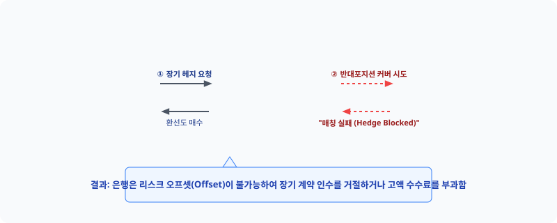
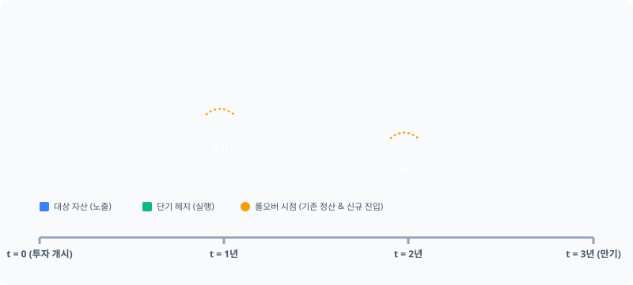

# 3장. 헤지 기간과 롤오버

## 3.1 자산 만기와 헤지 계약 만기의 구조적 미스매치

### 도입
해외 채권이나 부동산 등 외화 자산에 투자할 때 가장 먼저 맞닥뜨리는 현실적인 장벽은 **'시간의 불일치(Maturity Mismatch)'**입니다. 우리가 투자하는 외화 자산은 보통 5년, 10년 혹은 그 이상의 장기 만기를 가집니다. 반면, 이 자산의 환율 변동 위험을 방어하기 위해 체결하는 환 헤지 계약(외환선도 등)의 만기는 길어야 3개월에서 1년 남짓에 불과합니다.

이론적으로는 "10년 만기 자산이니 10년짜리 환 헤지 계약을 한 번에 맺어 안전하게 묶어두면 된다"고 생각하기 쉽습니다. 하지만 실제 금융시장에서 이러한 장기 환 헤지 상품을 구하는 것은 불가능에 가깝습니다. 왜 시장은 투자 자산의 만기에 딱 맞춘 장기 환 헤지 상품을 제공하지 않을까요? 왜 우리는 번거롭고 비용이 발생하는 '단기 헤지 계약의 반복(롤오버)'이라는 방식을 선택할 수밖에 없을까요?

이번 절에서는 자산 만기와 헤지 계약 만기 사이에서 발생하는 구조적 미스매치의 원인을 시장 유동성과 공급자(은행)의 한계 측면에서 명확히 규명합니다. 또한, 이를 해결하기 위해 단기 계약을 계속해서 갱신하는 '롤오버(Rollover)'의 메커니즘을 구체적인 수치와 대조 사례를 통해 자세히 알아봅니다.

---

### 1. 숫자로 보는 시장의 민낯: 만기별 유동성 양극화

왜 장기 자산을 장기 헤지 상품으로 직접 막을 수 없을까요? 첫 번째 단서는 금융시장의 **'유동성(Liquidity)'**에 있습니다. 아래 표는 외환 시장(원/달러 환선도 기준)에서 만기별로 나타나는 실제 거래량과 거래 비용의 패턴을 단순화한 것입니다.

#### [표 3.1] 만기별 환선도(FX Forward) 시장 거래 환경 비교 (예시)

| 구분 (만기) | 일평균 거래량 | 매수-매도 호가 스프레드 (비용) | 시장 충격 비용 (대량 주문 시) | 거래 실행 가능성 |
| :--- | :--- | :--- | :--- | :--- |
| **1개월 (초단기)** | 약 500억 달러 | 0.10원 ~ 0.20원 | 거의 없음 | 즉시 체결 가능 |
| **1년 (단기)** | 약 100억 달러 | 0.50원 ~ 1.00원 | 미미함 | 당일 체결 가능 |
| **3년 (장기)** | 약 10억 달러 | 5.00원 ~ 10.00원 | 높음 (가격 왜곡 발생) | 수일간의 협상 필요 |
| **5년 이상 (초장기)** | 거의 없음 (호가 공백) | 30.00원 이상 (스프레드 폭증) | 매우 높음 (거래 불가 수준) | 사실상 거래 불가능 |

이 표가 보여주는 규칙성은 명확합니다. **만기가 길어질수록 거래량은 기하급수적으로 감소하고, 거래 비용(스프레드)은 폭발적으로 증가합니다.** 

예를 들어 100억 원 규모의 5년 만기 외화 채권을 헤지하기 위해 5년짜리 선도 계약을 체결하려 하면, 거래 상대방을 찾기 어려울 뿐만 아니라 진입 장벽 역할을 하는 '호가 스프레드' 때문에 계약 체결 즉시 수억 원의 손실(비용)을 안고 시작해야 합니다. 반면 1개월~1년짜리 계약은 풍부한 거래량 덕분에 즉시, 아주 저렴한 비용으로 체결할 수 있습니다.

---

### 2. 시장 공급자(은행)는 왜 장기 계약을 꺼리는가?

"그렇다면 왜 금융기관(은행)들은 장기 계약을 만들어 팔지 않는가?"라는 의문이 생깁니다. 금융시장에서 파생상품의 주요 공급자인 은행이 장기 계약 공급을 피하는 데에는 세 가지 강력한 내부적 제약이 존재합니다.

#### ① '헤지의 헤지'가 불가능한 은행의 딜레마 (Position Squaring)
은행은 파생상품을 만들어 팔 때 스스로 위험을 떠안는 '도박사'가 아닙니다. 고객에게 10년짜리 달러 매도 계약을 판매했다면, 은행은 즉시 시장에서 반대 포지션(달러 매수)을 취해 자신의 위험을 0으로 만드는 **스퀘어 포지션(Square Position)**을 구축해야 합니다.

하지만 도새 시장(Interbank Market)에도 10년짜리 환선도 거래는 존재하지 않습니다. 결국 은행은 고객에게 장기 계약을 제공하고 나면 이를 완벽히 헤지할 수 있는 수단이 없어, 금리 스왑(IRS)이나 통화 스왑(CRS) 시장을 복잡하게 조립하여 위험을 우회적으로 분산시켜야 합니다. 이 과정에서 막대한 베이시스 위험(Basis Risk)과 이자율 위험이 동반되므로, 은행은 아예 장기 계약 공급 자체를 꺼리게 됩니다.

#### ② 거래 상대방의 신용 위험과 CSA 담보 관리의 한계
환선도 계약은 만기 시점에 약정된 환율로 외화를 교환하기로 하는 장외 파생상품(OTC)입니다. 계약 기간이 10년으로 늘어나면, 그 사이에 거래 상대방인 자산운용사나 기업이 파산할 확률(Default Risk)이 누적되어 기하급수적으로 증가합니다. 

비록 일일 단위로 평가금액만큼 담보를 주고받는 신용지원부속서(CSA, Credit Support Annex)를 체결하더라도, 10년 동안 담보의 가치를 평가하고 증거금을 주고받는 행정적·자본적 비용은 양측 모두에게 극심한 장기적 부담으로 작용합니다.

#### ③ 바젤 III(Basel III) 자본 규제와 자본 비용의 압박
현대 금융 시스템 하에서 시중은행들은 엄격한 바젤 III 규제를 적용받습니다. 은행이 장기 파생상품 계약을 장부에 보유하면 규제 당국은 대규모의 자본 적립을 요구합니다.
* **CVA(신용가치조정) 리스크 자본 청구:** 만기가 길어질수록 거래상대방 신용위험에 대비해 은행이 보유해야 하는 위험가중자산(RWA)이 급증합니다.
* **유동성 커버리지 비율(LCR) 규제:** 10년 동안 묶여 있는 장기 계약은 은행의 유동성 지표를 악화시킵니다.

은행은 이러한 규제 준수 비용(Capital Cost)을 고스란히 가격에 얹어 고객에게 청구해야 합니다. 결과적으로 고객이 도저히 받아들일 수 없을 만큼 터무니없이 비싼 헤지 수수료(프리미엄)가 책정되어 시장 자체가 소멸하는 악순환이 발생합니다.

---

### 3. 시각적 비유: 징검다리로 강 건너기

이처럼 장기 헤지 계약의 공급이 차단되어 있기 때문에, 실무에서는 **"장기 자산을 보유하되, 단기 헤지 계약을 체결한 뒤 만기가 도래할 때마다 계약을 갱신하는 방식"**을 사용합니다. 이를 **롤오버(Rollover)**라고 부릅니다.

이 구조는 **"10미터 너비의 강(장기 위험)을 1미터짜리 돌(단기 계약)들로 건너는 과정"**과 같습니다.

*   **이상적인 상황 (직접 헤지):** 10미터짜리 거대한 통나무 하나를 단번에 걸쳐 강을 건너는 것과 같습니다. 매우 안전하지만, 시장에 그런 거대하고 완벽한 통나무(장기 계약)는 존재하지 않거나 가격이 터무니없이 비합리적입니다.
*   **현실적인 상황 (롤오버 헤지):** 구하기 쉽고 저렴한 1미터짜리 돌(1년 만기 계약)을 디디고 선 뒤, 만기가 도래하면 그 돌을 회수하고 바로 앞 위치에 새로운 돌을 놓는 과정을 10번 반복하여 무사히 강 건너편(자산 만기 시점)에 도달하는 방식입니다.

---

### 4. 실패 사례 vs 성공 사례 대조: 롤오버의 손익 메커니즘

구체적인 수치 시나리오를 통해 롤오버 헤지가 실제로 어떻게 작동하며, 왜 단순한 반복 계약이 아닌 정밀한 관리가 필요한지 대조해 보겠습니다.

#### [시나리오 설정]
*   **보유 자산:** 3년 만기 채권 $V_0 = 1,000\text{억 원}$ (금리 상승 시 채권 가치 하락 위험 존재)
*   **목표:** 3년간 금리 상승 위험을 전액 방어하고자 함.
*   **시장 제약:** 3년 만기 선물(선도)은 거래 불가, **1년 만기 선물**만 거래 가능.

---

#### 실패 사례: 롤오버 위험(Basis & Roll Cost)을 고려하지 않은 기계적 대응
투자자 A는 단순히 "1년짜리 매도 계약을 맺고, 매년 똑같은 계약 수량으로 갱신하면 되겠지"라고 안일하게 생각했습니다.

*   **1년 차 ($t = 0 \sim 1$):** 
    *   금리가 급격히 상승하여 보유 채권 가치 **-50억 원** 손실 발생.
    *   1년 만기 선물 계약(숏)에서 **+50억 원** 이익 발생 (1년 차 헤지 성공).
*   **롤오버 시점 ($t = 1$):** 
    *   기존 계약 만기 도래로 청산. 
    *   새로운 1년짜리 계약을 맺으려 보니, 시장의 금리 변동성 예측치가 급변하여 선물 가격에 불리한 프리미엄(패널티)이 크게 붙어 있음.
    *   이 롤오버 비용(Roll Cost)으로 인해 **10억 원**의 추가 지출이 발생함.
*   **2년 차 ($t = 1 \sim 2$):**
    *   금리가 추가 상승하여 채권 가치 **-30억 원** 손실 발생.
    *   불리하게 체결된 2차 선물 계약에서는 수량 미조정으로 인해 **+20억 원**의 이익만 발생.
*   **결과:** 3년 누적 손익이 일치하지 않고 **오차(Basis)가 누적되어 자산 손실을 완벽히 방어하는 데 실패**함.

---

#### 성공 사례: dynamic 복제 헤지와 롤오버 비용 사전 반영
투자자 B는 만기 미스매치로 인한 비용(Roll Cost)을 정밀하게 계산하고, 롤오버 시점마다 헤지 비율(Hedge Ratio)을 미세 조정하는 '동적 롤오버' 전략을 취했습니다.

| 시점 ($t$) | 채권 가치 변동 ($\Delta V$) | 선물 계약 차수 | 선물 평가 손익 ($\Delta F$) | 롤오버 스프레드 비용 | 순손익 (채권 + 선물 - 비용) |
| :---: | :---: | :---: | :---: | :---: | :---: |
| **$t = 1$** | -50억 원 | 제1차 계약 청산 | +50.2억 원 | -0.2억 원 | **0억 원 (완벽 헤지)** |
| **$t = 2$** | -30억 원 | 제2차 계약 청산 | +30.5억 원 | -0.5억 원 | **0억 원 (완벽 헤지)** |
| **$t = 3$** | +20억 원 | 제3차 계약 청산 | -19.7억 원 | -0.3억 원 | **0억 원 (완벽 헤지)** |
| **누적** | **-60억 원** | | **+61.0억 원** | **-1.0억 원** | **0억 원 (완벽 방어)** |

*   **성공의 핵심:** 투자자 B는 단순히 계약을 기계적으로 연장한 것이 아니라, 선물 가격과 현물 가격의 차이(베이시스)가 좁혀지거나 벌어지는 물리적 규칙성을 계산하여 **선물 계약의 수량을 매기 조정(Dynamic Rebalancing)**했습니다. 
*   이를 통해 롤오버 과정에서 필연적으로 발생하는 소모성 비용(위 표의 누적 1.0억 원)을 미리 예산에 반영하고 포트폴리오의 완결성을 유지했습니다.

---

### 5. 수학적 이해: 롤오버 헤지의 분해와 헤지 비율 $N_t$

이를 수식으로 엄밀하게 분해해 보겠습니다. 만기 $T$(3년)인 자산의 가치 변동을 만기 $\tau$(1년, 단 $\tau < T$)인 선물 계약 $N$개로 헤지할 때, $t$시점부터 $t+1$시점까지의 포트폴리오 가치 변동 $\Delta \Pi$는 다음과 같습니다.

$$\Delta \Pi_t = \Delta V_t - N_t \cdot \Delta F_{t, \tau}$$

여기서 가장 중요한 변수는 **헤지 비율 $N_t$ (Hedge Ratio)**입니다. $N_t$는 단순히 자산과 선물의 금액을 1:1로 맞추는 것이 아니라, 자산과 헤지 수단의 가치 변동 민감도를 일치시키는 변수입니다.

#### ① 헤지 비율 $N_t$의 정밀한 정의
통계학적 관점에서 포트폴리오 변동성($\text{Var}(\Delta \Pi)$)을 최소화하는 최적 헤지 비율 $N_t^*$는 다음과 같이 정의됩니다.

$$N_t^* = \frac{\text{Cov}(\Delta V_t, \Delta F_{t, \tau})}{\text{Var}(\Delta F_{t, \tau})}$$

즉, 자산 가치 변동과 선물 가치 변동의 공분산을 선물 가치 변동의 분산으로 나눈 값입니다. 

#### ② 만기 미스매치 시 $N_t$가 변화하는 원리 (민감도 불일치)
만기 미스매치 상황에서는 시간이 흐름에 따라 이 $N_t^*$의 동적 조정이 필수적입니다. 자산 $V$는 3년 만기 채권이고, 선물 $F$는 항상 1년 만기 계약을 유지한다고 가정합시다. 

*   **수정 듀레이션(Modified Duration)의 시차:** 3년 만기 채권의 가격 민감도(듀레이션 $D_V \approx 2.7$)는 1년 만기 선물 대상 자산의 가격 민감도(듀레이션 $D_F \approx 0.9$)보다 약 3배 큽니다. 금리가 1% 변할 때 채권 가치는 2.7% 변하지만, 선물 가치는 0.9%밖에 변하지 않습니다.
*   **초기 시점 ($t=0$):** 자산의 가치 변동폭을 따라잡기 위해 더 많은 수량의 선물 계약이 필요합니다. 따라서 $N_0 \approx \frac{D_V}{D_F} \approx 3$ 수준으로 설정됩니다.
*   **1년 후 ($t=1$, 롤오버 시점):** 이제 자산은 만기가 2년 남은 채권($D_V \approx 1.8$)이 됩니다. 하지만 롤오버를 통해 새로 체결한 제2차 선물 계약은 여전히 1년 만기($D_F \approx 0.9$)입니다. 따라서 가격 민감도 비율이 변했으므로, $N_1 \approx \frac{1.8}{0.9} \approx 2$로 선물 계약 수량을 줄여야 합니다.

만약 이 헤지 비율 $N_t$를 동적으로 줄여주지 않는다면, 포트폴리오는 과대 헤지(Over-hedged) 상태가 되어 오히려 환율이나 금리 변동에 노출되게 됩니다. 이것이 앞서 살펴본 '실패 사례'의 수학적 원인입니다.

#### ③ 롤오버 비용(Roll Cost)의 수식화
계약 만기 시점($t = \tau$)에 기존 계약을 청산하고 새로운 선물 계약으로 갈아탈 때, 두 선물 가격 간의 불연속적인 격차로 인해 다음과 같은 비용이 확정됩니다.

$$\text{Roll Cost} = N_t \cdot \left( F^{\text{new}} - F^{\text{old}} \right)$$

*   $F^{\text{new}}$: 새로 진입하는 선물의 가격
*   $F^{\text{old}}$: 기존 선물의 청산 가격

이 롤오버 비용이 양(+)수이면 투자자에게 비용(손실)이 되며, 음(-)수이면 이익(Roll Yield)이 됩니다.

#### ④ 회계 기준상의 유의점 (일반기업회계기준 vs K-IFRS)
이러한 만기 미스매치 헤지 거래를 장부에 기록할 때는 적용하는 회계 기준에 따라 신중한 접근이 필요합니다.

*   **일반기업회계기준 (K-GAAP):** 매우 엄격한 **양적 효과성 테스트(80% ~ 125% 룰)**를 요구합니다. 즉, $\Delta V_t$와 $N_t \cdot \Delta F_t$의 비율이 상시 80%~125% 구간 안에 들어와야만 위험회피회계(Hedge Accounting) 적용을 승인합니다. 만기 미스매치로 인해 이 구간을 한 번이라도 벗어나면 헤지 지정이 강제 해지되어, 선물 평가 손익이 손익계산서(P&L)에 고스란히 반영되어 당기순이익이 극심하게 요동치게 됩니다.
*   **한국채택국제회계기준 (K-IFRS / IFRS 9):** K-GAAP에 비해 상대적으로 유연합니다. 정량적인 80~125% 제한선 대신, 기업의 **실질적인 위험관리전략과의 정성적 정합성**을 더 중시합니다. 또한, 롤오버 시 발생하는 헤지 비용($F^{\text{new}} - F^{\text{old}}$)을 '위험회피비용(Cost of Hedging)'으로 처리하여 기타포괄손익(OCI)에 일시 유보한 후 기간 경과에 따라 상각할 수 있도록 허용하므로, 손익계산서의 왜곡을 줄일 수 있습니다.

<iframe src="contents/fx_hedge_strategy_01/sec_03/assets/diagrams/sub_03_01_visual1.html" width="100%" height="480px" frameborder="0" scrolling="yes"></iframe>

---

### 요약

1.  **구조적 미스매치의 필연성:** 투자 대상 외화 자산은 3~10년의 장기를 원하나, 외환 시장의 주도 세력인 은행들은 자본 규제(Basel III), 신용 위험, 헤지 수단 부족의 이유로 장기 선도 호가 제공을 기피합니다. 이로 인해 만기 불일치는 필연적으로 발생합니다.
2.  **롤오버 전략의 도입:** 해결책은 시장에 유동성이 풍부한 단기 계약(1~12개월)을 체결한 후, 만기마다 이를 정산하고 새로운 단기 계약으로 갈아타는 '롤오버' 방식으로 장기 자산의 만기를 뒤쫓는 것입니다.
3.  **동적 헤지 비율($N_t$) 조정의 필수성:** 시간이 지남에 따라 장기 자산의 남은 만기(민감도)는 줄어들지만, 갱신하는 헤지 수단의 만기는 항상 단기로 일정하므로 둘 사이의 상대적 가격 민감도를 맞추기 위해 헤지 비율 $N_t$를 매기 재계산하여 동적으로 조정해야 헤지 실패를 막을 수 있습니다.
4.  **회계 처리의 차이:** 롤오버 헤지는 일반기업회계기준(K-GAAP) 하에서는 엄격한 80~125% 양적 테스트 통과가 요구되나, 한국채택국제회계기준(K-IFRS / IFRS 9) 하에서는 위험회피비용(Cost of Hedging) 처리를 통해 손익 변동성을 보다 유연하게 완충할 수 있습니다.