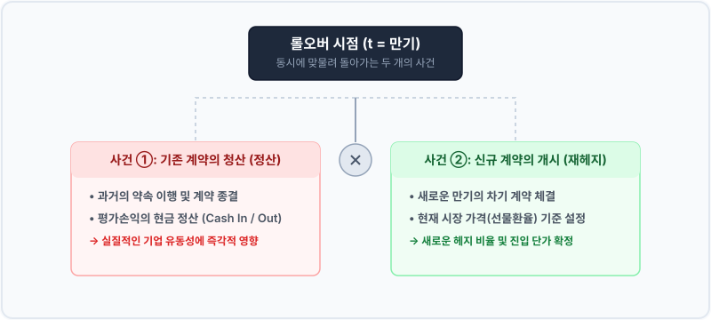
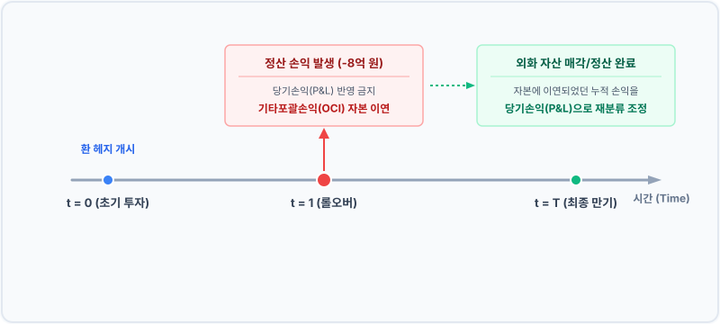

# 3장. 헤지 기간과 롤오버

## 3.2 롤오버의 개념과 비용 발생 원리

### 도입
앞서 우리는 장기 자산의 환위험을 방어하기 위해 유동성이 풍부한 단기 계약을 활용할 수밖에 없는 현실적인 원인과 유동성 문제를 분석했습니다. 10미터의 넓은 강을 건너기 위해 1미터짜리 징검다리 돌들을 징검징검 디디며 나아가는 이 방식(롤오버, Rollover)은 필연적으로 **"발을 딛고 서 있는 돌의 수명이 다하는 순간(만기)"**을 상시 마주하게 만듭니다.

징검다리 돌의 끝에 도달했을 때, 우리는 단순히 공중을 가로질러 다음 돌로 건너갈 수 없습니다. 딛고 있던 첫 번째 돌을 물속에서 안전하게 건져 올려 정리(기존 계약의 정산)한 뒤, 물결의 세기나 바람의 방향(현재 시장 가격)을 다시 가늠하고 발앞 바닥에 새 돌을 튼튼히 안착(신규 계약 체결)시켜야 합니다.

실무에서 환선도 및 통화선물 등의 '롤오버'는 단순히 만기 연장을 위해 계약서 상의 기한 연장 서명만을 반복하는 정적인 행위가 아닙니다. 이는 기존 계약을 완전히 청산해 손익을 현금으로 확정 짓는 **‘정산’**과, 그 시점의 새로운 시장 가격으로 계약을 새로 매칭하는 **‘신규 계약’**이 동시에 단 1초의 시차도 없이 일어나는 결합 금융 거래입니다. 

이번 절에서는 롤오버의 내부 메커니즘을 구체적이고 일관된 수치 모델을 통해 분해하고, 이 과정에서 발생하는 비용의 물리적 성격과 기업 재무제표에 미치는 영향을 규명해 보겠습니다.

---

### 1. 롤오버의 심장부: 동시에 작동하는 두 개의 톱니바퀴

롤오버를 진행하는 계약 체결일에 투자자의 장부에서는 아무런 현금 변동 없이 조용히 만기일만 바뀌지 않습니다. 그날 하루 동안 완전히 성격이 다른 독립된 두 금융 사건이 양쪽 톱니바퀴처럼 동시에 맞물려 회전합니다.

*   **사건 ①: 기존 계약의 청산 (정산 손익의 즉각적 현금화)**
    기존 계약 기간 동안 누적되어 왔던 '미실현 평가손익'이 만기일에 실현되어 실제 **현금(Cash)**의 유입이나 유출로 완전히 정산됩니다. 즉, 장부상의 가상 숫자가 당장 내일 기업의 당좌 계좌 잔고를 뒤바꿔 놓는 순간입니다.
*   **사건 ②: 신규 계약의 체결 (새로운 선물환율로의 진입)**
    기존 계약의 종료와 동시에 다음 징검다리 구간(차기 만기)까지의 환율 위험을 막아낼 신규 환선도 계약을 맺어야 합니다. 이때 기준이 되는 가격은 과거 최초 계약 시점의 가격이 아니라, **현물 시장에서 지금 이 순간에 정해져 흐르는 신규 환율**입니다.

이 두 사건이 찰나의 시간 차도 없이 결합되면서, 롤오버는 단순한 '위험 방어 기한 연장'이 아니라 **'정산금 유동성의 확보'**와 **'새로운 환율 방어 단가로의 리셋'**이라는 입체적인 속성을 가지게 됩니다.

---

### 2. 구체적인 수치로 증명하는 만기 정산 및 환율 재조정

이 독특한 메커니즘을 직관적으로 확인하기 위해, 이전 절([3.1])에서 전개했던 포트폴리오의 수치를 그대로 다시 인용하여 롤오버 당일에 일어나는 결과를 대조해 보겠습니다.

#### [수치 시나리오 조건]
*   **보유 외화 자산:** $\$10,000,000$ (미국 국채)
*   **최초 투자 시점 ($t=0$):**
    *   기초 매입 환율 ($S_0$): $1,300\text{ 원/달러}$
    *   1년 만기 환선도 약정 가격 ($F_0$): $1,320\text{ 원/달러}$ (달러 매도 / 원화 매수)

투자 후 1년이 경과하여 만기 시점($t=1$)에 도달했습니다. 이때 환율이 급격히 상승해 원화가 약세로 돌아선 상황(상황 A)과 환율이 크게 하락한 상황(상황 B)의 결과를 구체적인 숫자로 비교 분석합니다.

#### [표 3.2] $t=1$ 시점 환율 방향성에 따른 롤오버의 현금 흐름 및 재계약 상태 대조

| 구분 요소 | 상황 A: 원화 약세 (환율 급등) | 상황 B: 원화 강세 (환율 급락) |
| :--- | :--- | :--- |
| **만기 시점 시장 환율 ($S_1$)** | $1,400\text{ 원}$ | $1,200\text{ 원}$ |
| **보유 자산 평가액 (원화 환산)** | $140\text{억 원}$ (초기 대비 $+10\text{억 원}$) | $120\text{억 원}$ (초기 대비 $-10\text{억 원}$) |
| **사건 ①: 기존 환선도 계약 정산** | **$8\text{억 원}$ 현금 유출** ($1,320\text{원}$ 약정 매도 vs $1,400\text{원}$ 결제) | **$12\text{억 원}$ 현금 유입** ($1,320\text{원}$ 약정 매도 vs $1,200\text{원}$ 결제) |
| **사건 ②: 차기 신규 계약 체결** | 당시 시장 환율 $S_1 = 1,400\text{원}$을 기준점 삼아 산출되는 **새로운 선물환율 $F_1$으로 계약** | 당시 시장 환율 $S_1 = 1,200\text{원}$을 기준점 삼아 산출되는 **새로운 선물환율 $F_1$으로 계약** |

여기서 주목해야 할 부분은 자산의 평가액과 정산금의 **'물리적 비대칭성'**입니다.

*   **상황 A (원화 약세):** 전체 포트폴리오(자산 가치 $140\text{억}$ - 정산 손실 $8\text{억}$ = $132\text{억}$)의 원화 가치는 정확히 계획대로 $1,320\text{원}$선에 완벽히 묶여 방어되었습니다. 그러나 자산의 평가 이익 $+10\text{억 원}$은 자산을 실제로 매각하기 전까지는 손에 쥘 수 없는 가상의 숫자인 반면, 환선도 정산 손실 $8\text{억 원}$은 **영업일 기준 2일 이내에 현금으로 은행에 직접 송금해야만 하는 실현 손실**입니다.
*   **상황 B (원화 강세):** 자산 가치는 $120\text{억 원}$으로 쪼그라들었지만, 당장 운용자금 통장에는 $+12\text{억 원}$의 막대한 정산 이익이 현금으로 꽂힙니다.

이처럼 롤오버는 자산 자체의 '장부상 가치 변동(평가액)'과 헤지 수단의 '물리적 유출입(실현 현금)' 사이에서 **시간적 불일치와 자금 조달 리스크**를 빈번히 유발합니다.

---

### 3. 실패 사례 vs 성공 사례: 유동성 관리의 명암

만기 불일치를 감수하는 환 헤지 거래에서 이 현금 흐름의 특징을 경시할 경우, 경제적으로 완벽한 위험 중립 포트폴리오를 만들어 놓고도 회사가 흑자 도산(margin run)할 위험이 존재합니다.

#### ❌ 실패 사례: 유동성 완충망(Buffer)을 생략한 A 자산운용사
*   **경영 판단:** "어차피 최종 만기인 5년 뒤에 해외 부동산 매각 원금과 환 헤지 이익을 다 더하면 정교하게 상쇄되므로, 도중 롤오버에서 발생하는 자금 유출은 굳이 현금으로 따로 마련해 두지 않아도 된다."
*   **발생 상황:** 부동산 매입 직후 미국 기준금리가 갑자기 뛰어 환율이 $1,300\text{원}$에서 $1,450\text{원}$으로 가파르게 치솟아 1년 차 롤오버 만기 도래.
*   **결과:** 환선도 청산 정산금으로 **즉시 약 $15\text{억 원}$의 실물 현금 송금 요구(Margin Call)**를 받음. 그러나 운용 중인 장기 해외 부동산 자산은 빠른 유동화가 원천적으로 불가능함. 결국 은행에 현금을 제때 지급하지 못해 파생상품 거래 불이행(디폴트)이 일어났고, 환 헤지 계약이 강제 파기되어 향후 발생할 대규모 환 위험에 무방비로 노출됨.

####  성공 사례: 유동성 시나리오 분석과 보조 크레딧 라인을 구축한 B 자산운용사
*   **경영 판단:** "환선도 롤오버 시점에 현물이 비우호적으로 튈 경우 수십 억 원 단위의 현금이 단기 유출될 수 있다. 자산 총액의 $5\%$는 즉시 현금화가 가능한 초단기 채권과 외화 MMF로 안배하고, 긴급 은행 한도 대출(Credit Line)을 미리 개설해 둔다."
*   **발생 상황:** 동일하게 환율이 $1,450\text{원}$으로 폭증하여 $15\text{억 원}$의 정산 현금 유출 확정.
*   **결과:** 사전에 세팅해 둔 자금 지원 라인과 외화 예치금을 활용해 2영업일 이내에 막힘없이 정산금을 입금 완료. 이후 상승한 현물환율 $S_1 = 1,450\text{원}$을 기반으로 제2차 연도용 환선도 계약을 원활히 롤오버함. 일시적인 자금 유출은 있었으나 전체 포트폴리오의 원화 자산 가치는 상승했으므로 최종적인 투자 위험 방어에 온전히 안착함.

---

### 4. 경제적 본질: 롤 비용(Roll Cost)이 구조적으로 발생하는 원리

많은 초보 투자자가 "단기 환선도 계약을 연속해서 갈아타면, 별도의 추가 부담금 없이 공짜로 10년짜리 장기 환위험을 관리할 수 있다"고 기대합니다. 하지만 롤오버 과정에서는 경제적으로 피할 수 없는 **'롤 비용(Roll Cost)'** 혹은 **'롤 Yield'**가 계속 누적되며, 이 비용의 총량은 두 국가의 금리 구조와 밀접하게 연동되어 있습니다.

$$\text{Roll Cost} = \text{스왑레이트(Swap Rate)에 의한 금리차 정산 비용} + \text{거래 마찰 비용(Bid-Ask Spread)}$$

#### ① 내외 금리차와 이자율 평가설(IRP)의 연계
롤 비용을 지배하는 가장 강력한 경제학적 동인은 바로 양국 간의 **'무위험 금리 격차(Interest Rate Differential)'**입니다. 이자율 평가이론에 의하면, 완벽히 차공거래가 차단된 상태에서의 이론적 선물환율($F$)과 현물환율($S$)은 다음과 같이 계산됩니다.

$$F = S \times \frac{1 + r_{\text{KRW}} \times \frac{d}{365}}{1 + r_{\text{USD}} \times \frac{d}{365}}$$

여기서:
*   $r_{\text{KRW}}$: 한국 무위험 금리 (원화)
*   $r_{\text{USD}}$: 미국 무위험 금리 (달러)
*   $d$: 거래 약정 일수

분모에 들어 있는 무위험 이자율 인수($(1 + r_{\text{USD}})$)는 기계적 사칙연산의 부산물이 아닙니다. 이는 **"투자 대상국(미국)에서 달러를 단기로 조달하는 데 수반되는 이자 비용을 계산에서 완전히 지우고 매칭시키는 소거 장치"**입니다. 즉, 이자율이 더 높은 국가의 통화를 매도하는 환선도 계약(예: 달러 매도)을 맺을 때는 높은 이자 혜택을 포기하는 대가로 선물 가격을 깎아주는 '디스카운트(할인율)'를 지불해야만 상대방이 이 거래에 응한다는 뜻입니다.

이를 스왑포인트($F - S$) 공식을 통해 직관적인 수치 패턴으로 다시 풀어보겠습니다. 현물환율 $S_0 = 1,300\text{원}$으로 상정하고 1년물($d=365$) 기준으로 금리차에 따른 규칙성을 확인해 봅니다.

$$F - S \approx S \times (r_{\text{KRW}} - r_{\text{USD}})$$

#### [표 3.3] 미국과 한국의 금리 편차에 연동된 연간 예상 롤 비용 추이 (현물환율 $1,300\text{원}$ 고정 시)

| 한국 금리 ($r_{\text{KRW}}$) | 미국 금리 ($r_{\text{USD}}$) | 무위험 금리차 ($r_{\text{KRW}} - r_{\text{USD}}$) | 이론 스왑포인트 ($F - S$) | 연간 헤지 비용률 | $\$10,000,000$ 헤지 시 연간 누적 비용 |
| :---: | :---: | :---: | :---: | :---: | :---: |
| $3.50\%$ | $1.50\%$ | $+2.00\%\text{p}$ | $+26.00\text{원}$ | $+2.00\%$ (헤지 프리미엄 수취) | 약 $+2억 6천만 원$ (수익) |
| $3.50\%$ | $3.50\%$ | $0.00\%\text{p}$ | $0.00\text{원}$ | $0.00\%$ | $0\text{원}$ |
| **$3.50\%$** | **$5.50\%$** | **$-2.00\%\text{p}$** | **$-26.00\text{원}$** | **$-2.00\%$ (헤지 비용 지출)** | **약 $-2억 6천만 원$ (비용)** |

*   **금리차가 마이너스일 때 ($r_{\text{KRW}} < r_{\text{USD}}$):** 스왑포인트가 음수($-26\text{원}$)가 됩니다. 즉, 롤오버할 때마다 현물환율보다 달러당 $26\text{원}$씩 손해를 본 가격으로 달러를 원화로 강제 환전 정산해야 함을 의미하며, 이를 **'헤지 비용(Hedge Cost)'**이라고 지칭합니다. 미국 기준금리가 한국보다 월등히 높은 환경에서는 달러 자산 환 헤지 시 매년 수억 원 상당의 현금이 롤오버를 거치며 증발하게 됩니다.
*   **금리차가 플러스일 때 ($r_{\text{KRW}} > r_{\text{USD}}$):** 역으로 선물환 가격이 현물보다 비싸져 롤오버 시 보너스 금리를 챙길 수 있습니다. 이를 **'헤지 프리미엄(Hedge Premium)'**이라 합니다.

#### ② 매매 시 발생하는 거래 마찰 비용 (Transaction Cost)
시장 금리차라는 매크로 요인 외에도, 금융회사에 거래 수수료 성격으로 지출해야 하는 마찰 비용이 가산됩니다. 은행 등 딜러들은 언제나 자사 이윤이 포함된 비드(Bid, 고객이 팔 때 가격)와 오스크(Ask, 고객이 살 때 가격)의 이중 호가를 사용합니다.

롤오버를 시행할 때는 구 계약 청산(달러 매수)과 신 신규 계약 진입(달러 매도)이 단번에 동시에 수행되므로, 시장 기준가격 자체의 등락이 아예 없다 하더라도 호가 스프레드 폭만큼의 수수료 성격 자금이 계좌에서 소실됩니다.

$$\text{Roll-over Transaction Cost} = \frac{F^{\text{Ask}} - F^{\text{Bid}}}{2}$$

만기가 너무 짦은 초단기물(예: 1개월물)로 무턱대고 롤오버 주기를 설정할 경우, 1년에 이 호가 마찰 비용이 12차례나 누적 발생하여 포트폴리오의 실질 운용 수익을 지속적으로 갉아먹는 주원인이 됩니다.

---

### 5. 일반기업회계기준(K-GAAP)의 정교한 매칭: 위험회피회계

이와 같이 분기별, 연도별로 환선도 거래를 해지하고 재개설하는 동적 롤오버 거래를 일반 회계 장부에 단순 기재하면 심각한 장부상 왜곡이 생깁니다. 일반기업회계기준(K-GAAP) 제17장(파생상품평가)에 따르면, 원칙적으로 모든 파생상품의 평가 및 실현 손익은 발생하는 즉시 당기순이익(P&L)에 직접 산입해야 합니다.

그러나 자산 매각은 5년 뒤인데 롤오버 정산 현금 손실은 올해 장부에 바로 잡히면, 회사는 경제적으로 환위험을 완벽히 방어했음에도 당기순이익이 매년 수십억 원씩 널뛰는 회계 왜곡 현상을 겪게 됩니다. 이를 교정해 주는 장치가 바로 **'현금흐름위험회피회계(Cash Flow Hedge Accounting)'**입니다.

#### ① K-GAAP 하에서의 엄격한 요건 통과 (양적 효과성 테스트)
회계처리의 인위적 유보를 승인받기 위해서 K-GAAP은 매우 엄격한 잣대를 들이댑니다.
1.  **지정의 공식 문서화:** 거래를 트는 첫날, 헤지 대상 항목(예: 3년 뒤 입금될 외화 채권 원금)과 명확한 헤지 수단(롤오버 예정인 환선도)의 연계 관계 및 위험 관리 정책을 담은 공식 문서를 작성해 두어야 합니다.
2.  **엄격한 양적 효과성 검증 ($80\% \sim 125\%$ 룰):** 누적된 헤지 대상의 환 평가손익과 헤지 수단의 환선도 정산손익 비가 상시 **$80\%$ 이상, $125\%$ 이하의 타이트한 범위**에 머물고 있음을 정량적으로 검증하고 증명해 보여야 합니다.

#### ② K-GAAP의 회계처리 프로세스
검증 요건에 합격하면, 롤오버 만기 당일 실현된 $-8\text{억 원}$의 현금 정산 손실은 손익계산서로 바로 흘러가지 않고 재무상태표의 **자본 항목인 '기타포괄손익누계액(OCI)'으로 일시 유보(이연)** 처리됩니다. 이후 3년 혹은 5년 뒤 채권의 만기 상환이나 해외 부동산의 완전 청산 시점에 자본에 차곡차곡 유보되어 쌓여 있던 이연 손익을 다시 끄집어내어(재분류 조정), 자산 처분 손익과 같은 날 손익계산서에서 일시에 매칭시킵니다.

#### ③ K-IFRS(한국채택국제회계기준) 대비 차이점 요약
*   **일반기업회계기준 (K-GAAP):** 효과성 비율 범위를 일시적으로라도 미달하거나 초과 돌파할 경우, 그 즉시 현금흐름위험회피 지정이 **강제 취소(Hedge De-designation)**되어 유보되었던 자본금 누적 손실이 그해 당기순이익으로 일시에 쏟아져 들어오므로 재무 안정성 수치가 손상됩니다.
*   **한국채택국제회계기준 (K-IFRS / IFRS 9):** 기계적인 $80\% \sim 125\%$ 규격 대신, 기업의 실제 내부 위험관리 전략과의 실질적 일치성(Qualitative Assessment)을 더 중점적으로 평가합니다. 또한, 롤오버 시 무조건 내야 하는 내외 금리차 상의 손익(스왑포인트)을 별도의 '위험회피비용(Cost of Hedging)'으로 자본에 묶어둔 뒤, 자산의 생애 주기 동안 감가상각 방식으로 균등 분할 상각하는 등의 고도화된 유연 처리를 허용하고 있습니다.

<iframe src="contents/fx_hedge_strategy_01/sec_03/assets/diagrams/sub_03_02_visual1.html" width="100%" height="680px" frameborder="0" scrolling="yes"></iframe>

---

### 요약

1.  **롤오버 거래의 구조적 양면성:** 롤오버 만기 당일에는 **'기존 파생계약의 정산(실현 현금 유출입)'**과 **'새로운 환선도 체결(진입 환율 및 계약 단가의 리셋)'**이라는 정반대의 두 금융 거래가 단번에 연결되어 진행됩니다.
2.  **환위험의 유동성 위험화:** 롤오버는 자산의 미실현 평가손익을 방어하는 대가로, 정산일에 즉각적인 실물 자금이 드나들어야 하는 **'유동성 위험(Liquidity Risk)'**을 유발합니다. 따라서 적확한 유동성 보조 한도(Buffer)의 계산이 선행되어야 헤지 실패를 방지할 수 있습니다.
3.  **내외 금리차가 결정하는 롤 비용:** 국가 간 무위험 금리 편차(IRP)에 의한 스왑포인트 디스카운트와 증권사·은행에 수수료조로 지불해야 하는 호가 마찰 비용(Bid-Ask Spread)은 롤오버 체제 하에서 감수해야 하는 구조적인 경상 비용입니다.
4.  **회계 장부상의 이연 조율:** 롤오버 분기 손익이 손익계산서 상의 당기순이익을 비합리적으로 뒤흔드는 현상을 예방하기 위해, K-GAAP상의 정량적 효과성 테스트($80\% \sim 125\%$)를 완수하여 정산손익을 기타포괄손익(OCI) 자본 항목에 묶어놓는 현금흐름위험회피 지정 관리가 절대적으로 중요합니다.