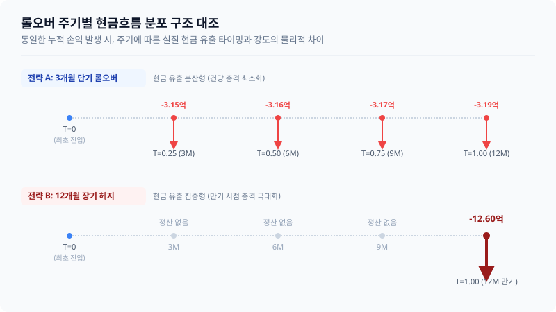

# 3장. 헤지 기간과 롤오버

## 3.4 롤오버 주기 선택의 트레이드오프

### 도입

이전 절([3.3])에서 우리는 롤오버가 실행될 때마다 계약 환율이 시장의 실제 흐름을 반영하여 단계적으로 재결정(Reset)되며, 최종 만기 시점에는 중간에 격렬하게 요동치던 현물환율이 수학적으로 정밀하게 소거된다는 사실을 확인했습니다. 결국 전체 기간의 실질 최종 환율은 중간 경로와 관계없이 오직 최초 진입 환율과 경과 기간 동안 누적된 스왑포인트의 선형 결합($S_0 + \sum SP$)으로 귀결된다는 환 헤지 구조의 명확한 통제 가능성을 확인했습니다.

그렇다면 합리적인 투자자로서 지극히 타당한 의문이 하나 생깁니다.  
**"수학적으로 정산 금액의 종착지가 완전히 동일하다면, 굳이 왜 매 분기마다 번거로운 갱신 절차와 정산 절차를 쪼개어가며 여러 번 롤오버를 실행해야 하는가? 처음부터 최종 만기(예: 1년 또는 3년)에 정확히 맞춘 단 하나의 장기 선물환 계약을 체결해 두면 안 되는 것인가?"**

이 질문에 대한 해답은 금융공학의 가장 고전적이면서도 불변하는 진리인 **'트레이드오프(Trade-off; 상충 관계)'**에 들어있습니다. 단기 롤오버(1~3개월 단위)와 장기 고정 헤지(6~12개월 이상 장기 계약)는 어느 한쪽이 다른 한쪽을 완벽하게 압도하는 절대 선(善)의 전략이 아닙니다. 기간의 구조를 결정하는 바로 그 순간, 우리는 기업 재무의 핵심 변수인 **'유연성(Flexibility)'**과 **'안정성(Stability)'**, 그리고 **'실물 유동성 리스크(Liquidity Risk)'**와 **'은행 신용한도 소요(Credit Line Usage)'**라는 금융의 저울 위에 올려진 계약의 추들을 정밀하게 맞바꾸는 맞교환(Trade)을 실행하는 것입니다.

이번 절에서는 롤오버 주기를 선택할 때 기업과 펀드가 반드시 검토해야 하는 핵심 영향 요소들을 구체적인 수치 시나리오를 바탕으로 대조 분석합니다. 이를 통해 기업의 실질적인 유동성 체력과 이행 시나리오에 따른 '최적의 헤지 주기 선택 프레임워크'를 제시하겠습니다.

---

### 1. 구체적 수치 시나리오: 3개월 단기 롤오버 vs 12개월 장기 헤지

독자의 인지적 맥락을 흐트러뜨리지 않고 일관성을 유지하기 위해, 앞서 우리가 다루었던 보유 자산 규모와 기초 금리 조건 시나리오를 그대로 차용하여 주기에 따른 실제 흐름의 격차가 어떻게 벌어지는지 입체적으로 추적해 보겠습니다.

#### [일관된 수치 시나리오 조건]
*   **보유 외화 자산:** $\$10,000,000$ (미국 국채, 1년 보유 가정)
*   **초기 투자 시점 ($T=0$) 환율 ($S_0$):** $1,300\text{ 원/달러}$
*   **연간 내외 금리차:** $-2.00\%\text{p}$ (한국 무위험 금리 연 $3.50\%$ - 미국 무위험 금리 연 $5.50\%$)
    *   이에 따라 연간 선물환 적용 스왑레이트 할인율은 **$-2.00\%$**로 고정된다고 가정합니다.
    *   3개월(분기) 단위의 롤오버 스왑레이트 할인율은 연간 비율을 시간 경과에 비례하여 단순 일할 계산한 **$-0.50\%$**로 적용합니다.
*   **1년간 달러 환율의 우상향(원화 약세) 경로:**
    *   $T=0$ (초기 계약 진입): $1,300\text{ 원}$
    *   $T=0.25$ (3개월 경과): $1,325\text{ 원}$
    *   $T=0.50$ (6개월 경과): $1,350\text{ 원}$
    *   $T=0.75$ (9개월 경과): $1,375\text{ 원}$
    *   $T=1.00$ (12개월 최종 만기): $1,400\text{ 원}$

이 시장 환경 하에서 **[전략 A: 3개월 단위 롤오버 (연 4회 갱신)]**와 **[전략 B: 12개월 만기 고정 헤지 (연 1회)]**를 실행하였을 때 발생하는 정산 시점의 도래와 실제 오고 가는 현금흐름(Cash Flow)의 규모를 정밀하게 대조해 보겠습니다.

#### [표 3.5] 주기별(3개월 vs 12개월) 롤오버 정산 현금흐름 수치 비교

| 시점 ($T$) | 시장 현물환율 ($S_t$) | [전략 A] 3개월 롤오버 (계약 환율 및 정산액) | [전략 B] 12개월 헤지 (계약 환율 및 정산액) |
| :---: | :---: | :--- | :--- |
| **$T=0$** | $1,300\text{ 원}$ | - 신규 계약 체결 ($F_{0} = 1,293.5\text{ 원}$)<br>*($1,300\text{ 원} \times 0.995$)* | - 신규 계약 체결 ($F_{0} = 1,274.0\text{ 원}$)<br>*($1,300\text{ 원} \times 0.98$)* |
| **$T=0.25$**<br>(3개월) | $1,325\text{ 원}$ | - **직전 계약 정산:** **$-3.15\text{억 원}$**<br>*$(1,293.5 - 1,325) \times \$10\text{M}$*<br>- 신규 계약 체결 ($F_{1} = 1,318.4\text{ 원}$)<br>*($1,325\text{ 원} \times 0.995$, 소수점 둘째 자리 반올림)* | - 현금 정산 없음<br>(장부상 평가손실 상태) |
| **$T=0.50$**<br>(6개월) | $1,350\text{ 원}$ | - **직전 계약 정산:** **$-3.16\text{억 원}$**<br>*$(1,318.4 - 1,350) \times \$10\text{M}$*<br>- 신규 계약 체결 ($F_{2} = 1,343.3\text{ 원}$)<br>*($1,350\text{ 원} \times 0.995$)* | - 현금 정산 없음<br>(장부상 평가손실 상태) |
| **$T=0.75$**<br>(9개월) | $1,375\text{ 원}$ | - **직전 계약 정산:** **$-3.17\text{억 원}$**<br>*$(1,343.3 - 1,375) \times \$10\text{M}$*<br>- 신규 계약 체결 ($F_{3} = 1,368.1\text{ 원}$)<br>*($1,375\text{ 원} \times 0.995$)* | - 현금 정산 없음<br>(장부상 평가손실 상태) |
| **$T=1.00$**<br>(12개월) | $1,400\text{ 원}$ | - **직전 계약 정산:** **$-3.19\text{억 원}$**<br>*$(1,368.1 - 1,400) \times \$10\text{M}$*<br>- 최종 만기 종료 | - **최종 만기 정산:** **$-12.60\text{억 원}$**<br>*$(1,274.0 - 1,400) \times \$10\text{M}$*<br>- 최종 만기 종료 |
| **누적 정산액** | - | **총 $-12.67\text{억 원}$** | **총 $-12.60\text{억 원}$** |



#### 시나리오 심층 분석: 최종 목적지는 같으나 과정의 결이 다르다

위 대조 시나리오의 수치적 결과물은 우리에게 매우 의미 있는 경영학적 통찰력을 시사합니다.

1.  **헤지 비용의 수학적 근접성:** 3개월짜리 단기 롤오버를 네 차례에 걸쳐 회전하면서 유출한 총 정산액 합계($-12.67\text{억 원}$)와 처음부터 1년의 기간을 완벽히 매칭하여 계약을 유지한 후 최종 결제 시점에 지불한 단일 정산액($-12.60\text{억 원}$)의 격차는 약 $700\text{만 원}$에 불과합니다. 이 미세한 격차는 분기 단위로 환율이 리셋될 때마다 새로운 스왑레이트가 누적 적용되는 일종의 기하복리 효과와 시장의 순간적인 수급 미스매치로 인해 발생하는 부차적인 부분입니다. 즉, **이론적인 비용 누적량은 주기와 관계없이 거의 동등한 궤적을 그리며 융합**됩니다.
2.  **현금 분산의 압박감 대조:** 그러나 이를 감내해야 하는 기업 재무팀의 '체감 현금흐름 압박'은 전혀 다르게 분포합니다. **전략 A(3개월 단기 롤오버)**는 매 분기마다 $3.15\text{억 원} \sim 3.19\text{억 원}$의 실물 현금을 쪼개어 시장으로 내보냈습니다. 반면에 **전략 B(12개월 장기 헤지)**는 만기 바로 전날인 11개월 차까지는 단 $1\text{원}$의 실물 현금 정산 요구도 받지 않아 평온함을 누리다가, 최종 만기일에 **$12.60\text{억 원}$이라는 대규모의 일시적인 현금 정산 압박(Margin Call)**을 통째로 받아들여야 합니다.

만약 기업이 최종 인도 시점에 매각할 달러 자산(미국 국채)의 원활한 현지 환가 절차를 즉각 매칭하지 못하고 일시적인 대기 시간(Lag time)을 겪는 상황에 놓여 있다면, 전략 B가 가하는 단일 시점의 충격은 기업의 운전 자금을 일시적으로 동결시켜버리는 심각한 유동성 경색 위험을 촉발하게 됩니다.

<iframe src="contents/fx_hedge_strategy_01/sec_03/assets/diagrams/sub_03_04_visual1.html" width="100%" height="480px" frameborder="0" scrolling="yes"></iframe>

---

### 2. 단기 vs 장기 롤오버 핵심 비교표

기업이 마주할 각 의사결정의 무게를 비교하기 위해, 단기 롤오버 전략과 장기 고정 헤지 전략의 특징을 5대 핵심 파이낸스 차원에서 구조화하여 대조해 보겠습니다.

#### [표 3.6] 단기 롤오버(1~3개월) vs 장기 헤지(6~12개월 이상) 상세 대조

| 비교 기준 차원 | 단기 롤오버 (1~3개월 주기) | 장기 헤지 (6~12개월 이상 주기) |
| :--- | :--- | :--- |
| **스왑레이트 비용 구조** | **매 롤오버 시점의 변동 금리화**<br>계약을 연장할 때마다 양국의 시장 무위험 금리가 새롭게 리셋되므로, 장기 금리차의 변동성에 그대로 노출됨. | **체결일 고정 비용 확정 (Fixed Cost)**<br>진입 시점에 1년 전체에 걸친 스왑포인트 감액분이 일시에 결정되어 중간 스왑 시장의 가격 노이즈가 완전히 차단됨. |
| **환율 통제 안정성** | **이동형 고정 환율선 (Step-up/down)**<br>현물환율($S_t$)이 이동하는 궤적을 징검다리처럼 밟고 가므로 최초 고안했던 환율과의 괴리도가 상대적으로 증가할 수 있음. | **최초 고율선 완벽 결계 (Perfect Lock-in)**<br>중간 시장 환율이 천정부지로 솟구치든 폭락하든 상관없이 최초에 체결한 단 하나의 환율로 포트폴리오를 완벽하게 감금 및 보장함. |
| **유동성 압박 분포** | **정산 빈도가 잦아지나 건당 충격 완화**<br>환율 변동에 따라 분기/월 단위로 현금이 빈번히 정산되어, 한 번에 수억~수십억이 빠져나가는 통장 잔고의 변동 폭을 평탄화함. | **만기 종료 시점까지 결제 이연**<br>중도 평가손익은 전액 무현금 장부상 평가액으로만 유지되나, 최종 청산일 당일에 모든 환 손익이 현금 흐름으로 동시에 폭발하여 집중됨. |
| **실물 시나리오 대응 유연성** | **상황 대처의 기민성 확보**<br>수출 대금 입금 지연, 포트폴리오 조기 청산 등 사업 계획 수정이 발생할 때 차기 롤오버 시점에 맞춰 계약 수량과 만기를 유연하게 가감 가능함. | **중도 취소 시 고율 페널티 징구**<br>장기 계약을 중간에 무리하게 변경하거나 중도 정산하여 청산할 경우, 은행 측의 일방적인 청산 호가(Bid-Ask Spread) 반영으로 큰 명목 비용 발생. |
| **은행 신용한도 점유액<br>(Credit Line Allocation)** | **낮은 한도 요구량**<br>계약의 잔존 잔기가 매우 짧아 은행 내부 시스템상 평가되는 잠재 위험 누출액(PFE)이 낮게 설정되어 신용한도를 적게 할당함. | **높은 한도 요구량**<br>긴 만기 동안 발생 가능한 환율의 최대 이탈 범위가 크므로 은행은 기업의 신용을 대규모로 구속하여 타 대출 한도를 압박함. |

---

### 3. 경제적 원리와 물리적 범위 증명

#### (1) 시간과 변동성의 비례 법칙: 왜 장기 헤지는 큰 신용한도를 소요하는가?

중소기업이나 레버리지를 많이 사용하는 헤지펀드들이 무작정 장기 선물환을 길게 걸지 못하는 가장 결정적인 물리적 제약은 바로 **'은행의 익스포저 관리'**에 있습니다. 

계약 불이행(Default) 리스크를 평가할 때, 은행은 단순히 현재 평가손실뿐만 아니라 '앞으로 만기까지 남은 시간 동안 환율이 최악의 상황으로 발산할 때 발생 가능한 최대 잠재적 위험액'인 **PFE(Potential Future Exposure)**를 산출합니다. 금융 수학적으로 이 잠재적 노출 가치는 잔존 만기 $t$의 제곱근에 비례하여 비대칭적으로 팽창합니다.

$$\text{PFE} \propto \sigma \sqrt{t}$$

여기서 $\sigma$는 해당 통화쌍의 연간 환율 변동성, $t$는 선도 계약의 잔존 연도 비율입니다. 만약 만기 3개월짜리 단기 계약과 12개월짜리 장기 계약을 대조해 본다면, 환율이 기업의 예측 범위를 비껴나가 파괴적인 폭등세나 폭락세를 보일 수 있는 물리적 시공간 범위는 장기 계약 측이 정확히 **2배**($\sqrt{12 / 3} = \sqrt{4} = 2$) 더 넓게 열려 있습니다. 

이에 따라 은행 여신 담당 부서는 장기 계약에 대해 2배 이상 넉넉한 신용한도(FX Line)를 설정하여 묶어 버립니다. 결국 장기 헤지를 고집하는 행위는 은행으로부터 추가 운전자금 대출이나 시설 자금 차입을 받아낼 수 있는 우리 기업의 소중한 신용 무기를 스스로 낭비하는 경제적 대가를 수반하게 됩니다.

#### (2) 누적 소거와 스프링 효과: 유동성 리스크의 시간적 불일치

이전 절[3.3]에서 우리는 수학적으로 중간 정산 시점의 현물환율 $S_t$는 누적 계산 전개식에서 흔적도 없이 소거됨을 증명했습니다. 하지만 현실 기업 경영 환경에서 가장 중요한 현금 흐름의 **'타이밍(Timing)'**은 수학 공식처럼 지워지지 않습니다.

```
[ 단기 롤오버의 현금흐름 스프링 효과 메커니즘 ]

환율 지속 상승 국면 (1,300원 -> 1,400원)
├── 3M (T=0.25): [선물환 매도자] 3.15억 현금 정산 유출  ===>  (자산 미매각 상태로 유동성 결손 발생)
├── 6M (T=0.50): [선물환 매도자] 3.16억 현금 정산 유출  ===>  (유동성 결손 누적)
├── 9M (T=0.75): [선물환 매도자] 3.17억 현금 정산 유출  ===>  (유동성 결손 극대화)
└── 12M(T=1.00): [실물 청산 시점] 외화자산 $10M을 1,400원에 매각하여 원화 140억 원 유입!
                 ===> 그동안 유출되었던 누적 정산액 12.67억 원을 회수하며 최종 "수학적 평형" 달성
```

이 흐름은 팽팽하게 감겨 있던 스프링이 정산 시점마다 끊임없이 복원력을 행사하며 기업의 현금을 빨아들이는 형태를 띱니다. 최종 12개월 만기 시점에 도달하면 해외 자산을 당시 폭등한 높은 환율(1,400원)로 매각하여 한꺼번에 원화 유입($140\text{억 원}$)을 일으켜 수학적 평형에 완벽히 복귀하지만, 중간 3개월, 6개월, 9개월 차에 통장잔고에서 야금야금 빠져나간 총 $9.5\text{억 원}$에 달하는 현금 유출을 버틸 체력이 없는 기업은 **"자산 가치는 우량하지만, 헤지 계약의 현금 요구를 감당하지 못해 도산하는" 최악의 유동성 미스매치(Liquidity Mismatch)** 파국에 부딪히게 됩니다.

---

### 4. 회계적 보완책: 일반기업회계기준(K-GAAP)의 시선

이렇듯 현금의 움직임과 장부상의 실재가 격렬하게 뒤엉키는 롤오버 과정을, 기업의 회계 시스템은 어떻게 정교하게 포장하여 보여주고 있을까요? 일반기업회계기준(K-GAAP) 제17장(파생상품평가)에 따른 **현금흐름위험회피회계**는 이 두 주기 전략에 대해 다음과 같은 관점을 견지합니다.

```
[ K-GAAP 현금흐름위험회피 적용 시 장부와 금고의 대조 ]

1. 단기 롤오버 전략 실행 시:
   - 3개월 차 실제 금고: 통장에서 현금 3.15억 원 송금 완료 (실제 현금 유출)
   - 3개월 차 장부(I/S): 평가손실 또는 거래손실 0원 인식 (당기손익 영향 없음)
   * 이유: 당해 실물 거래 만기(1년 뒤)까지 손익 인식을 이연하여 자본(OCI)에 임시 봉인하기 때문.

2. 장기 헤지 전략 실행 시:
   - 3개월 차 실제 금고: 통장 현금 유출 전혀 없음 (실제 현금 보존)
   - 3개월 차 장부(I/S): 당기손익에 미치는 영향 0원 (자본 OCI 항목에 장부상 평가액으로 기록)
```

회계 기준(K-GAAP)은 위험회피회계를 적용하여 두 전략 모두 만기 시점에 자산의 이익과 헤지 정산 손실을 일대일로 묶어서 보고함으로써 **'최종 손익계산서(I/S) 상의 평온함'**을 똑같이 구현해 줍니다. 

하지만 아무리 정교한 회계 시스템이라 할지라도 **실제 통장에서 돈이 빠져나가는 실물 경제적 차이까지 통제할 수는 없습니다.** 따라서 CFO는 단순히 위험회피회계가 적용되므로 장부가 안전하다는 안일한 생각에 빠져서는 안 되며, 단기 롤오버를 선택할 때는 반드시 실질적인 Cash Buffer(현금 실탄)의 한도를 은행 여신과 조화롭게 융합하여 설계해야 합니다.

#### [K-IFRS(한국채택국제회계기준)와의 대비]
*   **K-GAAP:** 위험회피 지정의 정량적 평가 요건($80\% \sim 125\%$ 룰)이 엄격하여, 환율이 극단적인 구간으로 치달아 비율 범위를 단 한차례 이탈하게 되면 과거 자본에 누적시켜 두었던 수억 원의 롤오버 정산 잔액이 그 즉시 **당기 손실로 당해 분기에 일시 실현**되어 재무제표를 크게 왜곡시킬 위험을 내포하고 있습니다.
*   **K-IFRS (IFRS 9):** 정량적 요건의 엄격성을 완화하는 동시에, 단기 롤오버에서 발생하는 이자율 스프레드 누적 변동액을 **위험회피비용(Cost of Hedging)**이라는 특수 자본 항목으로 구획화하여, 최종 자산 처분 시점까지 체계적으로 안분하여 인식할 수 있는 고도화된 선택지를 마련하고 있습니다.

---

### 5. 최적 주기를 찾기 위한 의사결정 프레임워크

그렇다면 우리 기업은 지금 이 순간 어떤 주기를 헤지의 기본 축으로 결정해야 할까요? 이 결정은 단순한 실무자의 감이 아닌, **'가용 현금 유동성(Liquidity)'**이라는 세로축과 **'이행 및 전망의 확실성(Certainty of Execution & FX Outlook)'**이라는 가로축이 교차하는 사분면 정량 분석 모델 위에서 정교하게 정렬되어야 합니다.

여기서 가로축인 **'확실성'**은 단순히 "실물 계약이 중도 파기되지 않고 정상 이행될 확률"에 국한되지 않으며, **"미래 환율의 방향성에 대한 기업의 거시적 전망 확신도(View Conviction)"**까지 통합적으로 수용한 가중 지표입니다. 예컨대, 실물 거래 자체는 확실하나 환율 변동의 폭과 방향성이 극히 무질서하여 예측 범위를 벗어날 우려가 있다면 이 확실성은 급격히 좌측(Low)으로 수축하게 됩니다.

<iframe src="contents/fx_hedge_strategy_01/sec_03/assets/diagrams/sub_03_04_visual2.html" width="100%" height="520px" frameborder="0" scrolling="yes"></iframe>

#### 각 사분면별 추천 처방 전략

1.  **제 1 사분면 (확실성 High / 유동성 High) ➔ [추천: 레이어드 헤지(Layered)]**
    *   기업의 유동성 버퍼가 가장 강력하고, 사업 계약의 기일 이행과 환율 하방 안정화 전망에 대한 확신이 뚜렷한 상태입니다. 이때는 단기 계약과 장기 계약을 **$30:70$ 또는 $40:60$ 비율로 분할 믹스**하는 레이어드(Layered) 포트폴리오를 지향합니다. 안정적으로 장기 고정 환율 마진을 확보하면서도 일부는 단기 롤오버로 매칭하여 사업 계획 변화에 기민한 출구 전략을 병행 확보합니다.
2.  **제 2 사분면 (확실성 Low / 유동성 High) ➔ [추천: 단기 롤오버 기민성 대응]**
    *   현금 여력은 넉넉하지만 결제 대금 기일이 뒤로 계속 밀릴 가능성이 있거나, 환율이 단기 급변동하여 방향성을 예측하기 어렵습니다. 이때 장기 계약을 무리하게 체결하면 중도 파기 페널티를 무겁게 얻어맞습니다. 따라서 **1~3개월 단위의 아주 짧은 단기 롤오버** 위주로만 자금을 회전시키면서 시장의 전개 속도와 실물 대금 유입 시점에 맞춰 헤지 노출량을 실시간으로 조율하는 유연성 우선 정책을 고수해야 합니다.
3.  **제 4 사분면 (확실성 High / 유동성 Low) ➔ [추천: 장기 고정 헤지 올인]**
    *   해외 사업의 거래 체결 성사는 100% 확실하나 당장 회사의 가용 금고 잔고가 바닥나 있는 시기입니다. 만일 이 상황에서 3개월 롤오버를 선택했다가 환율 급등으로 마진콜 현금 요구를 마주하면 즉각 흑자 도산에 빠집니다. 따라서 이때는 오직 만기 당일에 단 한차례 정산하는 **6~12개월 만기 고정 선물환 계약**에만 집중해야 합니다. 중간 유출 가능성을 철저하게 소거하는 방어적 장벽을 구축하는 것이 생존의 지름길입니다.
4.  **제 3 사분면 (확실성 Low / 유동성 Low) ➔ [추천: 헤지비율 축소 또는 파생 옵션 검토]**
    *   계약 취소 가능성도 높고 정산금을 지급할 돈도 전혀 없는 가장 위험한 비상 단계입니다. 무리한 선물환 매도는 기업의 수명을 단축시킬 뿐입니다. 기본 헤지 타깃 비율 자체를 기존 계획 대비 절반 이하로 극단적으로 깎아내거나, 일정한 프리미엄(보험료)만 지급하고 최악의 폭락 위험만 막아낸 뒤 중도 마진콜 의무가 전혀 없는 **외환 옵션(Put/Call Option)** 상품을 긴급 수혈해 하방 리스크에 대한 안전망만 최소한으로 둘러쳐야 합니다.

---

### 요약

1.  **주기별 등가성과 차별성:** 단기 롤오버와 장기 고정 헤지는 다년도 누적 관점에서의 수학적 실질 비용($S_0 + \sum SP$)이 수렴하도록 수렴 공식을 가집니다. 그러나 중간 과정에서 기업이 버텨야 하는 **유동성 압박 타이밍과 신용한도 소요량**은 완전히 다른 형태로 전개됩니다.
2.  **단기 롤오버의 입체성:** 거래 변경 및 환율 추종에 있어 뛰어난 유연성을 공급하는 무기이지만, 환율의 편향적 급변기에는 만기 전 **주기적 정산금 유출(스프링 복원 효과)**로 인해 기업 통장 잔고를 실시간으로 고갈시킬 수 있습니다.
3.  **장기 헤지의 방어성:** 만기 청산일 전까지 현금 유출 요구를 차단하여 유동성을 원천 방어하는 보호막 역할을 수행하지만, 긴 만기로 인한 미래 변동성의 팽창($\sigma \sqrt{t}$) 때문에 **은행의 외환 거래 신용한도(Credit Line)를 넓은 면적으로 잠식**하여 여타 금융 활동을 제한합니다.
4.  **사분면 의사결정의 당위성:** 최적 주기는 기업 재무 담당자의 직관이나 은행의 임의적 권고에 흔들리지 않고, 자사의 **'현재 가용 현금 유동성'**과 **'실물 거래 이행 및 환율 전망의 확실성'**을 두 축으로 하는 사분면 포지셔닝에 따라 정량적이고 체계적인 공식 처방에 의해 도출되어야 합니다.