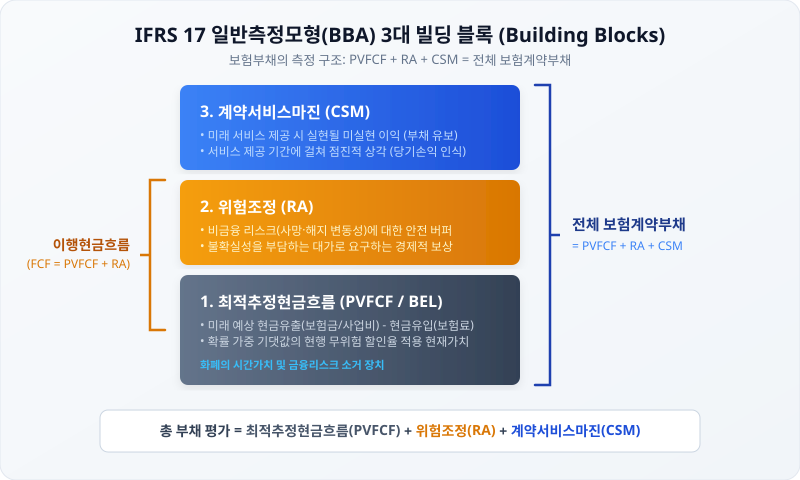

# 1.1 IFRS 17 부채 측정 기준과 CSM의 개념 (Building Blocks)

## 도입

보험산업의 회계 패러다임이 역사적 전환기를 맞이했습니다. 오랜 기간 유지되어 온 과거 계약 시점의 역사적 원가 기준인 IFRS 4가 폐지되고, 현행가치 및 시가평가를 골자로 하는 **K-IFRS 제1117호(이하 IFRS 17)**가 도입되었습니다. 이 변화의 핵심은 보험부채를 '과거 가입 시점의 고정된 가치'가 아니라 '매 보고기간 말 현재의 시장 환경과 리스크를 반영한 가치'로 측정하는 데 있습니다.

본 절에서는 IFRS 4와 IFRS 17의 근본적인 철학적 차이를 구체적 수치 시나리오로 대조하고, IFRS 17 부채 평가의 근간이 되는 **일반측정모형(BBA, Building Block Approach)**의 3대 요소인 **최적추정현금흐름(PVFCF)**, **위험조정(RA)**, **계약서비스마진(CSM)**의 정의와 작동 원리를 명확히 정립합니다. 나아가 체결 시점의 미실현 이익을 즉시 인식하지 않고 부채로 유보해 두는 CSM의 이연 메커니즘, **손익분기점(BEP)** 유도 수식, 그리고 만기까지 부채와 손익이 상각·소거되며 수렴하는 **선형 완결성**을 체계적으로 규명합니다.

---

## 1. IFRS 4와 IFRS 17의 패러다임 시프트

IFRS 4와 IFRS 17의 가장 극적인 차이는 **"부채를 평가하는 시점의 할인율과 위험을 어떻게 반영하는가"**에 있습니다. 두 기준의 차이를 명확히 이해하기 위해 동일한 보험계약 시나리오를 바탕으로 두 제도가 부채를 측정하는 방식을 대조해 보겠습니다.

### [공통 수치 시나리오]
* **계약 조건:** 3년 만기 일시납 보장성 보험 (가입 시점 $t=0$)
* **수납 보험료:** $1,000$원 (가입 즉시 수납)
* **기대 지급금 (지출):** 3년 차 말($t=3$)에 사망보험금 $800$원 발생 예상
* **가입 시점($t=0$) 시장 금리:** 연 $5.0\%$
* **1년 경과 시점($t=1$) 시장 금리:** 연 $2.0\%$ (금리 급락 상황 가정)

<iframe src="contents/ifrs17_csm_risk_modeling/sec_01/assets/diagrams/sub_01_01_visual1.html" width="100%" height="450px" frameborder="0" scrolling="yes"></iframe>

| 평가 요소 | IFRS 4 (원가 기준 평가) | IFRS 17 (현행가치 기준 평가) |
| :--- | :--- | :--- |
| **적용 할인율** | 가입 시점 금리(연 $5.0\%$)로 **고정 (Lock-in)** | 매 보고기간 말 현재 시장 금리(연 $2.0\%$)로 **매번 업데이트 (Lock-out)** |
| **$t=1$ 시점의 부채 평가 가치** | $t=1$ 시점에 남아있는 미래 지출($t=3$: $800$원)을 초기 금리 $5.0\%$로 할인.<br>$$\text{부채}_{t=1} = \frac{800}{(1 + 0.05)^2} \approx 725.62\text{원}$$ | $t=1$ 시점에 남아있는 미래 지출을 급락한 현재 시장 금리 $2.0\%$로 할인.<br>$$\text{부채}_{t=1} = \frac{800}{(1 + 0.02)^2} \approx 768.93\text{원}$$ |
| **금리 변동의 영향 반영** | 금리가 $5.0\%$에서 $2.0\%$로 폭락했음에도 부채 평가는 변화 없음 (금리 리스크 은폐) | 금리 하락으로 인한 부채의 가치 상승($+43.31$원)을 즉시 장부에 반영 (재무 실질 노출) |

### 원가 평가의 한계와 시가 평가의 필연성
IFRS 4 하에서는 금리가 아무리 떨어져도 과거 가입 시점에 약속한 예정이율을 그대로 사용하기 때문에, 보험회사의 부채가 과소평가되는 착시 현상이 발생합니다. 반면 IFRS 17은 매 보고기간 말의 시장 금리를 즉시 반영하여 부채를 평가하므로, 금리 변동에 따른 보험회사의 실제 리스크 노출 현황을 투명하게 드러내어 자산부채종합관리(ALM)의 필연성을 제공합니다.

---

## 2. 일반측정모형(BBA)의 3대 빌딩 블록 (Building Blocks)

IFRS 17 하에서 보험부채는 단일 항목으로 추정되지 않고, 계약의 경제적 실질을 나타내는 3가지의 연산 블록(Building Blocks)을 적층하여 구성됩니다. 이를 **일반측정모형(BBA, Building Block Approach)**이라고 부릅니다.



### ① 최적추정현금흐름 (PVFCF, Present Value of Future Cash Flows)
PVFCF는 보험계약으로 인해 발생할 **모든 미래 현금유입(보험료 등)과 현금유출(보험금, 사업비 등)을 확률 가중평균한 뒤, 현재 가치로 할인한 값**입니다. 통계적 편의(Bias)가 없는 최선의 추정치라는 의미에서 **BEL(Best Estimate Liability)**이라고도 부릅니다.

$$PVFCF = \sum_{t=1}^{T} \frac{E[\text{Outflow}_t] - E[\text{Inflow}_t]}{(1 + r_t)^t}$$

여기서 $E[\cdot]$는 확률 가중 기댓값이며, $r_t$는 $t$시점의 현행 무위험 할인율에 유동성 프리미엄을 가산한 할인율입니다. 분모의 할인율은 화폐의 시간가치와 금융리스크를 소거하여 불확실한 미래 유출액을 **'현시점의 확실한 현금 등가물'**로 전환하는 시간 소거 장치 역할을 합니다.

### ② 위험조정 (RA, Risk Adjustment for Non-Financial Risk)
미래 현금흐름은 고정되어 있지 않으며, 사망률·해지율·사고율 등 비금융적 요인에 의해 변동할 불확실성이 존재합니다. **위험조정(RA)**은 이와 같은 **비금융 리스크의 변동성을 부담하는 대가로 보험회사가 요구하는 경제적 보상(안전 버퍼)**입니다.

PVFCF에 RA를 더한 값을 **이행현금흐름(FCF, Fulfilment Cash Flows)**이라고 하며, 이는 계약상의 의무를 이행하기 위해 순수하게 투입되어야 할 정량적 원가 가치를 의미합니다.

$$FCF = PVFCF + RA$$

### ③ 계약서비스마진 (CSM, Contractual Service Margin)
CSM은 **보험계약으로부터 미래에 얻을 것으로 기대되는 미실현 이익**입니다. 보험은 수년에 걸쳐 서비스를 제공하는 장기 계약이므로, 계약 첫날 예상되는 이익을 즉시 당기순이익으로 인식하지 않고 부채 항목인 CSM으로 묶어둔 뒤, 계약 기간 동안 보장 서비스를 제공하는 비율에 따라 점진적으로 상각하여 수익으로 인식합니다.

---

## 3. 첫날 이익(Day-1 Profit) 인식 금지 원리와 CSM 산출

왜 미실현 이익을 부채로 유보해야 할까요? 이 원리는 첫날 이익을 즉시 인식했을 때의 재무제표 왜곡과 CSM을 통해 이연시켰을 때의 안정적 대차평형을 대조해 보면 명확해집니다.

### [수치 시나리오]
* 가입 시점($t=0$) 수납 보험료(현금 유입): $-1,000$원
* $t=0$ 시점의 최적추정현재가치($PVFCF_0$): $+691.07$원 (3년 뒤 $800$원 지출을 $r=5\%$로 할인)
* 비금융 위험 버퍼($RA_0$): $+50.00$원
* 이행현금흐름($FCF_0$): $691.07 + 50.00 = 741.07$원

### [실패 사례] CSM 부재 시: 첫날 이익($Day-1\ Profit$)을 즉시 이익으로 인식할 때
CSM이라는 완충 부채가 없다면, 보험회사는 가입 첫날 수취한 현금($1,000$원)과 부채 원가($741.07$원)의 차액인 **$258.93$원을 가입 즉시 당기순이익으로 인식**하게 됩니다.
* **문제점:** 서비스가 시작되기도 전에 이익을 전부 실현 처리함으로써 초기 실적이 과대계상되고, 이후 보장 기간에는 의무만 남게 되어 기간별 수익-비용 대응이 심각하게 왜곡됩니다.

### [성공 사례] CSM 적용 시: 첫날 미실현 이익을 부채로 유보할 때
IFRS 17은 가입 시점에 수취한 자산이 이행현금흐름보다 커서 이익이 발생하는 경우, 그 차액을 부채인 **CSM**으로 강제 유보합니다.

$$CSM_0 = - (PVFCF_0 + RA_0 + \text{기초현금흐름}_0)$$

$$CSM_0 = - (691.07\text{원} + 50.00\text{원} - 1,000\text{원}) = +258.93\text{원}$$

이 $258.93$원이 부채의 세 번째 블록인 CSM으로 적립되어 $t=0$ 시점의 대차대조표는 완벽한 균형을 이룹니다.

```
[ 자산 (Asset) ]                  [ 부채 (Liability) ]
현금 : 1,000.00원                 PVFCF :  691.07원
                                  RA    :   50.00원
                                  CSM   :  258.93원
------------------------------------------------------
자산 총계: 1,000.00원             부채 총계: 1,000.00원
                                 (자본 변동 / 당기손익 = 0원)
```

가입 첫날 자산과 부채가 동일해지면서 **첫날 이익($Day-1\ Profit$)은 정확히 $0$원으로 통제**되며, CSM은 향후 3년에 걸쳐 서비스를 제공함에 따라 점진적으로 상각되어 당기손익(보험계약수익)으로 전환됩니다.

---

## 4. 손실계약(Onerous Contract)과 손익분기점(BEP)의 도출

보험료를 너무 낮게 책정했거나 위험이 커서 가입 첫날부터 적자가 예상되는 계약은 어떻게 처리해야 할까요? IFRS 17은 이익의 인식에는 보수적(CSM 이연)이지만, **손실의 인식에는 엄격하여 예상 손실을 계약 첫날 즉시 당기비용으로 인식**하도록 규정합니다.

### 손익분기점(BEP) 공식 유도
계약 체결 시점($t=0$)에 수취하는 일시납 보험료를 $P$, 무위험 할인율을 $r$, 만기를 $T$, 위험조정을 $RA$라 할 때, CSM이 정확히 $0$이 되는 **손익분기 미래보험금($C_{BEP}$)**을 도출해 보겠습니다.

CSM이 $0$이 되는 경계 조건:
$$P - \left( \frac{C_{BEP}}{(1+r)^T} + RA \right) = 0$$

이 방정식을 $C_{BEP}$에 대해 정리합니다.
$$\frac{C_{BEP}}{(1+r)^T} = P - RA$$

$$C_{BEP} = (P - RA) \times (1+r)^T$$

위 공식에 파라미터($P = 1,000$원, $RA = 50$원, $r = 5\%$, $T = 3$년)를 대입해 봅니다.

$$C_{BEP} = (1,000 - 50) \times (1.05)^3 = 950 \times 1.157625 \approx 1,099.74\text{원}$$

즉, 3년 뒤 지급할 것으로 예상되는 보험금 기댓값이 **$1,099.74$원을 단 $1$원이라도 초과하는 순간**, 이 계약은 손실계약으로 전환됩니다.

<iframe src="contents/ifrs17_csm_risk_modeling/sec_01/assets/diagrams/sub_01_01_visual2.html" width="100%" height="450px" frameborder="0" scrolling="yes"></iframe>

### 극단적 대조 사례 비교 ($C = 1,300$원 설정 시)
만약 시장 경쟁으로 인해 미래 예상 지급 보험금이 손익분기 한계값을 초과하여 **$1,300$원**으로 상승한 시나리오를 대조해 봅니다.

1. **PVFCF 계산:**
   $$PVFCF_0 = \frac{1,300}{(1.05)^3} \approx 1,122.99\text{원}$$
2. **이행현금흐름(FCF) 계산:**
   $$FCF_0 = 1,122.99 + 50.00 = 1,172.99\text{원}$$
3. **CSM 및 손실요소(Loss Component) 판정:**
   수취 보험료($1,000$원)보다 이행 부채 원가($1,172.99$원)가 크므로 미실현 이익은 존재하지 않습니다. CSM은 음수가 될 수 없으므로 **$CSM_0 = 0$**으로 하한선에 걸리며, 초과 부담액인 **$172.99$원은 손실요소(Loss Component)로 분류되어 가입 즉시 당기손실(P&L)로 반영**됩니다.

| 구분 | 정상 계약 ($C = 800$원) | 손실 계약 ($C = 1,300$원) |
| :--- | :--- | :--- |
| **수납 보험료 (A)** | $1,000.00$원 | $1,000.00$원 |
| **이행현금흐름 ($FCF_0$) (B)** | $741.07$원 | $1,172.99$원 |
| **계약서비스마진 ($CSM_0$)** | **$258.93$원 (부채 유보)** | **$0.00$원** |
| **최초 손익 효과 (P&L)** | **$0.00$원** | **$-172.99$원 (즉시 손실)** |
| **최초 부채 총액** | $1,000.00$원 | $1,172.99$원 |

---

## 5. 시간에 따른 부채와 손익의 선형 완결성 검증

이 모형이 3년의 계약 기간 동안 어떻게 움직이며 최종적으로 소거(Cancellation)되는지 추적해 보겠습니다. 정상 계약 시나리오($C = 800$원, $P = 1,000$원, $r = 5\%$, 초기 $CSM = 258.93$원)가 최초 가정대로 차감·실현된다고 가정합니다.

* **상각 가정:** CSM 및 RA는 매년 말 잔액의 $1/3$씩 상각되어 P&L 수익으로 환입됩니다.
* **자산 증식:** 수납된 현금 $1,000$원은 매년 $5\%$의 무위험 수익률로 운용 증식합니다.

### 연도별 자산-부채 및 손익 롤오버 (Roll-forward)

#### [t=0 (계약 최초 시점)]
* **자산:** 현금 $1,000.00$원
* **부채:** PVFCF $691.07$원 + RA $50.00$원 + CSM $258.93$원 = $1,000.00$원
* **누적 이익(자본):** $0.00$원

#### [t=1 (1년 경과 시점)]
* **자산의 증식:** $1,000.00 \times 1.05 = 1,050.00$원
* **부채 내부 변동:**
  * PVFCF 이자부리(Unwinding): $691.07 \times 1.05 \approx 725.62$원
  * RA 상각 ($1/3$): 잔액 $33.33$원 (당기 상각액 $16.67$원 수익 인식)
  * CSM 상각 ($1/3$): 잔액 $172.62$원 (당기 상각액 $86.31$원 수익 인식)
* **$t=1$ 부채 총액:** $725.62 + 33.33 + 172.62 = 931.57$원
* **손익 효과:**
  * 보험서비스 수익 (RA 상각 + CSM 상각) = $16.67 + 86.31 = +102.98$원
  * 투자 손익 (자산 이자 수익 - PVFCF 이자부리) = $50.00 - 34.55 = +15.45$원
  * **당기순이익:** $102.98 + 15.45 = 118.43$원
* **자본 검증:** 자산($1,050.00$원) - 부채($931.57$원) = **$118.43$원** (당기순이익과 완벽히 일치)

#### [t=2 (2년 경과 시점)]
* **자산의 증식:** $1,050.00 \times 1.05 = 1,102.50$원
* **부채 내부 변동:**
  * PVFCF 이자부리: $725.62 \times 1.05 \approx 761.90$원
  * RA 상각 ($1/3$): 잔액 $16.67$원 (당기 상각액 $16.66$원 수익 인식)
  * CSM 상각 ($1/3$): 잔액 $86.31$원 (당기 상각액 $86.31$원 수익 인식)
* **$t=2$ 부채 총액:** $761.90 + 16.67 + 86.31 = 864.88$원
* **손익 효과:**
  * 보험서비스 수익 = $16.66 + 86.31 = +102.97$원
  * 투자 손익 = $52.50 (자산) - 36.28 (부채) = +16.22$원
  * **당기순이익:** $102.97 + 16.22 = 119.19$원
* **누적 자본 검증:** $118.43 + 119.19 = 237.62$원 (자산 $1,102.50$원 - 부채 $864.88$원 = **$237.62$원**. 일치)

#### [t=3 (만기 및 보험금 지급 시점)]
* **지급 직전 자산:** $1,102.50 \times 1.05 = 1,157.63$원
* **지급 직전 부채 부리 및 최종 상각:**
  * PVFCF 최종 이자부리: $761.90 \times 1.05 \approx 800.00$원 (실제 지급액과 완벽히 일치)
  * RA 최종 상각: 잔액 $0.00$원 (당기 상각액 $16.67$원 수익 인식)
  * CSM 최종 상각: 잔액 $0.00$원 (당기 상각액 $86.31$원 수익 인식)
* **당기 손익 효과:**
  * 보험서비스 수익 = $16.67 + 86.31 = +102.98$원
  * 투자 손익 = $55.13 (자산) - 38.10 (부채) = +17.03$원
  * **당기순이익:** $102.98 + 17.03 = 120.01$원
* **지급 직전 누적 이익잉여금:** $237.62 + 120.01 = 357.63$원
* **사망보험금 지급 ($800.00$원 현금 유출 및 PVFCF 부채 소멸):**
  * **최종 자산:** $1,157.63 - 800.00 = 357.63$원
  * **최종 부채:** $0.00$원 (계약 소멸)
  * **최종 이익잉여금:** **$357.63$원** (자산 $357.63$원 - 부채 $0.00$원 = **$357.63$원**. 완벽하게 일치)

3년간의 이더레이션을 통해, 시가평가 부채 모형의 가상 부채 항목들(PVFCF, RA, CSM)은 계약 만기 시점에 이르러 모두 잔액 $0$으로 완전 소거되며, 물리적인 자산 증식분과 서비스 제공 대가의 합이 장부상 이익잉여금으로 정확히 선형 수렴함을 알 수 있습니다.

---

## 요약

1. **IFRS 4와 IFRS 17 비교:** IFRS 4는 가입 시점 원가 기준(Lock-in) 할인율을 사용하여 금리 리스크가 은폐되었으나, IFRS 17은 보고기간 말 시가 기준(Lock-out) 할인율을 사용하여 재무 실질을 투명하게 공시합니다.
2. **BBA 3대 구성요소 (Building Blocks):**
   * **PVFCF:** 미래 기대 현금흐름의 시간가치를 소거한 확률가중 현재가치.
   * **RA:** 비금융 위험의 변동성을 부담하는 대가로 요구하는 안전 완충액.
   * **CSM:** 계약 체결 시 발생하는 미실현 미래 이익을 유보한 부채.
3. **첫날 이익 금지와 비대칭성:** 계약 체결 시점의 미실현 이익은 CSM(부채)으로 유보되어 보장 기간에 걸쳐 상각 인식되는 반면, 손실계약의 손실액(Loss Component)은 발견 즉시 당기손실로 전액 반영됩니다.
4. **선형 완결성 검증:** 계약 기간 동안 PVFCF의 이자부리와 RA 및 CSM의 상각이 유기적으로 작동하여 만기 시점에 모든 부채 블록은 소거되며, 실제 자산 운용 결과와 정확히 일치하는 자본(이익잉여금)으로 수렴합니다.