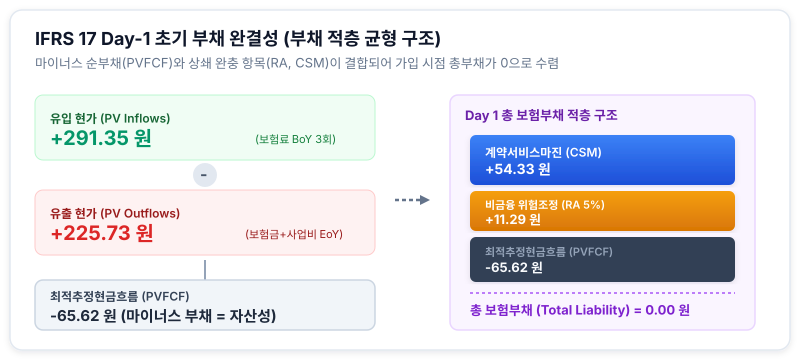

# 1.3 [모델링] 파이썬/엑셀을 활용한 가상 보험계약의 현금흐름 추정 및 초기 CSM 산출

## 도입

앞서 1.2절에서는 신계약 체결 시점에 이익 계약과 적자 계약을 구분하는 산출 메커니즘과, 손실부담계약(Onerous Contract) 전락 시 작동하는 회계적 비대칭성(즉시 당기손실 인식 및 손실요소 설정)의 이론적 필연성을 살펴보았습니다. 1.2절이 계약의 가치를 판정하는 미시적 수학 공식과 언더라이팅 임계점($q_{BEP}$)의 이론적 뼈대를 구축하는 데 집중했다면, 본 절에서는 이를 실제 계리 시스템과 계량 모델 알고리즘으로 이식하는 **'정량적 현금흐름 모델링 엔진 구축'**을 다룹니다.

실제 보험 회사의 평가 엔진은 수만 개의 미래 시나리오와 복잡한 계리적 가정을 처리합니다. 그러나 아무리 거대한 시스템이라도 그 핵심을 관통하는 본질은 **'자금 흐름의 시간적 타이밍 정합성(Temporal Alignment)'**과 **'화폐의 시간가치 소거(Discounting)'**라는 단순한 물리적 규칙입니다. 

본 절에서는 3년 만기 보장성 정기보험 계약을 모델링 대상 자산으로 설정하고, 실무에서 마주치는 시간적 간극(기초 유입과 기말 유출의 시차)을 정밀하게 반영한 수치 시나리오를 먼저 구축합니다. 이후 엑셀(Excel)과 파이썬(Python)을 넘나들며 최적추정현금흐름(PVFCF)과 위험조정(RA), 그리고 최종 계약서비스마진(CSM)을 산출하고 검증하는 전 과정을 단계별로 시뮬레이션하겠습니다.

*(참고: 본 절의 모든 평가 및 모델링 실무는 K-IFRS 제1117호 '보험계약' 기준서의 일반측정모형(BBA)에 부합하도록 설계되었습니다.)*

---

## 1. 가상 보험계약의 기초 가정과 시점별 현금흐름 설계

보험계약의 현금흐름을 모델링할 때 실무자가 범하기 가장 쉬운 치명적 오류는 모든 자금 흐름이 매기 말(End of Year, EoY)에 일괄적으로 발생한다고 단순 가정하는 것입니다. 현실의 보험 자금은 보험료 수납처럼 **기초(Beginning of Year, BoY)**에 선입금되는 흐름과, 보험금 지급 및 사업비 지출처럼 **기말(End of Year, EoY)**에 후행하여 유출되는 흐름이 복잡한 시차를 두고 발생합니다.

이 시간적 불일치는 할인 연산 시 분모의 지수($t$ vs $t-1$)를 결정하는 핵심적인 물리적 제약 요건입니다. 현금흐름의 수치를 먼저 직관적으로 정렬한 후 공식을 유도해 보겠습니다.

### [구체적 수치 시나리오]
* **계약 대상:** 3년 만기 보장성 정기보험 계약 1건 (가입 시점 $t=0$)
* **보험료 유입 (BoY):** 매년 초(BoY) $100$원씩 총 3회 납입 ($t=0, 1, 2$)
* **사고보험금 유출 (EoY):** 매년 말(EoY) 발생할 확률적 예상 유출액 ($t=1$: $60$원, $t=2$: $70$원, $t=3$: $80$원)
* **귀속 사업비 유출 (EoY):** 매년 말(EoY) 발생하는 계약 유지 및 관리비 $10$원씩 총 3회 ($t=1, 2, 3$)
* **적용 할인율:** 연 $3.0\%$ (평탄한 기간구조 가정)
* **비금융 리스크 위험조정 (RA):** 총 유출 현재가치(PV Outflows)의 $5.0\%$를 적용하기로 계리위원회 결정

이 가정을 타임라인 상의 물리적 발생 시점으로 정렬하면 다음과 같습니다.

| 시점 | $t=0$ (1년차 초) | $t=1$ (1년차 말 / 2년차 초) | $t=2$ (2년차 말 / 3년차 초) | $t=3$ (3년차 말) | 명목 금액 단순 합계 |
| :--- | :---: | :---: | :---: | :---: | :---: |
| **① 보험료 유입 (BoY)** | $+100$원 | $+100$원 | $+100$원 | - | **$+300$원** |
| **② 예상 보험금 (EoY)** | - | $-60$원 | $-70$원 | $-80$원 | **$-210$원** |
| **③ 귀속 사업비 (EoY)** | - | $-10$원 | $-10$원 | $-10$원 | **$-30$원** |
| **순현금흐름 (명목)** | **$+100$원** | **$+30$원** | **$+20$원** | **$-90$원** | **$+60$원** |

<iframe src="contents/ifrs17_csm_risk_modeling/sec_01/assets/diagrams/sub_01_03_visual1.html" width="100%" height="450px" frameborder="0" scrolling="yes"></iframe>

---

## 2. 시간적 불일치를 해결하는 수식적 증명과 엑셀 구현 논리

위 표에서 보듯 단순 명목 금액만 더하면 총유입 $300$원에서 총유출 $240$원을 뺀 $+60$원의 잉여가 남습니다. 그러나 $t=0$에 들어오는 $100$원과 $t=3$에 나가는 $90$원은 자본의 시간가치 관점에서 동등하지 않습니다. 따라서 이산적 시차 문제를 해결하기 위해 유입과 유출에 서로 다른 할인율 소거 장치를 적용해야 합니다.

### 할인 연산식의 유도
할인율을 $r = 0.03$이라 할 때, 매년 초($t=0, 1, 2$)에 발생하는 보험료 유입액의 현재가치($PV_{Inflow}$)는 가입 첫날($t=0$) 수납액을 할인하지 않는 $t-1$ 승수를 적용합니다.

$$PV_{Inflow} = \sum_{t=1}^{T} \frac{\text{Premium}_t}{(1+r)^{t-1}} = \text{Premium}_1 + \frac{\text{Premium}_2}{(1+r)^1} + \frac{\text{Premium}_3}{(1+r)^2}$$

반면, 매년 말($t=1, 2, 3$)에 발생하는 유출액(보험금 및 사업비 합산)의 현재가치($PV_{Outflow}$)는 정석적인 $t$ 승수의 할인을 적용합니다.

$$PV_{Outflow} = \sum_{t=1}^{T} \frac{\text{Claim}_t + \text{Expense}_t}{(1+r)^t}$$

위 두 식을 구체적 수치에 대입하여 풀면 다음과 같습니다.

* **유입 현재가치 ($PV_{Inflow}$):**
  $$PV_{Inflow} = 100 + \frac{100}{1.03^1} + \frac{100}{1.03^2} = 100 + 97.09 + 94.26 = 291.35\text{원}$$
* **유출 현재가치 ($PV_{Outflow}$):**
  * 1년차 유출 합계: $60 + 10 = 70$원
  * 2년차 유출 합계: $70 + 10 = 80$원
  * 3년차 유출 합계: $80 + 10 = 90$원
  $$PV_{Outflow} = \frac{70}{1.03^1} + \frac{80}{1.03^2} + \frac{90}{1.03^3} = 67.96 + 75.41 + 82.36 = 225.73\text{원}$$

### [실패 사례] 엑셀의 단순 NPV 함수 오용 (Timing Error)
엑셀의 기본 내장 함수인 `=NPV(rate, value1, ...)`는 범위 내 첫 번째 셀의 현금흐름이 1기간 후($t=1$, 기말)에 발생한다고 전제합니다. 
만약 보험료 유입행(`[100, 100, 100]`)에 대해 단순 함수를 그대로 적용하면 다음과 같은 왜곡이 발생합니다.

* **잘못된 엑셀 연산:** `=NPV(0.03, [100, 100, 100])` $\rightarrow$ 결과: **$282.86$원**
* **원인:** 가입 첫날($t=0$) 즉시 수납하는 첫 번째 보험료 $100$원마저 1년간 할인해 버립니다. 이 시점 왜곡으로 인해 유입 현가는 무려 **$8.49$원** 과소평가되며, 멀쩡한 이익 계약의 마진(CSM)을 왜곡하거나 억울하게 손실부담계약으로 분류하는 심각한 평가 오류를 초래합니다.

### [성공 사례] 정교한 엑셀(Excel) 워크시트 수식 설계
이러한 인지적 갈등과 계산 오류를 차단하기 위해, 엑셀 템플릿을 설계할 때는 다음과 같이 수식을 구분하여 설정해야 합니다.

```text
[엑셀 워크시트 셀 매핑 구조]
     A열               B열          C열          D열          E열
1  기초 가정
2  할인율 (r)         3.0%
3  위험조정비율(RA%)    5.0%
4
5  기간 (t)            0            1            2            3
6  보험료 유입 (BoY)   100          100          100          0
7  보험금 유출 (EoY)   0            60           70           80
8  사업비 유출 (EoY)   0            10           10           10
```

1. **보험료 유입 현가 산출 셀 ($PV_{Inflow}$):**
   ```excel
   =B6 + NPV(B2, C6:D6)
   ```
   *(첫해 보험료 B6은 할인에서 제외하고, t=1과 t=2 시점의 보험료만 NPV 할인 범위로 지정하여 $291.35$원 도출)*
2. **유출 현가 산출 셀 ($PV_{Outflow}$):**
   ```excel
   =NPV(B2, C7:E7) + NPV(B2, C8:E8)
   ```
   *(전체 기말 유출 범위에 정석 할인 적용하여 $225.73$원 도출)*
3. **최적추정현금흐름 ($PVFCF$):**
   ```excel
   =PV_Outflow_셀 - PV_Inflow_셀
   ```
   *($225.73 - 291.35 = -65.62$원 도출)*
4. **위험조정 ($RA$) 및 계약서비스마진 ($CSM$):**
   ```excel
   RA: =PV_Outflow_셀 * B3  (225.73 * 5% = 11.29원)
   CSM: =MAX(0, -(PVFCF_셀 + RA_셀))  (MAX(0, -(-65.62 + 11.29)) = 54.33원)
   ```

---

## 3. 파이썬(Python)을 활용한 신계약 CSM 산출 시뮬레이션

아래 파이썬 코드는 이산적인 가입자별 계약 가정을 바탕으로 IFRS 17의 빌딩블록(PVFCF, RA, CSM)을 정밀 산출하는 알고리즘 엔진입니다.

```python
import pandas as pd
import numpy as np

# 1. 기초 가정 세팅 (3년 만기 정기보험 시나리오)
years = np.array([1, 2, 3])
discount_rate = 0.03 # 할인율 3% 가정
premium_inflows = np.array([100, 100, 100]) # 매년 초(BoY) 보험료 유입
claim_outflows = np.array([60, 70, 80])     # 매년 말(EoY) 보험금 지급 예상
expense_outflows = np.array([10, 10, 10])   # 매년 말(EoY) 사업비 지출 예상

# 2. 현금흐름 현가(PV) 계산 함수
def calc_pv(cashflows, rate, is_boy=False):
    # 기초(BoY) 유입이면 t-1 기간 할인, 기말(EoY) 유출이면 t 기간 할인
    periods = years - 1 if is_boy else years
    discount_factors = 1 / ((1 + rate) ** periods)
    return np.sum(cashflows * discount_factors)

pv_inflows = calc_pv(premium_inflows, discount_rate, is_boy=True)
pv_outflows = calc_pv(claim_outflows + expense_outflows, discount_rate, is_boy=False)

# 3. 최적추정현금흐름(PVFCF) 및 위험조정(RA) 산출
# 부채 관점에서 유출은 (+), 유입은 (-)
pvfcf = pv_outflows - pv_inflows 

# RA는 단순화를 위해 유출 현가의 5%로 가정 (실무에서는 VaR 등 복잡한 산출 로직 적용)
ra = pv_outflows * 0.05

# 4. 신계약 CSM 산출
# 초기 부채 = PVFCF + RA + CSM = 0 (수익성 있는 계약인 경우)
# 따라서 CSM = - (PVFCF + RA) = PV_Inflows - PV_Outflows - RA
csm = - (pvfcf + ra)

# 손실부담계약(Onerous) 테스트
if csm < 0:
    loss_component = abs(csm)
    csm = 0
    print(f"손실부담계약입니다. 즉시 손실(Loss Component) 인식: {loss_component:.2f}")
else:
    loss_component = 0

# 5. 결과 출력
print("=== [Day 1] IFRS 17 초기 부채 산출 결과 ===")
print(f"1. 보험료 유입 현가 (PV Inflows): {pv_inflows:.2f}")
print(f"2. 보험금/사업비 유출 현가 (PV Outflows): {pv_outflows:.2f}")
print(f"3. 최적추정현금흐름 (PVFCF = 유출 - 유입): {pvfcf:.2f}")
print(f"4. 위험조정 (RA): {ra:.2f}")
print(f"5. 신계약 CSM: {csm:.2f}")
print(f"▶ Day 1 총 보험부채 (PVFCF + RA + CSM): {pvfcf + ra + csm:.2f}")
```

---

## 4. 모델링 결과 분석 및 스트레스 테스트 대조 검증

위 파이썬 코드를 실행했을 때 콘솔에 출력되는 핵심 산출 결과를 바탕으로 경제적 실질과 대수적 완결성을 검증해 보겠습니다.

### [정상 시나리오 분석: 유익계약]
```text
=== [Day 1] IFRS 17 초기 부채 산출 결과 ===
1. 보험료 유입 현가 (PV Inflows): 291.35
2. 보험금/사업비 유출 현가 (PV Outflows): 225.73
3. 최적추정현금흐름 (PVFCF = 유출 - 유입): -65.62
4. 위험조정 (RA): 11.29
5. 신계약 CSM: 54.33
▶ Day 1 총 보험부채 (PVFCF + RA + CSM): 0.00
```

#### 경제적 메커니즘의 완결성 입증
1. **최적추정현금흐름(PVFCF)의 부호 의미:** 유출 현가($225.73$원)보다 유입 현가($291.35$원)가 크므로, 부채 관점의 순현금흐름은 **$-65.62$원**이라는 마이너스 부채(즉, 미래 수익의 원천인 순자산적 성격)를 형성합니다.
2. **이연 마진 부채(CSM)의 격리:** 마이너스 부채라 하여 가입 첫날 당기이익으로 가져갈 수 없습니다. 따라서 비금융 위험 완충지대인 위험조정(RA) **$11.29$원**을 가산하고도 남는 최종 잉여액 **$54.33$원**을 미실현 이익 부채인 **계약서비스마진(CSM)**으로 고스란히 묶어둡니다.
3. **장부의 대칭적 완결성:** 가입 당일($t=0$) 시점, 보험부채의 총합은 다음과 같습니다.
   $$\text{Total Liability} = PVFCF + RA + CSM = -65.62 + 11.29 + 54.33 = 0.00\text{원}$$
   순유입 자금과 부채 적립액이 완벽히 대수적으로 상쇄 소거되어 총부채가 $0$으로 수렴하는 장부의 선형 완결성을 확인할 수 있습니다.



---

### [대조군 분석: 스트레스 상황 하의 손실부담 전환 검증]
환경 변화나 손해율 급증 시 모델링 엔진이 1.2절의 회계적 비대칭성 제어 로직을 정확히 수행하는지 검증하기 위해 스트레스 시나리오를 대입해 보겠습니다.

* **변형 가상 조건:** 보장 사고 급증으로 매년 말 예상 지급 보험금이 기존 `[60, 70, 80]`에서 **`[110, 120, 130]`**으로 폭등함 (보험료 $100$원 및 할인율 연 $3\%$ 동일 유지)

```python
# 스트레스 시나리오 현금흐름 대입
stressed_claims = np.array([110, 120, 130])
pv_stressed_outflows = calc_pv(stressed_claims + expense_outflows, discount_rate, is_boy=False)
pvfcf_stressed = pv_stressed_outflows - pv_inflows
ra_stressed = pv_stressed_outflows * 0.05
csm_stressed = - (pvfcf_stressed + ra_stressed)

print(f"■ 스트레스 유출 현재가치 (PV Outflows Stressed) : {pv_stressed_outflows:.2f} 원")
print(f"■ 스트레스 최적추정현금흐름 (PVFCF Stressed)    : {pvfcf_stressed:.2f} 원")
print(f"■ 스트레스 위험조정 (RA Stressed)               : {ra_stressed:.2f} 원")
print(f"■ 가상 마진 계산액 (CSM Stressed)                : {csm_stressed:.2f} 원")
```

#### 검증 계산 결과 및 처리 과정
* **$PV_{Outflow\ Stressed}$:** $\frac{120}{1.03^1} + \frac{130}{1.03^2} + \frac{140}{1.03^3} = 116.50 + 122.54 + 128.12 = 367.16$원
* **$PVFCF_{Stressed}$:** $367.16 - 291.35 = +75.81$원 (유출 현가가 유입을 상회하여 즉시 순부채 상태로 전락)
* **$RA_{Stressed}$:** $367.16 \times 5\% = 18.36$원
* **가상 CSM 계산액:** $-(75.81 + 18.36) = -94.17$원

`CSM < 0` 이라는 조건문 제어 장치가 작동하면서 엔진은 다음과 같은 전환 절차를 집행합니다.

```text
손실부담계약입니다. 즉시 손실(Loss Component) 인식: 94.17
```

1. **CSM 고정:** 음수 마진을 인정하지 않으므로 $CSM_0 = 0.00$원으로 고정.
2. **손실요소(LC) 분리 및 당기손실 반영:** 발생한 결손금 $|-94.17|$원을 **손실요소(Loss Component)**로 부채 내에 별도 적립함과 동시에 가입 첫날 당기순손실(P&L)로 즉시 계상합니다.
3. **당일 총 보험부채:** 
   $$\text{Total Liability} = PVFCF + RA + CSM = 75.81 + 18.36 + 0.00 = 94.17\text{원}$$
   이로 인해 회사는 가입 당일 자본을 $94.17$원만큼 강제로 삭감당하는 패널티를 안게 됩니다. 이 결과는 1.2절의 $q_{BEP}$ 제어선이 단순한 이론적 공식이 아니라 실무 코딩과 대차대조표를 지배하는 실질적인 평가 규칙임을 입증해 줍니다.

---

## 요약

1. **현금흐름 시점 불일치의 해결:** 보험료는 연초(BoY, $t-1$ 기간 할인), 보장금 및 사업비는 연말(EoY, $t$ 기간 할인)에 발생하므로, 엑셀이나 코드 작성 시 Discount Factor 승수를 구분 적용해야 시간 왜곡 오차를 막을 수 있습니다.
2. **엑셀 NPV 함수 사용 시 주의점:** 엑셀의 단순 `NPV` 함수는 첫 셀을 $t=1$로 가정하므로, BoY 보험료 계산 시 가입 즉시 수납액($t=0$)은 NPV 범위에서 제외하고 수동 가산해야 정확한 $PV_{Inflow}$가 산출됩니다.
3. **자산성과 부채성의 대수적 균형:** 유익계약에서는 유입 현가가 유출 현가를 초과하여 마이너스 PVFCF(자산성 부채)가 발생하며, 이는 플러스의 RA 및 CSM과 대수적으로 정합 결합되어 가입 시점 총 부채를 $0$으로 수렴시킵니다.
4. **스트레스 환경 하 동적 제어:** 손해율 폭증 등으로 마진 계산값이 음수($-$)가 되면, 모델링 엔진은 CSM을 $0$으로 고정하고 해당 차액을 '손실요소(Loss Component)'로 분리 추출하여 가입 첫날 즉시 당기손실로 반영합니다.