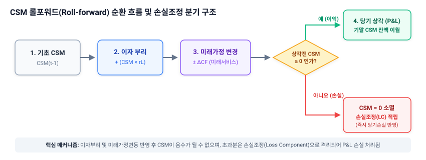
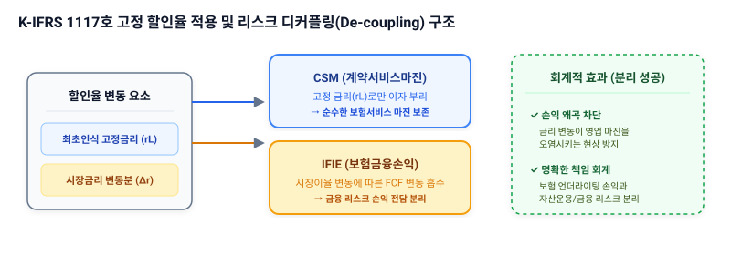

# 2.1 후속 측정과 CSM 롤포워드(Roll-forward)의 이해

> **회계기준 안내**: 본 절의 설명은 **K-IFRS 제1117호(보험계약)** 기준을 바탕으로 작성되었습니다. 기존 일반기업회계기준(K-GAAP)과 달리, 보험부채를 시가 평가하고 미실현이익을 부채 계정에 이연한 뒤 서비스 기간에 걸쳐 체계적으로 상각하는 후속 측정 메커니즘을 다룹니다.

---

## 1. 도입

보험회사의 재무제표를 들여다볼 때 가장 극적인 변화를 몰고 온 장치를 하나 꼽으라면 단연 **계약서비스마진(CSM, Contractual Service Margin)**입니다. K-IFRS 제1117호 도입 이전에는 보험 판매 시점에 발생한 초년도 사업비와 미래 예상 이익이 즉시 당기손익으로 인식되곤 했습니다. 그러나 K-IFRS 제1117호 체제 아래에서는 보험계약으로부터 얻을 미실현 이익을 CSM이라는 부채 계정으로 묶어둔 뒤, 서비스가 제공되는 기간에 걸쳐 체계적으로 상각하여 인식합니다.

이 장의 학습 목표는 최초 인식 시점에 결정된 CSM이 매 결산기말(후속 측정 시점)에 어떤 물리적 메커니즘을 거쳐 변동하는지, 즉 **CSM 롤포워드(Roll-forward)**의 순환 과정을 명확하게 이해하는 것입니다. 특히 CSM의 가치를 보존하기 위해 적용하는 **이자 부리(Accretion of Interest)**의 금융적 의미와, 미래 서비스 변동이 CSM에 미치는 영향, 그리고 대손실을 방지하는 임계값인 **손실조정(Loss Component)**으로의 전환 메커니즘을 구체적인 수치 시나리오를 통해 파악해 봅니다.



---

## 2. 본론

### 2.1 선수수익에서 CSM으로: 인지적 연결고리
우리는 일상에서 '헬스장 1년 회원권'을 120만 원에 판매한 기업의 회계처리를 잘 알고 있습니다. 돈을 미리 받았다고 해서 첫 달에 120만 원을 모두 수익으로 잡으면 안 됩니다. 120만 원은 일단 '선수수익(부채)'으로 쌓아두고, 매달 10만 원씩 서비스를 제공함에 따라 부채를 줄이고 수익을 인식합니다.

IFRS 17의 CSM도 본질은 이와 같습니다. 다만 보험계약은 헬스장 회원권과 달리 **최소 수년에서 수십 년에 걸친 장기 계약**이라는 점, 그리고 미래에 발생할 사고 발생액과 사업비가 **확률적으로 변동**한다는 점이 다릅니다. 이 때문에 CSM은 단순 선형 상각이 아니라, 매 결산 시점마다 이자를 붙이고(이자 부리), 미래 예측치 변화를 반영(미래 서비스 관련 변동)한 후, 당기 분량만큼 쪼개어 인식(상각)하는 복잡한 물리적 순환(Roll-forward) 과정을 거치게 됩니다.

---

### 2.2 수치 패턴으로 먼저 보는 CSM 롤포워드
공식을 보기 전에, 구체적인 1차년도 결산 시나리오를 통해 돈의 흐름을 먼저 추적해 보겠습니다.

#### [시나리오 조건]
* **기초(최초 인식) CSM**: $1,000$원
* **할인율 (최초 인식 시점 고정 금리)**: 연 $5\%$
* **미래 서비스 가정 변경**: 미래에 지급할 보험금 예상액이 이전 전망보다 $150$원 감소할 것으로 예측됨 (회사의 마진이 $150$원만큼 늘어나는 긍정적 신호)
* **당기 상각률**: 조정 후 CSM 잔액의 $10\%$

이 네 가지 조건이 주어졌을 때, 기말 CSM이 확정되는 단계별 수치 변화는 다음과 같습니다.

| 단계 | 구분 | 계산 과정 | 결과값 (원) | 누적 잔액 (원) | 의미 |
| :--- | :--- | :--- | :--- | :--- | :--- |
| **0단계** | **기초 잔액** | - | - | **1,000** | 최초 계약 인식 시점의 미실현 이익 |
| **1단계** | **이자 부리** | $1,000 \times 5\%$ | $+50$ | **1,050** | 시간 경과에 따른 화폐시간가치 보전 |
| **2단계** | **미래 서비스 변동 반영** | 가정 변경에 따른 미래 현금유출 감소 | $+150$ | **1,200** | 미래 서비스 제공과 관련된 이익 증가분 흡수 |
| **3단계** | **상각 전 잔액** | $1,050 + 150$ | - | **1,200** | 당기 상각의 기준이 되는 중간 총액 |
| **4단계** | **당기 상각** | $1,200 \times 10\%$ | $-120$ | **1,080** | 당기 서비스 제공 대가로 **당기손익(보험서비스매출) 인식** |
| **5단계** | **기말 잔액** | $1,200 - 120$ | - | **1,080** | 차기로 이월되는 기말 부채 잔액 |

<iframe src="contents/ifrs17_csm_risk_modeling/sec_02/assets/diagrams/sub_02_01_visual1.html" width="100%" height="520px" frameborder="0" scrolling="no"></iframe>

위 시뮬레이터와 표에서 직관적으로 이해할 수 있는 핵심 규칙은 다음과 같습니다.
1. **이자는 먼저 붙는다**: 미래 가정 변경이나 상각을 하기 전에, 기초 잔액에 약정된 이율을 곱해 기초 체력을 키워줍니다.
2. **가정 변경은 상각 전에 녹아든다**: 미래 예측이 좋아지거나($+150$) 나빠지면, 상각하기 직전 잔액에 먼저 가감하여 당기 상각 금액($120$원) 자체를 동반 조율합니다.

---

### 2.3 CSM 롤포워드 공식의 도출

이제 위 수치적 흐름을 일반화된 수학적 공식 시스템으로 정리해 보겠습니다. 기말 시점 $t$의 CSM 잔액($CSM_t$)은 다음과 같은 재귀식(Recurrence Relation)으로 전개됩니다.

$$CSM_t = CSM_{t-1} \times (1 + r_{L}) + \Delta CF_{\text{future}, t} - Amort_t$$

여기서 각 변수의 물리적 의미와 부호 체계는 다음과 같이 완결성을 가집니다.

* $CSM_{t-1}$: 전기말(혹은 기초) CSM 잔액 ($CSM_{t-1} \ge 0$)
* $r_{L}$: **고정 할인율(Locked-in Discount Rate)**. 최초 인식 시점의 이자율을 고정하여 적용합니다.
* $\Delta CF_{\text{future}, t}$: 미래 서비스와 관련된 이행현금흐름(FCF) 추정치의 변동액 중 CSM 조정분. 
  * *주의*: 미래에 유출될 보험금이나 사업비가 **감소**하면 마진이 늘어나므로 $\Delta CF_{\text{future}, t} > 0$ (플러스 값)이 되어 CSM을 늘립니다.
  * 반대로 미래 유출이 **증가**하면 마진이 잠식되므로 $\Delta CF_{\text{future}, t} < 0$ (마이너스 값)이 되어 CSM을 차감합니다.
* $Amort_t$: 당기 보험서비스 제공에 따라 당기손익(P&L)으로 방출되는 상각액 ($Amort_t \ge 0$)

$$Amort_t = \left( CSM_{t-1} \times (1 + r_{L}) + \Delta CF_{\text{future}, t} \right) \times \alpha_t$$

(이때 $\alpha_t$는 당기 서비스 제공 비율인 상각률이며, $0 \le \alpha_t \le 1$ 범위를 가집니다.)

---

### 2.4 이자 부리(Interest Accretion)와 할인율의 필연성: 고정금리 vs 변동금리

왜 CSM에는 매기 이자를 붙여야(Accretion) 할까요? 그리고 왜 하필 최초 인식 시점의 할인율($r_L$, Locked-in Rate)을 고수해야 할까요? 이 의문에 답하기 위해 **잘못 설계된 실패 사례**와 **K-IFRS 제1117호의 정밀한 복제 성공 사례**를 대조해 보겠습니다.



#### 실패 사례: 기말 평가 시 매번 현재 시장금리(Current Rate)를 적용해 이자를 부리하는 경우
매 결산기마다 시장 이자율이 폭등하거나 폭락할 때, 그 변동분을 CSM 이자 부리에 그대로 반영한다고 가정해 봅시다. 

* **배경**: 기초 CSM $1,000$원, 최초 할인율 $5\%$. 기말 시장 이자율이 $2\%$로 폭락함.
* **처리**: 변동된 현재 금리 $2\%$를 사용하여 CSM 이자를 부리함 ($1,000 \times 2\% = 20$원).
* **문제점**: CSM은 보험사가 고객에게 제공할 '비금융 서비스'의 미실현 이익입니다. 금융 시장의 금리가 등락한다고 해서 보험사가 미래에 제공해야 할 비금융 서비스의 마진 원천 자체가 출렁이는 것은 불합리합니다. 현재 금리를 적용하면 금융 리스크(금리 변동)가 비금융 마진 계정인 CSM 내부로 침투하여 혼재하게 되며, 보험 서비스 손익이 왜곡되는 비극이 발생합니다.

#### 성공 사례: 최초 인식 시점의 고정 할인율(Locked-in Rate)을 일관되게 적용하는 경우
K-IFRS 제1117호 일반모형(BBA)에서는 CSM 이자 부리 시 최초 인식 시점의 할인율을 고정하여 적용하도록 규정합니다.

* **처리**: 시장 금리가 $2\%$로 폭락하더라도, CSM의 이자 부리는 최초 약정된 $5\%$를 고수하여 $50$원을 가산합니다.
* **효과**: 금융 리스크로 인한 이행현금흐름의 평가 변동분(현행 금리 $2\%$ 적용에 따른 부채 평가액 변동)은 CSM이 아닌 **'보험금융손익(IFIE)'**이라는 금융 손익 계정에서 전액 흡수 처리됩니다. 이로 인해 CSM 내부에는 오직 '서비스 마진'의 순수한 역사적 가치 흐름만 남게 되며, 금융 변동성과 서비스 성능 변동성이 엄격하게 분리(De-coupling)됩니다.

---

### 2.5 극단적 시나리오 대조: CSM 소멸과 손실조정(Loss Component)의 탄생

만약 미래 전망이 극도로 악화되어, 미래 서비스 가정이 나빠지는 금액이 현재 가지고 있는 CSM 잔액보다 크다면 어떻게 될까요? CSM은 음수($-$)의 값을 가질 수 있을까요? 

수학적으로 단순히 마이너스를 허용하면 편하겠지만, 회계학적으로 **"미래 이익이 음수"라는 것은 "현재 시점에서 이미 이 계약이 적자(손실) 계약"**임을 의미합니다. 따라서 CSM은 $0$ 미만으로 떨어질 수 없으며, $0$을 뚫고 내려가는 순간 초과 손실액은 당기 비용으로 즉시 토해내야 합니다. 이 한계 장치를 **손실조정(Loss Component)**이라고 합니다.

이전 절에서 사용한 동일한 수치($CSM_{t-1} = 1,000$, $r_L = 5\%$, 이자 부리 후 잔액 $1,050$원)를 소환하여 두 가지 상반된 경로를 대조해 보겠습니다.

#### 경로 A: 정상 범위 내의 가정 악화 (CSM 방어 성공)
* **상황**: 미래 현금 유출 전망이 $400$원만큼 증가함 (마진 $400$원 감소).
* **계산**:
  $$\text{상각 전 CSM} = 1,050 - 400 = 650 \text{원}$$
  $$Amort_t = 650 \times 10\% = 65 \text{원}$$
  $$CSM_t = 650 - 65 = 585 \text{원}$$
* **결과**: 마진이 깎였지만 여전히 양수($585$원)이므로 당기 손실 없이 기말 잔액을 정상 인식합니다.

#### 경로 B: 한계 임계값을 초과하는 극단적 악화 (손실조정 발생)
* **상황**: 미래 현금 유출 전망이 $1,500$원만큼 폭증함 (마진 $1,500$원 감소).
* **임계 한계값(Break-even Threshold) 조건**:
  $$\text{최대 감내 가능 충격폭} = CSM_{t-1} \times (1 + r_L) = 1,050 \text{원}$$
* **대수적 처리 및 차이 소거**:
  * 충격폭($1,500$원)이 임계값($1,050$원)을 초과했습니다. 초과 분량은 다음과 같습니다.
    $$\text{초과 손실} = 1,500 - 1,050 = 450 \text{원}$$
  * 이 시점에서 CSM은 물리적 하한선인 $0$으로 즉시 소거됩니다.
    $$CSM_t = 0$$
  * 흡수되지 못하고 남은 $450$원은 즉시 당기손익의 **보험서비스비용(손실계약 평가손실)**으로 반영되고, 해당 부채 계정 내에 **'손실조정(Loss Component) 450원'**이라는 꼬표 부채가 쌓이게 됩니다.

| 구분 | 경로 A (정상 완충) | 경로 B (임계 돌파) |
| :--- | :--- | :--- |
| **가정 변경 충격** | $-400$원 | $-1,500$원 |
| **CSM 상각 전 잔액** | $+650$원 | $0$원 (바닥 도달) |
| **당기 상각액 (P&L 수익)** | $+65$원 | $0$원 |
| **즉시 인식 당기손실 (P&L 비용)** | $0$원 | **$-450$원** |
| **기말 잔액** | CSM: $585$원 / 손실조정: $0$원 | CSM: $0$원 / 손실조정: $450$원 |

---

## 3. 실무 시뮬레이션 구현 (Python)

위의 CSM 롤포워드 논리를 여러 회계 기기에 걸쳐 누적 추적할 수 있도록 파이썬 코드로 구현해 보겠습니다. 동일한 수치 파라미터를 그대로 클래스 인스턴스에 대입하여 일관성을 검증합니다.

```python
class CSMRollForward:
    def __init__(self, initial_csm, locked_in_rate, amort_rate):
        self.csm = initial_csm
        self.locked_in_rate = locked_in_rate
        self.amort_rate = amort_rate
        self.loss_component = 0

    def step_period(self, change_in_future_cf):
        """
        1개 기간(예: 1년) 동안의 CSM 롤포워드를 수행합니다.
        change_in_future_cf: 미래 이행현금흐름 변동액. 
                             양수(+)는 미래 유출 감소(호재, CSM 증가 요인), 
                             음수(-)는 미래 유출 증가(악재, CSM 감소 요인)를 의미.
        """
        # Step 1: 이자 부리 (Accretion)
        accrued_interest = 0
        if self.csm > 0:
            accrued_interest = self.csm * self.locked_in_rate
            self.csm += accrued_interest
        
        # Step 2: 미래 서비스 관련 변동 반영 (Change in Estimates)
        temp_csm = self.csm + change_in_future_cf
        
        # 임계값 분석 및 손실조정 판단
        if temp_csm >= 0:
            # 여전히 계약이 이익 구간에 있는 경우
            self.csm = temp_csm
            immediate_loss = 0
        else:
            # 적자 전환 (CSM 바닥 도달, 손실조정 발생)
            immediate_loss = abs(temp_csm)
            self.csm = 0
            self.loss_component += immediate_loss
            
        # Step 3: 당기 상각 (Amortization)
        amortization = 0
        if self.csm > 0:
            amortization = self.csm * self.amort_rate
            self.csm -= amortization
            
        return {
            "기초잔액": temp_csm - change_in_future_cf - accrued_interest + amortization if amortization else 0,
            "이자부리": accrued_interest,
            "가정변경": change_in_future_cf,
            "상각전잔액": temp_csm if temp_csm >= 0 else 0,
            "당기상각액": amortization,
            "당기인식손실": immediate_loss,
            "기말CSM": self.csm,
            "기말손실조정": self.loss_component
        }

# --- 실행 테스트 ---
# 1. 정상 경로 테스트 (경로 A)
model_a = CSMRollForward(initial_csm=1000, locked_in_rate=0.05, amort_rate=0.10)
result_a = model_a.step_period(change_in_future_cf=-400) # 유출 400원 증가 (악재)
print("[경로 A 결과]")
for k, v in result_a.items():
    print(f" - {k}: {v:.1f}원")

print("\n" + "="*40 + "\n")

# 2. 극단적 손실 적자 경로 테스트 (경로 B)
model_b = CSMRollForward(initial_csm=1000, locked_in_rate=0.05, amort_rate=0.10)
result_b = model_b.step_period(change_in_future_cf=-1500) # 유출 1,500원 폭증 (대형 악재)
print("[경로 B 결과]")
for k, v in result_b.items():
    print(f" - {k}: {v:.1f}원")
```

---

## 4. 요약

1. **CSM 후속 측정 순환**: CSM은 매 결산 시점마다 `[기초 잔액] → [이자 부리] → [미래 서비스 가정 변경 반영] → [당기 상각] → [기말 잔액]`의 정형화된 물리적 단계를 거쳐 롤포워드됩니다.
2. **이자 부리와 고정 할인율**: CSM은 비금융 서비스 마진을 나타내므로, 시장 금리 변동성의 침투를 막기 위해 최초 인식 시점의 **고정 할인율(Locked-in Rate)**로만 이자를 붙입니다.
3. **손실 임계값(Break-even Threshold)**: CSM의 최저 한계선은 $0$입니다. 미래 서비스 관련 변동 손실액이 `기초 CSM + 이자 부리` 합산액을 초과하는 순간, CSM은 $0$으로 소멸하고 초과분은 **손실조정(Loss Component)**으로 적립되며 즉시 당기손익 비용으로 처리됩니다.