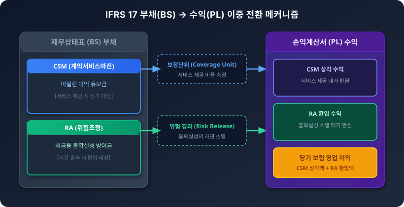

# 3.2 리스크 해소에 따른 수익 인식: CSM 상각(Amortization)과 RA 환입(Release)

## 1. 도입: 부채의 이익 변환 메커니즘과 학습 목표

앞선 3.1절에서 우리는 보험계약의 미래 현금흐름에 내재된 비금융 리스크의 불확실성을 방어하기 위해 **위험조정(RA, Risk Adjustment)**을 어떻게 산출하고 적립하는지 살펴보았습니다. 신뢰수준법(VaR)과 자본비용법(CoC)을 통해 산출된 RA는 보험계약 마진(CSM)과 함께 K-IFRS(한국채택국제회계기준) 제1117호(IFRS 17) 체제 하에서 보험사의 부채 항목으로 재무상태표(BS)에 기록됩니다.

그렇다면 이렇게 쌓아둔 거대한 부채 항목들은 영원히 재무상태표에 묶여 있는 것일까요? 만약 부채가 소멸하지 않는다면 보험사는 결코 정당한 영업 이익을 창출할 수 없을 것입니다. IFRS 17 회계 체계의 가장 매력적이고 핵심적인 메커니즘은, **시간이 흐르고 보험 서비스가 성실히 제공됨에 따라 부채로 유보되어 있던 안전마진과 미실현 이익이 단계적으로 소거되어 손익계산서(PL) 상의 당기 손익(Insurance Revenue & Profit)으로 탈바꿈**한다는 사실입니다.

이 자금 전환을 이끄는 두 개의 거대한 이익 엔진이 바로 **CSM 상각(Amortization)**과 **RA 환입(Release)**입니다. 

이번 절에서는 보험사가 제공하는 보장 서비스와 시간에 따른 불확실성의 해소가 어떻게 손익계산서의 이익으로 구현되는지 그 논리적 구조를 파악합니다. 특히 3.1절에서 다루었던 동일한 포트폴리오 수치 시나리오를 재소환하여, 초기 RA의 설정 크기가 향후 수익 구조와 이익 평탄화(Smoothing)에 미치는 트레이드오프(Trade-off) 관계를 대조 분석하고, 현업 의사결정에 즉시 활용할 수 있는 손익분기점 임계 한계값($S_{\text{BEP}}$)을 유도합니다.

---

## 2. 본론: CSM 상각과 RA 환입의 작동 원리

### 2.1 이익 인식의 두 가지 엔진: CSM과 RA의 역할 분담

보험계약이 최초로 체결될 때 발생하는 미실현 이익은 **CSM(Contractual Service Margin, 계약서비스마진)**이라는 이름의 부채로 설정됩니다. CSM은 이익의 온상이지만, 계약 체결 즉시 전액을 당기 이익으로 인식할 수 없습니다. 보험사가 계약 기간 동안 가입자에게 '보험 서비스'를 아직 다 제공하지 않았기 때문입니다. 따라서 CSM은 일단 부채로 잡힌 뒤, 보험 서비스를 제공할 때마다 조금씩 깎여 나가며(상각) 보험수익으로 전환됩니다.

반면, 계약 초기 미래의 예측 불가능한 폭풍우를 방어하기 위해 쌓아두었던 **위험조정(RA)**은 시간이 흘러 실제로 대형 사고가 발생하지 않고 무사히 지나간 기간(위험의 경과)만큼 그 불확실성이 소멸합니다. 이처럼 불확실성이 제거되어 더 이상 부채로 잡고 있을 필요가 없어진 RA는 장부에서 소거되며, 이를 **RA 환입(Release of RA)**이라고 부릅니다.



이 두 가지 엔진이 창출하는 기간별 총 손익은 다음의 대수적 방정식으로 표현됩니다.

$$\text{Total Profit}_t = \text{CSM Amortization}_t + \text{RA Release}_t$$

- $\text{CSM Amortization}_t$: 기간 $t$ 동안 제공된 보장단위(Coverage Unit) 비율에 따라 수익으로 인식되는 CSM 상각액
- $\text{RA Release}_t$: 기간 $t$ 동안 비금융 리스크의 소멸 및 불확실성 해소로 인해 환입되는 RA 금액

---

### 2.2 CSM 상각(Amortization)의 메커니즘과 보장단위

CSM 상각은 임의로 조정할 수 없으며, 회계기준에 따라 반드시 **보장단위(Coverage Unit)**라는 객관적인 서비스 제공 지표를 기준으로 배분됩니다. 보장단위는 '당기 제공된 보장량(계약 수 $\times$ 보장 금액)'을 '현재 및 미래에 제공될 총 보장량'으로 나누어 산출합니다.

특정 회계기간 $t$에 인식되는 CSM 상각액은 다음과 같습니다.

$$\text{CSM Amortization}_t = \text{CSM}_{t-1} \times \frac{\text{당기 제공된 보장단위}_t}{\text{당기 제공된 보장단위}_t + \sum \text{미래 잔여 보장단위}}$$

#### 구체적 수치 시나리오: 3개년 CSM 상각 경로
미래 현금흐름의 기대가치가 안정적인 보험 포트폴리오의 최초 CSM 잔액이 **300만 원**이고, 총 보장 기간이 3년인 계약을 가정해 봅시다. 매년 가입자 유지율과 보장 노출량 감소에 따른 보장단위 배분율이 각각 1년차 50%, 2년차 30%, 3년차 20%로 측정되었을 때, CSM이 상각되는 과정은 표와 같습니다.

| 경과 기간 ($t$) | 기시 CSM 잔액 | 당기 보장단위 비율 | 계산식 | 당기 CSM 상각액 (수익 인식) | 기말 CSM 잔액 |
| :--- | :--- | :--- | :--- | :--- | :--- |
| **1년차** | 300.0만 원 | 50% | $300.0 \times \frac{50\%}{50\% + 30\% + 20\%}$ | **150.0만 원** | 150.0만 원 |
| **2년차** | 150.0만 원 | 30% | $150.0 \times \frac{30\%}{30\% + 20\%}$ | **90.0만 원** | 60.0만 원 |
| **3년차** | 60.0만 원 | 20% | $60.0 \times \frac{20\%}{20\%}$ | **60.0만 원** | **0원 (만기 소멸)** |

이처럼 CSM 상각은 보험사가 가입자에게 약정한 보장 서비스를 제공했다는 물리적 사실을 장부상 이익으로 변환하는 **'서비스 대가형 이익 엔진'**으로 기능합니다.

---

### 2.3 위험조정(RA) 환입(Release)의 메커니즘

CSM 상각이 서비스 제공의 대가라면, RA 환입은 **'시간 경과에 따른 불확실성의 자연 소멸'**에 대한 보상입니다. 

3.1절에서 확인했듯이 계약 체결 시점에는 잔존 만기가 길고 미래 손실 분포의 꼬리가 두꺼워 RA가 크게 산정됩니다. 그러나 1년, 2년 시간이 흐를수록 미래의 불확실한 구간이 과거의 확정된 데이터로 전환되거나 사라지므로, 보험사가 유보해야 할 안전마진의 필요량이 물리적으로 감소합니다.

#### ① RA 환입의 수식적 정의
기초 시점 $t$에서 기말 시점 $t+1$로 넘어갈 때 발생하는 RA 환입액은 다음과 같이 정의됩니다.

$$\text{RA Release}_t = \text{RA}_t - \text{RA}_{t+1}^*$$

- $\text{RA}_t$: 기초 시점의 위험조정 평가 잔액
- $\text{RA}_{t+1}^*$: 기말 시점에 경과된 리스크를 제외하고 잔존 만기만을 대상으로 재산출된 위험조정 평가 잔액

#### ② 동일 수치 시나리오를 통한 RA 환입 산출
3.1절의 수치 시나리오(자산 1,000억 원, 연간 변동성 10%)를 그대로 재소환해 봅니다. 3.1절에서 99.5% 신뢰수준법으로 산출된 초기 위험조정액은 다음과 같았습니다.

$$\text{RA}_{\text{VaR}} = 257.5\text{억 원}$$

만약 이 포트폴리오의 잔존 보장 기간이 5년이며, 위험의 소멸 속도가 잔존 기간 동안 매년 균등하게 전개된다고 가정해 봅시다. 1년차에 소멸하는 RA 환입액은 다음과 같이 계산됩니다.

$$\text{RA Release}_1 = 257.5\text{억 원} \times \frac{1}{5} = 51.5\text{억 원}$$

이 51.5억 원은 불확실성이라는 물리적 마찰력이 시간의 경과에 의해 소거됨에 따라 부채에서 제거되어 당기 손익으로 유입됩니다.

---

### 2.4 CSM 상각 및 RA 환입 시뮬레이션 (인터랙티브 시각화)

아래의 동적 시뮬레이터를 통해 잔여 보장 기간 동안 CSM 부채 잔액과 RA 누적액이 어떻게 감소하고, 두 요소의 합이 매년 당기 손익으로 어떻게 유입되는지 직접 파라미터를 조절하며 확인해 보세요.

<iframe src="contents/ifrs17_csm_risk_modeling/sec_03/assets/diagrams/sub_03_02_visual1.html" width="100%" height="520px" frameborder="0" scrolling="yes"></iframe>

---

### 2.5 초기 RA 설정 크기에 따른 트레이드오프(Trade-off) 대조 분석

보험 경영 전략 및 회계적 의사결정에서 가장 중요한 대목은 **초기 RA 설정 크기가 미래 이익 구조에 미치는 트레이드오프(Trade-off)** 관계입니다. 최초 계약 인식 시점에 RA를 보수적으로(높게) 쌓느냐, 완화적으로(낮게) 쌓느냐에 따라 당기순이익의 유입 경로와 손익 변동성이 완전히 달라집니다.

초기 계약 시점의 미실현 총이익이 일정할 때, 부채 내에서 RA와 CSM의 관계는 대수적으로 상호 음(-)의 관계를 형성합니다.

$$\text{Unearned Profit} = \text{CSM}_0 + \text{RA}_0 \implies \text{CSM}_0 = \text{Unearned Profit} - \text{RA}_0$$

동일한 총가치를 가진 포트폴리오에 대해 두 가지 극단적인 적립 전략을 대조해 봅니다.

| 구분 | 전략 A: 완화적 RA 적립 (저(低) RA 전략) | 전략 B: 보수적 RA 적립 (고(高) RA 전략) |
| :--- | :--- | :--- |
| **초기 RA 설정액** | **100억 원** (상대적 저평가) | **200억 원** (상대적 고평가) |
| **초기 CSM 잔액** | **250억 원** (초기 CSM 극대화) | **150억 원** (초기 CSM 압박) |
| **1년차 CSM 상각액 (30% 가정)**| **75억 원** ($250 \times 30\%$) | **45억 원** ($150 \times 30\%$) |
| **1년차 RA 환입액 (20% 가정)** | **20억 원** ($100 \times 20\%$) | **40억 원** ($200 \times 20\%$) |
| **1년차 총 당기 이익** | **95억 원** | **85억 원** |
| **주요 손익 특성** | 초기 이익 인식 속도가 빠르나, 손해율 악화 시 방어막 부족 | 초기 이익은 낮으나, 대규모 RA 환입을 통한 **장기 손익 평탄화(Smoothing)** 탁월 |

- **완화적 전략(전략 A):** 당장 장부에 기록되는 CSM이 커 보이므로 초기 영업 성과를 부풀리는 데 유리하지만, 미래의 리스크 변동성이 폭증했을 때 손실을 흡수할 안전마진(RA)이 부족하여 당기 손익이 급락할 위험에 노출됩니다.
- **보수적 전략(전략 B):** 초기 CSM은 쪼그라들지만, 매년 비워지는 대규모 RA 환입액이 안정적인 손익 쿠션 역할을 수행하여 금융 시장의 변동 속에서도 안정적인 실적을 유지하게 합니다.

---

### 2.6 실무 의사결정을 위한 임계 한계값 ($S_{\text{BEP}}$)과 손익분기 분석

최고재무책임자(CFO) 및 리스크 관리 책임자(CRO)는 CSM 상각과 RA 환입이라는 두 이익 엔진의 균형점을 모니터링해야 합니다. 

회사의 목표 당기순이익을 유지하고 자본비용을 충족하기 위한 **손익분기점 임계 한계값($S_{\text{BEP}}$)** 공식은 두 엔진의 상대적 비율로 다음과 같이 유도됩니다.

$$S_{\text{BEP}} = \frac{\text{RA Release}_t}{\text{CSM Amortization}_t} = \frac{\text{RA}_t - \text{RA}_{t+1}^*}{\text{CSM}_{t-1} \times \left( \frac{\text{Coverage Unit}_t}{\text{Total Coverage Unit}} \right)}$$

```
[임계 한계값(S_BEP) 판정 기준]

S_BEP > 1.0  --->  [위험 해소 의존형 이익 구조]
                   : 손익이 불확실성 해소(RA 환입)에 과도하게 의존함.
                   : 리스크 관리 성공 시 이익 급증하나, 사고율 상승 시 실적 급락.

S_BEP < 1.0  --->  [서비스 제공 기반형 이익 구조]
                   : 손익의 중심이 안정적인 보장 서비스 제공(CSM 상각)에 있음.
                   : 전통적인 우량 보험사의 전형적인 방어적 이익 체계.
```

만약 특정 사업연도에 시장 환경의 급변으로 인해 $S_{\text{BEP}}$ 비율이 **1.5 이상으로 치솟는 이상 현상**이 감지된다면, 이는 본업인 보험 서비스 제공을 통한 이익(CSM)보다 일시적인 리스크 소멸(RA)에 손익이 과도하게 쏠려 있음을 의미합니다. 

이 경우 실무진은 즉시 사업비율 재조정, 고위험 계약 인수 제한, 재보험 출재 확대 등 포트폴리오 구조 개선 조치를 단행해야 하는 **명확한 실무적 의사결정 기준점**을 얻게 됩니다.

---

## 3. 요약

1. **이익 인식의 두 축:** K-IFRS 제1117호 체제에서 보험부채의 이익 변환은 보장단위 제공 비율에 따른 **CSM 상각**과 시간 경과 및 불확실성 소멸에 따른 **RA 환입**을 통해 이루어집니다.
2. **이익 엔진의 물리적 본질:** CSM 상각은 계약자에 대한 서비스 제공 대가이며, RA 환입은 불확실성 마찰력을 시간의 경과로 소거하는 대가로 작동합니다.
3. **초기 설정의 트레이드오프:** 초기 RA를 높게 설정하면 초기 CSM은 줄어들지만, 향후 대규모 RA 환입을 통해 손익의 평탄화(Smoothing) 및 리스크 방어력이 극대화됩니다.
4. **실무적 활용:** 두 이익 엔진의 상대적 비중을 나타내는 임계 한계값($S_{\text{BEP}}$)을 모니터링함으로써, 보험사는 실적 변동 위험을 통제하고 선제적인 자본 및 상품 포트폴리오 재조정 의사결정을 내릴 수 있습니다.