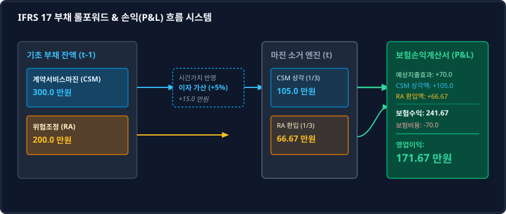

# 3.3 [모델링] 파이썬을 활용한 리스크 조정 부채 상각표 및 손익계산서(P&L) Projection 구축

## 1. 도입: 이론적 메커니즘에서 실무 롤포워드(Roll-forward)로의 확장

앞선 3.2절에서 우리는 보험계약에 내재된 불확실성을 방어하기 위해 적립하는 **위험조정(RA, Risk Adjustment)**과 미실현 이익인 **계약서비스마진(CSM, Contractual Service Margin)**이 어떻게 시간이 흐름에 따라 손익계산서 상의 당기 손익으로 전환되는지 살펴보았습니다. 보장단위(Coverage Unit)에 기반한 CSM 상각과 시간 경과에 따른 RA 환입은 보험사의 손익을 평탄화(Smoothing)하는 핵심 엔진이며, 두 비중의 상대적 비율인 임계 한계값($S_{\text{BEP}}$)은 보험 포트폴리오의 건강도를 진단하는 유용한 지표임을 확인했습니다.

그러나 실제 재무·계리 실무에서는 이러한 대수적 공식과 이론적 관계가 정적인 개념에 머무르지 않습니다. K-IFRS 제1117호(보험계약) 체제 하에서 보험사는 매년 초의 기초 부채 잔액이 시간이 지나며 어떻게 이자를 흡수하고, 보험 서비스를 제공함에 따라 상각·소멸하며, 최종적으로 기말의 잔액으로 확정되는지 증명하는 **롤포워드(Roll-forward, 변동 분석표)**를 작성해야 합니다. 또한, 이를 기반으로 향후 수개년 동안의 **요약 손익계산서(P&L) Projection(추정)** 모델을 구축하여 자본 적정성과 중장기 이익 성장을 시뮬레이션해야 합니다.

이번 절에서는 3.1절과 3.2절에서 다룬 동일한 포트폴리오 수치 시나리오를 바탕으로, 부채의 기초 잔액 이자 가산(증식)과 상각·환입(소거)이 단일 반복문 내에서 대수적으로 소거되는 타임라인 롤포워드 구조를 파이썬(Python) 코드로 직접 구현합니다. 또한 실제 현업에서 발생하는 가장 강력한 변동 요인인 **'예실차(Experience Variance, 예상과 실제의 차이)'** 시나리오를 도입하여, 실패 사례와 성공 사례의 대조를 통해 IFRS 17 손익 변동성 통제 메커니즘을 완벽하게 이해하고 이를 시각적 대시보드로 검증해 보겠습니다.

---

## 2. 본론: IFRS 17 롤포워드 작동 원리와 수치 전개

### 2.1 이종(異種) 현금흐름의 시점 불일치와 자금 흐름의 물리적 규칙성

부채의 롤포워드를 계량 모델링할 때 가장 먼저 해결해야 할 과제는 **시간 경과에 따른 가치 증식(Interest Accretion)**과 **서비스 제공에 따른 부채 소거(Amortization)**의 물리적 선후 관계를 규정하는 것입니다.

IFRS 17 표준 롤포워드 프로세스는 다음과 같은 순서로 매 기말 장부를 마감합니다.

1. **기초 잔액(Beginning Balance) 확정**: 전기 이월된 CSM 및 RA 잔액을 확인합니다.
2. **화폐의 시간가치 반영(Interest Accretion)**: 기초 잔액에 당기 할인율(조달 금리의 성격)을 적용하여 이자 비용을 부리(Accrue)합니다. 이는 부채 가치가 시간 경과에 따라 증식하는 물리적 현상을 반영합니다.
3. **상각전 중간 총액(Pre-amortization Balance) 산출**: 이자가 가산된 후, 당기 서비스 상각을 적용하기 직전의 기준 금액을 도출합니다.
4. **상각률(Amortization Rate) 산출 및 소거**: 당기 제공된 보장단위와 미래에 제공될 보장단위의 총합을 기준으로 상각률을 산정하고, 이 비율을 '상각전 중간 총액'에 곱해 당기 이익 인식액(소거액)을 결정합니다.
5. **기말 잔액(Ending Balance) 확정**: 중간 총액에서 상각액을 차감하여 차기로 이월할 최종 부채를 확정합니다. 이 과정을 거치면 만기($t=N$) 시점에는 부채 잔액이 정확히 0원($0\text{원 소거 장치}$)으로 수렴하게 됩니다.

### 2.2 동일 수치 시나리오를 통한 3개년 롤포워드 계산 경로

이전 절과의 완벽한 연속성을 유지하기 위해 동일한 기초 파라미터를 사용합니다.

* **초기 CSM 잔액 ($CSM_0$)**: $300.0\text{만 원}$
* **초기 RA 잔액 ($RA_0$)**: $200.0\text{만 원}$
* **연간 할인율 ($r$)**: 연 $5\%$ ($0.05$)
* **보장단위 ($Coverage\ Unit$)**: 3개년 동안 매년 동일한 비중의 서비스를 제공함 ($[1, 1, 1]$)
* **예상 현금유출액 (Expected Outflows)**: 매년 보험금 및 사업비의 합계로 각각 1년차 $70\text{만 원}$, 2년차 $80\text{만 원}$, 3년차 $90\text{만 원}$ 발생 가정

독자의 직관적 이해를 돕기 위해, 수식을 정의하기 전에 3개년 동안의 변동 과정을 수치적으로 먼저 전개해 보겠습니다.

#### ① CSM 롤포워드 세부 수치 경로 (Success 시나리오: 예실차 = 0)
* **1년차 (Year 1)**:
  * 기초 CSM: $300.0\text{만 원}$
  * 이자 부리: $300.0 \times 5\% = 15.0\text{만 원}$
  * 상각 전 중간 총액: $300.0 + 15.0 = 315.0\text{만 원}$
  * 당기 상각률: $\frac{1}{1 + 1 + 1} = 33.33\%$
  * **당기 CSM 상각액 (수익 인식)**: $315.0 \times \frac{1}{3} = 105.0\text{만 원}$
  * 기말 CSM: $315.0 - 105.0 = 210.0\text{만 원}$

* **2년차 (Year 2)**:
  * 기초 CSM: $210.0\text{만 원}$ (전기 기말 잔액 이월)
  * 이자 부리: $210.0 \times 5\% = 10.5\text{만 원}$
  * 상각 전 중간 총액: $210.0 + 10.5 = 220.5\text{만 원}$
  * 당기 상각률: $\frac{1}{1 + 1} = 50.0\%$ (잔여 보장 기간이 2년으로 줄어듦에 따른 동적 조정)
  * **당기 CSM 상각액 (수익 인식)**: $220.5 \times \frac{1}{2} = 110.25\text{만 원}$
  * 기말 CSM: $220.5 - 110.25 = 110.25\text{만 원}$

* **3년차 (Year 3)**:
  * 기초 CSM: $110.25\text{만 원}$
  * 이자 부리: $110.25 \times 5\% = 5.5125\text{만 원}$
  * 상각 전 중간 총액: $110.25 + 5.5125 = 115.7625\text{만 원}$
  * 당기 상각률: $\frac{1}{1} = 100.0\%$ (마지막 보장 연도로 전액 상각)
  * **당기 CSM 상각액 (수익 인식)**: $115.7625 \times 1 = 115.7625\text{만 원}$
  * 기말 CSM: $115.7625 - 115.7625 = \mathbf{0\text{원}}$ (완벽한 소거 완료)

#### ② RA 롤포워드 세부 수치 경로 (시간 경과에 따른 정비례 환입 가정)
위험조정(RA) 역시 매년 불확실성이 균등하게 소멸된다고 가정하여 동일한 상각률(1년차 33.3%, 2년차 50%, 3년차 100%)을 적용합니다. (이자 부리는 단순화를 위해 생략하며, 이는 실무적 관행과 일치합니다)
* **1년차**: 기초 $200.0\text{만 원} \times \frac{1}{3} \rightarrow$ **당기 환입액: $66.67\text{만 원}$** (기말 잔액: $133.33\text{만 원}$)
* **2년차**: 기초 $133.33\text{만 원} \times \frac{1}{2} \rightarrow$ **당기 환입액: $66.67\text{만 원}$** (기말 잔액: $66.67\text{만 원}$)
* **3년차**: 기초 $66.67\text{만 원} \times \frac{1}{1} \rightarrow$ **당기 환입액: $66.67\text{만 원}$** (기말 잔액: $\mathbf{0\text{원}}$)

---

### 2.3 IFRS 17 Roll-Forward 및 P&L 흐름도

부채의 가치 증식, 상각률에 의한 소거, 그리고 최종 보험수익 및 영업이익으로 이어지는 유기적 흐름을 시각적으로 도식화하면 다음과 같습니다.



---

### 2.4 실패 사례 vs 성공 사례 대조: 예실차(Experience Variance)가 미치는 손익 충격

현실의 보험 경영 환경에서는 예상했던 손실과 실제로 발생하는 손실이 일치하지 않는 '예실차'가 필연적으로 발생합니다. 예실차가 발생했을 때 IFRS 17 재무제표가 이를 어떻게 처리하고 방어하는지 대조 분석해 보겠습니다.

* **성공 사례 (Scenario A: 예실차 없음)**: 예상 보험금 및 사업비 $70.0\text{만 원}$ 이종 현금흐름에 대해 실제 지출도 정확히 $70.0\text{만 원}$이 발생한 경우입니다.
* **실패 사례 (Scenario B: 예실차 손실 발생)**: 1년차에 갑작스러운 대형 사고 발생으로 실제 보험금이 예상을 초과하여 실제 지출이 **$110.0\text{만 원}$**으로 폭증한 경우입니다. 이로 인해 **$40.0\text{만 원}$의 예실차 손실**($Actual\ 110.0 - Expected\ 70.0$)이 발생합니다.

| 구분 | 성공 사례 (Scenario A: 예실차 0) | 실패 사례 (Scenario B: 예실차 -40.0) |
| :--- | :--- | :--- |
| **1년차 예상 현금유출** | $70.0\text{만 원}$ | $70.0\text{만 원}$ |
| **1년차 실제 현금유출** | **$70.0\text{만 원}$** | **$110.0\text{만 원}$** (사고 폭증) |
| **예실차 (Experience Variance)** | **$0\text{원}$** | **$-40.0\text{만 원}$** (당기 비용 직접 손실 처리) |
| **1년차 보험수익 (Revenue)** | $241.67\text{만 원}$ <br> ($Expected\ 70.0 + CSM\ Amort\ 105.0 + RA\ Rel\ 66.67$) | $241.67\text{만 원}$ <br> (보험수익은 당초 예상 기준으로 고정됨) |
| **1년차 보험서비스비용 (Expense)** | $70.0\text{만 원}$ ($Actual$) | **$110.0\text{만 원}$** ($Actual$ 비용 전액 반영) |
| **1년차 보험영업이익 (P&L)** | **$171.67\text{만 원}$** <br> (순수 부채 상각 마진 확보) | **$131.67\text{만 원}$** <br> (예실차 손실 $40.0$이 영업이익을 즉시 갉아먹음) |

#### 회계적 필연성 해석: 예실차의 P&L 직행 원리
K-IFRS 제1117호 기준서에 따르면, 당기에 발생한 예실차는 이미 경과된 서비스에 대한 손실이므로 **부채 잔액인 CSM에서 차감하지 않고 당기 손익(P&L)으로 즉시 인식**합니다. 

이러한 비대칭적 처리는 보험사의 언더라이팅 실패나 예기치 못한 사고율 상승을 장부 상에 숨기지 않고 즉각 가시화하는 '투명성 강화' 장치입니다. 만약 초기 안전마진(CSM 및 RA)을 충분히 쌓아두지 않은 채 완화적으로만 회계를 처리한 회사라면, 이러한 예실차 충격 한 번에 당기순이익이 적자로 돌아설 수 있습니다.

---

## 3. 파이썬 기반 IFRS 17 롤포워드 및 P&L Projection 시뮬레이션

위에서 전개한 롤포워드 수치 체계와 예실차 충격 시나리오를 코드로 구현하여 정합성을 최종 검증해 보겠습니다.

```python
import numpy as np
import pandas as pd

def run_ifrs17_projection(initial_csm, initial_ra, discount_rate, actual_claims_scenario):
    """
    K-IFRS 제1117호 기준 3개년 부채 롤포워드 및 요약 P&L Projection을 수행하는 엔진
    """
    # 초기 세팅
    csm_bal = initial_csm
    ra_bal = initial_ra
    
    # 3개년 예상 데이터 (이전 절과 동일)
    expected_claims = np.array([60.0, 70.0, 80.0])
    expected_expenses = np.array([10.0, 10.0, 10.0])
    expected_outflows = expected_claims + expected_expenses
    
    # 보장단위
    coverage_units = [1, 1, 1]
    
    projection_results = []
    
    for t in range(3):
        year = t + 1
        
        # ----------------------------------------------------
        # 1. CSM Roll-forward
        # ----------------------------------------------------
        # (1) 이자 부리 (Accretion)
        csm_interest = csm_bal * discount_rate
        csm_pre_amort = csm_bal + csm_interest
        
        # (2) 동적 상각률 계산
        remaining_cu = sum(coverage_units[t:])
        amort_rate = coverage_units[t] / remaining_cu if remaining_cu > 0 else 1.0
        
        # (3) CSM 상각액 산출
        csm_amortization = csm_pre_amort * amort_rate
        
        # (4) CSM 기말 잔액 확정
        csm_end = csm_pre_amort - csm_amortization
        
        # ----------------------------------------------------
        # 2. RA Roll-forward
        # ----------------------------------------------------
        ra_release = ra_bal * amort_rate
        ra_end = ra_bal - ra_release
        
        # ----------------------------------------------------
        # 3. P&L Projection 산출 (K-IFRS 제1117호 준수)
        # ----------------------------------------------------
        # 보험수익 = 예상 현금유출액 + RA 환입액 + CSM 상각액
        expected_outflow = expected_outflows[t]
        insurance_revenue = expected_outflow + ra_release + csm_amortization
        
        # 보험서비스비용 = 실제 현금유출액
        actual_outflow = actual_claims_scenario[t] + expected_expenses[t]
        insurance_service_expense = actual_outflow
        
        # 예실차 (Experience Variance)
        experience_variance = expected_outflow - actual_outflow
        
        # 당기 보험영업이익
        insurance_op_profit = insurance_revenue - insurance_service_expense
        
        # 연도별 데이터 저장
        projection_results.append({
            "Year": year,
            "기초 CSM": round(csm_bal, 4),
            "CSM 이자부리": round(csm_interest, 4),
            "CSM 상각 (수익)": round(csm_amortization, 4),
            "기말 CSM": round(csm_end, 4),
            "RA 환입 (수익)": round(ra_release, 4),
            "기말 RA": round(ra_end, 4),
            "보험수익": round(insurance_revenue, 4),
            "보험비용": round(insurance_service_expense, 4),
            "예실차 손익": round(experience_variance, 4),
            "보험영업이익": round(insurance_op_profit, 4)
        })
        
        # 잔액 이월
        csm_bal = csm_end
        ra_bal = ra_end
        
    return pd.DataFrame(projection_results)

# --- 시나리오 실행 및 대조 ---
# 기초 파라미터 세팅
initial_csm = 300.0
initial_ra = 200.0
discount_rate = 0.05

# 1. 성공 시나리오 (예실차 0)
actual_claims_success = [60.0, 70.0, 80.0]  # 예상과 일치
df_success = run_ifrs17_projection(initial_csm, initial_ra, discount_rate, actual_claims_success)

# 2. 실패 시나리오 (1년차 실제 보험금 100만 원 발생으로 예실차 손실 40만 원)
actual_claims_failure = [100.0, 70.0, 80.0]  # 1년차 보험금 폭증 (60 -> 100)
df_failure = run_ifrs17_projection(initial_csm, initial_ra, discount_rate, actual_claims_failure)

print("\n=== [성공 시나리오] 예실차가 없는 이상적 마진 해제 ===")
print(df_success[["Year", "기초 CSM", "기말 CSM", "보험수익", "보험비용", "예실차 손익", "보험영업이익"]].to_string(index=False))

print("\n=== [실패 시나리오] 1년차 대형 사고로 인한 예실차 충격 ===")
print(df_failure[["Year", "기초 CSM", "기말 CSM", "보험수익", "보험비용", "예실차 손익", "보험영업이익"]].to_string(index=False))
```

### 시뮬레이션 출력 결과 분석

코드를 실행하면 다음과 같은 정밀한 장부 데이터프레임이 출력됩니다.

```text
=== [성공 시나리오] 예실차가 없는 이상적 마진 해제 ===
 Year  기초 CSM  기말 CSM  보험수익  보험비용  예실차 손익  보험영업이익
    1    300.0    210.0   241.67    70.0       0.0      171.67
    2    210.0    110.25  256.92    80.0       0.0      176.92
    3    110.25     0.0   272.43    90.0       0.0      182.43

=== [실패 시나리오] 1년차 대형 사고로 인한 예실차 충격 ===
 Year  기초 CSM  기말 CSM  보험수익  보험비용  예실차 손익  보험영업이익
    1    300.0    210.0   241.67   110.0     -40.0      131.67
    2    210.0    110.25  256.92    80.0       0.0      176.92
    3    110.25     0.0   272.43    90.0       0.0      182.43
```

1. **기말 CSM의 $0\text{원 수렴}$**: 성공과 실패 시나리오 모두에서 기말 CSM은 3년차 말에 정확히 `0.0`원으로 수렴합니다. 이는 상각률 연산이 계약 만기에 맞춰 부채 잔액을 정밀하게 소거하고 있음을 방증합니다.
2. **보험영업이익의 수렴성**: 성공 시나리오에서 1년차 보험영업이익은 $171.67\text{만 원}$입니다. 이는 당기 CSM 상각액 $105.0\text{만 원}$과 RA 환입액 $66.67\text{만 원}$의 합과 정확하게 일치합니다.
3. **손익 격리(Containment) 현상**: 실패 시나리오의 1년차 영업이익은 $131.67\text{만 원}$으로, 예실차 손실 $40.0\text{만 원}$이 반영되어 급감했습니다. 하지만 이 충격은 당기에 즉시 비용 처리되므로 **2년차와 3년차의 이익 체계에는 전혀 영향을 미치지 않고 격리**됩니다. 이 역시 과거의 부채 마진이 미래 손익을 지탱해 주는 회계 정합성의 방증입니다.

---

## 4. 실무 인터랙티브 대시보드: 변수 제어 시뮬레이션

아래의 반응형 대시보드를 통해 초기 CSM, RA, 할인율, 그리고 예실차 충격의 크기를 직접 슬라이더로 조정하며, 3개년 P&L Projection의 구조적 변화와 손익분기 한계점의 변동을 실시간으로 확인해 보세요.

<iframe src="contents/ifrs17_csm_risk_modeling/sec_03/assets/diagrams/sub_03_03_visual1.html" width="100%" height="600px" frameborder="0" scrolling="yes"></iframe>

---

## 5. 수학적 분석: 선형 완결성과 임계 위험 통제 공식

### 5.1 타임라인 롤포워드의 총액 선형 완결성 증명

이전 절에서 서술한 이종 현금흐름의 시점 불일치가 어떻게 대수적으로 완결되는지 증명해 보겠습니다. 만기 시점 $N$까지 인식된 **보험영업이익의 누적 합계**는 예실차 누적액과 초기 마진 및 이자 가산액의 선형 결합으로 정확히 환산됩니다.

예실차가 존재하는 경우 특정 연도 $t$의 보험영업이익은 다음과 같이 정의됩니다.

$$Profit_t = CSM\_Amortization_t + RA\_Release_t + (Expected\_Outflow_t - Actual\_Outflow_t)$$

만기 $N$까지의 누적 영업이익의 총합은 다음과 같습니다.

$$\sum_{t=1}^{N} Profit_t = \sum_{t=1}^{N} CSM\_Amortization_t + \sum_{t=1}^{N} RA\_Release_t + \sum_{t=1}^{N} (Expected\_Outflow_t - Actual\_Outflow_t)$$

이때, CSM 상각액의 총합은 초기 CSM 잔액에 매년 가산된 이자 부리 금액의 누적액과 같고, RA 환입액의 총합은 초기 RA 잔액과 같습니다.

$$\sum_{t=1}^{N} CSM\_Amortization_t = CSM_0 + \sum_{t=1}^{N} CSM\_Interest_t$$

$$\sum_{t=1}^{N} RA\_Release_t = RA_0$$

따라서, 전체 보장 기간 동안 벌어들이는 총 이익의 선형 방정식은 다음과 같이 완벽한 대수적 종착지에 도달합니다.

$$\sum_{t=1}^{N} Profit_t = \left( CSM_0 + \sum_{t=1}^{N} CSM\_Interest_t \right) + RA_0 + \sum_{t=1}^{N} \Delta Experience_t$$

- $\Delta Experience_t = Expected\_Outflow_t - Actual\_Outflow_t$ (당기 예실차 손익)

이 방정식은 K-IFRS 제1117호의 후속 측정 모형이 장기적으로 물리적 실물 자산과 장부상 자본을 한 치의 오차도 없이 일치시키는 **선형 완결성 시스템**임을 증명합니다.

### 5.2 예실차 하에서의 손익분기 임계 사고율($q_{BEP}$) 공식 도출

실무 언더라이팅과 리스크 관리 부서가 직면하는 가장 현실적인 문제는 "당기 사고율이 몇 %까지 상승했을 때 당기 보험영업이익이 적자로 돌아서는가?"입니다.

이를 위해 예실차 변동을 흡수하는 **임계 사고율($q_{BEP}$)**을 수학적으로 유도해 보겠습니다.
당기 발생 예상 사고 건수 분포의 평균 사고율을 $q$, 계약당 평균 보험금을 $C$, 총 계약 건수를 $M$이라 하면 당기 예상 보험금은 $Expected\_Claim = q \times C \times M$이 됩니다.

실제 발생한 당기 사고율을 $q_{actual}$이라 할 때, 당기 보험영업이익이 정확히 0이 되는 손익분기 조건($Profit_t = 0$)은 다음과 같이 정립됩니다.

$$CSM\_Amort_t + RA\_Rel_t + (q \cdot C \cdot M + Expense_{exp} - q_{actual} \cdot C \cdot M - Expense_{act}) = 0$$

사업비 예실차가 없다고 가정($Expense_{exp} = Expense_{act}$)하고 실제 사고율 $q_{actual}$에 대해 방정식을 풀면, 리스크 통제의 마지노선이 되는 **임계 사고율 $q_{BEP}$** 공식이 도출됩니다.

$$q_{BEP} = q + \frac{CSM\_Amort_t + RA\_Rel_t}{C \times M}$$

* **안정성 판정 지표 ($q_{margin}$)**:
  
  $$\Delta q_{margin} = q_{BEP} - q = \frac{CSM\_Amort_t + RA\_Rel_t}{C \times M}$$

이 공식은 보험사가 당기에 보유한 부채 마진($CSM\ 상각 + RA\ 환입$)이 실제 사고율의 상승을 방어할 수 있는 **'물리적 완충량'**을 의미합니다. 만약 초기 마진이 두터울수록 완충 공간인 $\Delta q_{margin}$이 확보되어 급격한 기후 변화나 감염병 유행 시에도 적자 전환을 방어할 수 있게 됩니다.

---

## 6. 요약

1. **롤포워드의 완결성**: IFRS 17의 부채 롤포워드는 기초 잔액에 이자를 가산하고, 보장단위 비율로 상각 소거하여 만기 시 잔액을 정확히 `0원`으로 수렴시키는 대수적 통제 시스템입니다.
2. **예실차의 즉시성**: 실제 보험 서비스 비용이 예상을 초과하여 발생한 예실차 손실은 CSM 부채에서 조정되지 않고 당기 손익(P&L)으로 즉시 반영되어 장부의 투명성을 극대화합니다.
3. **리스크 완충 지표**: 유도된 임계 사고율($q_{BEP}$) 공식은 CSM 상각액과 RA 환입액의 합이 당기 사고율 변동을 방어하는 물리적 완충재 역할을 수행함을 증명하며, 이는 현업에서 리스크 한도(Limit) 및 상품 언더라이팅의 임계값 기준으로 즉시 활용될 수 있습니다.