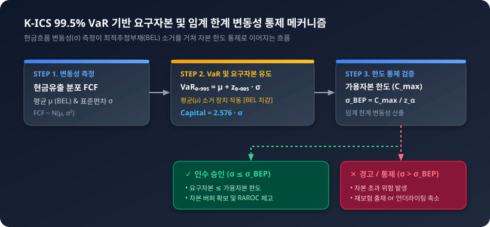

# 04 [실무 심화] 상품별 VaR 변동성과 자본비용법(CoC)을 활용한 위험조정 수익률(RAROC) 산출 실무

## 4.1 상품별 현금흐름 변동성과 VaR(신뢰수준법) 측정

---

### 도입

IFRS 17(K-IFRS 제1117호 '보험계약') 제도가 본격 시행됨에 따라, 보험회사는 미래에 발생할 현금흐름을 단순히 '평균적인 기대값(Best Estimate)'으로 추정하는 것에 그치지 않고, 그 현금흐름이 지닌 **변동성(Volatility)과 불확실성(Uncertainty)**을 정밀하게 가치 평가 및 리스크 관리에 반영해야 합니다.

동일한 평균 보험금을 지급할 것으로 예상되는 보험 계약이라 할지라도, 상품의 보장 구조 및 위험 특성에 따라 실제 지급되는 현금흐름의 변동폭과 꼬리 위험(Tail Risk)은 완전히 다릅니다. 이 변동폭의 크기는 위험조정(Risk Adjustment, RA) 산출뿐만 아니라, K-ICS(한국형 신지급여력제도) 하에서 보험사가 파산을 면하기 위해 쌓아야 하는 **요구자본(Required Capital)**의 규모를 직접적으로 결정짓습니다.

본 절에서는 구체적인 수치 시나리오를 바탕으로 보험 상품별 현금흐름 변동성의 구조적 차이를 확인하고, 통계적 기법인 **VaR(Value at Risk, 위험가치)**를 활용하여 목표 신뢰수준에서의 요구자본을 유도합니다. 나아가 회사의 가용자본 한도 내에서 안전하게 인수할 수 있는 **임계 한계 표준편차($\sigma_{\text{BEP}}$)** 공식을 정립하여 현업 의사결정에 즉시 적용할 수 있는 통제 체계를 구축합니다.

---

### 1. 추상보다 구체가 먼저: 상품별 현금흐름 수치 패턴과 변동성 대조

보험 상품은 보장하는 위험의 사건 발생 빈도(Frequency)와 사고 1건당 지급액의 크기(Severity)에 따라 현금흐름의 통계적 분포가 크게 갈립니다. 이를 확인하기 위해 **동일한 연간 기대 보험금 유출액(10억 원)**을 갖는 두 가지 극단적인 보험 포트폴리오의 5개년 관측 현금흐름 시나리오를 대조해 보겠습니다.

*   **상품 A (암보험 포트폴리오):** 발병 빈도가 인구통계학적으로 안정적이며, 1건당 진단비가 정액으로 지급되어 건당 지급액 변동폭이 작음 (고빈도 - 저심도).
*   **상품 B (재난/종신보험 포트폴리오):** 평소에는 지급액이 거의 없으나, 거대 재해 발생 또는 집단 사망 사건 발생 시 천문학적인 보험금이 일시에 유출됨 (저빈도 - 고심도, 꼬리 위험 존재).

#### [표 4-1] 동일한 기대 현금유출을 가지는 두 상품의 5개년 현금유출 시나리오 (단위: 원)

| 구분 | 1년차 | 2년차 | 3년차 | 4년차 | 5년차 | **평균 ($\mu$)** | **표준편차 ($\sigma$)** | **변동계수 ($CoV$)** |
| :--- | :---: | :---: | :---: | :---: | :---: | :---: | :---: | :---: |
| **상품 A (암보험)** | 9.8억 | 10.2억 | 9.9억 | 10.1억 | 10.0억 | **10.0억** | **0.158억 (1,580만)** | **1.58%** |
| **상품 B (재난보험)**| 2.0억 | 1.0억 | 3.0억 | **42.0억** | 2.0억 | **10.0억** | **17.92억 (17.9억)** | **179.20%** |

*주: 변동계수(Coefficient of Variation, $CoV$) = $\frac{\sigma}{\mu}$*

위 표에서 두 상품 모두 5개년 평균 현금유출액은 **10.0억 원**으로 완벽히 동일합니다. 만약 리스크를 고려하지 않는 과거 회계기준이라면 두 상품의 부채 가치는 동일하게 평가되었을 것입니다. 

그러나 현금흐름의 흐름을 관찰해 보면, 상품 A는 평균 10억 원을 중심으로 $\pm 2\%$ 이내에서 매우 안정적으로 움직입니다. 반면 상품 B는 4년차에 42억 원이라는 거대 지급 현금흐름이 발생하여 표준편차가 평균의 1.79배에 달합니다. 

이러한 **현금흐름 변동성($\sigma$)의 차이**는 보험사가 치명적인 파산 위험(Insolvency)을 방지하기 위해 내부적으로 보유해야 하는 '마진(Margin)'과 '요구자본(Capital)'의 물리적 크기를 극적으로 갈라놓게 됩니다.

---

### 2. VaR(Value at Risk) 산출 로직과 요구자본 및 임계 한계 유도

#### (1) VaR의 물리적 의미: 소거 장치로서의 평균값
통계학에서 VaR는 지정된 신뢰수준 $1-\alpha$(예: 99.5%) 하에서 지정된 기간 동안 발생할 수 있는 **최대 손실 금액(또는 최대 현금유출액)**을 의미합니다.

보험회사가 특정 사업연도에 대비해야 하는 총 비상 현금 유출액은 $VaR_{1-\alpha}(FCF)$로 정의됩니다. 하지만 보험사는 이 총액 전체를 별도의 비상 적립 자본으로 쌓아둘 필요가 없습니다. 

왜냐하면 기대값에 해당하는 **최적추정 현금흐름(Best Estimate Cash Flow, Mean)**은 이미 장부상 최적추정부채(BEL)에 반영되어 평시에 보험료 수입 등으로 충당(소거)되기 때문입니다.

<iframe src="contents/ifrs17_csm_risk_modeling/sec_04/assets/diagrams/sub_04_01_visual1.html" width="100%" height="560px" frameborder="0" scrolling="no"></iframe>

#### (2) 요구자본 수식 도출 (정규분포 가정)
미래 현금유출액 $FCF$가 평균 $\mu$, 표준편차 $\sigma$인 정규분포 $N(\mu, \sigma^2)$를 따른다고 가정할 때, 목표 신뢰수준 $1-\alpha$에서의 $VaR_{1-\alpha}$ 및 요구자본($Capital$)은 다음과 같이 정밀하게 유도됩니다.



1. **목표 신뢰수준에서의 최대 현금유출액 ($VaR_{1-\alpha}$):**
   $$VaR_{1-\alpha}(FCF) = \mu + z_{\alpha} \cdot \sigma$$
   *(단, $z_{\alpha}$는 표준정규분포의 상위 $\alpha$ 분위수이며, K-ICS 및 Solvency II 기준 99.5% 신뢰수준일 때 $z_{0.005} \approx 2.576$)*

2. **최적추정 현금흐름 (Best Estimate FCF):**
   $$E[FCF] = \mu$$

3. **요구자본 (Required Capital) 도출:**
   $$\text{요구자본}(Capital) = VaR_{1-\alpha}(FCF) - E[FCF]$$
   $$\text{요구자본}(Capital) = (\mu + z_{\alpha} \cdot \sigma) - \mu = z_{\alpha} \cdot \sigma$$

이 수식이 시사하는 바는 명확합니다. 최적추정 부채 평가액($\mu$)을 차감하고 나면, **요구자본의 크기는 오직 현금흐름의 변동성($\sigma$)과 목표 신뢰수준($z_{\alpha}$)의 곱으로만 결정**됩니다.

#### (3) 의사결정 기준: 임계 한계 표준편차 ($\sigma_{\text{BEP}}$) 유도
수학적 유도를 한 단계 더 확장하여, 회사가 위험 충격을 흡수하기 위해 할당할 수 있는 **최대 가용 자본한도($C_{\text{max}}$)**가 한정되어 있다고 가정해 보겠습니다. 

이때 해당 신뢰수준($z_{\alpha}$)을 충족하면서 회사가 파산하지 않고 지탱할 수 있는 포트폴리오의 **임계 한계 표준편차($\sigma_{\text{BEP}}$, Break-even Volatility)**는 다음과 같이 대수적으로 역산됩니다.

$$\text{Capital} = z_{\alpha} \cdot \sigma \le C_{\text{max}}$$
$$\implies \sigma_{\text{BEP}} = \frac{C_{\text{max}}}{z_{\alpha}}$$

이 공식은 언더라이터나 리스크 관리자에게 매우 강력한 실무 기준을 제공합니다. 포트폴리오의 실제 현금흐름 표준편차 $\sigma$가 $\sigma_{\text{BEP}}$를 초과한다면, 해당 상품은 회사의 자본 적립 한도를 초과하여 파산 위험을 유발하므로 **재보험을 통해 위험을 양도하거나 상품 판매 한도(Underwriting Limit)를 즉각 설정**해야 합니다.

---

### 3. 실무 대조: 상품별 요구자본 및 임계 한계 통제 분석

포트폴리오 대형화를 적용하여 **1,000억 원의 동일한 최적추정 부채($\mu$)**를 진 상품 A와 B에 대해, K-ICS 기준인 **99.5% 신뢰수준($z_{0.005} = 2.576$)**을 적용하여 요구자본 및 자본부담률을 비교해 보겠습니다. 또한, 회사의 가용 위험자본 한도 $C_{\text{max}}$가 **500억 원**으로 설정되어 있는 상황을 대조해 봅니다.

#### [표 4-2] 상품별 99.5% VaR 및 요구자본 / 임계 한계 대조표 (단위: 원)

| 산출 항목 | 수학적 기호 / 공식 | 상품 A (암보험) | 상품 B (재난보험) | 비고 |
| :--- | :--- | :---: | :---: | :--- |
| **최적추정 현금유출** | $\mu = E[FCF]$ | 1,000억 원 | 1,000억 원 | 포트폴리오 최적추정부채(BEL) |
| **현금흐름 표준편차** | $\sigma$ | **50억 원** | **300억 원** | 상품 내재 변동성 |
| **99.5% $z$값** | $z_{0.005}$ | 2.576 | 2.576 | 200년 만에 1회 발생하는 극단 충격 |
| **99.5% VaR (최대유출)**| $VaR_{0.995} = \mu + z_{\alpha} \sigma$ | 1,128.8억 원 | 1,772.8억 원 | 비상시 필요 총 현금 |
| **요구자본 (Capital)** | $VaR_{0.995} - \mu = z_{\alpha} \sigma$ | **128.8억 원** | **772.8억 원** | **실제 보유해야 할 버퍼 자본** |
| **자본부담률** | $\text{Capital} / \mu$ | **12.88%** | **77.28%** | **기대부채 대비 자본 비중** |
| **가용자본 한도** | $C_{\text{max}}$ | 500억 원 | 500억 원 | 회사가 할당 가능한 최대 자본 |
| **임계 표준편차** | $\sigma_{\text{BEP}} = \frac{C_{\text{max}}}{z_{\alpha}}$ | **194.1억 원** | **194.1억 원** | **허용 가능한 최대 변동성** |
| **자본 한도 통제** | $\sigma \le \sigma_{\text{BEP}}$ 충족 여부 | **충족 ($\sigma_A < \sigma_{\text{BEP}}$)** | **초과 ($\sigma_B > \sigma_{\text{BEP}}$)** | **상품 B는 272.8억 원 자본 초과** |

#### 결과 분석 및 실패/성공 사례 대조
1. **자본 격차:** 동일한 1,000억 원의 부채를 지더라도 변동성이 큰 상품 B는 상품 A보다 **무려 6배 많은 요구자본(772.8억 원 vs 128.8억 원)**을 필요로 합니다.
2. **임계 한계 돌파 현상:** 가용자본 한도가 500억 원일 때, 허용 가능한 임계 표준편차는 **194.1억 원**입니다. 상품 A는 $\sigma_A = 50\text{억 원} \le 194.1\text{억 원}$으로 안전 범위 내에 존재합니다. 반면 상품 B는 $\sigma_B = 300\text{억 원}$으로 임계치를 대폭 초과합니다.
3. **실패 사례 대조:** 리스크 관리를 소홀히 하고 상품 B를 재보험 없이 전액 인수할 경우, 200년 주기 재난 발생 시 요구자본(772.8억 원)이 가용자본(500억 원)을 초과하여 **272.8억 원의 자본 침식 및 파산 위험**에 직면하게 됩니다.
4. **성공 사례 대조:** $\sigma_{\text{BEP}} = 194.1\text{억 원}$을 기준으로 한도 통제를 실시하여, 초과 변동성($300\text{억} - 194.1\text{억} = 105.9\text{억 원}$) 만큼을 출재(재보험) 처리함으로써 자본 요구량을 500억 원 이내로 완벽히 방어할 수 있습니다.

---

### 4. 파이썬(Python) 기반 몬테카를로 시뮬레이션 및 임계치 검증 실무

아래 코드는 100,000회의 몬테카를로 시뮬레이션을 통해 두 상품의 현금흐름 분포를 생성하고, VaR, 요구자본, 그리고 가용자본 한도 기반의 임계 한계 표준편차($\sigma_{\text{BEP}}$) 통제 여부를 실시간으로 판정하는 시뮬레이터입니다.

```python
import numpy as np
import pandas as pd
import scipy.stats as stats

# 1. 시뮬레이션 파라미터 설정
np.random.seed(42)
n_simulations = 100_000
confidence_level = 0.995

# 기초 자산 및 자본 수치 (단위: 원)
mean_fcf = 100_000_000_000      # 최적추정 현금유출: 1,000억 원
c_max = 50_000_000_000          # 가용 위험자본 한도: 500억 원

# 상품별 내재 변동성 설정
std_dev_A = 5_000_000_000       # 상품 A (암보험): 표준편차 50억 원
std_dev_B = 30_000_000_000      # 상품 B (재난보험): 표준편차 300억 원

# 2. 현금흐름 시나리오 생성 (몬테카를로)
fcf_scenarios_A = np.random.normal(loc=mean_fcf, scale=std_dev_A, size=n_simulations)
fcf_scenarios_B = np.random.normal(loc=mean_fcf, scale=std_dev_B, size=n_simulations)

# 3. VaR, 요구자본 및 임계 한계 표준편차(sigma_BEP) 산출 함수
def analyze_risk_and_bep(scenarios, mean_val, alpha, capital_limit):
    # 비모수적(Empirical) VaR 및 요구자본
    var_empirical = np.percentile(scenarios, alpha * 100)
    req_capital_empirical = var_empirical - mean_val
    
    # 이론적 z-score 및 임계 한계 표준편차 (sigma_BEP) 도출
    z_score = stats.norm.ppf(alpha)  # 99.5% -> 약 2.5758
    sigma_bep = capital_limit / z_score
    
    actual_std = np.std(scenarios, ddof=1)
    is_within_limit = actual_std <= sigma_bep
    capital_surplus_deficit = capital_limit - req_capital_empirical
    
    return {
        "Mean (BEL)": mean_val,
        "Std Dev (sigma)": actual_std,
        "VaR_99.5%": var_empirical,
        "Required Capital": req_capital_empirical,
        "Capital Limit (C_max)": capital_limit,
        "sigma_BEP": sigma_bep,
        "Within Limit?": "PASS" if is_within_limit else "FAIL (Excess)",
        "Capital Buffer": capital_surplus_deficit
    }

# 4. 결과 집계
results_A = analyze_risk_and_bep(fcf_scenarios_A, mean_fcf, confidence_level, c_max)
results_B = analyze_risk_and_bep(fcf_scenarios_B, mean_fcf, confidence_level, c_max)

df_results = pd.DataFrame([results_A, results_B], index=["상품 A (암보험)", "상품 B (재난보험)"])

# 결과 출력 (억 원 단위 변환)
numeric_cols = ["Mean (BEL)", "Std Dev (sigma)", "VaR_99.5%", "Required Capital", "Capital Limit (C_max)", "sigma_BEP", "Capital Buffer"]
df_display = df_results.copy()
df_display[numeric_cols] = df_display[numeric_cols] / 100_000_000

print("=== IFRS 17 / K-ICS 99.5% VaR 및 임계 한계 표준편차(sigma_BEP) 분석 결과 (단위: 억 원) ===")
print(df_display[["Mean (BEL)", "Std Dev (sigma)", "sigma_BEP", "Required Capital", "Capital Limit (C_max)", "Within Limit?", "Capital Buffer"]].round(2))
```

#### 시뮬레이션 실행 결과 해석
*   **상품 A (암보험):** Actual $\sigma$(50억)가 $\sigma_{\text{BEP}}$(194.08억)보다 훨씬 낮아 요구자본(128.8억)이 자본한도(500억) 이내에 완벽히 들어옵니다 (**PASS**, 371.2억 원 버퍼 여유).
*   **상품 B (재난보험):** Actual $\sigma$(300억)가 $\sigma_{\text{BEP}}$(194.08억)를 초과하여 요구자본이 772.8억 원에 달합니다 (**FAIL**, 272.8억 원 자본 부족 발생).
*   **실무적 시사점:** 리스크 관리 부서는 시뮬레이션을 통해 계산된 $\sigma_{\text{BEP}}$를 상품개발 및 언더라이팅 부서에 '인수 가이드라인'으로 제시함으로써, 자본 고갈 위험을 사전 차단할 수 있습니다.

---

### 요약 및 핵심 포인트

1. **상품별 변동성 격차:** 동일한 최적추정 부채($\mu$)를 가질지라도, 저빈도-고심도 상품(재난/종신보험)은 고빈도-저심도 상품(암보험)에 비해 현금흐름 변동성($\sigma$)이 월등히 높아 자본을 크게 소모합니다.
2. **소거 장치로서의 평균값:** 요구자본 공식 $\text{Required Capital} = VaR_{1-\alpha}(FCF) - E[FCF] = z_{\alpha} \cdot \sigma$에서 평균값($\mu$)을 차감하는 이유는, 기대 손실은 이미 장부상 최적추정부채(BEL)로 충당되기 때문입니다.
3. **임계 한계 표준편차 ($\sigma_{\text{BEP}}$)의 활용:** 가용 위험자본 한도($C_{\text{max}}$)가 주어진 경우, 회사가 지탱할 수 있는 최대 허용 변동성 공식을 $\sigma_{\text{BEP}} = \frac{C_{\text{max}}}{z_{\alpha}}$로 유도하여 언더라이팅 인수 한도나 재보험 출재 기준점으로 즉시 활용합니다.
4. **경영적 시사점:** 변동성이 큰 상품은 K-ICS 요구자본 적립 부담을 급격히 증가시키므로, 단순 명목 이익률이 아닌 **자본 비용 및 위험조정 수익률(RAROC)**을 기준으로 한 포트폴리오 리밸런싱이 필수적입니다.