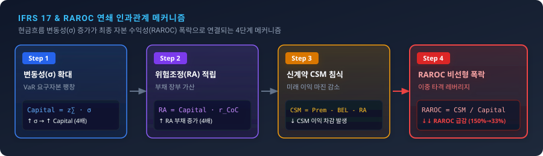

# 04 [실무 심화] 상품별 VaR 변동성과 자본비용법(CoC)을 활용한 위험조정(RAROC) 산출 실무

## 4.3 [수치적 예제] Step-by-Step RA 및 RAROC 산출 비교

---

### 도입

직전 절(4.1 및 4.2절)에서 우리는 비금융 리스크의 변동성($\sigma$)이 규제 요구자본($Capital = z_{\alpha} \cdot \sigma$)으로 변환되며, 이 요구자본에 자본비용률($r_{\text{CoC}}$)을 적용하여 K-IFRS 제1117호(IFRS 17) 재무상태표의 **위험조정(Risk Adjustment, RA)** 부채로 정량화되는 대수적 메커니즘을 확인했습니다.

그렇다면 이 회계적 부채 산출 체계는 보험회사의 경영 의사결정과 자본 효율성 평가에 어떻게 최종 결합될까요? 

계약 체결 시점에 인식되는 미래 이익의 원천인 **계약서비스마진(Contractual Service Margin, CSM)**과 부채 측면의 RA 산출을 넘어, 주주가 투입한 자본 대비 수익성을 종합 평가하는 경영 지표가 바로 **위험조정 수익률(Risk-Adjusted Return on Capital, RAROC)**입니다.

본 절에서는 동일한 수취 보험료와 최적추정부채(BEL)를 가지지만, 내재된 **현금흐름 변동성($\sigma$)만 서로 다른 두 상품(상품 A, 상품 B)**을 설정하고, 기초 데이터 수집부터 요구자본, RA, CSM, 그리고 최종 RAROC 도출까지의 과정을 Step-by-Step 형태로 정밀하게 해부합니다. 

이를 통해 명목 손익 관점에서는 동일해 보이던 두 상품이 IFRS 17 및 RAROC 관점에서 어떻게 자본 효율성의 극단적 격차를 나타내는지 검증하고, 실무에서 즉시 활용 가능한 **임계 변동성 한계값($\sigma_{\text{BEP}}$)** 공식을 유도합니다.

---

### 1. 추상보다 구체가 먼저: Step-by-Step 대조 데이터 및 산출 결과

분석을 위한 기초 데이터(Data Setting)는 다음과 같습니다. 두 상품 모두 고객으로부터 수취한 **보험료 현금흐름의 현재가치($PV(\text{Premium})$)는 1,200억 원**이며, 미래 지급될 보험금의 **최적추정 현금유출 부채(BEL)는 1,000억 원**으로 완벽히 동일합니다.

*   **수취 보험료 현재가치 ($PV(\text{Premium})$):** 1,200억 원
*   **최적추정 부채 ($BEL$):** 1,000억 원
*   **목표 신뢰수준 계수 ($z_{0.995}$, 99.5% VaR):** $2.58$ ($99.5\%$ 신뢰수준 하 정규분포 가정)
*   **자본비용률 ($r_{\text{CoC}}$):** 연 $5.0\%$ (단일 기간 단순화 기준)

두 상품의 단 하나의 차이점은 **미래 손해율 및 현금흐름의 표준편차($\sigma$)**입니다. 저변동성 상품인 **상품 A는 $\sigma = 50\text{억 원}$**, 고변동성 상품인 **상품 B는 $\sigma = 200\text{억 원}$**입니다.

#### [표 4-6] 상품 A와 상품 B의 Step-by-Step RA, CSM 및 RAROC 산출 대조표 (단위: 억 원)

| 계산 단계 | 산출 항목 | 대수적 수식 및 정의 | **상품 A (저변동성)** | **상품 B (고변동성)** | 격차 및 평가 |
| :---: | :--- | :--- | :---: | :---: | :--- |
| **[입력]** | 수취 보험료 PV | $PV(\text{Premium})$ | 1,200.00 | 1,200.00 | 동일 |
| **[입력]** | 최적추정 부채 | $BEL = PV(\text{Outflow})$ | 1,000.00 | 1,000.00 | 동일 |
| **[입력]** | 현금흐름 표준편차 | $\sigma$ | **50.00** | **200.00** | **4배 차이** |
| **Step 1** | **요구자본 ($Capital$)** | $z_{0.995} \cdot \sigma$ | **129.00** | **516.00** | **4배 팽창 (387억 증가)** |
| **Step 2** | **위험조정 ($RA$)** | $Capital \cdot r_{\text{CoC}}$ | **6.45** | **25.80** | **4배 팽창 (19.35억 증가)** |
| **Step 3** | **신계약 $CSM$** | $PV(\text{Premium}) - BEL - RA$ | **193.55** | **174.20** | **19.35억 감소 (이익 마진 침식)** |
| **Step 4** | **위험조정 수익률** | $RAROC = \frac{CSM}{Capital}$ | **150.04%** | **33.76%** | **116.28%p 폭락** |

위 대조표는 현금흐름 변동성($\sigma$)의 차이가 **요구자본($Capital$)과 위험조정 부채($RA$)를 동시에 4배로 증폭**시키고, 이것이 분자(신계약 CSM)를 차감함과 동시에 분모(요구자본)를 거대하게 부풀려 **최종 RAROC를 150.04%에서 33.76%로 폭락시키는 연쇄 도미노 메커니즘**을 수치적으로 명확히 보여줍니다.

---

### 2. 단계별(Step-by-Step) 연산 로직 및 물리적 의미 해부



<iframe src="contents/ifrs17_csm_risk_modeling/sec_04/assets/diagrams/sub_04_03_visual1.html" width="100%" height="560px" frameborder="0" scrolling="no"></iframe>

#### Step 1: VaR 기반 요구자본 ($Capital$) 산출
*   **공식:** $Capital = z_{\alpha} \cdot \sigma = 2.58 \cdot \sigma$
*   **상품 A:** $50\text{억 원} \cdot 2.58 = \mathbf{129.0\text{억 원}}$
*   **상품 B:** $200\text{억 원} \cdot 2.58 = \mathbf{516.0\text{억 원}}$
*   **물리적 해석:** 상품 B는 비상 충격 시 발생할 수 있는 극단적 손실(99.5% 신뢰수준)을 방어하기 위해, 회사 내부에 상품 A보다 **387억 원의 자본을 추가로 동결(Lock-in)**시켜야 합니다.

#### Step 2: 자본비용법(CoC) 기반 위험조정 ($RA$) 산출
*   **공식:** $RA = Capital \cdot r_{\text{CoC}} = Capital \cdot 5.0\%$
*   **상품 A:** $129.0\text{억 원} \cdot 5.0\% = \mathbf{6.45\text{억 원}}$
*   **상품 B:** $516.0\text{억 원} \cdot 5.0\% = \mathbf{25.80\text{억 원}}$
*   **물리적 해석:** 동결된 자본으로 인해 주주가 포기해야 하는 기회비용을 부채로 정량화한 수치입니다. 상품 B는 자본 동결량이 크기 때문에 **부채 장부에 19.35억 원의 RA를 추가로 적립**해야 합니다.

#### Step 3: K-IFRS 제1117호 신계약 계약서비스마진 ($CSM$) 산출
*   **공식:** $CSM_0 = \max\left(0, \; PV(\text{Premium}) - BEL_0 - RA_0\right)$
*   **전통적 예상 이익 (RA 미반영 시):** $1,200\text{억} - 1,000\text{억} = 200.0\text{억 원}$ (두 상품 동일)
*   **상품 A:** $1,200\text{억} - 1,000\text{억} - 6.45\text{억} = \mathbf{193.55\text{억 원}}$
*   **상품 B:** $1,200\text{억} - 1,000\text{억} - 25.80\text{억} = \mathbf{174.20\text{억 원}}$
*   **물리적 해석:** 최적추정 마진(200억 원) 중 위험을 담보하기 위해 차감된 $RA$를 제외한 순수 미실현 상각 이익입니다. 고변동성 상품 B는 $RA$ 부채 적립에 이익을 빼앗겨 **장부상 CSM이 19.35억 원 침식**됩니다.

#### Step 4: 위험조정 수익률 ($RAROC$) 도출
*   **공식:** $RAROC = \frac{\text{신계약 } CSM}{\text{요구자본 } (Capital)}$
*   **상품 A:** $\frac{193.55\text{억 원}}{129.0\text{억 원}} = \mathbf{150.04\%}$
*   **상품 B:** $\frac{174.20\text{억 원}}{516.0\text{억 원}} = \mathbf{33.76\%}$

여기서 분자($CSM$)는 **"자본이 창출하는 순수 회계적 미실현 이익"**을 나타내며, 분모($Capital$)는 **"이 이익을 얻기 위해 투입·동결된 물리적 자본의 제약량"**을 나타냅니다. 

전통적 관점(보험료 대비 명목 마진)에서는 두 상품 모두 동일한 200억 원의 예정이익을 제공하는 것처럼 보이지만, RAROC 관점에서는 **상품 A가 상품 B보다 무려 4.44배 뛰어난 자본 효율성**을 가집니다.

---

### 3. 자본 효율성 임계 한계값: 임계 표준편차($\sigma_{\text{BEP}}$) 유도

경영진이 신계약 인수 기준으로 **목표 RAROC(Hurdle Rate, $HR$)를 최소 50% 이상**으로 설정했다고 가정해 봅시다. 현금흐름의 표준편차($\sigma$)가 얼마를 초과할 때 상품의 RAROC가 목표 허들레이트 아래로 하락하게 될까요?

이를 수학적으로 유도하기 위해 RAROC 방정식을 $\sigma$에 대해 재정의합니다.

$$RAROC = \frac{PV(\text{Premium}) - BEL - (z_{\alpha} \cdot \sigma \cdot r_{\text{CoC}})}{z_{\alpha} \cdot \sigma} \ge HR$$

분모의 $(z_{\alpha} \cdot \sigma)$를 우변으로 넘겨 방정식을 정돈합니다.

$$PV(\text{Premium}) - BEL - z_{\alpha} \cdot \sigma \cdot r_{\text{CoC}} \ge HR \cdot z_{\alpha} \cdot \sigma$$

$$PV(\text{Premium}) - BEL \ge z_{\alpha} \cdot \sigma \cdot (r_{\text{CoC}} + HR)$$

이를 $\sigma$에 대해 정리하여 손익분기 임계 한계값 공식을 도출하면 다음과 같습니다.

$$\sigma_{\text{BEP}} = \frac{PV(\text{Premium}) - BEL}{z_{\alpha} \cdot (r_{\text{CoC}} + HR)}$$

#### 수치 대입 및 검증
*   $PV(\text{Premium}) - BEL = 200\text{억 원}$
*   $z_{0.995} = 2.58$
*   $r_{\text{CoC}} = 0.05$ (5%)
*   목표 허들레이트 ($HR$) = $0.50$ (50%)

$$\sigma_{\text{BEP}} = \frac{200\text{억 원}}{2.58 \cdot (0.05 + 0.50)} = \frac{200\text{억 원}}{2.58 \cdot 0.55} = \frac{200\text{억 원}}{1.419} \approx \mathbf{140.94\text{억 원}}$$

#### 경영적 해석 및 의사결정
현금흐름의 표준편차($\sigma$)가 **140.94억 원을 초과하는 순간, 해당 상품의 RAROC는 목표치인 50% 아래로 하락**합니다. 

따라서 상품 B($\sigma = 200\text{억 원}$)의 경우, 언더라이팅 가이드라인을 강화하거나 재보험(Reinsurance)을 출재하여 표준편차를 **140.94억 원 이하로 낮추거나 보험료를 인상하지 않는 한 인수 부적격 상품**으로 분류됩니다.

---

### 4. 파이썬(Python) 기반 Step-by-Step RAROC 및 민감도 분석 구현

다음 파이썬 코드는 본 절의 수치적 예제를 완벽히 재현하고, 표준편차($\sigma$) 변화에 따른 RAROC의 비선형 붕괴 곡선을 도출하는 정밀 시뮬레이션 파이프라인입니다.

```python
import numpy as np
import pandas as pd

# 1. 기초 데이터 및 산출 파라미터 정의
pv_premium = 1200.0   # 수취 보험료 PV (억 원)
bel_0 = 1000.0        # 최적추정 부채 BEL (억 원)
z_alpha = 2.58        # 99.5% VaR 계수
r_coc = 0.05          # 자본비용률 (5%)

# 상품별 변동성 데이터
std_A = 50.0          # 상품 A 표준편차 (억 원)
std_B = 200.0         # 상품 B 표준편차 (억 원)

# 2. Step-by-Step RAROC 산출 파이프라인 함수
def calculate_raroc_pipeline(pv_prem, bel, std_dev, z_score, coc):
    req_capital = z_score * std_dev                             # Step 1: 요구자본
    ra_val = req_capital * coc                                  # Step 2: 위험조정(RA)
    csm_val = max(0.0, pv_prem - bel - ra_val)                  # Step 3: 신계약 CSM
    raroc_val = (csm_val / req_capital) if req_capital > 0 else 0.0 # Step 4: RAROC
    
    return {
        "Req_Capital": req_capital,
        "RA": ra_val,
        "CSM": csm_val,
        "RAROC_%": raroc_val * 100.0
    }

# 3. 상품 A 및 상품 B 산출
res_A = calculate_raroc_pipeline(pv_premium, bel_0, std_A, z_alpha, r_coc)
res_B = calculate_raroc_pipeline(pv_premium, bel_0, std_B, z_alpha, r_coc)

df_summary = pd.DataFrame([res_A, res_B], index=["상품 A (저변동성)", "상품 B (고변동성)"])
print("=== [Step-by-Step IFRS 17 & RAROC 산출 결과] ===")
print(df_summary.round(2).to_string())

# 4. 임계 변동성(sigma_BEP) 및 민감도 분석 스위프 (표준편차 20억~220억 원)
hurdle_rate = 0.50  # 50% 허들레이트
sigma_bep = (pv_premium - bel_0) / (z_alpha * (r_coc + hurdle_rate))

print(f"\n[목표 RAROC {hurdle_rate*100:.1f}% 달성을 위한 임계 표준편차(sigma_BEP)]: {sigma_bep:.2f} 억 원")

# 민감도 테이블 생성
sigmas = np.arange(20, 221, 40)
sensitivity_list = []

for s in sigmas:
    res = calculate_raroc_pipeline(pv_premium, bel_0, s, z_alpha, r_coc)
    res["Sigma"] = s
    sensitivity_list.append(res)

df_sens = pd.DataFrame(sensitivity_list)[["Sigma", "Req_Capital", "RA", "CSM", "RAROC_%"]]
print("\n=== [변동성(Sigma) 증가에 따른 RAROC 비선형 붕괴 스케일] ===")
print(df_sens.round(2).to_string(index=False))
```

#### 파이썬 코드 실행 결과 및 분석

```text
=== [Step-by-Step IFRS 17 & RAROC 산출 결과] ===
                 Req_Capital     RA     CSM  RAROC_%
상품 A (저변동성)       129.0   6.45  193.55   150.04
상품 B (고변동성)       516.0  25.80  174.20    33.76

[목표 RAROC 50.0% 달성을 위한 임계 표준편차(sigma_BEP)]: 140.94 억 원

=== [변동성(Sigma) 증가에 따른 RAROC 비선형 붕괴 스케일] ===
 Sigma  Req_Capital    RA    CSM  RAROC_%
    20         51.6  2.58 197.42   382.60
    60        154.8  7.74 192.26   124.20
   100        258.0 12.90 187.10    72.52
   140        361.2 18.06 181.94    50.37
   180        464.4 23.22 176.78    38.07
   220        567.6 28.38 171.62    30.24
```

민감도 출력 결과를 살펴보면, 현금흐름 변동성($\sigma$)이 20억 원에서 220억 원으로 증가함에 따라 요구자본은 선형적으로 팽창($51.6\text{억} \rightarrow 567.6\text{억}$)하지만, **RAROC는 382.60%에서 30.24%로 급격한 비선형 붕괴 현상**을 보입니다. 

이는 변동성 증가가 분자($CSM$)를 차감함과 동시에 분모($Capital$)를 거대하게 증폭시키는 **이중 타격 레버리지 효과**를 발생시키기 때문입니다.

---

### 요약 및 핵심 포인트

1. **Step-by-Step 연쇄 인과관계:** 현금흐름 변동성($\sigma$)의 확대는 $\text{요구자본 } 팽창 \rightarrow \text{RA 부채 } 증대 \rightarrow \text{신계약 CSM } 침범 \rightarrow \text{RAROC } 폭락으로 이어지는 선형·비선형 완결 구조를 가집니다.
2. **명목 이익과 자본 수익성의 괴리:** 수취 보험료와 최적추정 부채(BEL)가 완벽히 동일하더라도, 변동성 차이로 인해 상품 B는 상품 A 대비 요구자본이 4배 팽창하고 RAROC는 1/4 수준으로 급감합니다.
3. **임계 변동성 한계값($\sigma_{\text{BEP}}$):** 목표 허들레이트($HR$)를 충족하는 최대 허용 변동성 공식($\sigma_{\text{BEP}} = \frac{PV(\text{Premium}) - BEL}{z_{\alpha} \cdot (r_{\text{CoC}} + HR)}$)을 활용하여 언더라이팅 수락 및 재보험 출재의 정량적 기준을 수립할 수 있습니다.
4. **자본 효율성 중심의 의사결정:** K-IFRS 제1117호 체계에서는 단순 명목 마진이나 매출 규모가 아닌, **자본 대비 수익성(RAROC)**을 최우선 기준으로 삼아 상품 포트폴리오를 재편해야 합니다.