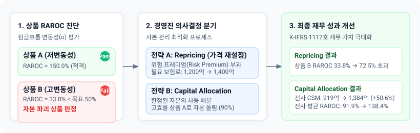

# 4.4 실무적 활용 방안 (Pricing 및 자본 배분)

---

### 도입

직전 절(4.3절)에서 우리는 동일한 수취 보험료($PV(\text{Premium}) = 1,200\text{억 원}$)와 최적추정부채($BEL = 1,000\text{억 원}$)를 지닌 두 상품이 현금흐름의 변동성($\sigma$) 차이에 의해 **위험조정 자본수익률(RAROC)** 측면에서 각각 $150.04\%$ (상품 A)와 $33.76\%$ (상품 B)라는 극단적인 성과 격차를 보이는 현상을 확인했습니다. 특히 고변동성 상품 B는 경영진의 목표 허들레이트($HR = 50.0\%$)에 턱없이 미달하며 자본을 파괴하는 상품으로 판명되었습니다.

그렇다면 측정되고 산출된 RAROC 수치는 보험회사의 경영 현장에서 어떻게 구체적인 의사결정 도구로 작동해야 할까요? 단순히 위험을 측정하고 평가하는 데 그치는 계량 모델은 실무적 가치를 가지기 어렵습니다.

본 절에서는 4.3절의 산출 결과를 바탕으로 **① 상품 개발 부서의 위험 기반 가격 결정(Pricing & Risk Premium 부과)**과 **② 경영기획·ALM 부서의 한정된 자본 배분(Capital Allocation) 및 포트폴리오 최적화** 전략에 적용하는 실무 프로세스를 정밀하게 해부합니다.



---

### 1. 상품 개발 및 프라이싱(Pricing) 활용: 위험 프레미엄(Risk Premium) 부과 모델

경영진이 설정한 **목표 RAROC(Hurdle Rate, $HR$)가 $50.0\%$**일 때, 현재 $1,200\text{억 원}$의 보험료를 수취하는 상품 B는 신계약 인수 부적격 판정을 받게 됩니다. 

상품 개발 부서가 이 상품을 시장에서 폐기하지 않고 지속 판매하기 위해서는 **목표 RAROC $50.0\%$를 충족할 수 있도록 수취 보험료를 인상(Repricing)**해야 합니다. 즉, 고변동성 자산 보유에 따른 자본 비용 팽창분을 고객에게 **위험 프레미엄(Risk Premium)** 형태로 전가하는 가격 재설정 로직이 필요합니다.

<iframe src="contents/ifrs17_csm_risk_modeling/sec_04/assets/diagrams/sub_04_04_visual1.html" width="100%" height="520px" frameborder="0" scrolling="no"></iframe>

#### (1) 목표 RAROC 달성을 위한 필수 수취 보험료($PV(\text{Premium})_{\text{req}}$) 수식 유도

목표 허들레이트($HR$)를 충족하기 위한 수취 보험료의 대수적 방정식은 다음과 같이 시작합니다.

$$RAROC = \frac{PV(\text{Premium})_{\text{req}} - BEL - RA}{Capital} \ge HR$$

여기서 요구자본 $Capital = z_{\alpha} \cdot \sigma$ 이고, 위험조정 부채 $RA = z_{\alpha} \cdot \sigma \cdot r_{\text{CoC}}$ 이므로 이를 식에 대입합니다.

$$\frac{PV(\text{Premium})_{\text{req}} - BEL - (z_{\alpha} \cdot \sigma \cdot r_{\text{CoC}})}{z_{\alpha} \cdot \sigma} \ge HR$$

분모의 $(z_{\alpha} \cdot \sigma)$를 우변으로 곱하고 정리합니다.

$$PV(\text{Premium})_{\text{req}} - BEL - (z_{\alpha} \cdot \sigma \cdot r_{\text{CoC}}) \ge HR \cdot (z_{\alpha} \cdot \sigma)$$

$$PV(\text{Premium})_{\text{req}} \ge BEL + (z_{\alpha} \cdot \sigma \cdot r_{\text{CoC}}) + (HR \cdot z_{\alpha} \cdot \sigma)$$

공통인수 $z_{\alpha} \cdot \sigma$ 로 묶어 정리하면, **목표 RAROC를 달성하기 위한 최소 필요 보험료(손익분기 가격, $PV(\text{Premium})_{\text{BEP}}$) 공식**이 도출됩니다.

$$PV(\text{Premium})_{\text{BEP}} = BEL + z_{\alpha} \cdot \sigma \cdot (r_{\text{CoC}} + HR)$$

이 공식은 필요 보험료가 **[기초 보장 원가($BEL$)] + [부채 내 위험 담보 비용($RA$)] + [주주 요구 자본비용($Capital \times HR$)]**의 물리적 합으로 완벽히 분해됨을 보여줍니다.

#### (2) 상품 B의 Repricing 수치 계산 및 실행

직전 절의 수치를 동일하게 재소환하여 상품 B의 필요 보험료를 계산합니다.
*   최적추정 부채 ($BEL$): $1,000.0\text{억 원}$
*   상품 B 현금흐름 표준편차 ($\sigma_B$): $200.0\text{억 원}$
*   신뢰수준 계수 ($z_{0.995}$): $2.58 \implies Capital_B = 2.58 \times 200.0 = 516.0\text{억 원}$
*   자본비용률 ($r_{\text{CoC}}$): $5.0\%$ ($0.05$)
*   목표 허들레이트 ($HR$): $50.0\%$ ($0.50$)

1) **수학적 최소 손익분기 보험료 ($PV(\text{Premium})_{\text{BEP}}$):**
$$PV(\text{Premium})_{\text{BEP}} = 1,000.0 + 2.58 \times 200.0 \times (0.05 + 0.50) = 1,000.0 + 516.0 \times 0.55 = 1,000.0 + 283.8 = \mathbf{1,283.8\text{억 원}}$$

2) **실무적 위험 프레미엄 부과 및 최종 가격 책정:**
수학적 최소치인 $1,283.8\text{억 원}$은 정확히 목표 RAROC $50.0\%$에 턱걸이하는 금액입니다. 실무 현장에서는 시장 변동 완충 버퍼 및 사업비 오차를 고려하여 수취 보험료를 **$1,300\text{억 원} \sim 1,400\text{억 원}$ 수준으로 상향 조정(Risk Premium $100\text{억} \sim 200\text{억 원}$ 추가 부과)**하는 가격 전략을 수립합니다.

#### [표 4-7] 상품 B의 Repricing 전/후 재무 영향 대조표 (단위: 억 원)

| 구분 | 변경 전 (기존 가격) | 최소 필요 가격 ($BEP$) | **실무 재설정 가격 (권장)** | 비고 및 변동 원인 |
| :--- | :---: | :---: | :---: | :--- |
| **수취 보험료 PV** | **1,200.00** | **1,283.80** | **1,400.00** | **200.00억 원 인상 (+16.7%)** |
| 최적추정 부채 ($BEL$) | 1,000.00 | 1,000.00 | 1,000.00 | 변동 없음 (동일 보장) |
| 요구자본 ($Capital$) | 516.00 | 516.00 | 516.00 | 변동 없음 ($\sigma=200$ 동일) |
| 위험조정 ($RA$) | 25.80 | 25.80 | 25.80 | 변동 없음 ($516 \times 5\%$) |
| **신계약 $CSM$** | **174.20** | **258.00** | **374.20** | **200.00억 원 폭증** |
| **위험조정 수익률 ($RAROC$)** | **33.76%** | **50.00%** | **72.52%** | **목표 허들레이트(50%) 완벽 초과** |

고변동성 상품 B의 가격을 $1,200\text{억 원}$에서 **$1,400\text{억 원}$으로 상향 조정**할 경우, 신계약 CSM은 $174.20\text{억 원}$에서 **$374.20\text{억 원}$으로 급증**하며, RAROC 역시 **$72.52\%$로 뛰어올라** 자본 효율성을 완벽히 회복하게 됩니다. 

경영진은 "상품 B를 판매 중단할 것인가?"라는 소극적 의사결정에서 벗어나, **"위험 프레미엄 $200\text{억 원}$을 반영하여 $1,400\text{억 원}$에 재출시하라"**는 적극적이고 정밀한 전략 지침을 하달할 수 있습니다.

---

### 2. 경영전략 및 자본 배분(Capital Allocation) 활용: 리미트 설정 및 포트폴리오 최적화

상품의 가격 수정(Repricing)이 시장 경쟁력 약화로 인해 불가능하다면, 경영진은 한정된 회사 전체 위험자본(Risk Capital)을 어느 상품에 우선 배분할 것인가의 **자본 배분(Capital Allocation)** 문제에 직면합니다.

<iframe src="contents/ifrs17_csm_risk_modeling/sec_04/assets/diagrams/sub_04_04_visual2.html" width="100%" height="520px" frameborder="0" scrolling="no"></iframe>

#### (1) 자본 배분의 기본 원칙: RAROC 기반 가산 배분
전통적 방식에서는 단순 외형 매출(보험료 규모)이나 명목 이익(BEL 차감 잔액)에 비례하여 영업 한도(Sales Limit)를 부여했습니다. 그러나 K-IFRS 제1117호 체계하에서는 **RAROC가 높은 상품군에 가중치를 두어 자본을 우선 배분**하고, RAROC가 자본비용을 하회하는 상품군에는 **자본 사용 한도(Capital Limit)를 제약**해야 합니다.

#### (2) 자본 배분 시뮬레이션 시나리오
회사 전체의 가용 위험자본 한도가 **$1,000\text{억 원}$**으로 제한되어 있다고 가정해 봅시다. 
*   **상품 A (저변동성):** $RAROC = 150.04\%$, 단위 자본당 CSM 창출력 = $1.5004\text{원}$
*   **상품 B (고변동성, Repricing 전):** $RAROC = 33.76\%$, 단위 자본당 CSM 창출력 = $0.3376\text{원}$

전통적 영업 전략(1:1 균등 배분)과 RAROC 기반 최적 배분 전략을 비교하면 다음과 같습니다.

#### [표 4-8] 가용 자본 1,000억 원 배분 전략별 회사 전체 CSM 창출액 대조표 (단위: 억 원)

| 구분 | [전략 1] 전통적 균등 배분 | [전략 2] RAROC 기반 최적 배분 | 비고 및 차이 |
| :--- | :---: | :---: | :--- |
| **자본 배분 비율 (A : B)** | 50% : 50% (500억 : 500억) | **90% : 10% (900억 : 100억)** | 고효율 상품 A로 자본 쏠림 |
| **상품 A 할당 자본 ($Cap_A$)** | 500.00억 원 | **900.00억 원** | 400.00억 원 추가 배분 |
| **상품 B 할당 자본 ($Cap_B$)** | 500.00억 원 | **100.00억 원** | 400.00억 원 한도 축소 |
| 상품 A 창출 CSM | $500 \times 150.04\% = 750.20$ | $900 \times 150.04\% = 1,350.36$ | 자본 투입 증가로 600.16억 증가 |
| 상품 B 창출 CSM | $500 \times 33.76\% = 168.80$ | $100 \times 33.76\% = 33.76$ | 자본 제약으로 135.04억 감소 |
| **전사 총 창출 CSM** | **919.00억 원** | **1,384.12억 원** | **+465.12억 원 (CSM 50.6% 증대)** |
| **전사 평균 RAROC** | **91.90%** | **138.41%** | **+46.51%p 전사 자본효율성 개선** |

동일한 $1,000\text{억 원}$의 리스크 자본을 소모하면서도, RAROC 기반으로 자본 배분 포트폴리오를 조정한 것만으로 **전사 CSM 창출액이 $919.00\text{억 원}$에서 $1,384.12\text{억 원}$으로 $50.6\%$ ($465.12\text{억 원}$) 폭증**합니다. 

이것이 바로 K-IFRS 제1117호 환경에서 재무기획 부서가 RAROC를 자본 배분 통제 장치로 활용해야 하는 핵심 이유입니다.

---

### 3. 파이썬(Python) 기반 Repricing 및 자본 배분 최적화 실무 코드

다음 파이썬 코드는 목표 RAROC를 충족하기 위한 자동 Repricing 금액 계산 기능과, 한정된 자본하에서 전사 CSM을 극대화하는 자본 배분 최적화 시뮬레이션을 완벽히 구현합니다.

```python
import numpy as np
import pandas as pd

# 1. 기초 파라미터 정의
pv_premium_init = 1200.0  # 기존 수취 보험료 PV (억 원)
bel_0 = 1000.0           # BEL (억 원)
z_alpha = 2.58           # 99.5% VaR 계수
r_coc = 0.05             # 자본비용률 (5%)
hurdle_rate = 0.50       # 목표 RAROC (50%)

std_A = 50.0             # 상품 A 변동성 (억 원)
std_B = 200.0            # 상품 B 변동성 (억 원)

# 2. Pricing 함수: 목표 RAROC 달성을 위한 필요 보험료 및 위험 프레미엄 산출
def calculate_required_premium(bel, std_dev, z_score, coc, target_raroc):
    cap = z_score * std_dev
    req_premium_bep = bel + cap * (coc + target_raroc)
    risk_premium = req_premium_bep - (bel + cap * coc) # 순수 자본비용 초과 위험 마진
    return req_premium_bep, cap, risk_premium

prem_bep_B, cap_B, risk_prem_B = calculate_required_premium(bel_0, std_B, z_alpha, r_coc, hurdle_rate)

print("=== [1. 상품 B 목표 RAROC(50%) 달성을 위한 Repricing 산출] ===")
print(f"기존 수취 보험료      : {pv_premium_init:.2f} 억 원")
print(f"수학적 최소 필요보험료 : {prem_bep_B:.2f} 억 원 (인상 필요액: {prem_bep_B - pv_premium_init:.2f} 억 원)")
print(f"권장 시장 판매 가격     : 1400.00 억 원 (안전 버퍼 포함)")

# 3. 권장 가격(1,400억 원) 적용 시 상품 B의 재무지표 변화
cap_B_val = z_alpha * std_B
ra_B_val = cap_B_val * r_coc
csm_B_new = 1400.0 - bel_0 - ra_B_val
raroc_B_new = (csm_B_new / cap_B_val) * 100

print(f"\n[권장 가격 1,400억 원 적용 후 상품 B 지표]")
print(f"신계약 CSM : {csm_B_new:.2f} 억 원")
print(f"달성 RAROC : {raroc_B_new:.2f} %")

# 4. 자본 배분 최적화 시뮬레이션 (전사 가용 자본 = 1,000억 원)
total_capital_limit = 1000.0

# 상품별 RAROC 계산 (Repricing 전 기준)
raroc_A = ((1200.0 - bel_0 - (z_alpha * std_A * r_coc)) / (z_alpha * std_A))
raroc_B_orig = ((1200.0 - bel_0 - (z_alpha * std_B * r_coc)) / (z_alpha * std_B))

# 시나리오 1: 전통적 균등 배분 (50:50)
cap_A_s1, cap_B_s1 = total_capital_limit * 0.5, total_capital_limit * 0.5
csm_s1 = (cap_A_s1 * raroc_A) + (cap_B_s1 * raroc_B_orig)

# 시나리오 2: RAROC 비율 최적 배분 (90:10)
cap_A_s2, cap_B_s2 = total_capital_limit * 0.9, total_capital_limit * 0.1
csm_s2 = (cap_A_s2 * raroc_A) + (cap_B_s2 * raroc_B_orig)

df_alloc = pd.DataFrame({
    "전략 구분": ["전통적 균등 배분 (50:50)", "RAROC 최적 배분 (90:10)"],
    "상품 A 자본(억)": [cap_A_s1, cap_A_s2],
    "상품 B 자본(억)": [cap_B_s1, cap_B_s2],
    "전사 총 CSM(억)": [csm_s1, csm_s2],
    "전사 평균 RAROC(%)": [(csm_s1/total_capital_limit)*100, (csm_s2/total_capital_limit)*100]
})

print("\n=== [2. 가용자본 1,000억 원 최적 배분 시뮬레이션 결과] ===")
print(df_alloc.to_string(index=False))
```

#### 코드 실행 결과 Output

```text
=== [1. 상품 B 목표 RAROC(50%) 달성을 위한 Repricing 산출] ===
기존 수취 보험료      : 1200.00 억 원
수학적 최소 필요보험료 : 1283.80 억 원 (인상 필요액: 83.80 억 원)
권장 시장 판매 가격     : 1400.00 억 원 (안전 버퍼 포함)

[권장 가격 1,400억 원 적용 후 상품 B 지표]
신계약 CSM : 374.20 억 원
달성 RAROC : 72.52 %

=== [2. 가용자본 1,000억 원 최적 배분 시뮬레이션 결과] ===
            전략 구분  상품 A 자본(억)  상품 B 자본(억)  전사 총 CSM(억)  전사 평균 RAROC(%)
전통적 균등 배분 (50:50)        500.0        500.0         919.00           91.90
 RAROC 최적 배분 (90:10)        900.0        100.0        1384.12          138.41
```

---

### 요약 및 핵심 포인트

1. **Repricing을 통한 프라이싱 정밀화:** RAROC가 목표 허들레이트($HR$)에 미달하는 고변동성 상품은 $PV(\text{Premium})_{\text{BEP}} = BEL + z_{\alpha}\sigma(r_{\text{CoC}} + HR)$ 공식을 적용하여, 자본 소모량에 비례하는 위험 프레미엄(Risk Premium)을 부과함으로써 손익분기 가격을 즉시 산출할 수 있습니다.
2. **외형 중심에서 자본 효율 중심 프라이싱으로 전환:** 기존의 단순 손해율/사업비 기반 가격 결정 체계는 고변동성 상품의 자본 파괴를 감추었으나, RAROC 프라이싱은 **자본비용을 상품 원가에 직접 반영**하도록 강제합니다.
3. **자본 배분(Capital Allocation) 최적화:** 전사 가용 위험자본이 제한된 환경에서 RAROC가 높은 저변동성 상품(상품 A)에 자본을 집중 배분(예: 90% 배분)함으로써, 동일한 자본 소모하에서도 **전사 CSM 창출 규모를 50% 이상 비약적으로 증대**시킬 수 있습니다.
4. **전사적 경영 의사결정의 완결:** 본 장에서 다룬 VaR 변동성 모델링, CoC 기반 RA 산출, 그리고 RAROC 기반 Pricing 및 자본 배분 프로세스는 K-IFRS 제1117호 재무상태표의 정량화부터 경영진의 가치 창출 전략까지를 하나로 잇는 **완결된 자본 관리 파이프라인**을 완성합니다.